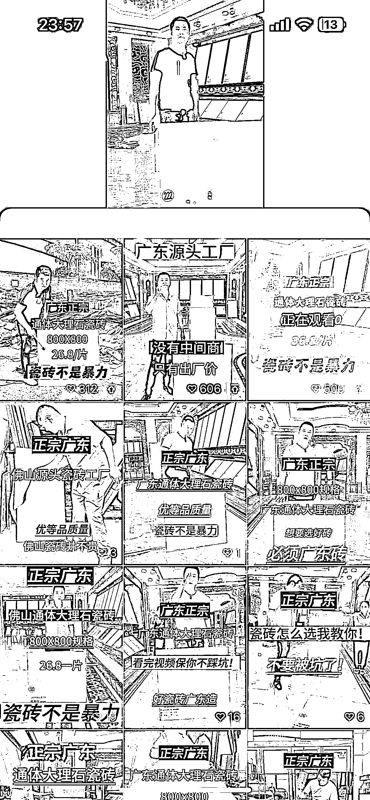
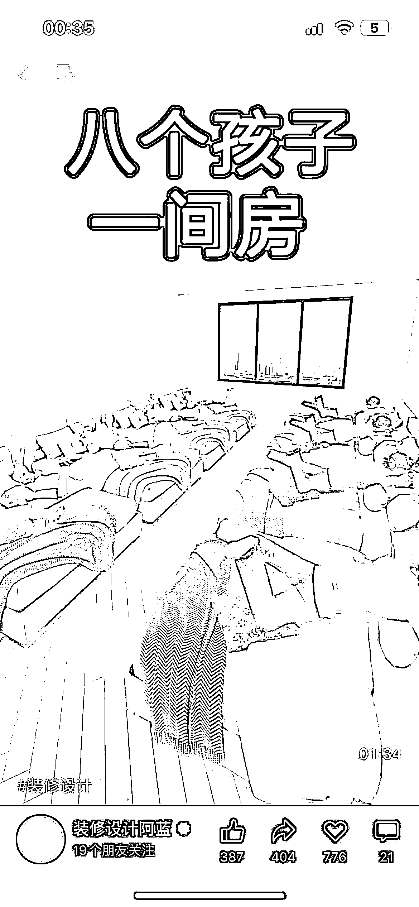

# 小众项目如何拿下线上市场？利用矩阵获取流量，引流私域成交

> 原文：[`www.yuque.com/for_lazy/thfiu8/mam7kgd3zwyuiram`](https://www.yuque.com/for_lazy/thfiu8/mam7kgd3zwyuiram)

## (36 赞)小众项目如何拿下线上市场？利用矩阵获取流量，引流私域成交

作者： 阿山

日期：2023-10-26

一个账号不行，就多做几个账号。一个平台不行，那就搞多个平台。

传统实体行业，尤其是做高客单的，都可以试试在线上做矩阵，扩大曝光引流获客。

我做家具实体一年多，只靠线下其实赚得并不多，一直不温不火的。后来尝试在线上找突破口，通过闲鱼、视频号、小红书、抖音等平台引流，第一次就尝到了甜头，一天最高引进私域 120+人，单月纯利润能做到 3-5 万左右。

如何引流？引流到私域后如何成交？接下来，和大家简单分享从线下转到线上，精准获客，高效转化的经验。

简单地说一下我的情况吧，我是 21 年 9 月退伍，22 年年初开始接触家具实体店行业，刚开始也是在小区返迁房，商品房里面跑业务。

由于地理位置离南康比较近，客户大部分都是自己去南康购买家具，每个月的业绩不温不火，勉强解决温饱。

于是开始寻求突破，尝试去做闲鱼和其他平台，下面就直接步入正题吧。

### 一、项目优势

全平台引流家具粉，我们这边拥有的优势

**1、产品价格的优势：**

做家具实体行业一年多，积累了厂家渠道，对于家具的材质，相关知识，价格行情有基本的了解，背靠南康家具市场，厂家货源完善，对比广东厂家，更有价格优势。

**2、物流的优势：**

多家电商物流联盟，不管是南康还是广东发货，给我一个地址都能给你配送安装到家。发往海外快递，物流依旧畅通无阻。在物流运输成本上面，合作物流收费是经销商和零售客户的 85 折左右，并且是五包服务，售后服务有兜底。

**3、资金链的优势：**

合作的厂家给我的结款方式都是半月结和月结，资金缓冲周期就更长。例如，客户购买家具总额 1 万，预付 5 千定金，我们下单生产，7-10 天左右出货送物流开单结清尾款，利润率在家具总额的百分 20-30 左右。

回款周期快，风险系数小。

**4 、后端转换的优势：**

源头工厂产品的尺寸颜色布料都可以定做，满足客户各种需求。有软体实木，意式，美式，新中式，上千款式家具给客户选择，产品图册价格表一目了然。

### 二、前端流量获取

主要是做闲鱼，小红书，视频号 3 个平台，抖音，快手顺带着发布钩子。每个平台获取流量方式不同，相同的都是先找到 10 个对标账号去分析去模仿去做矩阵

**1、闲鱼**

去年 10 月份接触，到今年 1 月份，4 个月时间主要是以卖尾货和实木家具为主，平均利润在百分 20 左右，平台今年新政策 1 个点手续费和必须给解决售后问题，回款周期在 25 天左右。

大多数客户都是贪便宜捡漏，低端家具会更好卖一些，可以对标一个微信号（私我）去模仿品。给客户适当低价引流到私域成交最好，避免麻烦事。

4 个月变现 5 万多点，电商第一次尝试到甜头。

**2、视频号**

视频号引流的方法给感谢许总分享给我的，去年 11 月份发给我时候没有怎么在意，过完年 1 月底开始测试方法，当天爆了 100 多微信。

一直用到 7 月份，视频号官方平台对硬广告图文流量进行限制，一共是加了 1.3 万左右的家具粉私域，长周期去转换，平均人头利润在 100 左右，最屌的一单是一个外贸单总价 8 万，那天还开了两个其他单子一起利润有 2 个多。

目前平台提倡真人出镜短视频，重心也要转移过去更换素材。

**3、小红书**

小红书引流到私域目前很恶心，没有亲爸爸视频号那样可以直接发微信号，不给钱就使坏。

我的解决方法是，1 拖 4，一个企业认证投放聚光进白名单，统一拉进蓝 V 号群，认证号直接群里甩微信。

聚光投放直接烧客咨，费用比较高，日均 500 左右，平均一个微信人头 130 左右成本，总的来说还是能有利润，但是成本还是比较高的。

**4、抖音，快手**

老平台了，现在进场没什么意思，直播竞争都那么激烈，想分杯羹很难。每天随缘发素材，佛系接单就好。

目前除了视频号其他的流量成本越来越贵，越来越难做。还有一些小平台可以获取流量但是效果不明显。

### 三、后端私域运营

在开始做的时候我用的是退伍前拍的照片，当时就有很多人问我是不是当过兵怎么的，老百姓对于这一块比较信任，也促进了不少单子成交。私域运营个人感觉一定要有人设，有生活，有情感，有产品，不是单一的每天朋友圈去打产品广告。

产品谁家都有，能对比的只有价格，多晒一些和客户的成交记录，聊天记录，售后时态度。

不是冰冷冷的产品介绍，客户可能会暂时被价格吸引到，但是影响成交的一定是服务态度，客户和你语音说就立马回语音，能语音说就不要打字，通过语音能更好反馈一个人需求和情绪。

每天发布的朋友圈数量在 5-8 条左右，实在没什么素材发的，自己拿两个手机编辑做出来总会吧。

### 四、货源从哪里来

货源，我是自己有做家具实体店的经验，所以货源都有长期合作，这个不担心。新手小白或者外地的经销商，对于家具没有经验的，厂家提供价格会略高一百甚至几百。

我们本地的，价格稍微高一些，立马找别人拿货，大概行情也更清楚，好的货源渠道给自己摸索，很可能我们的零售价就是你拿的批发价，因为我也没少卖给装修公司和经销商，这里面水深着。

如果自己想做家具这一块的，要找货源给自己去南康或者佛山市场上问，每年的展销会大把厂家出来找客户自己辨别好来，散客和代卖价格都是有差别的，自己以前找不到货时候也都会去找代卖拿货。

### 五、项目门槛

1.相关行业知识（小白需要有人带 2 个月左右，不然自己很难上手）

2.厂家渠道和物流（这个完全需要自己去市场上找，或者有现成的）

3.营业执照和收款码（注册地南康或者赣州，类目家具，方便打造厂家人设）

4.设备数量（最少 5 部以上开始运营）

5.资金要求（10 万左右启动资金，办理可以信用卡解决）

总的来说这些零售客户是一次性生意，投入小利润大有价格优势。专门做提篮子或者经销商的话，放低利润，长久生意用量取胜。

### 六、高客单价如何做私域

现在各个平台的流量获取成本越来越贵，淘宝需要开通直通车，小红书需要聚光投放，要想分杯羹只会越来越难，那我们应该怎么样去做？

**1、找好产品**

客单价不能低于 1000，利润不要低于 200，服务一个人的时间成本和服务十个人的时间成本是一样的，我们想要做到人效最大化，那一定要做好最开始的选品，选品和客单价直接决定了你的利润空间。

要想选好品，我们就先去看看对标行业的头部 IP，用小号去加他们，多加几个看看他们的视频引流素材能不能进行复制？朋友圈营造能不能直接搬运？成交话术能不能够套用？

产品价格表有没有相同的货源能够用，甚至在他们货盘价格表上面直接修改价格，对比他们的卖价，定好自己定价格表。

**2、什么样的产品适合做私域**

1.高客单价

2.高利润

3.有复购转介绍

4.运营成本低

例如：知识付费，高仿鞋包，白酒茶叶，奢侈品，家装建材，出国留学，法律顾问

自己喜欢什么品，适合什么。要根据自己实际情况来，任何行业和项目都是二八定律，有做的好的也有做的差的，多反思一下为什么别人做的好，和他们相比差些什么？

**3、怎么样获取流量**

**建立自己的素材库**

获取流量的方法都是相通的，需要解决的问题是：找到适合自己行业的对标账号去分析去模仿他们的素材，建立并整理好属于自己的素材库，标题库，文案库，素材的质量直接决定了你视频播放量，获取的流量多少。

这个是最关键的，也要跟随平台不同去做出素材调整，比如小红书适合图文，视频号适合真人出镜，不同平台素材可以弄不同的，当然最好是一个素材可以全平台同步去发。

发布的顺序我这边是先抖音快手，再视频号，最后小红书。素材能搬运过来二创就不要原创，节约时间成本。

**每天坚持发布视频**

发布多少合适呢？

有的人一天一部手机发布 4 个视频，别人一天 10 个手机发布 30 个视频，当然是后者流量更多啦。要想获取更多流量那肯定是要通过矩阵去放大，单独那么几个手机是没有什么作用的。

视频质量也不需要那么高，100 分做个 60.70 分就行啦，有的人辛辛苦苦拍半天视频该没流量还是没流量。用数量去打败玄学，去怼流量，每天坚持发，一个月不爆的账号注销重来。

**付费获取流量**

付费流量我现在是只投小红书的聚光，总的给我感觉抖音快手有自己的直播带货，能够引领到私域成交的可能性越来越低，视频号爸爸的流量还是可以的不是那么透明，但是付费投流过效果不大，还是没有自然流量跑的多。

小红书今年的目标是上市，相对去年来说导流只会越来越困难，我也不指望有什么爆文的出现，直接粗暴用硬广告封面去投流，也别心存幻想不想限流封号，该交的保护费交的去吧，赚到钱了就别想着白嫖，老老实实向平台低头。

**4、怎么样去转换**

任何生意的本质都是流量，有流量你可以翻云覆雨，没有你流量狗屁不是。只要流量足够大，打造好自己的朋友圈 5 件套，做一份价格表，客户加上来以后直接甩一份过去让自己看，有需求的自己都会找过来，重点是流量，流量从哪里来！

### 七、举例拆解

**1、瓷砖行业**

对标账号，视频号：佛山弘邦瓷砖工厂销售总监尹强。

这个是我之前拿出来给我徒弟分析过的一个账号，我们也可以打开视频号搜索看一下他账号，首先人设头像加上主页留下自己的联系方式。

视频素材做的是真人出镜的，视频号平台也是大力推荐真人出镜，我之前用的是硬广告价格吸引，现在行不通了，所以不拿出来抛析。

他发布的视频是大字体吸引人，报价格，大多数没有什么流量的，但是就是这种低质量视频，矩阵批量去做，总有一个能爆，爆发出来几十万的播放量，几百个客咨就来了。

只需要有一个小展厅，真人出镜就可以快速制造出这种视频。平均一个瓷砖客单价 1-1.2 万左右，利润在 1 到 2 千，做好价格表，承接到私域以后慢慢沉淀转换。

**2、装修行业**

这个行业也是朋友问我，我才去关注怎么做这个流量，装修行业有所不同，分为设计和施工，因为地域不同，施工不好掌控。出设计时间周期短，变现效率快，施工的话周期长利润大，所以我更推荐去做设计方案。

对标帐号、视频号：装修设计阿蓝

一样的去分析这个账号，可以发现这哥们的素材还是比较牛逼的，一般装修行业的素材可以在抖音，住小帮和小红书上面找，我也不知道哪里有这样的素材毕竟不是这个行业的，但是我会扒会去修改 MD5 值就可以了。

我是直接用龙猫工具大师（开通了永久会员）把视频分享给后台直接扒下来，也有类似的小程序收费的扒视频号视频工具。视频批量扒完以后手动掐头去尾，抽帧，画中画，反转，特效，转场，快慢放去重好，一样的方式。

视频号上面找到牛逼的素材就直接搬运下来，二次创作接着发。这边还需要准备好自己的是自己设计收费表，以及营业执照和商家收款码，更好的建立信任度去做成交。

通过一个点去扩大到一个面，做私域的方法都是相通的，我们需要考虑的是什么样的素材，发布到哪些平台，可以高效的去获取到流量。

多看同行，同行才是最好的老师。有流量你就是爹，没流量狗都不如。

我是阿山，一个沉迷卖家具的搬运工，以上就是阿山的分享啦，希望能对大家有所帮助。

自我介绍：

①昵称：阿山

②城市：江西赣州

③行业：家具

④个人标签：互联网小白，八年老兵，卑微屌丝小温

⑤公司名称和职务：法人

⑥过往成就：日引流家具粉 100+，单人日均引流 50-100

⑦可提供资源：1。家具全品类供应链 2。各平台引流私域方法 3。熟悉咸🐟小🍠视频号运营 4。股票基金虚拟币略懂 5。法务方面资源

⑨所需要的资源：链接更多同频创业者，私域运营大哥

* * *

评论区：

学者 : 同有部队经历，做了八年私域，比较同频，期望深度连接，我的 11910500
阿山 : 已加，老班长[愉快]
西伯利亚冷空气 : 好厉害👍
夕阳无限好 : 小红书的方法是不是 1 拖 N 都可以，全部导企业号的群
阿山 : 可以
阿山 : 混口饭吃

* * *