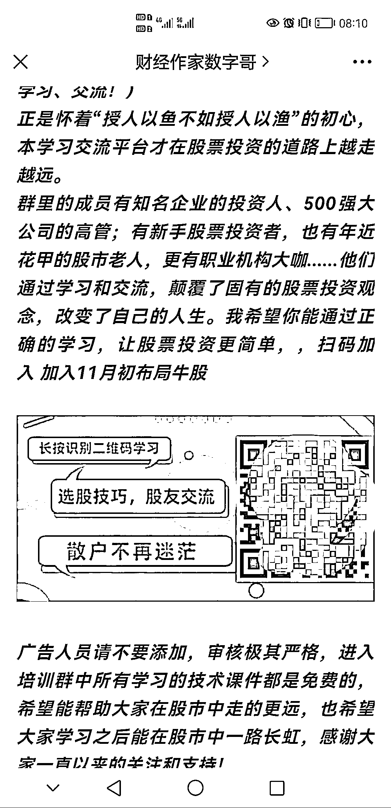
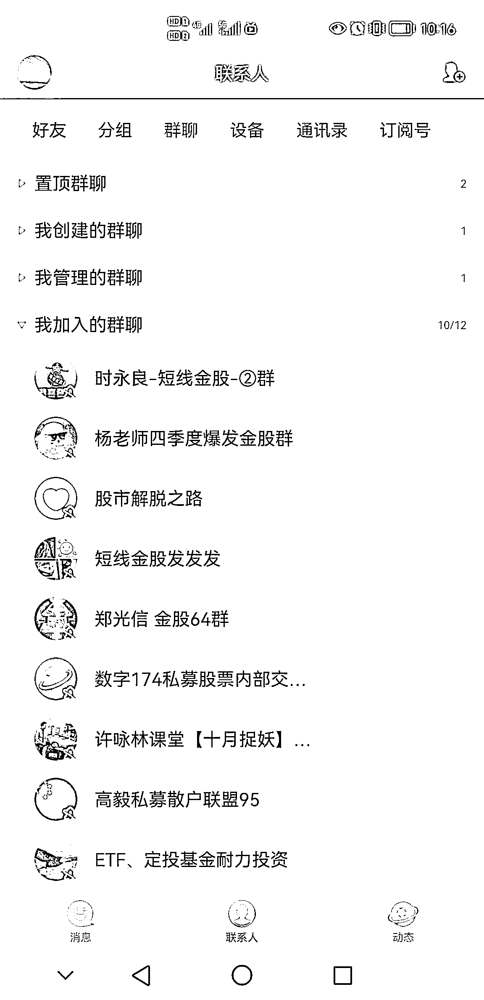
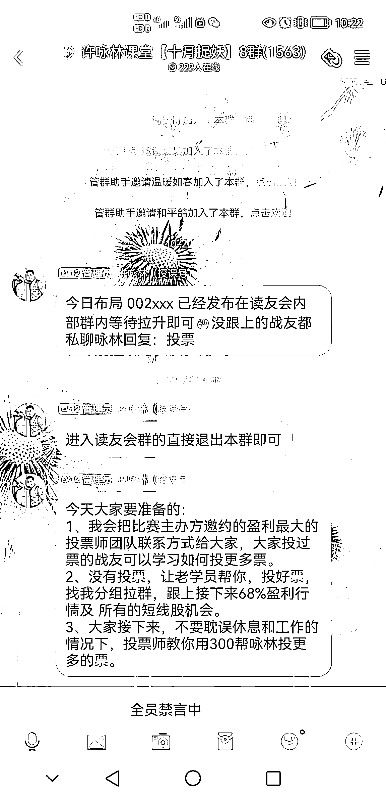
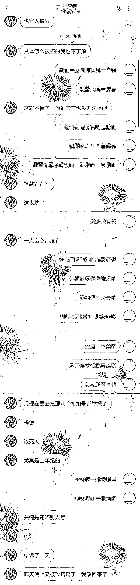

# 我为知识付费 100w+，那些年我被割过的韭菜

> 原文：[`www.yuque.com/for_lazy/thfiu8/va8kxydu5h06c0ed`](https://www.yuque.com/for_lazy/thfiu8/va8kxydu5h06c0ed)

## (72 赞)我为知识付费 100w+，那些年我被割过的韭菜

作者： 子白

日期：2023-10-17

《我为知识付费 100w+，那些年我被割过的韭菜》（一）

大家好，我是子白。自上次发帖以来，我多了好几个称号，比如“知识体验官”、“付费质检员”、“韭菜头子”等等。

前些天我去武汉面基惰总和刀姐的时候   ，会场的圈友们听我分享了（被）割韭菜的经历，全场气氛直接达到高潮(???)，果然大家的快乐都建立在别人的痛苦之上。

不过我从不耻于分享黑历史，常拿出来给大家说笑，充当节目效果。惰总@静水流深 希望我把经历写下来，给想创业、想赚钱的圈友们提供借鉴。所以我本着“多一人看帖，少一人被割”的原则，开启本连载。

结合我个人的经验，我认为创业最大的坑是投资坑，尤其是被包装成投资项目的各种局，比如加盟骗局、代种养骗局，还有 P2P、C 销、FF 集资、资金盘等等。这些局我基本一个都没落下，全都被割过，有的金额还不小，比如去年最热的 NFT 平台，我跑步接盘 50w。一年过去了，平台跑路的跑路、摆烂的摆烂，全部归零。

今天先说一个比较常见的投资坑，就是“大师荐牛股”。这种骗局极为老套，可是每年都有新韭菜上钩（比如 5 年前的我），总结了我的多次经历（真的很多次），这种局的常见操作如下：

一、精准投放广告，锁定目标群体

“一开始，最重要是找到目标。”

做局者通过广播、微博、微信、QQ、贴吧、搜索引擎买位置等方式投放广告。更高明的骗子会专门打垂直领域，通过财经大 V 号、财经公众号、炒股贴吧、短视频截流等途径投放广告，受众精准。

广告是熟悉的套路：自称老师，应广大股友要求特意开群，加群不要钱，纯粹学雷锋。

现在回想，第一步就很厉害：如果是你长期关注的财经公众号、非常信任的大 V、亲近的家人推荐给你的群，你的警惕性会降低不少，更容易受骗。

二、打造大师形象，吹嘘稳赚不赔

“进群之后，精彩马上开始！”

首先，对大师进行包装，起一个假名字，用假照片、假截图，宣称大师是老股民、成功人士，经常举办高端讲座，数十年来带领朋友们发家致富，如今视钱财如粪土，实在是大发善心，想要救股民脱离苦海等等。

随后，大师每天讲解一些基础股市知识、股票分析技巧，这些知识本身正确，但也都是网络上公开的信息，不值一文。

大师每日推荐牛股，“好心提醒”大家注意风险，不要一次买太多，随后会晒出前几天免费票的涨幅。乍一看，水平还挺高超。其实，我私下统计过，涨跌数差不多。只不过不停渲染涨的，避而不谈跌的，或者坚称现在跌的之后一定会涨，就给了人股票都在涨的假象。

这就跟看 NBA 球星投篮一样，是不是感觉特准，基本每个都能进？其实命中率也就 50%，道理是一样的。

除此之外，每天群里还会“自导自演”，一个微信群 500 人，QQ 群上千人，绝大多数都是骗子控制的“气氛组”。XX 小秘书、XX 助理、各种托轮流发言，比如：

XX 小秘书：“助理，群里有人问上个月所有免费票的收益情况呢。”
XX 助理：“好的，上个月我们大部分股票都获利了……”
A：“对啊，专业的事情就应该让专业的人来做。”
B：“老师们说的很对，把钱交给你们很放心。”
C：“你们很有实力啊，每天推荐的免费票都是涨的。”

有的群除我之外一个真人都没有！全部都是骗子注册或盗来的假账号！围绕一个目标人物，进行各种角色扮演！

让我感慨的是，骗子真的是煞费苦心：每一张宣传图都做的工整明确、每一次直播都会有单独的事先介绍、每一天都会有群里互动。如果不知道他们是骗子，这些人确实极为热情。

三、时机基本成熟，准备开始收割

“仅免费推荐，自然是不可能的。”

在几天的铺垫后，开始收割：

其一，加“内部群”/“会员群”/“炒股联盟”。内部群每天提供更强牛股，费用为 1888 元/月。此后，每天宣传内部群的赚钱能力，晒出客户给予的好评（大都是假的）。还时不时饥饿营销，制造紧张的气氛，比如:“仅有前 20 名股友可以进入内部群!”经过我的观察，各内部群推荐的股票也是涨跌参半，会员费全是智商税。

其二，支持大师“参赛”。大师参加“慈善炒股大赛”，需要各位投票支持，但需要交几百元的保证金“注册”后才能投票。既然大师每天免费地“带你赚钱”，那你也要“知恩图报”！当然了，我们大师视钱财如粪土，更别说你这仨瓜两枣，你的保证金等大赛结束之后当然会退还给你。实际上呢，不等“大赛”结束就销号走人了。

其三，跟随大师“捐款”。大师兼济天下，经常支持慈善事业，帮助了许多失学儿童、残障人士、鳏寡孤独，在此呼吁群里的朋友们为中国的慈善事业、教育事业出一份力！同时附上“捐款”的链接或二维码。这些“捐款”全都进了他自己的口袋。

其四，最厉害的来了，大师带你操作“期货”。股票每日涨跌有限，因此“学员”请求大师指导操作“期货”市场，涨的快盈利快！

大师一定会假装推辞，声称期货市场风险太高，而且也有门槛，一般人参与不了。随后“助理”就“好心”提供给大家无门槛的期货操作平台，只要大家下载入金就能使用，最后大师半推半就答应带各位操作。

这里的标的也可以是期权、合约、外汇、贵金属或者别的新玩意儿，叫什么名字不重要，重要的是你必须给他们的平台入金，入金方式是转到替罪羊的个人银行卡。

做戏做全套，为了保证你的“资金安全”，平台会给你邮寄合同让你签署，一查名称，全是野鸡公司。

每天跟着大师交易，不仅赔得多，而且手续费奇高，即使好不容易盈利了，还不够他扣手续费的。

四、大师巧舌如簧，小白晕头转向

“群主是我的人，管理员是我的人，整个群都是我的人，你怎么跟我斗？”

群内大部分时间都在禁言，就算有人质疑，大师总能回答的很有道理。举几个例子：

质疑一：怎么知道你是不是真的有实力？
答：你可以看我们过去推的牛股，基本都是赚钱的，而且你们都是朋友推荐加过来的，如果我们没有实力的话，他也不会推荐我们。

质疑二：昨天推荐的股票今天都跌了，怎么办？
答：你炒股也不是一天两天的对吧，今天买明天就一定涨停吗？但是我推荐的票都会负责到底！就算跌了，动用我们“联盟”的资金，也要把股价抬上来！

质疑三：网上说你是骗子。
答：树大招风，难免会有同行恶意竞争。你可以搜下淘宝，有多少人说淘宝垃圾的，二十年前多少说马云是骗子的？

群里每天被“正能量”填满，但也发生过意外：比如被盗号的受害者，找回了自己的账号，发现自己竟成为了“炒股大师”！赶紧在群里发言自己被盗号了，大家不要相信骗子。但是，马上就会被骗子禁言、撤回聊天记录并踢出群。骗子用另一个相同昵称、相同头像的账号继续自称“大师”，声称是同行进群捣乱，大家不要相信！随后群里的“会员”、“学员”们纷纷表示理解和支持。

总体来说，无论来自哪方面的质疑，骗子总能圆得过去。

五、基本收割完毕，立即销声匿迹

“能骗一个是一个，打一枪换一个地方。”

总结我卧底数十个“股票群/投资群/内部群”的经验，这种诈骗方式的生命周期一般是 2 周至 4 周，达成目标后，骗子会销声匿迹，被盗号的受害者陆续找回账号，无主的账号就此废弃。

随后骗子会另起炉灶，换一批账号、换一个“大师”的皮肤、新建一批“股票群”，重新投放广告，吸引目标！也有的诈骗群不这么复杂，但套路大同小异，甚至更为简单粗暴，稍有辨识能力就可分辨。

或许，“内部群”之后还会有“核心群”“私募群”“高级群”，但我已经没必要再观察了。现实中没有这么多股神，只要花费足够的精力，稍微会点 P 图，按照上述套路，你也能把自己打造成股神，不是吗？

如果再遇到这些骗局，千万记住子白的忠告：网上大师诱导投资是骗，鼓吹高收益稳赚不赔是骗。

最后，衷心祝愿每个人都不再上当受骗。

我是子白，下期见。

* * *

评论区：

胖大魔 : 子白，升华了！
昊东.Lee : 跟人别跟项目，多方验证，遇热缓入，基本能规避大部分的坑。
子白 : 早几年怎么没遇见你[流泪]
猎鲸者 : 老韭菜
良辰美 : 踩坑也是一种财富！认知从亏钱开始升级
小毛驴 : 看出来了，你是大佬，比较有钱🙏
Rosia 吴熳 : 哇 蹲一个后续
亦仁 : 这种信息很有价值，做这个 IP 流量也会比较大。 你是怎么考虑后续的商业模式的？ 如果只是玩玩那就没问题，如果想作为一个创业方向，那我提醒一下，再往下走的深入一些，你会动到很多人的利益，他们会集中力量来攻击你，这个可能会阻止你的商业模式走通。

* * *