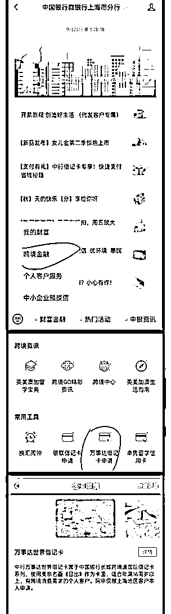
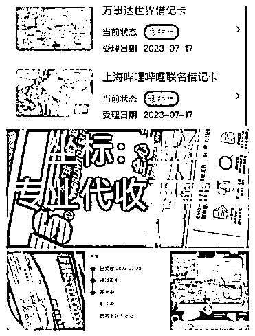
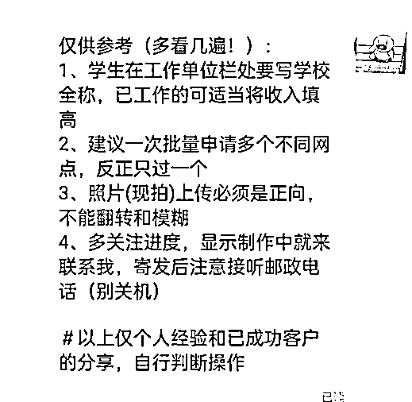
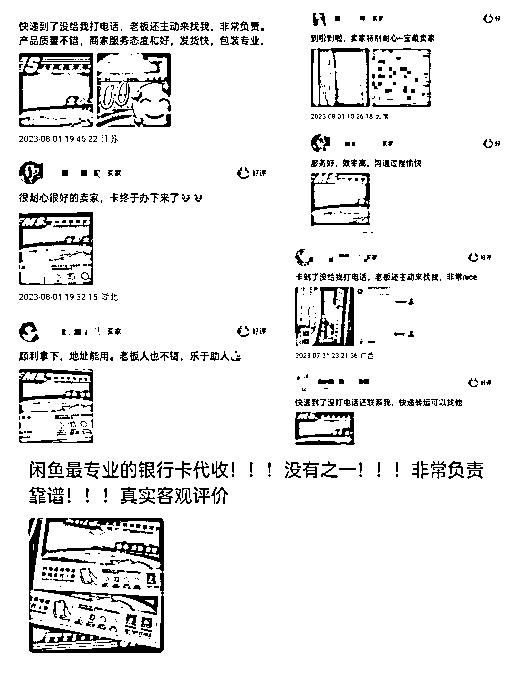

# 一张银行卡的机会，外币卡代收转寄业务分享

> 原文：[`www.yuque.com/for_lazy/thfiu8/bcfegx6xw0ufdt4l`](https://www.yuque.com/for_lazy/thfiu8/bcfegx6xw0ufdt4l)

## (精华帖)(121 赞)一张银行卡的机会，外币卡代收转寄业务分享

作者： 卍

日期：2023-10-18

评论区全是清一色的“怎么才能拿到”、“代收吗”、“想要”......

每隔一段时间，这种外币银行卡在各大社交平台就会爆火一次，也正是如此，背后有很大的业务需求。

和大多数信息差项目一样，门槛低、需求大，不用投入资金，只需要提供地址代收，然后再转寄给对方就好了。

我就是按照上述操作，22 天内变现了 7000+。而且还可以用来做引流，引流到私域后再卖其他借记卡，或者是做知识付费都行。

下面就给大家详细讲讲具体的思路和延申方向。

# 前言

央行报告显示我国人均持有 6.01 张银行卡，其中由四大行（工农中建）发行的的借记卡最受欢迎，占据了绝对的市场主流地位。

那么对于这样一个人手 6 张，看似不起眼的小卡片，要如何挖掘其背后的价值来变成一门可赚钱的生意呢？今天就由圈友@万田为大家分享关于银行卡代收的生财之道~

个人申卡理由可简单概括为权益和颜值，一张好看的借记卡能带来具有收藏艺术品和存钱的双重快乐，即使在没得 money 的时候，好看的卡面仍使人赏心悦目。

以下就是本项目最热销的产品：【中行万事达外币卡】。

卡面分别为名画系列-莫奈日出印象、非人哉系列-白泽/小玉，主要权益是跨境消费和海淘， 并且支持除人民币以外的所有外币种存取交易。可谓是集齐了好看、实用性、无门槛申领这三要素，迅速在各大社交平台火爆出圈！

除了上述的三要素，当然还有最关键的，这三张卡虽然都可以线上申请，但邮寄地址仅限上海地区！

（地区限制属于阶段性，发行之初面向全国，估计因为申请量太大，今年 6 月开始后突然只对上海开放，目测后续还会换其他城市）

仅在小红书通过搜索关键词，相关的笔记数量之多就充分验证了市场需求。还不用投入资金，只需要提供地址代收，这不妥妥的捡钱机会吗？

**实操之网申路径（以中行和民生举例）**

1.  微信公众号：中国银行上海分行-跨境金融-万事达借记卡申请

1.  进入申请页后根据提示填写个人真实信息资料，提交后大概 3 天左右通过审核，后续只需要查看进度，显示制卡中就会开始由邮政派送（划重点：进度栏并不会显示派送，所以要注意接听派件电话，以免被退回哦）

民生也是同理，在分行公众号菜单点击在线开卡，值得一提的是，民生按卡片类型和区域已经做好了分类，更直观清晰！

ps：通过以上两个银行网申路径，相信大家都会举一反三了，公众号搜索：银行名称+地区分行（如交通银行深圳分行等等）

**实操之小黄鱼上架发布：**

把自己代入到客户的角色，通过分析用户搜索习惯好和搜索框推荐词，更精准获得排名展现。

比如:上海代收转寄外币卡、中行外币卡代收，万事达卡上海转寄；上架后多找几个朋友进行搜索，经过测试并优化后，确保自己的链接排名靠在前三即可。

其次主图和定价也很重要，尽量保证图片的真实直观和可信，既然是银行卡转寄代收，那必然得用卡片图+小区住址实景，并用大号亮色字体标注好；

定价方面则不能太高，因为提供的服务和交付很简单，太贵的话客户也会觉得不值得。

咸鱼做上海代收快递的同行多到数不清，如何快速建立优势？

1、从账号基本面，如头像背景简介，以及宝贝详情描述来突出专业性

2、收集整理网申小技巧，5，6 条足以，非常简单但确实能帮助一些新手

3、引导成交用户嗮图好评，事实证明很大程度上减少了客户疑虑，基本都是问两句直接下单

机会发展： 各家银行都会不定期推出新卡活动，如外币卡，运通卡，联名卡，跨境卡，照片定制卡等等，往往这类卡也都会在小红书 b 站博主推广下引发一股大热潮，其中 95.00 后是这类卡片的主力军。

因为发卡量有限等原因，很多都是指定开放给某个地区（一线及省会城市为主），这类信息可以通过公众号了解，但最直接的还是多刷小红书抖音 B 站、大数据会持续推送这类信息给你，另外靠谱的信息来源就是卡友 QQ 群和贴吧。

# 思考延伸：

1.从平台获取到客户一定要 100%引流到微信，目前我用的是最笨也是最安全有效的发短信，后续也可根据需求给推其他卡片

2.借记卡信用卡的玩法非常多，用户群体也大，开自媒体号通过讲解办卡开卡养卡等各类干货知识积累精准粉丝；具体可以参考下图 UP 主

* * *

评论区：

亦仁 : 感谢分享，已加精华。
亦仁 : 可以往后再琢磨一下，这些人申请卡背后的需求是什么，围绕那个再挖掘一下产品/服务的机会，可能比现在的量大很多。
卍 : 好激动呀 感谢亦仁认可
才 : 这些外币卡都是用来做跨境电商的吗？
卍 : steam，海淘，国外消费等
阿奇 : 请教下大大，这些卡可以绑定谷歌应用商店嘛？
卍 : googlpay 能用
chatGPT 学者 : 可以做什么用呢

* * *