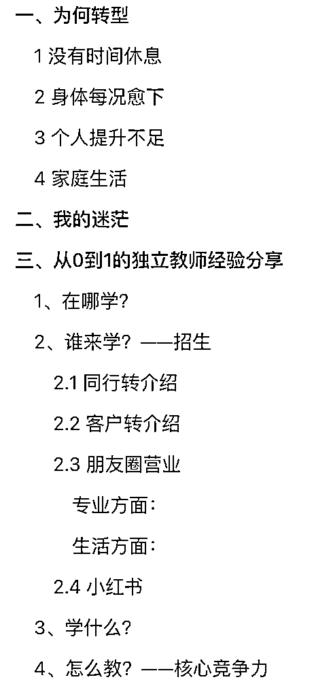
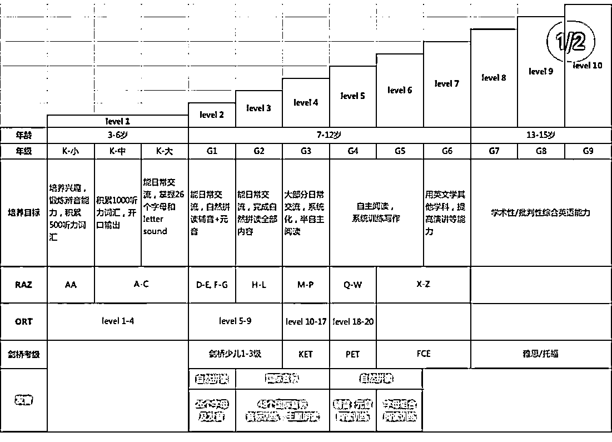
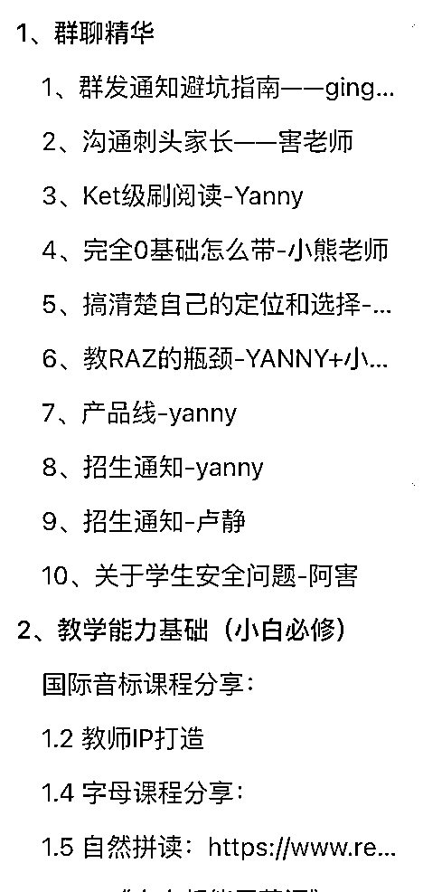

# 从剑桥部教研组长到独立教师，如何释放出自己 30%精力收入提升 10 倍

> 原文：[`www.yuque.com/for_lazy/thfiu8/zi0wl0ar44hdvcll`](https://www.yuque.com/for_lazy/thfiu8/zi0wl0ar44hdvcll)

## (41 赞)从剑桥部教研组长到独立教师，如何释放出自己 30%精力收入提升 10 倍

作者： 卢静

日期：2023-10-19

服务的人少了，客单变高了，时薪上来了，这是我选择从教培老师转型做独立教师的原因。

一开始我在龙头教培机构工作，天天加班，身体每况愈下就算了，时薪也很低，当时就觉得这并不是我真正想要的工作。

于是通过教培的细分赛道作为切入点，靠同行和客户的转介绍招生、朋友圈运营建立信任感、小红书引流扩大客户量，做起了独立教师。

全程都是自己招生、自己设置课程、自己教，节省了很多的精力，收入还提升 10 倍。接下来，就和大家分享分享我是如何从 0-1 转型做独立教师的，希望能给到大家一些帮助。

本文主要从 3 个点上进行分享：

1.  我为何转型

2.  从 0 到 1 做独立老师的经验总结

3.  2 年自由职业的收获

不敢说能解决谁的什么问题，不过对这些话题感兴趣的朋友们，可以关注一下：

1.  独立教师的经验

2.  从打工到自由职业

3.  女性家庭和事业的平衡

下图是大纲：

# 一、为何转型

如果我不按我想的方式活，迟早就会按我活的方式想。

**（1）没有时间休息**

2021 年，26 岁时，已经在龙头教培机构工作了快 3 年，当时手里带着 180+的学生，还负责着一个系列课程的教研。

我当时的工作节奏是：周三周四带 20+老师教研，周五白天审核教研成果，晚上上课，周末两天全天的课，周一二是所谓的休息日。

在休息日能自然醒一次，对我来说就是每周最大的休息。其余的时间是根本不可能休息的，我自己有新媒体板块的研发工作，还要审核及修编周三四两天的教研成果，还有 180+学生的学习跟进，家长沟通，就算不休不眠这些活也是干不完的。

**（2）身体每况愈下**

在手忙脚乱的状态下，我的身心也都是不健康平静的。常年伏案，已经开始出现颈椎疼和腰疼的迹象。

身体亚健康，花了钱报了健身房，但是没去过几次，我上班时健身房没开门，我下班时它已经关门了。

**（3）3 个人提升不足**

心里有很多的问题没有时间去思考和找答案。

这样的工作量，3w 的月薪算下来，其实时薪是非常低的。公司会把 1 个人用出 3 个人的价值。在这条线上继续升职涨薪，这就是我的上限了吗？我已经很辛苦了，好像空间不多了。

上升路径当时是很清晰的，部门研发负责人，部门总监每天 12 点都还在催大家的工作。

这明显不是我想要的生活节奏。我已经忙到没有时间思考和提升自己了。

道德经说，有之以为利，无之以为用。

当人生被装满了的时候，总会失去一些东西。我的机会成本是什么呢？

冲着“空余”能给我带来的其他可能性，我选择了离开，把我的杯子倒空，让身心得以停下来休息。

而休息，是为了更好地再次出发。

**（4）家庭生活**

当时的男友不是我想共度一生的那种人，也没什么时间和机会去结交异性。

26 岁的女生，站在人生的岔路口上，要么努力工作，接受述职邀请，升职，更忙，晚婚晚育，还有可能在 30+时面临职业断崖。要么离职，去看看其他可能性。

眼下能看到的事业发展、身心状态、恋爱情况都很不乐观。

此时不走，更待何时呢？

# 二、我的迷茫

我原本只是有一个大概的想法，离开，去开一家自己的工作室，一个小机构，做自己喜欢的教育。

但是 6 月 29 日离职，半个月后，就出了新规，这个行业，好像都走不通了。当时也非常迷茫过，整个 7-8 月，我除了休息，就是在思考未来的出路。

开线下的机构是不可能了，但是我就是想做教育，这是我的使命感。

既然如此，无需多虑，先做起来。21 年 8 月底，我就开始进入了纯线上自由职业者的工作状态。

# 三、从 0 到 1 的独立教师经验分享

哪怕是再没有经验的老师，要上课，也知道要解决以下几个问题：

## （1）在哪学？

花了 1w 充值云教室。是市面上最好的云教室 Classin。本来线上课就不是家长们的首选，我得保障课堂质量。起码设备软件这些不能出问题。

Classin 是 4 元/人/时，每个月的开销，相当于三四线城市的线下房租。

但是软件功能齐全，售后质量高，一直都是秒回的。

但是我还没有学生就充值了课室，现在回想我是幸运的，其实不应该先投入这里，虽然钱不多。

除了 classin，也还有很多其他更经济实惠的选择：刚开始转线上的老师，可以先尝试腾讯会议、瞩目、爱问云等平台。

长期使用的话，就建议免去调研和测评的时间成本，直接闭眼入 classin。

## （2）谁来学？——招生

很多人会问我是怎么招生的。其实就是同行转介绍/家长转介绍/小红书。

**1\. 同行转介绍**

我没有带走以前机构的任何一个学员，我甚至开了一个新的微信号免得他们找到我。要把学生带走太容易了，当时离职，孩子们最后一节课都哭了。

但是我自己不允许自己这么做。我也不会去谴责那些这样做的老师们，这都很正常。

最初我是从同行朋友中找了一些合作的机会。我出课程，朋友给我学生，我给朋友返利。

**2.客户转介绍**

第一个月，可能收入也就是几千块。我很用心地去服务好手上的几个客户。然后这些学员里，开始出现了转介绍。

跟家长沟通的经验多了之后，就会发现，每次沟通来沟通去，都跳不出这些问题，有些家长会跟你聊一个多小时，非常费时。

后来我就把这些内容整理成了课程手册，家长来了，问了孩子情况，就发一个合适的课程手册，没有费时沟通，看了合适的，就缴费试课，然后进班，长期上课。

课程手册内容——省时利器

1、课程背景（教育理念和规划是否跟目标客户一致）

2、上课形式（线下/线上平台） 、时长 、频次 、班级人数

3、课程进度安排和内容规划（课程大纲）

4、收费情况，可否试听

5、如何诊断及定级

6、课后练习内容和要求

7、对家长配合的要求

8、实施要求（线上的设备、资料等准备，线下的路线指引等）

【千万别带这样的家长】

孩子往往是可爱的，而家长就不一定了。你教孩子，可是家长给钱。

所以小学的培训往往是两头做服务。

最近一个朋友说，抱团的家长组了一个班给她，但是又带着全班去学新概念了。 抱团组班好像家长很支持你，但是她们走的时候也是一起走的。

我不太喜欢家长组团报班，通常她们要求都会比较多，搞得像 vip 一样，想要牵制老师。 我有一个家长特别焦虑，我基本每周都要做心理辅导。

我烦了，1 年级的娃，带她 4 个月都能写作文，独立表达 1-2 分钟口语了，还看不到孩子的进步，一点点问题就无限放大。

1、看不到「自家孩子起步晚」的事实，期待还贼高，一上来说就要 ket，其实才剑一的；

2、没摸着门路，听风就是雨，自媒体说什么好就什么好，要学 pu 要学新概念，高频切换路线，绕弯路，我还从来没听说过哪个病人来看病要求医生这样这样开药的；

3、不听劝，乱努力，心态不好焦虑症，孩子没问题，家长总觉得孩子有问题，打压孩子，搞得人家没自信的；

4、讨价还价的，我又不是菜市场，医不叩门，道不贱卖，有二话不说转钱的，我跟你在这纠缠什么呢，出门左拐谢谢；

5、不尊重服务者的，把老师当成“下人”的；

6、直觉想要逃离的人。

**3.朋友圈营业**

独立老师的朋友圈，既要体现专业度，又不能只发工作。 除了工作，我们还是一个活生生，有声有色有温度的人。

#### 专业方面：

1、课前：我们会选教材（测评）、教研、学习、备课，发这些内容，都能体现出咱们老师对工作的认真和热情。

2、课中：上课内容、学员高光时刻、上课流程、教师高光时刻等。注意线下课如果发视频最好让助教拍，线上就可以上完课任意录屏和剪辑了。

3、课后：作业、反馈、个人反思、家长好评、学员成果、阶段评估和学员证书等，我就经常在视频号发孩子们的作业，很多家长甚至老师都会来问，如何能让自己的孩子/学员也做得这么好。看到成效，最能吸引家长了。

#### 生活方面：

生活/娱乐/读书/健身/家庭/旅行/自黑，基本上不是负面的都能发。 没有谁想做你的情绪垃圾桶，积极向上的人总是更有能量感的。

我会经常发一些搞笑的、我的学习、读书感悟和健身打卡。

每次自黑的时候都会引来家长围观，我的孩子们也喜欢评论我的朋友圈。 甚至有不太熟悉人来跟我交流读书感悟，我也因此收获了书友。

多出现，这样别人有需要的时候，就会想起你。 孩子学要学英语，就会来找卢老师。 有些家长甚至因为我没有学位，而说等我。 当然我也会因为不想耽误孩子而给推荐别的老师。

虽然要在朋友 sell 自己，但是谨记「超越期待」这个原则， 不要把话说满，说 6 分，做 8 分，不让人失望。 不说我能 1 年把孩子带到初中水平这些做不到的事。 一般我会说需要更久一点，但是当家长发现更快时，她自己会惊喜的。

真诚是必杀技，我营造人设，没有什么秘诀，就是做自己。

**4.小红书**

不过慢慢就会觉得转介绍这个速度还是太慢了。

我得有自己的流量池子。于是 22 年的春季，我就做起了小红书。陆续有一些咨询和转化变现。22 年小红书带来的收入约 10w。

我们这种类型的账号，不需要大流量。有 1000 粉，我能转化 10 个人，年费单价 1-2w，就够了。

现在我佛系经营了 1 年半，其实也 2.5k+粉丝。目前有 1/3 的客户都来自小红书。

跟我联系的生财工作人员说，希望我多分享一些术，而非道。在小红书这件事上，我的术就一个：坚持更新，别的都不管那么多，反正啥也不懂，发够 100 条再说。

很少有人能坚持更新，所以只要你坚持，就已经筛选掉很多人。

一个老师带不了几个学生的，独立教师的天花板其实很低。

一个人的时间精力是有限的，把能排课的时间都排满了之后，人员也满了，除了涨价就很难再有其他的上升空间了。

除非改变模式，让别人给你打工（招老师带课）。或者让一份产品卖出多次（录播课等）。

**（3）学什么？**

产品跟客户定位是直接相关的。

做什么类型的课程呢？

1.  补差——体量大，老师累

2.  校本同步——体量也大，但是没意思

3.  培优——人数少一点，但是教学更有挑战性

4.  高端（国际学校需求等客户）——我这方面的人脉资源较少，不好做

每一个赛道都有其优劣，最后选择了单价相对较高，较小众的群体——培优，因为只需要服务少数人，就能有不错的收入。

确定了目标客户群体和课程类型之后，就开始搭建课程体系了。

我先参考有经验的老师，做了一个课程体系图。这个体系图非常重要，因为它定了大基调，后面无论我怎么改，都没有脱离这个框架。

很多独立老师，是没有成体系的课程（产品）的。

有了课程体系的依据，再买教材，测评，选合适的教材，往体系图里面填充细节。

最开始因为我擅长做剑桥考级的课程，我选的都是备考教材，power up 做小学低龄段，open world 做小学高龄段。

一年后发现，学生不能一直考试。考试是知识积累和能力训练到了一定水平之后，水到渠成的事情。不是靠培训技巧，就能考出来的。

而且，学生考完试，就结束课程了，复购率低。我需要更长线复购率更高的课程体系，需要长线的基础教材。

于是 22 年 8 月开始，重新换了教材，低段换了 Kid’s box， 高段换了 Think，全线换教材备课量特别大，得亏我熬下来了。

那我们再次回到前面所提到过的课程手册，如果一个老师能把这些问题都详细地回答出来，大概率是体系完善的：

1、课程背景（教育理念和规划是否跟目标客户一致）

2、上课形式（线下/线上平台） 、时长 、频次 、班级人数

3、课程进度安排和内容规划（课程大纲）

4、收费情况，可否试听

5、如何诊断及定级

6、课后练习内容和要求

7、对家长配合的要求

8、实施要求（线上的设备、资料等准备，线下的路线指引等）

开始上课之后，如果还出现问题，基本上都能从以上这几点找到答案。

**（4）怎么教？——核心竞争力**

再完善的课程手册，也解决不了怎么教的问题，怎么教的效果，直接体现在学生成绩上。

教学质量就是生命线，学员的学习成果才是家长续费的关键。

**那怎么提高教学质量呢？**

① 不断复盘自己的教学，不断调整提升，好好备课——这是一直都要做的

② 了解自己的学生，多想想“如果我是孩子”，我会怎么样

③ 付费咨询，直接抄前辈的经验，减少踩坑，避免不必要的教训

④ 发挥自己的长处，去做自己更擅长更有经验的教学，比如我擅长剑桥考级，就不能去做中考高，因为我没有接触过，当然也不是没有接触过就不能去做，如果这就是你的优势，干就对了

⑤ 参加师训学习，分享一下我的教学能力提升学习经验吧：

1.  XDF，2 年多做到剑桥部教研组长的经验，我从这里得到了实践经验，打了基础

2.  塔客学院，费用 3k 左右，跟了 3 年，第一年收获入门知识，第二年收获很多朋友，第三年感觉收获不大，就没再续了

3.  TKT，费用 2k 左右，纯粹自己考证，没有参加培训，5 个模块成绩是 43433

4.  CELT-P，剑桥师资，费用 6800

5.  某老师私教（贵，效果低于期待值，退了，就不展开说了）

6.  M 男老师录播师训+社群，费用 3k+，收获活生生的榜样，优秀同行们

7.  Jerry 的直播+录播+社群，全年 2w 左右，教材自由，全能型，带给我颠覆性成长

8.  F 女老师的线下 4 天全天培训，费用 5k，启发了我向全科启蒙和素质教育转型

9.  C 女老师的自拼+think，费用 4k+，专业理论，celt 系列模块化

10.  M 女老师的直播，费用 4k+，她启蒙了我的原版绘本阅读教学能力

11.  小红书 1 老师的社群，费用几百，没几天就退了

12.  小红书 2 老师的社群，费用几百，内容很小白，也退了

13.  蔬菜老师的口袋宇宙超级会员，费用 4k 左右，也是适合小白，及时止损了

14.  我的宝藏 Y 师姐经常给我指点迷津，她比很多师训厉害很多

15.  C 女老师 think 师训，费用 7k 左右，她有很死忠粉，但是我不会再继续

16.  J 老师的写作师训，性价比高，适合 kp 带课老师

花了真金白银和时间总结出来的一些能避坑的经验：

① 市场定价一般是合理的，贵有贵的道理

② 同行口口相传的师训，比培训师自己卖力广告的好

③ 不同阶段，不同的人，适合学习不同的课程，因人而异

④ 理性消费，别囤课

⑤ 报单课试一下，再报课包

非常多老师都想让我详细介绍师训，但是我又不好展开细说，一般私聊，毕竟圈子就这么大。

# 四、我的收获

**（1） 自由**

之前很流行一个词，财富自由。

对我来说，空间自由，时间自由，金钱自由三者合一才可说是财富自由。

现在的我空间是自由的，因为线上工作，可以随时换城市，这 21.7-23.7 的这两年里，去了很多地方，认识了很多朋友。

时间上，算半自由吧，固定下来的上课时间还是不能轻易改动的，但是其余时间，都可以自由支配。可以睡到自然醒，再也没有以前那种因为睡眠不足还要早起时感到的心悸。

至少有很多时间做我喜欢的事和陪伴家人，爱自己不再是一个口号。看见自己在每份关系里的角色，然后与每个角色和平共处。

女儿、妻子、姐姐、妈妈…… 看书、旅游、画画、陪家人这些都是滋养我的事情，以前我没有时间做，现在都有了。

我不知道怎么去定义一个数额，才能算得上金钱自由。只不过用更轻松的方式赚到了比之前打工时更多一倍的钱，可能在生财这种藏龙卧虎的地方，这点成绩也微不足道。

我们行业当下的情况，不是赚大钱的时机，只能说小富即安。所幸我也不是物欲很强的人，很多收入我都拿来继续投资自己或者升级产品。

**（2）遇贵人**

以前读书或者打工时可能也知道人脉的重要性，但是真的因为人脉而令生活有切实的改变，还是独立之后。

想要遇到贵人，要主动。我的主动在于离职并且付费进入独立教师的学习群。

长期在一个公司打工，所能接触到的信息是很有限的，眼界也很窄，当时主动打破闭塞的环境，认识到了一位前辈 M 和我 Y 师姐。

前辈 M 和师姐 Y 都是收入百万级别的，已经拿到成绩的、活生生的学习对象。

凭着灵敏的嗅觉，我在一次线上会议中，在前辈 M5 分钟的发言中，就知道他是大宝藏。下线之后我马上花了三千多向他付费学习，后来我又把他推荐给了很多同行朋友，都受到了大家一致好评。

在 M 前辈的社群里，我结交了接下来 2 年里对我的成长无比重要的一群非常优质的同行。

后来我跟 Y 师姐接触得越来越多，就基本把她走过的路都复刻了一遍，而且还把她踩的坑都跳开了，因为她的经验分享，我得以用更快的速度成长起来。

2 年前刚离职时，我什么也没有；现在我能安排的时间段里，已经全部排满，还有一些客户在排着队等待中。

**（3）做贵人**

也不是我主动，别人就愿意帮我的。能花钱的我就会花钱，这是最快的。

平时，我是一个很乐于分享的人。以下是我给老师们分享过/整理过的内容：

很多老师因为我的分享，有所收获，会主动给我发红包、请我喝咖啡、给我寄礼物，这 2 年从全国各地收到了各种各样的礼物。都是价值互换。在社群中，我愿意做那个吃亏的人。

很多老师会夸我/感谢我无私分享。其实，人都是自私的。只不过分“远视”或“近视”。

我只是更喜欢符合利己主义的利他主义。

慢慢地，被越来越多的同行所认可，有前辈愿意把自己的孩子交给我来带。然后，有人主动付费向我咨询，从刚开始的随意收点红包，到后来 999/h 咨询。

门槛还是要有的，也不能什么人都收，会是祸害。最近总有同行老师追我开师训，这算一个衍生品，小副业。

不过，我现在孕期，不打算这么累。就都拒绝了。

做那个，越品越香的，越挖越有惊喜的人。

**（4）健康**

我很怕死，我一去医院就会高血压，因为紧张。

因为这个心理，我体检时心跳总是不过关，跳太快了。但是只要一走出医院我就恢复了，哈哈哈哈……

现在我每天都上两次私教课，慢慢涨了肌肉，觉得自己的能量上来了。健身当下是痛苦的，不过它的反馈是可喜的。

以前我很累很累，但是躺下时我还觉得不满足，就会报复性熬夜，心情不好饮食也不健康。

锻炼后，我的心肺能力切实提高了，以前一爬楼就会喘，后来有一次爬了八楼我竟然觉得挺轻松。

因为身体好了，所以我的心情也更好，精力更加旺盛，效率也更高，现在把每天都过的充实，躺下就觉得今天满足了，有点困意了，然后一觉睡到天亮，自然醒，这种感觉真的很好。

**（5）线上工作者的健康问题和应对方案**

**1、长时间用眼导致的视力模糊、近视加深、眼干眼涩、眼疲劳**

1.  海露人工泪液（支付宝买了好医保可以每个月以 20+的价格买一盒、比网上便宜 40-60 不等）

2.  规定工作时间，每天最多 6 小时，减少用眼时间

3.  计时器，设定番茄钟，每 50 分钟起来活动一下，看看远处。

#### 2、肩颈疼痛

1.  把电脑放到高处，可以用升降桌，保证视线至少跟屏幕平行，低于这个度容易颈椎病

2.  买一个独立的键盘，电脑离得近了伤眼、离得远了够着打字的时候手臂和肩部累、容易肩周炎

#### 3、腰疼

1.  久坐腰疼，用升降桌，站坐切换

2.  一定要靠背坐，用护腰靠垫，不要身体前倾或者坐直，靠背坐是承受压力最小的，有的人虽然买了人体工程学椅子，但是从来不靠背坐，其实跟普通椅子没区别。

3.  长期用鼠标手疼

买一个人竖版鼠标，上网课除了用鼠标，多用写字板/ipad

# 五、结语

不知道我的分享能给生财的小伙伴带来什么，因为行业差距还是很大，有些事情可能也参考不了。

只能做到真诚分享，希望读到此文的你有所收获。

有一件事确实鼓励大家一起共勉：锻炼。

有时候现处的人生阶段，面对的事务和压力强度，根本不需要关心很多有关自身精神、心理、身体、精力管理的知识和技能。常常像个小朋友一样还处在“用尽一切方法破坏自己身体和精神状态”。

工作和健身，要找到支点。后者的目的，恰恰是为了抵御前者的高强度冲击。如果前者的强度，如果大到没有更强的身体，完全无法承受的程度。即便有成事的机会，也失去了成事的基础条件了。

这两年，全然换了一种工作和生活方式，体验感还不错。

顺便结了个婚，找到了所爱之人，而且即将迎来我们的小宝贝，开启人生的新篇章。

让我们，继续期待……

* * *

评论区：

蔡文静好文静 : 看到很可期的未来[后面更可以打造独立老师孵化 IP，C 端接家长，B 端带学员合伙人。这样 C+B 可以循环]
西伯利亚冷空气 : 我也是做这个的，虽然利润高，但是政策打击太严重了
星星 : 同为教培人，分享很真诚，特别棒[强][强][强]
畦畦 : 教培目前管控太严了，怎么规避风险[捂脸]
赛赛 : 感谢分享，收获很大[强]
卢静 : [呲牙]互相分享 共同进步
小光 : 感谢真诚分享！既是分享一种态度，也是分享一种生活方式
张达达 : 很棒

* * *