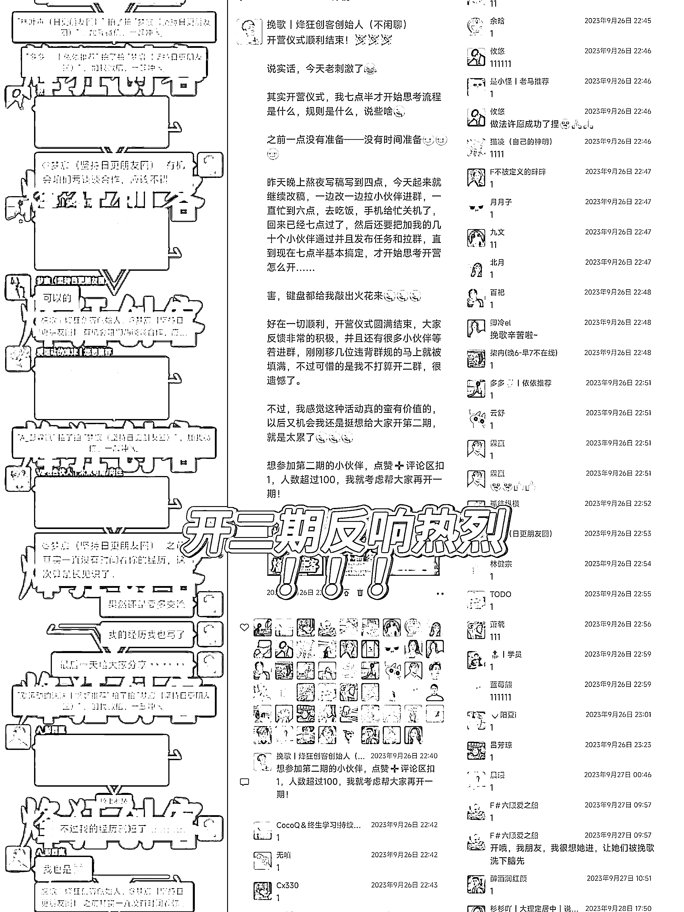
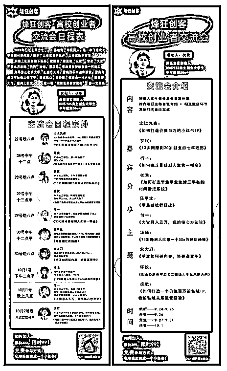
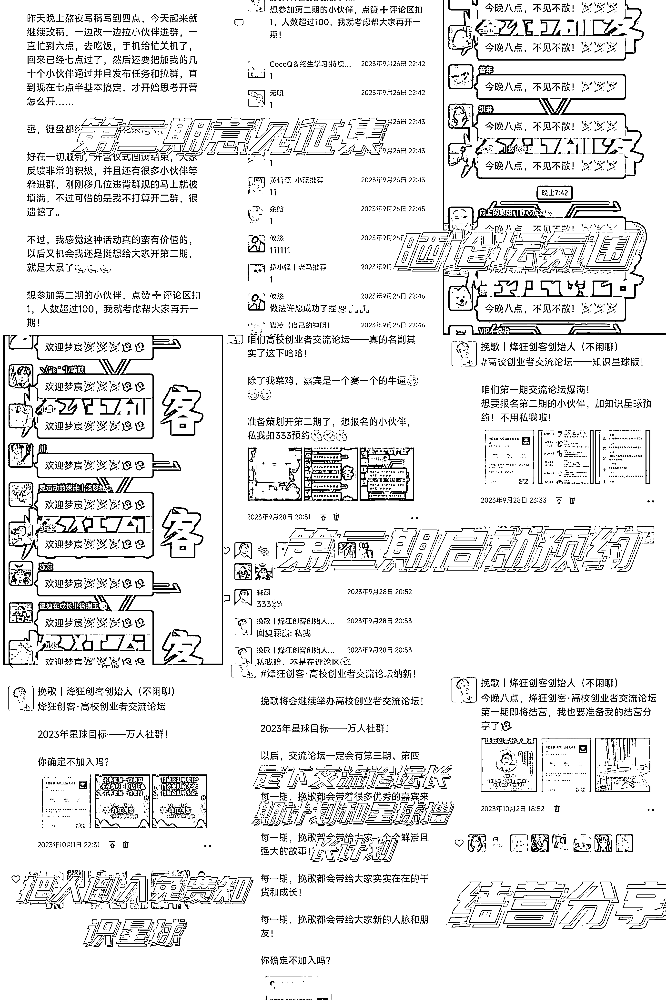

# 如何通过一次剧本营销活动，获得 10 倍于你的私域流量的曝光

> 原文：[`www.yuque.com/for_lazy/thfiu8/meh57znfk9fslmz9`](https://www.yuque.com/for_lazy/thfiu8/meh57znfk9fslmz9)

## (16 赞)如何通过一次剧本营销活动，获得 10 倍于你的私域流量的曝光

作者： 挽歌｜烽狂创客创始人

日期：2023-10-25

大家好，我是挽歌，03 年 20 岁 985 自主创业大学生，烽狂创客创始人。

大二从零开始自媒体创业，专攻私域关系运营和社群运营半年多，十个月变现 70W!

##### 本篇文章，我将以我举办的一个朋友圈刷屏活动【烽狂创客高校创业者交流论坛】为案例给大家拆解写剧本的商业模式告诉大家我是如何通过这一次剧本营销活动两天时间获得上万级的私域曝光、引流上千的。

本文一共分为四个部分：

一、怎么想到做剧本营销的？

二、剧本营销的案例拆解和解读

三、写商业剧本的步骤

四、经验总结

**Part 1**

### **怎么想到做剧本营销的？**

先简单介绍一下——什么是“剧本营销“？

剧本营销是一种利用故事情节、角色和剧情等元素来推广产品或服务的营销策略。

它通过创造有趣的故事，吸引消费者的注意力，并在故事中巧妙地融入品牌信息。剧本营销可以以文字、音频、视频等形式进行，通过情感共鸣和故事的吸引力，增强消费者对品牌和产品的认知和购买意愿。

想象一下，当我们看一部好电影或听一次精彩的故事时，我们往往被情节所吸引，与角色建立了情感联系。剧本营销利用这种心理现象，将产品或服务置于故事环境中，让消费者与品牌建立更深入的情感联系。

今天的分享，来源于我对自己举办第一期高校创业者交流论坛的拆解和思考。

这一次的交流会活动，本质上是一时兴起。源头在于 9 月 19 号晚上我的合伙人悠悠和我提了想要大学生分享交流的事，后面我仔细想了想，有一个很重要的点让我忍不住深思了下去。我看到了一个很强范围很大的需求——**交际需求！而有需求自然有市场！**

悠悠提议组建一个高校高质量大学生交流群，我能确定会有人感兴趣的。

但是，这个需求还没有那么强。所以我进行了升级，把重点放在高质量创业者交流链接。

这种单纯交流群，不适合做长期的，因为最大的价值在于链接。当链接的目的达到，交流群使命也就结束了。

所以想要抛砖引玉，那就得给足价值。

我们需要内容，需要大佬压阵！这样我们就有了一个大家直接能够看到的表面价值来吸引人群。

于是，我便设计了特邀嘉宾分享，成功邀请到 9 位优秀的大学生嘉宾之后，我就开始马不停蹄的安排制作海报，安排分享日程。在国庆前，立刻筹备并举行活动。从 9 月 27 号开始，到 10 月 2 号结束。

**Part 2**

### **剧本营销的案例拆解和解读**

以下是这个活动的准备流程：

> 这就是整个营销流程。开营的时候，群进了五百人，截止到今天这个活动让我新的免费星球成员快速满 1000 人。第二期意见征集，反馈很好。
> 
> 
> 
> **剧本营销的本质是悄无声息的占据用户的心智，并且被动成交！**
> 
> 这一次活动是我从零到一策划出来的，并且我多了一步：让大家看到这个过程，我让所有人看到了【电影背后的制作花絮】。大家从无关者变成了旁观者，再变成了围观者，最后变成了参与者，最后，**悄无声息的占据用户的心智，并且被动产生了成交！**
> 
> **这是我设计这次营销案例活动的几个核心动作：👇🏻👇🏻👇🏻**
> 
> **门槛的设计：**
> 
> 要么付费 99，要么帮我转发指定的海报到朋友圈！付费门槛的设计，付费完全不是目的，是为了和帮忙转发朋友圈形成对比落差——相比于 99 的门槛，转发朋友圈简直不要太划算！
> 
> 可以白嫖谁还付费？所以就有很多小伙伴帮忙转发朋友圈，产生了刷屏的效果！虽然群只满几百人，但是带来的影响力和曝光量确是群人数的几十倍！而这些曝光才是我真正最需要的东西，比如本次的训练营活动，也是一样的结果！
> 
> 
> 
> **海报的设计：**设计了三款海报，内容各不相同，第一张论坛介绍，第二张每一位嘉宾单独介绍，第三张嘉宾分享日程安排。全部采用大红色设计，任务要求时候要求发一条九宫格，突出视觉刺激感！给足吸引力！
> 
> **论坛介绍和嘉宾日程安排**则给足仪式感，让本次交流论坛活动看起来逼格拉满，加上紧迫的日程安排，又提供了免费参会的机会，产生了极强的引流效果，微信直接加爆几百人。
> 
> 
> 
> **嘉宾的邀请：**邀请的嘉宾基本上都是圈内小有名气且都拿到了不俗结果的大学生创业者。能够借助他们的影响力获得更多的流量，而且内容无需自己全部生产，降低了内容成本，并且大咖背书，人脉价值直接爆表，吸引力极强！
> 
> 
> 
> **朋友圈＋社群同步进度和动态**，并且最后针对本次活动进行了拆解分享！
> 
> 启动预约-说明门槛-日程安排公布-朋友圈刷屏现象公示-开营预告-倒计时公示-第二期意见征集-晒论坛氛围-第二期启动预约-把人倒入免费知识星球-定下交流论坛长期计划和星球增长计划-结营分享-活动拆解
> 
> 
> 
> **营销的结果是什么？**
> 
> 只是产品卖出去吗？我好像也没收到大家的钱啊？群里小伙伴基本上没有交钱的，有倒是有其他人交钱了，不过可以忽略不计。营销的结果是：影响力和信任度，都被卖出去了。本次活动结束，我起码影响到了二十倍于社群成员人数的人——我把【自己】卖出去了！
> 
> 同时，卖给了新朋友：
> 
> ●朋友圈和社群看到我的海报到人，留下浅层印象。
> 
> ●朋友圈看到我，对我产生好奇和探索欲的人。
> 
> ●朋友圈看到我，不打算进群，但是添加我的好友想要链接我的人。
> 
> ●进群的人，以及直接付费进烽狂创客的人。
> 
> 当然除此之外，我还转化了十多位小伙伴付费 399 加入了烽狂创客，以及五六十位朋友购买了我 79 的知识星球【精华收藏夹】。
> 
> 
> 
> **总结：**这就是剧本，从一开始，我就把这个营销的剧本设计好了。
> 
> 从结果来看，这个剧本的演绎大获成功：
> 
> **●直接或者间接帮我多赚 10W+**
> 
> **●数万曝光量**
> 
> **●帮助我启动了我的免费星球【烽狂创客高校创业者交流论坛】，打开了新的可复制流量模式。**
> 
> **●给我带来了十多个铁粉、数十个忠实粉丝、数百个新增关注、上百个付费成员。**
> 
> **至于怎么成为一名出色的营销导演？**
> 
> **第一步，你要学会写商业剧本！**
> 
> **第二步，你需要去把剧本演绎成为现实，可以自导自演，也可以自导他演，也可以两者混合。**
> 
> 接下来，我给大家揭晓我写商业剧本步骤到底是什么？
> 
> **Part 3**
> 
> ### **写商业剧本的步骤**
> 
> **第一，思考谁是利益相关者？**
> 
> ●特邀嘉宾
> 
> ●参加交流论坛的朋友。
> 
> ●我自己。
> 
> **第二，分析这些利益相关者，有哪些价值可以交换？**
> 
> #### **1️⃣特邀嘉宾：**他们有的价值——自带流量价值，主题分享的内容价值。我需要他们占场，但是如何我才能让他们同意？这是第一个问题。我必须考虑，我能给他们什么价值？如何让嘉宾赢，或者说赚到？
> 
> 答案就是：影响力价值，即流量价值。
> 
> 
> 
> 进来的新朋友们，在看到嘉宾自我介绍时候，针对赚钱观感上会有降维打击，或多或少会减少点躺平心理，有冲动去跟随学习，被动成交几率会放大很多。
> 
> #### **2️⃣给参加论坛的朋友：**他们需要的价值——高质量的内容、高质量的人脉、高能量的圈子、高层次的认知、足够稀缺的资源和信息。他们能贡献的价值：流量价值。
> 
> #### **3️⃣我自己：**我需要什么价值——**影响力价值**。我能贡献什么价值——**内容价值、影响力价值**，最最最重要的是——组织搭建能够让价值流通交换的价值。
> 
> **第三，设计一个三方共赢的交易结构。**
> 
> 想清楚利益相关者和能够被交换的价值和需求之后，我就开始设计一个共赢的交易结构，让所有的参与者都能获益。嘉宾和我需要流量和影响力，参会者能够提供。参会者需要高质量的人脉、内容，我和嘉宾能够提供。这两者满足之后，还差什么？
> 
> 还差一个，能够构建价值通道并且使价值流通的人——而这就是我发挥的功能。
> 
> **Part 4**
> 
> ### **剧本营销经验总结**
> 
> 回顾这一次举办的高校创业者交流论坛活动，似乎认识到**剧本营销的核心是——在发起者、参与者以及合作者之间建立一种互利共赢的关系**。这是使大家自发地参与和推动营销活动的最关键因素。在这个过程中，作为发起者以吸引注意力和建立信任度为主导，创造有吸引力的剧本和布局谋篇。
> 
> 此外，好的剧本营销不仅要有吸引力，还要具有所述产品在实际情况中所体现出来的价值和利益，满足各方利益相关者的需求。这样才能更有效地促进你的用户参与和推动营销活动的进展。
> 
> 营销活动不只是为了促销产品，更重要的是**以营销活动为媒介，建立我们与潜在目标用户之间的联系**，从而进一步加强他们对我们交付产品的认知和信任度。
> 
> 回归根本，最后一句话，**营销是人心的游戏，剧本营销则是用故事触动人心**。知道如何讲好这个故事，更是营销的核心所在。
> 
> 第二期的交流论坛，正在进行中，我这一次以知识星球作为载体去发售，增加稳定性，并且能够让每一期的活动产生复利——用好免费星球做营销，事半功倍！
> 
> **我今天的分享就到这里啦，希望我的分享对大家有所帮助。**
> 
> **如果有不足之处，还请各位大佬多多指教，一起生财有术！**
> 
> * * *
> 
> 评论区：
> 
> 挽歌｜烽狂创客创始人 : 发帖经验不多，如有不足，还请各位前辈多多指教。
> 
> 
> 
> * * *