# 全国连锁加盟店如何快速达成开店量 100 家？用对互联网思维做门店装修

> 原文：[`www.yuque.com/for_lazy/thfiu8/sm9gdzxlsa8ppy1d`](https://www.yuque.com/for_lazy/thfiu8/sm9gdzxlsa8ppy1d)

## (17 赞)全国连锁加盟店如何快速达成开店量 100 家？用对互联网思维做门店装修

作者： 韩博

日期：2023-10-16

一些全国性的连锁加盟店，要想短时间内迅速在全国范围内扩张，都离不开装修这一环。

但这个过程中会涉及到全国多区域大量店铺的装修施工。传统的装修公司如果想做这个业务，但又要解决客户的痛点、降本增效，靠老路子显然走不通。

我把互联网思维实践用在了连锁装修的业务上，借助互联网思维搭建的管理系统不仅大大提升了装修项目的批量交付效率，还给用户带来了超预期的服务体验。跟同行相比，我们已经有了比较明显的差异化优势。

下面，就来分享下我的实践经验，希望对各位圈友有所启发。

生财的圈友，大家好。

欢迎来到《互联网思维赋能传统生意：帮连锁企业全国开店做装修交付》，我的生财第一次分享，我是工臻道的联创合伙人韩博。

这次，跟生财的圈友们，分享一些互联网思维在连锁装修上的实践经验。

我是从 2010 年就开始创业做品牌设计顾问公司，2016 年我又二次创业做了一家互联网科技公司。现在是我的第三次创业在做一家装修公司。

两个不同领域的创始人经历：品牌顾问和互联网科技；一项传统生意：连锁装修管理。

这十几年来，也算积累了一些经验。但要做一次系统的分享，说实话，我还是有点犹豫的。

# 一、差异和坚持

虽说传统生意都值得用互联网思维重做一遍，但真正实践时还是要面临很多挑战和不确定性，这不正是我们想要错开被卷的路径之一吗？做一件难而有未来的事业，或许是个不错的机会。

因为用互联网思维做连锁装修，我们确实有一些想法和坚持，但这些坚持，未必能获得多数人的理解。也正是因为这个原因，这一年多，我们的业务模式，一直处于内部争议的风口浪尖上：

从 2022 年启动开始，用互联网思维做连锁装修就被嘲讽为“玩概念、只会说，不会干”。因为大家觉得互联网和连锁装修实体生意，完全是不同的赛道，对一个传统企业来说，这个转型，是巨大的挑战。

而我们的业务模式，也和别人不同。我们选择的目标客户群，是拓店增量期的连锁企业。很多人会质疑，这么窄的客户群，有前途吗？

2022 年，在装修管理核心动作上，我们基于飞书搭建了数字化管理系统。这个选择出来，不理解的人就更多了。

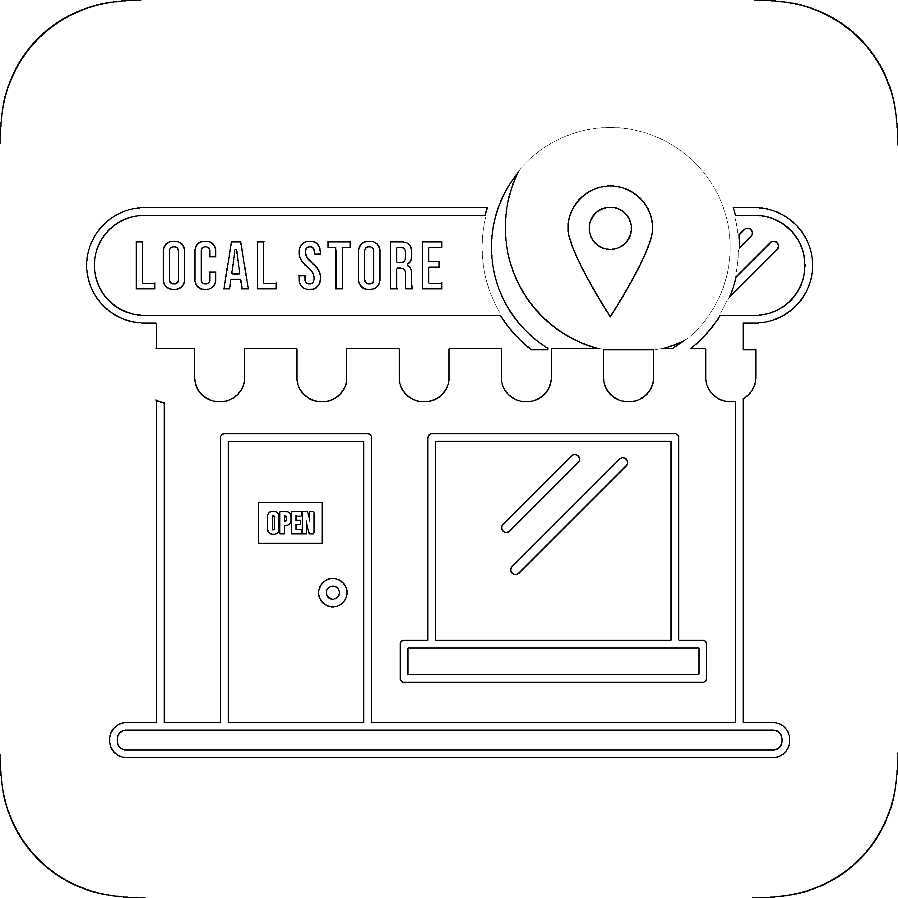**店铺装修数据管理系统 SDMS**

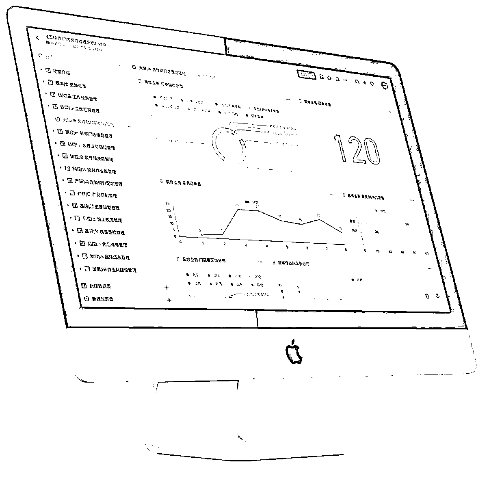

团队也不理解：2022 年，公司面临着主营业务的萎缩，公司都快黄了，为什么还要反着来，去做一件团队都看不懂的事情？

更何况，装修管理还仅仅是我们自己提出的一个概念、业务难度是更大的。

一些老客户就更不理解了，到现在，我们还能听到很多嘲讽声，说“工臻道是马路班子不懂装修”。

但这还没完。在连锁装修管理上，我们也有自己的想法，比如我们做了在线系统、SOP、知识库、各种手册、施工日志云端水印打卡、视频验收、一店一码等等。

这也引来了一些人的调侃，说工臻道做的那是装修吗？做的是形式主义、脱裤子放屁。你看，传统生意圈还有这样的思维，对于生财的圈友是不是觉得不可思议？事实确是如此。

所以，当装修行业的竞争还处在激烈的淘汰赛中，工臻道自身也在不断迭代，不断成长，一些阶段性的经验，适不适合现在就拿出来和大家分享呢？

后来，鱼丸告诉我。生财希望能给大家带来更多的项目，或者说看到行业里的新机会、新玩法，可以分享更多实战方法和经验，那工臻道的阶段性经验，或许能够帮助到那些正在面临同样问题的人，哪怕是一点点启发。

# 二、机会和挑战

中国的连锁业发展和市场是怎样的？

**（1）市场大 需求明确**

2022 年中国餐饮的连锁化率为 19%，相比美国的 54%，意味着我们还有很大的空间。

截至 2023 年 6 月，中国餐饮行业的万店连锁品牌共有 **5 家**，分别是蜜雪冰城、华莱士、绝味鸭脖、正新鸡排、瑞幸咖啡。

窄门餐眼收录的餐饮门店数据 1800 万家以上。

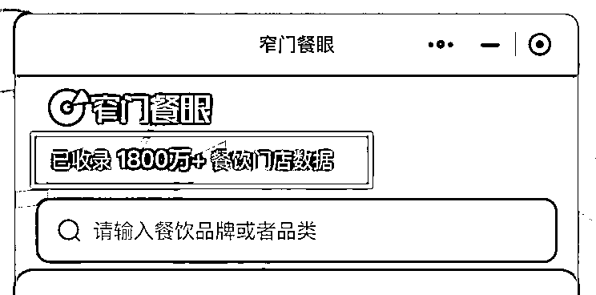

国家药监局的统计显示，2022 年全国共有连锁药店约 36 万家，并且还以每年 2.3 万家的速度递增。

……

问题来了，一个充分竞争的行业还有没有机会？

就看这个数据：**连锁化率**。

所谓“连锁化率”，简而言之就是这个行业中连锁门店占比总门店的比例。餐饮行业的连锁化率是怎样的呢？

2022 年，19%

2021 年，18%

2020 年，15%

2019 年，13%

2018 年，12%

即便 2022 年中国餐饮的连锁化率为 19%，相比美国的 54%，意味着我们还有很大的增长空间。这些都是公开的数据，能看出来市场够大，不担心没活干😀。

## （2）市场那么大，怎么做成自己的业务？

成交，持续成交才是业务的核心。那我们怎么从 0 到 1 成交第一个客户呢？

一是主创团队的原有业务资源，有一定的服务基础，成交难度相对低。

二是行业协会里的会员单位匹配度比较精准，但成交难度会大，从链接到信任需要时间周期。

对于我们的新业务来讲当然是先从相对容易成交的地方开始，原有业务资源的客户里就有一个年开店量千家级规模的连锁品牌，本身他们就有开店装修的需求，我们就主动把装修管理业务的思路给老客户做了汇报，希望能有机会尝试给他们提供装修服务。

基于原有业务服务质量的认可和信任，客户愿意给我们 2 个店让我们打样测试。

店铺装修打样的过程我就不展开了，从客户下店装修打样测试到向客户交付开业，这个阶段对我们来讲是最困难的时期，一是希望马上有业务进来，二是我们自己不清楚是否有能力消化。

打样结果并不惊艳、但也没有特别差，勉勉强强能说得过去，主要是客户每个月都有大量的新店需要开业交付，对专注店铺装修方的需求是持续的，也同意给我们成长的机会。

这样，在起步阶段我们的重心反而不是业务流量问题了，而是要快速成长起来对应的团队交付能力。

刚开始客户给我们每个月下 2 个店、3 个店的装修需求，我们非常珍惜机会，每个店都全身心投入，抱着空怀心态，一点一点的记录、学习，不断改善，从工期、工艺、质量、安全等每一个环节都下足了功夫。

在此基础上我们还做了一些微改善，这些微改善基本上是基于互联网思维打造产品的理念来的，也选择使用了一些互联网工具。

这帮助我们给客户交付了不一样的服务体验，其实就是在交付产品上下功夫，改善服务质量给客户同样的结果但不同的感受。

针对客户感受最直接的施工交付一线，我们制订了标准动作，并要求团队坚持执行：

1.  每个单子下来我们的订单管理员就会在系统建档开始按流程推进，并和客户同步进度状态。

2.  每个装修店铺都要建一个专门的施工作业群，所有相关的信息在群内随时沟通。

3.  施工日志每天拍照同步到群内，实时给客户和监理汇报。

4.  对产品进行持续的优化和改善。

5.  坚持巡检、安检。

这些标准动作我们借助互联网工具让数据在线，并做到可视化且可分析， 团队实时同步也可以随时向客户和需求方呈现。

感觉就像给传统生意插上了一个小翅膀，信息有了归集，成果即时可见。最重要的这些都是时随着业务发生而实时更新的。

售后维修面板

质量巡检面板

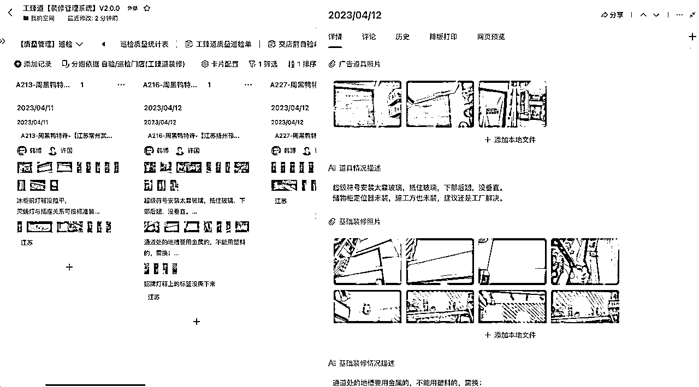

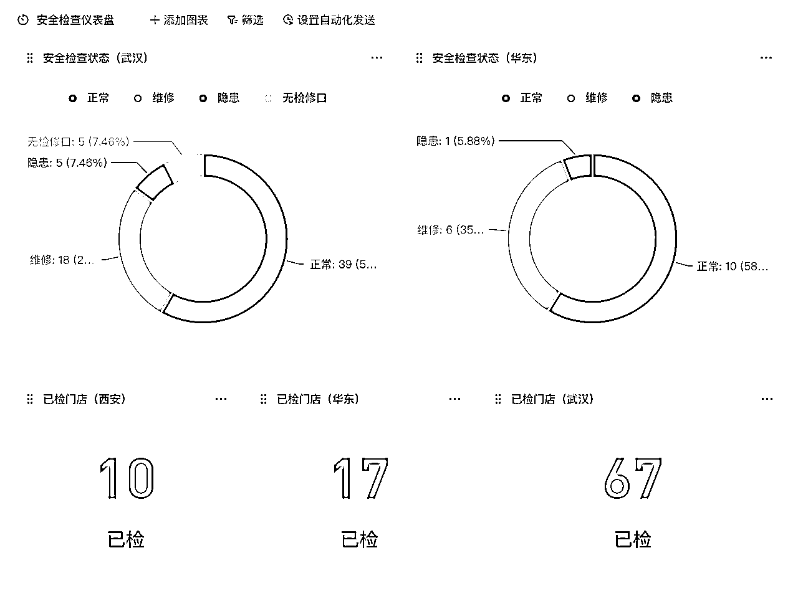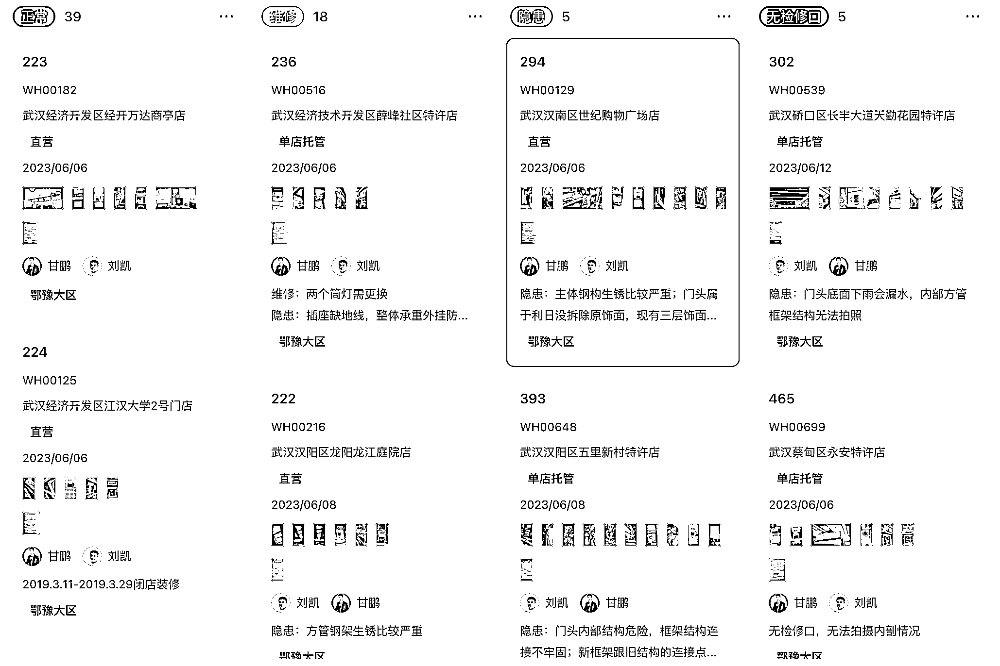

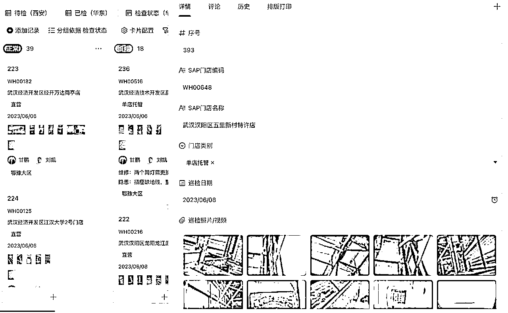

还有许多和业务相关的数据呈现，篇幅所限我就不在这里展示了，互联网思维和工具已经系统化的在帮我们的连锁店铺装修业务进行效率改善和能效提升助力了。

这些小小的改善刚开始可能给客户没有那么明显的感受，客户的原话：很多团队刚开始也这样做，做几个店后就不坚持了，估计你们也差不多。

我们把客户的话放在了心里，警醒团队要忠于初心、坚持规范、并持续改善。

从一个省区几个店开始，我们这样做，业务扩展到几个省区几十个店的时候也是这样做，慢慢客户的感受就不一样了，开始主动的希望我们多介入一些区域施工，多给我们派单。

到目前这个项目我们做了 20 个月，施工范围已经拓展到了 14 个省区，2 个品牌客户，月均 40 多家店铺的装修交付，现阶段交付量主要是取决于我们自身作业班组的建设速度和质量，增量的空间还是很大的。

这里我想解释一下：我们需要的业务增量不太取决于流量的因素，而是取决于把现有客户服务到位。

实际上我们只需要少数几个精准客户就足够当前阶段消化了，原因是什么呢？

因为只要成交一个连锁企业，他们本身就在全国开店，每个月都是几十上百家的店铺开业计划，而我们要做的就是有能力多帮客户做好交付。

这种客户的开发难度相对较大、对应的业务回报也大。核心是取决自己团队的施工交付能力，流量的因素反而不是那么的迫切。

给大家展示一下我们借助互联网工具让多区域施工管理和施工规范持续落地的情况：

**工长施工日志使用的手机 APP：**

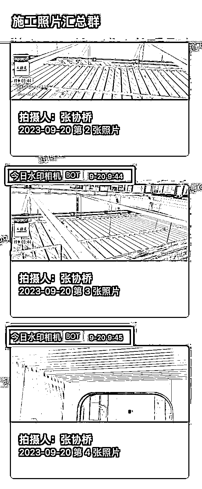

施工日志水印打卡，这里我们用到了一款手机 APP【今日水印相机】，我们提前做了一些和施工项目相关工序和项目信息，让一线工长师傅拍照即可后台同步。

安全文明施工规范，进场安全 3 件套（警示条幅、安全背心、安全帽）。

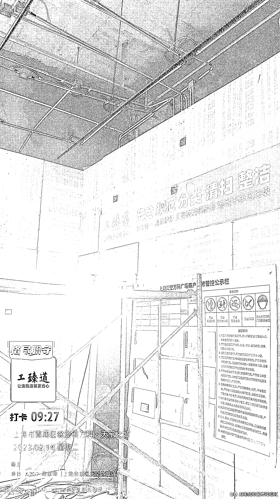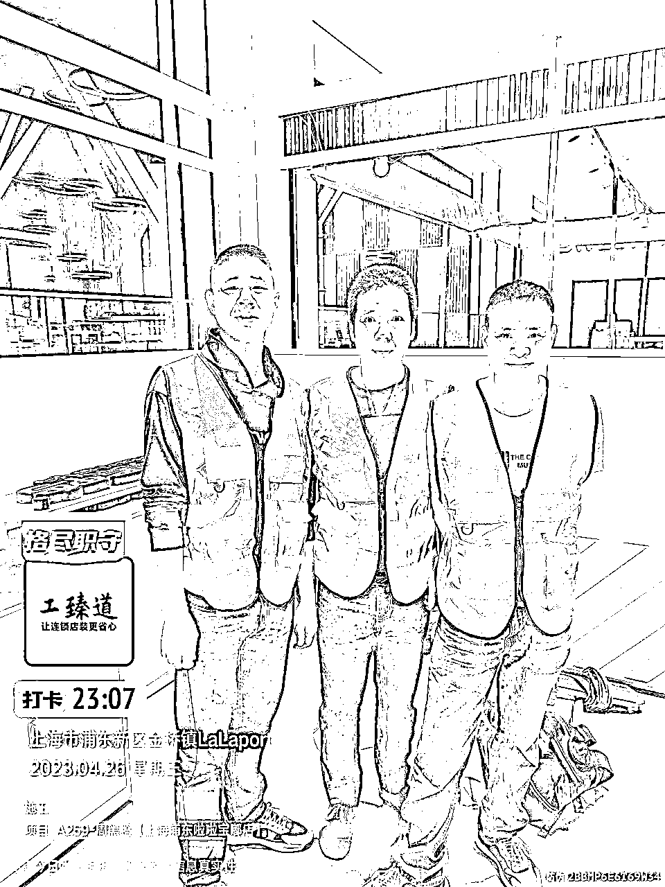

搭建业务管理系统对所有项目信息进行管理，配置互联网工具让店铺装修全流程实时在线。

客户体验感拉满，慢慢的，每月从下单 2～3 家店铺，到 8～9 家店铺，再到 10～20 家店铺，再到 30～40 家店铺，到现在下单的业务量基本取决于我们能否消化的能力了。

所以你看这个业务的本质不取决于持续获取流量，而是重在选择精准流量成交客户后，然后死磕自己提升能力，业务自然增长。

给大家解释一下我们的原有业务，是给连锁企业提供广告道具的供应，和装修是不同的行业，但都是服务同一类客户：连锁企业。

我们装修业务成交的第 1 个客户是我们的老客户：周黑鸭，我们一直为他们提供广告道具的批量供应。

看到这里、生财的圈友是不是也发现了。

这个细分业务有个特点，就是客户不需要太多但业务可能会很多。相应的不太需要你持续的花精力不停的的去开发新客户，而是需要你把大部分精力放在团队能力成长上、然后去复制放大这个能力。

我理解这也很像互联网行业的裂变倍增效应。

有了从 0 到 1 的开始，那我们也要思考这个生意能不能持续和长久，让自己或团队成长起来的能力能够持续复用或放大。

单纯的解决店铺的装修交付可能还不够有竞争力或者说和多数的传统装修公司还没有那么明显的差异。这些足够大的市场需求有没有共性的痛点是目前还没有充分解决的？我们是否可以以此突破口、改善方案，快速成长呢？

从我们接触到的品牌方和多数的装修公司那了解到，装修公司只愿做自己区域内的活，不太愿意去异地施工，要么需要客户多支付一笔远程费用，要么客户就要花大精力在当地寻找施工方进行培训后完成店铺装修。

这就出现了三个问题：

一是客户的建店成本会增加；

二是客户的开店计划可能会受到影响，不能如期找到合适的施工队完成装修交付，就无法按期开业；

三是品牌连锁店的装修标准无法同步落地。

这三个问题也正是品牌方目前最头痛还无法解决的痛点。本质上这三个问题可以理解为传统企业管理方式上的问题，我们想用互联网的方式重做一家连锁店铺装修公司，或者用互联网思维改变我们的业务现状，就让我们做这个项目时充满了事业心。

**（3）问题有了，痛点也就相对清晰**

连锁企业客户们全国开店多区域同步施工、施工规范装修标准化，传统装修公司很难满足、用互联网思维是不是可以快速解决呢？让客户找到我们后就可以一次性解决这三个需求？

我们要想解决这个问题，目标任务其实比较明确了：

1.  选择本地化施工省掉远程费。

2.  提供店铺装修标准化服务，可以把现场环节尽可能的转移到生产环节，做到工期可控。

3.  做到全国多区域交付，我们在当地培养作业队，并对作业队进行品牌施工规范的培训和标准辅导。

我们能否解决这个痛点？

**（4）用互联网思维为整个团队赋能**

有了比较清晰的目标和任务后，怎么快速达成是我们当务之急要解决的关键点。

传统的装修项目经理或者监理制做到全国交付的话就要有足够的人员配置，而我们的客户群聚焦在千店级以上的连锁企业，基本决定了以小面积店型快装业务居多，单店产值低、工期快、区域广。

这样的话，上量增人的方案显然从成本上这条路是走不通的。少人化、强管理、用工具是我们必然要走的路。

**（5）匹配合适的跨区域装修方难度大、不好管理**

通过互联网思维和工具可以快速招募到全国各地的优秀工长，并持续迭代。通过装修行业垂直 APP，前期可以解决一部分工长招募的问题。这块还是相对好解决的，我就不展开了。

不管对于品牌方还是装修服务方，在全国各地去建立施工班组都是一个极大的挑战。

对于品牌方而言这不是他们的业务重心，投入产出比并不划算。对于多数装修公司，班组不能复用也是极大的浪费，所以大多没有意愿在全国各地建立施工班组 。

而我们只专注连锁企业店铺装修这个细分领域，为第一个品牌服务时建立的班组成本可能会高一些，当我们开始服务第二个品牌、第三个品牌的时候，边际成本就降低了。

对于跨区域培训成本高、难度大、执行参差不齐，用互联网的工具可以降低难度减少成本，快速对齐标准。飞书视频会议和云文档让我们的异地协同更加高效，飞书工具的使用也帮我们解决了这一难题。

我们学习了飞书的【飞阅会】形式，开会前大家就把会议内容放进云文档，提前做好会议内容的准备，开会前大家就可以了解的会议内容和议题，有不同意见也可以在文档上直接评论或编辑，会上形成的成果也可以实时形成纪要，下一步行动直接设置成飞书任务@到负责人。开会效率一下子提升了好多倍。

飞书视频会议还帮我们解决了店铺远程验收的问题，店铺装修竣工后都要经过我们内部验收合格才可以向客户交付。

每个月我们全国 10 几个省区都有几十家店铺要验收，一是我们的验收人员根本跑不过来，二是验收人员全国到处去现场也是个很大的成本。

现在我们就用飞书视频会议拉线上视频验收，10 分钟左右就可以验收完一个店铺，一下子节省了很多验收这个环节的成本，还提高了数倍的验收效率。

飞阅会（项目会和学习会）

解决了一线的作业需求只是解决了离客户最近的一个环节，还不能完全解决上面提到的痛点。还有其它支持环节是否也可以用互联网思维和工具来帮助提升和改善呢？我们选择了通过飞书知识库每周固定学习，持续迭代团队能力。

**（6）知识共创制订 SOP、进行培训、并持续改善让团队快速成长**

通过飞书知识库、云文档编制《广告道具安装手册》《装修标准施工规范》《常见问题汇总》等文档，分享给一线工长及施工人员，快递对齐标准。

我们用飞书知识库创建了相应的内容手册，这些资料信息实时分享给作业体系内的每一个伙伴，这样整个体系内的动作标准就有了一致性共识，对于不同省区的施工班组就有了标准依据，培训也有了素材。

而且这些资料都在云端、又可以实时更新。相应的对于管理人员来讲，整理这些知识内容也是快速学习成长的一个路径。

通过搭建知识库这样的动作基本解决了我们全国多区域作业标准对齐的目标。

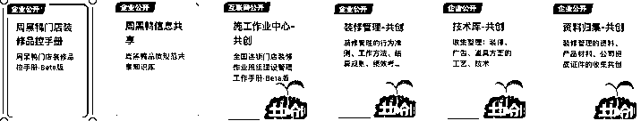

**（7）搭建可视化数字协同系统**

上面说了我们搭建了业务管理系统，一方面是为管理提效，另一方面也为客户提供详细的店铺装修数据。

这样先从信息端就解决了多区域异地同步交付的问题，同时达到降本增效的目标。相应的对客户服务体验也有了很大的提升。

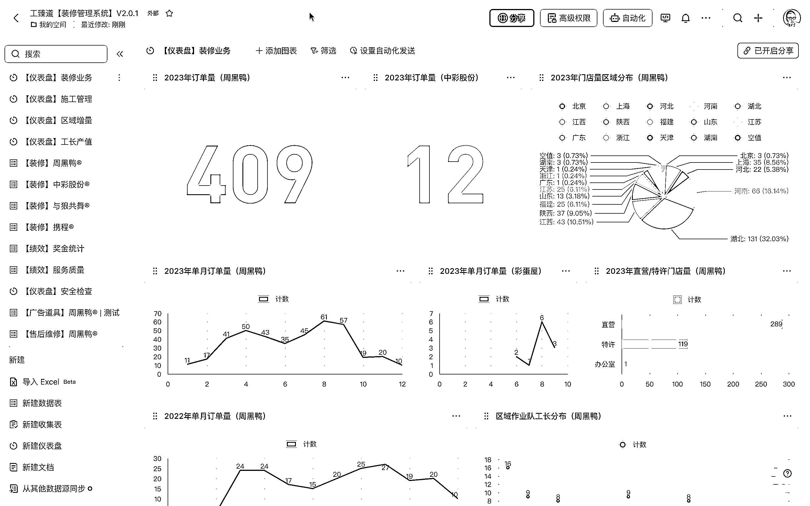

我们基于飞书多维表格搭建了店铺装修管理系统，让不同区域不同项目的进度管理实时可见。多数节点可以异地线上完成，比如：安排实勘，视频验收，售后维保等都可以通过飞书来实现。

我们这个项目是做连锁店铺的全国装修交付，传统的服务模式多个省区店铺的装修不是一家实施，店铺的装修信息无法实时归集，装修进度也无法实时同步，品牌方要花费很大的人力手动去归集这些店铺装修资料，一是不及时，很多资料时间久了也缺失，另外留存也是个难题，是管理层很头疼的一个事情。

我们使用飞书工具后，用多维表格搭建了自己的业务管理系统，解决了这个问题。

现在全国多区域的店铺装修资料实时在线更新，进度实时同步，云端留存。仪表盘功能也可以让我们的管理层对全盘项目进度一目了然，节省很大的管理沟通成本。

管理系统在线的店铺装修信息样本数据越来越多，通过这些数据来赋能我们制订出更准确 SOP。再赋能到一线施工环节，做到循环改善、持续精进。

具体到单个项目管理上，我们利用飞书多维表格制订了任务清单 SOP，这个在线小工具，可以把任务、执行人、时间节点、流程任务状态，提醒实时串连。特别是我们团队坚持少人化，一人并行处理多个项目时。

这个工具配合项目群可以把工作安排的井井有条、同时还有甘特图功能，让任务状态可见。

**任务清单**

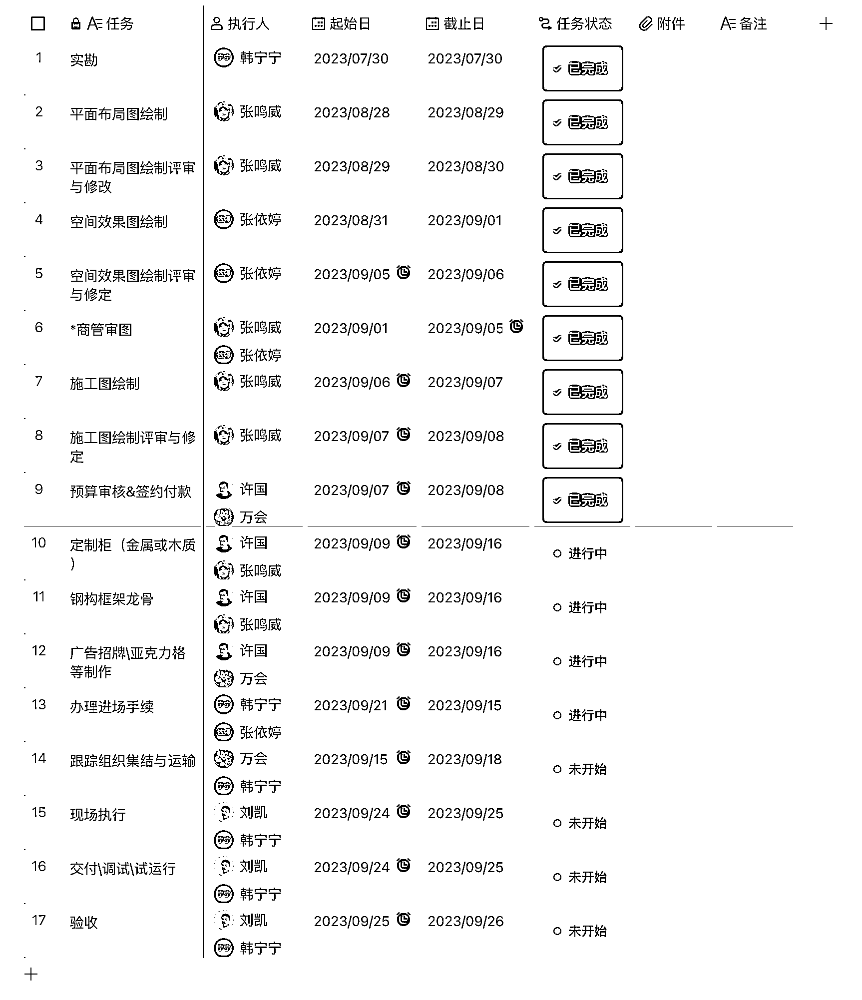

**任务甘特图**

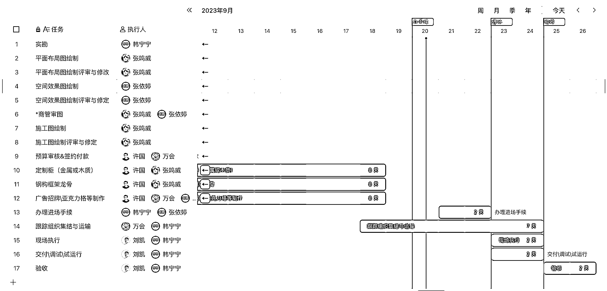

**把互联网产品开发流程化思路用到装修管理上**

传统装修公司是靠项目经理管控店铺装修的全流程，如果全国多区域大量店铺装修施工的话就需要增加项目经理来解决交付问题。对于想做全国装修交付，又要解决客户的痛点、降本增效，老路子显然是走不通的。

我们就借鉴了产品开发思路把这个岗位的职能拆解后发现，对于施工项目的安全、进度和质量原来由项目经理一人统筹的事情可以尝试拆分为订单（类似后台）、技术（类似研发）和工长（类似前端）三个环节来协同解决。

之前一个项目经理并行管理 1～2 个装修工地，经过拆解：一个订单管理员+一个技术支持+N 个工长就可以并行管理 N 个装修工地。

目前我们团队 3 个技术支持 +3 个订单管理员单月+配合 30 个工长可以推进 40 个以上的店铺装修工地，还能并行管理 90 个左右店铺的广告道具的下单管理工作，人均能能效几何级提升。

使用【今日水印相机】定制了品牌模板水印，对每一个施工店铺和作业班组可以实时精准跟踪到作业状态，并和企业微信群进行了打通。

施工现场照片除了在后台完成云端同步存档，还配置了机器人自动实时发送到企业微信指定施工照片汇总群。随时随地可以通过电脑或者手机进行全国装修作业巡检，这样基本解决了跨区域巡检、通勤和时效的问题。

**订单员视图**

**技术支持视图**

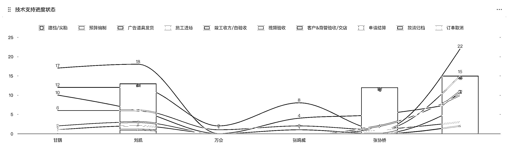

**工长视图**

**（8）如何快速完成能力沉淀、复制批量交付？**

互联网思维的知识沉淀和持续改善可以帮助团队快速成长，共创-分享-学习-改善，团队可以持续精进。

通过搭建飞书知识库与知识共创让大家主动分享、自主学习和快速成长，每周总结、学习分享，反复的培训，快速实践，并持续改善。

我们内部是希望打造一个学习型组织，怎么样把技能显性化变成大家都可以快速学习的知识，知识库帮了我们大忙，我们的小伙伴都有一个对全员开放的个人知识库，还有针对不同环节创建的共创知识库。

这样，一个好的经验或者好的方法就能快速的被组织内成员共识到，对不同时期加入的小伙伴也能通过快速学习相应的知识库内容给大伙对齐基准线。

我们平时培训资料的准备也就高效多了，包括我们的员工手册，作业手册、业务介绍等我们都创建在知识库内，很方便传阅和分享，效率提升了很多。

**（9）这么几个操作下来 客户的整体体验好感提升不少**

客户体验好了，慢慢开始觉得我们专业有自己的套路，甚至邀请我们给他们的其它服务商进行赋能和培训，订单的持续性就有了基础，复购增量就是时间问题了。

借助互联网思维搭建的管理系统不仅提升了装修项目的批量交付效率，还给客户带来了超预期的服务体验，增强了客户持续下单的信心。

经过 20 个月的快速成长，在同行中已经有比较明显的差异化优势，客户和同行开始有口碑传播效应。

# 三、回顾

先是我们看到了细分市场的增量空间，从 0 到 1 成交第一个精准客户。

然后借助互联网思维和工具对团队能力进行了赋能和提升，接着就是不停的重复，进行知识梳理和持续改善，快速学习并用于实践，把每个项目都当案例来做。再返孵到知识库，如此反复，累积升长。

工具层面：我们主要使用了飞书（多维表格、知识库、云文档、视频会议、任务、日历等功能），今日水印相机，微信和企业和微信等。

为整个团队赋能，提升业务能力和管理效率。同时给客户交付出比较好的用户体验，

# 四、总结

**我对选择项目的几点思考，不一定全对，只是我个人的理解，希望对你有启发：**

1.  市场有没有机会，增量空间够不够大？

2.  行业内是否有巨头，有没有成长周期红利？

3.  需求是否持续，有没有痛点？

4.  我们怎么在同类中快速形成竞争优势？

5.  能力能否累积复用助力业务自然生长？

6.  互联网思维和工具能否解决数据驱动业务发展？

题外话（简单介绍一下我们的情况，希望能帮助您更好的理解上面的分享内容。)

2022 年初我们选择：为连锁企业提供店铺装修标准化服务，附带提供招牌广告道具的模块化、优化，量产、批量交付业务。

2022 年我们尝试搭建数字化管理系统，解决少人化管理团队完成全国多区域店铺装修施工交付的挑战，达成降本增效的目标。经过筛选对比我们选定了飞书来帮我们解决这个问题。

目前我们高频使用的飞书模块功能有多维表格、知识库、云文档、审批、视频会议、任务、日历等，我们自己在多维表格上搭建了业务管理系统，解决了全国多区域店铺施工信息在线同步，进度同步，视频验收，费用审批、结算，施工班组管理，组织学习等动作。

之前月均交付 30 家店铺需要 15 个以上的项目经理在现场推动，跨区域施工还会有大量的出差成本，我们经过在飞书上搭建数字化装修管理系统、组织调整，快速学习等改善，相同的任务 3 名订单管理员和 3 名技术人员就能轻松处理。熟练之后这个能效还有较大的提升空间。

飞书这种互联网工具的的使用给我们的传统生意带来了无限可能，其它更高阶的功能我们还在学习实践中，希望未来能在我们年交付数千家店铺装修的目标上发挥更大的价值。

* * *

评论区：

风 : 越来越能感受到生财的意义。前两年自己装修，经历材料选择不透明，师傅进度随意，装修公司设计师跟进不及时，这样一套组合拳下来，价格还不低，就思考过用互联网工具优化装修工序，再加上线上引流，一定是个比较大的生意。也观察到工装是更高频的需求，连锁客户的复购是非常有空间的。只是行业跨度太大，思考到此为止。没想到几年后，在生财遇到了几乎是完全把这个想法实践出来的创业者。这个生意应该能有很大的想象空间[强][强]加油
邓 致远 : 挺详细的，前几年做过类似的，只不过客户群是商城里面连锁餐饮的。
韩博 : 谢谢支持，确实有比较大的空间。
韩博 : 现在还在做吗？
邓 致远 : 现在没做了，我们那种单个门店客单会高一些，平均都在 100 万施工费用。

* * *