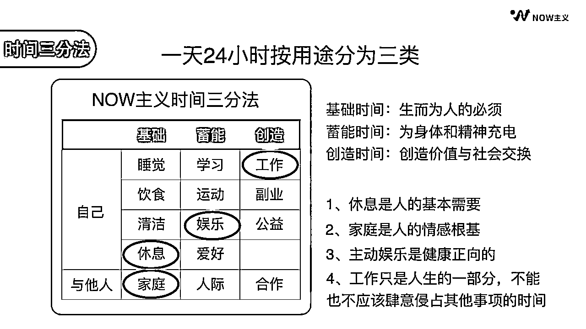

# 时间管理，通往赚钱的超级快车道

> 原文：[`www.yuque.com/for_lazy/thfiu8/khyd1yhtye5x3qtd`](https://www.yuque.com/for_lazy/thfiu8/khyd1yhtye5x3qtd)

## (43 赞)时间管理，通往赚钱的超级快车道

作者： 车纯的高效人生

日期：2023-10-25

Hi，生财有术的船友们，大家晚上好~

我是车纯纯，自我管理品牌 NOW 主义的主理人，畅销书《极简自律：如何活出想要的人生》作者，11 年自我管理践行者，目标管理&时间管理专家，3000+创业者、职场精英高效能教练。

很荣幸受邀成为本次时间管理大航海的教练，为航海手册提供了一套完整的时间管理理念及落地内容，并通过社群陪伴大家完成 21 天的时间管理蜕变之旅。

来参加生财的朋友，目标都很明确：赚钱。

很多人会觉得，时间管理和钱有什么关系呢？

我发现赚到钱的人，都是时间管理高手。做好时间管理，你会发现你可以做的事情超乎你想象。

之前你需要 8 个小时才能完成的事，可能现在 4 个小时就做完了。

所谓高手，就是最善于投资时间的人，用最快的速度拿到最大的结果，并且在自己最擅长的领域里做最长线的积累。

在人生价值上坚持长期主义，在商业项目上做到快速落地。

我在去年 2 月开始依托视频号展开知识付费业务，精准和高效让我在 2022 年因疫情被封 183 天的情况下，仍然拿到了不少成果：

1、时间&目标管理课程：2 天制作的课程累计卖出 500+，7 天制作的时间管理课程累计 GMV10 万，14 天制作的目标管理课程累计 GMV30 万
2、写书出书：3 天自学启动，2 周签约出版社，2 个月全书完稿，上市当天登上当当网榜一，1 个月加印，销量 6500+，前后共计 9 个月完成了从素人向畅销书作者的转变
3、视频号活动：1 周筹备发售，实现单场 GMV16 万
4、写书课：1 天筹备发售，3 条朋友圈 GMV2 万，链接合作伙伴 3 家

特别强调一下，以上都是我个人策划、统筹完成的工作成果，只有课程交付部分有一个 2000 元/月的线上小助理。

与此同时，当时和我一起出发的很多视频号博主，时至今日课程都没有制作出来。

我用自己的实际行动和成果，证明了想要在这个信息爆炸、焦虑丛生的时代拿到结果，精准高效的时间管理，一定是通往赚钱的快车道，也是每个人必须修炼的核心功力。

据我了解，本次大航海有许多同学，不止报名了时间管理这一艘船，少的有 2-3 艘，多的可能有 7-8 艘，还决心在每条船都完成 21 次的打卡。

如此巨大的学习和实践任务量，如果不做好时间管理，就只能是痴心妄想，还会因为完不成而自责焦虑，得不偿失。

但是，绝大部分人对于时间管理的理解，是错的。

（一）时间管理，不是管理时间，是管理自己

我辅导过 3000+学员，经常有学员问：计划被打乱了怎么办？时间不够用怎么办？总是被别人打扰怎么办？总是想玩手机，导致分心、拖延怎么办？

仔细看看就能发现，这里面的核心不是对时间，而是对自己进行管理。时间是无法被管理的，我们只能管理自己利用时间的方式。

每天花 2 小时漫无目的地看帖子、焦虑、内耗，和每天花 2 小时打磨并发布自己的内容、产品的人，注定会活出不一样的人生。

我有个私教学员去年 8 月找到我，说自己报名参加了很多课程，想做自媒体给自己的瑜伽馆导流，但是一直没有启动起来，每天总觉得很忙、有很多琐碎的事情干扰，学了半年才发了几篇帖子。

我帮助她以自己为中心，整体把她和团队的工作流程梳理了一遍，每日的管理工作时间节约了 50%，并且协助她把原来需要 2 个小时才能完成 1 条的新媒体内容创作流程，缩短到了半天完成一周的素材量。

通过这次梳理，她终于把注意力收回到了自己如何安排时间上，不再被各种工作赶着走，从容自在了许多，新媒体的账号也在 2 个月内更新了三十余条，粉丝从 500 多人到破万。

各位生财的船友，在面对大量高价值的信息和想做的项目时，也一定要从自己出发，做好时间管理，梳理出一套高效、清晰的工作流程，避免哪个都想做，最后哪个都没做好，竹篮打水一场空。

（二）做时间管理， 不是做的事情越多越好

一个简单的道理，许多人却一辈子也想不明白：生命有限，事情却是永远也做不完的。

一天赚 10 万的人，和一天赚 1000 元的人，一天都是 24 小时，他们的差别不在于做事的数量，而在于所做事情的价值。

我的私教里有一个创始人，去年开始投入到人造钻石行业，因为行业变化很大，经常熬夜加班处理事情，和我沟通时抱怨说，董事长凌晨 1 点还在和他打电话。

了解下来，发现他陷入了做很多事，却一直拿不到结果的状态里。因为下决策和执行速度都很快，很多新计划还没有经过思考和推演，就直接推进到细节处，发现问题已经来不及修改。

我建议他每天给自己安排至少 1 个小时的“纯时间”，所谓“纯时间”就是完全安静下来的思考时间，这 1 个小时沉浸式地组织和整理信息，全盘审视整个项目的推进情况。

过了两周他给我反馈，他现在做的事情更少了，但是决策质量却提高了，最近做的几个决定落地的都很好，项目也慢慢积累起了产量和设计优势。

做事、赚钱都离不开“想”和“做”两个步骤，时间管理可以帮助我们思考核心问题，聚焦核心动作，用 20%的关键动作达成 80%的关键结果。

（三）好的时间管理，一定是量身定做的，能兼顾好工作、生活和健康

因为高效能教练的身份，我经常被问到的一个问题是：纯纯，你效率这么高，不论做什么事都指哪打哪，能快速拿到结果，这样高强度的工作不累吗？

有这个困惑的人，没有搞清楚时间管理的核心，是【提高单位时间的效率和价值】，不是【单纯地延长工作时间】。

有很多生财的船友，都在从事副业，或者自己做自由职业，这对时间管理的要求非常高，如果没有做好时间管理，容易陷入三个误区：

一是太过于投入工作，导致饮食不规律、熬夜、久坐，还没赚到钱就把身体搞坏了。

二是自己独处时管不好自己，一不小心就追了一天剧，面对没有做完的工作又陷入了严重的内耗焦虑。

三是病急乱投医，直接对照高效人士的时间表来执行，想每天五点半起来工作，结果坚持不了几天最终还是放弃了。

真正好的时间管理，是根据自己的性格特点、行为习惯和生活方式，为自己制定一套时间管理方案，在自己的时间节奏里，高效完成工作、快乐享受生活。

我就曾帮助我的一个喜欢打游戏的自由职业学员，从满满当当的时间安排中，单独划分出了 1 个小时的娱乐时间，让他在高强度的工作之余也能享受主动娱乐的快乐。更有趣的是，打完游戏之后，他心情很愉快，做事的效率反而提升了。

了解了时间管理的本质和做好时间管理的价值，我们来看看这次大航海带着大家进行的时间管理，和以往大家在别处学习实践的有何不同。

时间管理领域最著名的方法论叫做时间管理四象限，据说是美国总统艾森豪威尔提出的，后由史蒂芬·柯维撰写在《高效能人士的七个习惯》这本书中，随着 2002 年第一次出版，这个方法随之风靡世界，几乎每个讲时间管理的老师都会讲到这个工具，

时间管理四象限以其简单好用的框架闻名，鼓励使用者将要处理的事项分配在四个象限中：重要紧急、重要不紧急、不重要紧急和不重要不紧急。

鼓励大家多做重要不紧急的事，尽快处理重要紧急的事，授权给他人做不重要但紧急的事，尽量不做不重要不紧急的事。

但在我个人的实操中，我发现这个工具虽然好用，但有很大的局限性，它的名字叫“时间管理四象限”，却是以“事件”为衡量标准的。

事件是无限的，而时间却是有限的。

这个工具有两个核心问题，一是我们很容易把四个象限填满，却还是不知道每件事安排在什么时间处理，整体效率会更高；二是因为工作总是被划分在“重要紧急”的类目中，长此以往，工作会疯狂溢出，占据我们的生活、学习、娱乐，甚至是陪伴家人的时间。

在本次的航海中，整套时间管理的思路，建立在我提出的方法“NOW 主义时间管理三分法”上。

这个方法从有限的时间出发，先看看我们日常工作和生活中，一天 24 小时会分配在哪些事情上，再做一个整体的梳理，提炼出了一个新的时间分配模型：

基础时间：生存必须的时间，睡眠、饮食、清洁、休息、陪伴家人；
蓄能时间：积累充电的时间，学习、运动、娱乐、爱好、人际关系；
创造时间：创造价值的时间，工作、副业、创作、公益，与人协作。

本次大航海，很多同学都报名了多条航线，时间管理大航海作为最强助攻，非常希望能助大家一臂之力。

我们将基于“NOW 主义时间管理三分法”的模型，循序渐进地帮助大家搭建精力充沛且效率翻倍的时间管理模型，轻松实现 1 小时顶 3 小时，结合各类目 21 天大航海的干货学习，快速成为各领域的高手~

查看详细“NOW 主义时间管理三分法”的模型可点击链接跳转，或者查看航海手册 2.3.3 节

当然，时间管理是一种行为习惯，更是一种生活方式，需要在实践中逐步领悟和掌握，所以本次航海为大家制定了时间管理的标准航线，供大家对照参考。

第一周，我们以觉察当前的时间使用情况，以及掌握基础的时间管理方法为主；
第二周，我们开始尝试整体安排 24 小时时间，并直面和解决拖延、情绪等问题；
第三周，我们将进一步提升计划的执行度以及有效时间的利用度。

同时，我们也为大家设定了基础和进阶两个不同级别的学习目标，大家可以先向基础目标进发，达成且行有余力之后，再进一步攀登更高效的进阶目标。

【基础目标】：梳理出一套适合自己的时间流程表，且执行度达 70%，日有效利用时长 ≥ 5 小时

【进阶目标】：梳理出一套适合自己的时间流程表，执行度达 90%以上，日有效利用时长 ≥ 8 小时，并完成为期 1 周的时间利用效率跟踪复盘报告

在整个航海的过程中，请大家务必记得，每个人都是独一无二的，不论是作息习惯还是工作方式，每个人都有最适合自己的节奏。所以最高效的时间管理系统一定是在践行中逐步探索出的，是自己为自己定制出来的。

看到这里，可能有些同学会有些困惑，21 天里这么多的学习内容和目标，我该如何开始呢？

我主导策划的这套时间管理方案，有一套基本的人人都能用的底层逻辑：从记录开始，然后通过「记录-复盘-计划-执行」的四步骤轮动，逐渐清晰自己的时间配比，引导自己把时间花在真正重要的事情上。

所以，请大家今晚就下载一款配套的时间记录软件：

安卓平台：块时间（免费，功能齐全）
IOS 平台：
1）时间块青春版（免费，没有二级分类功能）
2）时间块（收费 12 元，功能齐全）

这个软件的使用方法，可以参考下面这两个视频：

此外，请大家打开手机中的闹钟功能，从明天的起床时间算起，每一个整点制定一个闹钟。

这个游戏我称之为「疯狂的闹钟」，能够帮助大家矫正主观对于时间流逝的感觉。

明天一天的时间里，请大家在闹钟响后，及时地在块时间软件里记录自己的时间使用情况，这样一天下来，大家的 24 小时中，基础时间、蓄能时间、创造时间的配比就非常清楚了。

这将为大家后续做好时间管理，提供最强有力的数据支持。

以上就是我今天分享的全部内容，也期待接下来的 21 天与大家一起同行，各位在学习和实践中遇到任何问题，都欢迎在群里艾特我，我会尽快解答。

我是车纯纯，自我管理品牌 NOW 主义的主理人，畅销书《极简自律：如何活出想要的人生》作者，11 年自我管理践行者，目标管理&时间管理专家，3000+创业者、职场精英学员高效能教练。

在此预祝大家此次的航海之旅一路顺风~

* * *

评论区：

🔥逆熵增者💰 : 谢谢分享，很有收获

* * *