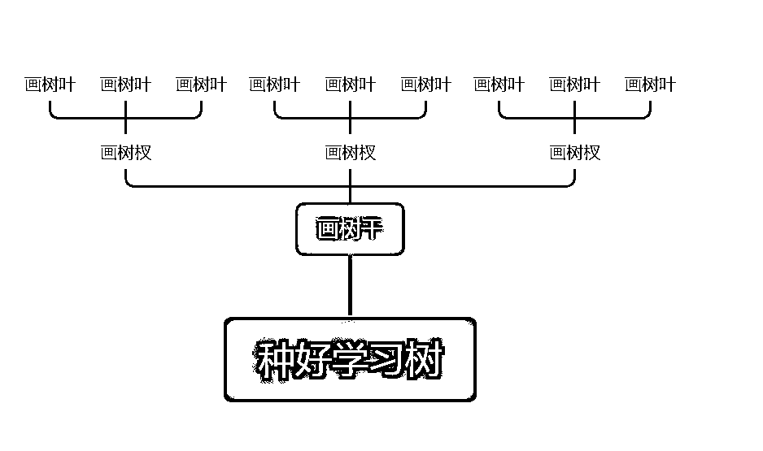
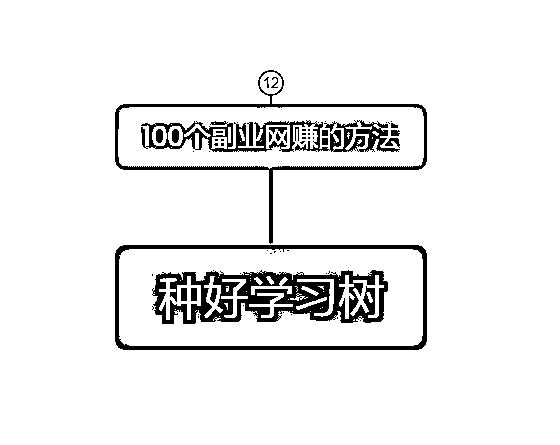
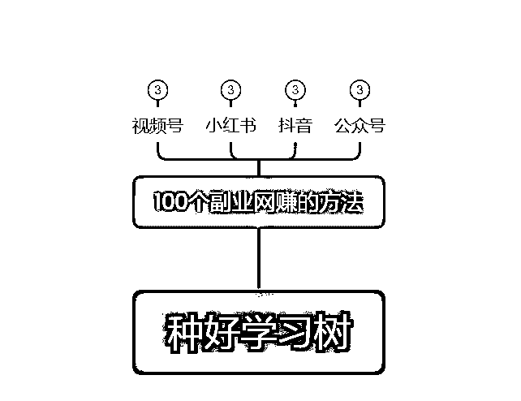
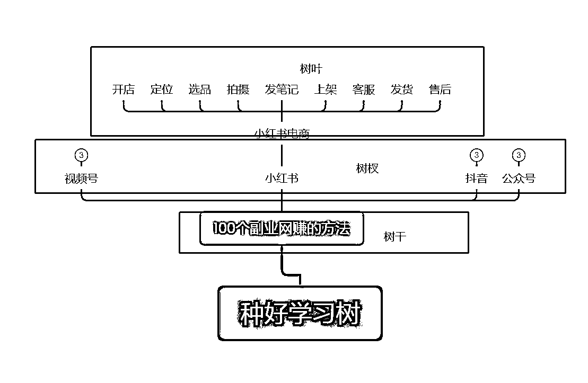
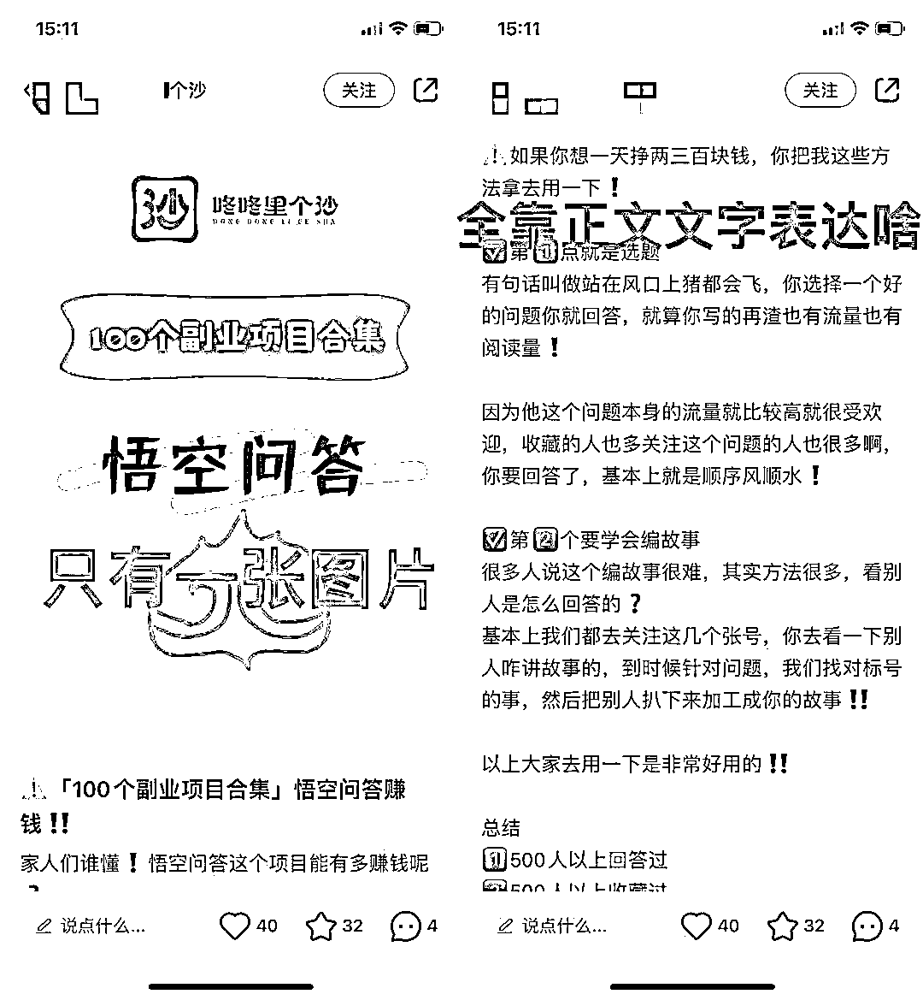
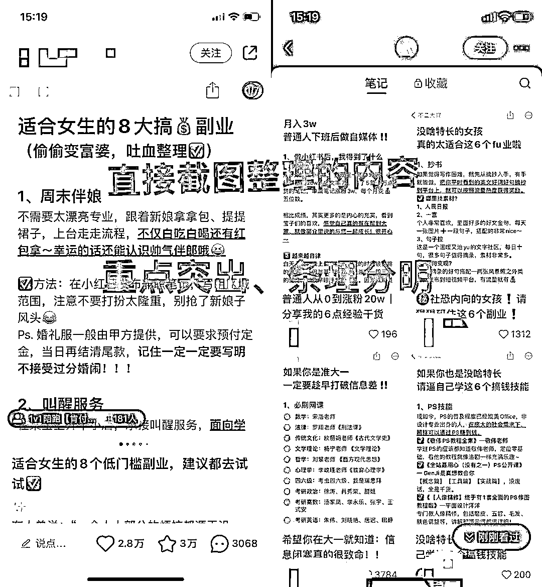
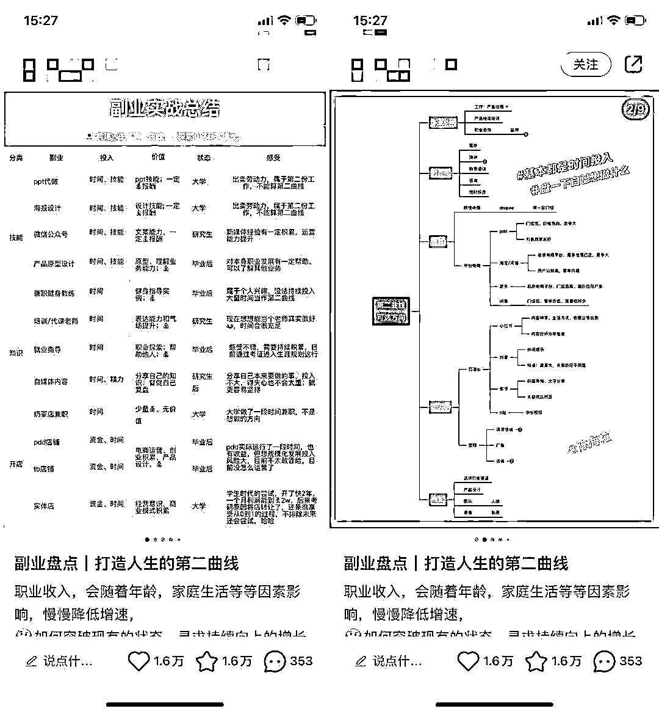

# 如何跑通资料整理小闭环？

> 原文：[`www.yuque.com/for_lazy/thfiu8/haco6p7fqk5zkndc`](https://www.yuque.com/for_lazy/thfiu8/haco6p7fqk5zkndc)

## (90 赞)如何跑通资料整理小闭环？

作者： 熊孩子不差！

日期：2023-10-27

hello，生财的圈友们，大家好，我是熊孩子不差，可以叫我小熊，导图有了逻辑创始人，思维导图陪跑教练。

从 2021 年 4 月成为生财会员，我默默无闻研究项目，到去年 10 月拿到第一篇精华帖，我觉得人生跨越一大步。

再到今年连续第四次在航海分享，一路走来真的太幸运也很感动。感谢生财团队提供的交流学习平台，感谢生财团队的邀请，让我一次次相信我可以，从一个身无一技之长，到学会思维导图，到用思维导图变现，副业月入几万的选手。

其实，我们拥有的每一个技能都不可小觑，你可以把它藏在心底，也可以把它推上舞台，但我相信今天我们来资料整理航海的圈友，都希望能把一个技能放大拿到结果。

今天的分享主要分为以下三个部分：
一、资料整理是什么？
二、如何 21 天学好资料整理？
三、如何在航行过程中做好预期管理？

以下，尽情享用，我们开餐啦：

资料整理从字面上就很好理解：整理好我们的资料。

这些资料包括学习资料、工作资料、项目资料、甚至你的人生资料，让我们的生活、学习、工作都分门别类的归纳好，方便日后的调用。

一个人对资料整理的习惯向外映射的是他的个人生活习惯。比如说，有的人在家到处乱丢东西，那么他的电脑桌面大概率也是满满的文件夹。

上面是我们对资料整理的初始印象，我们在生财在航海，一切都是以拿结果为导向，所以咱们的资料整理会比字面意义更升级，更落地。在这里我们希望大家掌握资料整理的技能，学会用它落地在一个你感兴趣的项目中，实现引流的目的。

引流在某种程度上说也是变现的一种，因为有了流量才会有成交，有了流量，你的产品才有价值。

在我的学习生涯中，我的资料整理大概经历了三个阶段：

第一阶段，解决“松鼠囤积症”，提高效率。
第二阶段，瞄准专注领域，快速成长。
第三阶段：拓展第二曲线，实现引流变现

通过我资料整理的三阶段，咱们航海中的圈友也一定是分布在这三个阶段中：

第一阶段，暂时没有下场实战过项目，通过资料整理技能提升自己；
第二阶段，学了很多板块的知识，但是都没有系统梳理过，通过资料整理聚焦自己；
第三阶段，在某个领域有经验和资料沉淀，需要流量，通过资料整理引流。

不管咱们处于哪个阶段，这一次我们都给自己立个 flag：整理好 1 个或多个资料库，跑通引流闭环。

在这里我给大家推荐三个行动步骤：

耕种犁地在这里是什么意思呢？认真学习航海手册，对资料整理有个整体认知，选定好一块地（一个工具）开始准备资料整理工作。

咱们的资料手册一共 2 大板块，有 5 个章节：

板块一：资料整理认知篇，包含 1-2 章节，这部分大家主要是扫除大家对资料管理的基本认知障碍，记住相应的概念，为了后面应用更顺畅。

所有的内容都是辅助我们搭建好一个属于自己的资料库，但所有的成绩都取决于我们开始行动的第一步。这里大家先看一遍航海手册，再搭配我给大家准备的航海手册的知识地图。

在第一步中，我们已经选好了要做资料整理的工具，那接下来就是种好学习树，什么叫种好学习树呢？说白了，就是围绕一个目标，列出要实现这个目标涉及的所有知识。

为什么要画学习树呢？就是为了避免大家像我之前一样，只会囤积资料，为大堆资料焦虑的状况。

那我们如何画学习树呢？

我们举个例子，比如你要整理的资料是关于网赚领域的，咱们定个目标：整理 100 个副业网赚的方法，也就是我们的树干已经画好了。

接着要开始画树杈，这时候我要们思考：网赚的方法有哪些方面呢？

比如，咱们可以按照项目类型：淘客类、中介类、产品项目类等维度去划分。
或者，也可以从不同的平台划分，比如：公众号、抖音、小红书、视频号等。

不管采用哪种划分维度，只要能把网赚这棵树的树杈按照一个思考维度画出来就可以。

第三步，我们就要开始画树叶了。以小红书平台的网赚方式为例，包含：小红书接广告、小红书电商、小红书带货等。我选定小红书电商这个树杈画树叶，树叶就是我要具体学习的知识。

对于小红书电商来说，必不可少的流程有：
养号-开店-定位-选品-拍摄-发笔记-上架-客服-发货-售后

那这些环节中的每个点，我们都要去详细的扩充具体知识点和具体的技巧方法，这些统统是学习树上的树叶。

这时候以自己的使用角度来判断就好，将他们放在合适的文件夹。

可以结合“黄金圈法则”是什么、为什么、怎么做来梳理，把知识讲明白即可，其他的就可以删掉。

如果真的不太擅长搜索，生财里面直接搜索相应的关键词，比如：小红书电商，你看个 20 篇，对这个赛道的了解基本就够全面了。

经历两个阶段的辛苦劳作，成果终于要面向市场了。那么，我们该怎么找到销售渠道，怎么销售呢？

在什么渠道销售？这里也就是我们要选定好实战的平台，你是计划在小红书资料引流、还是在抖音资料引流？

怎么销售的问题，也就是我们怎么去引流。
这里我就以小红书平台为例子给大家讲解资料引流：

每个方法拎出重点，每个点标上序号，每个细节说关键，不要啰里吧嗦一大堆。

比如：

这里注意，小红书最多能写 1000 字，所以也不要一下分享很多。可以一篇分享 5 条内容，那么 100 个副业网赚项目连续更新，也能更新 20 条了。

做法：拎出每个副业的重点，用 PPT 形式来呈现（会用其他工具作图当然也可以）

思维导图可以把你的整理的项目以合集的形式展示出来，但是又把具体细节收缩起来。

以上四种类型，，做好看是锦上添花的事情，如果实在不会做，那就文字写好点。

所以你看，咱们资料整理能力根本不会被浪费，很好地为实战小红书航海打下了基础。

直接建个群聊叫：“领取 100 份副业资料包请进群”。有需求的用户就会进群，用小号在群里发微信，引流到私域。

比如思维导图有个功能，可以把不想展示的收起来，只能看到一个大框架，看不到具体。有人需要的话就会问，那你自然而然把他引流到私域。

问题又来了，到了私域后我们该怎么办呢？

到了私域，你可以卖 9.9 元（别太贵了）一份，跟他说整理也很辛苦，需要付费的。
要敢于说付费，也是筛选白嫖党的一种方法。

总之，流量来了，要有对应的产品承接流量。

任何一个项目，都只有进入真正实操后，才知道你会遇到各种想不到异常。在这个过程中，我们一定要做好预期管理。

如果对某个环节不那么熟练，咱们可以降低目标。比如原计划整理 100 份资料，但以当下的进度可能只能整理 20 份，那调整好目标即可。

千万不要内耗焦虑，航海是为了成长，不是带来焦虑的，在行动总比在观望好。

流量是我们每个做自媒体的人都需要的，大家一定要记住：低调引流，不要随意发微信号。就算是号被限流了也不要沮丧，谁做自媒体还能不玩坏几个号呢？都是正常情况。

好了，以上就是我今天关于如何跑通资料整理小闭环的分享，接下来我们一起实战行动，用行动拿结果，一起生财有术～

* * *

评论区：

挽心 : 太牛了
坏脾气的小可爱 : 熊老师的思维导图经验真的很有用，可以自我介绍，还有一些课程归纳总结。
小野 : 熊孩子太牛啦！
马热爱 : 熊熊超棒
自在 : 给熊老师打 call
小浩哥 : 牛
李米乐 : 历害👍
月落 : 厉害👍🏻

* * *