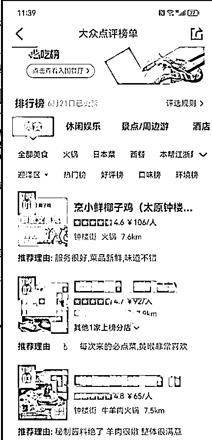
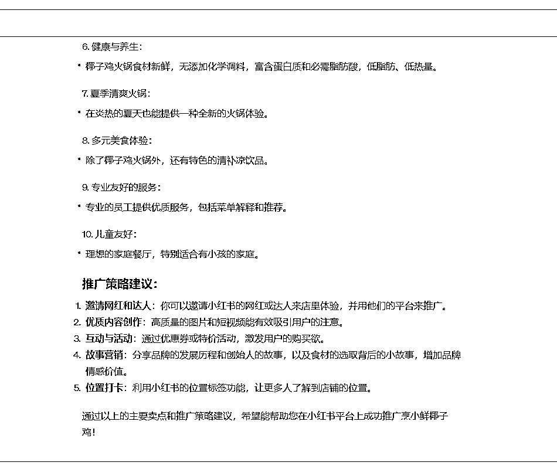

# 如何做好一名线下流量服务商

> 原文：[`www.yuque.com/for_lazy/thfiu8/iqttg8oqgnscradd`](https://www.yuque.com/for_lazy/thfiu8/iqttg8oqgnscradd)

## (23 赞)如何做好一名线下流量服务商

作者： 不语

日期：2023-10-26

线下流量服务商航海的小伙伴大家好，我是不语。很高兴和大家一起参加本次航海。

我从 2019 年开始就在做线上推广。在 2020 年的时候，有一个朋友开的实体店找了一家代运营公司，然后被无情骗了 1.8w（探店+代运营）。毫无效果，于是我决定来做这个事儿。

当然，我入局这个赛道肯定也不止上面这个原因，主要还是因为这个项目有很大的机会。主要有这几点：

以上为我们提供了一个重要的洞见：实体商家拥有深藏不露的经营魅力和未被充分利用的流量潜力。而实体店主对于流量获取和转化能力的缺失，也让“线下流量服务商”的存在产生了价值和意义。

由于线下实体店通常具有固定的客户群，如果合理的引导线上流量，它们有可能实现收入的大幅度提升，甚至可能开拓出全新的业务模式和收入渠道。

所以在我看来，我们的目标群体一直是一些优质，但是生意一般的实体商家。

作为流量服务商，我们的任务就是帮助这些实体店获取更多线上与线下可转化流量，帮助他们直接提供有效、可衡量的结果。

这里说一句题外话：目前有很多线下做代运营，或者做探店推广的，因为门槛低、要求也相对较低，导致了越来越多的人涌入这个行业。许多对自媒体并不了解的商家，可能会被某些所谓的代运营公司和用虚假数据欺骗。就像上面我讲到的那个朋友的情况一样。因此和商家联系时，可能他们会比较警惕。

但大家要记得，现在商家的引流需求还是很大的，他们需要专业的人为他们服务！这时我们更需要展现自己的专业度和真诚的态度来让商家更原因达成合作，实现双赢。

如果你想要长期深入的走这条“线下流量服务商”的路，建议根据自己所具备的引流能力和有此需求的商家合作，根据商家情况个性化引流，不接超出能力范围的需求，这样才能做好一个长期项目。

引流其实就是项目中最为关键的一个点。因为你只有掌握了吸引流量的方法以后，才能有效的把流量引导到实体店，这对实体店来说就是最重要的。这是最直接关系到是否能给商家做出来效果的因素。

引流手段有很多，比如说 seo 优化，自媒体平台的营销，内容的营销，甚至是有效的投流……

我们要选择适合的方法进行推广，而且一定要注意引流到的人和需求的匹配度。引流到的人一定得是自己想要的人，可以满足客户的需求。

所以想要做好线下流量服务商一定要掌握至少一种吸引流量的能力，而且是可以满足实体店商家需求的能力。

那我们怎么选择学习哪个引流能力呢？建议根据自己的能力优先找熟悉的引流方法。比如：

之前做过抖音、小红书，就可以优先看这两个引流渠道。

如果你是新手，或者有微信私域运营的能力，那么可以尝试先掌握微信裂变的方法，从一个较短的引流活动合作开始你的“线下流量服务商”这个项目之旅。

另外，大众点评/美团平台依旧是线下实体流量的聚集地，建议大家也掌握一些关于这个本地生活平台的引流方法。

以上这些提到的引流方式，都在航海手册第三章中有详细讲解，并且有相关案例帮你更好的理解，另外第三章也展示了其他的一些引流方式，大家可以根据自己的需求进行查看。

找到合适的商家是我们开始这个业务的第一步。那么如何筛选优质商家呢？

在筛选商家上，可能大家采用的方法会存在一些差异，这里我主要来给大家分享一下我常用的方法。

然后对他们的

1：观察店铺的客流，比如说中午和晚上，去实体观察店铺内客流情况，看看是否有稳定的客源。如果这家店铺每天的中午和晚上都有稳定的客源，那么基本不在咱们的考虑范围内。

2：了解店铺的翻桌率，就比如说中午，店铺里边每张桌子的使用次数。如果一家的翻桌率很高，那么客流量自然而然很大，也不在考虑范围内。

3：看看店铺的评价（大众点评）看看差评数量，店铺的评分，榜单的排名。排名靠下，评分一般但是差评很少，这种就是很值得沟通的商家。

分享一些小妙招：
1：因为很多做不出来效果的，也就是割韭菜的。很多老板都被割了一遍，所以会有一些抵触心理，培养基础信任会很难。所以一定不要做虚假的承诺。

2：一定要了解清楚商家的需求。尽可能的详细和全面，要了解他们为什么需要这些，还有就是他们想要做到的效果。

3：做到一个共情，尝试站在店家的角度去考虑问题。他们会有很多的疑惑或者顾虑，站在他们的角度去想问题会更容易培养信任。

4：整合之前自己的成功案例到 PPT。让他们可以更直观的看到你的实力，而不是一个承诺。

5：不一定适用大家的方法。我会给部分商家先免费提供半个月的服务，拿实际效果来说事儿。但是一定得区分人，有些人可能就奔着薅你半个月羊毛，所以一定要选择聪明的老板进行一个合作。

了解完商家需求后，需要制定一份详细的合作方案。比如说预计的投资，回报，还有责任义务，然后签署合同。

首先，我们在做方案前要明确具体的目标，比如期望的流量数或者转化率。最直观的就是销售额的变化。

然后再根据目标设定合适的引流玩法。和商家达成从新媒体平台引流的共识以后，然后就会用基本的矩阵号铺量的玩法。

然后我们要根据商家的属性去决定，是选择素人铺量，还是说商家注册矩阵号铺量。比如说餐饮也就是最初探店开始，那么他们就安排素人铺量即可。

比如之前我合作过一家中医馆，他们想要的用户群体就是附近周边的中老年人。那么最简单的就是帮店铺起一套账号矩阵（抖音的附近推送，你不想看到也得看到）。但是都需要针对详细群体的画像去做内容。这个方法适用一些的店铺（即店铺辐射范围是同城而不是全国性质）。

用户群体中老年人居多，所以店铺的账号矩阵基本都是发送一些养生内容，科普内容。培养了用户的基础信任后，再慢慢引流到私域进行运营，然后再进行储值以及二次转换等操作。

再举一个餐饮门店的例子，上次航海期间我接到一个业务，是一家全国直营的店：烹小鲜椰子鸡。这种餐饮门店比较适合抖音/小红书+大众点评的模式。

首先，我们要考虑他的用户群体、用户属性：吃椰子鸡的人基本都是 30 岁以上，注重养生的人。
然后，再考虑我们山西太原这个城市：二线城市中的垫底城市。

因为现在老百姓对博主的信任度低，所以当时我们大多是安排了素人到店拍摄，虽然可能拍摄水平没有博主那么好，但是这样的作品会更加真实，老百姓们认可度会更高，然后再选择加入部分低粉博主。

进行完探店推广后，继续开始第二步操作：对大众点评店铺进行优化。（具体的优化方法直接到航海手册中查看。）

从最基本的店铺装修到 SEO 优化。这二步做完后，这家店已经上了大众点评火锅榜单，太原市第四，迎泽区第一。店铺营业额也从日均 5000 到了日均过万。

这里插一句题外话：我们在确定为店铺总结卖点、制作方案的时候，也可以利用 ChatGPT 来帮忙。比如：

当然，ChatGPT 是一个提效的工具，如果没有的话也不要紧。

开始合作以后，我们要定期的去了解进度还有当下的效果，有问题一定要及时的去和甲方去沟通。

这部分的内容很多，我在这里就不展开讨论了，航海手册中对每一步都有详细的说明，包括商家建联技巧，不同的商家适合的引流方法推荐等等，大家记得根据航海手册的步骤学习起来。

另外需要注意的是，。然后根据自己所在城市去制定合适的方案，一开始思路制定好，多数品牌都是适用的。

希望大家参与航海都可以学到自己想要的东西。航海中有疑问，大部分问题都可以在航海手册和在航海群里讨论找到答案~

* * *

评论区：

微信用户 : 哈哈，留个 v
不语 : cx1313456

* * *