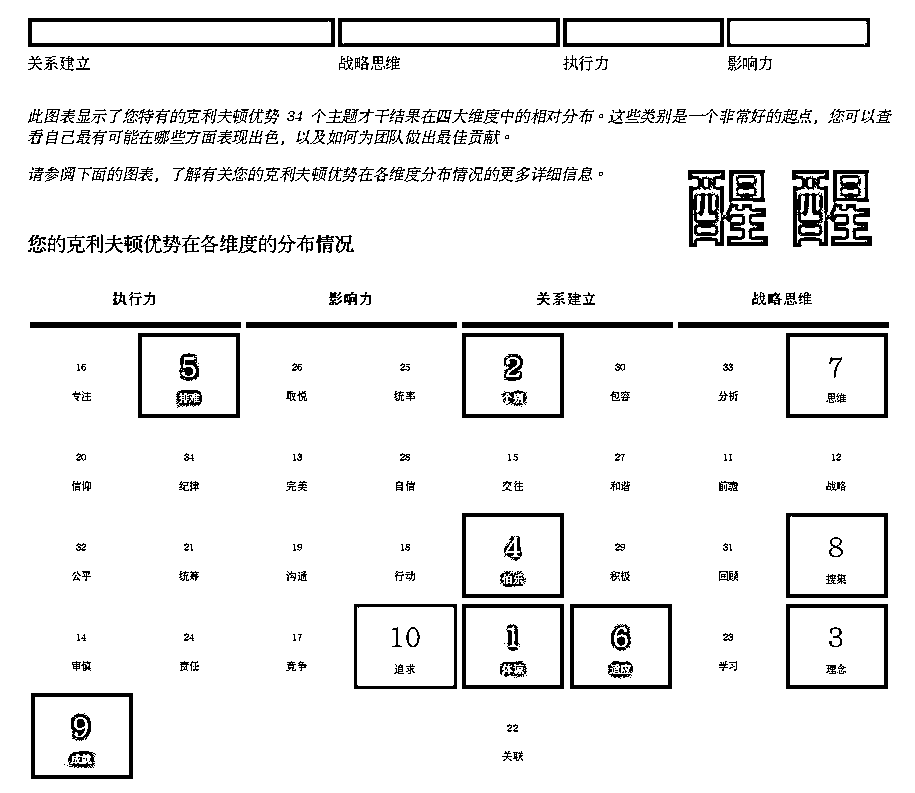

# 三步走，人人都能找到优势

> 原文：[`www.yuque.com/for_lazy/thfiu8/kg7uclchvmqk9kis`](https://www.yuque.com/for_lazy/thfiu8/kg7uclchvmqk9kis)

## (80 赞)三步走，人人都能找到优势

作者： 醒醒同学🍃

日期：2023-10-24

晚上好啊，大家伙～

我是醒醒，盖洛普官方认证教练/个人成长教练/生财有术团队的优势培训师，本次「个人优势航海」的教练，个人优势航海手册的主要撰写者。

3 年行业头部训练营运营经验，2 年班教练经验，累计帮助 2000+人完成盖洛普测评，累计 800+小时付费咨询经验，连续 3 期参与生财拉新，和靠谱一起累计拉新 1000+人。

过去 6 年我一直在做和思考或人打交道的事，前几份工作要么因为钱少、太闲、太忙，要么因为觉得工作失去了意义而离职，即便已经拿到公司 Top，还是觉得很内耗，我不知道问题出在哪，后来明白和价值感有关。

如果一个工作只能阶段性的展现我的部分价值，越早的用完这部分价值，越会觉得工作只是“机械式”的重复，什么钱、忙、闲都不是关键因素，核心还是价值感的缺失。

我很想找能做一辈子的事，我开始思考“这个世界有没有什么是不变，永久有价值的？”——和人的刚需有关的事，衣食住行身心灵，个人成长就是一个刚需。

我决定试试做优势教练，因为我相信人在探索自我价值、和这个世界打交道上需要答案，需要找到精神、物质的栖息地，没有什么比“找到自己的价值发挥自己的价值”这件事更吸引人了。

回看我每个选择，凡是用优势和这个世界打交道时结果往往不错，我的核心始终是和人在一起，像个观察者，看到每个人身上的独特与发展性，帮助他们变得更出色，更幸福是我乐此不疲的事。

和我的盖洛普报告也挺匹配：关系建立>战略思维>执行力>影响力，如果我不是一个对人敏感的人，我不会做这类事有价值感，但这是我最近 2 年才明白的：努力很重要，但一个人所能取得的成就离不开他的天赋。

刻意练习观察并使用自己的优势这几年，我完成了单项目从零起步收入百万的目标，也帮助不少朋友、客户完成 30 岁的人生转型，从职场打工人到开独立工作室；从只有主业到主副业并行；从自我否定到自我接纳；从业务骨干到管理者的升级，每种身份、角色的变化都是一次新的人生挑战和梳理，盖洛普在其中起着不小的作用。

在几百个案例中，我越发的感受到：鱼难以学会爬树，狗难以学会飞，人总是喜欢用自己擅长的方式来完成人生的每一轮升级。

了解自己，找到优势是个漫长的过程，

一个航海手册也说不完所有的可能性，在航海期间，我们可以通过盖洛普工具认识并了解自己的优势，但“认识”和“会用”之间还隔着一道鸿沟，它并非无法跨越，本期航海的主要目标也是让大家更好的认识自己，找到自己的优势。

首先，优势往往由三部分组成：天赋才干、知识、技能，其中天赋才干对优势的形成影响最大。

在 5 月的航海中，有的圈友对工具有初步了解，这次更多精力应该放在应用上，即如何使用才干帮你更好的完成工作、生活。而还不了解这个工具的圈友，本次航海的主要目标可以是看懂报告，理解每一种才干和自己的关系即可。

根据以往的经验，在学习上，我总结了找到优势的三个阶段，分享给大家：

每个人都有擅长的天赋才干，想要发挥优势之前，要先了解自己有什么天赋才干。

在航海手册里，帮大家总结了每个天赋才干的特质、优势、盲区；还有对应的解法案例参考，对照着来观察自己即可。

这其实也是在解释：为什么我们自发的会做一件事，而且能做好。又为什么有些事天然的不感兴趣，做起来费力。

在学习中要特别提醒的是：盖洛普里天赋才干的字面意思和实际意思可能不同，可在航海手册的“3.4 了解 34 项基础才干”里查询。

我们可能收到过不少“负面标签”、“赞美标签”，这些标签往往会体现在才干组合里。有的标签我们不在意，有的却感到不解和受伤。有人很喜欢自己的才干组合，有人却很不喜欢。

我的朋友兰卡曾说：很多时候痛苦的根源在于不了解自己也不理解别人。怎么理解呢？

痛苦要么来自“我不希望变成现在的样子，但总展现出自己讨厌的样子；要么来自“我希望变成别人那样，但怎么努力都做不到”。此时盖洛普的作用就是能帮我们理解自己和他人，接受并欣赏彼此，找到互相合作的点。

不接受，就会对抗，反复的责问自己和他人：你怎么这样呢？

在看见自己和接受自己是这样的基础上，不断地欣赏自己和他人的才干好的一面，在航海群多给彼此正反馈，你会对自己的优势感知更清晰。

才干是需要持续去理解，去应用，去欣赏的，航海期间能种下一颗优势的种子已然是好的结果了，未来的几十年能把“活出优势人生”这样的习惯带入到生活和工作中，相信幸福度是很高的。

本次航海新增的内容主要是两块

本次航海手册增加了“执行力卡点”、“社交关系卡点”、“亲密关系卡点”、“时间管理卡点”、“不自信”、“情绪管理”、“职场问题”等几个方向的才干拆解参考，大家也可根据这个方式来拆解自己的问题，寻找解决办法。

在案例中学习，效果往往是比较好的，但每个人才干不同，情况不同，案例不代表人人如此，具体情况还是具体分析

大家多多提问，我不怕问的～毕竟我是个排难+理念+战略，不给我喂问题，我也吐不出东西

本次航海，我准备了适配于新手学习的问题集，有基础的圈友也可参加，根据这个进度来学习，结束后给自己或他人做基础解读是没问题的，很可能航海期间就能解决不少自己的问题。

先做自己的优势教练，把自己用好，对工作、生活大有裨益。

【才干提问/修炼模板】
1.发生了什么事？

2.我的情绪/感受/想法

3.我想要的/目标是什么？

4.我希望获得的教练的帮助是？

5.记录的内容可能体现了哪些才干？

才干的修炼需要觉察，“你发生了什么？促使你有这样的反应呢？”

所谓觉察就是看见“到底发生了什么”，分享这个模板给大家，既能自用也可以当提问模板用

今天的分享大概就到这里，大家有什么问题也可以提哈

* * *

评论区：

良辰-Oswald😉 : 这个好
常常 : 谢谢醒醒教练，下次个人优势航海实战继续冲[偷笑]
醒醒同学🍃 : 好哇
惠玲 : 醒醒教练牛逼！！！
不语 : 6

* * *