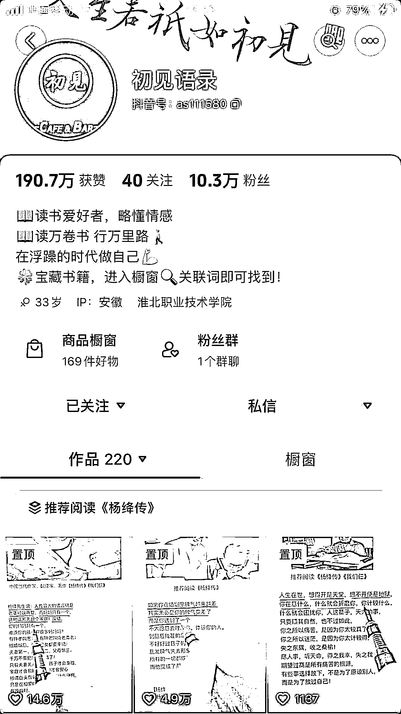
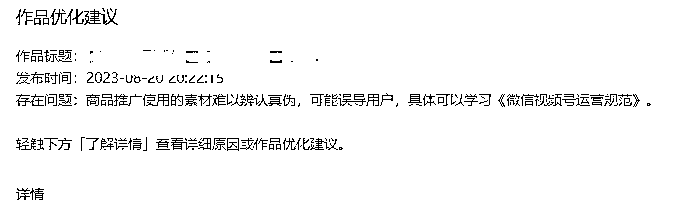

# 视频号伪原创账号涨粉新方向

> 原文：[`www.yuque.com/for_lazy/thfiu8/mldnlzt0zhv79s6i`](https://www.yuque.com/for_lazy/thfiu8/mldnlzt0zhv79s6i)

## (57 赞)视频号伪原创账号涨粉新方向

作者： 秋海

日期：2023-11-01

大家好，我是本次视频号涨粉航海的教练——秋海。很荣幸能够与大家在航海中相遇，也感谢小霸王的邀请。能够成为本次航海的教练，主要是因为我写了两篇关于英文育儿书单号的精华帖。

《生财三年逐渐丰富赚钱技能库，我终于通过英文育儿书单项目做到单日利润破万》

《视频号蓝海英文育儿书单带货一年累计粉丝 120W+，月入 2W+，我是怎么做到的?》

现在距离发帖时间过了将近半年，这个项目也发生了一些变化，趁着航海的机会，分享一下这些变化，希望能对大家有所帮助和启发。
英文育儿书单号这个项目已经出现一年多时间，目前出现了两种内容形式。

一种是最开始的用演讲视频，对口型再加上其他辅助素材，组成一条完整的视频。还有一种是直接用 AI 生成。

第一种方式，目前来看还是比较稳妥的，不管在哪个平台，都能获取比较不错的流量。因为这种通过自己找素材，伪原创的方式，还是能比较容易通过平台的原创审核。

第二种就是使用 AI 。就我所知有几种 AI 方案，都是收费的。像国外的 Heygen、Synthesia、D-ID，国内的有闪剪、硅语、KreadoAI。

AI 生成的内容，在抖音上可以被正常推荐。但在视频号平台上，却会触发真实性验证，还有被判原创度低。根据我自己的观察和一些圈友的反馈来看，原因可能是 AI 的人物和模板比较有限，一旦使用的人多，发生了重复，就会被判非原创，导致账号限流。

如果能用定制的 AI，那当然是最好的选择。但目前定制 AI 的成本还很高，不太适合用在这个项目上。

自从在生财上分享了这个项目之后，英文育儿书单号的赛道就开始卷了。现在要是继续投入这个赛道，起号的难度要比之前大不少。

那么这种方式运用在其他赛道上是否可行呢？答案是肯定的。

因为这个项目的逻辑是跟爆款文案，而同一个爆款文案，用不同形式表现出来，还是有很大可能再爆的。比如把爆款视频的文案，用图文的形式发出来，依然会爆。同样的道理，其他赛道的爆款文案，用英文育儿书单号的模式，重新制作视频，也依然会爆。

在抖音上，最近看到有人用这个形式做思维认知方向的内容，涨粉和变现效果都不错。视频号上面，中老年人群比较多，像国学和情感的内容也比较受欢迎。如果想要往这些方向发展，也是不错的选择。

这种新的内容方向，在抖音上做的人还不多，视频号上同样不多。与英文育儿书单号不同的是，认知思维的主要受众是中年男性，针对的人群不同。

英文育儿书单号做的人多，所以大部分宝妈对这样的形式不再感冒。那就换一个人群，用他们感兴趣的内容，做成英文育儿书单号的形式。

对认知思维方向感兴趣的，可以在抖音上关注下面两个账号，这两个账号的粉丝大部分都是最近一两个月涨起来的。

这两个账号其实就是划线书单号演变过来的，把划线书单号里的爆款文案，转换成英文，再用英文育儿书单号的形式做成视频。

另外一个文案来源，就是直接使用带货书籍的文案。把书里的文案，翻成英文，用在视频里。像划线书单号里的书籍，一本就有几百条文案，够做好多条视频。

而且书上的文案，都是经过精心挑选的，容易引起共鸣。使用书上的文案，可以避免与其他人的文案雷同，还有可能做出属于自己的爆款。像《句子迷》、《句子星球》，还有各种语录，都属于这类书籍。

使用书籍文案的另外一个好处是，如果视频爆了，可以直接发带货视频或者开直播承接流量。因为本身视频使用的文案就是书上的，与商品高度相关，对于提高转化率有很大帮助。

要是愿意真人出镜，也可以自己录成口播，形成个人 IP，有利于账号的长久运营。

因为使用素材混剪对口型的方式终究还是属于伪原创。流量视频还能在视频号上得到正常推荐，但挂车视频的审核要比流量视频更严格。用伪原创的方式，有时候带货的挂车视频过不了审，会收到作品优化的通知。告知存在推广素材难辨真假的问题，或者使用无关素材拼接的问题。

一开始时并不会遇到这些问题，都是在平台不断调整政策后才出现的。这个项目还能做多久，主要也是看平台是否会打压。

遇到平台政策调整的问题，除非说放弃某个平台，不然想继续做下去的话，就得尽量做符合平台政策的事情。毕竟，钻平台空子，只能做一段时间。想要把项目做长久，还是要跟着平台走。

英文育儿书单号的项目，从最初的搬运被删视频，到直接使用演讲视频音画不同步，再到加入其他素材混剪变成伪原创，都是一步步迭代过来的。接下来，就要往实拍方向发展。

从这个方面来说，政策调整不一定都是坏事，也可能是机会。每一次政策调整都会有一些同行放弃，只有能够根据政策调整，不断改进的人，才会走得更远。

所以，用伪原创的方式涨粉起号之后，要考虑往真原创方向发展。视频号对于原创的要求，应该是几个短视频平台中最严的，今年还推出了类似公众号「流量主」的「创作分成计划」，可见平台对原创内容的支持态度。

本次分享主要关注使用伪原创涨粉起号，打算长期运营的一个思路：跟随平台政策，迭代账号运营方法。涨粉不是最终目的，变现才是最终目的。而想要更好，更长期地变现，那么不与平台对抗会是更好的选择。

航海最重要的是尽快拿到正反馈，按照平台的要求去做，创作符合平台要求的内容，也更容易有正反馈。这一点需要大家多阅读实战手册，按照手册的操作上手实操。很多实操过程会碰到的问题，手册里都能找到答案。

每一次航海都是新的起点。

希望大家勇于下场，不要过多犹豫观望。与其把时间花在犹豫观望上，不如尽早行动。在行动中获取反馈，并根据反馈调整行动，才能更大程度在航海中学到东西。

能够发现英文育儿书单号项目，就是在一次次实操中积累下各种经验，最终以意想不到的方式，把各种经验串联起来，发掘出属于自己的蓝海项目。

以上，就是我的分享，谢谢大家。

* * *

评论区：

珂侨同学 : 看到某个群里有人说 11 月会被重点打击，这个没法做了吗？
秋海 : AI 的方式可能会被打击，对口型的还可以做
珂侨同学 : 谢谢秋海先生[玫瑰]
D•欢 : 请问一下，有一条作品被判为非原创，不能开通带货资格。有什么办法可以解决吗？
秋海 : 持续发布原创视频，过一段时间会开通

* * *