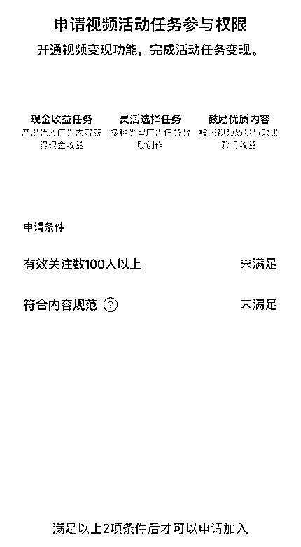
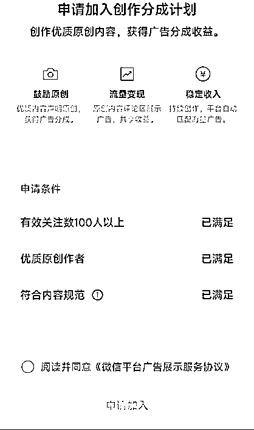
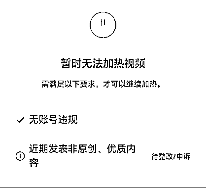

# 视频号分成计划娱乐解说玩法，一条视频一天 4815 元

> 原文：[`www.yuque.com/for_lazy/thfiu8/upol9gk544q0hw8c`](https://www.yuque.com/for_lazy/thfiu8/upol9gk544q0hw8c)

## (56 赞)视频号分成计划娱乐解说玩法，一条视频一天 4815 元

作者： 白丁

日期：2023-10-30

哈喽，大家好~我是白丁。我从 2013 年开始接触互联网，是跟着移动互联网一路跑起来的。我擅长测项目，跑新项目，项目嗅觉特别灵敏，看见新项目就兴奋，也擅长深挖项目，每一个操作的项目都很长，在项目不同时期采取不同策略深耕，我觉得无论做什么项目，做什么赛道，只有深耕才能长久，只有深耕才能拿到大结果。

我来生财马上 7 个月了，这是我在生财发的第三篇文章，每一篇文章都是干货满满。我也通过生财认识了非常多的朋友，我觉得在生财里不应该做一个知识吸收者，有好的经验也应该分享出来，助力更多的朋友拿到结果。

我今天分享是主题是视频号分成计划娱乐赛道如何拿到结果。上一篇写视频号分成计划的文章收获了小 100 个朋友的点赞认可，这一次的视频号分成计划依然全是干货，今天的分享分为五个板块：

**1.视频号分成计划如何选一个好赛道**

**2.视频号分成计划能做多久**

**3.开分成计划的逻辑**

**4.视频号分成计划赚钱的核心逻辑**

**5.娱乐赛道视频完整实操流程**

上面这些都是我在实操视频号分成计划中实打实做出来的成功经验，我就是按我这套理论娱乐赛道单天收益做到 4815 元。

我们在做任何项目都不是用感情做的，都是有一套方法，每一个能把一个项目做成功的人都是掌握了一定规律，都是按规律办事的。你就像我的团队为什么能在视频号里拿到结果，甚至我们分享的时候一些收益图太高都会被怀疑打假，最后录了视频才被相信。

每一个项目都有人能赚到钱，有的人赚不到钱，这是一定的，没赚到钱也没必要去怀疑。我在看到同行的优秀数据的时候第一反应都是相信，会思考为什么他能做的这么优秀，他做对了那些，如果我做到他那么优秀需要具备什么条件。我能在视频号分成计划中拿到结果，是我在多年跑项目的一些经验正好用在了视频号分成计划上，才取得了一点成果，没有之前做头条的经历也不会有这个结果。好了，废话不多说，直接上干货。

**一、视频号分成计划如何选一个好赛道**

**视频号分成计划这个项目赚钱逻辑一定是**选择大于努力，赛道决定收益，赛道决定了收益的上限。**赛道选不好，再努力也不会拿到好的结果，赛道选的好拿到正反馈也快，收益上限也高。针对视频号分成计划选择赛道我们总结了三点：**

****1.收益逻辑****

**想在视频号里做分成计划，一定要了解这个钱是怎么来的。很多朋友以为只要有流量了，能把流量做起来就能有高收益。这个思路在抖音中视频是对的，放在视频号分成计划上是错误的，我们来看一张图片：**

****

**上图我用红圈圈起来的位置是一个广告，视频号分成计划的钱就是来源于这个卡片广告的点击。只要有人刷到你的内容，在你的内容评论区点了这个卡片广告，就有钱拿，如果有人看了你的视频或者看了评论区没点也不会有收益。**

**这个就是视频号分成计划的收益逻辑。**

**我们了解了视频号分成计划的收益逻辑后就很清晰的明白影响收益的因素有：评论、人群、广告类型。**

**所以说我们在做视频号分成计划必须要按它的收益逻辑去布局赛道，同样 100W 播放不同的赛道你会发现收益会相差 5 倍都不止。**

****2.视频赞评比。****

**点赞、评论、收藏、转发在任何一个短视频平台里都是爆款的核心指标。在视频号里也一样，那么在选赛道的时候也要多观察这些核心指标。我在做视频号分成计划的时候主要考核赞评比。**

**因为点赞是决定内容推流的上限，评论决定了广告的展示量。一个对应的流量上升，一个对应的收益。做这个项目我发现有些赛道数据很好，但是收益缺很少，例如老年祝福视频，视频几百万甚至上千万几乎天天有，评论也多，但是收益就是少，这和内容年龄有关。**

****3.同行数据参考。****

**一个赛道在没有拿到结果的时候不能盲目去做，同行就是最好的参考标准，一个赛道能不能做同行已经给了答案。赛道好不好，只需要搜索一下赛道关键词看一下数据就明白了，流量不好的，评论不高的都不值得做。**

**视频号分成项目赛道只要满足以上三个条件就是好赛道，这也是我找赛道的标准。**

****二、视频号分成计划能做多久****

****一个项目能不能做长久就看是赚的谁的钱，如果这个项目是腾讯直接发钱，大概率是不会长久的。不管哪一家公司做一个项目，一定会有一个止损点，达到止损点就停止发钱。****

**而视频号分成计划也就是上面图里的的广告卡片属于广告投放商的钱，这个钱腾讯也在赚，为了激励作者持续发内容必须分钱，钱才是一切的源动力。这种钱只要视频号流量一直大，广告商是不缺的，这个分成计划就一直有钱赚，无非就是赚多赚少的事。**

**所以，我们在评估项目能不能长期做，就看赚的什么钱，赚的是谁的钱。就像 7 月出的支付宝分成计划为什么没人做了，刚开始有收益，收益越来越少直到为 0，因为支付宝分成计划作者收益是支付宝直接发给创作者的，属于项目启动资金，不管哪一家公司做一个项目，一定会有一个止损点，达到止损点就停止发钱。**

**我们来看一下视频号收益是哪里来的。**

****

**上面这张图圈起来的就是主要收益来源，点击的人越多，收益越多，视频号分成计划的收益就是来源于广告点击收益。作者开通分成计划发内容标注了原创系统会通过大数据给每个浏览者匹配广告，同一个人每次点击同一个视频的广告也是不一样的，这个广告基本都在评论区的第三到五条评论区，有人点击了这条视频就有收益。**

**因为是广告，所以这属于推广费，这个推广费不是腾讯出的，是游戏厂商出的，游戏厂商在腾讯投放卡片素材，腾讯依据广告类型和内容类型通过大数据计算匹配最优内容人群，所以说视频号、作者、游戏厂商三赢，游戏厂商拿点击卡片广告进去玩游戏的充值钱，腾讯拿游戏厂商的广告费，作者拿腾讯分给的广告费，其中腾讯拿 6，分给作者 4。**

**而视频号分成计划也就是上面图里的的广告卡片属于广告投放商的钱，这个钱腾讯也在赚，为了激励作者持续发内容必须分钱，钱才是一切的源动力。这种钱只要视频号流量一直大，广告商是不缺的，这个分成计划就一直有钱赚，无非就是赚多赚少的事。**

****所以，我们在评估项目能不能长期做，赚的谁的钱是非常重要的。****

****我总结，这个项目完全可以长期来做，视频号需要作者，作者需要钱。****

****三、开分成计划的核心逻辑。****

****

**现在大家看到的规则都是这样的，100 粉丝好理解，符合内容规范就很迷，什么才算符合内容规范。其实开分成计划在之前是三条，视频号官方合并了一下，之前开分成计划的条件看下图：**

****

**这张图就很直观了，新版的“内容规范”包含了优质原创作者和符合内容规范。在这里最简单的就属粉丝了，100 粉丝简直太简单了，小爆一个视频就够了，另两个条件需要作者第一输出原创内容，第二内容符合平台价值观。**

**很多人在开分成计划都卡在这里了，尤其在 10 月 21 号之后那些做拼接、搬运、音乐风景、祝福语录大量出现内容低质，要求发布 10 条原创自证原创能力。**

****

**这种都是内容原创度低引起的。视频号对原创要求特别高，如果内容原创度不高，被平台判定低质内容账号后面新发的视频全部没有流量，判断方法：打开视频点“加热”，显示不能加热就低质了。他这个处罚不是处罚单条内容，是整个账号的内容全部都不能加热，账号内几条原创度不够的内容就会连累整个账号，视频号这个规则兼职太变态了。我们在做账号的时候发现，只要把文案做好了，低质概率就低了很多。**

****四、视频号分成计划赚钱的核心逻辑****

**视频号分成计划这个项目是一个特别吃赛道的项目，我在上面已经说了，分成计划的收益都在评论里，评论量基本就决定了这条视频的收益。**所以视频号分成计划的赚钱核心逻辑是：内容+评论。****

**评论这个很难干预，我做视频号重来不会人为干预数据，也不建议身边的朋友去人为干预数据，人为干预数据一不小心就会吃违规甚至限流。**

**下面我们再来看如何提高分成计划的收益。先看两张图：**

****

**这是已经开了分成计划的。第一张图没有广告，第二种图为什么会有广告。我在前面说过，视频号分成计划收益来源于第三到五条任意一位置的卡片广告，其实这只是针对评论条数多的，其实只要有一条评论这个广告就出现了。这是一个小技巧，所以我们发布完视频首先用自己的主号或者小号去评论一下就能减少流量收益的损失。**

**就这一个小技巧就能提高至少 20%收益。现在网民已经形成了评论文化，有一个评论总想点进去看一看，如果你的评论做的好就能引导更多的人跟评，评论越多对内容的加热越有利。**

****其它数据就不要干预了，我们必须从内容上着手。****

****内容=视频素材+文案。****

**一个视频爆不爆和视频素材有绝大的关系，这就需要我们有网感，知道什么样的话题有爆点，这是一种技能，我一直认为一个项目能不能赚到钱和技能有关，技能够了正好运气来了匹配到了这个项目，技能匹配了项目钱也就赚到了。**

****网感不是天生就来的，通过训练可以提高，最好的方法就是拆解同行，把同行的爆款素材下载下来做档，列出来爆款原因，大量的素材分析下来你会发现很多爆款的因素是一样的，这就是规律**，就能知道爆点在哪里，做内容的时候向这个爆点使劲，坚持一段时间就会发现做爆款简直太简单了。**

**另一个就是文案。视频号对文案的要求非常高，你搬运其它平台的文案在视频号里面是可以识别出来的，甚至 GPT 洗稿也能识别出来。我们现在做都是自己创作，开头固定钩子+内容完整的方式写稿，基本很少出现重复。**

**视频号里你只要有爆款网感，再加上文案想不爆都难。**

**找到方向和方法后，赚钱最关键的一点就是执行，雷打不动的更新，账号的 80%收益都是来源于 20%的视频，只要方向对了，坚持更新总会爆，视频号爆一次就是上千的收益。**

**就像我们学员做的这个娱乐号，雷打不动的一天更新 5 条，更新半个月爆了一条收益 4800 多，爆款出了后带动其他视频也在爆，目前这个账号收益都稳定在几百块。**

****

**下面我就把我们做的娱乐赛道干活分享出来。**

**五、**娱乐赛道视频完整实操流程****

**视频号能不能爆关键看视频有没有爆点，我们在实操下来发现娱乐这个赛道爆款明星和爆款话题是有规律的，可以说爆款明星和爆款话题是固定的。难点在于如何找到这种爆款明星和话题，例如在 10 月初的时候张柏芝和谢霆锋话题特别火，我们就整个账号全部打张柏芝和谢霆锋的视频，几乎能做到条条爆款。**

****

**只要了解了爆款逻辑，做爆款就不难。我也总结了一份爆款 SOP，按我的 SOP 就能梳理清楚做娱乐类的整个爆款逻辑和爆点，因为这份 SOP 含金量非常高，可以这么说拿了就能直接上手。**

****

**娱乐类的内容做起来非常简单。说直白点就是把爆款话题拿过来洗一遍，可以借助 GPT 洗稿再改稿，改完稿用剪映的配音，再添加视频素材即可。**

****具体流程给大家演示一下：****

**第一步：在抖音/快手里找到爆款明显话题，把原稿抽出来利用 GPT 生成一篇新稿，再人工通顺。**

****

**第二步：把洗好的文案在剪映里配音，加入到音频轨道，再配上符合视频素材。**

****

**第三步：去重处理。添加特效、贴纸、调节参数**

****

**对比度、饱和度 10，锐化 30 这是我们常用的参数，大家根据自己视频素材的明暗灵活调节就好。**

**以上就是一个娱乐视频完整的实操流程，按这个方法目前是可以跑起来的。做视频号分成计划这个项目主要是灵活调节，遇到平台政策变化做好调整就行了。内容跟着平台政策不断迭代，这个项目适合深耕，不适合撸一波就跑，抱着撸的心态来最终什么都得不到。**

****还是那句话，项目能不能赚钱和技能有关，技能到了钱就赚到了。****

**好了，我的分享就到这里结束了，大家有什么不懂的问我就好。**

* * *

**评论区：**

**篮子🍀 : 感谢分享
张先生 : [强][强]
波 : 要是视频号内容被判为非优质账号，这个账号还能继续下去？还是说根据他的要求来搭 10 个优质原创视频？
白丁 : 出 10 条优质视频
潇晨 : 开通分成计划这个能否详细说一说，何为优质，我出去拍了 20 几个风景还不错的视频，到现在也没过[流泪]
白丁 : 内容没导向的原因，随手拍风景官方都出说明不允许了
潇晨 : 这种需要注销号重发吗，有参考的视频吗
阿润 : 一如既往的干**

****

* * *