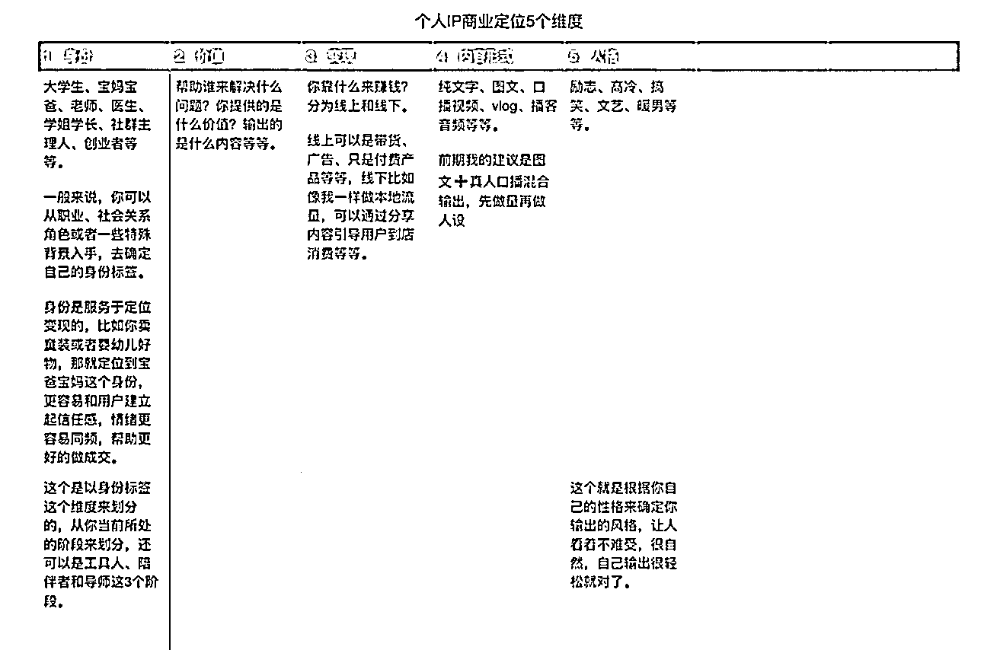
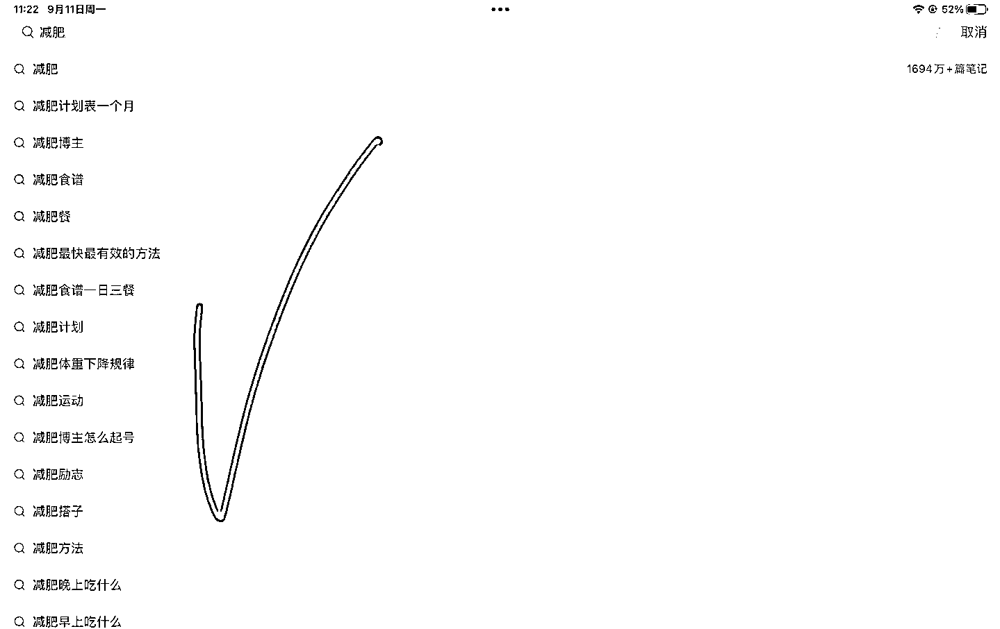
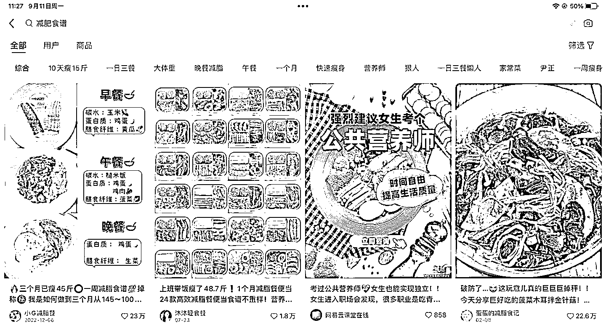
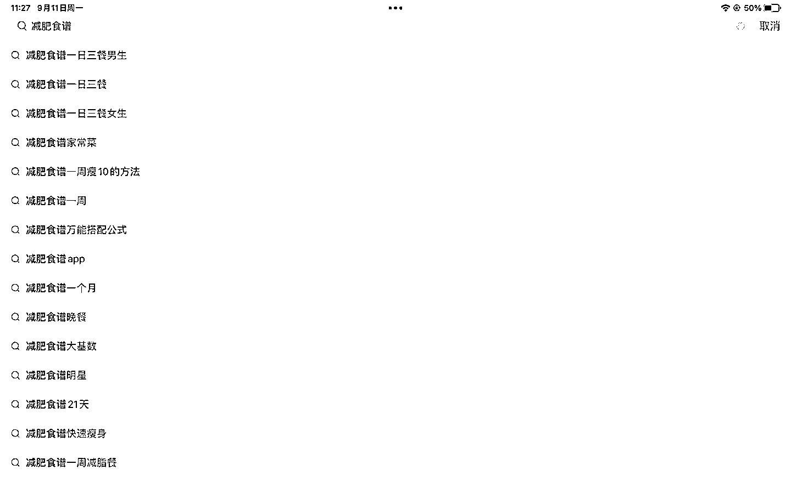
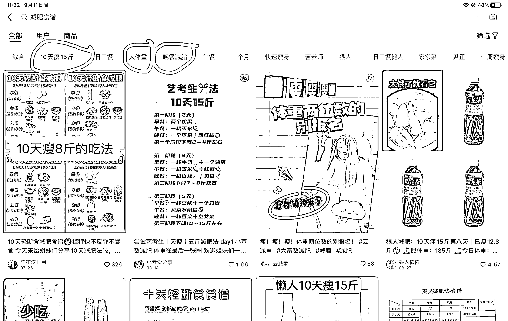

# 减脂减肥赛道的个人 IP 变现方法

> 原文：[`www.yuque.com/for_lazy/thfiu8/vaqmx2f111as2gip`](https://www.yuque.com/for_lazy/thfiu8/vaqmx2f111as2gip)

## (44 赞)减脂减肥赛道的个人 IP 变现方法

作者： 芷蓝

日期：2023-11-01

给生财小伙伴分享一些关于减脂减肥赛道的个人 IP 变现方法，这篇文章会涉及到 IP 定位、小红书封面素材制作、小红书内容生产、小红书引流、私域产品打造等，8000 字左右，看完这篇，希望能够对你有所帮助。

**一、减脂瘦身赛个人 IP 怎么定位？**

你是谁（身份标签）➕你用什么产品➕解决/满足➕用户➕痛点/新的需求场景

这个是我自己做个人 IP 营销 5 年后沉淀下来的一个通用定位公式，你可以拿到任何行业去套自己的精准定位，包括减脂瘦身赛道，比如说：

**二胎 90 后全职宝妈，180 天时间，用营养搭配方法，从 150 斤减到 108 斤，为新手宝妈提供大体重减脂定制菜谱。**

当然，前面的标签你也可以换成 3 年认证营养师，健身教练，瑜伽教练，大学生等等，身份标签是服务于你个人 IP 变现的，相同的身份会让用户和你之间快速建立信任感，有助于你的引流和成交。

这个给大家分享我的个人 IP 定位 5 个详细的维度，基本上一个账号，如果你把这 5 个维度搞清楚，展现出来的 IP 就是立体的，别人对你的信任感就会很强，容易在后端成交你的产品。

如果你还是对于定位不太清晰，可以随时来跟芷蓝聊聊，当然也可以考虑加入我的合伙人，享受一对一个人 IP 营销咨询服务。

**二、找对标博主**

模仿，是一个自媒体创业者的生存之道，是你的基础营销逻辑。

一个赛道能不能做？你的产品有没有市场需求？你要去创作什么内容？用户喜欢什么内容？这些问题，你的同行早就告诉你了！

太阳底下没有新鲜事，千万不要开启自嗨模式，从你打算做自媒体的时候，就要先看有没有人在这个赛道赚钱？从你打算发第一篇帖子的时候，你就要看同行的冷启动内容是什么？

我给大家分享 3 个找对标博主的方法，分别是**自我分析、建立词库、观察路径。**

**1、分析自己**

永远记住，模仿是有成本的，不是你想模仿谁就模仿谁，你得看自己有能力模仿他吗？比如我自己，我就不擅长拍视频，虽然也在慢慢更新，但是效果和效率就远不如写文章。

我一天时间可以利用讯飞语音写 10000 字的文章，但是拍视频没有镜头感，要来来回回尝试很多遍才可以，我在知识星球、公众号和知乎写文章，配合私域的付费社群和高客单价咨询，一年可以为我变现 500 万以上，视频只能说是一个人设的辅助。

所以，你要根据我上面分析的那个 IP 定位 5 个维度来先分析自己，比如自己是更适合做图文还是视频呢？自己的风格是怎样的？是否能模仿一些搞笑的博主还是暖暖的博主？自己有能力拍摄那些高质量的视频吗，那些设备价格不菲，这个成本你受的了吗？或者说只要一台手机就可以随时随地的录制口播，录制自己的生活日常，这样接地气的内容跟你的人设是否相符？

只有知道自己能做什么，更喜欢做什么，才找去找到一个适合你模仿的博主，然后持续的模仿他去创作内容。

**2、建立词库**

用户在互联网上获取信息的方式一共 2 种，**一个是被动推送，一个是主动搜索。**

被动推送是指内容平台根据用户平时搜索的关键词和消费内容的标签来做推送，然后用户接受，说白了就是你每天只要是「刷」视频，那么你能看到啥都是由平台来决定的。

主动搜索是指用户根据自己的需求，去内容平台主动搜索关键词来获取自己想要的内容。

无论哪一种，都在说明一件事，我们和信息之间是通过关键词来链接的。

那么，如果我们想自己的内容被精准的用户看到，想得到平台精准的推送，那么我们就得知道关于「减脂」这个赛道的关键词是什么，然后建立一个减脂的关键词词库，并随时保持动态拓展，应用到自己的内容里。

*（1）你要有关键词营销这个逻辑*

就拿减脂减肥这个领域来说，首先你要知道什么叫做行业词。

比如说：减脂、减肥

这个就叫是行业次，用户搜索量最高的，你把他先拿到小红书的搜索框里，就会出现下拉菜单。

你看，这个下拉菜单里出现的，就是用户搜索的最多的，因为很多用户，尤其是自己有着精准需求的人，他不会单纯的搜索「减肥」这 2 个字，比如说我想去健身房没有人陪我，一个人很孤独没动力，我就会直接搜索「北京减肥搭子」，如果我已经确定要用营养体系重建的方法来减肥，那么我就会搜索「减肥餐」。

如果，你的标题、封面和内容里能够出现更精准的和减肥这个关键词相关的长尾词，和相关词就会获得更多的精准流量。

*（2）你要建立你的关键词营销词库*

你比如说我，我会把减肥这个关键词下拉菜单里的相关词和长尾词再去放到搜索框里搜索，就能得到这个新词的下拉菜单，和爆款帖子数据。

你看，我把下拉菜单里的「减肥食谱」这个关键词继续放到搜索框里，就得到了更多精准的长尾关键词，然后搜索，发现大量的减脂账号都会用减肥食谱分享的方法来实现初期账号的冷启动。

你看，根据这个减肥食谱的关键词，你就可以去做「一日三餐减肥食谱」「一周 7 天减肥食谱」「女生经期减肥食谱」「穿夏秋冬减肥食谱」等等内容。

根据我自己的经验，你要去拿一个 excel 表格，不断的收集关于减肥这个关键词下的各种相关词和长尾关键词，收集的越多，你未来做内容的时候就越顺手。

*（3）看小红书的推荐二级话题*

注意看，当你搜索一个关键词的时候，小红书展现搜索结果的页面会有一个二级话题。

  

这个就是「减肥」这个赛道，小红书官方给你推荐的二级话题，一定要重视起来，这些词可以用作搜索，也可以放入到你做内容输出的时候文章里面，可以得到小红书算法的推荐，踩中关键词，踩有可能出现爆款帖子。

总之，以上 3 个方法或者说关键词搜索逻辑，你如果之前没有关注过，就要满满的建立起来，自媒体人一定要懂一些 seo 的技巧，不必专精，有助于笔记数据的提升就行了。

**3、观察路径**

分析完自己，通过定位关键词找到了自己可以模仿的博主，这个时候就可以开始生产内容了吗？

还缺一步，这一步也是新手做自媒体最容易忽略的，就是你要去加这些博主的微信，去看它的私域在做什么动作，是否在卖产品？是否有做朋友圈营销？他们的海报是什么样的？

模仿一定要模仿后端有完整商业模式的博主，这样才不至于做到最后，你发现内容也发了，引流也做了，却不知道要卖啥赚钱，那一切动作就变得毫无意义了。

**三、确定自己的产品是什么？**

找到自己可以模仿的博主后，不要着急去更新帖子，接下来你要想清楚自己的产品是什么？

我推荐的理想产品体系是：减脂私教➕减脂陪伴群➕减脂产品团购

这个也是我自己合伙人做减脂赛道的小伙伴跑通的一个路径，这里记住一个事情，减脂这个领域我并不推荐做标准的课程，因为标准课程情绪价值太低，适合认知类的交付，而减脂这件事情，情绪起到了决定性作用，如果看课程就能管理好自己的饮食健康，那就不会有那么多超重者了。

知道都知道，只是管不住，只是没人陪我一起，没人鼓励关心我，这个才是减脂用户的痛点。

而陪伴群和私教，恰好就是通过陪伴和深度陪伴来解决情绪的问题。

那接下来，我来和大家分享如何去做这 3 个产品。

**1、减脂私教怎么做？**

这里拿我的合伙人阿悦来举例，线上私人减脂教练，平均月收入能达到 5 万元左右。

我简单把我为合伙人阿悦规划的产品逻辑来分享一下：

第一步：用户沟通评估，减脂的第一步需要和用户沟通清楚她当前最苦恼的问题，在大量的案例面前，我发现很多人她们的痛苦点并不是自己身体的肥胖，而是心理的痛楚，这也是为什么会有人做心理减脂教练的原因。

比如：本身其实并不属于肥胖，但是心理总会有自卑的感觉，不愿意去主动社交，没办法去交朋友参加活动等等，这种情况就不应该接单，因为她们的问题并不是减脂本身，而是心理的困惑。

比如：要清晰的了解到用户的生活习惯，包含饮食习惯，居家和职场等场景的饮食习惯，还有平时自己的吃饭的各种偏好等等，了解清楚才能有针对性的给到建议，这是减脂私教要有的职业素材。

第二步：指标记录，了解清楚用户的基础信息后，就可以掌握到她现在最大的困惑以及是什么原因导致她的体重激增或者在反弹期，然后我们需要对她当前的三围记录，包括体质等等。

记录的方式最好为照片➕数据，为用户建立电子减脂档案，这个档案会跟随他的整个减脂期来更新，当然这个电子档案也可以成为后期你的成功案例营销素材，和用户向你续费的最高工具。

第三步：根据用户购买的私教卡类型（通常我建议分为季度卡，和年卡，不要办年卡，第一次最好就推荐用户直接购买高客单价的年卡，或者季度卡结束之后直接推荐升级）为用户定制减脂食谱。

在这里需要注意一下，我不建议在你的减脂私教方案里为用户推荐和运动相关的内容，因为这不是你的专业，而且运动很有可能会导致多胺分泌，心情愉悦后，导致食欲增加，影响正常的减脂计划。

只需要提示：合理保持健康生活作息和适量运动即可。

**2、减脂陪伴群怎么做？**

减脂是一个需要情绪动力➕科学指导的事情，那么做减脂社群我们就可以为用户提供一个科学的指导，社群的氛围就是一个情绪动力，当用户在这个社群里看到了成效，才有可能被转化为私教。

做社群，最重要的是想明白 3 件事情？

（1）你的社群用户画像是谁？非疾病性肥胖用户，职场女性，减肥反反复复，一个人不能够坚持等。

（2）你能为他们提供什么价值？正确的饮食顺序逻辑、重构饮食营养结构、一个坚持兼职的气氛。

（3）你的日常运营动作是什么？入群前的基本资料记录➕群内营养师的每周定期分享➕每餐前的拍照➕群内营养师的饮食步骤建议➕定期的反馈收集

能把上面 3 件事情想明白，并认真执行，你的陪伴营产品就做出来了。

更多关于社群运营的玩法，可以看看我的主页《100 个社群运营技巧》这篇文章，写的很全。

**3、减脂产品团购**

在做减脂陪伴群的同时，在交付的过程中就可以推相关的产品，把知识付费的学员最终发展成你的渠道代理，这个是最好的商业模式，至于如果做团购，以及相关的玩法，这个我后面我会但拿出一篇文章来写。

以上就是减脂这个赛道的 3 种变现方式，至于视频带货减脂产品之类的，道理基本相同，就不做一一介绍了。

**四、减脂类小红书账号的封面制作**

我有几个合伙人，在小红书上拥有几十万，甚至上百万的粉丝，平时聊天的时候说：**在你 3 万粉丝之前，小红书封面决定着你的账号生死。**

那一个减脂赛道的 IP，如何做好小红书的封面呢？我有 3 个技巧，但是在说之前，我要先跟你说说封面的底层逻辑，也可以说是人性的底层逻辑。

**首先，人们对和自己有关的信息会更加关注**，这就好比你不会羡慕马云比你有钱，但是你会羡慕你二姑家孩子比你有钱，甚至是嫉妒她。或者你是一个医生，那么就会特别关注医生这个群体，或者你是一个 30 岁的宝妈，你就会特别关注 30 岁左右的宝妈谁更漂亮，谁更有钱。

这一点在小红书的封面上就可以体现出来，如果你在封面和标题上展现出某一类特定的人群，那么这个人群在刷到时，就会刻意停一下，去点开看看是不是在讲跟它们有关的内容。

**其次，人们会对那些人性底层的东西感兴趣，是潜意识层面的**。你在刷小红书的时候看到一张身材非常火爆的美女、一个超大的汉堡或者流着油沾满屏幕的大肉，或者全是豪车、钱的符号等等这些内容，你也会不自觉的点进去看。

食物、权利、金钱、性，这些都是人类底层想要获取的东西，因为只要是生物就会对自己的生存环境和种族繁衍产生欲望，不光是男性，女性也是一样的，就好像我自己在小红书上看到身材和容貌很好的女生，我也喜欢看，我也喜欢去比较。

**最后，人们会对那些自己第一眼看去没看明白，但是又隐约感觉自己知道的它是什么的信息元素感兴趣**，这是一种猎奇心态，想要点进去满足自己的好奇心。

小红书上有各种奇奇怪怪的封面物品，我想你一定刷到过，虽然大多数是标题党，但它的阅读数据确实很好。

好啦，以上就是下红书封面的底层逻辑，它不止适用于减脂赛道，其他行业甚至是其他平台都通用，我一直坚信底层逻辑一定是通用的，一定可以指导一切，明白了底层逻辑，我们再去它上面叠加各种技巧就行了。

那接下来，我为你分享一个成功变现的减脂博主 IP，他们经常用的封面都是什么类型的，案例不在多，在于你能举一反三。

**1、食谱类**

作减脂赛道，在起号的时候，食谱类的内容是必不可少的，这种内容美观好看，让人很有收藏的欲望。

食谱有很多种展现方式和话题，比如说 1 年 12 个月，每个月你都可以做一期《xx 月减脂食谱》或者《适合女生的减脂食谱》或者《女性经期专属减脂食谱》、《一年四季减脂食谱》《中医推荐的适合国人的减脂食谱》等等，这个时候你就可以把我上面说的关于某类人群标签这个逻辑应用起来。

你们看，我自己除了运营商业类的账号之外，也有一个减脂的小红书账号，虽然粉丝不错，但是也出过 4000 多赞的内容，也通过带货轻食产品变现成功，还通过引流到私域推荐加入减脂营赚到过佣金。

  

做食谱类的封面要注意几个问题，第一个是整齐美观、第二个是信息要丰富，让你看了你有想收藏的冲动，人们为啥要收藏？就是因为信息元素很多，觉得很有用，但是一次性又记不住，后续可能有需要的时候，需要随时再翻出来看。

美观➕信息素多，就是制作食谱类内容的关键。

除了我自己这种，还有很多食谱的展现形式，比如实拍类的（这个就比较费劲一些，你得去真的拍，然后一点点的对齐，或者去豆瓣和 keep 上面去找别人的图，一点点抠下来，再去对齐。）

如果你之前比较擅长制作 ppt 就最好了，如果不擅长，我劝你别费那个劲，不如就用我这种最简单的表格类内容。

当然，我还为大家准备了一个 ppt 的模板，你拿过去直接在上面填充内容就行，再换个边框颜色，加个 logo 啥的就能出图，数据应该不会差，感兴趣可以来找我拿。

  

**2、对比类**

食谱类的相关内容，无论你制作的多美观，种类多丰富，收藏点赞数据多好，最大的问题是，用户不会因为这个来找你付费，因为你没看到你自己的变化结果。

自己的真的瘦下来，才是营销的最好素材，我真的从胖到瘦过，我才敢有资格教你去怎么瘦。

我是真的瘦下来过，怀过 2 个宝宝，孩子小的时候，我从最胖的时候 140 斤，到现在 110 斤，虽然不像别人那么夸张，比如从 200 斤到 100 斤，但是保持 110 斤左右的体重➕当前坚持运动的习惯，对于我来说就是一个很好的生活状态了。

  

比如我的小红书背景图，很多人看到后就会私信我是怎么瘦下来的？有没有吃过减肥药？是选择瑜伽还是游泳？平时吃东西要注意什么等等，只要有人来问你，就说明她被你打动了，说明她想跟你学习。

那么，常见封面都长什么样子呢？

  

其实这种逻辑非常简单，就是前后对比图，可以展现自己的➕你的学员的（初期没有学员，就展示自己），这种强大的视觉反差，就会给到用户很强的刺激，他们会觉得，都是普通人，你能瘦下来，我也可以，这里面的技巧，我可能需要跟你学习。

另外，你在做这种的封面的时候，一定要用醒目的大字，是大字来引导用户的视觉焦点在你钱后变化上面。这些文字是什么呢？包含了体重的数字，实践的数字，和身份的标签。

比如说，23 岁 1 年前/25 岁 2 年后，180 斤的我/110 斤的我，宝妈 150 斤/辣妈 105 斤等等，不光是图片上样貌的对比，还通过数字文字的对比强化用户的心里感受程度。

还有，如果你打算做减脂这个赛道，想做一个减脂 IP，你的小红书里必须要更新一篇内容，就是自己的故事名片，把自己 xx 年来从胖到瘦的经历沉淀称为一个视频或者一个帖子。

我们把它叫做「故事名片」，他的用处就是帮助你最大程度的和用户在情绪上产生同频，让用户看到你改变的经过，无论是行动上还是心理上，故事名片可以帮助你和用户之间建立信任感，有了信任感，才会有成交。

这就叫，知其然知其所以然，你晒自己的减脂的结果，还要晒减脂的经过，这样才真实，真实是一切。

**3、认知类**

给用户减脂食谱是为他们提供时间价值，让他们不用到处去找方法，在你这里，你帮他收集好了。

给用户健身前后对比图是为他们提供情绪价值，让他们看到每一个女人或者男人都有可能通过科学的减脂方法让自己变得更美好，让自己进入到一个自己喜欢的生活状态里面，我们都是普通人，只要你去认知做，就会变得和我一样，只需要行动起来。

除了时间价值和情绪价值，还有一种叫做认知价值，你得告诉他们你实践减脂的原理是什么，核心运作逻辑是啥？

比如说我自己瘦下来的原理，就是 99%的科学吃法➕1%的运动，你没看错，运动真的没办法帮助你有效减肥，甚至还有可能因为运动后情绪变好，食欲变强，导致大吃一顿，最后越运动越胖。

题外话，想减肥你首先要明白的是，自己需要改变饮食结构和饮食方法。

我自己的方法，第一步就是控糖，先把糖控制住，除了每天有必要的碳水之外，先戒掉含糖饮料，含糖零食，只需要把这 2 个控制住，你会看到自己的体重会降下来一点，给到你一些信心。

当你戒掉了零食后，接下来就是改变自己的饮食方法，或者说步骤。比如那些没办法推掉的聚会，很多好吃的摆上餐桌了你应该怎么吃？应该吃什么？我的方法就是先喝汤，或者先去吃一些像小馒头或者玉米之类的食物，只需要先吃上 2 口，就会有效缓解你的饥饿感，你知道饥饿感是骗人的，他会让你增加进食速度，吃掉没必要的能量，用以达到远古时代食物紧缺时的度过危机的目的。

当你身体转化了一些糖之后，你就没那么饿了，进食速度就会降下来，至少可以回归到一个理想的吃饭状态。

说的有点远了，回归到这题，以上就是关于减肥的认知累内容，它包含了关于减肥的错误认知分享、饮食结构改善建议等等，这部分内容最好用口播的形式来分享，认知➕真人人设，构建你的 IP 立体度、专业度和真实度。

这类内容在封面制作上，你就需要遵循一个原则：话题争议性。

一定要选择有话题争议性的主题来当作封面的标题，比如运动没用？比如控糖陷阱？外卖不能吃？

这些话题，会让用户在自己原有的认知上画一个问号，从一个新的角度再去看减脂这件事，当然能不能让用户进入到你的思维框架里，这就是做内容的能力了。

以上就是 3 大类减脂常见的封面制作类型，套路技巧没有那么多，一个成功的 IP，一个能赚到钱的 IP，还是要看价值，价值包含的就是你的真实经历➕你展现他们的方式。

不要把过多的时间放在「术」上面，术是引导，是引导价值的的工具。

另外，我奉劝没有真正瘦下来的人，没有经历过减肥痛苦最后成功的人，不要去做减脂 IP，意义不大，自己没瘦下来，自己没有科学的瘦下来，也就没有任何资格去教别人。

**五、减脂 IP 引流**

任何一个自媒体平台教引流的都很多，引流就是纯技巧的东西，如果内容不好，得不到平台的推荐，用户看不到你，引流也没用。

或者当你把用户引流到私域后，用户发现你没有实力，朋友圈里没有干货，他也就离开了，**流量不等于留量。**

这里简单介绍小红书上常见的 3 种引流方式：

1、评论区引导用户私信

2、打卡区引导用户进群，进群后小号发资料引导加微信或者公众号领域资料

3、大号艾特小号，小号置顶突破引导加微信

以上 3 种方式适用于所有赛道，至于具体的操作方式，大家直接在生财上搜索，太多了，没啥秘密。

好啦，以上就是全部内容，希望能够对做减脂、减肥赛道的博主有一些启发，永远记住，“价值是道，技巧是术”，想做知识付费，还是要先有道，然后才是去学习如果用术，把你的道展示出来，为他人带来价值，赚钱只是顺便而已。

最后，还想跟大家聊聊我自己作为一个商业教练这 2 年的感受，对于普通人来说，自媒体其实一点都不友好，有些人天生长的好看，有些人自带专业领域光环，有些人是某个渠道的老大，有自己很强的供应链系统，这些人进入自媒体之后，其实并没有创造新的价值，只不过是通过自媒体把之前的价值进行了放大。

而一个普通人，什么都没有，进入自媒体这个行业，大概率会无功而返，从我的经历和经验来看，普通人想通过自媒体赚钱，想逆天改命只有一个方法就是懂得如何记录自己➕把自己的做过的事情沉淀称为商品。

何为记录？记录什么？答案是：把自己作为一个普通人做了不普通的事情一点一滴的记录下来。

何为沉淀商品，答案是：你要把它封装成一个课程或者咨询，或者社群，得有权益，得能卖的出去，卖出去后你得交付。

我自己也是从去做一件不普通的事情开始的，前几年一直在做，没赚到啥钱，赚钱也是最近 2 年的事情，这个过程是指数增长的，不是线性增长的。

**所以，你要耐得住性子。**

**希望能对生财的小伙伴有一些启发。**

* * *

评论区：

暂无评论

* * *