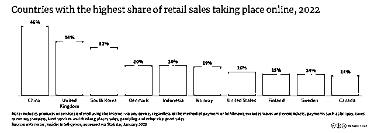
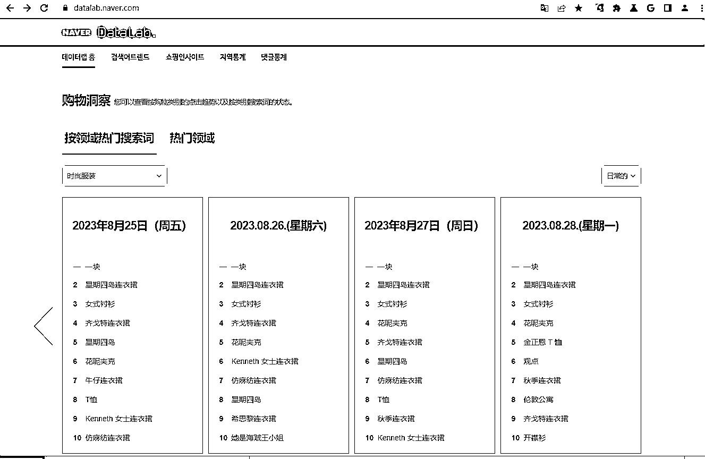
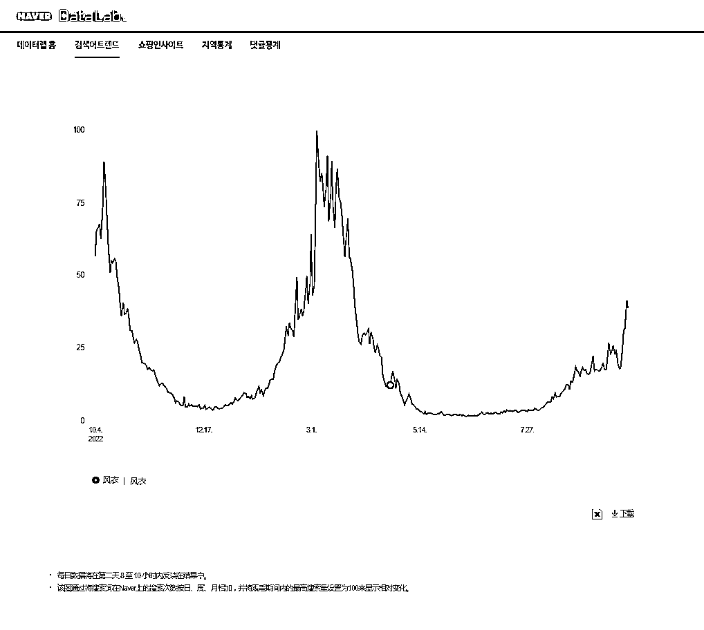
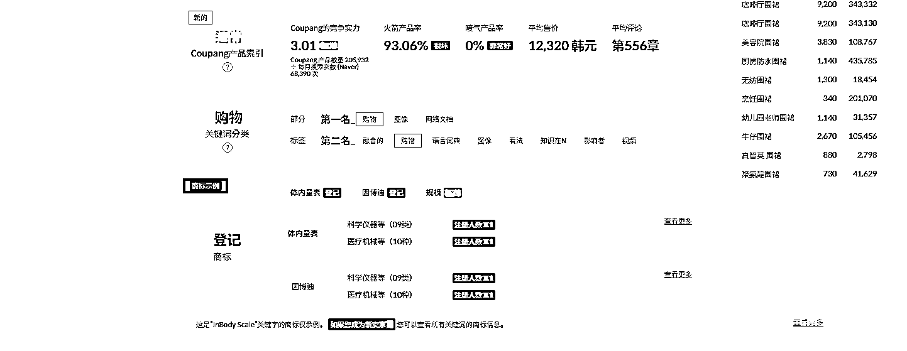
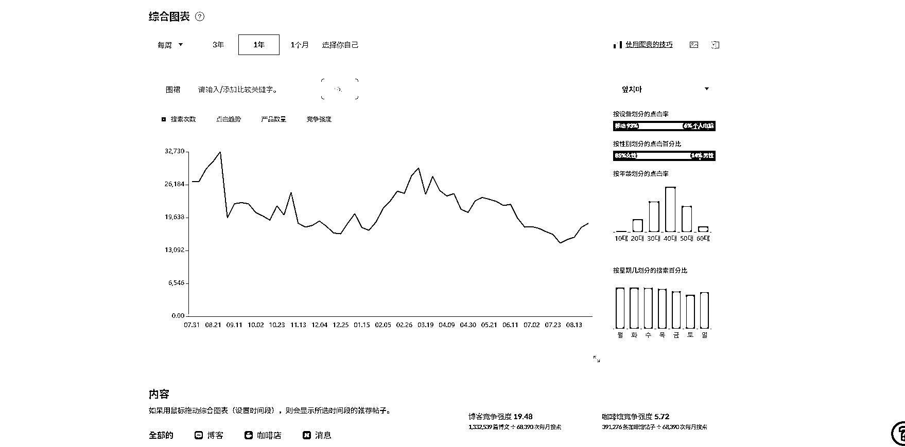
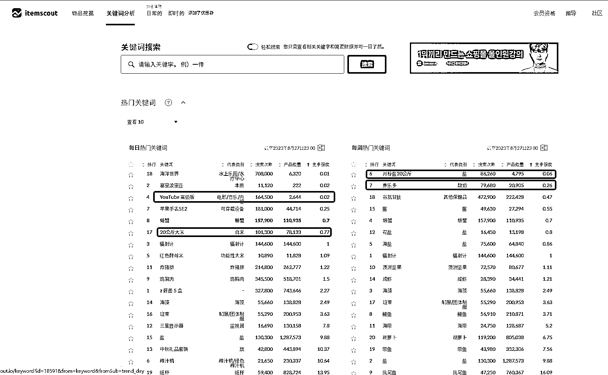
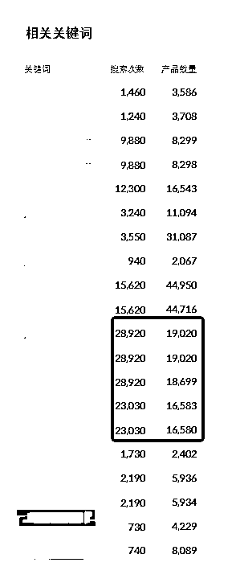
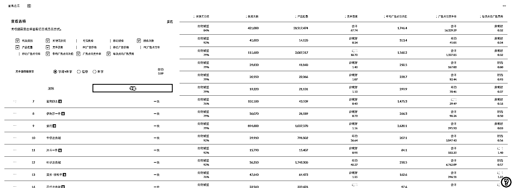

# 新手怎么做韩国跨境电商？以出名的 coupang 运营为例

> 原文：[`www.yuque.com/for_lazy/thfiu8/vqqi7gdgrhbq1oy0`](https://www.yuque.com/for_lazy/thfiu8/vqqi7gdgrhbq1oy0)

## (16 赞)新手怎么做韩国跨境电商？以出名的 coupang 运营为例

作者： 宋江江

日期：2023-11-02

韩国人喜欢泡菜，那就卖不锈钢菜板。冬天女生都喜欢穿裙子，那就卖打底袜，反过来夏天就卖连衣裙。

这是我刚入局做韩国跨境电商成功的做法，根据韩国人的生活习惯、季节、高需求出发考虑选品方向，本土化跟卖运营，其实就是“抄”。

后面慢慢进入正轨之后，才开始精细化的运营，优化产品、详情页，增加订单量等。这对于新人而言，想入局做跨境电商，像韩国、东南亚这些都可以往本土化靠近基本都能做出成绩，后面再根据市场趋势慢慢扩大化。

下面，我从自己做 coupang 的四种运营模式，以及能做起来的 5 要素和大家分享怎么去跨境电商，无论是在韩国，还是东南亚等地做跨境电商都可以参考参考，希望对大家有帮助。

大家好，我是今年加入生财有术的宋小江同学，来和大家分享下韩国电商平台的经验。

作为新人真的受宠若惊，相比圈里年入百万甚至千万的大佬，我这真的是不值一提，不敢在大佬面前造次，就简单分享下我的一些经验吧，这也是第一次在星球分享，哪里说的不对请大佬们多提点。

韩国 coupang 电商平台，我相信做过跨境电商的朋友都有听说过，有的人在这上面赚了第一桶金（比如我），也有很多人没赚到钱甚至被骗亏损赔了不少钱，那我简单分享下我对 coupang 平台的看法和玩法吧。

# 一、我选择做 coupang 的原因（韩国跨境电商市场分析）

**（1）市场规模**

**人口与电商用户基数：**

韩国拥有超过 5100 万的人口，其中电商用户已经达到了 3330 万。这意味着超过 60%的韩国人口已经是电商的活跃用户，为卖家提供了巨大的市场空间。

**经济实力与消费能力：**

2022 年，韩国的人均 GDP 高达 3.23 万美元，远超中国的 1.28 万美元。

这不仅证明了韩国的经济实力，更意味着韩国消费者具有更高的购买力和消费意愿。从市场规模和经济实力来看，韩国的电商市场潜力相当于中国的北京和上海两大城市。

**韩国已经成为全球第五大电商市场**

2022 年的电商市场规模达到了 1429.2 亿美元，仅次于中国、美国、日本和英国。这意味着在 Coupang 这样的平台上，卖家有机会接触到全球最大的电商消费群体之一。

**韩国网上零售额占总零售额的比例高达 32%，仅次于中国的 46%和英国的 36%。**

这一数据清晰地展示了韩国消费者对线上购物的偏好和信赖。

（2022 年各国网上零售额占总零售额的比例）

## （2）市场前景和增量

电商经济浪潮下的韩国，海淘在年轻人当中掀起波澜。

**根据韩国统计局此前发布的《2023 年 6 月在线购物报告》显示，今年二季度韩国跨境网购总额达到 1635 亿韩元，同比增长 25.6%。其中，通过中国购物网站的直接购买金额最高，达 777.8 亿韩元，同比增长 120.7%。**

据韩国统计局发布的数据，2022 年三季度通过移动设备进行的交易规模比去年同期增长 21.2％。

其中 Coupang 使用人数接近 1700 万；11 街以 993 万紧随其后，然后是 Gmarket（817 万）、We Make Price（760 万）、Auction（561.3 万）。可见 coupang 是韩国的第一大电商平台。

这也是我进入韩国跨境电商平台第一站为什么选择 coupang 的原因之一。

（韩国人口不多，电商交易规模和亚马逊等平台没法比，大卖无暇顾及；但交易规模和前景相比来说也还算可以，适合我这种跨境电商小白入场）

# 二、我做 coupang 经历的四种运营模式

一个国内电商都没干过的真小白干跨境电商真是啥都不懂，平台后台操作、物流、选品、刷单、广告、韩语啥也不懂，更别提平台规则了。

（这里给小白一个建议，刚入一个平台的时候，一定要去找群，找同行的伙伴交流，向大佬学习，才能更快的拿到结果）。

我是 2021 年 9 月入开始入驻的 coupang 平台，当时是拉了几个网友成立了个小群，大家有问题就在群里一起讨论沟通，现在群里的 100 多个卖家，感觉大家都成为了战友。

虽然都是做韩国市场，除了礼貌性的不问对方卖什么品，其他的啥都聊。现在这些卖家人均年销售额基本都能过亿（韩元），每月赚个万八千的是没问题。

**（1）跟卖运营选品**

当我刚踏入 Coupang 电商平台，我选择了最简单的运营模式——“跟卖”。我开始寻找韩国本土热销、在中国可供应的产品，然后跟卖。

记得最初的那一个月，我选择了一款不锈钢菜板。考虑到韩国人的泡菜文化，这款菜板防止细菌滋生的特点应当受到欢迎。果不其然，首日便售出 6 单，那种成就感让我欣喜若狂。

但初入行的我，对物流费用和定价策略了解不足，最终这款产品虽然销量可观，但并未带来预期的利润。但每一次的经验，都是对未来的积累，基于这种模式做了 2 个月，赚了小 1w 块钱。

到了 11 月份，天气也越来越冷，在选品上就开始考虑保暖御寒的产品，考虑到韩国女生喜欢穿裙子，打底裤应该也好卖.

于是复制了菜板的思路，找到了一个平台上卖的比较好的正好拼多多有货的产品跟了上去，第一天就出了十几单，后面陆续每天都是 10 单左右，每单的利润是 27 块钱，这一个品一个冬天卖了 1000 条左右，赚了 2w 多。

这让我真的体会到了甜头和韩国市场是多么好做。后面上传的产品就是延续使用了上面的思路，**我理解为就是从韩国人的生活习惯、季节、高需求出发，考虑选品方向**；

到了 12 月，平台开始打击跟卖，跟卖风险也很大，经常会被卖家投诉侵权，韩国是一个版权意识很强的国家。所以就开始转型做铺货。

到后面才知道，在平台能跟卖的时候，有好多卖家都是使用的批量跟卖软件，可以一键跟卖韩国本土卖家店铺的所有链接，根本不考虑选品，就是盲铺，一天能出上百单，哎，人果然是赚不到认知以外的钱（信息差就是钱），有时候真的不是我们不努力，而是我们不知道。

**（2）铺货运营**

铺货运营就是通过 erp 软件批量上传产品，不打广告不付费，纯薅平台自然流量，因为 coupang 刚向中国卖家开放，是急需中国卖家上传产品来填充他的商品库，这个时期真的是纯蓝海市场。

上传的链接多，曝光的机会就大，而且上传新品平台会给扶持期，新品出单相对来说也不难，很多卖家都是在这个时期入场的，导致平台商品链接急速上升，很快平台产品数量和种类就饱和了。于是，开始思考转型。

**（3）半精品运营**

由于之前铺货的经验，知道了哪些产品畅销，开始优化出单好的产品标题、详情页、评论、用户在咨询、广告等。这也算开始进入了电商运营的阶段，不断试错，不断摸索平台规则。也算是摸清了平台的运营机制：

1、新品流量期，上传一个新品后，当产品入池（通过标题能在前台搜索到）后会有 3 天的新品流量扶持期。

在这 3 天里面如果产生订单，那 coupang 就认为这个品是受欢迎的，产品权重就会增高，此后每天的销量比前一天高，产品排名就会不断上升。

这其实就是刷单的逻辑，基本一个大类的产品比如耳机这种，连续刷 1-2 个星期，每天递增数量的刷，产品基本能上前三页。

2、除了刷单还有广告，广告有新品广告、品牌广告、关键词竞价广告等，这个大家一般都懂，但是 coupang 的广告着实是贵。

因为我卖的都是低价值产品，所以我很少开（后面说一下受益于我的选品策略，不开广告也能出单的秘诀）。

3、其他能人工干预的就是用户咨询了，在链接下面咨询产品相关的问题也可以带来流量的增长和转化。

4、除了以上 3 点，想要出单还有最重要的一点就是选品。我的选品方法有按搜索热点选品、按关键词选品、按销量选品。

**① 按搜索热点选品：**coupang 这个平台没有单独的选品关键词搜索网站，据了解官方也没有开放这个数据接口。

韩国 NAVER 是世界第五大（仅次于谷歌、雅虎、百度和必应）搜索引擎网站  ，也是韩国最大的搜索引擎和门户网站 [`datalab.naver.com/`](https://datalab.naver.com)。

通过 naver 可查看韩国用户的搜索指数。

在这个网站上可清晰的看到每个品类，用户每天的搜索关键词排名，根据这个上面的热点去选择上品，就能捕捉到当季用户的需求在哪里，比如春天卖防风衣、夏天卖连衣裙卖雨伞、入秋卖衬衫、夹克、冬天滑雪服、棉服等。

**A.可支持查看具体类目的搜索关键词排名：**

**B.可支持查看一段时间内，1 个关键词或不同关键词的搜索趋势和数量对比：**

**②按关键词选品：**

除了 NAVER 之外韩国还有一个关键词选品网站，也是我最钟爱的网站 [`itemscout.io/`](https://itemscout.io)

这个网站除了具有每个品类的每日/每周趋势外，还可查询关键词的竞争情况，当然这个网站统计的数据不只是 coupang、还包括 naver、Gmarket、11 街等韩国其他电商平台的数据。

从这个网站上可以看到的数据：

1、热门关键词下的搜索次数、产品数量、竞争强度，我遵循的原则是搜索次数越多，产品数量越少越好，也就是竞争强度较小的产品。

**我根据关键词的搜索次数和产品数量发现了一个二级类目的关键词，当时发现的时候搜索次数是 2 万左右，产品数量只有大几百，产品竞争很小。**

**这样一个体量的关键词在不用开广告靠自然流量的前提下，每天可以帮我转化 15-20 单左右，每单利润在 50 元左右，这也是我为什么很少开广告还能赚到第一桶金的原因。**

右侧图片是我当时选的关键词目前的搜索次数和产品数量，现在来看，搜索次数没变，但产品数量已经大幅提升了上来。

2、可查看某一类别下的关键词的搜索次数、产品数量、竞争强度、平均广告次数、广告点击竞争率、每次点击广告费用，可以为广告竞价提供参考，点击【查看选项】可以查看更多维度数据。

**（4）精品运营**

按照上面的选品思路选品对我来说，收入我还挺满意，每天很滋润很舒服，但是过了一段时间后，我发现别的卖家发现了我的这个产品。

并且同样也上架了我的这款产品，虽然他可能不知道我的关键词，但价格比我卷，我的订单量自然而然的就下降了。

所以又开始思考，如何让自己的产品不被复制，那就是申请韩国的商标，通过国内工厂生产产品贴上我的商标，做 OEM，建立供应链壁垒，别人想卖也找不到货源。

跨境电商想要舒服的赚钱还是要有自己的供应链，打造自己的品牌商品，不然利润空间很容易就被卷下去了。

# 三、跨境店和本土店的区别，怎么做。

**（1）中国跨境店**

官方仓发货的两种发货模式：

**cgflite 模式：**

一键代发从 1688 采货发到官方仓，然后由官方仓发送到韩国。

优势：一件代发，不需压货，资金压力小；

劣势：速度慢，没有紫色火箭标识，流量较差。

**cgf 模式：**

压货，需要提前把货送到官方仓，出单后由官方仓直接发货。

优势：具有紫火箭标识，流量较好，官方扶持，可参加处促销活动。

劣势：需要提前将货压到威海官方仓，需要占资金。

## （2）香港跨境店

**自发货模式：**

产品上架，出单后，通过第三方物流服务商将包裹寄送到韩国消费者手中

优势：三方物流，物流成本低；产品上架不需库胖官方审核，可铺货；无需压货，可 1 件代发

劣势：除了店铺成本比国内跨境电商高点，相对来说国内跨境电商来说无劣势，相对韩国本土店来说，流量略差

**（3）本土店**

**韩国自发货：**

将产品通过一般贸易的方式发到韩国海外仓，出单后，由韩国海外仓给韩国消费者发货。

优势：韩国本土发货，2 天收货，速度快；

劣势：需要付海外仓的成本和压货的成本，需要缴税；

**中国自发货：同香港自发货**

橙火箭：将货压到 coupang 的韩国官方仓，出单后由韩国官方仓直接发货。

运营优势：橙色火箭标识，发货速度快，链接流量大。

劣势：压货成本，coupang 官方扣点，韩国缴税，产品利润空间较小

**（4）跨境店本土店联合运营的骚操作**

跨境店不可以跟卖，本土店可以跟卖；

（1）可以使用本土店跟卖跨境店商品链接，刷跨境店的单，使用韩国本地的物流单号，躲避官方查刷单封店的风险；

（2）本土店跟卖跨境店链接，可以提升跨境店产品的流量，因为跨境店产品没有税，利润空间更大。

**（5）货源从哪里来：**

最常用的是 1688、拼多多、淘宝，还有其他的货源网站期待朋友们分享。

# 四、coupang 能做起来有 5 个要素

**（1）运营规则**

要想在 Coupang 站稳脚跟，首先得了解它的运营规则。我总结了一个爆单 SOP，把影响产品链接排名的每一个因素都罗列出来，然后对每个产品进行优化。

如果上面这些看不懂，那我总结一下我做跨境电商的五字真言“抄”“仿”“烧”“打”“刷”。

1.  抄是抄产品，也就是选品；

2.  仿是仿主图和详情页设计描述；

3.  烧是开广告；

4.  打是打价格战，

5.  刷是刷单。

**（2）抄——选品**

1、**需求选品：**

基于当地人的一些生活习惯去选品，如果不知道韩国人什么生活习惯，就去看前台产品的销量和评价，这两者都是宝藏；

销量一定是能反映出哪些产品受欢迎，寻找其他卖家卖的有一定销量的产品，去优化链接，设置广告，优化价格策略，抢夺流量。

评价可以帮我们迅速了解消费者为什么会买这个产品和对这个产品的评价。另外也可以通过其他途径了解韩国人的生活习惯和兴趣爱好，比如韩国女生甚至男生喜欢做手工艺品、十字绣、编制包、手绘画等。

**2、关键词选品：**

寻找一些蓝海类目，通过关键词选品网站，找到非常细分类目、细分市场的关键词，通过布局关键词产品出单。

**（3）仿——主图详情页设计**

如果我们明知道宠物自动喂食器在韩国好卖，但是自己上传的却不出单，那就要在主图和详情页上找找问题，我的做法通常是去平台找 10 个在该类目卖的最好的产品，去看他们的主图和详情页是怎么设计的。

然后总结学习优化自己的详情图，通过观察和自身实践总结这种详情页中放置动图或宠物使用产品的视频的转化要更高一些。

**（4）刷——刷单**

大家都知道做电商是离不开刷单的，这里我了解的做 coupang 的卖家刷单都是找服务商去刷，正常 1 单是 25-30 块钱，把一个品打造起来可能要 30-100 单，一个品至少需要 2000 多块的刷单成本来试错。

如果能起来就卖，起不来就再换下一个品，其实想想很少有人有这个魄力和资金去试错，所以他们一般刷的少；

而我这边是花了将近 2000 块买了十几个刷手号，自己在给自己刷单，这样成本就降低了，想刷多少单刷多少单。

在产品质量和详情页没问题的前提下，我一个品刷 50 单，成本大概在 100 块钱，没有明显起色就会弃掉，开始刷下一个（现在来说，国内跨境店已经刷不了单了，如果想刷单去搞一个香港店铺）。

**（5）趋势**

做好 coupang 其实很简单，选对品，刷好单，就普通类目保守来说，一天一个产品出个 10 单，一个品一天赚个二三百是没问题的，想单品一天几百单的出是不可能的，毕竟韩国的人口天花板在那。

最后说一说趋势吧，回想起来这两年 coupang 也有很多变化，每一步变化都要反应很快，跟着政策走，不然总是玩别人剩下的。

比如说，刚开始可以跟卖，很多人自己上传产品，等听说别人跟卖赚钱了，他也想做的时候，平台打击跟卖；

平台对刷单不控制的时候，我们都成百上千的刷，有人怕被抓，等平台真的抓的时候，他们又听说刷单可以爆单，开始偷摸刷，结果被封店了。

coupang 为什么前两年好做就是因为他的很多东西不完善，有的卖家吐槽平台三天两头变化，其实每次规则调整都意味着新的机会。要敏感，要快速，要勇敢。想搞钱就要冲！

# 五、门槛、机会、风险

**（1）门槛**

**1、国内跨境店：**

1.  入驻条件：中国营业执照、法人身份证、手机号话费流水等。

1.  费用：店铺入驻费用相对较低，大约 200-500 元。但真正的挑战在于运营。由于平台的结算周期长达 2 个月，卖家需要有足够的资金进行周转。预计初始运营资金需在 3-5 万。

**2、香港跨境店：**

1.  入驻条件：香港营业执照、法人身份证、手机号话费流水等。

1.  费用：营业执照办理费用约 4 千元，入驻费用约 1 千元。若购买现成店铺，费用约 1 万。此外，还需准备初始运营资金 3-5 万。

**3、韩国本土店入驻：**

1.  入驻条件：韩国公司的营业执照和法人相关资料。通常需要找专业服务商协助办理。

1.  费用：办理费用在 3-5 万左右。成功入驻后，每月还需支付 1000 多元的话费、房租和记账费用。为保证资金流转，建议准备至少 20 万的启动资金。

**（2）机会**

1、由于韩国电商天花板不高，大卖较少、小卖家的竞争不大，对新入场的卖家来说具有良好的成长空间。

2、由于韩国跨境店没有完善的退货机制，大部分卖家都做的低客单产品，靠量取胜。做本土店，有靠谱的海外服务商回收退货，那么高客单价、高利润的产品市场将是一个巨大的机会。

**（3）风险**

1、teum 的卖家托管模式和低价策略使得流量和订单量的竞争加剧，卖家需要准备考虑转型，如非标品方向。

2、平台抓刷单抓的越来越严，现在刷单需要真实的发货，每单会产生 15 元左右的运费成本，刷单成本也在不断上升。

# 六、总结

**对于新手卖家的建议：**

对于那些刚刚踏入电商领域，资金有限的新人卖家，我建议选择香港店铺作为你的跳板。为什么呢？

1.  灵活性：香港店铺，无论是铺货还是刷单，都比国内跨境店来得更加灵活，给予卖家更多的操作空间。

1.  成本考虑：香港店铺的价格相对较低，尤其是与韩国本土店相比，这对于初入行的卖家来说，无疑降低了初始的投资压力。

但如果您是那种资金雄厚、有一定经验和胆识的卖家，那么我建议您直接选择韩国本土店。

这样的选择，虽然初期投入较大，但长远来看，您将拥有更大的市场份额和更高的利润空间。

而且，有了海外仓，物流速度和服务质量都将大大提升。

* * *

评论区：

暂无评论

* * *