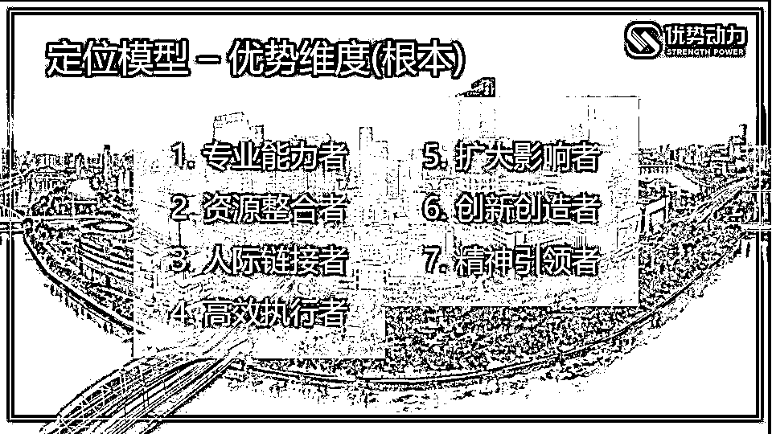
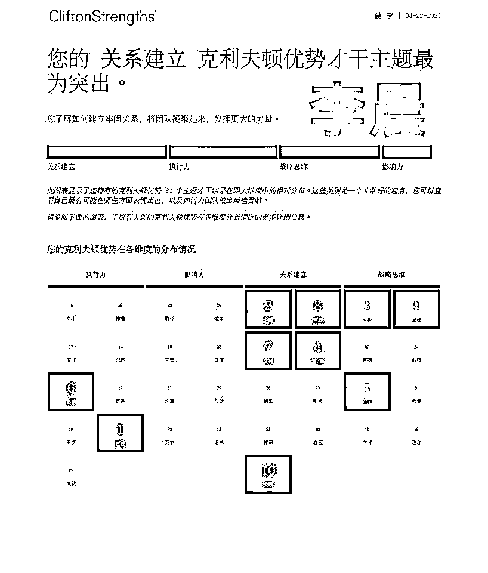

# 找准个人优势，创造自己的赚钱之路

> 原文：[`www.yuque.com/for_lazy/thfiu8/slm2usv03y35fcx5`](https://www.yuque.com/for_lazy/thfiu8/slm2usv03y35fcx5)

## (36 赞)找准个人优势，创造自己的赚钱之路

作者： 苏姐 职场优势教练

日期：2023-10-31

各位生财圈友、个人优势航海的伙伴们，大家好！非常开心这次能担任生财的个人优势航海教练。

我是苏姐，坐标北京，北大毕业的优势教练导师，优势动力学院创始人。曾在外资、国企、民营上市公司做过十多年人力管理工作。2018 年辞职开始做自由职业，2020 年正式创业，创办了优势动力。作为个人 IP 创业者，3 年实现 400 万+营收，在家办公、没有全职员工，年营收稳定过百万。

当看过 1000+份优势报告、做了一对一解读，长期陪伴辅导数百人后，我最大的感触是：升起了悲悯之心和使命感（关联才干 11）。

我无数次感慨，如果他们能掌握优势解读咨询这个能力，可以在人生道路上少走很多弯路。

今天我就想带大家看看，“生财”、“赚钱”这条人生道路上，优势才干可以怎样发挥作用。

说到“生财”、“赚钱”，大家认为想要获得成功，最重要的是什么？

我认为，是“定位”。

很多人没有意识到，“赚钱”和“提供价值”，两者是可以划等号的。而你只能靠做你擅长的事情，去提供价值。也就是说，你的优势，决定了你在事业、社会、团队中的位置，以及你在其中能提供的价值，进而决定你能否赚钱。这就是“定位”。

而发掘自我优势，只能是你自己的责任，这条路需要 100%的自我负责，是一条英雄之路、勇敢者的游戏。

那如何发掘自我优势，做好定位呢？

我做过上千个 1 对 1 咨询，发现很多人在副业/创业时，有个执念：必须找到正确的定位，再开始行动，那这个结果就是：可能你终生都停留在“想”和“找”的阶段。

实际上，定位不是找到的，是实践（试错）出来的。

我在公开课中，展示过一张基于优势的定位图，一个人有这里的 2~4 项，都是有可能的，大家可以凭直觉，加上对自己才干的理解，选一下自己已经具备/可能发展出来的优势定位，是哪几个。

我个人自评的话，按照上面图片的分类，我在创业早期是 1+4；现在是 1+4+6+7。而 2、3、5，从来不是我擅长的，我是通过与他人合作，优势互补来实现。

无论你是做小红书，还是知乎好物，是平台主播，还是短视频教学，这都是表象。真正成就你的，是你在这些项目里、赛道上，贡献的那份独特的价值。

比如，你可以用这个表格来梳理一下自己（下表以我个人为例）：
赛道不是一成不变。如果你在一个赛道，通过学习实践，挖掘发展出个人优势，把它做成。这个过程打造出了清晰的个人优势和才干，将会成为你的核心竞争力。迁移到其他赛道，也更有可能成功。

这样，你才能立于不败之地。

具体如何在实践中挖掘呢？

任何一个能赚钱、且能持续赚钱的项目、赛道，一定是有闭环的，需要产品、渠道、流量、成交、交付。

你可以从思考如下这些问题开始：
你在什么环节最能提供价值，怎么提供？是什么价值？这个价值和最终商业变现，它的关系是什么？你在提供这些价值时，如何保证自己比他人更优秀？

当你看清楚这个链条，就全力以赴去提供这些价值，不会、不懂的就付费去学习、去咨询、去请教那些有结果的、专业的人。

在这个过程中，

我学员中有一位大关系建立的保险经纪人、财富规划师，李晨总。

他原先做基金经理，都在用自己的短板，拼不过那些高学历、高智商的同事们，天天内耗。

转型做保险经纪人之后，学会用自己的关系建立才干，特别是“个别”、“关联”，配合“责任”“回顾”等，深度维护老客户关系，根据每个客户不同，提供不同比例的专业+情绪价值，成为客户的朋友，成为了特定圈子里的红人。

他从不做公域引流，但因为用对了自己的优势才干，精准有效地链接资源、稳定推进成交，他的客户关系都非常紧密，而且会主动帮他转介绍。

他转型保险经纪人第一年就获得了 50w 的收入、且工作强度并不高、还非常自洽舒适。

再举个我自己的例子。

我是战略思维+执行力才干的布局，我天然擅长做产品、搭框架、学习内化、从本质上分析、高纬度认知、专业内容，却不喜推广、不爱大量交谈。那么我的定位，就是导师、教练。

可是做事业，必然涉及宣传推广、做流量、做成交等。

我用了 2 个方法，第一是找优势互补的合作者，第二是快速学会技能、然后赋能团队，或者外包。

我的事业好伙伴、闺蜜，生财红人梁靠谱，是大影响力（取悦、沟通、统率）+执行力才干，还有关系建立里的个别。她总能帮我运营社群，用大影响力在各种场合帮我宣传、推动成交。

我的团队目前 10 人左右，助教团队 leader 波波是影响力+战略思维的才干布局。而我们团队的大总管张妍，则是超级温暖的大关系建立。她们在我和数百名学员的关系中，补足了“影响他人、感性关怀”的那部分价值。

而快速学会技能，是指在创业中必然需要具备的大大小小的技能。

这里，就要做个区分，你真正喜欢做的、擅长的是什么，它是不是一个核心能力，还是仅仅是一个普通技能？

普通技能，比如社群运营、海报制作、视频剪辑。如果你不擅长，就外包。没钱外包，就先自己做，等有钱了再外包。
而核心稀缺技能，一定要自己掌握，比如咨询、流量、成交、内容（不管是做知识付费，还是实体产品，都需要这些能力）。即使自己不喜欢不擅长，至少也要能做。

更重要的是，当我掌握后，我就可以辅导别人来做（教练辅导他人的能力，恰恰是我擅长的）。我现在团队里的销冠们，有 1、2 位比我自己的成交能力更强，因为他们天然擅长这件事。

这样，通过合作、外包，节省时间精力，发挥自己所长。

发挥优势，生财有术，考验的是做选择、做取舍的能力。集中兵力，用你的优势，着力击穿一点、创造出成就事件。

当你找到了自己在一个项目/事业中的精准定位，能贡献相应的价值，拿到相应的成果，成为团队中不可或缺的成员，或建立自己的团队，这个时候，就是：极致简单+有效重复。

比如我，愿望就是把现在优势动力的旗舰产品，持续卖上 10 年、20 年，可以迭代产品（完美才干）、辅导团队（交往才干），而不是每年做 3 个新产品。

清晰带来成功，认清自己是谁，这是生财的第一步，然后才是赚钱的技能。

有些人，有自己做产品的执念（特别是知识付费领域的老师、咨询师、教练们），但其实，市场上不缺好产品，而是缺能把产品卖好的人。后者是普通人逆袭的正确打开方式，也更是放在哪里都值钱的核心竞争力。

不管你从事什么项目，有一项能力是必备的，那就是销售成交能力。

不管你写文案/文章、拍视频、写图文、做咨询、做直播、做社群、分享/讲课、发圈……这些环节，有的你会喜欢、擅长，但如果你无法导向成交，这些优势与结果不能有强挂钩，那也无法带来价值变现。

不同才干类型的人，在销售成交方面呈现的状态、节奏、卡点、方式，是完全不同的。

战略思维领域才干突出的人，销售方面通常不积极推动、比较佛系，因为本来思考问题、学习、理解事物，对他们就足够满足才干了（我原先是这样的，再加上完美才干，行动力方面还是很卡的）。而战略思维才干的人，如果对自己所销售的产品有深度的洞察、认同，加上足够的专业知识经验积累，可以在帮客户提供有洞察力的解决方案、表述解决方案的专业性方面，展现自己的优势。

比如，我见过一个“备孕咨询师”的个人介绍，她提到的不仅仅是自己的这个专业服务带给对方的功能价值，还有对这项工作的深层次解读：生命的传承者，让家庭更圆满。这如果不是她想出来的，就一定有深刻洞察力的人帮她总结的。有深刻而独特的认知，是战略思维才干的人，非常容易打动客户的地方。

这也决定了，战略思维才干靠前的人，选择的产品、商业模式，一定是要有专业度的。比如卖一个复杂的咨询方案，就比卖日用品、做个二手中介，要更适合他们。

影响力才干突出的人，适合推动影响他人。由于天然具有一定的“攻击性”，其实是传统意义上做销售非常好用的才干类型。他们适合成为价值中心，流量分发者：手握流量、兴风作浪。一对多，是他们的主场。比如演讲、直播、社群运营……但是，大影响力才干的人，如果不自知、发挥过度，特别容易给人带来强势、压迫的感觉，会被讨厌，可能几句话就得罪人，更不要提建立信任和成交了。

对大影响力来说，还有很致命的一点，就是“眼高手低”，往往求速成，一旦求而不得，自我怀疑、反噬严重。有赚一个亿的野心，却只有等一天的耐心。而在一个新领域，即使是大影响力，也需要时间积累知识技能，否则不可能光靠一张能说会道的嘴（如果有沟通才干，虽然这嘴确实好用），就真的让人信服而产生购买。

影响力才干里，比较软的，像取悦、沟通；比较硬的，有统率、竞争；其他偏中间一些。所以影响力才干的伙伴，有偏软的部分，避免看上去讨好；偏硬的部分，避免看上去强势。这都是你很重要的功课。

关系建立才干突出的人，适合润物细无声式的的成交，虽然不像取悦才干容易和陌生人破冰，但是关系建立才干非常细腻，如果用得好，可以给客户提供很全面的情绪价值，甚至成为多年的朋友。人说到底都是感性的动物，特别是在购买决策时。关系建立的伙伴，如果能提供这部分的价值，那么老客户复购、转介绍方面，简直无往不利。

但关系建立才干的伙伴，和影响力正相反，属于容易“妄自菲薄”的类型，自己明明有 8、9 分能力，非要说成 4、5 分，又特别在意他人的看法（和谐、体谅、适应的过度发挥，很容易内耗），有话不直说、自己也羞于展示价值（可能压根觉得，没啥可展示的），造成错失很多销售机会。

执行力才干突出的人，适合“非常靠谱、使命必达、步骤详细”的成交。也就是那句比金子还珍贵的“你永远不会让我失望”。有些人觉得踏实勤奋负责任，算不上什么优势，但现实中，只要做到“事事有响应，件件有着落”，在任何地方都吃不了亏。

比如成就、专注才干，那么你目标感强，持续跟进客户、持续触达；如果你有排难才干，帮助客户解决问题、想对方所想、急对方所急；纪律才干，可以把对方使用这个产品的步骤、SOP 都梳理好，交给对方……

执行力才干突出的人，给人老黄牛的印象，容易没有存在感，不妨学会复盘自己做事的过程，展示出去，这也是非常好的个人口碑。

以上只是一个简单的分类，具体如何达成销售，跟每个人的具体才干分布、人生阶段、职业背景、资源和认知，都有关系，所以无法一言以蔽之，只能靠更多的体会、学习和成长。

每个人都是独特的，世上没有两片相同的树叶。属于每个人的花期不同，但只要你愿意投入，各有各的精彩。盖洛普就是你的个人使用说明书，帮你打开通往新世界大门的那把钥匙。

从生财的角度，你要学会用自身优势，找到自己在一个项目/赛道/事业里的位置，拼命去提供价值，打造核心竞争力。在实践层面，最重要的是销售成交。那你可以找到自己影响世界、触达他人、销售产品的方式，站着赚钱、内外平和，就是最美妙的事了。

祝福大家的优势绽放、生财有术！

* * *

评论区：

伊骞 : 苏姐 yyds！

* * *