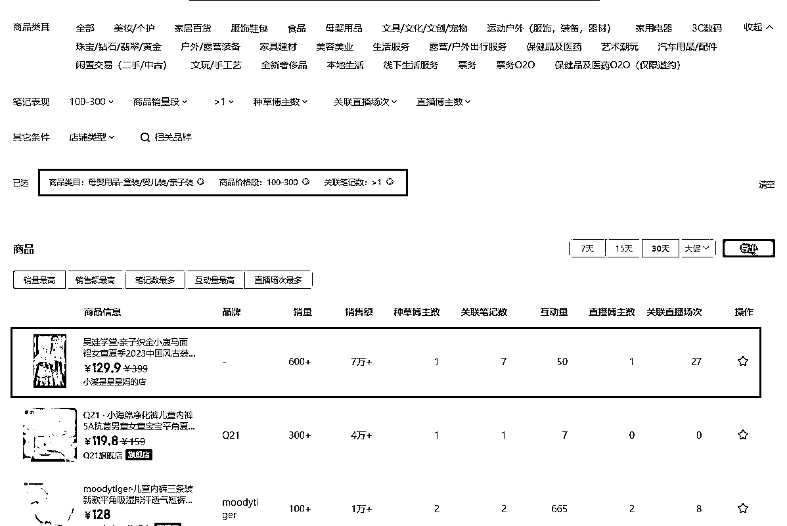
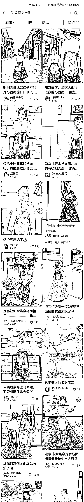
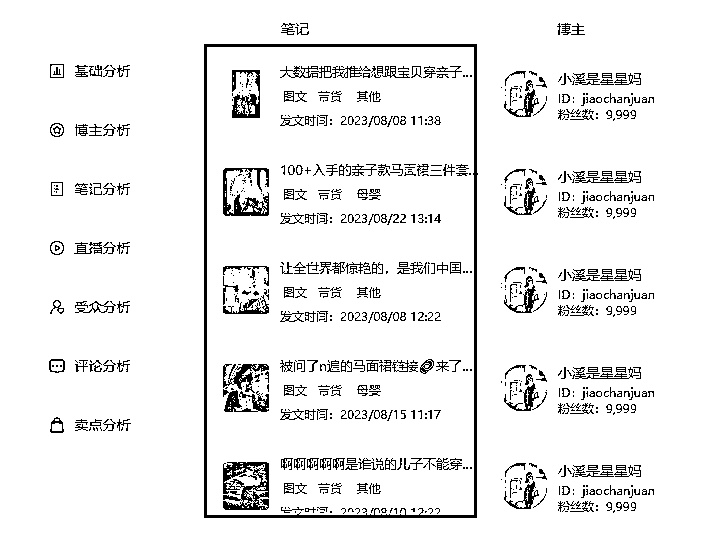

# 我的电商、私域选品方法

> 原文：[`www.yuque.com/for_lazy/thfiu8/it51ianc44umuble`](https://www.yuque.com/for_lazy/thfiu8/it51ianc44umuble)

## (34 赞)我的电商、私域选品方法

作者： 王永超

日期：2023-11-09

大家好，我是王永超，非常感谢生财有术给机会来聊一下我选品的一些方法经验。

我是 98 年的，一个农村的初中毕业生！去年刚搬到邯郸的。

去年做百度项目利润率达到 90%，这个项目收入 40w 多点。

现在重心放在了私域，通过小红书获客引流到私域，有 70 个左右的引流号，还在测试中。

其他的就不多说了，下面我开始说我在选品方面的经验。

我的看法是：选品，是建立在项目已经开始之上的。而选品也决定着：流量，转化，交付，客单价，利润率，复购率等数据。

同时期不同阶段的目的不一样，不同项目的选品方法也不一样

我在这里分成了电商和私域
电商：前期小闭环，后期做爆发
私域：起步就决定了胜与败

我把电商选品方法分为了：起步期，稳定期，和拓展期

这个阶段，首先要保证的是项目跑通闭环，跑通闭环的最快方式就 2 个字“对标”。无论做的是什么品类，起步阶段是没有经验的，只能对标！

那怎么对标呢？找到别人近期赚钱的品，去对标。近期代表着时效，赚钱代表着结果。这样对标下来，对于我们来说也更容易拿到结果

以小红书平台为例：

关联笔记-决定了我是要以笔记为中心，单纯的直播，肯定不要
然后就卡出来了这个品。

再去平台里搜这个品，看下产品的泛滥程度，以及同行做的基本程度

然后去拆解同行的运营难度（拍摄，剪辑，投流，直播），我是不是能以我的方法达到同样的效果，（别人拍摄牛逼，你剪辑牛逼能对标的很 6，也行）

以及对手的粉丝数量，（粉丝数量是以年为单位积累的，我们就对标不了。因为粉丝数量长期的积累是我们起步阶段难以复制的）

运营难度 ok，这个品，就先对标一下啦。

（这里也可以不确定品类，直接随机卡位）

这里不建议大家去关注热点，但是需要关注商品的销量，
刚开始，也没什么思路找热点背后的品。就看商品销量榜单就行了。

先确定自己的类目，直接搜类目词，会推给你一些产品，
在里面确定产品后，再去搜单独的品，来确定是否要做这个品

小结：起步阶段，电商的品的确定方法是：近期有人拿到结果，我全方位都可以做到和同行差不多的品。
不需要超越，差不多就行，先跑起来，先闭环。

（确定项目可以闭环为前提，然后认准“一种方法”，干到底。）

第二个阶段，稳定期
这个阶段，是延续第一阶段的方法，目标把项目做到可以持续稳定收入；以及稳定自己的运营方法。

延续初期的选品方法，以及运营方法，持续做到，可以标准化运营的程度。
1，有几款时效性不强，供应链稳定，运营方式稳定的产品，可以带来持续收入
2，有稳定的选品方法论+运营方法。可以带来持续稳定的收入
两种方法都可以或者其他，简单来说就是：自己在项目上面花少量的时间，就可以拿到稳定的收入

这个收入对每个人有不同的标准，依照个人情况来决定

最后一个阶段了，已经有非常稳定的运营方法，并且对平台的规则也非常熟悉了。也有人帮你做了！然后自己做拓展

<1>做一个自己特定的品类，去注册商标，找工厂贴牌（加品牌壁垒）
这个品类尽量有复购属性，并且对于普通人友好，
比如说，食品，玩具，饰品，等等，入局门槛不高的都可以。

然后，把确定的这类商品多号，多平台去做，把品质做好。把粉丝转成“铁粉”
复购性强的，也建议转私域做运营

<2>关注一些热点，去蹭热点品，比如说前几天的盐。火爆电视剧的周边，等等（增加手里的钱）
在选品的过程中，观察，热点与品的联系，是怎么关联的，培养自己在热点中选品的能力。
比如：

很多人疑惑，无权，无钱，无势，的三五产品，能起步就做私域吗？
答案是：可以的。

比如说：养生茶，燕窝，人参，按摩椅，养生仓，装修，全屋定制，情感咨询，减肥训练营，瘦脸针，檀香，手串，翡翠，把件，蜂蜜，水果，这些赛道都是有人长期在做的品。

做私域，就打算深挖这个行业了，肯定不能反感，别人长期在做，那肯定赚钱！

（以上任何赛道，以免费流量为基础的普通人都可以入局，只是能不能坚持下去，前面产品没有可以先分销，确定赚钱了，再去学，去找厂家，都可以）

刚开始不懂，不会卖？
加 10 个同行，先熟悉流程，有客户问不懂的问题，，先问同行，同行回复了，再回复客户

同时咱们都只能赚到自己看得见的钱嘛！就比如说都不知道农村浇地需要用水龙带，能去做水龙带批发吗？

关键：自己有，

大家做私域，都是奔着：高毛利/高客单/高复购这些来的！
和这些相关的产品有：机械，养生，文玩，训练营，.....
对应的关键词：多少钱一台，多少钱一克，训练营，怎么学....
把这些关键词，套入 5118 长尾关键词查询

在这里面找到自己感兴趣的产品，先留下来

咱们卖产品，本质上是为了解决一个问题，那么就可以从问题出发
关键词：怎么，怎样，如何，这类型的关键词，就代表着问题！
问题=钱

这些大部分都有人在做。

（这些关键词不仅仅在 5118 可以搜，淘宝，拼多多都有不同的特定关键词）

长尾关键词的目的是为了打破认知范围，就像生产塑料使用的注塑机，大多数人都不知道的，但是从多少钱一台的关键词中可以挖出来了。

小结：私域的品的确定方法是：长期有人拿到结果，我全方位都可以做到和同行差不多的品。

这个阶段和选品是交叉使用的
从流量，转化，交付，客单价，利润率，复购率这些方面去检验产品

以燕窝为例：
从 5118 上看下搜索指数，有人搜就有需求，一定程度上代表着流量数量

然后去百度指数，查看一下人群画像，确定起步要推广的平台

从确定的平台搜索同行，看同行做的时间多久，有 3 个月甚至 6 个月以上就加到微信，去看同行的话术，定价，朋友圈等，看看是否能在公域运营和私域运营中，打得过“一部分同行”。

这里主要看的是：转化，交付，客单和利润

有同行做的不如自己，还能活的很久，那么说明自己进去，大概率能活下，就可以入局了

有新进来的同行，就跟他 3-6 个月，看看对方能不能做下去，看了半年，一年还在做！那也可以入局试试

我这边是单独拿出来一个号加同行，不定时去翻关键词，找找同行加上，看看别人的营销过程什么的。这个随意

小结：验品阶段主要是根据流量，转化，交付，客单价，利润率，复购率这六个方向确定能不能达到自己的预期。以及有没有自己入局的空间

看我们做了这么久的规划，入局也不一定能做的好！
就需要测试了，准备一个微信号，先对标同行，把朋友圈先打造好，我们要起步就盈利

还有一种截流，但是大多需要产品比同行更硬，测品阶段，就不讲了

<2>测转化
我们要的是起步就赚钱，
把从同行哪里对标来的通用转化话术，安排到一个可以一秒复制的位置（收藏，一个人的微信群，等等）

这些方面就不多说了，回到选品上，
测品，不行就回到第一步，重新筛选，或者再坚持坚持

ps：高价位产品，回复尽量别太急，看字数多少，给客户一种，我在认真给你打字聊天的感觉

我们前面的准备工作很多，流量端差不多，大概率是可以做起来的，也不排除做不起来的情况，
换个品再测就好了，
这个更加适合做副业，花几个月时间，还自己一份比较长期的事业，还是比较划算的

测试一个产品已经做起来之后，接下来就是拓展产品。拓展产品是从基础人群画像+产品的特有画像去增加产品的。

5118 有个【相关词】功能，这些都是可以直接增加的产品，

（要给自己的人设增加一个转折的故事，就可以加上产品了）

总结：
电商，重要的是，先找到一批可以打的品，让自己在这个平台上有一套自己特定，且可以持续盈利！

私域，不要有局限性，大多数产品都可以一个人起家，把时间线拉长，沉下去。

以上内容，有一部分不是自己实操经验，只是我感觉是对的，所以分享给大家，酌情参考！

也欢迎大家可以有时间在群里和我一块儿交流

* * *

评论区：

轩子 : 私域的玩法我分为四大步骤：拉新—养熟—成交—裂变。私域也确实是值得长期深耕的好项目，但也是有一定门门槛的。前期的引流就会拦到一批人，能找到适合私域销售的产品也是前提。路虽远，行则将至；事虽难，做则必成。
雨烟 : 最近小红书引流管控很严格，倒流到微信号很难呀，有没啥相对安全的方法呀，大佬
王永超 : 一直都很难啊！只是更难了。群引流，好像是目前个人号最稳的。

* * *