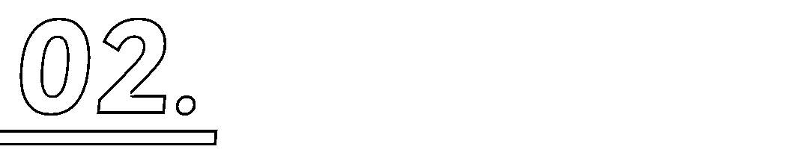
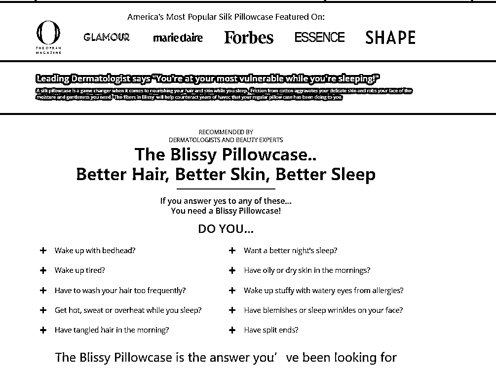
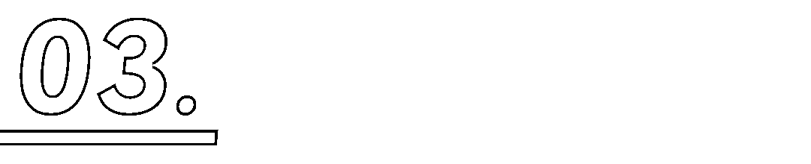
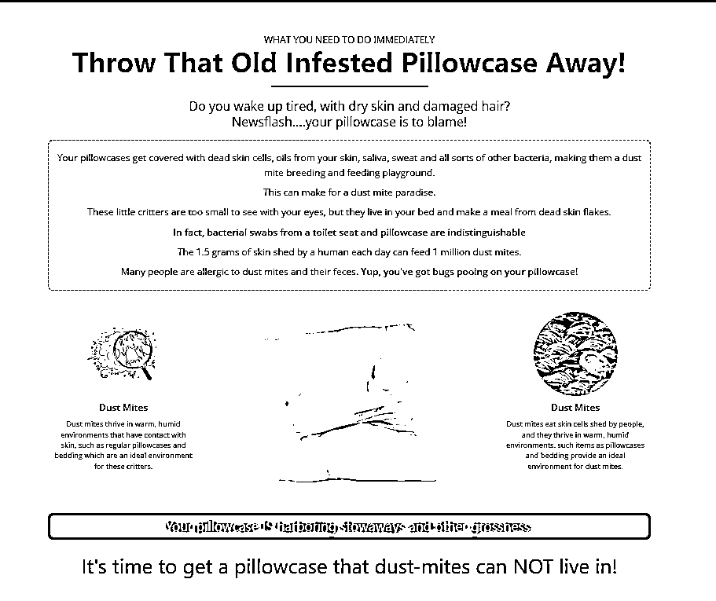
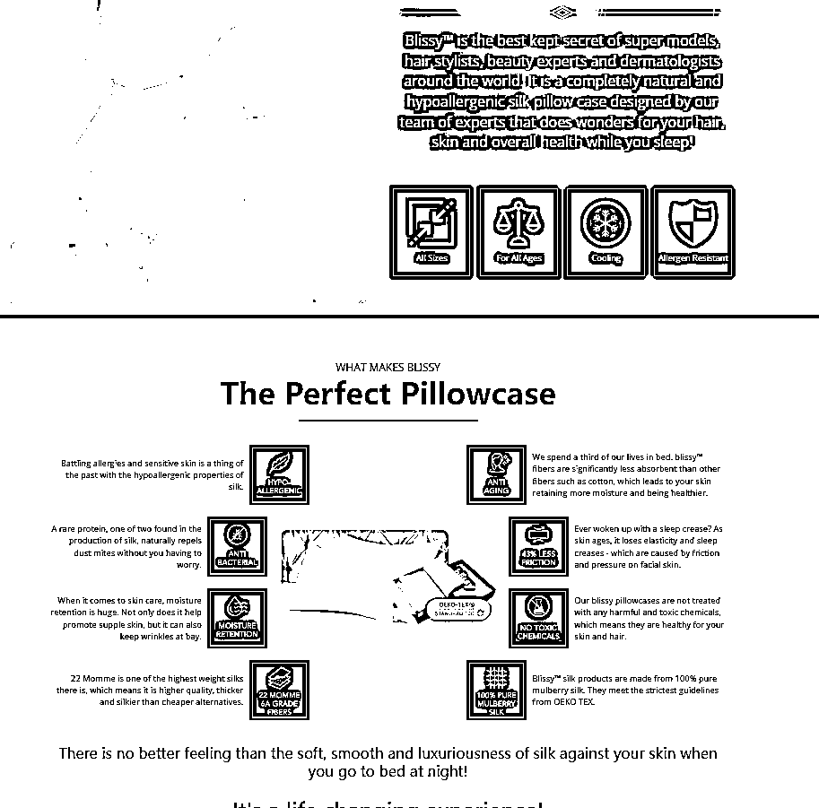
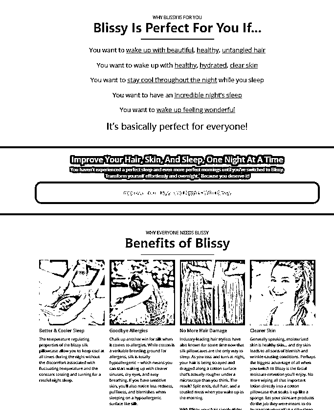
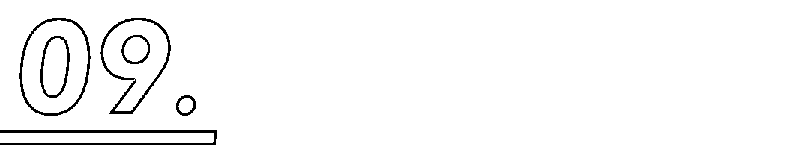
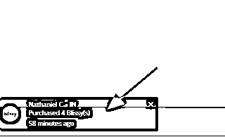
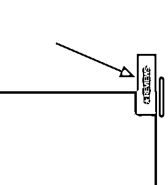
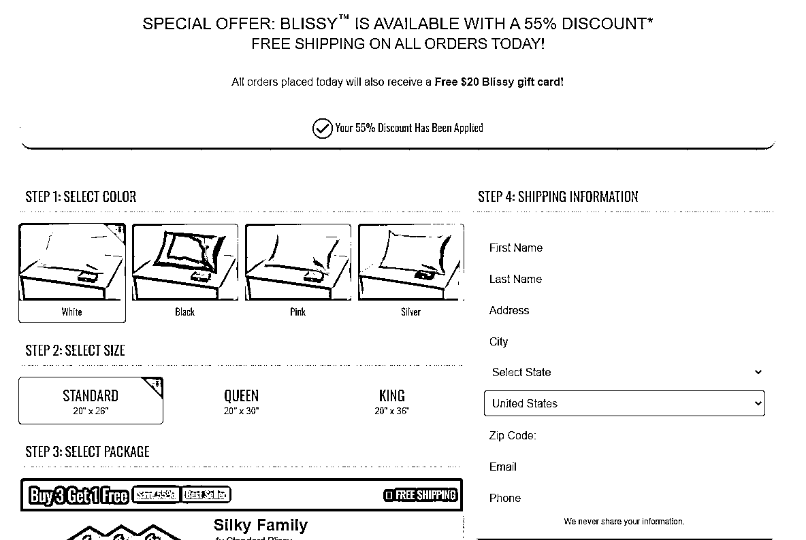

# 打造转化率页面的 13 个技巧大公开

> 原文：[`www.yuque.com/for_lazy/thfiu8/frtd393np89iehwr`](https://www.yuque.com/for_lazy/thfiu8/frtd393np89iehwr)

## (23 赞)打造转化率页面的 13 个技巧大公开

作者： 希声

日期：2023-11-06

用户点击广告，进入产品页面，下单付款。

非常丝滑，非常完美且令卖家心动的一个流程。

但现实中，用户往往进入产品页面之后，不到两秒就离开了。

也许是广告不够精准，也许是用户受众不对，但最大的问题一般是：我们的产品页面不够吸引人，用户没有为你的产品而感到心动，自然也就不会下单。

今天我们就来直接学习一个牛逼的有着高转化率的页面，看一个有着高转化率的页面是如何打造的。

页面是网址是：[`offer.blissy.co/lp1/`](https://offer.blissy.co/lp1)

产品是丝绸枕头套。

那么，开始吧！

# 一、Banner 模块

先看 banner 大图。

在单页的设计中，开头的 Banner 模块起着非常关键的作用，因为它是用户首次打开页面时的第一视觉冲击。

从这张图片中，我们可以看到以下的设计要素：

1.突出标题： “The Pillowcase That Works... While You Sleep”。标题简明扼要地写出主要卖点——一个在你睡觉时都能工作的枕套。

2.清晰的子标题： “Improve Your Hair, Skin, and Health While You Sleep!” 这进一步明确了产品的好处，同时带出了第二个卖点：即改善头发、皮肤和整体健康。

3.产品特点的图标化表示：页面中有八个小图标，每个图标都代表了该产品的一个特点。

4.醒目的行动召唤： “YES! I Want Better Sleep, Skin and Hair Today!”。这个行动召唤不仅颜色醒目，还有直接刺激用户采取行动。

5.真实的用户评价： “I love the feel of my blissy pillow case...” 。用户评价是提高转化率的关键，它为潜在的买家提供了真实的反馈和信任。

人们通常对首次打开的页面给予很少的时间和注意力，因此 Banner 的设计必须快速地去吸引他们的注意。其次，图标化的产品特点使信息传递得更快、更简洁。

# 二、品牌背书和用户痛点模块

下面图中包含了三四个不同的模块。

先是为了突出 Blissy 丝绸枕套声誉良好，放上了《OPRAH MAGAZINE》、《GLAMOUR》、《marieclaire》、《福布斯》、《ESSENCE》和《SHAPE》等杂志图标。

然后是一段专家的话术，皮肤科医生强调皮肤在睡眠中的脆弱性。

接下来直接罗列了十个问题，用严肃的口吻提问：你睡得好吗？皮肤会干燥吗？头发会劈叉吗？眼睛会过敏吗？脸上有皱纹吗？

直接把用户可能出现的问题/痛点都罗列出来了，然后又逐一进行了回答，回答为什么会导致这些问题，用理性来分析，来加强用户的信任感。

最后结尾再来一句“The Blissy Pillowcase is the answer you’ve been looking for”。大声呼喊：我们的枕头就是你在找的，你的解决方案在这里！

# 三、产品对比模块

这里用了两个比较复杂的模块来突出对比普通枕头套和 Blissy 枕头套的区别。

我们先来看第一张图。

引人注目的标题：标题“Throw That Old Infested Pillowcase Away!”扔掉你的枕套！直截了当，引发消费者的紧迫感。

1.  刺激消费者痛点： “Do you wake up tired, with dry skin and damaged hair?”等都直接针对消费者的实际问题。通过提醒消费者他们可能面临的问题，增加他们购买新产品的意愿。

科学数据支撑：提供了关于尘螨的事实和数据，如“1.5 grams of skin shed by a human each day can feed 1 million dust mites”。增强了说服力，让消费者相信问题的严重性。

视觉效果：通过图片展示尘螨的放大图，加深了消费者对问题的印象。强烈的视觉冲击可以更好地吸引消费者的注意力，增加购买意愿。

强调解决方案： “It's time to get a pillowcase that dust-mites can NOT live in!”这样的句子强调了他们提供的产品是一个有效的解决方案。为消费者提供了一个明确的行动方案，促使他们购买。

再看第二张图，上下两个模块。

权威介绍:提到超模、发型师、美容专家和皮肤科医生，为产品赋予了专业和权威性。

突出产品的核心优势：提到产品是完全天然和低过敏性，专门为保护头发、皮肤和总体健康而设计。清晰地展示了产品的核心卖点和对消费者的好处。

具体产品优点解释：详细解释了产品的各种优势，如天然排斥尘螨、维持皮肤湿润、防止皱纹等。帮助消费者理解产品的真正价值，增加其购买欲望。

产品其他特点：通过标签如“所有尺寸”、“所有年龄段”、“抗过敏”等，展示了产品的多功能性和普适性。扩大潜在客户群，吸引更多消费者关注和购买。

质量与安全的保证：提及产品是 100%纯桑蚕丝制成，并符合 OEKO TEX 的严格指导方针。

最后再次着重强调用户体验：“没有比晚上睡觉时蚕丝对皮肤的柔软、光滑和豪华感更好的感觉了！这是一次改变生活的体验！”这种描述增加了产品的情感价值。不仅仅是一个物理产品，还为消费者提供了一种新的生活体验。

这里也能看出非常有逻辑性，层层递进。

先突出大卖点，再一点点地列出小卖点，包括其他优势，质量保证等等。而最重要的用户心理体验和情感价值则放在最后来突出强调。

# 四、产品价值模块

这一个模块可以说是对上面产品优势的补充，继续罗列产品的优势和使用产品后的可能改变，更突出产品为用户带来的价值而不是产品特点。

清晰的标题：“Blissy Is Perfect For You If...”和“Why Everyone Needs Blissy”为用户提供了明确的信息，告诉他们这个产品为什么适合他们和大家都需要的原因。

产品价值：页面列出了使用 Blissy 枕头套的多个具体好处，如改善睡眠、减少过敏、减少头发受损和皮肤更清晰。这样的列举方式让用户更容易理解产品的实际价值。

情感连接：语句如“Transform yourself effortlessly and overnight. Because you deserve it!”与用户建立了情感联系，让他们觉得自己值得拥有这样的产品。

材质对比：通过与棉制品进行对比，强调了丝绸产品在过敏、头发损伤和皮肤保湿方面的优势，使用户更容易看到丝绸的独特之处。

呼叫行动：“Improve Your Days and Nights With Blissy!”这样的语句鼓励用户采取行动，购买产品。

# 五、产品细节模块

这个模块从具体的产品细节开始描述。

明确的优势：页面强调 Blissy 与其他丝绸产品的不同之处，如其 22 Momme 的高质量丝绸和 OEKO-TEX 的高标准认证。

细节特点：明确列出产品的特点，如隐藏的拉链设计、22 Momme 的丝绸和 6A 级别的丝绸。

促销优惠：页面提供高达 55%的折扣，这是一个很大的刺激，鼓励消费者进行购买。

清晰的行动召唤：如“Improve Your Days and Nights With Blissy!”，鼓励消费者立刻采取行动，购买产品。

# 六、用户评价模块

罗列出用户的真实评价。

这里罗列出了非常详细的用户评价，而且数量达到了上千条之多，这样是能够提供非常巨大的信任感。

# 七、FAQ 与政策模块

这里展示了一些常见的用户疑问，比如对于丝绸的困惑，对于退换货的说明，产品洗涤说明。

详细的产品问答：通过 Frequently Asked Questions 的形式，为用户提供了关于产品的详细信息，如 Blissy 丝绸枕套的好处、材料、如何清洗、什么是 22 Momme Silk 和它的质量标准等，使得潜在客户能够全面了解产品。

购买的安全感：页面提供了 60 天的 100%退款保证，并明确标出了“Money Back Guarantee”，这消除了客户的购买风险，并提供了额外的信心。

简洁明了的退款政策：退款政策简单易懂，让客户明确知道如何和在何时可以退货。

# 八、行动召唤模块

整个页面每隔一个模块基本都会有一个行动召唤的按钮，这让用户在任何的 1s 想要下单的时候都可以立刻下单。

而且还弄了一个固定悬浮窗，不论用户滑到什么位置，随时都可以在页面的底部点击按钮下单。

# 九、其他模块

在页面的左下角和右侧，还添加了购买动态弹窗以及产品评价弹窗。

# 结账页面优化

这个网站的结账页面也做得非常优秀。

无需跳转单页结账；多种付款方式；清晰的下单流程指引；再次重复的产品卖点和评价展示；网站安全与付款安全标示；多种产品套餐选择……这些模块不但再次提高了转化率还提高了客单价。

# 打造高转化率页面的 13 个模块技巧

通过上面的分析，我们可以简单地总结出一些常用的能带来信任与转化模块的设计技巧。

Banner 和头部标题模块：

主标题：简短、直接，明确地传达产品或服务的主要卖点/价值。

子标题：进一步详述产品或服务的特点或者好处/优势。

产品或服务亮点展示模块：

通过图片、短句或图标快速突出产品的主要特点。

痛点描述模块：

描述目标客户可能面临的问题。

强调为什么这个产品或服务可以解决这些痛点。

产品或服务解决方案模块：

描述产品如何解决上述痛点。

可以使用图片、图表或短片段来进一步说明。

产品对比模块：

与市场上的竞争对手或传统方法进行对比。

使用表格、图表或其他视觉元素突出我们的产品优势。

社会认可/推荐模块：

显示名人、专家或知名品牌的推荐或评价。

可以使用引用、图像或 logo 来展示。

常见问题（FAQ）模块：

回答客户可能有的常见问题。

通过简洁的回答提供更多的产品或服务信息。

优惠和促销模块：

显示折扣或促销信息。

通过限时优惠或数量限制来制造紧迫感。

用户评价和评论模块：

显示真实的客户评价。

可以用星级、文本或产品图片来展示。

产品详情和说明模块：

更深入地描述产品的材料、工艺或技术特点。

使用图像、图表或其他视觉元素来辅助说明。

呼叫行为（CTA）模块：

设计明显、引人注目的按钮，鼓励客户进行购买或采取其他所需的行动。

页面应该有多个 CTA，确保在用户滚动时始终能看到。

购买安全感模块：

显示退货政策、退款政策或试用期等信息。

可以帮助客户消除购买疑虑，增加信心。

底部信息模块：

提供联系信息、社交媒体链接、版权声明等。

如果有需要，还可以再次显示 CTA。

# 高转化率页面总结

从上面的这些模块和分析，我们可以总结出制作一个高转化率页面的流程：

明确目标受众： 在设计网页之前，首先要明确目标受众是谁，他们有什么需求和痛点。只有了解目标受众，才能设计出符合他们需求的网页。

突出产品或服务的卖点： 网页的核心目的是促成销售，因此设计过程中要不停地突出产品或服务的卖点，让用户一眼就明白这款产品或服务能给他们带来什么好处。

使用有效的视觉元素： 视觉元素（如图片，图标，图表等）可以帮助用户一目了然地看到痛点/解决方案，也能更好地理解复杂的数据。

多角度建立信任：利用品牌背书、专家证言、科学数据和用户评价等来建立信任和权威感。

提供足够的信息： 用户在购买产品或服务之前可能存在的潜在疑问，都要尽可能地罗列出来，让用户不会感到困惑或者增加用户行动路径。

多次 CTA：在页面的不同部分重复行动召唤，以便用户随时可以进行购买。

完善的政策：清晰的退换货政策，退款政策，隐私政策，资金安全保障措施等。

总结：打造高转化率的产品页面不仅是美学，也是科学。整个页面在做的事情其实就一件事：尽可能高效率地与用户沟通，让产品价值与消费者需求和期望产生共鸣。

**如果分享对你有帮助希望点个赞哦~**

**————————**

**我在生财的其他文章链接：**

[跨境创业？新手下场前必看的赚钱指南！](https://articles.zsxq.com/id_n97vrpiahx5w.html)

[保姆级教程！注册 Midjourney 并开通付费订阅功能](https://articles.zsxq.com/id_gnm2x96buu9t.html)

[跨境电商的 ChatGPT 应用指南全集 v3.0](https://articles.zsxq.com/id_eh50cr4chn8a.html)

[1 天内如何启动电商/外贸/跨境网站？ChatGPT 来助力！](https://articles.zsxq.com/id_1azlnfovac6q.html)

[一个工具管理上百个社媒账号？指纹浏览器使用全攻略！](https://articles.zsxq.com/id_u2ub0iv60p1g.html)

[白嫖！3000 元的谷歌广告优惠你要吗？](https://articles.zsxq.com/id_sa1bz4dckqeq.html)

[Etsy 注册最新最全指南！一文回答如何注册、需要哪些材料、如何避免封店、如何申诉](https://articles.zsxq.com/id_590wii7jr4iu.html)

[批量做小红书图片/视频的方法-canva 批量创建](https://articles.zsxq.com/id_pnpv1g2m5fi6.html)

[一个 ChatGPT 高效使用技巧—编辑原有内容](https://articles.zsxq.com/id_5twbrd3idlbw.html)

[效率飙升！跨境电商领域的 ChatGPT 应用指南 v1.0](https://articles.zsxq.com/id_7wu5dtpkh4m4.html)

[《段永平投资问答录-商业逻辑篇》精华金句摘录](https://articles.zsxq.com/id_xrltpwocer4p.html)

[《段永平投资问答录-投资逻辑篇》精华金句摘录](https://articles.zsxq.com/id_2k5d3mdace44.html)

[《穷查理宝典》精华金句摘录](https://articles.zsxq.com/id_er7b3dm8lx7w.html)

[《零编程知识怎么在 AI 帮助做一个贪吃蛇的游戏》](https://articles.zsxq.com/id_nqxxc79whz1t.html)

[快速获取谷歌 SEO 流量的一个策略](https://articles.zsxq.com/id_txli3kufpvig.html)

[ChatGPT 4.0 新功能，让你的数据和设计工作事半功倍！](https://articles.zsxq.com/id_it0blu6we0p4.html)

* * *

评论区：

暂无评论

* * *