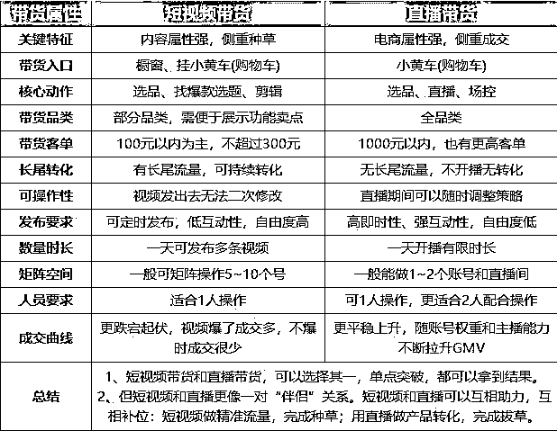
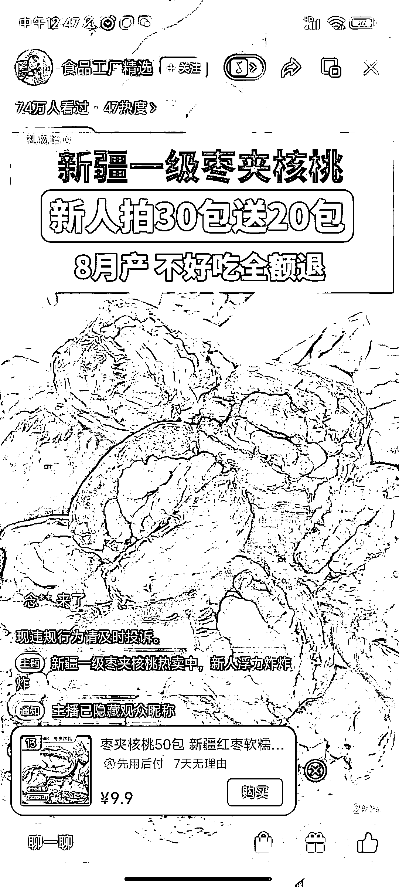

# 视频号单品直播打法拆解和 60 分主播炼成秘籍

> 原文：[`www.yuque.com/for_lazy/thfiu8/kehygu4b5be6zong`](https://www.yuque.com/for_lazy/thfiu8/kehygu4b5be6zong)

## (110 赞)视频号单品直播打法拆解和 60 分主播炼成秘籍

作者： 肖肖

日期：2023-11-10

各位航海圈友，大家好，我是肖肖

很荣幸这次作为教练，把自己做视频号直播带货以来的一些经验和感受，跟大家做个分享。首先将个人过去一年的视频号直播带货经历做个简单介绍：

从短视频带货入局视频号，再通过无人直播尝到直播甜头，几个月后重心转向直播带货
从半无人到真人直播（先后涉及纯自然流打法、短视频撬直播自然流、自然流+微付费打法、纯付费直播打法）
从直播小白到成为 60 分主播，再到一人身兼运营、主播、场控，最终一年时间累计带货 200w 的 gmv
其中直播带货占 80%，自然流占比 90%，曾靠一个单品播出了 60+w 的 gmv，最高单月佣金 30+w

所以今天的分享我将主要围绕视频号直播带货，尤其是普通人怎么入门直播带货，提供一些思路建议。希望能为大家带来些许帮助，注入一些新能量，在视频号直播这件事上做得更好，赚到更多的钱！

就短视频带货 VS 直播带货而言，大部分人选择从短视频带货开始入局，之后或长期做短视频带货，或转向去做了直播带货，但即便是做短视频带货的玩家，也不得不时常开直播去承接流量转化，因为直播成交效率最高！

关于短视频带货 VS 直播带货的特点，我以前整理过一个对比图，大家可以看一下

事实上，对于做项目赚钱而言，能把短视频带货或者直播带货任何一种玩法做好、赚到预期收益，就已经很优秀了。毕竟每个人都有自己的基因，有自己的擅长点，在如今内卷形势下，拿下一个基本盘不易，要先守住。然后要扩大收益，扩充玩法，也建议先做纵向深入，而非直接横向拓展，既要又要的心态和做法，并不可取。

这两个方向没有优劣好坏，只有适合不适合自己。如果你在短视频带货有网感体感了，那么请坚持深耕下去，把直播作为辅助技能包去修炼提升便可以了，始终抓住自己赚钱的主线，不好高骛远，贪多求全。

但如果你在短视频带货上努力三个月甚至更久，一直没有达到下限结果，亦或者你本身具备直播带货的某些优势，那么直播带货这条看上去更难走的路，是不是也应该认真的思考分析、克服阻碍、并勇敢的踏上征程呢？

对于以下三类圈友，我强烈建议你好好的琢磨一下，怎么去开始或者优化自己的直播旅程了：

短视频带货，用户下单无非四个渠道：直播间＞挂购物车＞橱窗＞私域
短视频爆量，不开直播，等于浪费流量。所以很多人还是想去提升主播能力，不断优化提升直播承接转化率

短视频爆量开播，一个纯小白主播+简易直播间，也能卖出 500~3000 的 GPM（千次观看成交金额）的本质在于，短视频种草进入直播间的用户非常精准，购买意愿非常强烈，很多人进入直播间就是带着咨询和下单目的

但大家有没有想过，假如你是一位 60 分及格的主播，转化率是不是可以提升更多？是不是可以抓住一些短视频进入直播间的中度意向甚至低度意向客户？是不是可以通过这些短视频流量来带动直播流量，撬动直播间自然流，从而完成直播冷启动，然后哪怕视频没量了甚至号废了也可以继续通过直播来赚钱？

短视频带货固然很香很刺激，一旦爆量就是几十几百万甚至上千万播放，哪怕进入直播间转化率再低，也可能带来几千几万的场观，短短几小时拿到一场几万的销售额

但这仍然是概率，你不知道自己辛辛苦苦做的视频，哪条会爆，哪天会爆。即便有提升爆率的方法论，但终究比较被动。而直播带货，是主动出击，只要你具备一定的直播基础了，只要获取到流量，无论自然流还是付费流，就能转化成交，所以从这个角度来说确定性更强。

我知道身边一些圈友之前尝试做过一段时间的直播，也许是当时有红利拿到了一些结果，也许是一直没有入门最终没能坚持下来，亦或者当下还在坚持却一直困顿其中看不清前方的路比较迷茫，那么希望本文能给你补给一些能量，一些启发，让你能够走出迷雾，让你具备再多坚持一会的勇气，遇见柳暗花明。

总之，不管短视频带货也好，直播带货也好，都是个由难到易的过程，从 0 到 1 都是最艰难的！换句话说，明天的每一天，都比今天要轻松。一旦入门上道，找对了方向找到了感觉，一个月赚的钱就是前面三个月甚至半年总和。

可以肯定的是，视频号平台处于上升期，只要不下牌桌，就仍有机会！同时肯定的是，你现在不死磕不提升，那么越往后越难抓住机会！明显可以感觉到，视频号的商业化进程越来越快，入局者越来越多，此时不拼更待何时？

特点：通过大量的测品测素材，让短视频爆量，立即开播，利用直播的高转化率，完成流量承接转化。
这种最常见了，也是大家最熟悉的，近期火爆的连怼玩法，涌现了无数的爆单案例。
案例拆解：

特点：先通过发布短视频，短视频爆了开播，然后在直播间去做浅层数据和成交数据，迎合直播的推流逻辑，完成直播间冷启动，然后长期直播。换句话说，短视频成了直播起号的助推器，也是直播间流量的补充。
案例拆解：

特点：短视频不挂车，属于内容视频，比挂车的电商视频审核更宽松，更有利于投放过审以及放量。和短视频自然爆量不同，通过付费投流来主动去打出短视频爆款，引入直播间完成转化。
案例拆解：

特点：和短视频不同，ADQ 是类似千川的投放系统，可以在 ADQ 系统用短视频创意广告素材，去付费买量，投放到短视频的 feed 流里，用户看到的界面和短视频是一模一样，就多了“广告”两个字。
案例拆解：

特点：0 粉开播，视频发不发爆不爆无所谓，利用自然流算法和推流逻辑，做足系统所需要的浅层和深层数据，完成直播冷启动，俗称直播起号，从而获得长期的自然推流。
案例拆解：

特点：有些品，有些账号，本身的自然流偏低，亦或者比较难拿到想要的浅层和深层数据，纯自然流起号难度较大，故可以利用微付费来补相应的数据，从而带动和完成自然流数据考核，完成直播冷启动。
案例拆解：

特点：0 粉直接开播，也不用自然流那套起号逻辑，直接付费买量，直投直播间，完成流量承接转化。
案例拆解：

在开始这个话题之前，我想先问大家一个问题，对于直播来讲，人货场，在你心里认为哪个优先级最高？

a、有的人说是人，因为好主播可以做好流量承接，完成更高转化，有了更高转化也就有可能拿到更多流量。
b、有的人说是品，因为选品定生死，直播带货核心是供应链，是货品的竞争力。
c、有的人说是场，因为场景好就能提升曝光进入率，而曝光进入率是整个转化漏斗的基础，同时场景好就能拉停留，有了停留那其他的数据才有可能做得好。
d、也有的人说人货场要合一，都很重要，都得做好才能把直播做起来。

没错，这些回答站在不同的视角，都有道理。但对于普通人来说，这三个要素要均衡发展，同时提升和做到，是比较困难的！结合个人实战下来，有两个重要的认知和建议：

1、人货场，但凡有一项数据极端化，就有可能起飞。
2、人货场，新手一把抓不现实，先去解决最短板。

也就是说，不妄想并行修炼，拆解要素，先去控制两个变量，在一个变量下足功夫，去达到 90 分水平，或者 60 分水平，先拿到正反馈，让自己能够坚持下来，再持续去提升其他两个变量的竞争力，最终实现三要素的提升和协同。

对于大部分圈友，主播侧是最短板。毕竟品可以跟，场景可以照搬复制，但主播没法复制。所以，一年下来我总结自己能拿到一些结果也是适合普通人的视频号直播入局姿势=

关于直播选品和场景搭建，生财航海手册以及星球，有丰富的资料，今天不展开讲了。
关于专业主播的培训资料，大家在网上也可以找到，但多数时候看这些资料意义不大，甚至有副作用，梳理太细太复杂，对新手来讲容易被劝退。那么今天就聊聊主题：我们怎么成为 60 分主播？
很多场景下，60 分主播也够用了，已经甩开超级多不懂直播的玩家！同时 60 分，也是多数人够得着的目标。

60 分就是及格，是一道分水岭。60 分以下不及格，60 分以上能带货能赚到钱。
但抖音的 60 分主播，和视频号的 60 主播，很不一样。抖音的 60 分，从综合能力来讲可能是视频号的 70~80 分主播。但抖音主播，却未必能做好视频号主播。因为两个平台目前主流购买人群差异大，所需要主播表现的东西不一样。

咱们都是白纸一张，不用有什么主播包袱，看完这视频号主播人设和特点，不就是本色出演么！
硬要说几个标准：①口齿清晰，把话说清楚  ②有亲和力，愿意听你说  ③ 懂点销售，能做成交转化

换句话说，大部分的圈友，练习练习，学习学习，都具备成为 60 分主播的基本条件。
要成为一名 60 分主播，最核心的是克服心理层面的障碍，其次才是能力层面的练习提升。

无它，先播 100 小时，每天 4 小时，一个月而已。每天 2 小时，也就两个月。
是的，不光短视频，直播也是需要怼量的。那在直播当中，重点去练习的要点有哪些呢？

a：理解话术框架和整合话术
b：节奏语速和情绪表达练习
c：大屏数据即时观测及反应
d：直播回放和场次数据复盘

对于新手主播，因为人货场基础能力不足，所以付费投流显然不建议，所以把重心放在自然流打法上。前面第二部分已经跟大家梳理了 7 种直播间打法，适合新手主播去做的，推荐如下三种：
①短视频爆量+直播承接
②短视频爆量+撬动直播自然流
⑤纯自然流直播间

另外，从直播人货场的角度，比较简单的直播形态，即一个人可以完成，对主播要求比较低，对场景搭建要求也比较低的，推荐以下两种：
①手播：单品+简易场景+不出镜或镜子露脸
②绿幕直播：单品+静态绿幕场景+出境

根据自己的打法，选择适合该打法的品，以及找到使用该打法正在播这个品的账号。
进一步去看播的数据，比如场观、销量、千次转化等等，如果不错，就确认为：对标账号。

比如短视频爆量+撬动直播自然流打法，通过刷短视频 feed，多关注这类账号，然后看哪些账号持续直播。
比如纯自然流打法，通过刷直播广场，也可以关注到很多账号，重点看哪些账号是最近起号的。

确定好对标，初步确定一个品，先去找商家沟通确认一下品的情况，比如佣金，比如了解其他达人带的情况。
刚开始直播选品，以跟品为主，不建议自己开品，自己去联系供应链，前期也不必在佣金上纠结和挑剔。

用 EV 录屏软件录制 2~3 个对标直播间，上传到飞书妙计，导出话术。先是边听边看，学习别人怎么播。一定要多听几遍，仔细研究话术，拆解直播框架和结构，这些话术的目的是什么，别人是怎么表达的，最终整合出一份适合自己的话术，然后自己试播，直到自己说出来这些话术自然、顺畅。

一般来讲，现在视频号直播，要么是绿幕直播，要么是实景直播。绿幕直播，就涉及到绿幕背景图和贴片，自己能做就自己做，不会的话找人设计，别耽误太多时间，不求精美但也要抄的七七八八。实景直播，就看用到了哪些道具，常用的置办便宜或者二手的即可。

前面这些步骤做完，坚持每天开播、调整。经历该经历的，一点点打怪升级。找到了对标，就是学习模仿的过程，同行是最好的老师。跟了对标一样的品，用着相似的场景，只需在主播侧持续练习和精进。

关于我是怎么开始直播带货的，去年 12 月份我在视频号直播带货航海也做过一次分享，那是作为新手小白第一个月做直播带货，里面讲的很细节，感兴趣的可以看原文：

然后在 7 月份我也把自己打爆品的案例复盘发到星球并被亦仁评为精华，里面有关于单品直播间运营的基本思路和人货场优化建议，都是自己实操经验总结而成，有需要的可以在星球看：

先发之前看到的一张图片，总结比较全，借用一下，视频号和抖音类似。

咱们圈友主要面临的还是冷启动期的问题，几个高频问题和建议：

新号 0 粉开播，养一下微信号过掉风控，往往一小时是 50~200 流量，属于正常。前期开播练习建议一场播 2 小时，以熟悉话术找节奏为主。正式直播起号，按照螺旋递增逻辑，做每一场数据递增，必要时可配合微付费引入流量，尝试做流量承接转化。也可以自然流拉时长，通过多天多场直播，逐步提高账号权重及自然流。

直播过程难免违规，甚至频繁触及违规，解决办法第一个是查阅规则，搞清楚违规原因，第二个是多备号。
和短视频带货一样，直播违规也时有发生，尤其为了起号用到一些技巧，违规、踩坑都是成长的印记。

如果是短视频进入流量，平播即可，或者微憋单更好一些。
如果是纯自然流，以微憋单或者强憋单为主，做好浅层数据才有机会起号。

当自然流低的时候，可以微付费增加一些流量，从而代入直播节奏，以及验证是否可以接住流量
当自然流转化还不错，通过微付费进一步增加流量，增加投产。

总之，凡事先有再优，先达到 60 分，再去一点点提升到 70 分、80 分。先解决最短板，再去构建长板。
关于视频号单品直播案例，我拆解了近百个，再结合自身经历，我认为 80 分潜力品+70 分场景+60 分主播这个结构和模式目前还是有机会的，尤其是单品付费直播，ADQ 后续应该有一波红利机会，如有正在做视频号单品直播的圈友，希望多多链接和交流，一起生财有术。

以上就是本次分享的内容，感谢圈友们，祝大家爆单！

* * *

评论区：

观照 : 教练出品，必属精品
刘员外 : 太强了，受益匪浅
橙橙子 : 太干了
七层复活甲 : 亲测 教练有水平  有耐心 讲的细 实战派
Dylan : 先赞后看，教练 yyds
ALLEN : 太细了
捞月亮的渔民 : 肖肖大佬，先赞后看。
春天 : 肖肖教练 yyds！

* * *