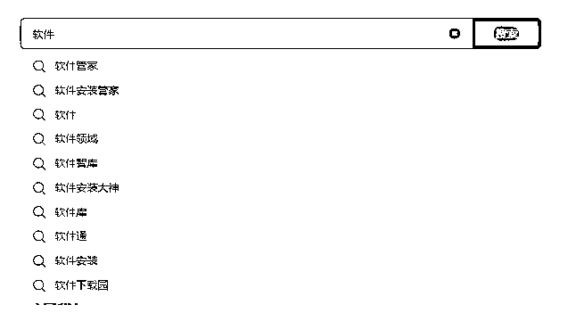

# 小市民思维学会“存流量”，日拱一卒过河当车使

> 原文：[`www.yuque.com/for_lazy/thfiu8/bp08384virwnvh0g`](https://www.yuque.com/for_lazy/thfiu8/bp08384virwnvh0g)

## (56 赞)小市民思维学会“存流量”，日拱一卒过河当车使

作者： 领飞懂运营

日期：2023-11-08

一个人可以注册 3 个咸鱼号，每个号如果做好了差不多 3000-5000 的收入，一个人管理 3 个号运营，基本每天的时间精力就如此了。同理小红书图文带货每天运营 3 个号，也是这样的消耗。

**所以你无法实现批量管理，就无法赚到大钱，**这就是为什么很多人培训卖项目的原因，一类培训我可以卖一千次一万次。

**对于个人想要实现超级个体户，**你必须学会卖项目，必须学会引流创业粉，这样才能够长期的赚到大钱。

我们总是把眼光聚焦到项目本身，其实互联网的项目最不值钱，免费的能找到一堆，这一堆也是别人的付费培训，只不过你追求的是老师，所以你觉得免费没有价值。

加 1000 个创业老师，最后的验证结果就是：**项目好像不值钱了，因为这些老师都在某个时段培训一类项目。**

**如果你搞不了批量，也不去卖项目**

那就搞滚雪球的事情，这也是能赚到大钱的方法，什么是滚雪球赚钱？

就是像我一样通过个人 IP，一点点的输出内容影响一类人，这类人越积攒越多，干 5 年干十年，随便合作一个人就能卖项目。

**还有一种方式：**一边做内容 SEO 排名，一边做虚拟资源出售；这里我用“软件领域”当做案例，类似的还有教辅资料、公务员资料等

软件领域的关键词很容易上排名，不管你是做抖音，B 站、小红书、知乎，快手，你只需要把某个软件关键词当作内容标题，用户就能搜到你，就会找你来获取，以及还有推荐流量。

**引流到公众号，采用阳谋的方式，**全开放免费使用，这样每个粉丝当需求什么软件的时候，就主动去你的公众号，以及他们也愿意转发给朋友，形成自然的裂变。

这个项目很好复制，把那些软件公众号的内容，你全扒下来到自己的公众号就行，之后就围绕这些软件做内容分享，来获取流量，随着公众号内容越来越多，分享其他平台的内容越来越多，公众号就会成为流量机器。

这些软件你也可以开个淘宝、拼多多、咸鱼的店铺，一边能赚钱，一边还可以引流到公众号。

**这就是滚雪球，**一个人慢慢的把内容多渠道的分发，一点一点的积攒流量，当你公众号有 1 万粉丝，2 万粉丝，5 万粉丝；你的广告价值就会越来越高。

软件这个东西需求层次不穷，比如你之前干这个项目，现在流行 AI 软件，你可以自己开发小测序，你可以合作推广，利用你的公众号随便一个动作，就把钱赚了。

**你现在去做也不晚，与时俱进，从来就不会缺失；**没有早晚，越是一直存在的需求，越是长期赚钱，没什么风口可言，风口也是在你有流量准备前提下，才会为你带来福利、红利。

**之前我写文章问大家：你学互联网创业，是为了什么？**

如果你是为了副业赚点小钱，我还是建议你别学了，没有赚大钱的野心，你就是一个大韭菜，越是低级的要求，越是难实现；好比人人都想买个房子，多低级的要求啊，可这个社会就是把这么低级要求，被资本家搞的遥不可及，压垮很多老百姓，所以每个老百姓都是韭菜。

**我说这话，你仔细品，现实生活不如意，格局不大，难道学互联网就能改变吗？**

所以：当你们要学互联网创业的第一天起，就不要有低级要求，要有长远规划赚大钱的野心，互联网是重生，是把现实的过错重新推翻再来。

互联网赚大钱，说的天花乱坠，就是流量为王，其他都是次要的，但前提是你要长期持有什么流量很重要！牛逼的人跨任何行业都能搞到流量，人家是专业的营销经理人；而你不牛逼，就踏踏实实就专注领域，长期去做影响一类人的事情。

所以找个领域项目去复制，滚雪球的坚持做下去，流行什么营销风口，就你去做什么营销风口，能让自己雪球滚得更快些，那什么是营销风口？

抖音火你做抖音，小红书火你做小红书，现在视频号火，你就去做视频号，因为哪个平台火，也就代表着哪个平台流量红利，更好获取，其他都是次要，你就是为了搞流量。

**我希望都能拿到结果，**结果是有过程的，你可以慢慢做，但思维认知你必须长期持有，想搞快钱，想赚点小钱，我建议你还是：摆地摊、代驾、滴滴、外卖；这样更直接，一年下来也不少赚。

没有老板思维，没有创业自残精神，你赚不了大钱！来到互联网搞钱，还是小市民存钱思维，当不了老板有冒险精神，那就干“存流量”的事情吧，这个事情坚持做几年，也是逆袭改命，日拱一卒，过了河当车（ju）使。

**往期生财文章分享：**

# [【卖虚拟资源】如何转型发财，实现被动收入](https://articles.zsxq.com/id_ivjp0v8zrubv.html)

# [【中介思维+模式复制】博取年入千万机会的方法](https://articles.zsxq.com/id_9ces000ge6h3.html)

# [【长期暴利项目】中介思维极致，年入百万项目方法](https://articles.zsxq.com/id_cd7wutqqqa61.html)

# [【吐槽自己】引以为戒：从一开始就要有格局](https://articles.zsxq.com/id_s465kd1spkrg.html)

# [《拥抱同行“借势”课》 互 推 • 扩 列，涨粉操盘手 SOP](https://articles.zsxq.com/id_skrvu1ouvgul.html)

# [【同城二手玩具】中介圈人思维，月入 10 万方案拆解](https://articles.zsxq.com/id_9inkul8cnm63.html)

# [卖猫副业，宝妈用 2 只猫拍视频，年赚 20 万](https://articles.zsxq.com/id_665xq9jsmxoa.html)

* * *

评论区：

暂无评论

* * *