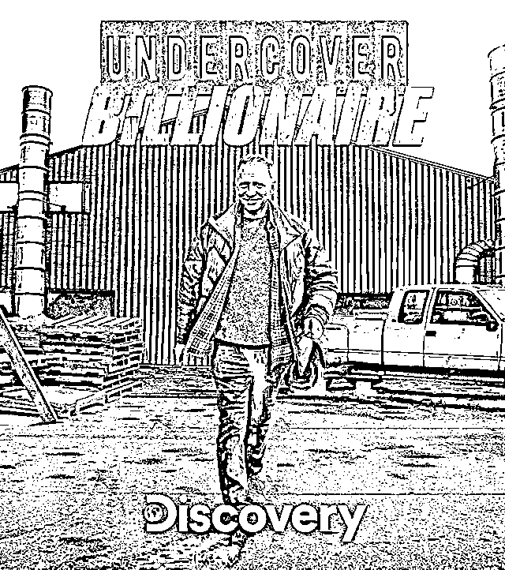

# 值得刷 N 遍的搞钱真人秀《隐姓亿万富翁》创业启示录

> 原文：[`www.yuque.com/for_lazy/thfiu8/ssimwb3y83g3lxhr`](https://www.yuque.com/for_lazy/thfiu8/ssimwb3y83g3lxhr)

## (44 赞)值得刷 N 遍的搞钱真人秀《隐姓亿万富翁》创业启示录

作者： 昊布斯

日期：2023-11-09

完全切断过去，回到起点，没有人脉、没有钱、没有资源，你有多大把握东山再起？

大家好，我是昊布斯，坐标西安，天使投资人，花了一百万学习各种老板课程，有近二十年经营企业的经验，先后覆盖了旅游、软件、设计施工、新媒体等行业，创办了两家年销售额 2000W 的高新技术企业，辅导了 30 多家创业公司，投资了 5 家互联网公司。

今年把主营业务公司交给他人打理，轻度财务自由，为了证实『创业』这件事的科学性，在阶段性的成功后，我也决定重建小号再走一次。这次，选择的是知识付费赛道，给中小企业看病，解决合伙、分钱、股权、薪酬、管理问题。

去年，看了真人秀《隐姓亿万富翁》，一个亿万富翁，隐姓埋名，只带着一百美元、一辆破旧的小皮卡和一部没有任何联系人的手机来到一个完全陌生的城市，在 90 天内从头开始，创立起一个价值百万美金的企业。

在功成名就之后发起这样的挑战，它关乎危机感，以及重建生活的勇气。

以下，便是这部真人秀带给我们的创业启示，内容较长，辛苦大家移步飞书[`sv5wqvnml89.feishu.cn/docx/GTXXdIVL1owvqCxdVC7chjimnXe?from=from_copylink`](https://sv5wqvnml89.feishu.cn/docx/GTXXdIVL1owvqCxdVC7chjimnXe?from=from_copylink)

* * *

评论区：

芷蓝 : 厉害
昊布斯 : 芷神也来啦，欢迎欢迎[呲牙]

* * *