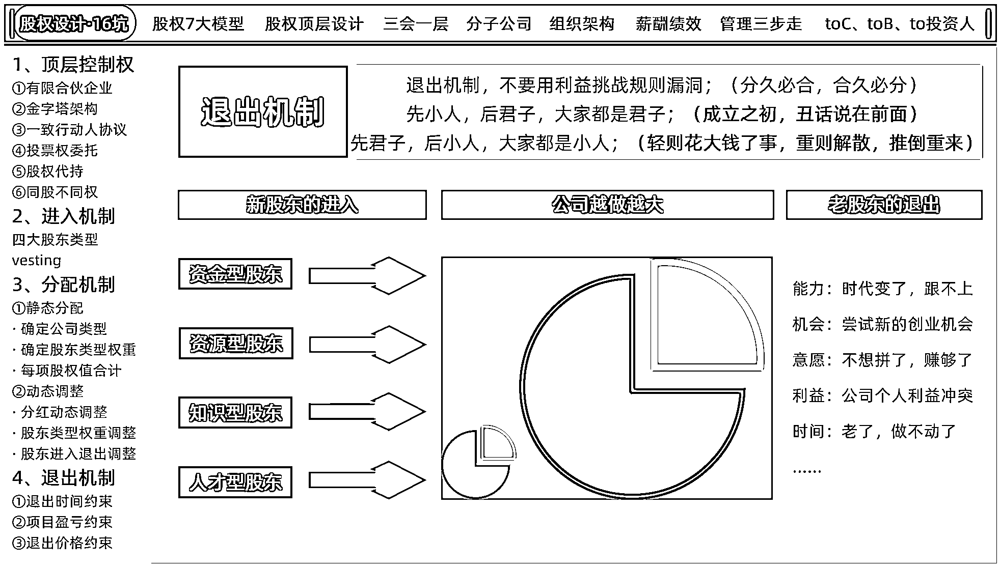
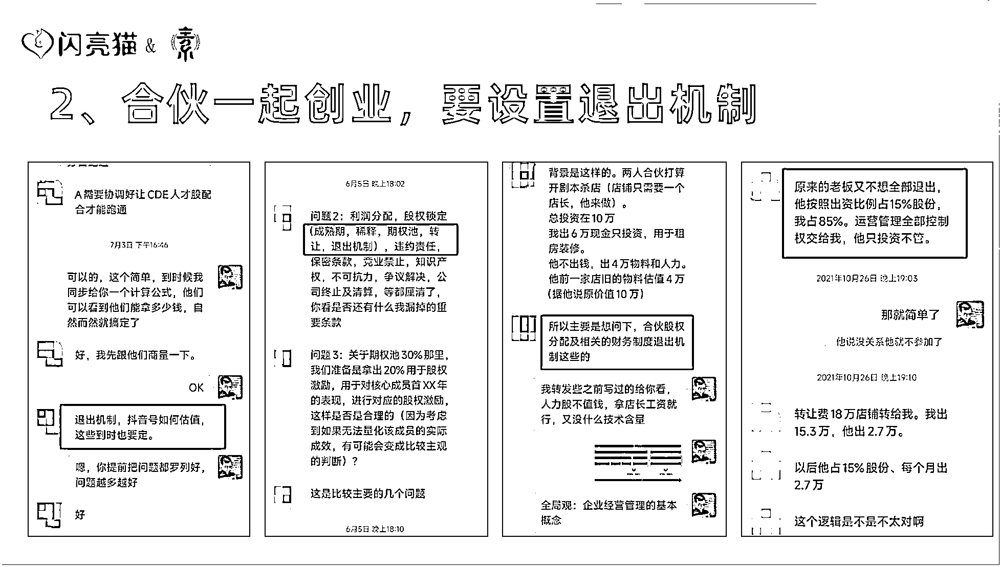
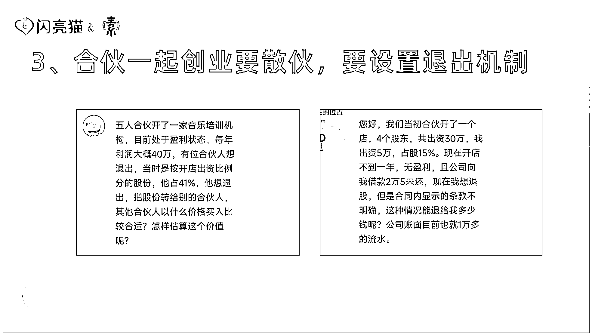
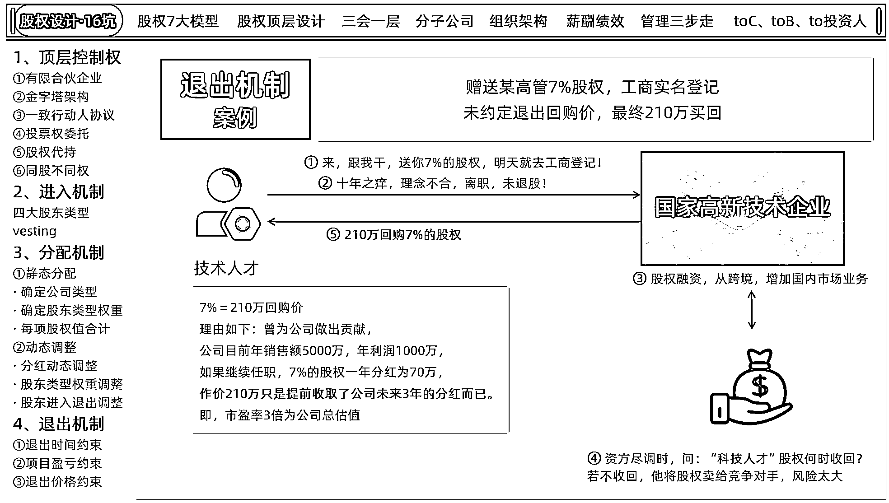
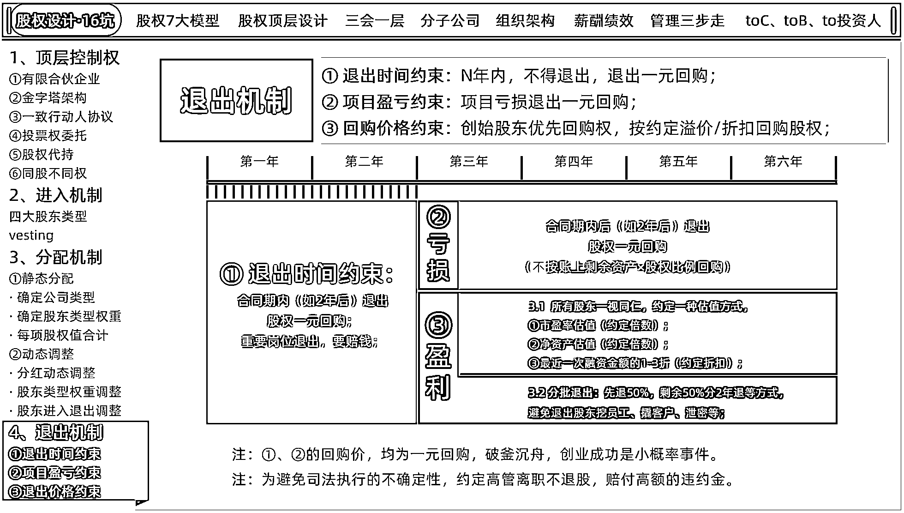

# 先小人后君子！合作创业退出机制怎么定？

> 原文：[`www.yuque.com/for_lazy/thfiu8/qx7amb0s4b3hwn08`](https://www.yuque.com/for_lazy/thfiu8/qx7amb0s4b3hwn08)

## (26 赞)先小人后君子！合作创业退出机制怎么定？

作者： 深圳刘宁培

日期：2023-11-17

大家好，我是刘宁培，也可以喊我宁老师，龙凤胎奶爸，常居深圳，全国飞。

主业企业咨询：股权设计、企业经营管理、商业模式板块。

副业做点小投资：开开知名品牌的加盟店，年底线下摆摊卖卖红包对联。

是生财第二期就一直续费至今的老圈友，编号 1748。

今天跟大家分享，合伙创业时，如果中途有合伙人要退出，应该怎么处理？

### 前言

很多老板，在刚开始创业的时候，踌躇满志，满腔热血。

拉上两三个志趣相投的好哥们，作为股东，觉得自己这么强，再加上身边和自己一样强的好哥们，强强联手，定能干一番大事业！

在工商登记的时候，看到有股份分配的内容，于是在网上特意查了一下，了解了一些股权相关的知识。

躲过股权平分的第一个坑，觉得自己很棒，没干蠢事。

股份分配，还按照资金/资源/知识/人才，这 4 大类别，给予了不同的权重。嗯，自己的做法还挺科学的！这下应该万无一失了吧？

是的，前两个坑避开了，在公司正常经营，向上发展的时候，确实没什么毛病了，股东之间也不产生矛盾。

直到有一天，某个股东突然要走了，才猛地发现：**大意了！退出机制事先没商量好呀！**

**对方临时退出，给项目带来麻烦，要不要赔钱？赔多少？**

**公司如果是亏损的，对方退出，要求按账上剩余资金 X 自己的股权比例，退还对应的钱，这该给吗？**

**公司如果是盈利的，对方退出，要求按 10 倍市盈率 X 自己的股权比，让大股东回购股份，这合理吗？**

**股东要求一个月内，把自己的股份回购，把钱结清，这会不会有什么风险？**

**.....**

多年前没聊清楚的隐患，如同一颗延时的手雷，一直以为没啥事，问题不大，直到爆炸的那天，一下子把自己干懵了...

为了避免这样尴尬的情况出现，咱们应该怎么做呢？

### 一、记住一个事实： 股东有进有出是常态

首先，咱们要理解一个常识：**天下无不散的宴席，股东有进有出，是很正常的。**

**无论你当初合伙的朋友和你认识年份再久，你俩关系再铁，都是存在中途散伙的风险的。**

可能是对方意愿出了问题，觉得公司发展前景不好，放弃了；或者赚够了，不想打拼了。

可能是能力的问题，股东在初创阶段做出了巨大贡献，但是公司发展到了新阶段，老股东已经无法再做出增量贡献了，成为了公司的累赘。

可能是对方想尝试新的创业机会？ 可能是对方的亲朋好友做的事情，和公司在做的有冲突...

也可能是在创业过程中，股东之间观念不合，产生了无法调和的矛盾...

**总之，不要假设你的股东会陪你一辈子，而要假设：**

**如果因为各种原因，你现在的股东总有一天会跟你分手，那该怎么处理股权的问题？**

以此心态，早做打算。

**常见的退出，有以下几种常见的情况：**

#### **（1）给员工做股权激励，要设置退出机制**

#### **（2）合伙一起创业，要设置退出机制**

#### **（3）合伙一起创业要散伙，要设置退出机制**

#### （4）赚钱了，要架空合伙人

#### **（5）股权融资，怎么设置退出机制**

### 二、股权退出的四大常见坑

股权退出的时候，最容易出的问题，是以下四大问题，见图片。

#### （1）人走股走

这里的人，特指**初创股东、联合创始人。**

股东因为各种原因，离开公司，但是人走了，没有和其他股东商量好股权回收的事，没有做好工商登记变更。

导致后续，如果公司想让资本进入、想给高管股权进行激励，会出现无股权可给的情况。

例如：公司初创 3 人，股权比例为 51%：30%：19%；

19%的小股东离开公司没有退股。

未来有新的合伙人、高管、投资人进入公司，大股东 51%的股权会被同比例稀释低于 51%；

#### （2）激励对象中途离职不退股

这种情况和第一种情况类似。 不过对象从**初创股东、联合创始人**，变成了持有公司股份的高管/核心员工。

一些 HR 不了解股权的情况，当这些持有公司股份的激励对象离职时，按一般员工的离职流程来处理了，给公司留下了麻烦。

公司的股东走后，还会有一种【公司前老板】的心态，而且以后大概率也还会创业，会在意自己的圈内口碑，所以比较愿意把事情处理干净再走，好聚好散。

但拿了股权激励的员工，未必有这种主人翁意识，可能会觉得：你们老板的事，关我一个小喽啰什么事？你们不操心，我操什么心？走了就走了，不回来了。

离职的员工，原本在北京工作，离职第二天跑回广东了。

第三天，你喊人家回来北京做工商登记变更，你觉得你人家凭啥回来配合你呢？如果要配合你，那么你得掏出多少的代价呢？

#### （3）退出价格无约定

定退出机制的时候，要着重注意退股的回购价格。 这块事先不约定好，那分手的时候，可就有得扯皮了。

普遍的扯皮现象就是：

**购买者想花更低的钱购买；购买者要 1%=5 万；**

**退出者想要更高的价格退出；退出者要 1%=10 万；**

来看一个案例：

某国家高新技术企业的老板，看上了某技术总监，想要给对方股权激励。 于是提出对方无需出资，自己赠送 7%的股权，还去工商进行了实名登记。

正常来讲，搞股权激励，是要让员工出资购买股份，而不是随意的赠送。

而且，给技术总监干股，让对方享有分红权即可，不必给对公司有决策权的实股。

而且，签代持协议，让大股东代持即可，不必去工商实名登记。

而这国家高新技术企业，一顿操作猛如虎，白送技术总监股份，

一来没想到对方会退出；

二来更没想好退出价格。

最后十年之痒，技术总监和老板理念不和，离职，且没有退出股份，股份仍在公司保留。

到了后面，公司需要做股权融资的时候：

投资人问到 7%的股权为什么没有收回来？

投资人问到未来如果要做某项决策需要所有股东签字，7%的技术总监不签字，进度就卡在技术总监这里了，风险太大，公司风控系统肯定过不了？

**所以，必须把 7%的股权收回来！！**

老板和技术总监的一顿谈判，技术总监谈 7%股权的回购价是 210 万。

理由如下：（估计技术总监找人做了咨询）

**曾为公司做出贡献，**

**公司目前年销售额 5000 万，年利润 1000 万，**

**如果继续任职，7%的股权一年分红为 70 万，**

**作价 210 万只是提前收取了公司未来 3 年的分红而已。**

**即，市盈率 3 倍为公司总估值。**

最终老板还是决定大出血，以 210W 的价格回收了高管的股权。

各位老板看到了吧？

不事先约定退股时的回收价格，事到临头了，才想起这茬。代价可就是几十万、上百万来计了。

#### （4）竞争对手持有公司股权

还有一种情况是：没有对股东手上的股权进行约束，比如，约定公司内部的股东有优先回购权。

没有约定大股东优先回购，即：限制退股的股东，你要卖股权，必须优先卖给我。 会出现这样的问题：

退股股东要退股，希望你回购他的股份。你对人家半路出走的行为不满意，不愿意回购，把钱退还给人家，想以此作为报复手段。

退股股东看你不想退钱，想耗着他在这里不给走，心想：“好，你不买是吧，那我卖给你的敌人去”。 然后把股权卖给了竞争对手。

如果退股股东手上的股权占比超过 34%，拥有一票否决权。 还把 34%的股权卖给对手了， 每次开股东会议的时候，你最讨厌的竞争对手都坐在你面前，你提议的重大事项，对方都给你一票否决了，顺便看看公司的财报......

这种感觉，难受至极... 各位老板可以自行想象。

就算出售的股权不足 34%，能有个 10%-30%，也能公司产生一定的决策影响了。被敌人打入内部，公司的前途，岌岌可危了。

### 三、股权退出的三种情况和对应处理方式

常见的坑，我们讲完了，下面来讲讲如何避坑，如何处理退出的问题。

#### （1）退出时间约束

在入伙时，就要签合同，约定股东在一定时间内（如 2 年），不允许中途退出，如果对方要强行退出，无论对方前期投入了多少钱，所有股权都 1 元回购。

如果对方是负责重要的岗位，中途退出对业务影响很大，还可以追加条款，要求对方中途退出得赔钱。

例如赔 1000 万。

#### （2）合同期后，项目亏损：

亏损情况的处理方式有 2 种。

第一种是**大家（所有的股东）**都对业务不抱希望了，都不想干了，和平散伙。

那么就盘点账上的剩余资产，按自己的股权比例分家产即可。

第二种是某一人想退出，其他人还想坚持。退出者的股权则按 1 元回购。

（为何如此严苛呢？ 因为一个人中途退出，你给他按股权比例分掉部分的剩余资产了，那么其他还在坚持的人，看到之后觉得退出的代价小，也会想干不下去走了算了。团队就垮了。破釜沉舟，全力以赴，才有可能创业成功呀。）

**合同期内退出、项目亏损退出都是一元回购，客户都说我们挺狠的！**

**那可不，创业敢对自己狠，为什么不敢对合作伙伴狠。**

#### （3）合同期后，项目盈利：

情况最好的，就是盈利的情况。

这时候双方商讨，按市盈率/净资产/最近融资金额的 倍数或折扣，来约定一个回购价。即可和平分手了。

例如：

①按照市盈率 3 倍为总估值。

公司年利润 100 万，市盈率 3 倍=300 万，退出者持有的股权比例是 10%，**即 300 万×10%=30 万（回购价）**

②按照净资产 2 倍为总估值。

公司净资产 100 万，净资产 2 倍=200 万，退出者持有的股权比例是 10%，**即 200 万×10%=20 万（回购价）**

③最近融资金额的 3 折为总估值；

公司最近融资估值为 1000 万，1000 万×30%=300 万（退出估值），**即 300 万×10%=30 万（回购价）**

项目盈利的其他注意事项：

1）为了避免股东退出，对公司的现金流造成影响，或者为了防范股东退出后另起炉灶，挖员工、挖客户、泄密的风险。可以要求资金分批退还。如先退 50%，剩余 50%分 2 年退；

2）为避免司法执行的不确定性，需要约定高管离职不退股，需要赔付高额的违约金！如高管离职后的 1 个月的时间内，要配合公司去办理退股手续，如果 1 个月的时间不配合公司办理退股手续，**赔偿金 1000 万。**

### 尾言

以上是我今天的分享，希望对你有帮助，如果你也有股权设计、企业经营的难点，欢迎找我聊一聊。

**微信：lnp266，添加请备注：生财圈友。**

**往期精选干货：**

我在生财有术立的生态位，一直是跟股权设计/股权激励相关的，前后写了三篇文章，都拿过精华帖，链接如下：

③企业初创期股权知识，避坑 80%+：[`t.zsxq.com/fyNbAuR`](https://t.zsxq.com/fyNbAuR)

④股权顶层设计：[`t.zsxq.com/UBqVvjU`](https://t.zsxq.com/UBqVvjU)、[`t.zsxq.com/27eqV7A`](https://t.zsxq.com/27eqV7A)

⑤股权激励：[`t.zsxq.com/05iMB2Zfu`](https://t.zsxq.com/05iMB2Zfu)

⑨公司注册资本的坑有哪些：[`t.zsxq.com/13jA8pnI3`](https://t.zsxq.com/13jA8pnI3)

* * *

评论区：

暂无评论

* * *