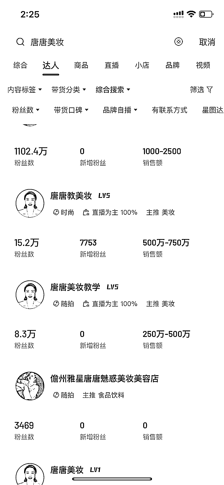
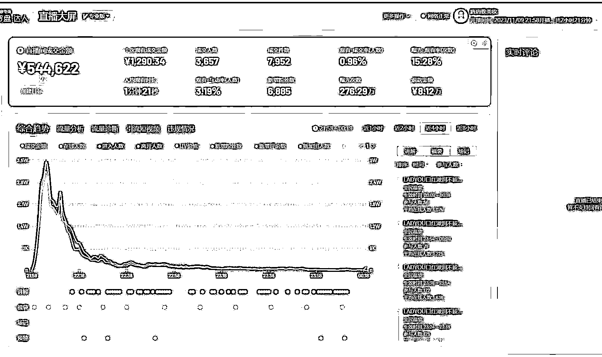
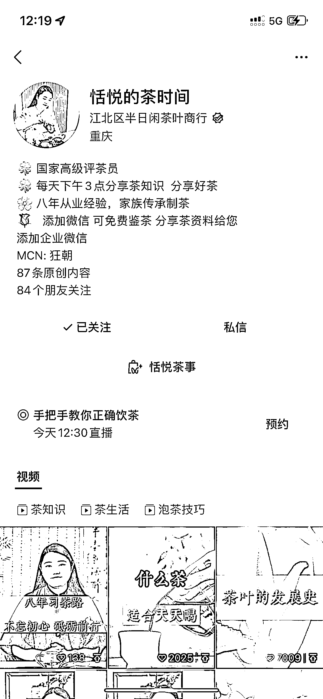
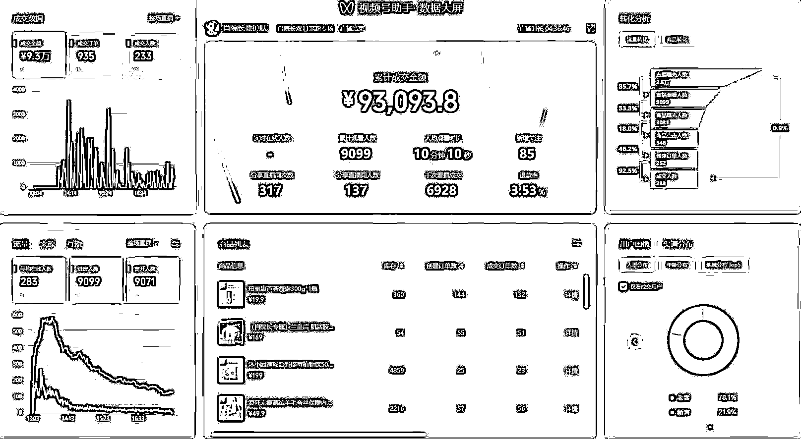

# 十年复盘：星星之火可燎原，狂朝控股的发展之路

> 原文：[`www.yuque.com/for_lazy/thfiu8/xvne8rgdkcbz457p`](https://www.yuque.com/for_lazy/thfiu8/xvne8rgdkcbz457p)

## (精华帖)(730 赞)十年复盘：星星之火可燎原，狂朝控股的发展之路

作者： 盗坤

日期：2023-11-12

这是加入生财有术的 1487 天，创业的第十个年头。

到目前为止，公司总部在重庆，有一层楼的办公场地，二十多个直播间，一百多人。此外，在杭州有一个分公司，五百多平，十个直播间。广州也正在落地一个分公司，也是五百多平，可以搭七八个直播间出来。其他地方的分公司也在谋划之中，整个体系加在一起，一个月数千万 GMV。

就在前几天，一个生财的圈友来拜访我。对方因为生财了解的我，把我的朋友圈翻了个遍，公众号的文章也是篇篇都不落下。此前我会在公众号或者朋友圈偶尔发一些自己个人的创业史和公司的发展，有一年生财有术发起过一个年度复盘主题，我也曾经在生财发过一篇年度复盘贴。

知道我是白手起家，而且是看着我一步一步发展壮大，他很佩服我，视我为榜样。我才知道，原来真的还有人默默地关注着我，把我当成学习的对象。他很想知道，我现在在做什么，发展得怎样了。

我加过很多社群，私董会。但是对外我都把自己当成“生财系”的人，也是发自内心地感谢生财。实话实说，因为公司的发展阶段不一样了，需要关注的问题点不一样了，现在很少有时间看生财的星球了。但是从年入百万到年入千万的那段过程，必须是生财陪伴着我一起进步的，那时候真的是天天刷，很多项目都是来生财搜索检验。而从年入千万到更高阶的过程，也是因为生财让我链接到了更优秀的创业者，是亦仁哥给到了我很多的启发，从而给我打开了新世界的大门。

最近一年多来，公司业务很忙，很少在公众号分享个人和公司的具体发展了。那么今天，作为一个生财系的毕业生，我也想来做一个阶段的毕业总结（我依然还是生财心，生财人）。此前几次，在生财都是单刀直入，直接分享项项目。今天，不聊项目，静下来给大家聊聊我的现状，也对过去做个复盘，希望能给到圈友一些启发。

**一、公司业务架构**

首先给大家聊一下我们公司目前的业务架构。

我们公司是以“狂朝”这个名字为起点展开的。目前虽然还没有注册狂朝集团或者狂朝控股这样的主体，也没有完成公司视觉和名字的变更升级，但是已经事实上按照资产公司控股，各业务子公司具体经营的形式展开了。

**1、狂朝传媒**

目前，最核心的业务板块是狂朝传媒。主要经营两个项目，第一是电商 IP 的孵化，第二是娱乐主播的孵化。电商 IP 涉足于抖音、视频号、小红书、快手等主要的新媒体平台，包括直播主播和短视频博主两类，涉及美妆主播，护肤主播，茶叶主播，穿搭博主等多板块。

我们旗下当下最出色的主播是美妆博主类目的【唐唐美妆教学】和【唐唐教美妆】。纯免费流，纯佣带货的情况下，一个月月销千万，具体盈利画面，大家可以自行脑补。

此外，我们也还有护肤主播，茶叶主播，穿搭博主等多板块博主。当然，从我敢放出来账号这一刻，就根本不害怕抄袭。而且我还要非常认真的奉劝各位，这个赛道难度是真的很大，没有做好亏损几十上百万的准备，没有深刻的行业认知，不要去碰！

除了孵化这些素人博主之外，我们现在也在走另外一条签约路线，那就是直接和已经成熟的博主合作，同他展开电商业务的合作。这条路线就是签约难度大，签约成本高，签约周期长，但是像这种已经具备一定人气，具有很强 IP 人设的博主转型电商就会成功率很高。最近这个月签约的两位博主，都是极具潜力的博主，这种就比我们从素人孵化要简单的多。

除了电商 IP 以外，我们另外一个板块就是娱乐主播了。这个板块就比较简单了，就是通过在直播间连麦 pk，进而获取打赏的模式。这个项目目前的月流水也就是几百万而已，而且最终净利润也就十五个点。

**2、狂朝网络**

狂朝网络的主要业务是直营获客，也就是基于公域获取流量，然后沉淀至私域，由私域销售团队转化，最后再由交付团队完成交付的模型。

这个业务的简单介绍就是新媒体+传统行业。这个子公司的业务，目前尚处于发展阶段，不过我很看好未来的潜力。

此前，我们做过活体宠物猫、健身教练证培训以及其他一些业务（由于有些业务还在做，也没啥壁垒，运营团队还指着这点业务，就不给大家说具体类目了）。不过这些业务都因为行业的各种原因，没有办法做大，天花板太低而作罢（但是我说的活体宠物猫和健身教练证对普通人赚点小钱还是不难的，具体可看之前在生财的帖子 https://t.zsxq.com/14hsDwu6H）。

现在，我们把团队精英都聚焦到了一个类目很大，天花板也足够高的赛道。有着清晰的对标和战略规划（这个也要感谢生财私董会一个朋友商业模式的启发），目前已经基本跑通流程，处于优化流程，搭建团队过程。当然，考虑到目前壁垒还没有完全搭建起来，暂时还得处于一个保密的阶段，不过等我们月流水做到 500 万，全国主要供应链基本搭建完毕，我也会来生财给大家分享的。

**3、狂朝投资**

不管是 IP 孵化，还是娱乐主播，以及直营获客，都是一个人才密集型的行业。而重庆又是一个电商人才，互联网人才极度匮乏的城市，所以，在成熟的人才区域去落地成了必然的选择。

而在重庆之外的地方成立公司，我们采用直营模式，而是以合伙人模式。找到优秀的人才，然后投资入股。如果模式成熟以后，后期完全有机会纯技术入股或者技术+小额投资入股的形式。

狂朝投资主要有三个阶段。第一阶段纯粹是我个人的投资，这个阶段的投资目的、投资范围都不明确，各种业务都有。投资主体也是我个人，前前后后投资了 600 多万；第二阶段的投资是我和朋友一起合伙出资成立公司，用公司主体统一对外投资，风险共担，投资范围也主要是基于狂朝传媒的电商 IP 和娱乐主播业务，狂朝网络的直营业务以及其他互联网业务；第三阶段的投资我们将会同投资公司一起联合运营，用投资公司发布基金的形式募资和运营，我担任投委会主席。目前我们还处于第二阶段，已经初步接触了几个投资公司探讨联合发布基金的可能性。

**4、狂朝科技**

狂朝传媒和狂朝网络都需要很多操盘手和很多主播，未来还需要招募更多区域合伙人。那么 IP 就成了一个撬动人才杠杆的最好选择。

狂朝科技主要是以狂朝创始人盗坤个人 IP 为载体，以培训和社群为工具，背靠狂朝体系下的业务，达到筛选操盘手、主播和合伙人，为旗下公司输送人才的目的。

这条链路也是最近才想明白的，我们的整个社群和培训将会同背后的各业务，同各地的分公司紧密结合。社群成员除了可以享受日常线上的辅导以外，更是可以直接到线下参与“共创”。

举个例子，我们在郑州的某位圈友他孵化出了几位穿搭博主月销百万。但是，他只有一个 90 平米的民房办公区，两个拍摄间，招聘体系也不够完善。能在这么艰苦的环境下，做出这样的成绩，绝对是一位优秀的操盘手。但是他却场地，缺设备，也缺模特。

而我们有些圈友想做博主，他们有执行力，可是不懂怎么执行，线上指导效率也太低。这种情况下，有执行力的主播也可以完全不用管线上的课程了，优秀的操盘手会在我们的线下场地搭建好拍摄间，买好样品，现场指导拍摄剪辑。

这样一来，我们只需要给大家做好项目的选择，平台的搭建，从而可以让大家实现更好的分工合作，提升整体效率，打造一个良好的氛围环境。

**5、狂朝商贸（规划中）**

这是我们规划之中的板块，目前还没有独立出去。

一些发展特别好的板块，所有主播的订单量汇集在一起，可以由我们统一同供应链谈判，获得更好的条件。这是一个可以加深我们同主播关系的同时，还可以给主播带来更好的服务和收益的事情。当然，这也是一个很重的板块，所以如果达到一定体量的时候，我们还是会以物色合伙人的模式，把这个业务独立成子公司去独立运营。

**二、十年发展复盘**

说完我的发展现状，再给大家复盘一下我个人创业史。

初期一些的创业故事，其实我以前写过很多，蜕变和迭代主要是在最近两年，更新少也是在最近一两年。这其中的辛酸细节，也就不再描述。在我眼里，吃苦是没有意义的，苦难也不应该被歌颂。所以我就尽量化繁就简，像编年史一样的做个复盘。

我是从 2014 年大四开始创业的，在 2015 年大学毕业之后开始正式创业。起初的时候，除了一腔热血，什么都没有，成功负债几十万。也很庆幸，很早就摔了跟头，让我从天上掉到了地上，进而沾到了地气，心中梦想也从融资上市，变成希望能尽早月入过万。

总而言之，在经历过一系列失败之后，于 2015 年正式开始做起了淘宝。租了一个没有厕所，没有空调的仓库，自己刷油漆，自己铺地革，揭开了跌宕起伏的十年创业路。

做淘宝的理由很简单，因为看见，所以相信。因为看见大学同学赚到钱，看见学长赚到钱，我也做起了淘宝。可当时年轻，脸皮薄，没好意思舔着脸去找同学、学长求助。成功亏损一整年之后，在年底请学长吃饭，学长告知我应该系统性地去学习一下淘宝运营。

背负几十万债务，身上还剩八万的情况下，花一万块学习了淘宝运营。学完之后，更加沮丧，学的东西就是每天开 3000 直通车，每周刷一千单，弹尽粮绝的我无从下手。不过好在运气不错，没钱打大爆款，遇到一些小爆款，2016 年一整年还是赚了几万。

到了 2016 年年底，翻开屠龙之术《毛泽东选集》，自此懂得“农村包围城市”的概念，命运齿轮开始转动。从此淘宝退出红海战场，进而进入蓝海赛道，开启持续几年的淘宝蓝海之路。

2017 年盈利几十万，2018 年盈利九十多万。期间为了尝试大 V 的感觉，去知乎把自己做淘宝蓝海的经历做了分享，第一篇回答就几千点赞。在收获装逼快感的同时，也给自己成功引来无数对手，顺带冒出无数人求带，在收了几个学员之后觉得太烦，停下了知乎的分享，也停下了培训的脚步。这一插曲，会在那一刻煽动它的小翅膀在第二年影响到我的命运。

2019 年淘宝蓝海盈利 200 多万，培训赚了四十多万。在下半年的时候，一位知乎大 V 酷酷找到我，希望合作做培训，他引流，我负责交付。这之前，我做过培训，一对一电话沟通指导，太繁琐，于是放弃。而酷酷要求我做好思维导图，然后录制好课程，最后再微信群统一答疑解惑。这之前，我收了几个学员都交付到头大。这之后，我应对一两百人，轻松自如。也是在这个时候，酷酷给我推荐了生财有术。

2020 年，在同酷酷合作的同时，自己也开始了引流培训。不过那时候，心里对培训是看不起的，全心全意还是想要把淘宝本身做好。期间，淘宝团队从三四个人拓展到五十多人，盈利水平从 200 多万也就涨到了三百多万，而培训利润有两百多万。

这过程一直到 2021 年，开始发现淘宝蓝海门槛太低，违规太多，天花板难以突破。那个时候，我疯狂在生财找项目，尝试拼多多无货源、天猫无货源、抖店无货源进而是抖音搬运混剪、快手搬运混剪、无人直播、清仓号直播、视频号搬运混剪、视频号无人直播....同步进行的还有 IP 孵化和对外投资这个动作。

这里面有一个很大的转折点就是【生财私董会】，我以前的关注点是项目，而且都是一些不入流很短期的项目。但在里面，我发现几个真正赚大钱的人是走的正大光明的“正道”。我的认知也升级到了，从看项目到看人，我知道，我要去看看这些真正年赚千万，数千万，几亿的人是怎么赚钱的。

自此，从生财私董会开始，我陆陆续续花了接近一百万加入各种社群、私董会。这个改变对我太重要了，我才真正理解到视野的重要，选择的重要，团队的重要，文化的重要...

于是，我从一开始的浅尝辄止到彻底转型，2022 年完全放弃淘系无货源，天猫无货源业务。2023 年，完全放弃搬运混剪，无人直播等业务。公司也从封闭孤立的自运营政策，变为投资，孵化的开放合作模式，自此，公司进入发展新阶段。

这期间，公司搬了很多次的办公场地。到了 2023 年，因为业务发展需要，我重新租了一层楼，1800 平，自己重新装修的格局。

**三、一些心得总结**

1、创业就是把自己最擅长的地方发挥到极致，在不擅长的地方学会合作。

我在创业初期的时候很独，公司没有任何股东或者合伙人，什么都喜欢自己大包大揽，很累也很低效。而我现在每个子公司都有 1-2 个合伙人，我只需要给他们定方向，搭平台，聚人才，具体的落地、管理全部是由他们自己执行，这就很好的实现了能力互补。

就比如我这个人性格很江湖气，讲义气。这个性格本身没有好之分，这个基因也深刻地传播到了我的社群里，是一个很有特色的点，但是具体到公司经营，带团队的时候这就不太适合了。而现在则是由具体的合伙人做好内部细节管理，我的江湖义气在大方向给团队以凝聚力即可，这就非常的融洽！

2、人生最重要的能力就是决策能力。判断哪条路靠谱，哪些人靠谱是人生最大的学问。

我现在常常讲，做流量的能力不值钱，把流量赋能给哪个项目的选择才值钱。其实大多数人在做决策之前，但凡有点起码的调研就会发现有的项目有流量但变不了现，能变现但不赚钱。会做调研，可以让人少走很多弯路。

很多人现在吐槽生财的信息太多太杂，里面割韭菜的太多。但凡你有点基本的调研，很多韭菜项目都能被你避坑。

我就举个简单的例子，此前我在知乎看到一个回答说自己做除甲醛能年赚几百万。你但凡稍微分析一下，假设按平均客单价 3000 来算，一年就算是营收 360 万的情况下，也就是单月要做到 30 万营业额，一个月就要 100 单。成交一百单，你知道需要加多少微信吗？需要多少销售吗？需要多少工人去交付吗？你就按这个去细细推敲一下，同对方沟通一下，你就能判断出个大概了。

同理，那些真正赚钱的项目，稍微去调研一下，你也能发现他是否真的赚钱。比如我开头说的【唐唐美妆教学】，销售额多少能查到的，流量全是免费流也能查到的，接下来的佣金率可以自己去精选联盟找人问，再按一个夸张的退货率来算，能赚多少钱，自己心里也就有数了。

我此前浪费了很多的时间，皆是因为做错了决策。现在回想一下，当初要是稍微认真调研，仔细推演一下，根本就不会做出那样昏庸的决策。

而且动作不坚定，是因为认知不够深刻。一个人，对一件事的坚定程度，跟他对这件事情的认知深浅有关系，跟思考的深度有关系。对事情的思考越透彻，认知越接近于本质，他的决策就越果断，执行就越坚定。你在调研的过程就是对事物认知越清晰的过程，认知越清晰，你的执行越彻底。

3、有能力的人很多，有机会的人很少，把握机会的能力本身就是很强的一种能力。

我今年 30 了，大家都喜欢说三十而立，把三十岁作为一个人生节点来划分。回过头来看，其实大多数人三十岁的结果，早在大学毕业选择第一份工作那一年，又或者二十五六岁你转业那一刻就决定了。

你大学毕业第一份工作是银行，不出意外的情况下，在 30 岁的时候你就是一个大客户经理，或者某中台后台工作。你中途转业大概率也是去什么期货、证券、信托等行业。

我虽然才 30，但大概率感觉有可能是这么一回事的。人这一辈子，大部分时候都是在无聊枯燥中等待的，关键的节点就那几个，那几个节点冲过去了，人生也就跃上了一个新台阶。这也就是大家常常说的，男人成大事就那么几年。

刘邦平庸了大半辈子，48 岁出来创业，7 年就 IPO 了。伴随着刘邦的 IPO，丰沛那帮老兄弟也都从平凡人成了开国功勋。你说全天下最有能力的就丰县，沛县那群人？

有能力的人很多啊，有机会的人很少。而机会不是常常有的，可遇而不可求那才能叫机遇。

自己创业吃过苦，所以以前我都会劝大家保守，保守再保守。但是现在我发现，贫穷就是一个陷阱。你越穷，就越需要省钱，越省钱就越不敢冒风险，就越想稳定，就越抓不住机会。

所以我现在遇到一些有想法的人，也会保护他的“勇气”，在风险不对称的情况下鼓励他去试试。你比如说，你有三十万的存款，要去干一百万的事，我劝你保守。但是你有三十万存款，用几千块钱的试错成本，几个月的试错周期去博一个可能得未来，我鼓励你勇敢。

能赚钱的事一定是有不确定性的，有确定性的是银行利息。接受不确定性，也是在接受机会!

一不小心码了挺多字，码完以后还觉得挺枯燥无聊的，也就不再继续码更多字打扰你们时间吧。其实没有真正去经历过，我的分享也就无法感同身受，还真就是寡淡无味。

最后，给大家送一句挂在我办公室话：“时间是最大的壁垒。”没下牌桌，就有机会。你这一生，最好的作品就是你自己。最好的长期主义就是以时间为尺度，经营好你自己。祝大家都生财有术！

* * *

评论区：

B2 : 先赞后看
易生 : 生财系
金又又 : 坤哥牛逼
蠢小二 : 很受益谢谢坤哥
大伟 : 在生财见证了坤哥越做越大，牛
张一见 : 坤哥太强了[强]
青岛大尧 : 感谢坤哥，看完热血沸腾
东哥 : 做流量的能力不值钱，把流量赋能给哪个项目的选择才值钱。

* * *