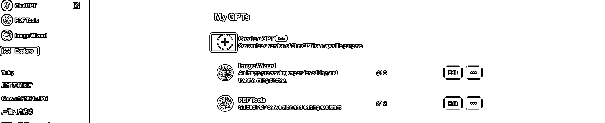
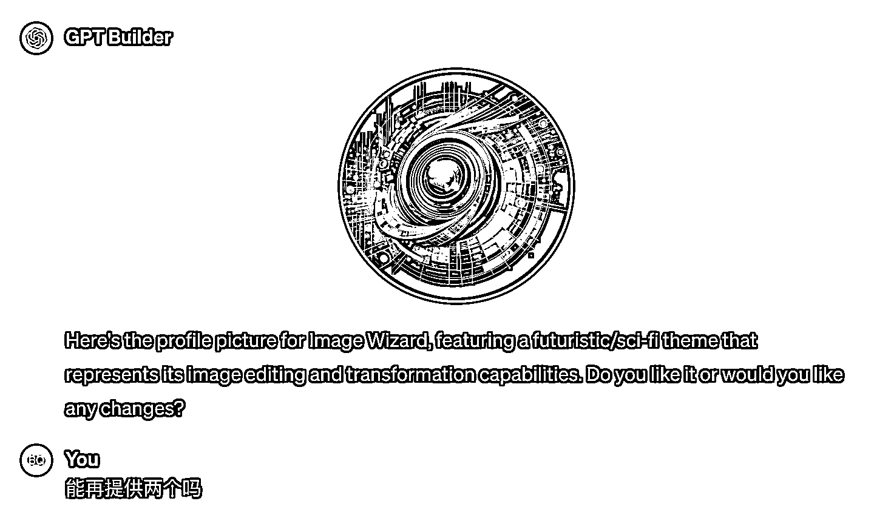
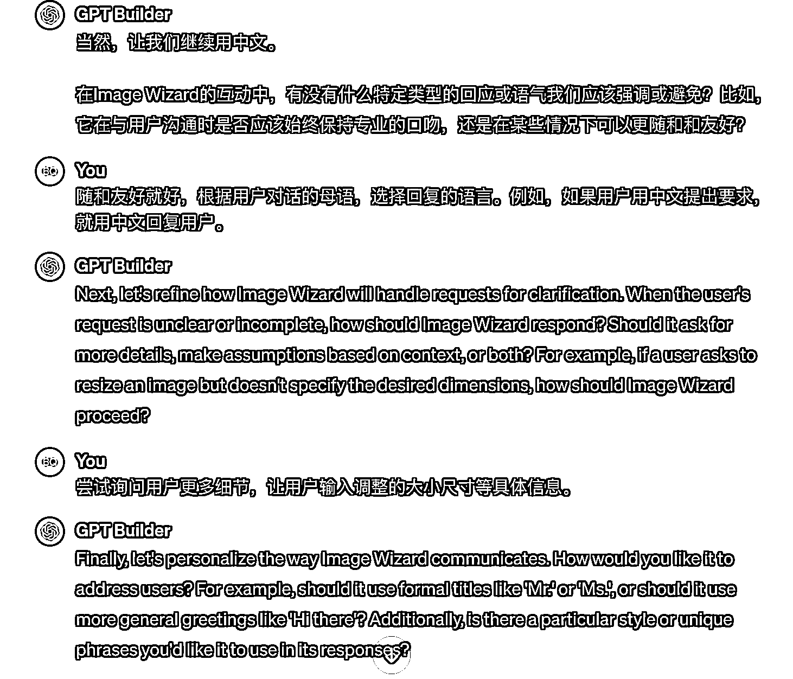
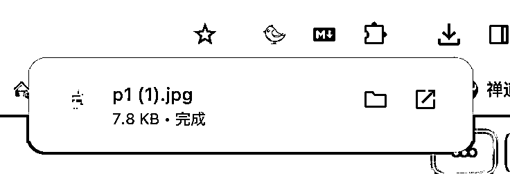
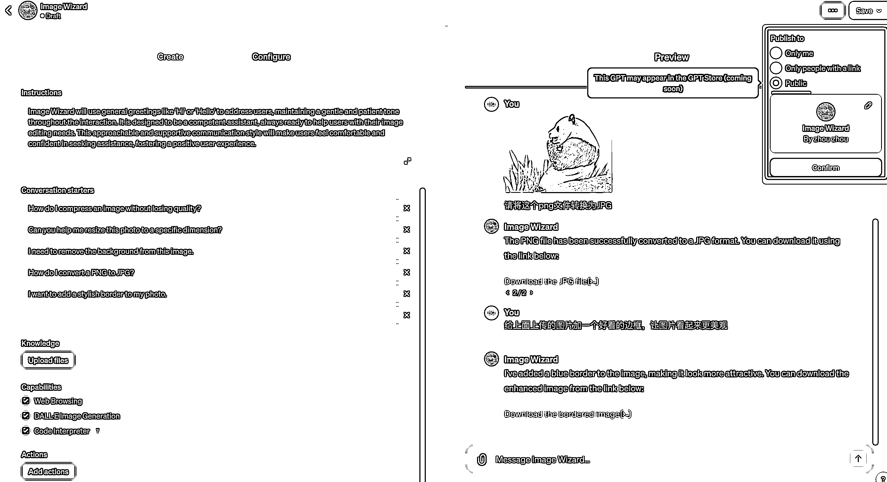
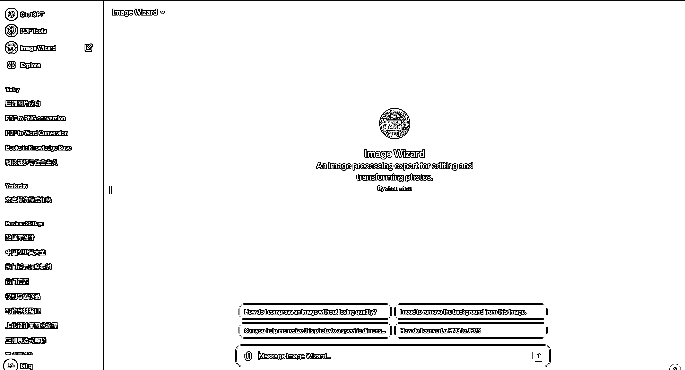

# Gpts 制作教程，太炸裂了！聊聊天就做一个 app

> 原文：[`www.yuque.com/for_lazy/thfiu8/dums23vk42yg3adc`](https://www.yuque.com/for_lazy/thfiu8/dums23vk42yg3adc)

## (32 赞)Gpts 制作教程，太炸裂了！聊聊天就做一个 app

作者： 邱比特

日期：2023-11-13

周末体验了一下 OpenAI 的 Gpts，从构思到发布，1 个小时就做了两个 Gpts！确实很炸裂！

下面是其中一个 Gpts（Image Wizard）开发过程的截图。

## ***1/体验前提***

1、能科学上网

2、开通 ChatGPT Plus

## ***2/操作流程***

1、登录 [`chat.openai.com/`](https://chat.openai.com/)

2、点击左上角 【Explore】后，在点击【+】。如下图

3、点击加号后，ChatGPT 会询问我们需要创建什么样子的 GPT,用普通话描述你想做的产品的需求即可。

4、ChatGpt 会根据我们的描述给 GPT 起个名字，并征求我们的建议，我这里直接使用。

5、接下来，ChatGPT 会给我的 GPT 设计一个产品图标，我感觉不太满意，让它继续给我生成两个。

这里生成了两个新的，并解释了每个设计思路，我选择了第一个方案。

6、图标确定之后，ChatGPT 还会继续引导我提出一些细节的东西。

这里，我看不懂英文了，让它翻译成中文，再继续！

6、到此，基本聊完了。

前面的聊天都是 Create Tab 下进行，我们切换到 Configure Tab，我们发现 ChatGpt 基于我们的聊天，生成了指令和 【Conversation starters】（应该是刚开始聊天的提示），先不管他。

7、测试一下，上传一张 PNG 照片后让它转成 JPG,结果告诉我转换不了。

why？原来我没把 Code Interpreter 选上，因为我现在让 GPT 做的事情，都需要用代码去实现，所以勾选 Code Interpreter，再重新转换，就可以下载了。

8、简单测试了一下好用，先去玩一下发布。

点击右上角，选择 Public，点击 Confirm。

发布成功后的效果如下:

我们正式用一下，选择最后一个【How do I convert a PNG to JPG?】

结果并不是我想要的，我是想直接转换而不是询问如何转换。这样我们就搞明白了【Conversation starters】是什么东西了，就是我们预置的一些对话需求。

接下来我改下已发布的 Gpt，按下图的指引，点击 【Edit】 即可。

我按我的需求，重新改了一下【Conversation starters】

修改后，点击右上角的【Update】就重新发布了。同时会给我们生成一个查看新版本的链接。

发布后的效果如下：

接下来就可以根据自己需求，对图片进行处理就可以了。

上面基本把制作、测试、发布和发布后修改的流程通过截图都记录下来了。

写的有点乱，大家有问题随时联系我吧。

另一个是 PDF Tools,不过制作的时候忘了截图，放一个使用的截图，体验一下吧。

这个工具支持 PDF 编辑（压缩、分割、合并、提取文字、图片）、转换(PDF 与 word、excel、PPT、图片相互转换)，每次转换失败，会继续重试，最多重试 5 次。上面的使用案例是 PDF 转换为 PNG,并把前 10 也合并到一张长图中。

我把今天制作的两个 Gpts 链接奉上，欢迎测试！

[`chat.openai.com/g/g-EHDAUdd1z-image-wizard`](https://chat.openai.com/g/g-EHDAUdd1z-image-wizard)

[`chat.openai.com/g/g-QBod6nsRb-pdf-tools`](https://chat.openai.com/g/g-QBod6nsRb-pdf-tools)

* * *

评论区：

盟主君 : 试用了两个工具，貌似效果不太好，不能输出任务结果
邱比特 : 晚上我再调调

* * *