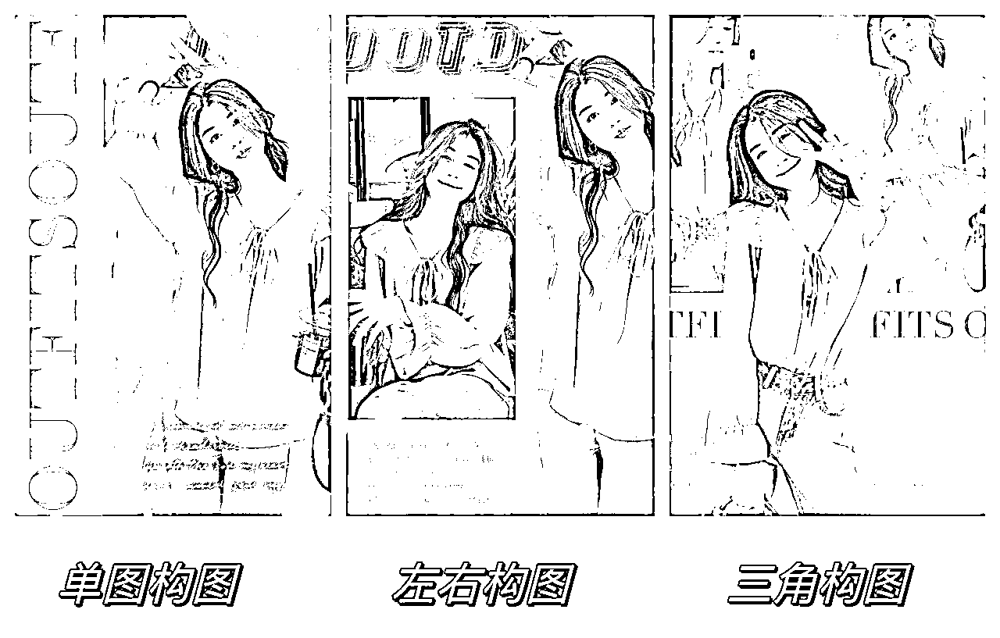
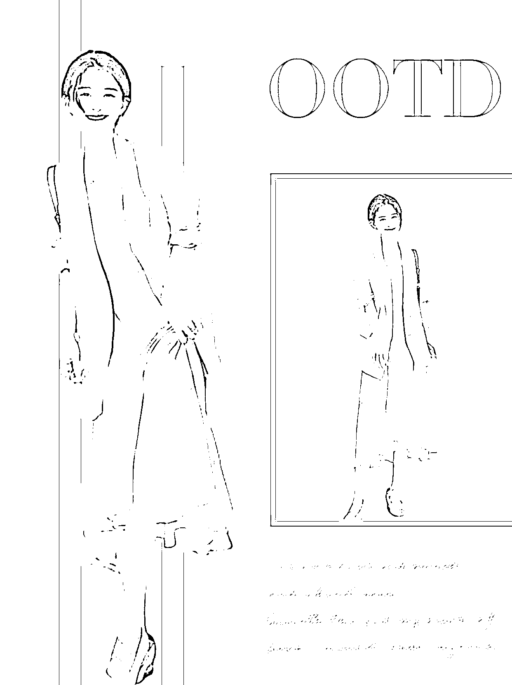
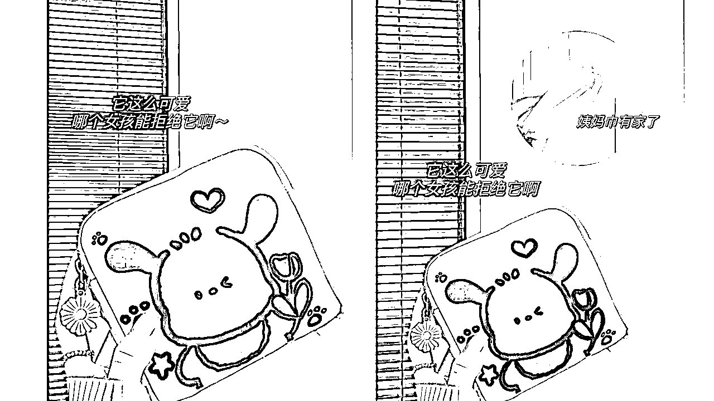
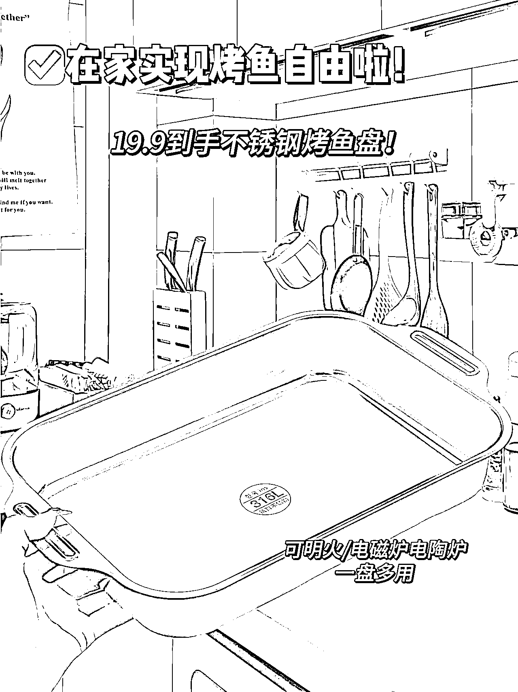

# 抖音图文带货丨如何做好图文素材的处理与去重

> 原文：[`www.yuque.com/for_lazy/thfiu8/swrrk7x623rb0yek`](https://www.yuque.com/for_lazy/thfiu8/swrrk7x623rb0yek)

## (46 赞)抖音图文带货丨如何做好图文素材的处理与去重

作者： Autumn

日期：2023-11-16

大家晚上好，我是袅袅。
目前多账号做抖音图文，覆盖的品类包括女装、童装、零食、家清个护。

今天主要分享【服装、家清个护的图文制作思路和方法】，以及【零食图文的去重思路】。

航海中目前做服装赛道的圈友比较多，除了抠图换背景图的方式，我自己喜欢用一些【纯色背景】做模板，以下是一些作图实操经验。

1、纯色背景较为单调，可以用【线条特效】丰富画面，排版简约清新。

2、模特图抠图进行【透明度处理】做背景，增加图片层次和空间感。

3、用【色块组合】做背景图，【产品图叠加】做空间错位，大量贴纸增加视觉效果。

4、配色思路
（1）【同一种颜色调整颜色亮度】进行组合搭配。

（2）没有配色思路，就【吸衣服颜色】做背景色。

5、有些服装更强调场景，氛围，不适合纯色背景呈现。
如果找不到合适背景图，可以将【自己找的背景图做部分虚化处理】，视觉上融合度更好。

下面是实操的视频，时长 5 分钟左右，适合对美图秀秀功能不太熟悉的新手观看。

（1）单个产品：控制产品图在整个画面的占比空间，留出足够的空间，用【细节图、场景图、文案增加首图】的信息密度。

（2）多个 SKU 或者多色选择的产品：画面排版可以用左右构图或者上下构图的方式呈现信息密度。

（1）背景选择：除了强调场景的产品，如厨房用品等，其他产品我更倾向于选择【干净、色调舒适】的背景图。

（例：左图背景颜色太多，右图干净的背景更能突出产品质感）

（2）产品素材：不在素材上浪费时间，能截图就截图，多做几次画质修复就能解决清晰度的问题。对标账号产品足够清晰的话，直接抠图用 Wink 修复画质，去水印直接用。

（3）文案：直接用对标的文案，避免过于花哨的花字，多行字排版调整行间距更美观。

零食赛道是最卷的赛道之一，跟其他赛道换背景去重的思路不同，零食赛道大多【背景即产品】。

以下是是我日常处理零食主图的一些实操方法，希望能给大家提供一些思路（抱歉各位，今天感冒了，嗓子哑了，录了几次效果都不好，我加了字幕，还有疑问可以群里艾特我）。

以上是我作图及去重的实操分享，希望能给大家提供思路。最后，电商选品才是王道，作图只是锦上添花，有基本的作图能力即可，希望大家在航海中都有一个不错的结果。

* * *

评论区：

暂无评论

* * *