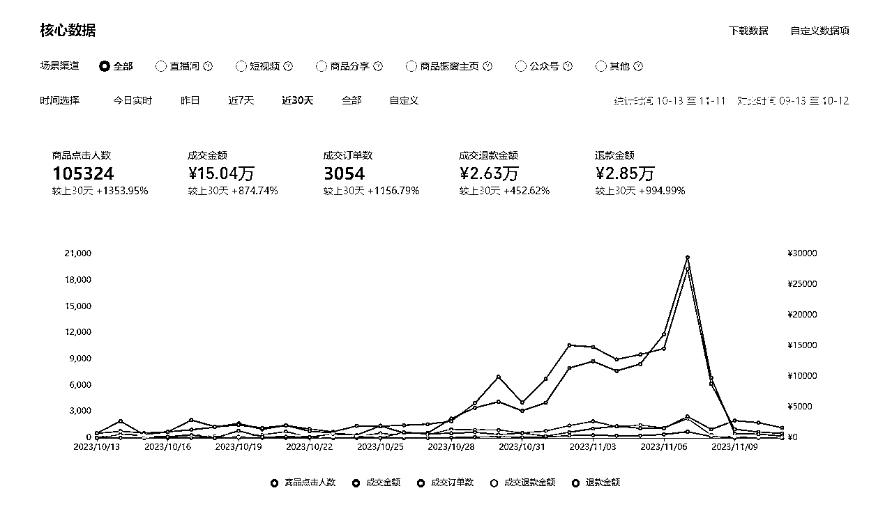
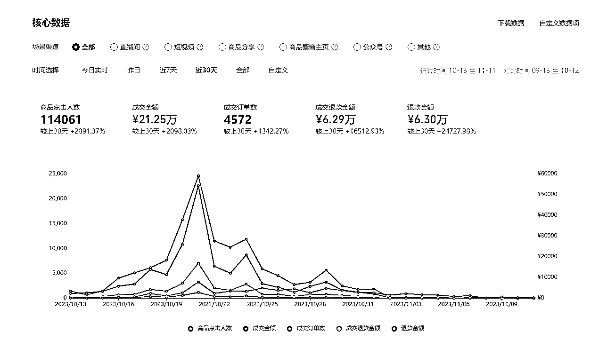
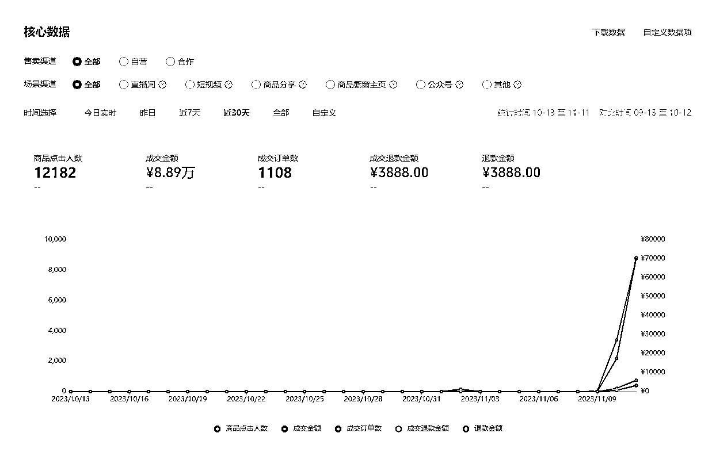

# 视频号小店月入 10 万实操心得及方法

> 原文：[`www.yuque.com/for_lazy/thfiu8/yrbf0lh4per2pcgt`](https://www.yuque.com/for_lazy/thfiu8/yrbf0lh4per2pcgt)

## (39 赞)视频号小店月入 10 万实操心得及方法

作者： 潇洒哥

日期：2023-11-17

大家好，我是潇洒哥，今年三月加入生财的新人，今年七月份第一次发帖有幸被评为精华帖，也给了我很大的鼓励，上篇帖子具体可以移步我上次分享的链接 [生财新人从抖音亏损到转做视频号利润 50W+心路分享](https://paqni5a8o81.feishu.cn/docx/JmC4dzdc1omOl3xZ7RNcjXr7ncg?from=from_copylink) 。最近几个月一直忙着店铺的事情也很久没有来生财了，其实早就想分享了，但是一直没时间，趁着最近周末比较空闲一点，也很久没有梳理前段时间的经历了，也借这次分享顺便给自己复盘一下。今天给大家带来的分享主题是从 8 月份视频号小店全部被永久封禁，到 11 月份视频号小店做到月入 10 万实操心得及方法。下面是最近一个月有销售数据的店铺截图，除去退款总的有效销售额 50W 出头,毛利控制在 20%左右，有一部分产品利润在 25-30 之间，总毛利润在 10W 出头，勉强做到月入 10 万吧。

查看全文请移步飞书：[`paqni5a8o81.feishu.cn/docx/TJqudHwrRoI1kVxi8tOcAqC9nRc?from=from_copylink`](https://paqni5a8o81.feishu.cn/docx/TJqudHwrRoI1kVxi8tOcAqC9nRc?from=from_copylink)

* * *

评论区：

雄 : 于总 YYDS
添奇 : 兄弟留个微，链接一下
新世界 : 厉害 666
潇洒哥 : hbutacm
川少少 : 于总 YYDS
刘成 : 于总帅气
anyun : 写的很好

* * *