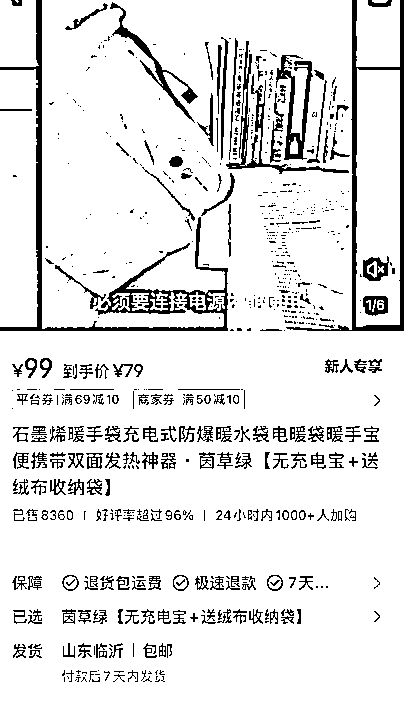

# 11 月小红书电商思考

> 原文：[`www.yuque.com/for_lazy/thfiu8/ysngz3mswuxxymp8`](https://www.yuque.com/for_lazy/thfiu8/ysngz3mswuxxymp8)

## (36 赞)11 月小红书电商思考

作者： 曜文

日期：2023-11-17

大家好，我是曜文

近期小红书又开始整治社区很多做无货源的小伙伴又收到大批量的限流，于是就和大家来聊聊我们目前小红书电商运营的一些思考和我们对于未来发展的方向

小红书自从开始了电商之路首先就账号导流给封了一批又一批再到后来的无货源封店限流再到这个上个月底这个月初的混剪同质化大量的限流封号

那么我觉得这其实是符合小红书平台的调性的，平台想要做优质的分享内容并且开始商业变现，逼着用户去充钱开户去投流，不花钱，不产出优质的内容就没办法在平台生存，首先淘汰的是白嫖小红书精准流量的，有做过小红书的都知道小红书的用户消费能力强，推送精准，在今年 2 月份小红书为了补充内容和带动电商，随便发内容都有流量随意混剪也给推流，去带动电商销量，于是就出现了大量的矩阵账号搬运混剪

后来，平台又想对货源筛选，又淘汰了一批不找货源直接电商代拍的用户，再到现在的低质混剪内容处罚

我个人觉得是一件好事，只是做小红书的门槛提高了一点，相反随着门槛的提高，用户的运营水平也是会不断成长的

比如，对于内容输出的提升，对于拍摄技巧的提升，对于商家沟通供应链的理解，逼着商家去成长，打造成“全能选手”

当然对于我这种白嫖好几年小红书流量的我也随着平台的改变去做出一些运营的升级

下面就来聊聊我对于未来小红书的一些看法希望能给大家带来一些思路

**1.未来新手入局小红书**

我觉得可以从选品去入手，从实时几天热度的产品，转换为 2-3 个月的热度产品，从爆款选品转变为兴趣选品

怎么理解呢？

在做小红书的时候，本身平台和其他平台就有时间差，热度刚出来的时候去选品，自带流量的，有了流量就有销量，如果这个时候去大量的混剪放在以前爆单率还是很高的，但是如果混剪去重能力低，被发现个几条，基本就直接限流，所以新手去重能力不高的情况下，就没办法及时的抓住热点，所以需要转变为 2-3 个月的热度产品，一来自己可以做实拍，二来产出的素材都是原创的根本不会违规限流。

举个例子：

这个产品是在 10 月底的时候出现的，到现在销量 8000+这个销量大概是在近一周左右暴涨的，而且账号只需要一个样品不断的换场景和文案拍摄就可以，这就对新手比较友好，而且利润不低，能做到大概过年前，这种品就属于是 2-3 个月的热门品

思路延伸一下：

类似的品可以延伸出很多的，或者从某音就能找到去年爆过的品，然后来做实拍抓住机会，是想一下，这种品是否还可以延伸出很多类目？比如：水果，数码类，摆件类...太多了

那，如果自己是源头或者自己对某个产品感兴趣并且想深耕某个赛道，那通过电商来变现是绝对可行的。

**2.未来个体深耕小红书**

如果自己没办法实拍，混剪去重能力不高，可以找到合作方一起来做这件事情

我们可以找到一些大学生或者对于拍摄有点技巧或兴趣的人来合作，把店铺的利润拿出来分给对方，对方只需要按照我们提供的模版和内容进行拍摄回传就可以实现解决素材导致店铺违规的这个问题。

当然，找个兼职来拍也是可以的，但这个过程可能需要不断的筛选，但利润分成的方式我觉得更适合

因为有着共同利益，只不过分工不同，双方也会更为上新并且主动去迭代优化

当然，这也不是说不是原创的素材不能做了，可以做，目前 live 图还不会违规，但是考虑到时间成本和长远发展来讲，直接上实拍流量更好，也能批量的产出和开店。

就像我们近期合作的方式把项目分为 3 人一人负责素材，一人负责文案内容，一人负责店铺维护

3 人可以同时的产出 5 家店以上的素材

**3.把小红书电商看成一件简单的事**

不要想着做对抗平台规则的事，而是应该思考如何做出相对优质的内容来获取平台的推流

例如：

平台不让混剪，那就做实拍，平台不让无货源就找商家对接手动打单，商家不让引流私域就在平台成交。

电商的出单大部分还是在笔记

笔记的组成就是图片或视频在配上文案

原创不会就跟着爆款来，做到 1:1 的参考优化就可以，这样事情就简单化了...

然后再增加一个步骤来分析选品，找到能够做 2-3 个月甚至以上的产品类目即可。

相信体验过小红书爆单的一定知道小红书流量有多香

也相信只要坚持做优质的内容就一定能爆单，并且持续有回购！

以上是我对小红书的一些思考和未来和我们正在做的一些事，希望能给各位操作小红书电商的小伙伴们带来一些启发和思路。

* * *

评论区：

暂无评论

* * *