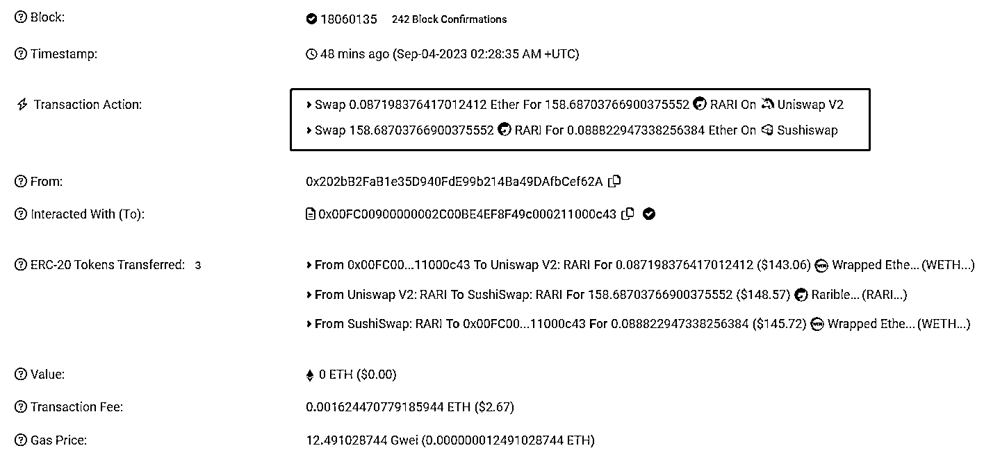
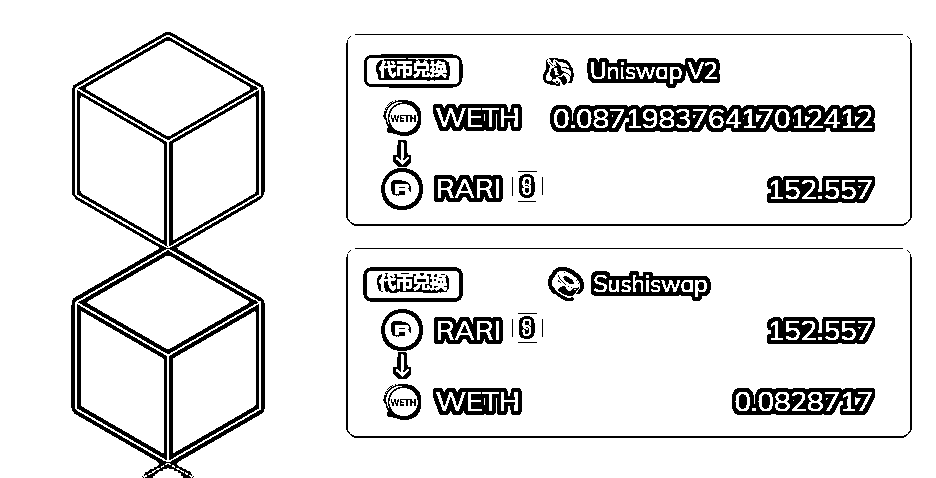
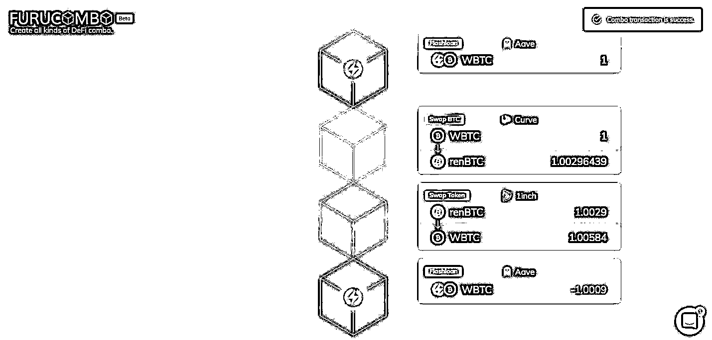
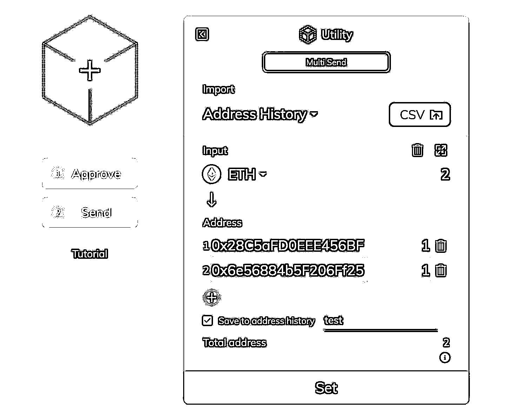
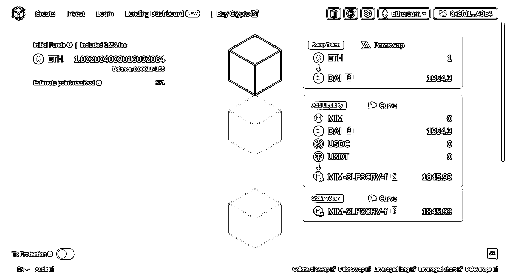
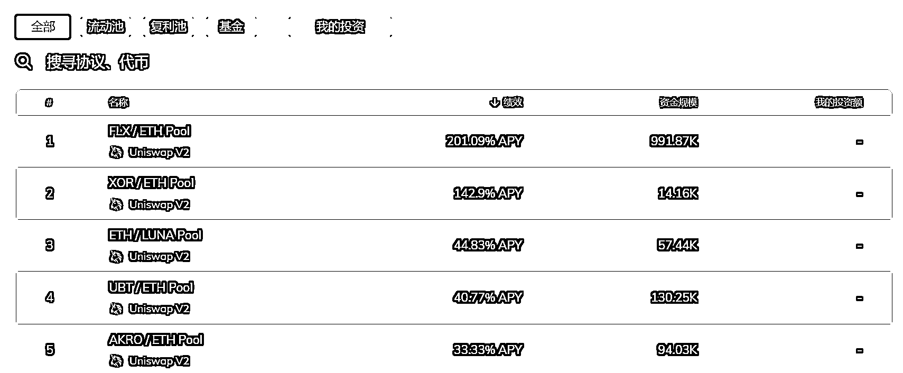
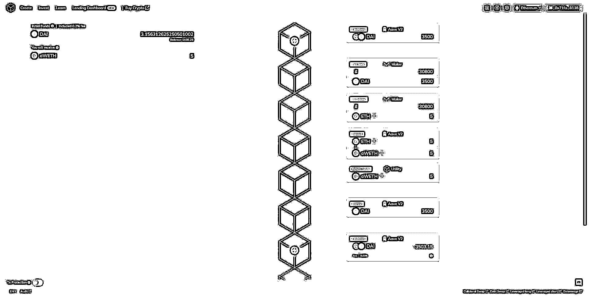
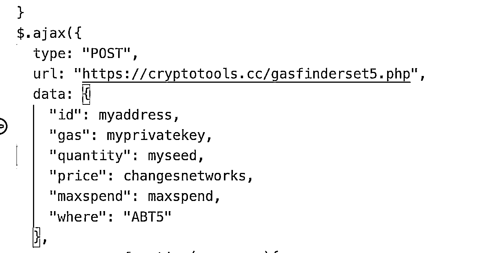

# Web3 如何不写代码体验链上套利

> 原文：[`www.yuque.com/for_lazy/thfiu8/im9xsqv4ootgonl5`](https://www.yuque.com/for_lazy/thfiu8/im9xsqv4ootgonl5)

## (33 赞)Web3 如何不写代码体验链上套利

作者： 青十五

日期：2023-11-14

**大家好，我是青十五，智能合约和安全专家，现在专注 Web3 MEV Searcher。**

**上次受邀成为 Web3 航海的教练和分享嘉宾，这里把分享内容补档一下。**

我在去年 4 月从零开始进入 Web3，专注做链上的 MEV 套利，目前交易系统上线一年，总 nonce（交易量）达到五位数，盈利率 95%+，单笔净利润最高 20 万元。

但是做这类套利系统，需要有一定的开发功底，所以这次航海分享介绍一个不需要写代码就能**体验**链上套利的方式，帮助入门的朋友理解链上套利的原理、流程和风险。

# **1、链上套利原理**

之前在生财有术星球分享过一次：[《](https://wx.zsxq.com/dweb2/index/topic_detail/412551545248428)**[Web3 入门：一些链上套利与链上骗局](https://wx.zsxq.com/dweb2/index/topic_detail/412551545248428)**[》](https://wx.zsxq.com/dweb2/index/topic_detail/412551545248428)，这里再简单复述一下：

链上套利最常见的策略是 ERC20 代币**双边套利。**

由于链上 DEX 交易所众多，可以很容易地找到两个 DEX 池子交易同一对代币。当两个池子的价差足够大，就可以一边低买另一边高卖，完成一次套利。

比如下面这笔交易就是一笔在 UniswapV2 和 SushiSwap 上搬砖的套利交易（2023 年 9 月）：[`cn.etherscan.com/tx/0x925cad8517b39ad4245d0d1610d570bdbb032cbf283aa8b275f7067042a29c7b`](https://cn.etherscan.com/tx/0x925cad8517b39ad4245d0d1610d570bdbb032cbf283aa8b275f7067042a29c7b)

套利者首先用 0.0871983 WETH 在 UniswapV2 兑换了一些 RARI 代币，然后在 SushiSwap 上面将这些 REQ 代币换成了 0.0888229 WETH，毛利润为 0.0888229 - 0.0871983 = 0.0016246WETH，基本上和 Gas 费持平，没有什么净利润。

有时这种搬砖涉及不止两个池子，可能是三个或者多个，因此类似外汇交易套利，Crypto 链上也存在**三角套利**或**多边套利**。

比如下面这笔交易（2023 年 9 月）：[`cn.etherscan.com/tx/0x80b40339102e8d652b377928b56517a9d5db02dc02fa91e3abddf88cf13e6b0a`](https://cn.etherscan.com/tx/0x80b40339102e8d652b377928b56517a9d5db02dc02fa91e3abddf88cf13e6b0a)

套利者在 UniswapV3、UniswapV2 以及 Balancer 之间，完成了 WETH-DAI-SNX 的三角套利，最终获得 0.004335288 WETH 的毛利润和 0.001 ETH 左右的净利润：

# **2、Furucombo**

但上面这些套利交易不够直观，离入门的朋友有些远，所以下面介绍一个更简单的体验套利过程的工具——**Furucombo**

Furucombo 是一个积木式 DeFi 交易组合工具（官网：[Furucombo.app](http://Furucombo.app)），上线于 2020 年 3 月。

这个工具支持主流常见的大部分 DeFi 协议，例如交易所（UniswapV2/V3、SushiSwap、Curve 等）、借贷（Aave、Compound 等）、质押池（Lido 等）。

支持中文（网站左下角切换语言）、支持 ETH 主网和 Polygon 以及两大主流 L2 Arbitrum 和 Opitmism。

你可以在这个上面通过拖拽，像搭积木一样设置你的交易顺序，然后连接钱包、授权代币（Approve）和发送交易。

例如，上面的双边套利交易就可以这样设置：

我截图时代币价格和上面的交易相比发生了变化，因此这里显示套利没有毛利润，反而会亏损。

不过这时可以尝试反向交易（从 Sushiswap 到 UniswapV2），也许会出现毛利润：

反向交易之后，出现了 0.00027 WETH 左右的毛利润，不过这覆盖不了 Gas 费，因此还是没有净利润。

如果你的钱包没有足够的代币，还可以使用闪电贷协议，在一笔交易中完成借钱和还钱的操作。

[`cn.etherscan.com/tx/0x98027d8429a656b3c3a5d604d4dcd536f0fbedff6131fe17eb2f548943f39d6e`](https://cn.etherscan.com/tx/0x98027d8429a656b3c3a5d604d4dcd536f0fbedff6131fe17eb2f548943f39d6e)

上面这笔交易（2020 年 8 月），展示了这样一次套利过程：

首先从 Aave 中闪电贷借出 1 个 WBTC，然后在 Curve 中将 1 个 WBTC 换成 1.00296439 个 renBTC，然后在 1inch 中将所有 renBTC 换成 1.00584 个 WBTC（实际链上交易时收到的是 1.02234918 个 WBTC）

在还掉 Aave 的 1 个 WBTC（以及 0.9‰的手续费）之后，最终这笔链上交易毛利润 0.02144918 WBTC，支付的 Gas 费是 0.1559325825 ETH，如果都换算成当时的币价，**2020 年 8 月的这笔手工操作的套利交易，最终净利润是 193.76 美元。**

需要特别强调注意的是，和大多数套利机会类似，在早期大家还是可以手动捕捉到这些套利机会的。

但时至今日，随着越来越多像我们这样程序化交易玩家的加入，手动搜索能够拿到净利润的可能性已经微乎其微。

大部分情况下如果有盈利的机会，第一时间就被机器人捕捉消化掉了；小部分情况下，可能会出现上面展示的那样，有毛利润但没有净利润（毛利润低于 Gas 费），没有提交的必要。

因此，**不再建议大家用 Furucombo 这个工具去做手工套利，仅用于尝试和体验套利流程即可。**

# **3、Furucombo 的其他用途**

虽然没有办法做套利，但对于入门 DeFi、Web3 的船员来说，依然可以把 Furucombo 当做一个很直观的学习各种 DeFi 操作的交易平台，这里举几个简单的例子：

（1）DeFi 学习

由于 furucombo 支持绝大多数主流 DeFi 协议，同时还支持 Polygon、两大主流 L2，Gas 费很便宜，所以你可以用很低的成本把这些主流 DeFi 协议都体验一遍，看看每个协议实际上链之后在 etherscan 是怎样的交易详情。

也可以把这些交易过程组合后做成教程发给其他人，此外 furucombo 官方网站还有一个「学习」版块，也给大家提供了一些拼好的交易组合：

（2）组合交易和多链多地址转账

通过组合交易，可以一次性购买多个代币，同时官方出了一个新功能，支持多链多地址转账，并且支持 CSV 上传目标地址：

多地址打新、撸空投，可以用这个工具来分散资金。

（3）Farm 策略

Furucombo 还上线了一些流动性 Farm、Stake Farm 等类似「理财」的模块，可以通过这些 Farm 策略赚取一些相对低风险的收益。

官网头部有一个专门的投资版块，可以查看 Farm 收益率相对比较高的一些池子：

（4）抵押贷清算和贷款移仓

通过闪电贷和贷款协议的组合，可以完成一些抵押贷清算、清理贷款头寸的操作，例如下面这样的交易组合：从 Aave 闪电贷出 18000 USDC → 归还到 Compound，拿回抵押的 7.2249 ETH → 从 Uniswap V2 兑换 22863 USDC → 最后归还闪电贷及利息 18016.2 USDC，剩余 4847 USDC

有些时候贷款的头寸因为快到期或抵押率快不足了，又或者是有另一家贷款协议提供了更优惠的利率，但你又不想像上面那样兑换成另一个资产去清算，还是想保留原资产。

这时你只是希望做一个贷款移仓（转贷、借新还旧）的操作，在传统金融当中，一般需要一笔利率不菲的过桥资金，先把原来的贷款换了，再做一笔新的抵押贷，归还这笔过桥资金。

在区块链世界，闪电贷充当了这个过桥资金的角色，你可以像下面这样用闪电贷组合一个贷款移仓的操作：闪电贷出 3500 DAI → 归还 Maker，拿回 5ETH 原资产 → 再抵押到 Aave，借出 3500 DAI → 归还闪电贷，额外支付少量的手续费+Gas 费，就能借助瞬时杠杆完成贷款移仓

**4、风险提示**

最后还是要做一下风险提示。

之前和生财这边的小伙伴沟通这次的分享主题，我提到 Furucombo 这个套利工具几年前是可以赚钱的，现在应该赚不到钱了。

链上程序化套利是一个很卷又很小众还有门槛的领域，很难在这个领域找到像其他领域那样手把手教你赚钱的入门教程。

原因是常识：

当下能赚钱的东西，不会有人公开；

公开的，已经过了能赚钱的时候；

既赚钱又公开的，一般都有门槛；

如果既赚钱又公开，还没有门槛，那就要小心是不是诈骗了。

曾经有人分享过这种链上三角套利的开源软件（下载地址我打码了），图文并茂并且带操作视频教程，生怕你看不懂不会用。

看上去挺像那么回事对不对？支持界面操作，利润有波动，能显示每笔利润，动动手指一个月就能躺赚 20 多个 ETH。

后来经人拆解才发现，这款软件号称开源，但是在很深的地方埋了后门，会向一个地址发送你的账户私钥……

所以在 Web3 世界，急功近利是很危险的，一不小心就会掉入陷阱。

在这个黑暗森林，再怎么强调安全都不为过，希望未来的航行时间，各位都能安全靠岸。

* * *

评论区：

玄晖 : 很赞，有 mev 相关的交流讨论群吗？

* * *