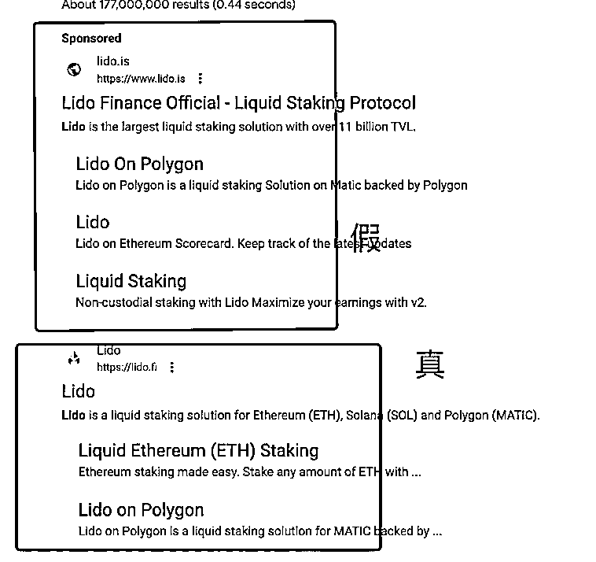
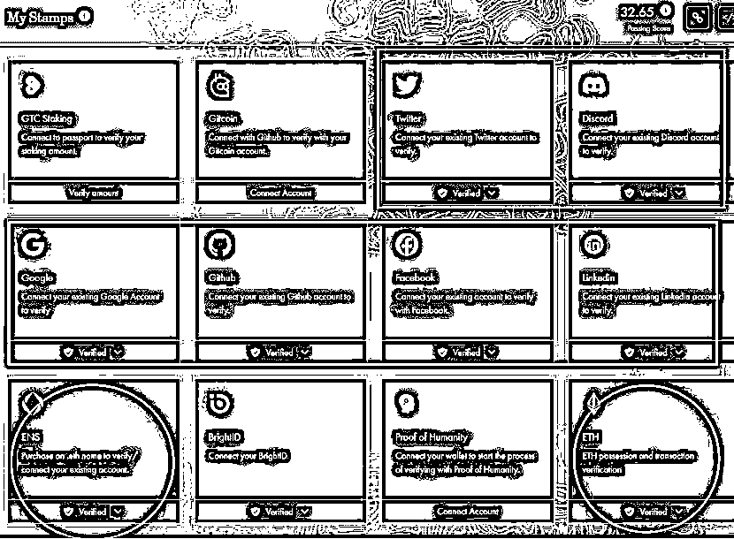
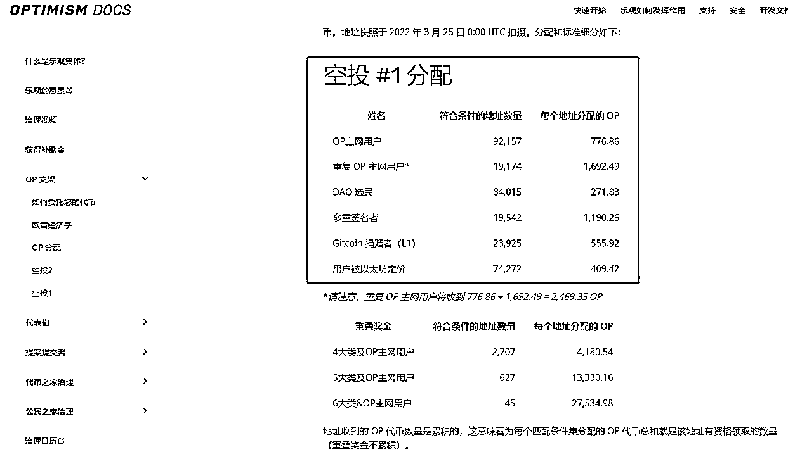
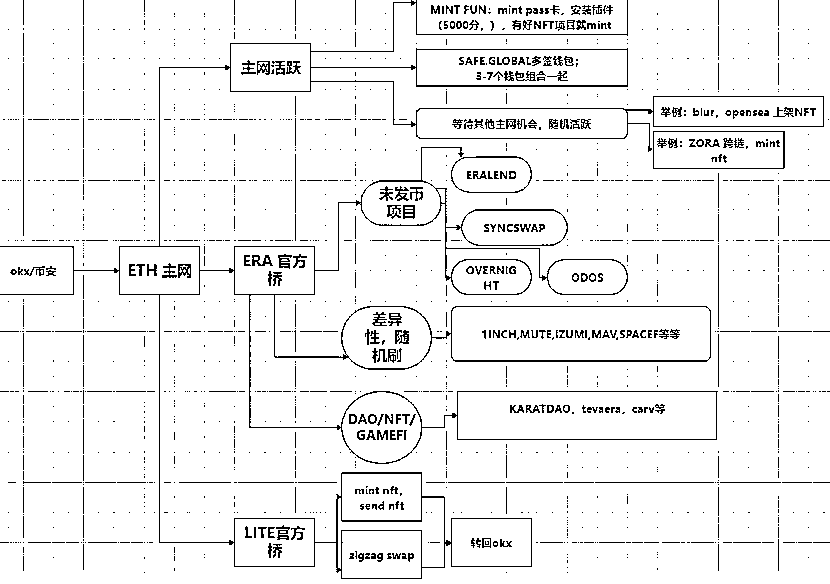

# Web3 撸空投打造精品号

> 原文：[`www.yuque.com/for_lazy/thfiu8/ocggig21uv29n2wk`](https://www.yuque.com/for_lazy/thfiu8/ocggig21uv29n2wk)

## (17 赞)Web3 撸空投打造精品号

作者： 阿曾

日期：2023-11-15

大家好，我是阿曾。

近期看到很多船友对 web3 撸毛有兴趣，这次我就做一个关于撸毛的分享。相信如果听完本次分享，可以举一反三，对其他撸毛项目你也会自己的判断。

我是 2021 年底入圈，但是入圈几个月时间玩现货玩合约就把钱亏完了，于是 2022 年 5 月就加入了撸毛圈。

我加入撸毛圈的方法就是写教程，我在去年 5 月开通了 mirror，然后看到要撸的项目，就自己学着写教程，类似费曼学习法，写教程教别人怎么参与，然后自己在写教程中也得到知识的增长。

去年的撸毛有收获，也有遗憾。我会在后面的分享提到。

我觉得撸毛是可以穿越牛熊的，因为撸毛是可以低成本参与项目的发展，如果这个项目火起来了，那么你就可以拿到它带来的收益。

撸毛发展到现在，也比较卷了，不能无脑的上号，因为卷，项目方不可能把所有的号都发空投，比如 arb 两百多万地址，只发给 60w 地址，大概 30%，所以我们参与撸毛，就要想办法把账户卷到前 30%，这样相对安全的。

关于这次撸毛的分享，主要包括 4 个部分：

我相信大家都看了航海手册，web3 的基础应该都没啥问题。但是很多人都是新手，所以我还是先说一下关于钱包可能遇到的安全问题。

首先说一下钱包安全，因为钱包安全一定要放在第一位。

以小狐狸钱包为例，主要功能包括签名，授权，转账，swap，MINT 等等功能，我们在交互过程中一定要注意你进行的交互会产生什么作用。

举个例子，以前有个群友去 mint NFT 结果被骗了，他想去 mint，但是小狐狸显示是发送。

那就说明那个网站是骗资产的：

这种假推特的特点一般都是不能评论，并且同时 at 很多人。

官方永远不会 DM 你。你有问题你得主动去开票或者开工单。

去年一个热门项目的创始人推特被黑，发布假网站，盗窃用户资产。

前天最新的案例就是 v 神（以太坊创始人）的推特也被黑了，被人社会工程接管了手机 sim 卡重置了推特密码。

所以，连 v 神的推特都可能被黑，那谁敢保证谁不会被黑呢？

骗子做了一个假官网，把关键词优化到谷歌第一位。

有个人囤了 5 年的四百多个 ETH，去到假网站，然后被盗了。

因此，要保持怀疑，不要信谷歌，不要信推特，不要信别人发的链接。

涉及到钱包授权的，一定要链接，合约，官推，社区，多重比对确认。

电脑不要安装未知危险软件 exe，要经常杀毒；
避免助记词通过任何触网的媒介储存；
避免助记词 txt 存储，手机拍照，xls 文件未加密；
助记词备份到云，导致数据泄漏，没有哪个云是安全的，很多大厂都被拖库过；
剪切板可能被监控，复制最好少复制几位；
指纹浏览器 / 云服务器/脚本有后门；
手机篇：下载到假 app （苹果会安全一些）；

这些都是要避免。

这种情况也是有的，如果大家对重要信息没有备份，也很容易导致资产流失，比如：
误删浏览器，或者小狐狸崩溃，但是助记词没备份；
手机坏了；
电脑坏了；
不小心删除了钱包……

这里的第三方问题可能是项目方被盗、项目方跑路等。

举例：EARLEND 被盗 350+万的 USDC；
应对方法：大资金不过夜

应对方法：取消跨链桥授权

举例：Kannagi 聚合器协议 Rug；
应对方法：小协议就不要刷

必须在清醒的状态下交易，迷糊、分心的状态最容易犯错；

举例：
一边聊天，一边做交互，看到假网站点了授权；
领了 arb 空投，结果转去了合约地址；
……

所以，做交互时候请保持清醒状态，该休息就休息。

以上是关于钱包安全常见问题的汇总，希望大家不要遇到。

我在开始的时候说到，去年撸毛有收获也有遗憾。

收获就是撸到的 castaways，apt，blur，arb 这几个大毛，粗略算了下有超过 50+（rmb）的收益；
遗憾就是没有上多号。

去年我没有多号的策略，导致 arb 发空投后我很长一段时间都焦虑。
看到了好项目但是没有上多号，是一件拍断大腿的事情。

借用亦仁说过的一句话，有钱赚的时候，要集中所有的资源和精力，allin 进去，切忌小富即安，过几年你会拍大腿，那么好的捡钱的时候，为什么错过了。

所以，多号才是真正的撸毛。几个号玩的叫参与生态建设。

多号分精品号和普通号：
精品号就是一钱包，一推特，一 gmail，一 discord，积极参与各种任务；
普通号就是一钱包，不需要推特 gmail DC 这些，纯刷链上数据。

在我眼中，多号的定义是 ：
精品号，大于 10 个；
普通号，大于 100 个。

一个电脑可以安装谷歌浏览器，brave 浏览器，以及 EDEG 浏览，这 3 个浏览器兼容插件的。
谷歌能安装的，其他 2 个浏览器也可以安装。

一个电脑可以同时登录多个 DC，推特和 gmail，我一个电脑登录 9 个号（dc/ gmail/ 推特）也不会被封。
只要有 2 台电脑就可以实现超过 10 个精品号。

普通号的创建方法，就是谷歌浏览器多开就行，具体操作大家可以参考以下这篇知乎帖：

关于指纹浏览器：
目前不大推荐，不建议指纹浏览器开新号，上个月比特浏览器被盗，很多撸毛人损失惨重，目前最好的指纹浏览器 ads 会不会也出现这样的情况呢？不好说。

我觉得最好的多号方式就是硬件多开，我认识一个撸了几百万个 arb 的大神他就是用 6 台 mac 去开多号。

Okx 可以开通 5 个子账号，即 1 个主号 +5 个子账号。主号可以申请 20 个充值地址，子账号也可以申请 20 个充值地址。

因此，一共 20+5*20=120 个充值地址，可以做好钱包隔离。

提现无需做隔离，直接从主号提现即可。但是充值就要对应好每一个地址。

项目方发空投的时候，就会想办法剔除明显女巫行为的钱包。

我们看看空投历史，从历史看，最开始没有女巫概念，到后来有女巫概念，有筛选门槛。

在 Hop 之前几乎没有不查女巫，Hop 开启女巫名单，后续项目空投会有女巫并且参考 hop 名单。

何币 1200 个地址被女巫：

我之前本来弄了很多分析，但是后来看到 p 总工作室的女巫总结，这个更全面：

总结来看就是 2 个方面：

避免这 2 点就可以避免女巫。

zksync 肯定会有女巫规则，但是具体怎么也还不知道。

我们再综合参考 ARB 和 OP 空投规则：

从中，我们能得出这份精品号的钱包数据综合参考

钱包行为包括：主网 tx，官方桥，DAO（投票，多签），其他 L2 的 tx，交易金额，LP 流动性金额，协议多样性，不同月份的 tx

最后再结合看看前几天在 token2049 zksync 副总裁提到的（如图），是不是空投标准都接近了？

精品号满足这些参数，这样等快照的时候，你的钱包就可以等福报了。

Zksync 生态大全，里面的协议都可以交互：

Zksync 交互路径推荐之一，一点要注意差异性（交互金额，交互顺序，交互时间等）。

主网跨入 ERA 之后，可以做这些协议，顺序不分先后，可以随机打乱：

最后总结，撸毛是一件长期主义的事情，延迟满足感，很枯燥，不确定性，但是如果能够坚持下来，我相信肯定有收获的。

期待明年 zksync 发空投，大家都撸到。

我的分享完了，如果有疑问可以举手。

* * *

评论区：

韦先森 : 大佬留个联系方式
阿曾 : cai2080

* * *