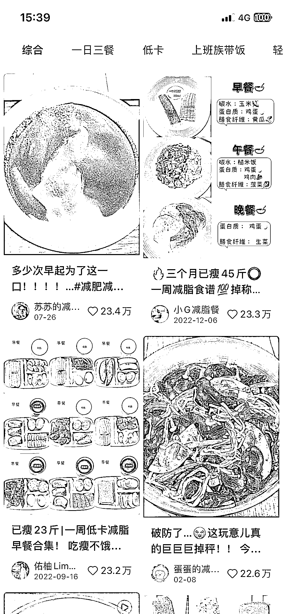
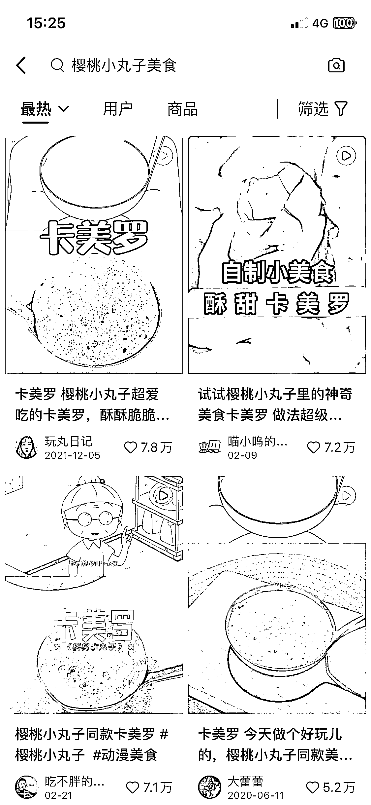
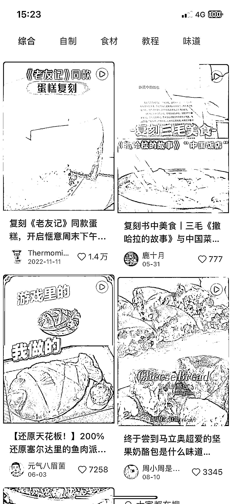
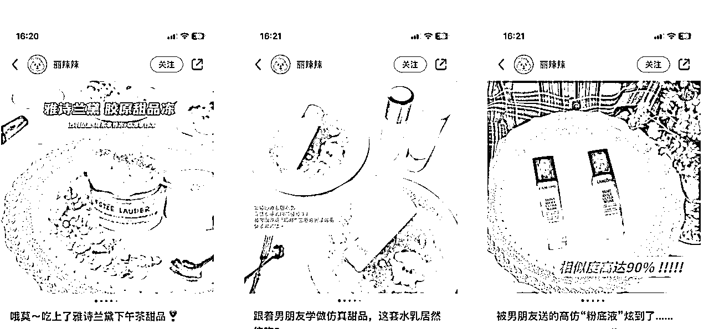

# 小红书 IP 打造：如何差异化打造自己的账号

> 原文：[`www.yuque.com/for_lazy/thfiu8/ei4me3l3bsn3vwlg`](https://www.yuque.com/for_lazy/thfiu8/ei4me3l3bsn3vwlg)

## (24 赞)小红书 IP 打造：如何差异化打造自己的账号

作者： Doris.Zhou

日期：2023-11-23

生财有术的小伙伴们，大家晚上好呀！我是叨叨～
从公众号到抖音，现在主攻小红书。一直都在做 ip 孵化的工作。

我最最最擅长的是：开脑洞，制作差异化内容，来获取流量。因为我始终觉得，定位做得好，流量不会差。再往后才是拍摄精巧，剪辑或排版等技术活儿等加分项。

这里的差异化，包括但不限于：个人 ip 的定位差异化，内容的差异化。

来讲一个自己做的 ip 案例吧～我以“子笺子凛”举例，这是一对双胞胎，虽然我们做账号比较早，流量确实比较好起，但是一年做到千万粉丝也还是比较炸裂的。

我给大家分享下这个账号比较重要的三个时间节点吧～

第一个时间节点是，2 个多月的时候，就做到了百万粉丝。当时遇到了第一个粉丝瓶颈。
当时他们的内容主要还是各种热点内容翻拍，比如：热门舞蹈翻拍。

然后我们重新定位账号，给兄弟俩的人设做出新的定位，霸道总裁哥哥和小奶狗弟弟；同期推出了一个妹妹（人物丰富的同时，产生的故事也会更多；兄弟间的嬉笑怒骂；宠妹狂魔等标签，一度产出爆款视频）

我们花 3 个月的时间，粉丝突破 300w。突破千万粉丝，大概花了 1 年的时间，期间尝试过各种方式方法，比如博主间的联动～再次丰富账号定位等。

在内容上，还算是有一些心得吧～～所以阿蓝来邀请我做分享的时候，我第一个就想到了【差异化】这个主题～
好啦～下面就正式进入正题哈！！

暴露缺点的背后，是拉近距离——像个“真人”。

孵化过太多的 ip，尤其是女性，会更注重自己的形象（从外貌，妆容，形态，服装）。
注意形象这件事本身没错，但是不要过度。

有个小伙伴说想做穿搭博主。简单分析她的基本盘：从外貌上来说，体型属于大胖，但长相很可爱，我给她提议可以做学生党｜初入职场这个方向的超大码女装试穿。

1 个月后我去问她做的怎么样啦？
她说最近在减肥，她想稍微提升形象之后，再做穿搭。

这里就有一个点：本来我推荐她做大码女装试穿，就是因为她的身材属于比较胖的那种，但她的长得可爱，这就有了天然差异化。当你开始减肥之后，身材趋向于大众化，长相反而就没那么出众了。

有一个博主第一次出镜的时候，刻意化妆把自己脸上的一颗痣遮掉，因为她会觉得“无暇”比较美。但我会和她说，你的这颗痣非常有特色，保留会更有记忆点。

再比如：我眼睛很小，常规做法：我通过化妆把眼睛画大
这个时候我就偏不（美妆博主另说），我就是眼睛小小，说话拽拽。这反而可能会成为用户记住你的一个特点。
比如：邵雨轩额头大，梅尼耶眼睛小等等。

美，本就不是千篇一律的。我们身上所有的特点都会带有记忆点。这也是为什么有的博主会在穿着打扮上增加记忆点。比如，故意染绿色头发，比如每次出镜都带着圆形眼镜，比如永远穿汉服等等。

有个知识型博主，视频拍摄完之后，一直来回调整内容。不满意的原因，是觉得自己还不够美～
emmm，这就有点本末倒置了。虽然外形很重要，但是知识类博主更重要的是：内容是否对别人有用。

虽然我们常说要不断优化内容做到极致，但在有限的时间里，我还是推荐先完成再完美。千万不要优化了半天，内容还没发出来，那就本末倒置了。

在自媒体的世界里，真正让粉丝爱上自己的，可能就是这些看似是缺点但实则是特点的地方。

以前我们喜欢“完美人设”，觉得要把自己立的很高，才能被人喜欢或关注。

现在我更常说：现在优秀的人，用户已经看的太多了。真诚且真实的展示自己，不要怕暴露自己的缺点。有缺点的人物才有灵魂，端着的完美人设和偶像包袱是你成功的绊脚石。高高在上的背后，其实隐藏的是距离。

导师｜专家型人设能不能做？能做，但是这更吃专业。
适合人群：律师，医生，房产，知识类博主
普通人更适合：成长型人设，经验分享型

那么内容上的差异化怎么做？
赛道的叠加，也可以理解为赛道的细分
我以美食举例：
A. 美食+母婴
B. 美食+减肥人群
C. 美食+爱户外（露营）

A. 美食+空气炸锅
A. 感性做菜【味力厨房】
B. 沉浸式卡点做菜【没煮熟的大鹅】
C. 擦边做菜【邓不馋】
D. 糊弄做菜【大绿水手】
A. 复刻经典【南翔不爱吃饭】：古代佳肴
B. 复刻各个网红店｜的经典菜
C. 复刻卡通片｜电视剧里的菜式：中华小当家｜樱桃小丸子｜老友记等等

A. 卡通可爱造型
B. 化妆品｜护肤品等
C. 名画

按照我这个赛道+xx 的框架，大家都可以试试把自己的内容做一个差异化。

卖水果：咱们可以想到什么样的账号内容？

人设 1：土土的山里人，主打一个真实，自己种自己采摘
为什么溯源会火起来，其实就是主打一个真实+吃得放心。
人设 2：一个穿着打扮精致的女孩，继承家业，从事三农的工作，整天穿梭在果园中。
这是不是就有冲突性了？这个人就更容易被大家记住。
人设 3：狗狗，具体大家可以看下抖音【我是拉不拉金】：一只狗狗摘橙子
这个内容是不是一下子就和其他内容作了差异化？

最终我们还是要落到变现上，当我要卖一个产品的时候，我就可以试试多维度思考——

一样是干货分享，你可以坐在床上素颜穿着睡衣的分享，可以在马路上边走边拍，也可以三百六十度的拍摄。不要局限于统一的场地、统一的背景。像朋友一样真实地聊天，才更有亲切感。

小结：设计真实感。

我的分享就到这里啦～～

最后的最后：说了那么多内容差异化的内容，我来举个例子，大家一起思考下，如果是你，你会怎么做吧？一起开开脑洞！！

比如：我给一家月子中心做引流。我能从哪些内容维度切入？

如果是我：我的内容会考虑以下几种可能性：

品牌内容（硬件+软件）

a.

月子会所各维度展示

b.

月子中心某个员工的视角

二胎妈妈（或 95 后）怎么选月子会所——从第三视角（与目标用户更接近）

a.

一次性把月子中心的坑说明白（经验）

b.

后悔在月子中心住了 28 天（反差）

c.

个人经历|月子中心 or 月嫂（对比）

月子中心离职员工——从业者经验

a.

月子中心已离职，大家有啥随便问

b.

从被销售骗，到让销售哭

c.

从业六年告诉你月子中心省心➕省钱的选法

奶爸——另一种目标消费者

a.

为什么坚持让老婆去月子中心？

* * *

评论区：

子白 : 太好了，收藏了

* * *