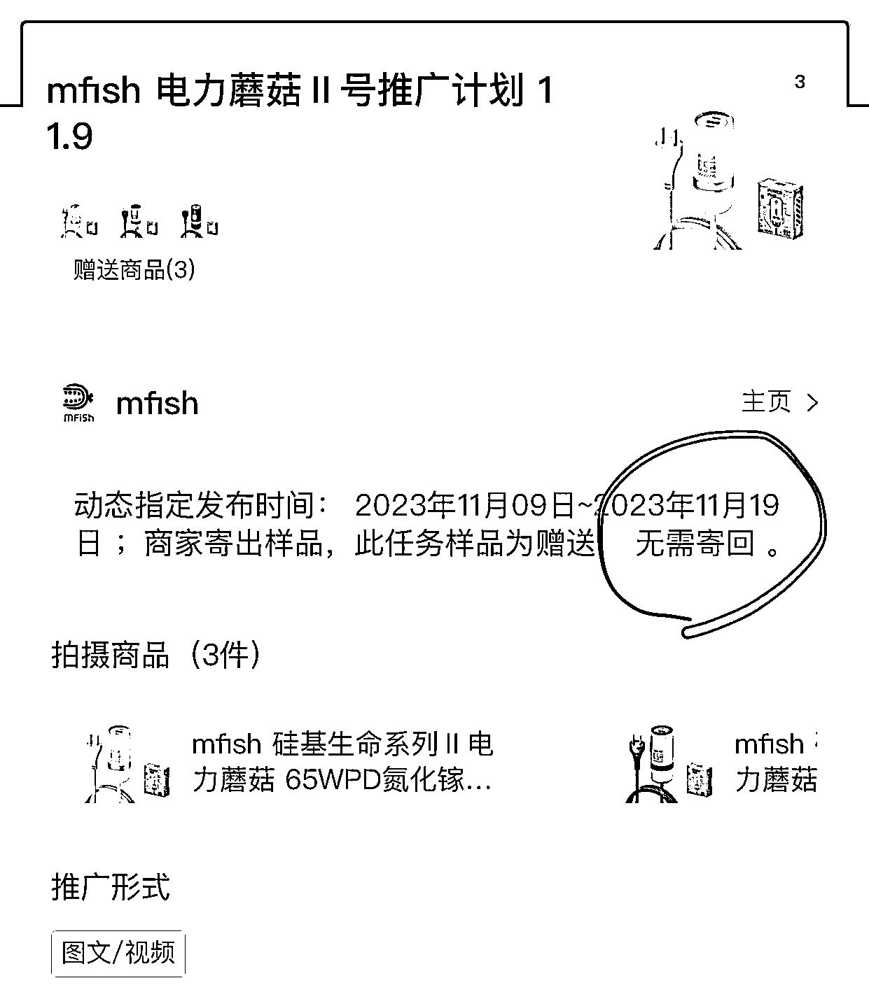
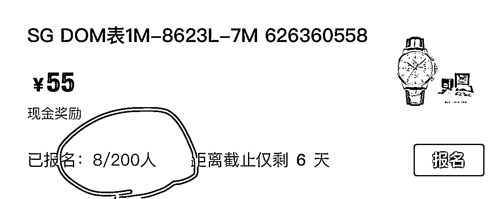
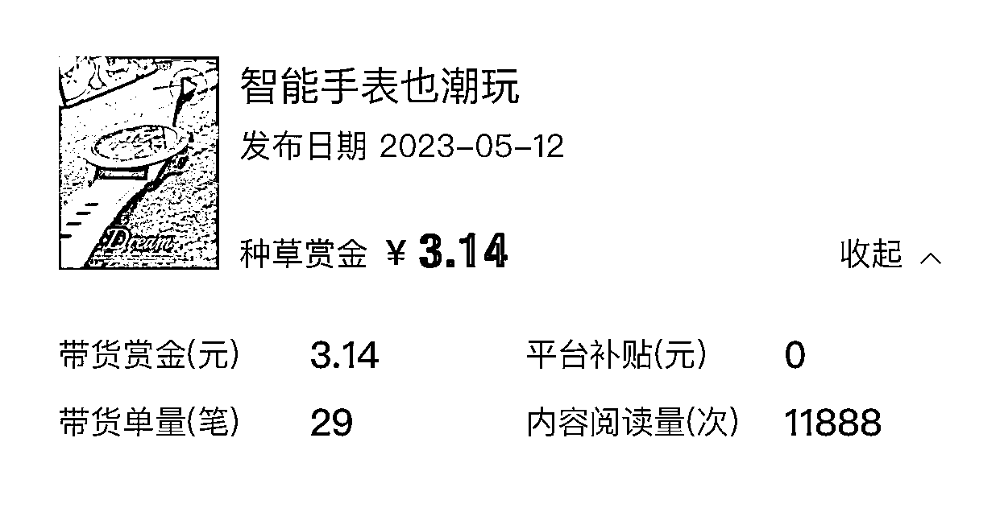

# 得物 APP 变现项目分享

> 原文：[`www.yuque.com/for_lazy/thfiu8/izu3o6l6tdngpcd9`](https://www.yuque.com/for_lazy/thfiu8/izu3o6l6tdngpcd9)

## (21 赞)得物 APP 变现项目分享

作者： 王巍

日期：2023-11-21

前两天写到过关于得物 app 上的变现，有朋友问到，就说一下，图有点多，鉴于星球的排版，大家可以私我看我公众号文章，文字内容是一样的。

-开始-

得物做为国内最大的潮流电商和潮流生活社区，主打年轻人和潮牌潮物，在自媒体圈并不像小红书、抖音那样火爆。但其实在得物上，也有针对创作者的赚钱平台——引力平台。

它是得物官方为社区优质创作者和品牌商家打造的商业内容合作平台，类似于抖音的星图和小红书的蒲公英。

不同于小红书和抖音的 1000 粉丝和保证金门槛，得物的引力平台门槛就比较低了，最低只要 100 粉丝，就可以加入好物分享官，参加投稿任务。（图 1）

投稿任务一般有三种结算奖励方式：

现金奖励
不要看金额不大，通过练习对产品的拍摄和文案写作，可以大大提升网感，对各平台的变现也都有帮助。（图 2）

产品置换
虽然没有现金，但有很多很酷的产品，比如这个 65W 氮化镓充电器，价值 2 百多，真香~（图 3，4）

现金+产品
这个相对产品少一些，但如果有合适的，何乐而不为呢。（图 5）

流程很简单：成为好物分享官，可以在投稿任务专区找到适合自己领域的产品进行报名，报名通过，拿到商家寄拍的产品，完成拍摄任务（图文/视频），通过商家验收即可获得相应的奖励。

做为新人，前期可以优先找一些名额较多的任务，比如 200 人，这样入选的机会大一些。（图 6）

当然重点不止是投稿任务的那些“蝇头小利”，还有：

拿到产品，可以多多学习其他达人的拍摄方式，包括文案，得物的图文流量并不小，同时，拍摄的产品图文和视频还可以在多平台分发（抖音、小红书、淘宝等等）。

如果你同时有在做现在很火的小红书，就很 nice，相当于有免费产品来进行拍摄了，而且得物和小红书的粉丝画像并不冲突。

如果是产品置换，产品可以自用，如果用不上，可以放闲鱼变现。

文章开头展示的是商单任务，如果想获得商单，努力达成 500 粉丝，就可以成为达人开启定向任务，内容优质的话，会有品牌直接找到你合作。

以上，要保证自己的内容原创健康优质，这是做自媒体的基础规则了。

其实针对得物 app，除了上面说的引力平台，还有其他一些变现路径，比如：

带货，不过得物带货只是带个寂寞，佣金可以忽略不计~（图 7）

视频号，在得物视频的播放单价并不低，远超很多短视频平台，所以现在有很多影视剪辑加入进来，播放量也很惊人。（图 8）

无货源电商，主要针对爆款球鞋，在球鞋官网或者电商平台抢到原价或者打折的球鞋，在得物出手，这个需要投入精力和人力来抢鞋，但只要抢到就是赚到，爆款球鞋的溢价很高，专门的抢鞋团队月入几十 w 上下。

对得物有兴趣的朋友可以私信我，一起赚起来～

* * *

评论区：

林林 AIGC 写作 : 去年很多做得物搬砖付费情报群的
王巍 : [强][强][呲牙]
源（📷定金留档，靠谱* : 你得物在做什么啊
王巍 : 是有个潮玩 ip【潮玩王巍】一直在同步更新

* * *