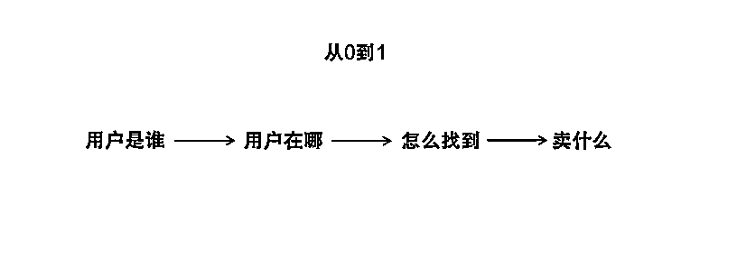

# 细分市场的知识付费怎么做？体外诊断行业职场 10 年，转型自媒体 5 年经验分享

> 原文：[`www.yuque.com/for_lazy/thfiu8/apytzieczbmgrxxk`](https://www.yuque.com/for_lazy/thfiu8/apytzieczbmgrxxk)

## (23 赞)细分市场的知识付费怎么做？体外诊断行业职场 10 年，转型自媒体 5 年经验分享

作者： 老陈

日期：2023-11-23

虽说知识付费现在越来越卷，但只要需求在，生意就在。

我做的体外诊断领域，相对大消费来讲是一个小众行业。在医疗器械板块属于最大的细分市场，市场规模在 1000 亿左右。可能你都不知道什么是体外诊断？比如我们生病了，要到检验科去做化验，最后形成一张张检测报告单，而这背后就是体外诊断行业的产品。简单说，检验科里面的仪器、试剂等等都是体外诊断产品。

16 年那会儿，体外诊断这行不管是生产厂家、还是销售人员、又或是行业政策，都刚刚起步，大部分人专业知识空白，行业不够成熟。但这行前景很不错，比如核酸检测，疫情期间直接把体外诊断行业相关企业带飞了。

有需求、没人做，机会不就来了？恰逢知识付费的风口，我又在这块有一定经验，就顺势做起了线上培训。

因为自己在一线干过，因此定位的人群也更偏一线从业者，比如一线销售、市场或者中层管理者。他们对于学习相对来说是刚需，而且基数也更庞大。

经过 4 年发展，我终于把这个领域从生产到销售的一整条供应链都串联起来:从入门到专业知识，以及行业政策端、市场端、学术端、销售端……总的来说就是帮普通人进入医疗行业，帮内行人快速成长、资源整合。

虽然体外诊断领域目前的从业人员规模只有 30-40w，但因为布局的时间够早、切入的需求够细、解决的问题够刚需、行业有门槛有壁垒，现在也不会因为知识付费风口的衰退而受影响。

如果你对知识付费感兴趣，又觉得这行太卷，不妨思考一下：你在你所处的行业的知识体系是不是成型了，对目标群体的付费需求是不是清楚，如何针对目标群体去做课程规划，如何做好自媒体运营获取粉丝，如何去完成销售闭环。

相信我，那些更专业、更垂直、更细分化领域的知识付费，存在更多的机会。希望今天的这篇内容，大家看完能有所收获。

# 一、项目概况

2014 年，我进入医疗器械行业**最大的细分市场-体外诊断领域。**是一家上市企业做省区负责人，因为自己是驻外，公司在上海，半年度和年度总结回去述职的时候才有一些培训，更多的也是公司产品培训，就在想怎么才能自己线上学习方便。

2016 年，我看到“得到”等在线知识付费模式开始盛行，当时就思考，我自己所在的行业是不是也可以做一个专门给行业人学习的知识付费平台。

2018 年，因为工作的积累，对体外诊断行业有了自己的知识体系，于是就想做转型，工作之余就成立了一个公众号（服务号）。

当时不知道该怎么做知识付费，初衷是想在公众号上做知识付费的，所以注册的时候才注册成服务号，叫《圈内课堂》。

主要是当时小鹅通平台还没有遇到。

于是我就自己先把公众号运营起来，每次都分享干货文章，到了 2019 年的时候，就有 1 万粉丝了，当时自己也了解到小鹅通这个知识服务平台。

随后，我就开始聚焦体外诊断行业知识付费，上线了体外诊断学院，逐步去建立体外诊断从业课程体系，**帮助体外诊断行业从业者在线学习、还有就是医药、耗材行业想转型的从业人员，以及普通人进入医疗-体外诊断行业。**

# 二、如何变现

开始的时候我们也没有做会员体系，就是上线一个课程就卖一个课程，在公众号写课程文案然后推送给关注公众号得粉丝，还有就是在自己朋友圈宣传。

课程多了之后，我们一个学员就找到我，说你能不能做一个会员，加入会员之后，课程都可以给会员免费学习，免得我们每次上新课程都得买。

我当时想，这个问题挺有代表性，因为我们行业有很多细分领域，但是很多企业开始多产品线多细分市场发展，那么学员需要掌握得知识也更多样化，于是我们就上线了超级会员服务，刚好当时小鹅通也有这个模块。

最开始的时候，我们还没有上线会员沙龙，就是课程，开通会员所有的课程都可以免费学习。

后面我想提升和会员的互动性，同时邀请更多的行业精英来分享，就有了会员沙龙这个栏目，同时也上线了训练营项目，这些都是会员免费学习的。

就这样，我们开始从卖课程，转变成主推会员，偏高客单价，定价我们是按一年 999 元来定的，有时候也会做会员优惠活动。

买课程是一次性交付，会员需要做后端服务，除了会员沙龙，平时会员遇到什么工作上的问题也会找我们帮助，这样才会让会员觉得有温度感和互动性。

一段时间后，经常有会员有各种各样的问题，有时候也需要找各种行业资料，我于是又做了一个知识星球叫体外诊断价值圈，方便大家下载资料和在线提问。

星球最开始也是给会员免费一次的，但是不是会员的加入星球就要付费，星球从 59 一直涨价到 299。

# 三、流量从哪里来

我运营服务号之前，会链接几个当时的头部账号，但是他们没有做我们这块，属于订阅号。

第一波粉丝就是我给我朋友圈的好友说，把我们服务号的二维码发给朋友圈的圈内同行，让他们关注，然后我在写干货文章，第一波粉丝就觉得文章不错，然后转发到朋友圈。

因为圈子不大，很容易媒体就在朋友圈看到文章了，还有就是我微信链接的这些头部账号我会把文章发给他们，让他们转载。

头部账号也缺内容，就给我们转载了，文末还附上我们公众号的二维码，就这样通过头部账号转载带来了一波粉丝。

后面头部账号在我们干货内容持续出的过程中，也会持续转载，这样第一波粉丝就起来了。

我记得也没发几篇文章，粉丝就破千了。

我们运营服务号一段时间后，发现流量不够，而且服务号一个月只能发四次文章，就想着怎么才能有更多流量。

于是 2021 年我就成立了一个和知识星球（我们星球名称叫体外诊断价值圈，当时知识星球的刘容也安排团队采访过我，文章也发表在知识星球）同名的公众号，就叫《体外诊断价值圈》。

但是这个是订阅号，每天可以发文章的，逐步去把粉丝规模做起来，同时为星球和体外诊断学院超级会员两个付费产品增加一个流量入口。

通过公众号、社群、微信朋友圈来推广我们的星球和超级会员，平时更多的还是以推广超级会员为主，一方面是客单价更高，另一方面是这个产品也是一直在持续打磨的，而且对从业者也确实有帮助。

随着订阅号粉丝规模越来越大，我们在 2023 年也开始为企业提供营销服务，比如会员所在的企业或者通过公众号链接的企业，他们可以在我们订阅号上推广产品，或者在我们直播间做直播宣传来招商。

# 四、如何运营

**（1）公众号运营**

公众号运营一种是 IP 运营，一种是平台运营。我们选择的是第二种。每天发布专业领域的知识、价值资讯等等，但是内容会偏市场端，因为我们的付费用户主要是市场端。

细分市场群体就这么大，一线用户为了了解行业的政策、趋势、市场分析、产品分析、专业知识等等，很多会选择关注公众号。

持续的内容自产和转载，可以保障内容的可持续性。

但是如果在细分领域写 IP 号，就需要自己写原创，而且能持续深度的写，这是很有挑战的，如果不能持续日更，很容易就断了。

但是从用户粘性的角度看，IP 号如果运营的号，粘性会更强。

我自己没有另外做 IP 号，而是和强势的 IP 号合作，比如我们医疗领域有一个公众号《达叔天演论》，我就是他第一期微天使，通过达叔的 IP 号，我们也链接了很多新会员。

我们是服务号《圈内课堂》和订阅号《体外诊断价值圈》同时进行，服务号作为学习平台，每个月也都会更新。

但只会聚焦行业干货，没有资讯，这样就从定位层面让大家知道这是一个学习平台，需要学习的时候，自己会主动去平台找课程。

而我们的订阅号可以作为会员日常了解行业的补充，同时订阅号也可以作为拉新的流量端口。

**（1）视频号运营**

视频号我们是今年才开始，相对处于初期，最近才尝试了视频号销售会员，一次有十几个会员加入，后续我们会不断邀请行业的资深人士到我们直播间连麦，分享干货。

把我们的会员挂上去销售。也会和其他视频号博主合作，一起在直播间推广会员。

# 五、课程如何搭建

目前来讲，我们主要的收入还是 C 端会员收入为主，同时在拓展知识星球和企业 B 端服务的收入。

所以也有很大的精力放在体外诊断学院的课程体系建设和会员运营这块。

我们在小鹅通平台，基于我们体外诊断行业，市场销售人员需要的知识体系，从入门到专业知识，以及行业政策端、市场端、学术端、销售端，做一套课程体系，每个月也会举办相关会员沙龙。

这样可以持续去提供会员服务。

课程体系的建设方面，要看定位的人群是谁，我们相对来说，偏一线从业者，比如一线销售、市场或者中层管理者。

那我们的课程体系和沙龙主题就会从这类人群的学习需求出发，去做对应的课程和沙龙。

主要是我觉得这部分人群对于学习相对来说是刚需，而且基数也更庞大。而企业的高管更多的并不是一个课程，而是资源、人脉、高单价的培训为主。

而我的职场经历更多的是在一线，所以在做会员课程体系的时候就定位偏一线。

**课程产品设计：**

首先我们要评估自己要切入的细分赛道，如果要做学习平台的话，目前市场上有没有这类平台，比如医疗行业，肯定有很多学习平台，但是我只切其中一个细分领域，而且是我熟悉的领域。

当时我看体外诊断领域没有人做在线知识付费平台，我就觉得这是一个不错的方向，因为需求明显在那里，只是等着人去做出来。

课程设计的时候，我们开始是上线了一个生化诊断试剂销售课程，这是体外诊断领域的一个细分市场，一上线课程，就有人在公众号上购买，也验证了市场需求。

紧接着我们又上线了其他专业板块的课程。

我们开始是音频课，随着学员的增多，大家反馈是不是能做出视频课，有课件、有视频，这样学习起来更直观，于是我们又把课程更新成视频课。

这一定程度上也提高了学员的认可度。

专业课程开发的差不多，我们又开始制做销售端的细分领域打法相关课程，比如我们有一个课程是关于终端拜访和渠道建设方面，这是很多一线人员的痛点，相信很多 TO B 业务的领域都有这方面的需求，因为我做一线业务，深知这类课程肯定会受欢迎。

课程出来之后，很快销量就破百了，也有企业直接采购我们这类课程。

这一类系列做好之后，我们又完善了市场推广端、商业模式端、实用技能方面的课程体系。

这样对于市场、销售从业者的专业知识体系就初步搭建好了。

而会员沙龙是作为我们对于行业趋势、政策分析、知识点补充的一个板块。

因为这类是变化的，每年医疗行业的趋势、政策都会有新的变化，新的知识点，通过会员沙龙这种形势，可能不断的更新，去满足会员对于行业判断、知识更新等方面的诉求。

# 六、入局门槛和风险

目前做知识服务其实微信生态在整体交付方面的基础设施已经很完善了，从公众号到社群和朋友圈，公域到私域，都很丝滑，支付环节也很高效。

只是自己如果要在细分领域做这方面的商业模式的话，需要有不错的专业素养，比如你在你所处的行业的知识体系是不是成型了，对目标群体的付费需求是不是清楚，如何针对目标群体去做课程规划，如何做好自媒体运营获取粉丝，如何去完成销售闭环。

此外，会员体系会涉及到续费和拉新，需要从价值的角度出发，做好价值服务和提供价值产品。

会员拉新主要还是基于公众号流量和朋友圈，也有很多行业从业者是通过我朋友圈了解后，完成购买的。

续费的话，我们会建立会员群，在续费的时候会有续费福利，这样直接在会员群里面通知，一次性就可以触达到老会员，需要续费的就会在会员群完成续费。

当然我们也不会专门去和会员私聊，让他续费，即使会员过期了，有什么问题问到，我们也会提供力所能及的帮助。

有些过期了的会员，在你提供帮助的过程中，他也会继续续费。

会员的背后都是具体的个体，我觉得需要有用户思维和同理心，多从对方的角度去思考，这样会更有温度点。

风险点在于，你是不是足够耐心，能不能持续输出知识，也需要一定的人脉资源，你所处的行业是不是适合做会员体系，我觉得并不是每个领域都适合做。

另外，会员有了一定规模后，留存更重要，因为细分市场体量就那么大，这是做会员体系最大的挑战。

风险点的化解在于你持续的经营和链接，只有坚持才能在过程中不断积累。就好比我们的会员沙龙，也是通过平时不断的链接行业资深从业者，互帮互助，才会有那么多高管愿意来分享。

另外就是不能靠一个产品，可以有 B 端服务和 C 端产品并行，多产品发展可以去分摊一些营收增长的压力，当然前期肯定是把一个产品做好，并持续维护好，这是基础，然后看是不是可以做一些延伸。

当然，这个要看本身的商业模式是不是适合做单一产品和服务，比如我所在的生财有术知识星球，就是单点突破，不断做大规模。

因为我们医疗行业很多细分领域，很多细分市场，每个细分市场从业规模也不一样。

目前我们体外诊断行业从业规模在 30-40 万之间，市场体量相对不大，如果你所在行业从业规模也很小的话，会面临增长焦虑和营收天花板的问题，同时也需要时间坚持去做出壁垒，慢慢变富。

细分领域学习类会员模式，我们目前做了 4 年多来看，能稳定赚钱，但是每年变化不大。

以上主要是分享我个人的经历和思考，希望对各位星友有所启发。

* * *

评论区：

小 Q : 细分领域，坚持做，慢慢变富[强][强][强]

* * *