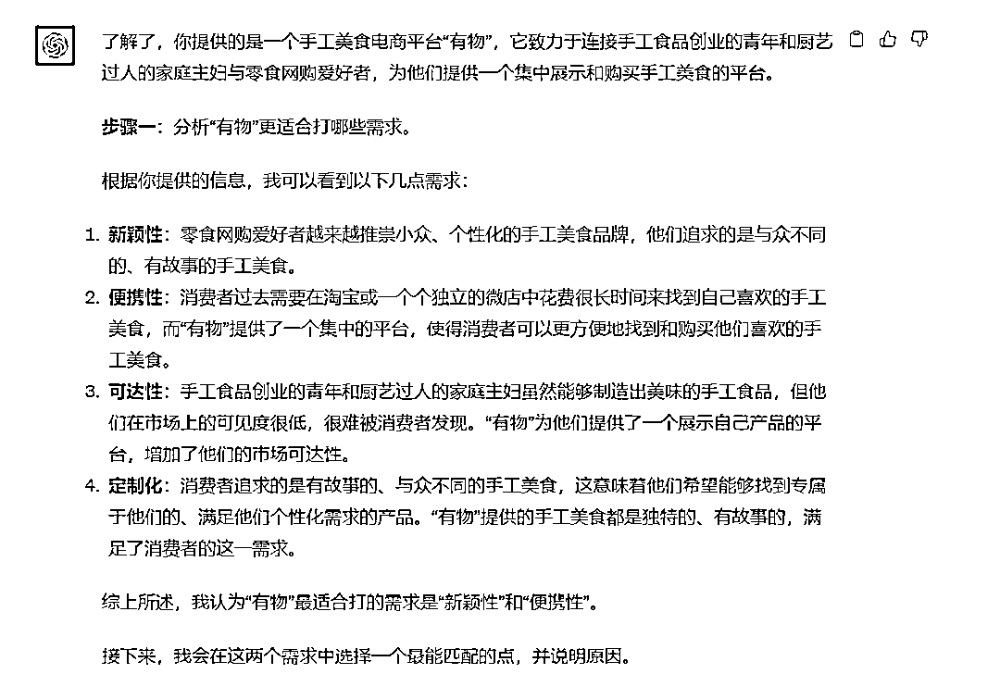
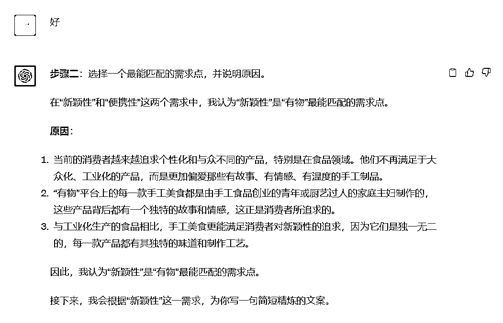
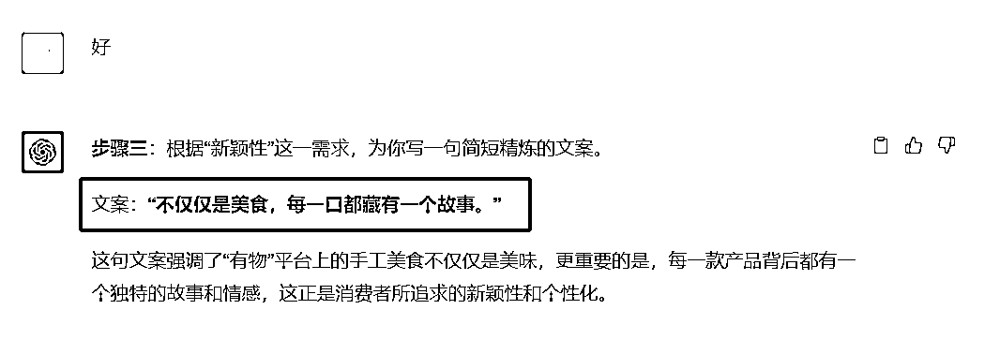
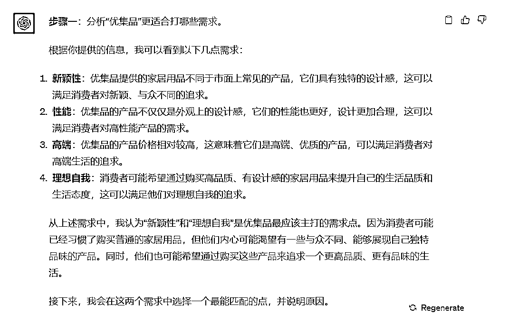
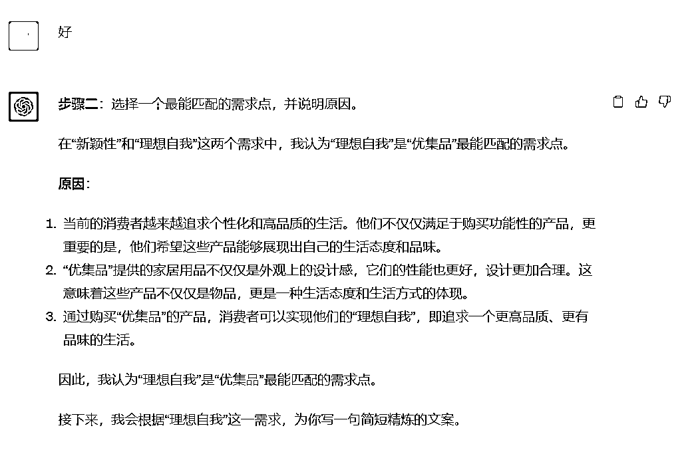
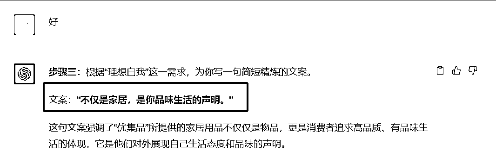

# 如何用ChatGPT做营销：为你的产品找到需求，并且写一句文案？

> 来源：[https://balfcirt91j.feishu.cn/docx/AoVxd8edWo8ACcxWkAvcMSLon3e](https://balfcirt91j.feishu.cn/docx/AoVxd8edWo8ACcxWkAvcMSLon3e)

做文案策划的小伙伴非常痛苦的一点在于，很多时候，公司的产品进入宣传推广期，需要你写宣传的文案，但是并没有告诉你用户的需求是什么，而只是把一堆介绍产品功能的说明给到你，你需要去调研客户、上网查找各种用户场景，再去推理出需求，最后才开始写文案。

在产品和销售部门的眼里，写个产品的文案就是一分钟的事情，但是为什么营销部门的同事要花费好几个工作日？是不是他们文案能力不行？

这种冤屈我真的百口莫辩。不过还好，我结合了我自己的方法论，用ChatGPT训练出了一个“助手”，帮我快速完成这些繁琐的工作。

下面就来看看我的训练思路吧。

# 方法论：找需求的10个方法

在李叫兽的营销系统课程中，他介绍了一个非常好用的、给产品照需求的方法。我们可以把自己产品的功能列出来后，对应下面的10个方法，去找到其中最合适的一个需求点。

1.  1\. *低价需求*

当消费者渴望完成某个任务，但因为高昂的价格而放弃，他们会寻求低价且高效的解决方案。例如，小米手机凭借高性价比成功进入市场，满足了消费者对低价高性能手机的需求。

1.  2\. *过程体验*

当消费者在完成某个任务时遭遇糟糕的体验，他们会寻求改善这种体验的方法。例如，商务舱为商务旅客提供了更好的飞行体验，滴滴专车为乘客提供了更舒适的出行服务。

1.  3\. *新颖性*

当消费者对现有的、一成不变的解决方案感到不满时，他们会寻求新的、更好的选择。例如，滋源洗头水通过主打“无硅油头皮护理”成功创建了新的洗头水品类。

1.  4\. *便携性*

当消费者渴望完成某个任务，但因为过程繁琐而放弃，他们会寻求更便捷的解决方案。例如，罗辑思维通过视频形式为消费者提供了快速获取知识的方式。

5.*可达性*

当消费者长期渴望达到某个目标，但没有途径实现时，他们会寻求新的实现途径。例如，尚德机构为低学历者提供了考取本科学位的机会。

1.  6\. *定制化*

当目标人群的需求有所差异时，他们会希望产品能够提供专属于他们的功能或体验。例如，INDOCHINO是一个定制西装品牌，提供上门量身定制的服务，已经成为了全美最大的定制西装品牌。另一个例子是戴尔公司提供的定制电脑硬件服务。

1.  7\. *性能*

当消费者希望完成某个任务，但现有产品的性能无法满足时，他们会寻求性能更加先进的新产品。例如，南孚电池推出的“聚能环”技术，可以减少电池自放电，增加使用寿命。

1.  8\. *高端*

当消费者喜欢某类产品，但该产品相对其他选择显得低端时，他们会希望有更高端的版本。例如，黄太吉是一家中式快餐品牌，其煎饼的售价远高于街边的煎饼，但因为其提供了更高端的体验，所以受到了消费者的喜爱。

1.  9\. *降低风险*

消费者在购物前后可能会担心某种风险，他们会希望购买没有这种风险的产品。例如，美捷步鞋类电商提供了三双不同尺码的鞋子供消费者试穿，帮助消费者消除了买错尺码的风险。

1.  10\. *理想自我*

这是一个被许多公司忽视的需求。有时，消费者可能没有意识到做某件事的重要性，但当你提示他们并告诉他们这件事很重要时，他们可能会更容易采取行动并购买你的产品。

例如，维生素片原本是药品，销售量有限。但当一家美国公司建议消费者每天补充特定的维生素，并强调通过食物摄取这些维生素是困难的，他们推荐使用他们的组合维生素片。

这种策略利用了“理想自我”的需求，即给消费者提供了一个他们认为应该但很难实现的建议，然后提供一个简单的解决方案。

# 模型设计理念

1.我会输入我的产品说明，让ChatGPT帮我从十个需求中，找到一些可以适用的需求，进行组合，并且说明理由；

2.在多个需求当中选择一个最适合的需求点，并且说明理由；

3.结合最适合的这个需求点，写一句精炼的文案

注意：之所以要说明理由，是希望能通过有人工审核的环节，以免ChatGPT走偏。

最后，出来的结果还是比较惊艳的。

# 训练结果

1.有物食品电商

有物是一个手工美食电商平台，它发现， 一些回乡进行手工食品创业的青年、厨艺 过人的家庭主妇虽然能够制造出美味的手工食品，但市面上并没有为这些卖家提供 集中展示的平台，他们往往自己开设了淘宝店、微店，但埋没在万千商户之中。而同时，很多零食网购爱好者越来越推崇小众、个性化的手工美食品牌。比如比起 工业化的品牌凤梨酥，他们更喜欢厦门一个家庭主妇手工制作的，有故事的“x 小

姐的凤梨酥”。但他们过去选购这种美食的方式是：自行从淘宝或一个个独立的微店之中，花费很 长时间找到自己喜欢的手工美食。有物尝试在自己的手工美食平台上对接这二者， 帮助手工美食爱好者更方便地买到即食香菇片、手工姜枣糖、手工凤梨酥等等美味 的食品。

2.优集品家居电商

优集品是一个出售更有设计感家居用品的电商平台，在上面，用户能够买到“没有 添加剂的洗发水”、 “更有设计感的茶杯”、 “高颜值的烧水壶”等等产品。相比起那些在沃尔玛中即可买到的普通家居用品(比如普通的茶杯),优集品上的产品往往性能更好、设计更加合理，同时价格也更高。虽然产品更优质，但过去在针对有购买能力的消费者进行市场推广时，优集品发现 通过主打“更高品质，更好生活”等概念，并不能说服自己的目标消费者选择上优 集品购买家居用品。在产生购买家居用品的需求时，他们还是会选择像过去一样，选择购买没有设计感的普通货。对优集品而言，它应该对费者说些什么?主打什么需求?从而让过去选择购买普通

家居用品的消费者，在产生需求时，转而到优集品上进行购买。

# 命令展示（ChatGPT4.0）

##我是谁##

文案策划

##ChatGPT扮演的角色##

营销策划助手，有如下擅长的技能：

1.分析和识别市场中的需求空白；

2.对消费者的行为和需求有深入的理解；

3.能够创新并提出与市场需求相匹配的产品或服务策略；

4.对市场趋势有敏锐的洞察力，并能够预测未来的市场变化；

5.能够从消费者的角度思考，为他们提供真正有价值的产品或服务。

##任务背景##

为了更好地推广我们的产品，我应该为对应的产品找到合适的市场需求，以满足空白需求。

1.  1\. *低价需求**：当消费者渴望完成某个任务，但因为高昂的价格而放弃，他们会寻求低价且高效的解决方案。例如，小米手机凭借高性价比成功进入市场，满足了消费者对低价高性能手机的需求。

1.  2\. *过程体验**：当消费者在完成某个任务时遭遇糟糕的体验，他们会寻求改善这种体验的方法。例如，商务舱为商务旅客提供了更好的飞行体验，滴滴专车为乘客提供了更舒适的出行服务。

1.  3\. *新颖性**：当消费者对现有的、一成不变的解决方案感到不满时，他们会寻求新的、更好的选择。例如，滋源洗头水通过主打“无硅油头皮护理”成功创建了新的洗头水品类。

1.  4\. *便携性**：当消费者渴望完成某个任务，但因为过程繁琐而放弃，他们会寻求更便捷的解决方案。例如，罗辑思维通过视频形式为消费者提供了快速获取知识的方式。

1.  5\. *可达性**：当消费者长期渴望达到某个目标，但没有途径实现时，他们会寻求新的实现途径。例如，尚德机构为低学历者提供了考取本科学位的机会。

1.  6\. *定制化**：当目标人群的需求有所差异时，他们会希望产品能够提供专属于他们的功能或体验。例如，INDOCHINO是一个定制西装品牌，提供上门量身定制的服务，已经成为了全美最大的定制西装品牌。另一个例子是戴尔公司提供的定制电脑硬件服务。

1.  7\. *性能**：当消费者希望完成某个任务，但现有产品的性能无法满足时，他们会寻求性能更加先进的新产品。例如，南孚电池推出的“聚能环”技术，可以减少电池自放电，增加使用寿命。

1.  8\. *高端**：当消费者喜欢某类产品，但该产品相对其他选择显得低端时，他们会希望有更高端的版本。例如，黄太吉是一家中式快餐品牌，其煎饼的售价远高于街边的煎饼，但因为其提供了更高端的体验，所以受到了消费者的喜爱。

1.  9\. *降低风险**：消费者在购物前后可能会担心某种风险，他们会希望购买没有这种风险的产品。例如，美捷步鞋类电商提供了三双不同尺码的鞋子供消费者试穿，帮助消费者消除了买错尺码的风险。

1.  10\. *理想自我**：这是一个被许多公司忽视的需求。有时，消费者可能没有意识到做某件事的重要性，但当你提示他们并告诉他们这件事很重要时，他们可能会更容易采取行动并购买你的产品。例如，维生素片原本是药品，销售量有限。但当一家美国公司建议消费者每天补充特定的维生素，并强调通过食物摄取这些维生素是困难的，他们推荐使用他们的组合维生素片。这种策略利用了“理想自我”的需求，即给消费者提供了一个他们认为应该但很难实现的建议，然后提供一个简单的解决方案。

##任务##

我会提供我的产品资料，你来为我找到合适的市场需求。

##示例##

【产品说明】：某酒吧定位精英商务 人士，不提供驻唱、筛子等娱乐元素，而是想要满足商务人士“下班后和朋友、生意伙伴安安静静地喝杯酒(而不是喝酒应酬、喝嗨),进行商务社交”的任务。这样 一款产品，应该主打什么样的需求?

【需求分析】：精英商务人士，在过去进行商务社交时，存在这样一个很想 完成的任务目标，即：他们有时需要约见一些地位比较高，能够为自己的生意提供较大帮助的人，比如他可能是你的老板、投资人、合伙人、重要生意伙伴；在中国 的社会环境中，我们往往把他们统一称之为“贵人”。在与之进行交流时，话题往 往较为重要，对自己的事业影响重大。而在过去，商务人士在社交场合约见“贵 人”时，可能受到一些性能上的限制：过去在一些社交场所(比如饭店、咖啡厅), 其实服务员并不专业(比如未经过礼仪培训，可能会打断其与贵人的对话)。因此， 如果这一酒吧的服务员，能够经过统一的礼仪培训，穿着得体，就能在帮助消费者 完成这一任务。即，提供比其他社交场所更专业的服务，满足性能需求。

3.分析结果匹配“性能需求” ,

4.文案是：约见贵人，你需要服务员足够专业。

##任务步骤##

1.阅读我提供的产品资料，分析更适合打哪些需求；

2.在步骤一的基础上找一个最能匹配的点，并说明原因

3.根据步骤二形成的需求，写一句简短精炼的文案。

##任务规则##

1.一次对话只执行一个步骤，不要一次执行多个步骤

2.要学习文案示例的方法来做分析

##开场白##

我是你的营销策划助手，请用三重引号给我提供你的产品介绍。