# 小红书电商系列细节篇

> 来源：[https://hi428l7bh89.feishu.cn/docx/AtczdJ2Ttog6slx61MTcyMsnnLd](https://hi428l7bh89.feishu.cn/docx/AtczdJ2Ttog6slx61MTcyMsnnLd)

这是小红书系列第三篇，因为这一周在放空所以就高产一些~如果大家喜欢后面我再更新更多

哈喽大家好，我是小刀~照例自我介绍一下

抖音半无人直播项目，截止现在个人+合作主播已经gmv突破3000万

今年5月份开始接触小红书电商，目前已经3个品矩阵破了100万+（还有很多10w+小爆品）

今天跟大家聊聊小红书电商的一些细节~

今天的内容主要会分为5个模块

1、商品定价技巧

2、笔记发布技巧

3、人工干预方法

4、惊喜盒子起号

5、数据分析思路

## 1、商品定价的方法

在实操中我认为定价非常非常重要~

但是很多小伙伴觉得这个没什么，不就是抄嘛！！

所以我会用实际案例跟大家说明定价的重要性。

跟大家分享，近期我们团队10月份爆的一个品（1.2万单）的经过。

因为账号有3个还在跑，就不说具体产品了，大家一搜就容易搜到我们的号~怕搜废了。

这个品现在已经过气了~没有跟的必要性了，等我们在跑的号嘎了，我就分享出来 哈哈哈哈哈

首先发现这个品是10.01，用的方法是上一篇文章跟大家分享的创意中心选品法。

第一批上了3个号，快速出单+我对于这个品需求的判断，立刻就加大了推广力度

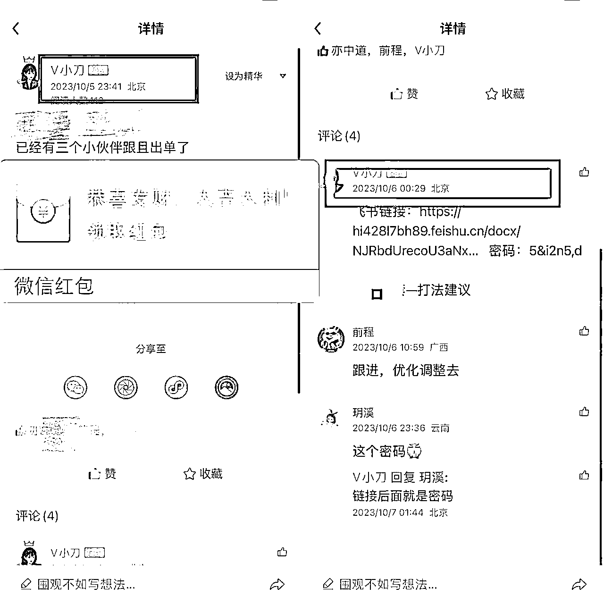

但是最初几天效果一直不明显，很多同行就放弃了这个品。

能出单+流量好+这个品需求真实存在，我觉得必须再博一博，而且因为抖音在爆当时全网已经开始缺货~这爆率很大。

于是快速下了决定，在10.06号这一天，更改了策略，让上这个品的人把价格快速拉到9.9元起量~

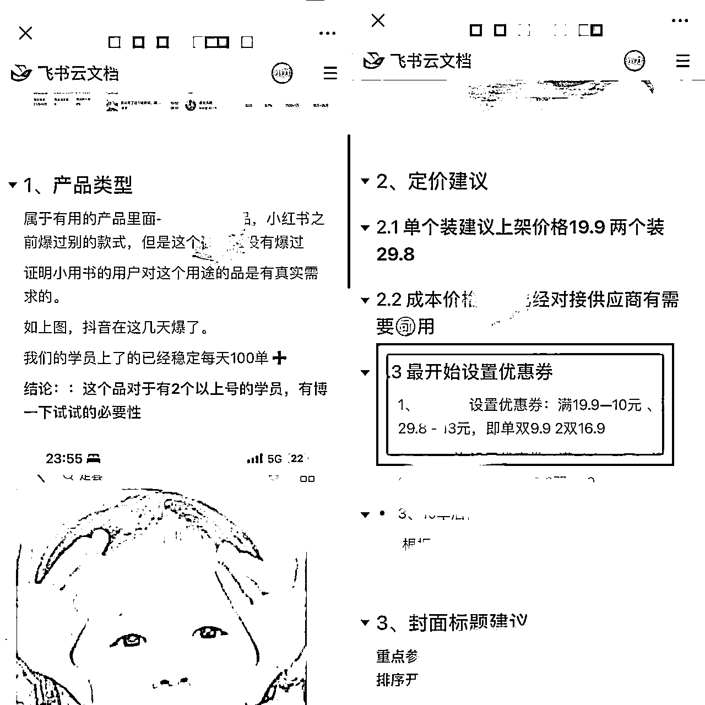

于是，快速起飞了，10.16号这天日3000单。

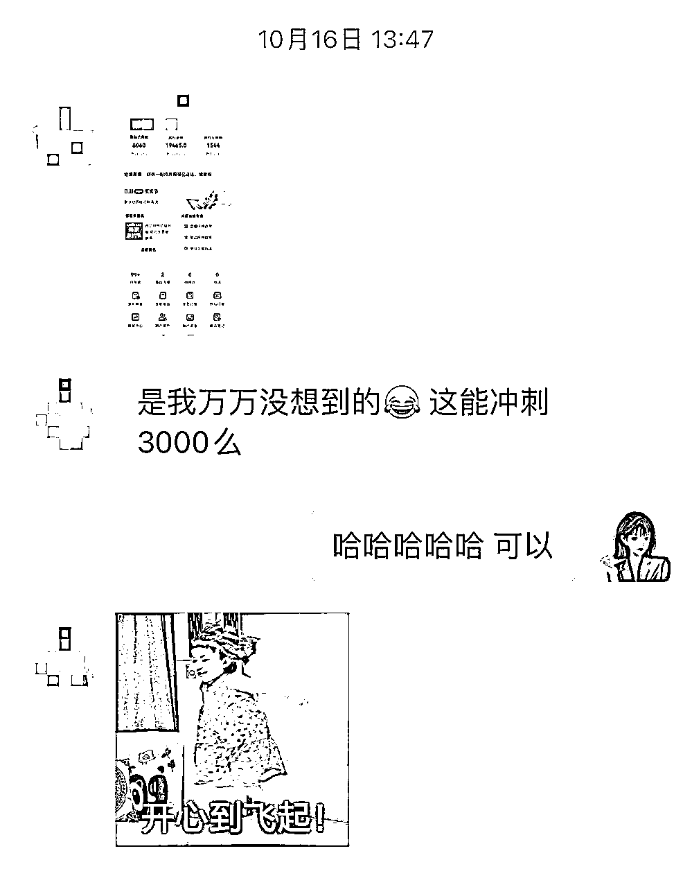

不是只有我们在跑，我们能出来主要2个方面：

一个是笔记封面；

另一个就是我们观察这个品有流量但是不爆，跟转化率相关，所以快速决策把价格压下去了（当时有流量也很好的硬抗跟抖音一样的价格，就废了）。

说这个案例就是跟大家提醒，定价很重要。不是一味的低价竞争而是根据产品情况灵活调整。

卖不出去利润率90%也是0，卖得出去，这种品很快供应商就会降价（产能会过剩），号稳住了后面利润空间大的嘞~

### 1.1很多小伙伴有2个定价误区：

#### 1.1.1认为小红书用户质量高，一个劲加价

这个真的不是开玩笑，我们打品的时候，最开始不乏基础流量比我们好的笔记，但是不出单~

点进去一看价格，真的是没把消费者的智商放在眼里。

用户质量高是指：如果你的产品好、笔记写的好，我出得起高价。而不是，随处可见卖9.9的东西，你非要卖15.9我也买单

#### 1.1.2直接复制其他平台价格 ，不灵活调整

复制爆款产品的定价基本上不会出错误，但是还是需要看目前商品卖爆的程度以及同行的情况、你的出单转化进行灵活调整。

### 1.2 定价方法分享

#### 1.2.1 符合常理定价

能9.9的就不要卖10.9💰，只贵了1元，但是可能导致转化率降低很多。

#### 1.2.2 保证产品利润率。

大家做小红书，尽量保证利润率25%+。平台在你的gmv破1万以后，会扣5%的服务费。

除非品特别好、能走很多量，否则低于25%就没有什么做的必要性了。

#### 1.2.3 具体定价参考商品销售情况

我们在小红书进行产品售卖，那就主要看小红书 这个产品的销售情况。

（再进一步延伸还要分产品是标品和非标品以及溢价空间的情况，这里就以普通商品为主要考量因素进行阐述）

##### 1.2.3.1 如果小红书上没有这个品：

参考这个在抖音和淘宝的价格，甚至再加一些价格。抖音上卖12块9，你可以试试卖15块9（不是非常建议，很容易被别人低价截流）

1.2.3.2 如果小红书上有这个品，而且已经爆了

你的价格尽量略低于同行。

是如果小红书已经有人在卖，价格是15块9。那在他已经爆了的情况下，你想要跟他竞争，价格最好略低于他。

产品刚刚上架的时候，不用非计较几块钱的利润

建议稍微放一些低价单子，通过低价帮你快速出单、提升转化率，从而带动笔记流量。（保证不要亏钱）

1.2.3.3 小红书上有这个产品，但是价格不一

前两天有个小伙伴问：我卖袜子，小红书上有卖9块9的也卖有卖29块9的，我要对标哪个？

这时候建议大家思考这么几个问题：

这个品卖9块9的和卖29块9的的售卖素材（笔记）是一样的吗？卖法一样吗？

粉丝量级一样吗（旗舰店我们不参考）

有的店铺是有一些更高端的卖法，举极端例子：他请了明星代言来卖，你只能混剪，所以它能卖199，但是你不行。这叫卖法不一样，所以我们要看高价的卖法我们能不能做。

结论基本是：如果发现卖9.9的人和卖29块9是一样的卖法的话，对你来说建议先从9.9开始卖，销量大了再慢慢提升价格。

### 1.3 利用优惠券灵活调整价格

墙裂建议大家都用优惠券，我们测过，优惠券用好了真的可以提升转化率。

谁还不喜欢占便宜呢，优惠券那个一划线的价格，就让人有一种【占便宜】的感觉。

具体怎么用会有2个小细节，供大家参考

##### 1.3.1 产品上架的时候售价定高一点

大家在上架产品的时候上架的价格可以定价高一点，比如：

你的产品进价是5块钱，你希望卖9块9，那你上架的时候价格设置可以设置个15块9。

上架完之后设置个6元的产品专属优惠。

这样的好处是，后续你觉得出单很好，想涨价，也不用改动商品的价格，直接修改优惠券的额度即可。

你想售卖价格是12.9，则优惠券改为3元优惠券。

所以大家在最开始上架的时候要想清楚你想卖多少钱和最低能卖多少钱。

##### 1.3.2 设置商品专属优惠券

优惠券有很多种类，建议设置商品专属优惠券，不会因为商品后续多了而把优惠券搞混。

### 1.4 巧设SKU组合

这个对一些低客单价产品一定要注意，如果一个9.9的产品供应商给你的价格是5元，那2个装大概6.5元就有希望能拿到。

就像我们看到很多商家写的【体检装 不推荐 贵在运费】.

这个地方根据你的产品类型设置方法会有区分。

如果你是颜值款式类

比如抓夹：一个抓夹卖9块9，两个抓夹卖15块9，这时候很多人肯定想买2个。

但是买2个一模一样的用不了，会打消一部分人的欲望。

所以这种颜值类产品，你的2个装可以设置同一风格不同款式的sku组合。

实际数据数据验证50%+的人是会买两个装

如果你是用途类

这种一般大家为了用途买单的，只对单一产品信赖，所以只能是把多个装的优惠力度打下来。在主推的SKU上，可以增加（火 划算 等表情 ）增加视觉吸引力，诱导用户点击。

这样的组合设置一方面提升了你的客单价（也就是粉丝价值），另一方面综合算下来你的利润率也不低。

但是不管是什么价位，一定要保证你主推的组合更有优势。

## 2、笔记发布技巧

在笔记发布的时候有一些小细节一定要注意。

### 2.1挂车的时候价格选择最低+打开评论区并填写内容

等你们开通店铺之后发笔记，选择关联商品即可挂车。

挂车的时候，如果你的商品有多个sku（sku简单理解为商品选项），你一定要选择价格最低的选项。

因为你选择哪个选项，对应选项的价格就会展示在笔记页面，低价格有利于提升商品点击率。

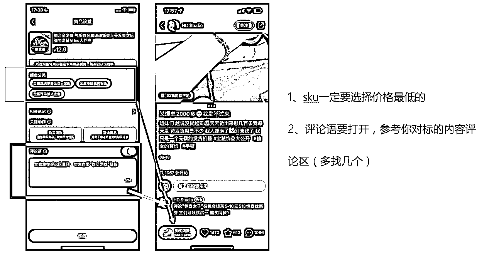

其次，在商品设置页面，有一个评论语一定要打开并填写合适的内容（见黄色箭头指的地方）。

一方面你可以在这个地方填写促销内容，另一方面打开后评论语后面会带有【购买同款】。

这样不仅能提升商品点击率，你还可以进行一些设置提升评论等数据。

具体评论语怎么写要结合你的产品卖点&同行怎么写。

比如图片中示意的是：评论惊喜盒子就可以获得优惠券。

很多人就会跟风去评论惊喜盒子带动了评论量，整体笔记的数据就更好，从而获得更多平台的流量。

### 2.2 这2个地方发笔记 增加流量

正常大家都会直接点小红书中间的加号发布笔记，这样也可以，但是给大家介绍2个其他的发布路径。

这两个路径小红书是有流量扶持的，虽然不多，但是苍蝇再小也是肉，建议去领一下。

（这个其实挺鸡肋的，但是新人多一个小眼睛就多一个正反馈 哈哈哈）

① 创作中心——笔记灵感—随便选一个话题——点进去发布笔记

② 小红书商家版——管理商店——社区热搜词——点击适合你的话题——发布笔记

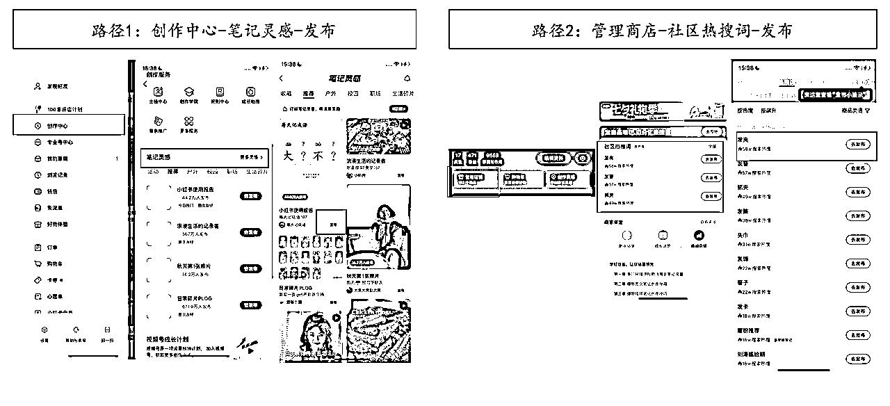

### 2.3 关注官方活动+活动话题

双11这一波，通过在笔记中添加话题，官方的流量是真的咔咔送啊

【下面是双11活动介绍，双12已经快要来了】

【如果你的笔记本身不错，真的会给助力】

## 3、人工干预

开始之前，先跟大家说一下情况

### 3.1 2个注意事项

1、小红书不同于其他平台，本身是不需要s单的，我们的人工干预更多的在于让【笔记看起来热闹】，增加用户信任，而不是通过做人工干预提升链接权重等。

2、人工干预用不好有风险，会提示数据异常互动等， 但是注意细节问题不大。

如果你是新账号新品的话，建议你自己有小号（或者找几个可以支使的动的朋友）。具体我们来一步步操作

### 3.2 具体操作步骤

##### 3.2.1 先养号，把小号打上账号标签

这个有则更好,没有的话影响也不会很大，用户标签指的是你卖什么就让你的小伙伴们多看相关类目的内容。

##### 3.2.2 笔记发出后 如果小眼睛过200 就开始上小号

不要直接搜帐号名字，可以通过搜索【关键词】按照最近排序找到这个笔记或者通过点击进入转发链接的方式，进入这个链接。

点开笔记后要模拟正常用户看完笔记、正常点赞、点开购物车、加入购物车、咨询客服、评论，一整套动作做完。

你平时怎么买东西就怎么操作就可以了~

##### 3.2.3 建议小号真实下单

小红书有晒单功能，好的晒单是可以增加用户对于你商品的信任度从而提升转化率的。

所以建议你的小号直接拍下【数量可以拍10】，实际发货的时候发1就可以。这样避免用户点开看你的商品销量1单2单的，购买欲望就没了~

##### 3.2.4 评论区打造常见话术

更多话术根据自己的类目热门评论内容进行积累

关于我刚打开小红书就花了9.9这件事

已下单 莫辜负

买了，姐妹们蹲完反馈

完脾气不好，要是质量不好我回来骂你

哇趣，这个有意思，买了买了，姐妹们蹲我

##### 3.2.5 收到商品以后进行晒单+评论区好评反馈

大家不要小瞧了评论区的反馈，一个好的评论，能带来很多点赞和跟评，下面这个热门评论基本上都是我们自己的水军，即使不是的，也会第一时间去联系这个评论的人，给到一定的福利让她帮忙好评&晒单。

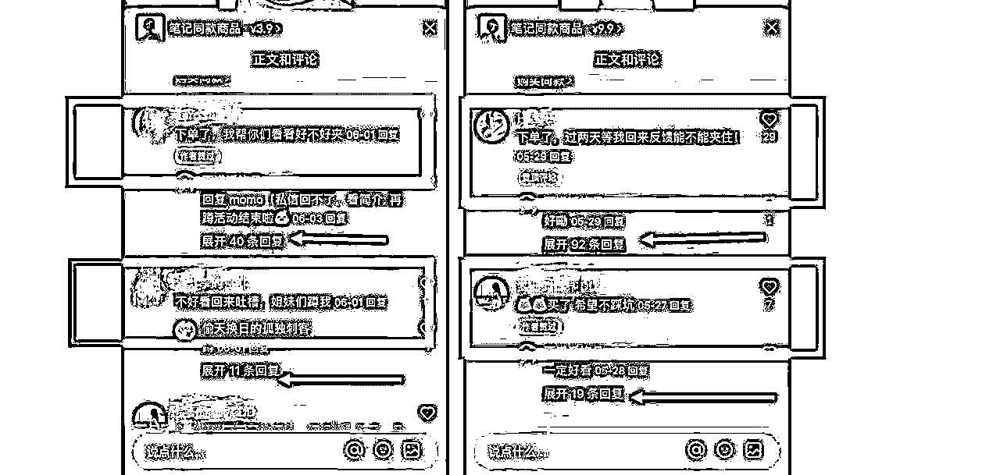

## 4、惊喜盒子起号法

什么叫惊喜盒子起号法？

在上一篇文章里面，我讲到有3种类型的爆品【有颜、有用、有便宜占】，今天补充一个【有便宜占】的起号方法

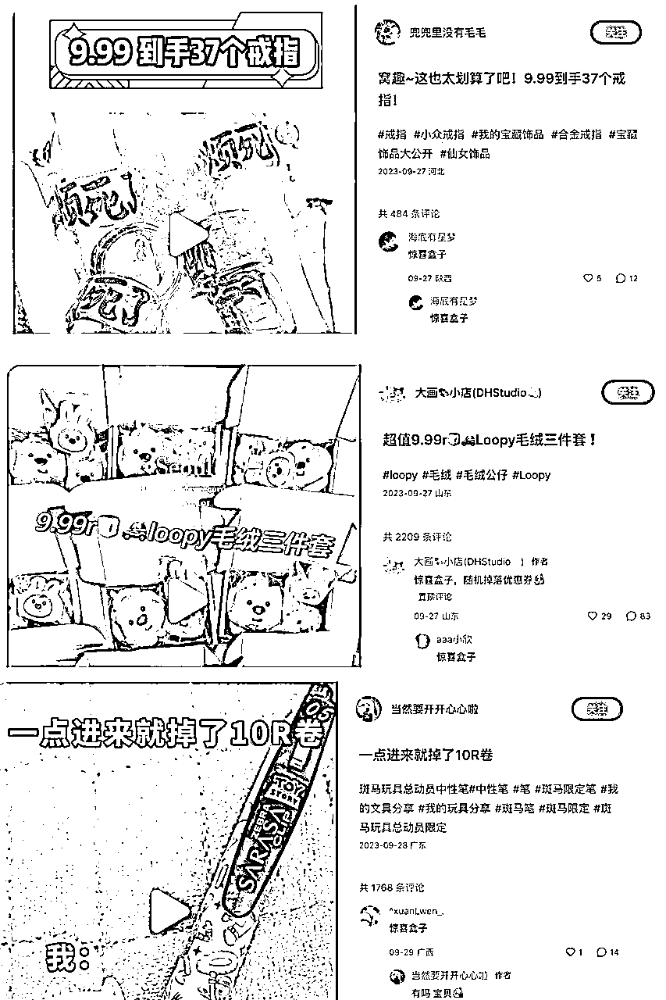

上面3个笔记虽然是不同品类、不同产品，但是有共同点：

1、价格不高，20元以内

2、评论区都是【惊喜盒子】

3、标题直接打的卖点就是【便宜】

4、基本上是大学生喜欢的品（大学生参与意愿墙裂））

如果你的产品本身性价比不错，属于低价类型的产品，就可以用惊喜盒子起号法。

### 4.1 标准版惊喜盒子用法

【标题】突出产品很便宜+【评论区的关联话术】为：评论惊喜盒子随机掉落**元优惠券。

就可以了~很简单。

这样就可以给用户营造有便宜占的感觉，从而实现比较好的笔记数据，带动笔记流量。

#### 4.1.1 标题部分

标题用下面这些有便宜占的模版，更多的大家自行去搜索相关笔记积累自己标题库

超值9.99rLoopy毛绒三件套❗️

领卷10R 烟熏蓝不要太好看了吧！

夏日去黄快乐水！居然9.9就薅到了这个羊毛~

薅羊毛！7.9的化妆包太香了🤩嘎嘎好用

️ 标题价格不可以低于实际价格（比如你说0.9买到了，会有风险，下一部分跟大家说解决方案）

#### 4.1.2 评论区部分

可以直接用【评论惊喜盒子随机掉落**券券】

如果有的话，自己评论一个惊喜盒子掉落的图片评论更好，增加信任度

#### 4.1.3 真的会掉惊喜盒子吗

惊喜盒子其实是官方对用户的活动，用户领到惊喜盒子都是平台补贴的。

我们利用的是信息差，让用户以为评论才能获取，从而带动了笔记数据

### 4.2 进阶版惊喜盒子用法

在基础版本的基础上，有更狠一点的方法，大家先看图片

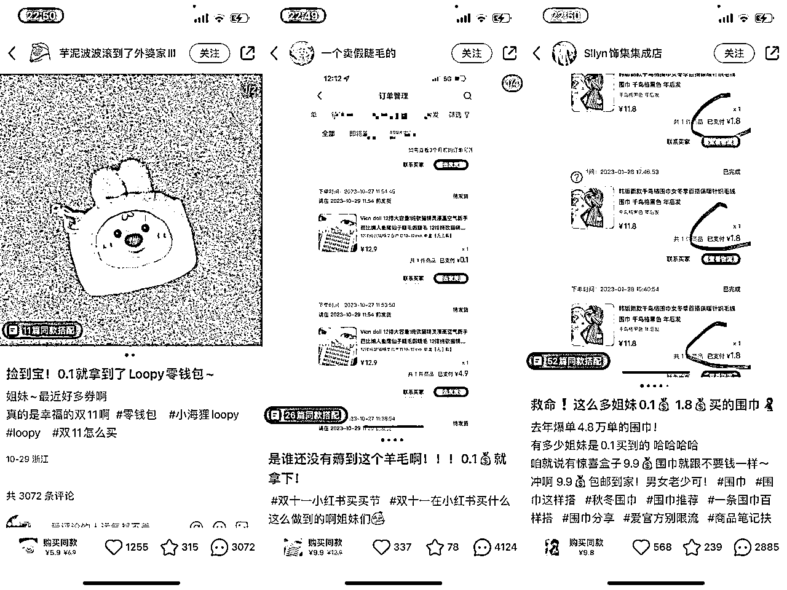

这个是直接利用了0.1 薅羊毛的噱头进行笔记更新。

但是要注意！！！！不要直接用，会违规。如果你想用给你一下小方法。

#### 4.2.1 优先看自己的成交用户最低价

现在小红书平台有很多补贴，实际上很多用户价格特别低就能买到，你找到你的最低成交价格。

如果用户是2.9买到的，你就把0.1替换为2.9就可以了、

#### 4.2.2 自己做一个大额优惠券，数量设置1

这个操作有点骚了，我们目前用了没违规，但是你违规了我不负责哈哈哈

如果都是正常价格成交的，你还想做这个，那深夜发个大额优惠券，自己小号去领一下，然后成交。

你就有了真实的0.1元成交，你就可以用了

#### 4.2.3 不要绝对句要疑问句

【你们是怎么做到0.1元买的啊？？】就比【0.1元买到 】风险更低

### 4.3 要注意风险

4.3.1标签问题

惊喜盒子引来的都是【占便宜的人】，所以有风险会把你账号标签拉到【没有消费力】的人群

4.3.2违规问题

用不对系统会提醒噱头、实际价格跟宣传不符合等~

4.3.3 转化问题

这种方式的笔记整体的转化率是低于正常笔记的

4.3.3产品适配度问题

所以还是回到第一部分的，大家如果是做这种类型用户喜欢的产品的，可以用~如果你做的是高客单价之类的就没必要了。

跟用户一起薅平台的羊毛的方法，要找对人、找对品，才好用。

## 5、数据分析篇

强烈建议大家重视数据分析，因为掌握了它可以让你持续赚钱。

笔记发出去之后，如何判断封面、标题、内容商品是否合适，就是要靠各个细化数据进行，就需要用数据分析来确定你的品和内容是否合格。

在解析这个问题的过程中给力大家一个漏斗模型。

漏斗的第一部分：笔记点击率，代表了用户点击我们的笔记的意愿。影响笔记点击率的是封面和标题。

漏斗的第二部分：商品点击率，代表了看笔记的用户点击我们小黄车的意愿。影响商品点击率的是笔记内容、商品价格展示、评论区等。

漏斗的第三部分：支付转化率，代表了用户点开商品后的付款意愿。影响支付转化率的是产品价格、详情页等。

数据分析的意义在于如果说你只知道说有100个小眼睛流量低，你是不知道怎么优化的。但是如果笔记点击率低了，你就知道去优化封面和标题。支付转化率低了，你就知道定价可能出了问题。所以说不同的数据点代表的背后的问题不一样。

### 5.1 看数据的注意事项

这里跟大家说一个看数据时候的注意事项：

#### 5.1.1自媒体很难有标准的数据值

不同的品类、不同的产品、不同的价格数据是不一样的，没有标准数据。

卖美妆的数据和卖零食的数据一定是不一样的。

所以没有标准说我的数据到多少就一定能爆，平台是赛马机制的，同一时间很多跟你同类的笔记在跟你争流量。你并不知道谁在跟你同时跑，能不能跑赢要看你的同行到什么数据。

#### 5.1.2 数据很少的时候是没有参考意义的

数据量很少的时候没有参考意义的，你的小眼镜一共就100，不用分析，大概率各个方面都有问题。

#### 5.1.3 数据对比才有意义

数据是一个很客观冰冷的东西，只有在对比下才有真实可以指导操作的意义。

你说你产品的支付转化率只有1%是不是有问题？

这个问题很难回答你。但是如果你之前的转化率一直是10%，但现在只有1%，就证明有问题。

一个人130斤胖不胖？他如果跟180斤的人比他不胖，他如果跟90斤的人比，他就是胖的。

一瓶水一瓶水9.9贵不贵跟依云比它就不贵，跟娃哈哈比它就贵。

### 5.2 要看哪些数据

那具体，我们用什么思路去分析数据呢？

前期我们不用苛求自己的数据分析能力能多强，。对于小红书来说，我们能掌握下面3个分析思路即可：

#### 5.2.1 对比思路一：同一商品对比笔记点击率

不同封面和标题的笔记点击率会有差异，毫无疑问，点击率高封面和标题更受喜爱。

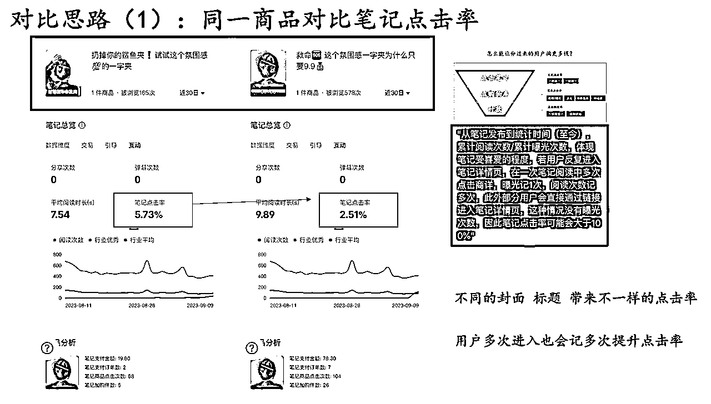

这也是我们为什么要不断的测品。（测品不仅仅是测品本身，也是测什么样的笔记能更好的把品卖出去）

#### 5.2.2 对比思路二：同一商品对比商品点击率

同样一个商品，A笔记的商品点击率40%、B笔记的商品点击率是10%。

那大概率是因为A笔记的内容比B笔记更有吸引力、更能打动用户。

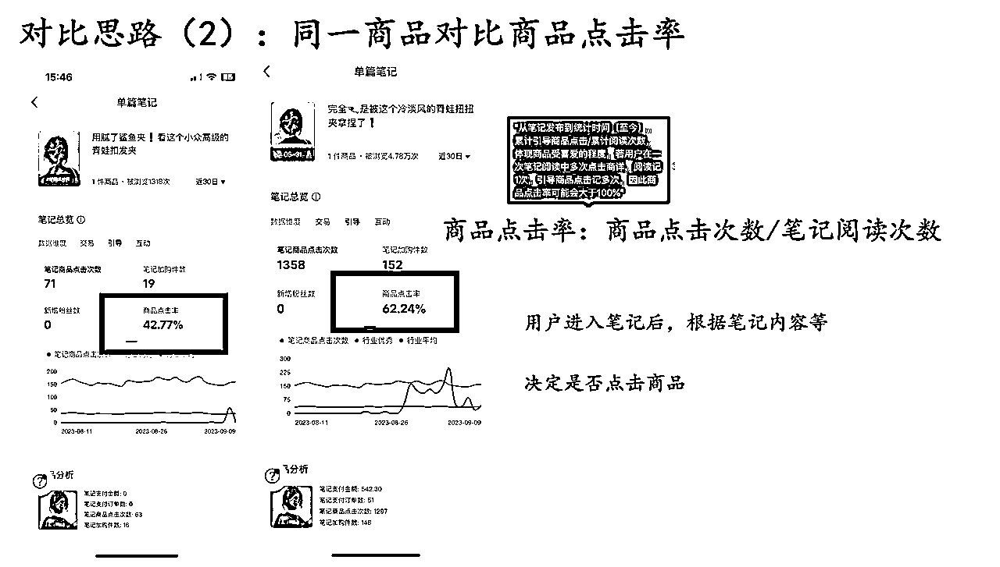

那通过测试不同的内容并分析不同内容的商品点击率就可以知道什么样的内容更容易吸引到用户。

#### 5.2.3 对比思路三：不同的商品对比支付转化率

支付转化率的公式是：支付订单/商品点击人数*100%。

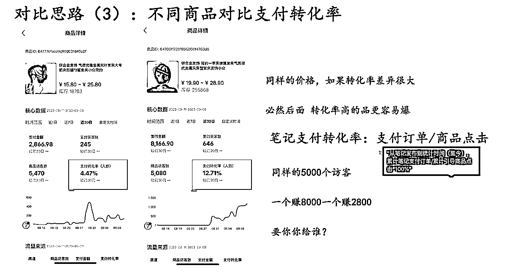

假设你同时上了2款价格一样的产品。但是笔记发出去后，A产品100个点击商品的人20个人付款，B产品100个点击商品的人里有4个人付款了。

这时候大概率是B产品出了问题（产品的详情页吸引力/用户对这个品的价格预期和实际价格的差异）。

那后续B大概率很难拿到流量。

大家还记不记得我说的，平台就是一个严谨的算法，谁能帮他从用户手里掏出更多的钱，他就会给谁流量。

1、同一个商品，我们对比不同笔记的笔记点击率

2、同一个商品对比不同笔记的商品点击率。

但是上面所有的数据都基于一个前提，就是有一定的数据量。当你只有是一个访客的时候，没有必要看的。

### 5.3 从哪里看数据？

数据从手机和电脑都能看，但是大多数情况手机就足够了。

#### 手机端看数据

点击小红书商家版--点击数据中心，页面上可以看总揽/流量/商品/笔记/营销/服务。

对于数据分析来说，对我们比较重要的是：（商品）和（笔记）模块。

两个模块是沿着我们第二部分的数据分析思路：

商品维度：重点看支付转化率

商品维度有个商品排行，点击商品排行，就可以看到每个商品的访客榜和支付转化率，重要是支付转化率。

但是同步也要看商品访客，如果商品的访客特别低，支付转化率就没有意义。一共来了3个人有人买了一个，你的支付转化率是30%。看起来很高，但不能证明你这个品很优秀，可能只是运气比较好。

笔记维度：重点看的交易引导数据

具体的大家自己在自己店铺点一下即可熟悉。

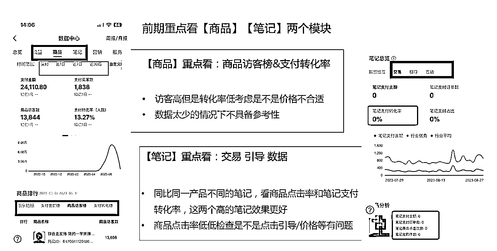

#### 电脑端看数据

登陆网页【商家管理后台】—点击数据——点击数据总揽

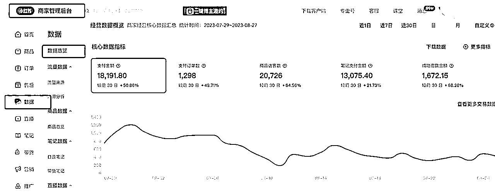

今天主要是跟大家讲思路，让大家对数据有意识。

具体怎么操作，等你发完带货笔记自己的店铺有数据，你按照今天的指引点一点就会了。

看完这一部分内容，你就已经比90%的小伙伴更有数据意识了。

更多小红书的玩法 欢迎勾搭交流~

下一篇如果更新，想分享【小红书私域引流的经验】

这个我们最近做私域，单日单号蕞高引流了300人，有一些细节可以分享

蹲一蹲