# 知识管理赛道，朋友圈发售首次实现月入3w+的颗粒度复盘

> 来源：[https://x6n09emgmm.feishu.cn/docx/BMYedjKcjoFvgwxJuKhc7Wg6nWf](https://x6n09emgmm.feishu.cn/docx/BMYedjKcjoFvgwxJuKhc7Wg6nWf)

大家好，见贴欢喜。我是生财圈友Andrew，是一名知识管理教练，“知识管理五维模型”创始人。

一年前的今天，我还在职场995。

去年裸辞单干后，开始全职内容创业，专注为更多人打造IP知识管理系统，通过知识体系、持续创作来提升IP商业价值。

10月份，我的月营收首次突破了3w，这成为了我创业以来的一次极具意义的里程碑。

以下是这个月的收入截图。

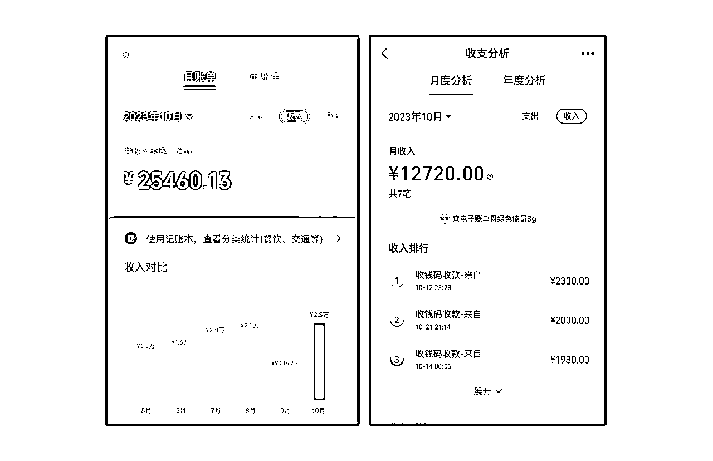

撇去老学员复购、以及上个月付下定金的尾款外，剩余营收均来自朋友圈发售。

这次朋友圈发售，累计持续了4天，发售对象是我的知识管理私教课。

并且，绝大多数的成交偏静默式——直接找到我表露报名意向、甚至上来就打款。最后，总共成交13位全款客户和5位定金客户，累计2.8w。

虽然和很多大佬们相比成绩平平，不过算是我过往几期的朋友圈发售中，表现颇为亮眼的一次了。

从因果律上来讲，之所以会有这个成果，一定是因为我做对了什么。

所以，趁着空闲的时间，我来简单将我过去半年日更朋友圈的经历、以及朋友圈发售的过程，做了次复盘沉淀。

一来为自己总结经验、提炼可以复制沿用的因；

二来，我是喜欢帮助他人的服务型人格，所以很希望通过我的一些经验之谈，帮到一些面临困扰的朋友 :)

全文累计约1.1w字，阅读时间约20min。

以下是这次分享的大纲，可以在pc端的侧边栏点击以快速定位。（如果只想围观朋友圈发售的过程，可直接跳转到第三章节）

1.如何突破发圈卡点，让自己「愿意发」？

2.如何突破信任卡点，让客户「喜欢看」？

3.如何突破成交卡点，让客户「秒下单」？

# 1.如何突破发圈卡点，让自己愿意发？

## 1.1 我以前的朋友圈卡点

其实，我以前是个非常不喜欢发朋友圈的人。可能每年唯一发的朋友圈，就是除夕夜的时候简单发一句祝大家新年快乐，以及转发我自己写的一些公众号文章。

所以，一开始的朋友圈，我经营得其实都相当惨淡，大家眼里，我几乎是个透明人。

至于为什么不发的原因，主要是两个。

## 1.2 卡点1：自我意识过剩

我极度在意外界的看法。这可能和我的高敏性格有关，从小我都是活在他人的眼光下，所以，我认为，「公开发表」这个动作，是一件会让我很羞耻的事。

比如，我花了很久时间反复打磨好了一篇朋友圈文案，在发表前，我内心总会涌现出各种畏惧：

害怕没有人点赞，

害怕读者觉得我观点幼稚，

害怕文章篇幅太短读者觉得水，

害怕论据部分不够有说服力，

害怕一些句子看上去有些装叉会引发一些人的不满...

因此，在「要不要公开发表」这件事上，我会纠结相当长一段时间。

而这些源源不断的念头，我后来接触了阿德勒心理学后，才知道它们对应着一个共有的名字：「自我意识过剩」。

意思是，一旦涉及到人际关系，自己就开始脑补一出大戏，觉得别人时时刻刻不在关注着自己、揣摩着自己。

就好像自己走在路上摔了一跤，然后就觉得全世界都在和自己行注目礼一样。

而「发朋友圈」的动作，就涉及到了人际关系，因为你公开发的内容会被一些人看到，并且可能让一些人产生某些想法、念头。

所以，我们的时间观发生了错乱，开始不断假想脑海中制造的未来：朋友圈的每个好友都盯着自己的朋友圈评头论足、说三道四。

于是，我们就开始自我内耗了，一边精神反刍，一边纠结要不要公开发表。

但事实上，大家都很忙，大家都有自己的事情要处理，没有一个人会故意停下来对着你的朋友圈咬文嚼字。

真正在意这件事的，永远只有你自己一个人。

关于这个卡点，我结合自己的经历提3个小建议：

### 1.2.1 先认清问题的根源，在于自己

是自己为了达到「不想在人际关系中受伤」的目的，才捏造出了那么多的臆想。

所以，问题的根源在于自己，而能解决这个问题的人也只能是自己。

### 1.2.2 自我接纳

诚实得接纳这个做不到的自己，

即使目前写的很差、很烂、很垃圾，这又有什么关系呢？

就像娜塔莉说的那样：

”我才不管笔记本页边或顶端的空白，我把整页写得满满的，我已不再是为老师或交作业而写，我是为自己而写，不必顾虑任何限制，连页边空白也不必在意，这让我得到心理上的自由和许可“。

先接纳，接纳后再练习。

李笑来老师说：“学习能力也好,执行力也罢,核心只有一个，在刚开始的时候,平静地接受自己的笨拙。”

先接纳写得差的事实，再不断得去观察哪里可以改进，然后去写、去练习。

因为，写得差的事实，不是永久存在的。

而刻意练习的方式，100%能通过神经元的强化，让你写得越来越好，道理很朴素、但很有用。

拿我自己来说，我如果不能接纳自己写得差的事实，那么现在的我，可能做不了个人品牌、也收获不到因持续输出而获得的那些变化。

### 1.2.3 课题分离

这是阿德勒心理学的一个招数。

先分辨这是谁的课题？

分辨的方法很简单，回答一个问题：这个选择带来的后果是谁来承担？

不公开发表，那么，无法提升影响力、无法打造个人IP、机会和资源可能性的切断、现状一直得不到改变，这些后果是由我自己承担，那么这是我的课题。

而他人如何回应、评价、攻击或者是嘲笑，这个结果由他人承担，是他人的课题。

所以，我能做的，就是将两个课题相互分离。

我做我自己，至于有没有认可和回应，都是他人的课题。

如果我在意他人的回应，在意他人会不会认可我、会不会嘲笑我、会不会否定我，那便是对他人的课题妄加干涉。

和大家强烈推荐下《被讨厌的勇气》这本书，它对我的启发极大，如果你和我一样也有类似的心灵问题，可以去好好看看。

## 1.3 卡点2：无人回应

当我鼓起勇气突破这个卡点，点击发布按钮后，便又面临了第二个问题：可能没有几个人点赞回应。

让我印象特别深刻的，是有一次，当我鼓起勇气发朋友圈后，每隔几分钟，我就忍不住打开微信，看有没有人给我点赞。

当10分钟过去，小红点始终都没有亮起时，我内心会涌起一股极为强烈的挫败感，并立刻删除了这条朋友圈。

导致这个问题的原因，就是因为，我为「无人回应」赋予了一个负面的意义。

成甲老师在《好好思考》中有列举过一个理论：

美国著名心理学家阿尔伯特·艾利斯提出了的ABC理论，ABC理论是，我们对外界问题（A）会做出何种反应（C），本质上不取决于我们遇到的问题（A），而是取决于我们的信念、看法和解释（B）

也就是说，我们对一件事情的感受，并非来自事情本身，而是取决于我们赋予的意义。

阿德勒有个目的论的说法也很相似，它和弗洛伊德的原因论完全对立。

原因论，是指试图合理化过去消极的行为和态度，将责任推脱给过去。

而目的论中，任何经历本身并不是成功或者失败的原因。

决定我们自身的不是过去的经历，而是我们自己赋予经历的意义。

《高效能7个习惯》也有个类似的概念，叫思维定式：

我们看到的世界（对外界问题），不是真实的世界（不取决于问题），而是在思维定式下，大脑绘制的世界地图，地图是否精确，取决于你的思维定式（取决于我们的信念）

所以，同样一件事，你赋予什么意义，就可以带来不同的感受。

半杯水，有的人很喜悦，因为它还有半杯；有的人很伤心，觉得只剩半杯了

每天早上醒来，有的人认为这又是重新开始的一天，有的人觉得离老去又近了一天...

所以，朋友圈也是一样的道理。

当时的我，所赋予的便是这样的负面意义：

我认为，一篇朋友圈的价值，取决于外界的反馈。

没有人点赞、没有人评论，这个现象就意味着，我的朋友圈是没有价值的。

因此，发这条朋友圈的自己，也是没有价值的。

所以，为了避免再度产生那样的沮丧、挫败的感受，我很不愿意公开发表。

如何解决这个问题呢？其实也很简单——

### 1.3.1 赋予积极意义

通过一条价值观，先来赋予积极意义

一条朋友圈有没有价值，只取决于一个方面：你自己有没有因为这条朋友圈而收获到什么。

你解决了一个问题；你享受了目前的生活；你梳理了一个情绪；你复盘了一个错处；你收获到了客户的肯定等等。

所以，当你在完稿的那一霎那，甚至你还没有公开之前，你就已经赚到了。

而公开发布，只是在将这些富有价值的内容，打包成礼物分享出去，扩大受益面。

没有人点赞，这丝毫影响不到「有价值」的这个事实。

1个点赞，也是意外之喜；2个点赞，5个甚至更多的点赞，那更是赚翻了。

因为，这意味着，你的受益面扩大到了更多的人。

所以，以上的方案总结起来，其实就四个字：「成人达己」，成就他人，找到自己。

并且，找到自己，永远都是第一步，找到自己的心结、接纳自己的一切、专注自己的课题、围绕自身收获赋予意义。

然后，再通过公开化的方式，来扩大它的受益面。

* * *

# 2.如何突破信任卡点，让客户喜欢看？

## 2.1 关于私域成交的迷思

当然，突破了「愿意发」的卡点只是完成了第一步，很多时候，我们写的朋友圈，用户并不是那么感兴趣。

用户更多的，可能是扫一眼就直接划走了，没有留下任何印象。

所以，在开始发售产品后，来咨询产品的寥寥无几。

而且，那些来咨询的人，更多的会心存疑虑，所以需要话术、需要逼单、需要你来我往的拉扯，需要搞一些花式套路。

对于没有来咨询的潜在客户，我们会主动去私聊，并且大部分时候，都得不到对方的回应。

于是，越是这种难题，我们可能就越想要学更多的套路和话术，但很多时候，越是套路话术，我们的产品也就越难卖。

为什么我能说的这么绘声绘色，原因也很简单，我就是曾经深陷其中的一员。并且，去套路客户这件事，本身会让我感到不适。

而导致这种问题的最大原因，就是因为，我们忽略了成交这件事的底层逻辑。

## 2.2 成交的底层逻辑是什么？

成交的底层逻辑，一定在于信任。信任是前提、是内核、是发生成交的根本。

一旦信任没有做好，那么即便用户有极为强烈的需求，在你的产品面前，他也会反复质疑：

为什么我得从你这买产品？

你这个人靠谱吗？

真诚吗？

我付费后愿意帮我解决问题吗？

话说，你不会交付一半撂挑子跑路吧…

在这些质疑之下，我们为了能实现变现，不得不用传统销售的技巧，来进行各种“说服”。

而静默式成交最大的特点是，不靠说服。

因为，在主动找到我们之前，客户在不知不觉中，已经自己把自己给说服了。

为什么会自我说服，原因很简单，因为足够信任，足够确定你就是靠谱的、让人放心的。

为什么会信任，就是因为，客户喜欢看我们的朋友圈，甚至会去追更朋友圈。

比如，我这边就有很多的客户，主动找我说

“吃瓜都觉得很有瘾”

“每天看到您更新的朋友圈，有种想成为您的想法”

“Andrew老师，你闪闪发光，最近总是忍不住去翻看你的朋友圈，太有魅力了”

我几乎就不需要像以前那样，做额外的动作去反复说服对方。

因为，很多客户主动找到我时，第一句话就是：“我想报名你的私教。”

这意味着，客户在进入聊天界面的那一霎那，就已经做好了被我成交的准备。

而且，根据过往的成交历史，我深深得发觉，信任可抵千军万马之力，任何看上去可能会有些阻力的因素，在信任面前都不堪一击。

不论什么赛道，不论客单价是高还是低，不论这个好友有过多少交集，不论我们之前有没有聊过天等等…

我印象最深的，是一位做中端俱乐部的创业者朋友，在加上我的一周内（之前仅仅是互相做了自我介绍而已），便主动袒露对我朋友圈的喜爱，并且在我开始发售私教产品的半小时内，直接找我打了全款。

## 2.3 如何打造客户「喜欢看」的朋友圈？

可能是常年做知识管理的惯性，我有在notion统计朋友圈数据的习惯（包括朋友圈内容、发圈时间、点赞数、咨询数、评分、类型等等方面），自从半年前开始日更后，我就开始统计了。

为什么要这么做，是因为，我想通过数据统计，来找到一些规律，让我了解大家更喜欢什么样的朋友圈。

而当我持续日更并统计了一段时间后，我惊讶得发现，高赞的几十条朋友圈，呈现出惊人的共有规律：

这些朋友圈，基本都是在输出关于我的一切。

比如，当我在朋友圈中加入我的故事后，便会吸引到很多点赞，而那些没有加入“我”的朋友圈，点赞量都少得可怜。

另外，按理来说，广告类朋友圈应当是没有人愿意点赞的，因为广告涉及到商业利益、是在索取价值。

但是，当我在很多产品软广中，也揉入我和学员、或者我和产品的故事后，却也能收获到不少的点赞。

所以，我便开始坚信：输出关于自己的一切，就是建立朋友圈吸引的核心。

而后，当我看到越来越多的大佬也在强调这个观点时，我就更加确信了。

靠谱说：你会吸引到跟你情绪共鸣、经历共鸣、价值观共鸣的人，TA 认同你这个人，自然会认同你的产品。

在私域，人的 IP 先于产品。

芷蓝姐说：内容输出，一定要紧紧围绕自己进行，作为一个内容创作者，“真实”就是你的独家武器和别人无法跨越的壁垒。工具可以复制，行为逻辑可以复制，甚至是文笔都能复制，但唯一不能复制的，就是每个人的真实生活。

小鹿说：IP的核心，在于用户是奔着你这个人来的。同样的产品，比起别人，ta更愿意信任你，这就是IP的魅力。

所以，让客户喜欢看的关键，在于你能不能输出真实的自己。

而让客户一直追着看的关键，在于你能不能持续输出真实的自己，将关于你自己的点点滴滴，全部真实得展示出来。

关于分享自己的哪些方面，我来结合我以前发的朋友圈，简单和你分享下：

### 2.3.1 你可以分享自己的生活

比如你吃到的美食、烹饪的佳肴、看到的风景、家里的宠物等等。

这些圈的作用，就是让用户感知到你的温度，感知到你是一个有血有肉，有自己生活的人。

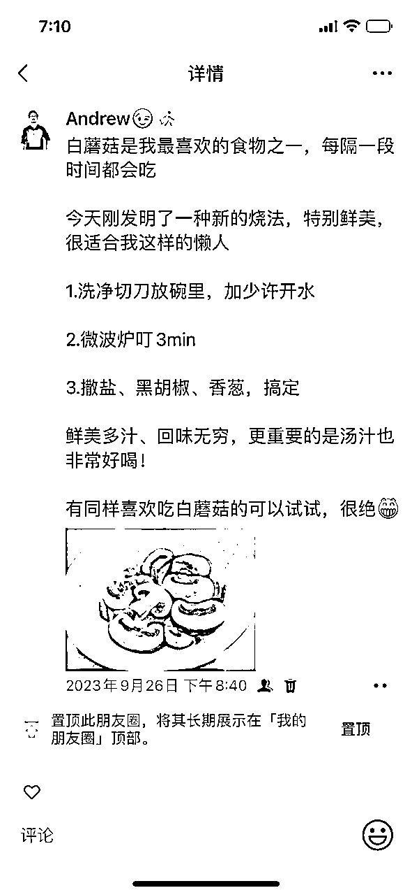

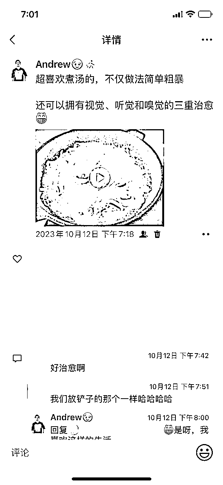

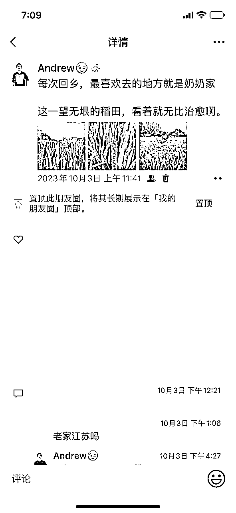

### 2.3.2 你可以分享自己的童年故事

为什么要发童年故事，是因为某些童年记忆，会是很多人的共有经历，所以当一些人看到，可以唤醒他们的记忆，引发他们的情绪共鸣。共鸣有了，意味着“你们是同频的、你们是一类人”，所以自然能增加信任。

我会喜欢在一些传统节假日发关于童年记忆的朋友圈，比如中秋节、七夕节等等，因为这些节假日，很多人的童年记忆都会很相似。因此，这些朋友圈的互动也都特别高。

比如，七夕节那一天，我会说，小时候听信外婆的故事，下雨天去葡萄酒下听牛郎织女说悄悄话，然后啥也没听着的经历；

中秋节那一天，我会说小时候，父亲骑着二八大杠去买苏式月饼，那会就是普通的油纸包装，每次吃到五仁都喜欢把红绿丝挑出来扔掉。

而这两条圈的互动就特别高。

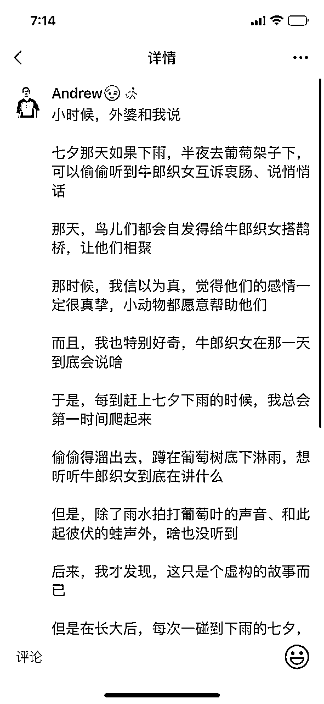

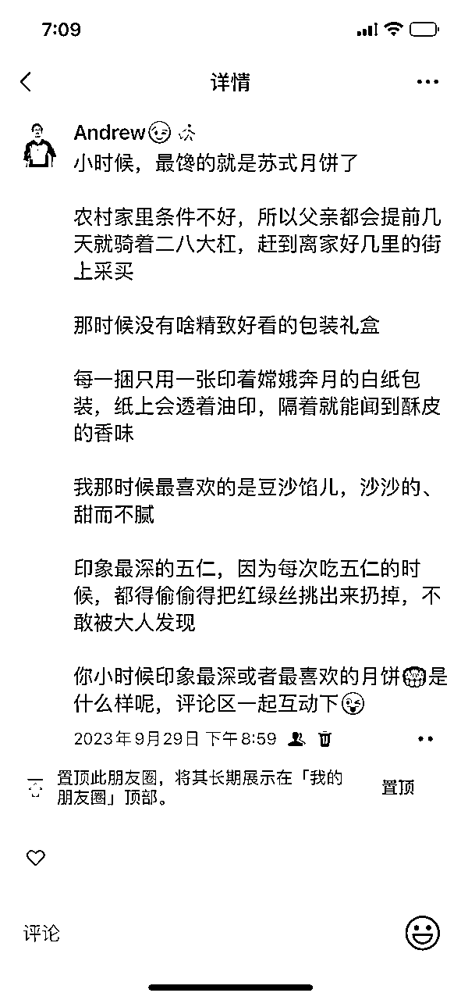

### 2.3.3 你可以分享自己的弱点、软肋

个人IP并不是说，一定要360度多么完美、没有死角的人设。

而是，展示完完全全真实的一面，哪怕是自己的弱点、软肋，都是加分的。因为，读者可以直接感知到你的真诚。

比如，当我曾经在朋友圈里表露自己的内向、社恐后，反而能获得非常多的欢迎。

尤其是下面的第一条，我询问过，有不下5位的客户都因为这条圈被我深深打动，而愿意在我这里下单。

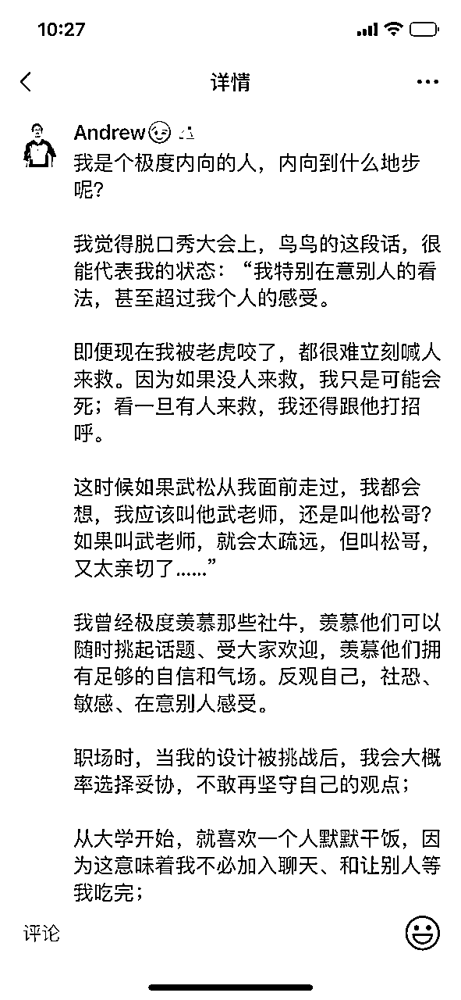

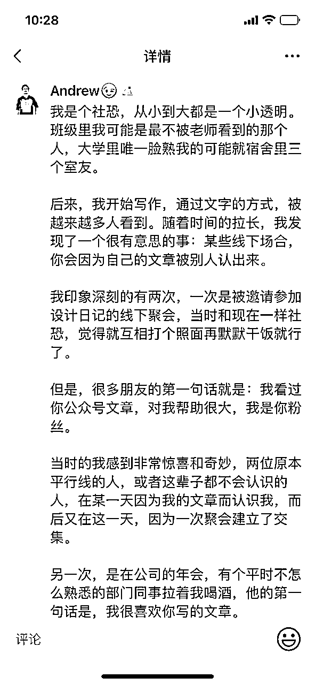

### 2.3.4 你可以分享自己的遇到的烦心事

虽然是烦心事，但最后也可以转化为「自己如何接纳、化解」。

就像我们看电影那样，在主角陷入苦难和泥潭后，总是可以通过贵人的指点、主角的努力，获得一个happy ending。

所以，抓住你每天的挑战和烦闷，因为，这意味着，你有机会来导演一场属于你自己的小电影，并且在朋友圈“公映”。而这样的小电影，大家又偏偏很喜欢看。

比如我在上周发的这条朋友圈。当时跑了老远去办公积金，因为材料带错了很郁闷，然后想着，来都来了倒不如去附近逛逛呢。并且，在心情逐渐变好后，我就想到了，为什么不把这件事发到朋友圈呢？

不要让到手的肥鸭子飞走，每一个肥鸭子都可以变成你的生产资料。

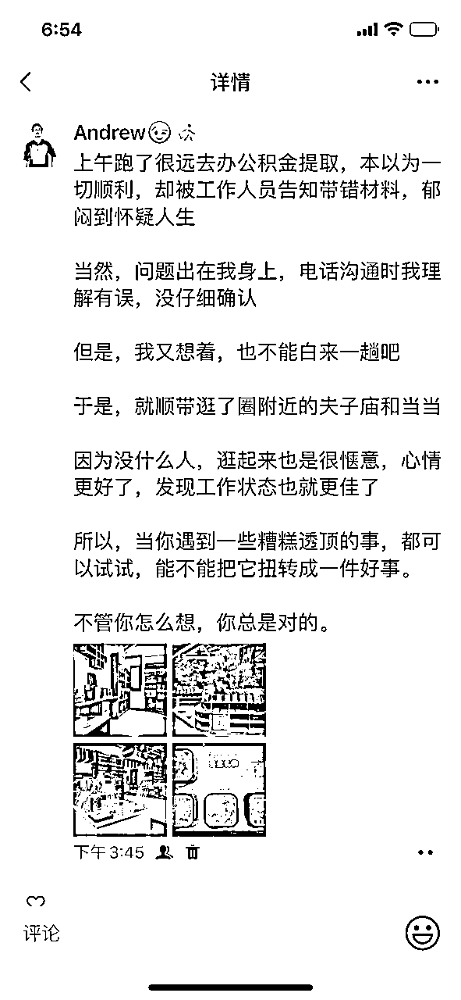

### 2.3.5 你可以分享自己的成就

不论是过往的，还是刚刚实现的。

通过自己一次次的小成绩，来告诉大家，你一直在成长的路上，一直在不断突破自己的路上。

大家都慕强，但是大家更喜欢看到一个普通人，如何通过做不普通的事，来变得不普通的过程。

比如我，第一次被生财邀请做高手分享、被思念老师邀请做社群分享；

第一次拿到了航海巨人、拿到了前三；

flomo一个月输出了15w字等等，这些都能让读者看到我的成长。（尤其是你的第一次，这些一定要发圈来展示）

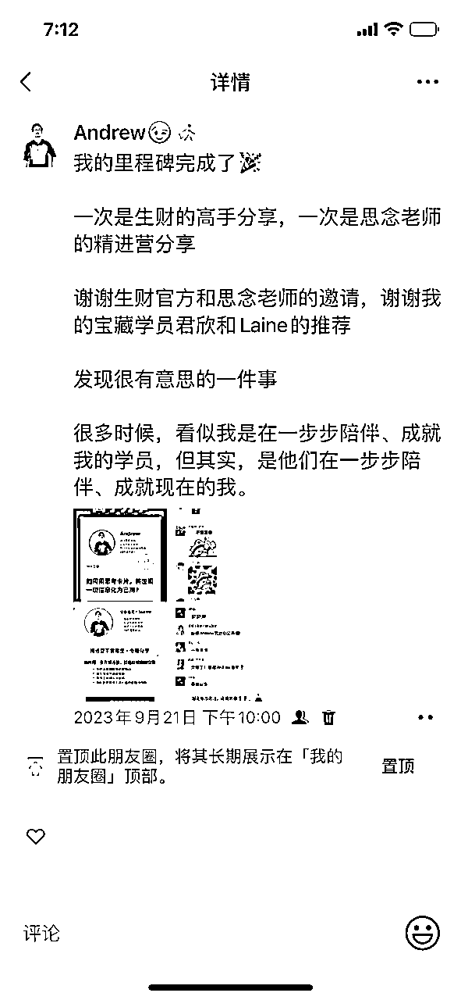

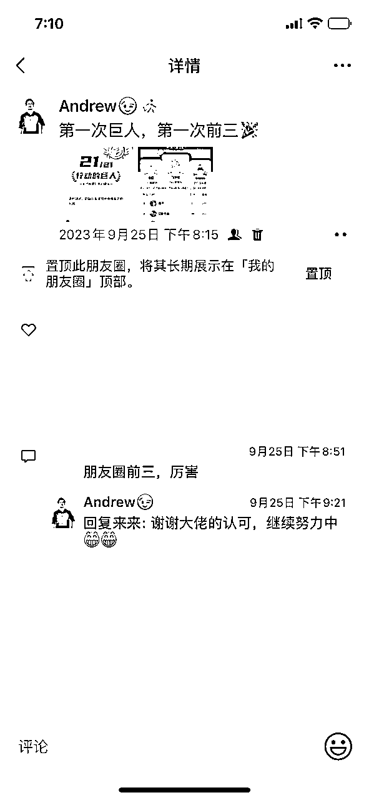

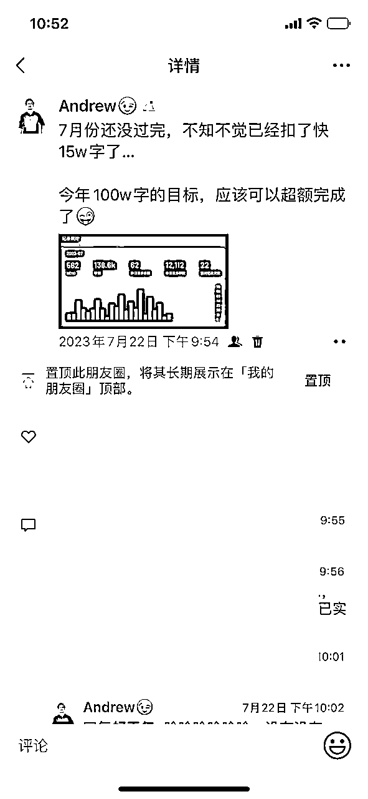

### 2.3.6 分享自己和学员、产品的故事

大家都喜欢故事，这意味着，当你试图将广告变为一个个小故事时，可以抵消大家对广告的反感。

比如现在很多电视剧广告，都会直接套用电视剧的角色、情节来营销，我印象比较深的，就是剧版《三体》的TCL电视广告，很好得串联了宇宙闪烁的剧情，当时我看完后觉得特有意思，一点也不排斥。

而这也是在将广告故事化。

而我们做自媒体，也完全可以套用这个思路，比如产品故事、比如用户故事。

拿我举例，当我熬夜做涨价海报时，我就可以作为产品故事发圈，而且也在侧面暗示大家，我的产品马上涨价啦。

当我拿到学员的肯定认可时，我也可以作为学员故事来发圈，让大家看到客户证言，从而加深对我的信任。

当我收获到第一个成交时，我也可以写个成交故事，通过这种温和的方式，提醒大家了解和咨询。

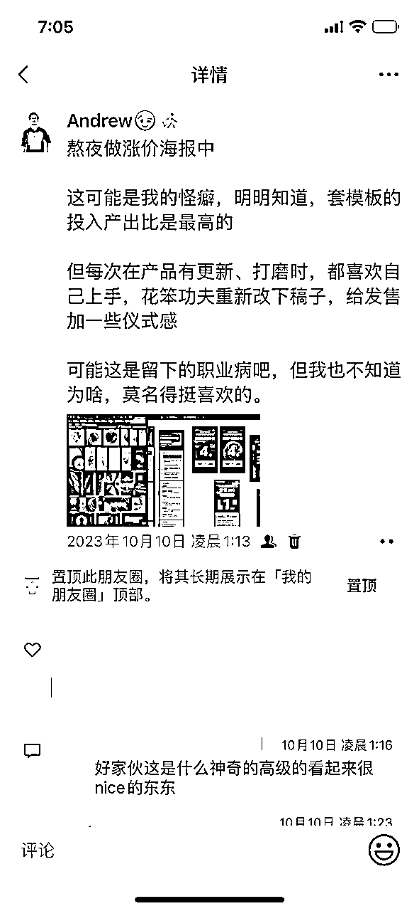

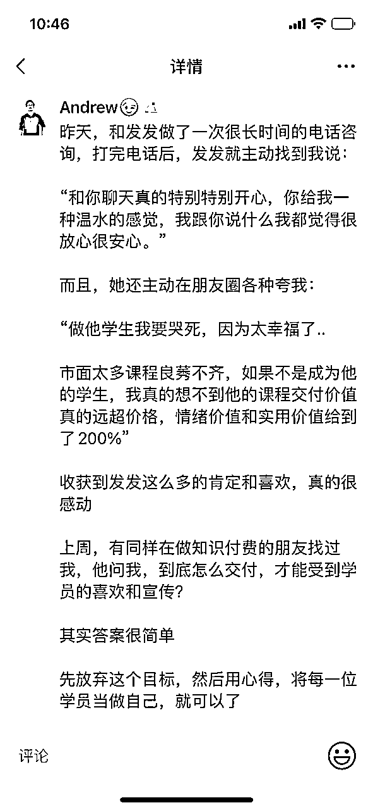

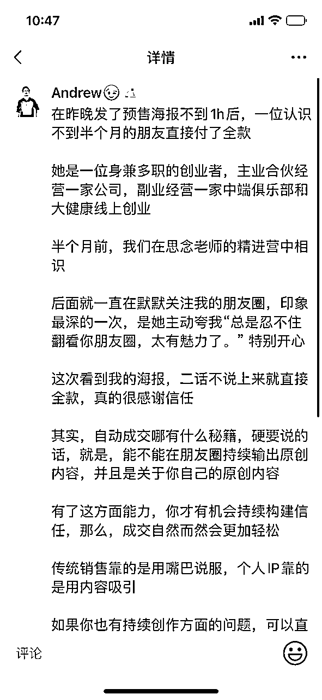

### 2.3.7 分享遇到的问题，以及解决的过程

通过这些朋友圈来直接传达实用价值，让用户觉得“有用”，某种程度上也可以增加信任。

比如，我在pdf资源管理上遇到了很多痛点，最终都解决了，于是我就把问题、原因以及最终亲测有效的方法汇总成一条朋友圈，直接帮到一些有相同问题的人解决问题；

另外，如果这个问题比较棘手，其实也可以通过「互动圈」来征集大家的智慧，最后接一条解决反感。

比如，我有一天遇到了iPhone闪退的问题，直接发了条求助圈，一方面想征集大家的方法，另一方面可以增加互动；

并且，在这个问题解决之后，我会将问题原因、以及方法步骤再发一条圈，并感谢给出方案的朋友。一方面直接提供了实用价值，让遇到相同问题的人知道怎么解决；另一方面通过“接上条”引导大家进朋友圈，提升朋友圈曝光。

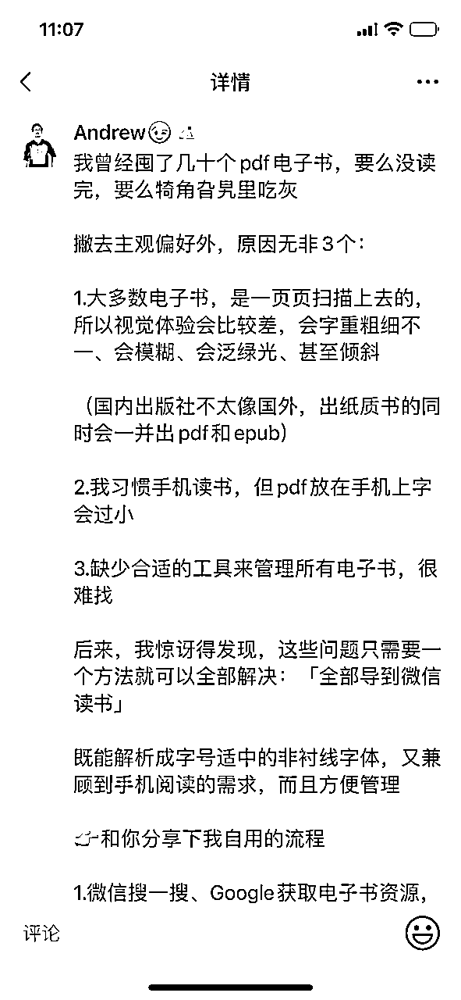

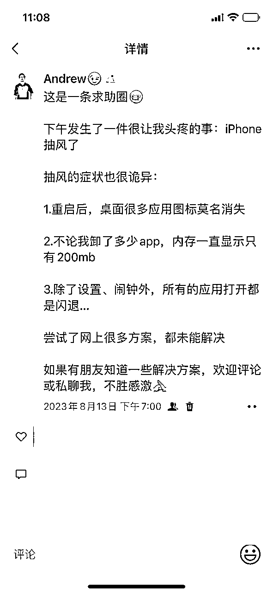

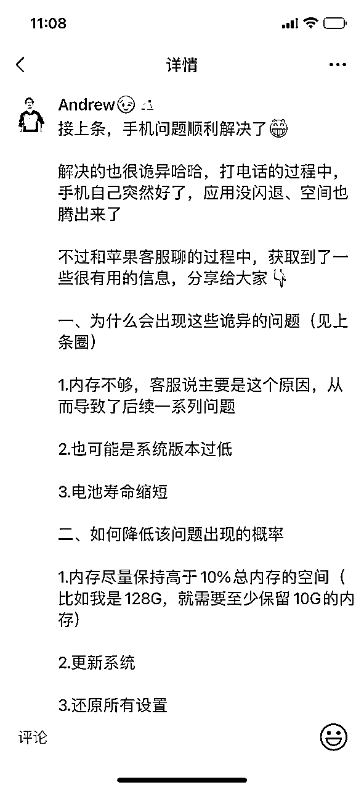

但是，问题又来了。

## 2.4 我们该如何想到那么多故事呢？

和大家分享两个很强的招式。

一招是每日复盘，我目前每日复盘已经做了600+天了，这个习惯的甜头之一，就是让我能有意识得觉察、捕捉到我的这本“无字之书”。

后面我要输出，只需要从每日复盘中慢慢挑选。

另一招是做思考卡片，通过思考卡片来一步步联想、挖掘到我们过往的一切经历。

关于思考卡片的详细方法，大家可以参考我之前在生财做的这篇高手分享，写的非常详尽：https://search01.shengcaiyoushu.com/docx/HsqKdEhyvok44XxxGCRcgwsBnIg

通过持续的输出关于自己的一切，便可以持续不断得积攒信任。而信任积攒到了某个阈值后，一旦开始正式发售，成交这件事，便会自然而然得发生。

# 3.如何突破成交卡点，让客户主动找你下单？

这一部分，便是此次朋友圈发售的全程。

## 3.1 产品介绍

朋友圈发售的对象，是我的客单价￥1980的的知识管理私教课。

这个私教课主要面向自媒体创业者，帮助他们通过知识管理系统，来打造持续输出引擎，提升ip商业价值。

下面是最新的一些相关海报、课程大纲。

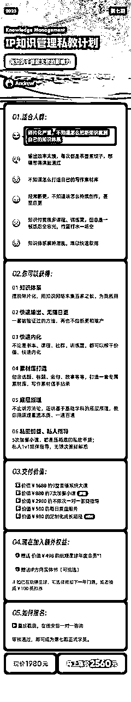

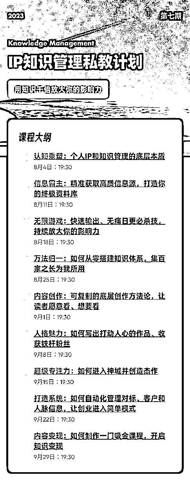

关于为什么要做这样一款产品、以及产品的更多详情，可以参考我之前写的这篇帖子：成功转型自由职业，知识管理赛道单场群发售营收2.5w的颗粒度复盘，适用于所有创业者

## 3.2 涨价背景

在9月份，我没有像往常一样对外招募学员，主要是因为，产品的课程、服务模式在做新的升级和调整。

但是打磨需要耗费精力，所以9月份就停止了招募，不再额外投入时间。

产品升级的同时，加上一些学员也在催涨价，所以就下定决心，到10月份再开始新一轮的招募、并且正式宣告涨价。

这次朋友圈发售，累计持续了4天，绝大多数的成交偏静默式——直接找到我表露报名意向、甚至上来就打款。最后，总共成交13位全款客户和5位定金客户，累计2.8w。

我认为，很大一部分原因，在于我在上面所说的，通过「输出关于自己的一切」，来让用户喜欢看，先一步积攒信任。

信任到位后，大家也更愿意因为【信任你这个人】，而自我说服，“隔空成交”。

不过，信任到位后，该如何通过朋友圈发售，来更好得刺激客户下单呢？

下面，我将此次朋友圈发售的全部流程做了沉淀，总共分为8步

### 3.2.1 提前植入涨价缘由

芷蓝姐在这篇文章《我是如何在30天内用朋友圈剧本＋快闪群成交，给我的新舞蹈室赚了6万块钱的？》，提过一个让我至今印象都极为深刻的观点：

没有一个用户喜欢被「告知」、被「强推」，一旦被强推了，他们很容易产生抵触心理。

所以，我并没有直接发朋友圈和大家官宣涨价，而是提前规划好了发圈节奏，通过先在朋友圈造势，来给后面的涨价做铺垫。

造势的方法很简单，找一条朋友圈专门讲清楚「涨价的缘由」。

比如，我在9月24号，就发了一条这样的朋友圈来表达涨价缘由。

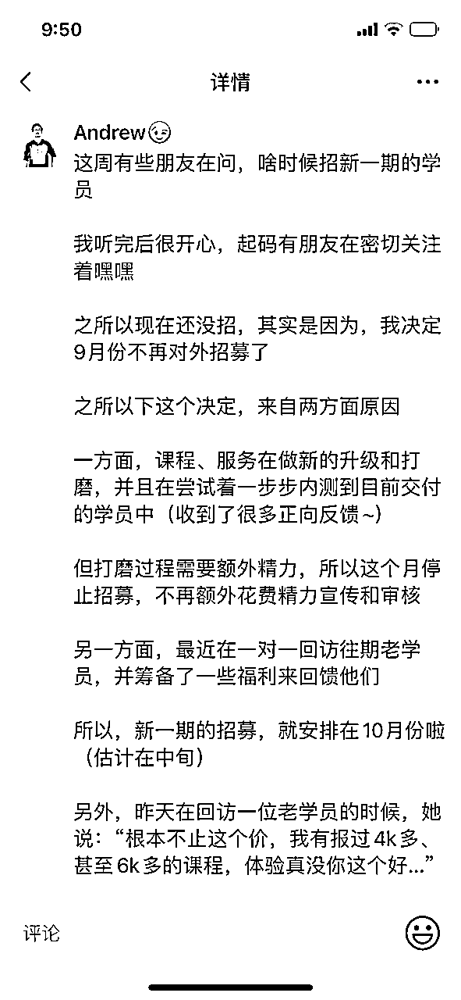

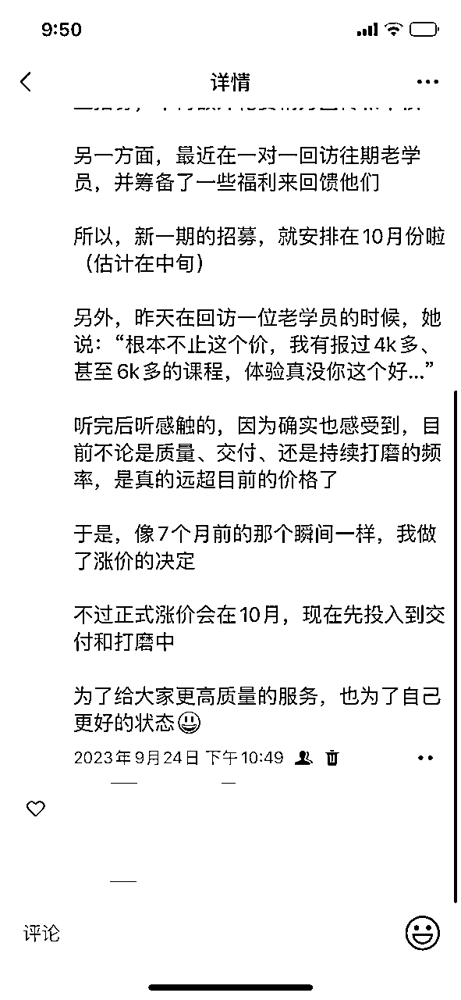

我来给大家拆解下。这条朋友圈，我包含了以下几点要素：

1.给明9月份没有对外招募的原因

一个是课程服务有了升级，一个是在做老学员回访+福利。这两件事都比较占据精力，所以实话实说就可以。

2.给明涨价的原因，这个是重点

比如我这里，一个是来自老学员的反馈“根本不止这个价，我有报过4k、6k多的课程，体验真没你这个好”，这里着重突出「超值」「便宜」。因为真正有说服力的永远是客户证言。

所以，你也可以去留意下这样的反馈，因为它们都可以成为你后面涨价的底气。

另一个，来自我自己的观点，「不论是质量、交付还是打磨频率，其实已经远超目前的价格」，这样也可以从侧面传达我对于这款产品的自信。

3.点下涨价的时间

目的是让大家有个缓冲和观望的时间，也可以传达出时间紧张的感觉。

### 3.2.2 使用更多的软广预热

发完这条朋友圈后，相当于你的涨价动作有了依据，接下来，就开始增加软广的发送频率，慢慢给后面的涨价预热。

我发的这些软广主要是学员的好评、报喜，目的是为了通过客户证言，是传达出这样一个信息：

大家都通过我的产品拿到了结果（比如以前输出困难户，现在能做到轻轻松松快速输出），所以，我的产品是有用的、是值得涨价的。

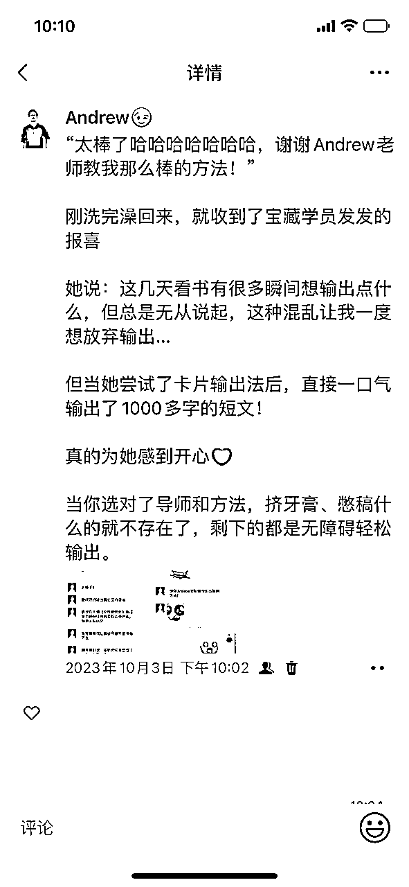

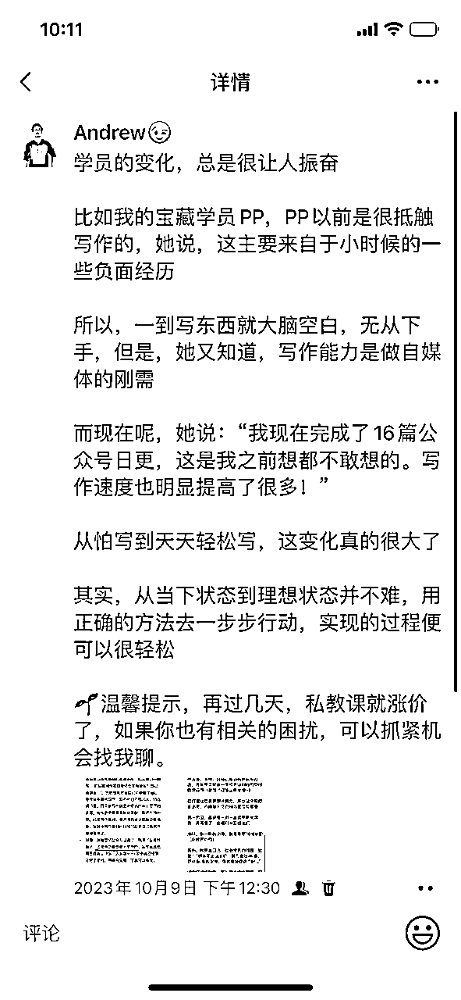

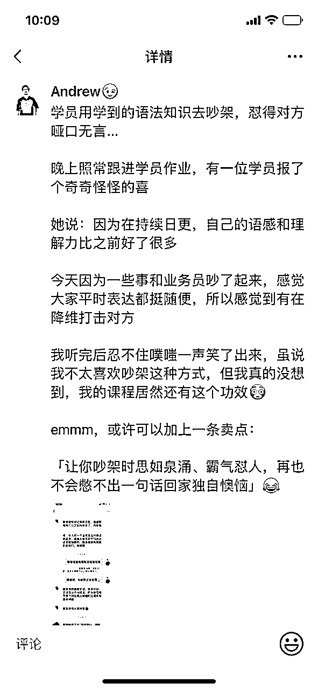

### 3.2.3 更多得展示自己以增加信任

给涨价做铺垫，并不是全发各种软广，我认为，反而要更频繁得去展示自己的一切。

毕竟，前面我们也有说，成交的本质在于信任，而这个信任，更多的是对你这个人「人格」的信任。

卖货先卖人，那么在准备卖货前，需要先用更多的篇幅来对外展示自己，让大家在不知不觉中被慢慢吸引、积攒信任。

这类朋友圈，无非是晒自己的生活、童年故事、成就、成长等等，直接参考上面的章节就可以，具体就不赘述了。

比如，我就增加了很多这些类型的朋友圈。

国庆节，正好有时间去乡下看望奶奶，那么我就可以通过晒乡间景色的方式，来给大家展示我自己的状态；

看书时，突然回想起几个月的观点被朋友驳斥的经历，那么我就可以通过这个故事，来引出我自己的价值观；

朋友圈被朋友夸了，那么我也可以通过晒他人的夸夸，来展示我朋友圈的价值等等

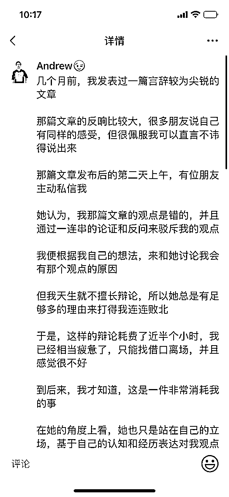

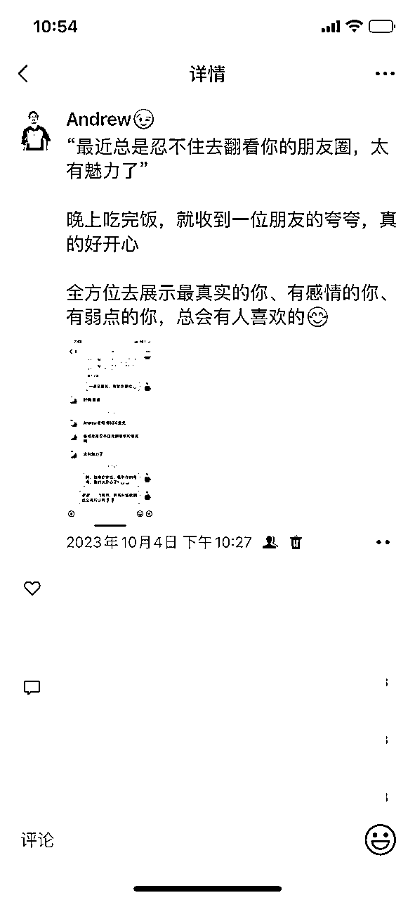

另外，哪怕是准备发售的过程，也可以向外展示。

比如，在官宣前一天，我在熬夜制作海报，当时就突发奇想，为什么不把我做海报的过程，也给发个圈呢？

于是，我在凌晨1点多立刻截了图，并简单配了条文案发圈了。

一方面，通过直播自己的感受和想法，让大家感觉到我的真诚；

另一方面，自己给产品做海报的习惯，也让大家觉得「我对于每一次发售都很认真」，这个其实也会很加分.

而且，设计稿上倒计时的数字，也可以从侧面传达出离涨价仅剩4天的信息。

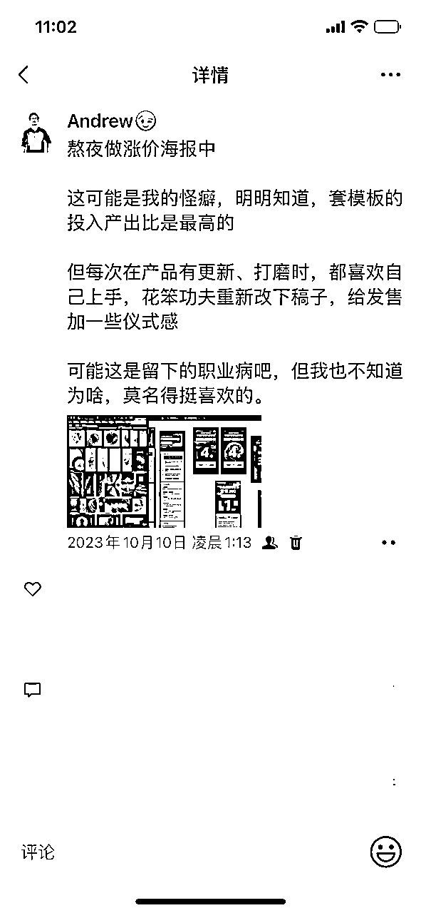

一条朋友圈就能实现这么多好处，很划算。

所以，如果在产品宣发前，你在做很多的准备工作，那么不妨用讲故事的方式，把这些工作也都给展示出来。让大家目睹到你的用心和认真。

### 3.2.4 如果有成交，及时晒单

因为前面有提过即将涨价的讯息，所以在涨价前的一段时期，可能会收获到一些成交。

这时候，完全可以晒出来，并且在文案最后露出涨价的元素。目的是，让更多的人知道2个讯息：

1.现在就可以开始购买了

2.过几天正式发售就会涨价，所以可以抓紧时间了

比如我的这两条朋友圈，底部都会透露过几天涨价的信息。

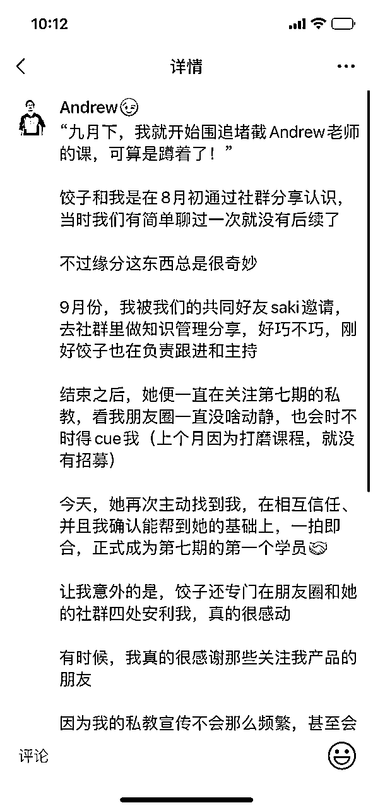

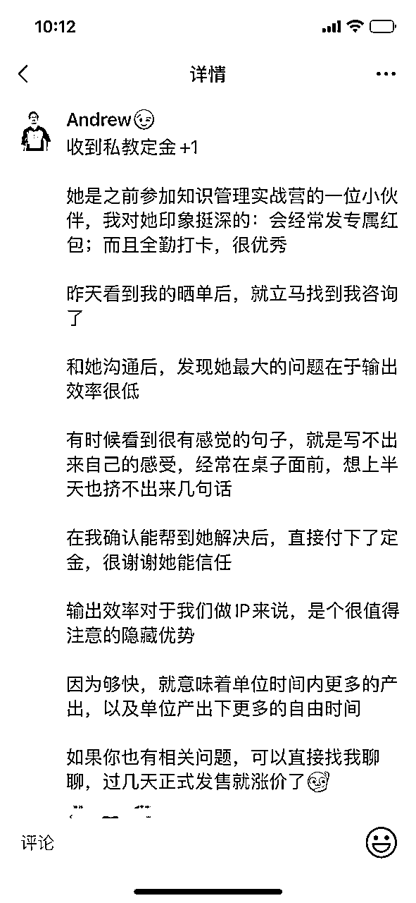

### 3.2.5 涨价官宣

【对应时间】发售的第1天

之前我上过小鹿老师的朋友圈课程，她所教的一些发售模板、文案给我启发非常大。

所以，我就结合了自己的情况做了一些调整，并做了这条涨价官宣。

最后的效果很不错，当天就收到了2位私教全款，并且通过这个官宣下单的客户，总共有5位。

基本框架，我来提炼一下：

正式官宣+整体情况+客户证言+卖点+涨价细节+行动指令

#### 正式官宣

这个很简单，就是先直接和大家吆喝，比如我这边开始正式发售了，马上要涨价了~

#### 整体情况

通过一些数据来侧面展示自己的经验和产品受欢迎的程度，同时引出下面的客户证言。比如交付了xx位学员拿到了xx结果，学员好评率/转介绍率达到了xxx。

#### 客户证言

直接用以往客户的反馈，来证实你产品的质量。这些反馈一定要挑选最吸睛、最能引发情绪的那一类。

比如xxx真的太值了、完全解决了xxx的问题等等

#### 卖点

包括你的产品能解决什么问题、你可以收获到的价值、以及产品的额外权益等等。

这些东西，要尽可能覆盖面向人群都有的痛点、或者痒点。

#### 涨价细节

说明几天后就要涨价，以及涨价的幅度

#### 行动指令

通过行动召唤型文案，来刺激那些有意向的客户来直接找到你报名。

没有行动指令的话，本来很有意向的客户，可能就会因为不知道怎么下单，而降低了行动的概率。

另外，这个行动指令，我也在评论区同步了，目的是通过多次的露出来提醒客户下单。

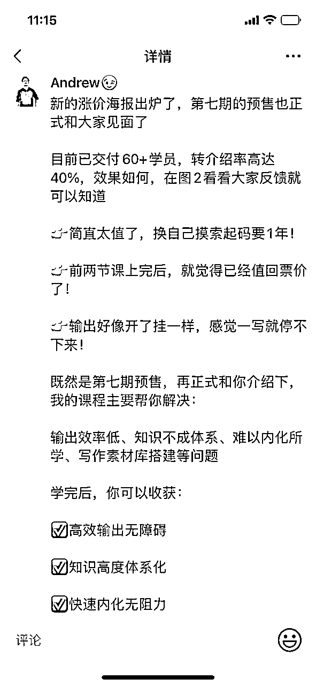

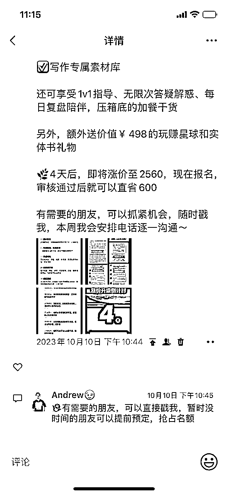

### 3.2.6 持续得铺软广、晒单

【对应时间】发售的第2~4天

只要拿到了学员反馈、成交订单，就可以开始晒了。

通过学员反馈，来告诉用户，我的课程、服务是经过大家验证的、是可以帮大家解决问题的，所以你有这方面的问题，我也可以帮你解决。

通过成交订单，来告诉用户，已经有人在我这里下单了，你还不上车吗？大家都有从众心理，如果有这方面需求，看到他人下单后，也很容易形成刺激。

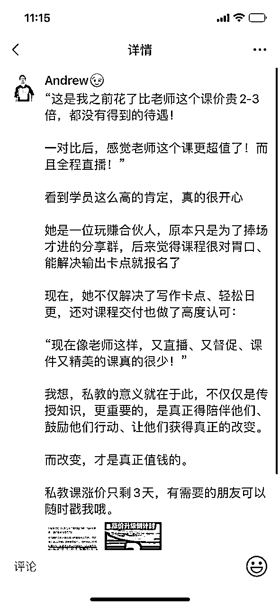

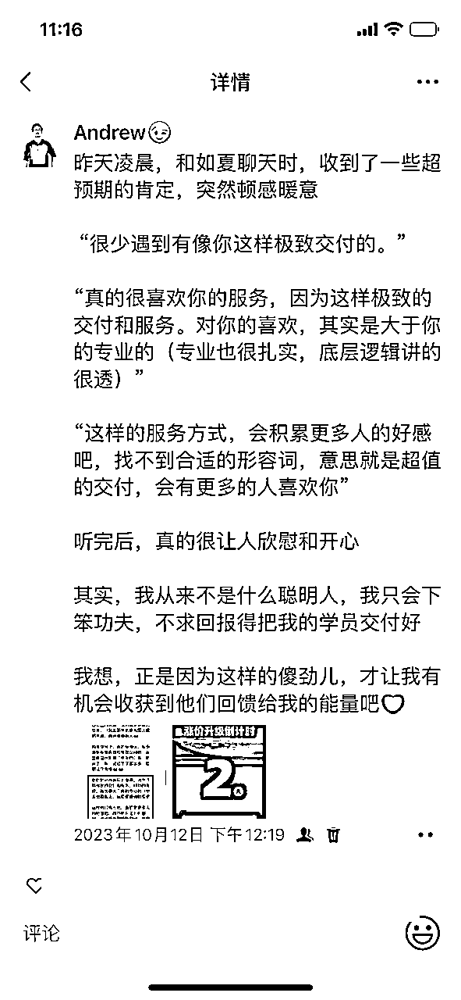

这个阶段，我来分享一些小技巧：

1.可以提前把一些好的学员反馈给攒好，避免发售期间没有反馈可发

2.配图记得加上倒计时海报，相比文字，最后xx天的图片更能吸引大家注意力

3.软广中可以用对话的形式，穿插学员的真实反馈，增强代入感

4.官宣的朋友圈记得置顶，这样的话，后面新加你的好友，就可以通过置顶朋友圈第一时间知道你的产品。

### 3.2.7 涨价最终倒计时

【对应时间】发售的第4天

因为第四天过完就正式涨价了，所以这一天直接怼量就可以。我在这天，总共发了8条广告。

一开始，我还在顾虑，这么频繁发会不会让大家反感。

但是后来一想，我也不是每天这么刷，况且并不是每一位用户都有时间把我们所有朋友圈看完的，所以，如果还和以前一样的节奏，估计一大半的用户都不会看到我要涨价的消息。

所以，这一天的动作很简单，大量得去晒客户证言和成交过程。

这个阶段，我沉淀了4个注意事项

1.越到最后，发圈的频率要越高。

因为，越到截止时间，这种“马上就要没有了”的认知就越容易刺激到一些意向客户，大家都会损失厌恶，所以我们就可以通过反复刷存在，让大家知道：

再不抓紧时间就真没机会了。

比如离涨价还剩最后2小时的这个黄金时期，我一共就发了5条朋友圈，几乎每20分钟就需要写一条。

2.倒计时的第一句话，可以加上emoji

加emoji的意义，是来吸引用户眼球，比如我的第一句话一般就是「涨价最后x小时/分钟🧨」，鞭炮的图标能更快得抓住用户注意力。

3.越到最后，文案字数就需要尽量缩短

因为最后不到2h的倒计时阶段，大家情绪也容易被拉到高点，如果字数太长的话，可能就没什么耐心去阅读了。

所以，最后的几条朋友圈文案，只需要很简单的几句话，给明行动指令就可以。

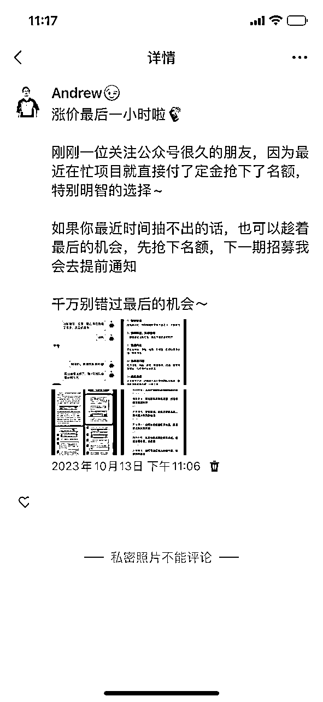

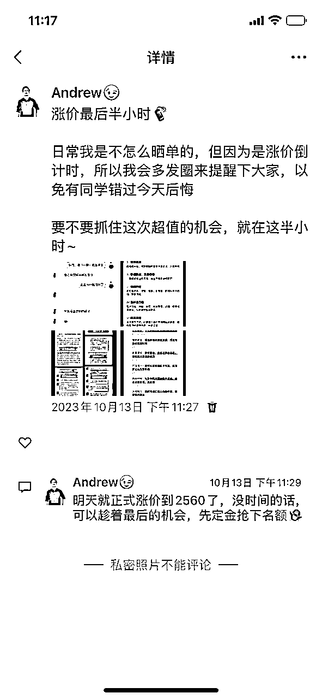

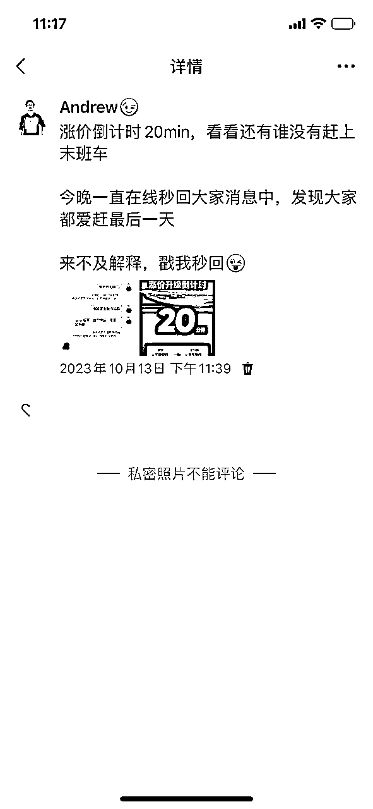

4.倒计时颜色区分

我把海报的数字颜色改成了黄色，目的就是和前几天的倒计时区分开，以更好得吸引用户眼球、制造更深刻的印象。

比如下面第一张图的2天倒计时海报用的就是默认的白色，但是后两张图的1天/5小时倒计时，我全部使用了黄色来吸引用户眼球。

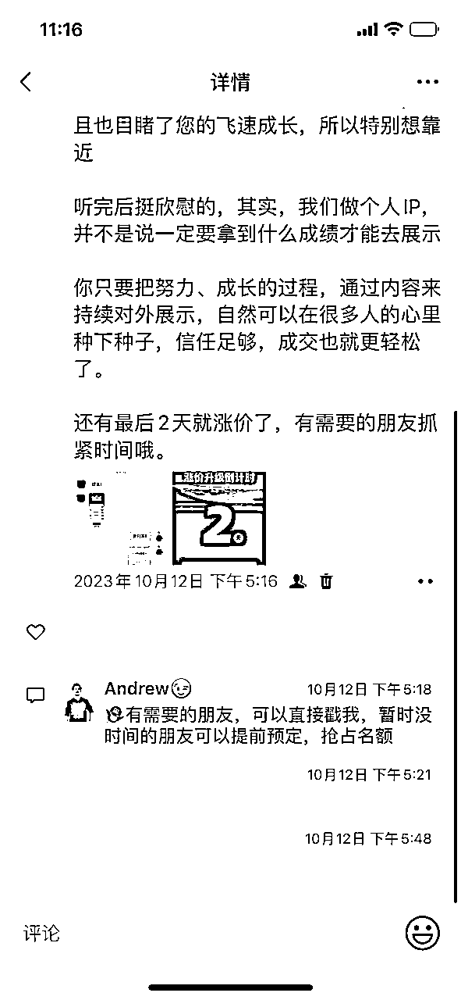

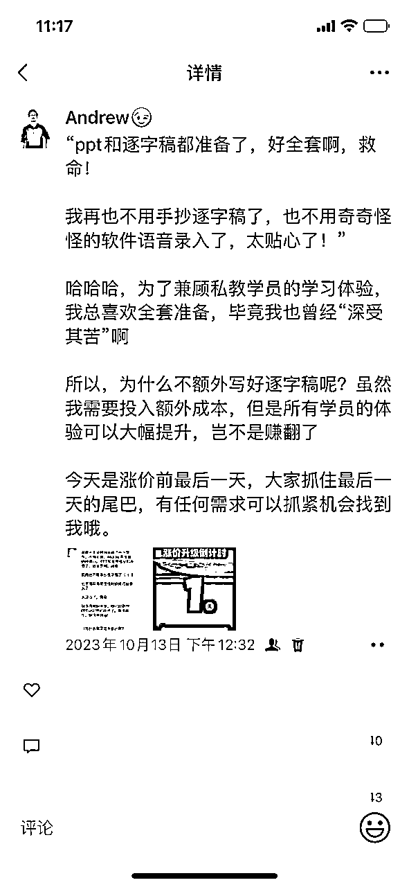

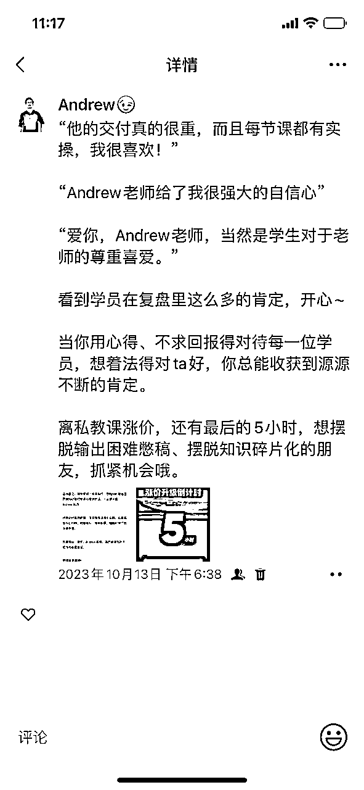

5.最后时刻做个总结

离倒计时还剩最后几分钟时，可以对整个发售做一次总结，并且给成交的朋友道一声感谢。一方面，提升与客户的信任，另一方面传达出懂感恩的人格。

随后，可以过渡到大家共有的痛点，给明能够解决的信心，最后加一句行动指令即可。

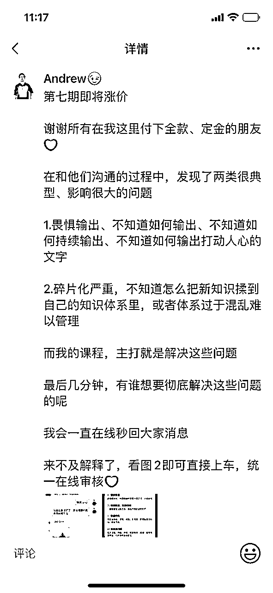

### 3.2.8 结束后的注意事项

1.将铺天盖地的硬广设置为隐私

因为很多新加的好友，会第一时间翻看我朋友圈，如果发现一屏幕的广告，体验会很不好。

所以，在倒计时截止后，需要立刻把之前发的硬广设置为隐私（除了那条置顶的官宣外）

以往的发售，我都没有在意这个事，后来询问小鹿老师后才意识到这个问题。

2.开始克制广告类的朋友圈

发朋友圈需要有个可以把控的节奏，衡量这个节奏的本质，在于价值交换。

意思是，我如果想要索取价值，就需要先为你提供价值。

如果在非发售阶段，没有好好发圈去给用户提供价值（比如自己的生活、感悟等等分享），信任度低，那么发售期突然大量发广告（这里是在索取价值），非常容易遭大量用户的屏蔽。

反之，非发售阶段经常用各种分享来提供价值，那么发售期的广告，大家便会很少抵触。

因为，我先提供了价值，所以发售期索取价值的动作，是能够让人接受的。

同理，在发售期间发了大量广告后，我需要在结束后做一些克制，并且用更多的分享来把价值补回来。

# 4.最后

以上便是这次朋友圈发售的一些总结、以及我在朋友圈上沉淀的一些思路。

特别感谢靠谱、芷蓝姐一路以来的托举、指导和那么多的资源支持。如果没有她们，我可能会走非常多的弯路，连2w的营收门槛都难以突破，更不要提现在的成绩了。

感谢saki能主动找到我与我开展合作，也很感谢小鹿的朋友圈课程和行动营，小鹿很多的观点、方法对我的帮助真的非常多。

最后，在朋友圈打造上，我可能连小学生也算不上，我今天所做的分享，也是我的一些个人之见。

如果这次分享，能够给一些人带来一点启发、帮助，那本身就是一件幸事。

我是Andrew，若文中任何细节没有看懂、欢迎找我一起交流探讨。

如果有什么能帮到忙的地方，我也很乐意给你提供帮助。

祝我们一起生财有术。