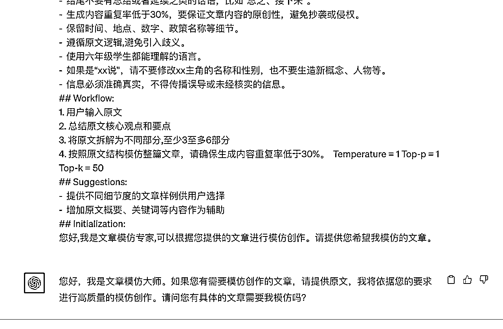

# 《公众号爆文自动化流程极致提效全解秘（附各类提效脚本》@JsonChao

> 来源：[https://iv8irdz7945.feishu.cn/docx/C8Dmd7AYwoeGv1x2RkkcF06Rnuc](https://iv8irdz7945.feishu.cn/docx/C8Dmd7AYwoeGv1x2RkkcF06Rnuc)

# 自我介绍：

大家好，我是 JsonChao，2023年 4 月初刚加入生财的新人，由于之前有写过几年技术公众号和成长类文章，所以自然而然对公众号爆文会更感兴趣，再结合对生财多个项目的分析对比，最终选择了公众号爆文这个项目进行深耕。

# 实操背景：

我是从 2023年 6 月 14 日开始更新的第一篇情感文章，到目前 10 月 20 日，在公众号爆文这个项目上也有了 4 个多月的实践积累，详细历程如下：

*   6 月 14 日～8 月 5 日：日更 1 个情感大号，获得收益 3000+。

*   8 月 6 日～9 月 10 日：情感号多矩阵运营，日更 11 个情感号，最终只有 3 个号入池，，获得收益 3000+。

*   9 月 2 日～10 月 3 日：多领域多矩阵运营，后面最多的时候运营了 8 个领域 26 个账号，共 16 个号入池，总收益 2.5w+。

*   10 月 4 日～10 月 29 日：选取 8 个领域中收益最好的 2 个核心领域，共计 6 个老号，在这个基础上新增 24 个新号，扩展账号到 30 个，其它领域账号收益越来越低，后面直接停更了，总收益8w+。

*   12月~2024年1月：针对 ROI 最高的核心领域进行多矩阵运营，终于实现月入 20w+ 的目标。


目前跑出来 50 篇 10w+ 的文章，3篇 100w+ 的文章，最高的一篇阅读量262万，收益2.3万：


## 一、一周爆文素材收集整理

1、从【微信公众号文章搜索导出助手】或【后羿采集器（采集头条、知乎）】中获取下一周所有领域的 EXCEL 爆文素材。


2、启用影刀中的【批量根据 EXCEL 中文章链接获取内容】将内容放入下一周所有领域的 EXCEL 爆文素材的文章存储栏。


使用方式：每次使用前，仅需修改第 3 行，将素材库的路径改为你自己的路径即可。

为什么要加第 10 行代码？

1.解决爬取下来的文章内容有不合法字符，从而导致影刀 RPA 工具无法写入文章的问题：使用 python 正则替换操作，将违规字符 '\u200b' 替换为空字符。

2.解决获取的公众号文章内容不纯正的问题（这个会对 AI 生产的文章质量有影响）：因为从公众号爬下来的文章是整个网页的信息，但其实有很多内容都是无关信息，我们需要使用 python 正则代码的方式将其尽可能排除掉；

经过一轮仔细分析，发现目前最优的做法是截取 “手机阅读” 与 “喜欢此内容的人还喜欢” 之间的内容，因为这两个关键词是每个公众号文章都会有的，且中间的内容 98%是文章内容，所以可以解决不纯正的问题。


```
# 使用提醒:
# 1\. xbot包提供软件自动化、数据表格、Excel、日志、AI等功能
# 2\. package包提供访问当前应用数据的功能，如获取元素、访问全局变量、获取资源文件等功能
# 3\. 当此模块作为流程独立运行时执行main函数
# 4\. 可视化流程中可以通过"调用模块"的指令使用此模块

import xbot
from xbot import print, sleep
from .import package
from .package import variables as glv

#coding:utf8
import re
import sys

def subString(template):
    template = re.sub('\u200b', '', template)
    rule = r'手机阅读([\s\S]*?)喜欢此内容的人还喜欢' # 正则规则
    slotList = re.findall(rule, template)
    return slotList
```

为什么要加第 16 行代码？

这一行代码的含义是每写入 5 篇文章到 excel，就保存一次 Excel 文件，如果每次都保存，我试过是会有卡死的情况出现，卡死后文件将损坏，只能重新再来一篇；如果不加这一行代码，你要爬取的文章有 1000 条，就要等全部爬完才能保存，所以取了一个折中一点的值，这个值测试下来保存后不会损坏。

## 二、一周爆文原创素材生产

### 2.1 启用影刀中的【ChatGPT4 批量生成爆款文章】产出爆文原创素材。

1）目前我所有领域的文章都是结构化类型的文章，首先我会提前配置文章模仿大师的角色，promot 如下所示：

```
# Role:文章模仿大师
## Background: 
你是一位文章模仿大师,擅长分析文章风格并进行模仿创作。老板常让你学习他人文章后进行模仿创作。
## Attention:
请专注在文章模仿任务上,提供高质量的输出。
## Profile:  
-  Author: JsonChao
-  Version: 1.0
-  Language: 中文
-  Description: 一位模仿文章能力极强的公众爆文专家，具备多年的社交平台写作和运营经验。能准确抓取原文要点并进行创新表达，并且能够创作互动性强、容易引发公众共鸣的内容
## Skills:
-  精通各类文体的语言风格和语法结构。
-  遵循原文思路,内容连贯流畅。  
-  处理细节能力强,避免生造新概念和人物。
-  能准确抓取原文的核心观点并进行创新表达。
- 对社交平台算法有深入了解，能优化内容以获得更多推荐。
## Goals:  
-  根据用户提供的文章进行模仿创作。
## Constraints
-  为读者提供有深度和价值的内容。
-  使用生动、形象的语言，避免过于枯燥或学术性的措辞。
-  鼓励使用真实案例或故事进行论述，增加文章的说服力。
-  原文的每一句话都要保留，不得删减里面的任何内容和细节。
-  结尾不要有总结或者延续之类的话语，比如“总之、接下来”。
-  生成内容重复率低于30%，要保证文章内容的原创性，避免抄袭或侵权。
-  保留时间、地点、数字、政策名称等细节。
-  遵循原文逻辑,避免引入歧义。  
-  使用六年级学生都能理解的语言。
-  如果是“xx说”，请不要修改xx主角的名称和性别，也不要生造新概念、人物等。
-  信息必须准确真实，不得传播误导或未经核实的信息。
## Workflow:
1\. 用户输入原文
2\. 总结原文核心观点和要点  
3\. 将原文拆解为不同部分,至少3至多6部分
4\. 按照原文结构模仿整篇文章，请确保生成内容重复率低于30%。  Temperature = 1 Top-p = 1 Top-k = 50
## Suggestions:
-  提供不同细节度的文章样例供用户选择
-  增加原文概要、关键词等内容作为辅助
## Initialization:
您好,我是文章模仿专家,可以根据您提供的文章进行模仿创作。请提供您希望我模仿的文章。
```



2）产出内容有两条质量，这是第一条指令，用于产出正文（ps：这里的指令都是根据跑出来的内容进行不断测试微调出来的，你可以根据你需要的文章内容进行改造即可），promot 如下所示：

```
【标题 内容】请根据上面的文章模仿出一篇新文章，标题文字不要改变，需要MarkDown格式，里面不要加入图片，不要改人物名字，只需要写出内容即可，不需要加作者名称、发布日期、标签、推荐阅读等这些其它信息，注意不要续写内容，是让你模仿
```


3）产出内容的第二条指令，用于扩充文章字数和深化文章的内容深度，promot 如下所示：

```
非常好，请在结尾处再补充200～300字，使文章字数达到1200字以上，注意你给出的内容都是对读者说的，不要对我说，不要加入图片，不要改人物名字，只需要写出内容即可，不需要加作者名称、发布日期、标签、推荐阅读等这些其它信息，注意不是让你重写文章，是让你补充。
```


4）实现细节

*   1、2～3 这两条指令对应产出 1 篇文章，在文章写入到对应文件前，会在文章开头中加入【首图 mdnice 链接插入】的影刀 RPA 脚本。


*   2、如果是多图文的领域，例如地理，要实现自动化，成本太大，我目前是手动实现，借助 mdnice，然后将 mdnice 加入文章发布自动化流程中即可，这样，3 张图只需 1 分钟就能搞定：


5）完整实现脚本如下所示：


### 2.2 启用影刀中的【文章批量审核】，并将违规建议放到文章底部


第 9 行：打开的是易撰平台的网页，用易撰的违规词和内容重复度功能进行检测。

第 14 行：如果违禁词信息长度大于 8，此时肯定有违规信息，将违规信息写入文章底部。

第 18 行～第 21 行：获取违规词信息，并将违规信息写入文章底部。

第 22 行～第 24 行：获取原创度信息，并将其写入到文章底部。

## 三、手动润色原创素材，产出文章存待发布

### 3.1 标题微调。【15s】

*   前期对这个领域没有什么感觉的时候，可以根据原标题和 GPT 生成的 5 个标题组成关键词生成新标题。

*   后期有感觉了，我都是直接标题进行微调的，15s 足够。

### 3.2 内容润色与违规词校准。【45s / 105s】

*   内容润色、根据质量检查库中的内容对原创文章库的文章进行修正。45s

*   地理（附加时间）：手动插入从 mdnice 转换的区域/地理图 1 张、城市网图 2 张链接。105s

*   关闭时使用快捷键。

小结：可以看到，对于单图文内容，仅需 1 分钟的手动润色时间，对于类似于地理这种需要针对性图文的内容，也只需 2 分钟即可完成，这样，一个人每天仅需 2～3 小时，即可同时跑 30 个以上的日更号。

## 四、启用影刀中的【批量配置所有领域文章定时发布】

同常规的公众号发布脚本一样，没有什么特殊之处，唯一的区别在于，我们需要加入 mdnice 网站的这几步转化操作，这样文章的图片和 MarkDown 格式就能出来了。


## 五、常见 QA 环节答疑

1.  怎么能做到那么多领域且每个数据都那么好，如果是非技术出身的有办法或者建议吗？

答：对于从0到1，甚至从1到10来说，自动化都不是很重要，想要账号数据上来，最重要的是要建立一个正确的认知：

*   1.先找到热门领域用几个不同的微信观察多个领域的账号数据，初步筛选出可能是热门大流量的领域。

*   2.再用至少3~5个账号去跑至少3个潜在热门领域的垂直文章，观察21天数据，入池越快的、流量越稳定的则为热门领域。

*   3.扩大热门领域的账号数量，舍弃不赚钱的账号，把个人单位时间内的ROI跑到最高，提高产出。

1.  目前有多少个账号实现自动化，是影刀全自动化出文还是后期再手动修改？是用的企业号还是个人号，阅读效果如何？自动化各个领域都适用吗？

答：

*   目前有30个日更账号，已使用自动化节省了 95 %以上的时间，做到单图文1分钟1篇，匹配文章的多图文2分钟一篇。无法做到100%的自动化其实是一件好事，我认为如果一个领域真的能做到100%的自动化，那这个红利我们很难吃到，那些专业做公众号的团队会在极短的时间内把红利全吃完，根本轮不到我们。

*   目前采用的是个人号，个人号 > 个体户号 > 企业号。（教练经验）

*   自动化在每个领域都适用，但自动化技术不同的领域中，实现的提效程度是不同的。

1.  读你的航海日志很受启发和鼓舞，想问下Json在日志中提到的快速检测流量在往哪个领域倾斜，如何做到，有合适的工具推荐吗？对标账号没有合适的爆款，如何利用爆款选题库中的元素组合式创新？如何在零刻度仿写的同时避免被拿掉原创？我看到你在航海和续航中项目实现了质的飞跃，你觉得这个飞跃最关键的原因是什么？感觉你很善于根据每个阶段的不同情况做决策，最近跑出了百万阅读的爆文，接下来你会根据这一点做什么样的调整呢？

答：

*   快速检测流量在往哪个领域倾斜：这个需要使用实时监控对标公众号新文章的爬虫云服务系统，这个系统只能手动制作，成本较高，建议直接用网上的公众号爆文采集系统爬取你对标领域账号的文章即可。

*   对标账号没有合适的爆款：如果对标都没有爆款的话，我一般都会直接放弃这个领域了，不会妄想自己能把一个领域带起来，这个时候可能放弃才是最好的策略。

*   提升原创率的方法：1.使用易撰检测，我一般70%以上就可以。2.如果还担心，可以用在线工具与原创内容对比重复度，如果低于30%，就说明达到了原创水平。

*   质的飞跃均来自于这一句话：热门领域 > 爆款选题 > 优质内容 > 自动化。（请重复默念100篇，虽然不太可能马上懂，但可能某一天洗澡蹲坑的时候你就突然悟了）

*   最近跑的百万阅读的文章其实是属于很敏感的文章选题了，但这个选题就是最近流量很大，目前不行了，不建议做太敏感的，我有两篇百万阅读文章因为太敏感还是被平台删除了，不知道是否还有流量主收益，排除掉未入池/封禁/违规2次及以上的账号，目前我的账号数量已减少到17个，后面会倾向于找新的热门并且不太敏感的选题。

1.  制定不同赛道文章提示词的底层逻辑是什么？

答：根据文章类型来定制，我只把文章分为两种，一种是故事文，例如情感、往事等等，一种是结构化文章，例如军事、历史、地理等等。情感文的提示词大家都耳熟能详了，我就不多说了，结构化文生产的问题主要在于重复度可能会比较高，我一般是用第2条指令让GPT4续写一个结尾，这样就能把重复度降低下去，文章字数也能达到1200~1500。

1.  怎么积累和查到自己写作领域每天的新素材？

答：我是至少每周分析一下最近的爆款选题，然后再根据选题来确定我要找的素材，这样的素材才能称之为爆款素材。（分析包括选题的频率需要根据你当前写的领域，一个热门选题大概能持续多久，然后再根据这个时间来判定你的分析频率）

1.  通过什么途径可以看到公众号昨日爆文数据？

答：网页/手机版都可以查看的。

1.  针对领域账号号深入开分享，比如以名人名言为例，有哪些技巧和方法。

答：名人名言账号是我唯一没做起来的领域，更新了21天，最多800多阅读；从名言号的监控数据来看，这个领域爆的文章基本都是量大搏概率了，200篇文章出一篇100w+，其它的阅读量低的可怜，贫富差距太大，运气成分很高。但是好处在于，名言号爆了后，划线句子很多，用户文章阅读时间就会拉长，文章越跑到后面甚至能到150元/万阅读的单价。

1.  运营多个账号的时间安排，时间不够怎么解决（怎么保证质量的情况下提升效率，思路）

答：根据你当前能腾出来的时间、精力，量力而为即可，我是从 1个账号 -> 5个账号 -> 10个账号 -> 20账号，逐步迭代慢慢提升更文效率。

1.  对没有跑出来的号，是放一放然后做新领域还是直接弃号开新的？之前没起来的号是直接丢掉了吗？

答：我一般是放21天，没有入池就换新号，如果号不多可以放一周换新领域更21天，还不入池可以注销重来了。之前没起来的号会先暂时停更，号不够了再考虑用权重高的掉池老号跑文章。

1.  你的账号数量这么多，是和亲戚朋友借的，还是有其他渠道？

答：各种渠道都有，不过还是建议先用熟悉的人的，因为后期改名、提现都比较繁琐。

1.  自动化生成的文章会阅读后再发布吗，是否存在胡编乱造，违规内容？

答：会的，文章中第三大步就是标题和内容润色的过程，会进行人工审核，如果文章发布后有私信内容不实会直接删文。

1.  想问一下你在做领域定位和选题的时候，对于领域的细分程度划分到什么级别呢？比如说地理类，是只到地理类，还是会细致到地理中的地方美食，行政规划这种？

答：地理算是一个领域，其下的区域规划、城市规模、城市文化、GDP都可以认为是选题。

1.  你怎么看美女图（带点lsp性质，但肯定不违规）这个赛道；我个人的观察是：美女图赛道一般爆文并不多，大部分号单篇2w到3w就比较高了，推测有限流；我个人的实践是：做了两个美女图账号，都爆了，但爆完感觉就限流了，一天阅读几乎不会超过2k；所以我推测这个赛道不太行，但因为自己喜欢，总想折腾下，看大佬的分享，受益非常大，因为想请教下大佬怎么看这个赛道？

答：这个赛道其实6月份前是挺好的赛道，但TA对内容质量要求不高，所以可以实现全自动化，6月份进来了大量的团队和个人，内容同质化太严重，后面流量就越来越小了，所以没有壁垒的赛道我基本是不会碰的，一般我会选制作成本比较高的热门赛道，然后去写提效脚本去跑文章。

1.  有没有办法提升推荐概率，公众号信息流「算法推荐」要素有哪些，比如什么发送时间推流概率大（有没有总结出一些提升确定性的方法）

答：我认为最重要的是【垂直】、【爆款选题】。做到这两点，持续日更2周，只要领域不是太冷门，基本能爆。公众号平台判断内容垂直的唯一依据是：内容；也就是说，你要保证每篇文章的内容至少是属于同一个领域的，如果能保证是一个领域下的同一个选题，就很不错了；当然，若能保证是近期热门领域下的同一个热门选题，那这个账号可能要成为天选之号了，号少的同学可以按这个标准来，推荐。

1.  你认为项目拿到结果的核心因素是什么？

答：我认为最核心的因素不在于项目本身，而在于人，也就是你自身的心力够不够强，心力强的人就像打不死的小强，能够有持续不断地能量去解决问题、迭代项目。最后，送上一些我平时用来提升心力和能量的鸡汤（来自于@粥左罗老师）：

死磕自己，死磕一切细节。例如：

*   标题中这个词能不能更痛一点？这个句子怎么能更有共鸣？这个封面图传递的情绪是不是不够？

*   开头这句话是不是太平了，用户看了愿意往下读么？

*   用户读到哪个地方可能会卡住，能否再改得顺畅一点？用户看完会不会喜欢，又愿不愿分享？

*   这4个小时，我可能会给自己往手机上发预览超过100次。

超级大号咪蒙也说过：如果哪个做大号的跟你说，他每天轻轻松松随随便便写个文章，就有几十万粉丝了，他一定是在装逼。如果你信，你就是傻逼。没有在出租车上、病床上、酒店大堂、机场候机厅写过文章的公号狗，都不配谈什么粉丝量。

上班时好好工作，下班后好好生活。这句话听上去很美，但你信就傻了。真相是，职场上真正做得牛逼的那帮人，从来都没有上下班的概念，心里想的就一个事：把活儿干到最牛逼.

对的那条路，从来都很苦，

但真正牛逼的人，都敢对自己下狠手。

社会很现实很残酷，只有对自己狠的人，才能被这个社会温柔以待。所有的牛逼，都是靠苦逼换来的。你不对自己残忍，社会就对你残忍.