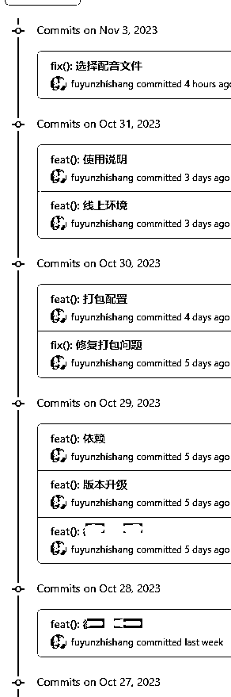
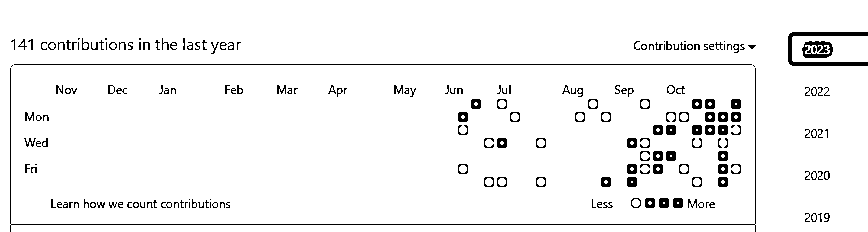
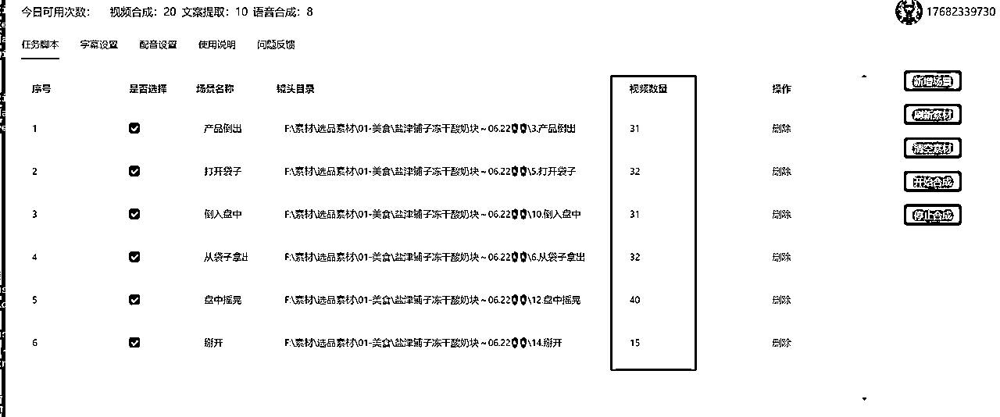
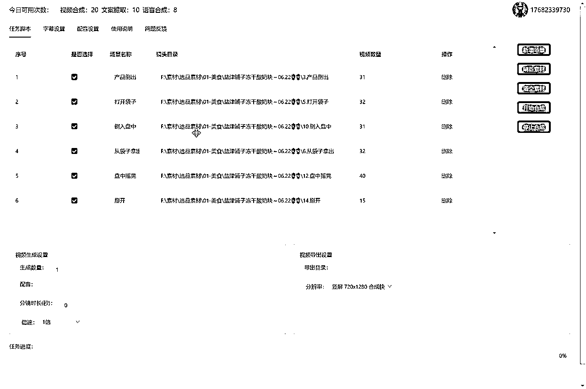
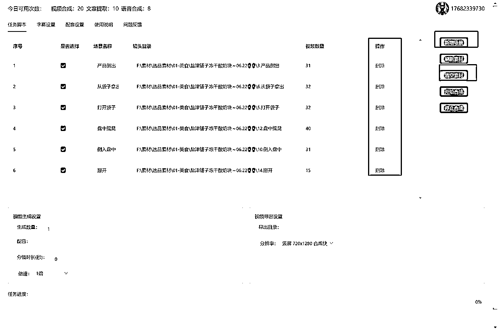
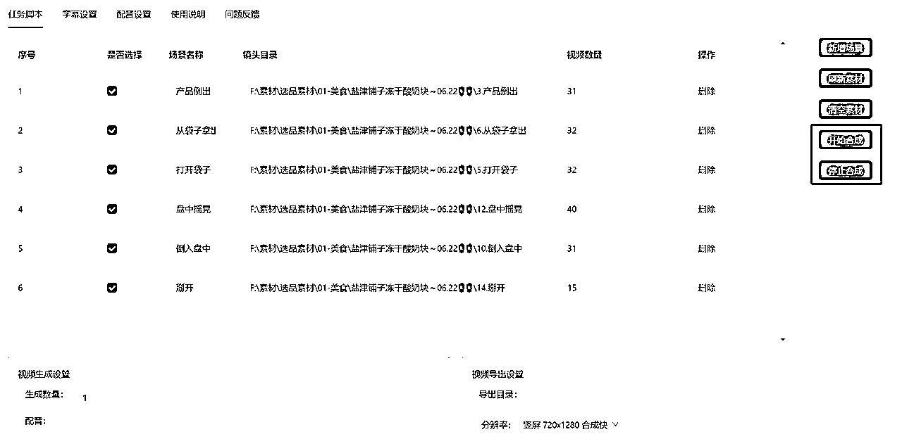
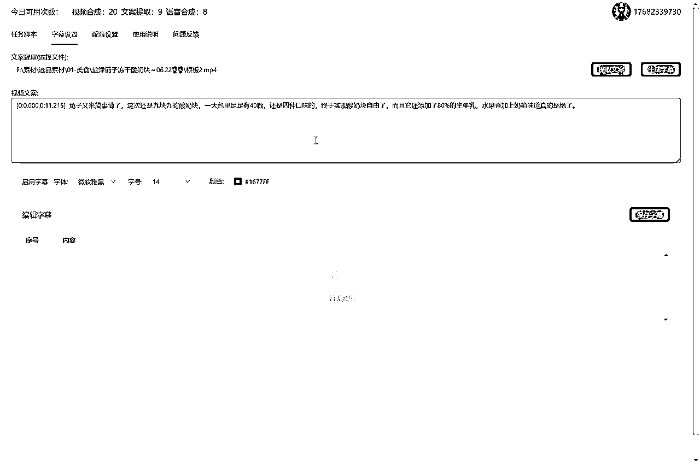
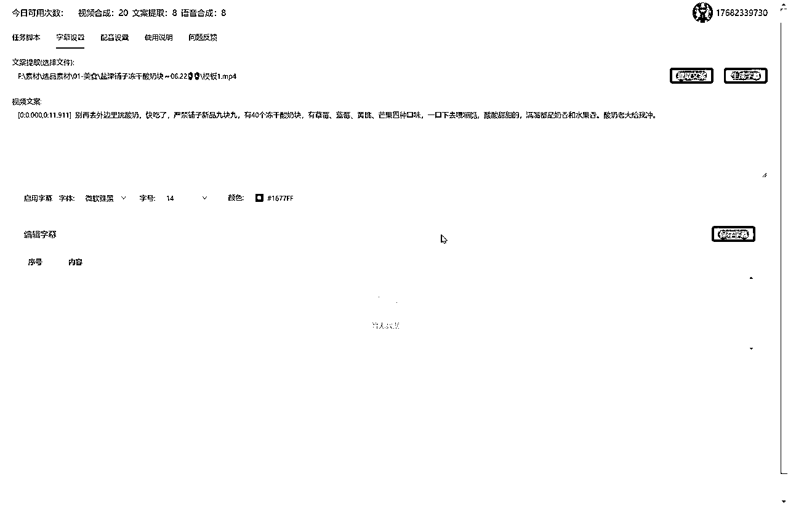
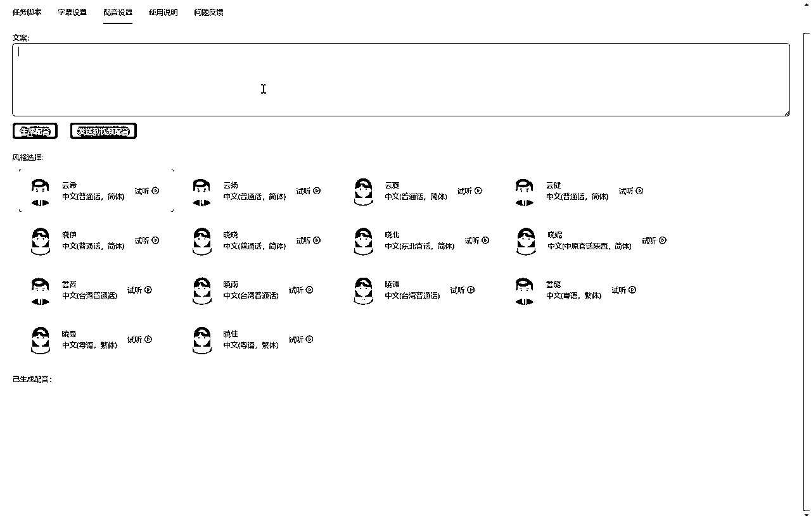

# 短视频批量混剪软件，一个人就是一个团队

> 来源：[https://ijarxpcwej.feishu.cn/docx/DuyhdOqRSo4fGnxeVuVcqqoAn4c](https://ijarxpcwej.feishu.cn/docx/DuyhdOqRSo4fGnxeVuVcqqoAn4c)

Hello， 圈友好啊，我是小辉AI教练，今天又给大家带来了Booms的升级版，这次更新了字幕和语音合成功能，发布的还是一个预览版，这次经过三个月的持续更新，上百次的代码提交，GitHub都变绿了，终于迎来了这次炸裂的更新，现在开放给圈友们试用，当然目前还是beta版本，有一些小bug和不完美的地方都是正常的，还请多多提供一些建议。

下面是关于软件的一些详细介绍：

## 一、视频混剪功能

#### 批量视频混剪原理：

我们把一个短视频拆分成多个部分，其中脚本是这个视频的骨架，每个视频脚本决定了这个视频的内容组成，包括视频风格、属性等等，具体拆分一下我们可以分为如下几个部分：

所以我们稍微运用一下第一性原理，把视频拆分为这些原子组成要素，然后再把它们重新组合成一个新的视频，首先，这也是最高级的视频去重方法，用旧要素重新生成新视频，其次，我们可以把这个过程批量化和自动化，然后释放我们的生产力，让我们短视频生产者可以专注于做好选品和账号运营等其他重要的工作，把这种繁杂的体力劳动交给软件。

#### 任务脚本：

每次生成视频，我们可以创建一个任务脚本，这个脚本由多个场景构成，你可以任意组合和调整场景的顺序，每个场景是一个镜头目录，是由一个相同的场景组成的目录，里面是同一个场景的镜头，可以是多个机位不同角度拍摄的视频，比如下面这个视频脚本是由6个场景组成的，其中，包括：产品倒出、打开袋子、倒入盘中、从袋子拿出、盘中摇晃、掰开

可以看到，每个场景目录下面有多个视频镜头组成的，这个视频脚本理论上可以由这么多个镜头生成

31 x 32 x 31 x 32 x 40 x 15 = 590438400 个视频，而且是不重复的，因为至少有一个镜头不重复，但是在实际发布的时候，我们为例提高过审率，那至少要保证50%的内容不重复，那么即便只算1%的数量，也有5904384个视频可用

而且，你还可以通过改变场景的顺序来重新组合视频脚本：

#### 场景的删除、新增和清空

#### 视频生成设置：

1.  生成数量：本次任务需要生成的短视频数量

1.  配音：选择你对标的或者自己生成的配音文件，可以是视频和音频

1.  分镜时长（秒）：设置每个镜头的长度，单位是秒

1.  倍速：设置视频是否加速

#### 视频导出设置：

1.  导出目录：选择生成的短视频存放目录

1.  分辨率：设置生成短视频的宽高，

#### 开始/停止任务：

## 二、字幕设置

这个界面的功能融合了文案提取和视频文案设置，你可以用来提取音频、视频的文案，或者生成本次视频任务的字幕，甚至可以用来给你喜欢的电影生成字幕：

1.  文案提取（选择文件）：选择你要提取的媒体文件，可以是视频或者音频

1.  提取文案：运用语音识别技术，提取音频或视频中的文案，并导出文本

1.  生成字幕：根据你选择的媒体文件，生成秒级的字幕信息，然后分句拆分展示，你可以编辑每句字幕文案，重新保存，因为模型识别可能某个文字识别的不准。

记得要勾选 启用字幕 才能挂到生成的视频任务中

## 三、配音设置

这个页面的功能主要是根据你提供的文案来生成音频，可以直接应用到视频生成任务，比如你可以把对标视频导入字幕设置中提取文案，然后洗稿后重新生成你自己的配音。

这里提供了真人级别的语音生成服务，有普通话、东北话、台湾、粤语等方言

我们可以听一下效果：

生成好之后，可以点击 发送到视频配音，应用到本次视频生成任务中

## 四、下载地址：

1.  官网下载：http://dis1.aimix.pro:82/index.html