# 从亏损1000w到月销5000w，7k字复盘私域电商盈亏经验

> 来源：[https://ukhdgfrsah.feishu.cn/docx/DzVRd33iOorkk8xieUgcAH88nic](https://ukhdgfrsah.feishu.cn/docx/DzVRd33iOorkk8xieUgcAH88nic)

今天主要来聊一下私域电商

都2023年了，真的还有人做微商赚钱吗？

社交电商的头部平台们，不是都黄了吗？

还有人微信买货吗，不都是直播间下单？

说一下我们项目的数据。

今年3月份开始内测，4.15正式上线不到10天，gmv一天破百万，头部团队长日入几万，到目前10月份，发展注册店主人数超50w+，每月gmv都在5000w+。

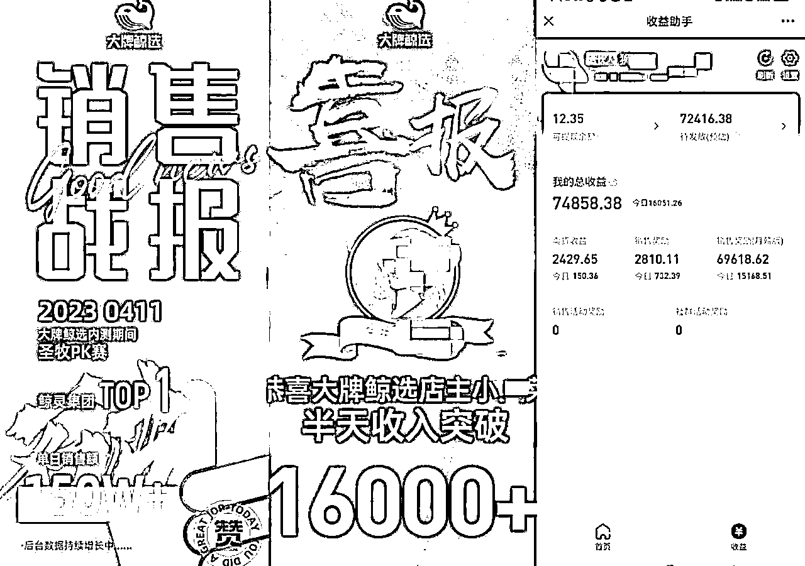

四月刚上线的部分数据

身边朋友知道这个数据，第一个反应是离大谱？

第二个反应是好奇，这样的数据是如何做到的！

下面分成四个维度的讲一下：

1.  亏了快1000w的私域经验

1.  私域电商不同阶段的变化

1.  一个月卖了5000w的复盘

1.  关于私域发展一些小看法

1.  亏了快1000w的私域经验

*   我和团队的电商背景

19年前，我一直在朋友圈卖货，用现在的话讲可能算是超级个体，一个人满世界溯源卖货（欧洲土特产为主）+三个不用坐班的兼职客服（都是宝妈），每个月销售额基本在200w左右，很稳定但是也一直在找新的增长点。

超级个体阶段真的是最爽最自由的

在19年接触到了一个社交淘客app，也就发发朋友圈拉一下群，不到3个月的时间裂变了15w人并且赚了100w，到现在每个月啥也不做也有2w+的管道收益，就觉得这个模式特别有意思，之前也写过一篇复盘：https://articles.zsxq.com/id_43moqaj4xqvn.html《如何用微商思维经营淘客收入百万》

也通过这篇文章，链接到一些同行业的圈友，有的合作了两年多，成了很好的朋友，后面会提到。

之前作为头部团队长在溯源的时候，链接到一个前头部社交电商平台（21年关停）ka商家，双方都很认可社交电商的模型，觉得未来还有机会，于是供应链公司作为资方出钱，我作为市场端运营，开启合作。

*   起盘创业亏损500w

第一次，纯自营平台，第一期拿了资方500w，对标的是一个年销售额50亿的水果分销平台，一开始市场裂变特别快，3个月发展了20w人团队，第一个月销售额就近1000w，我们感觉要起飞了。

但是3个月后拉新乏力数据下滑，我们尝试了很多营销方案也无法逆转，讨论了很久，就当时的能力和资源，再投200w未来也不会有利润，所以决定止损，让用户提现完佣金就关停了小程序。技术开发，运营团队，两千平的场地，还有拉新成本，亏完钱一点资产都没有保留下来。

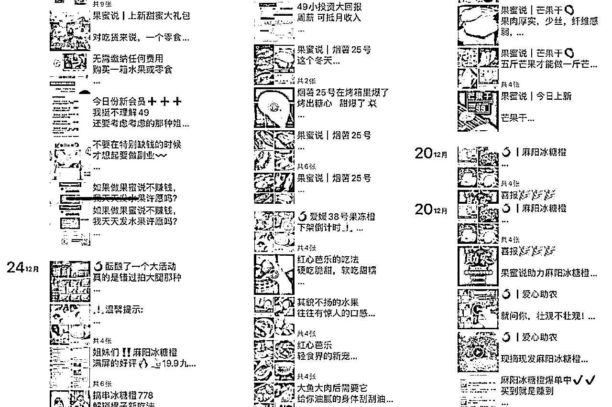

成也低客单水果败也低利润水果

团队复盘总结了4个问题：

1.  水果供应链过于单一，虽然低客单轻决策高复购拉新快，但后续缺乏高利润的品，就会导致代理无法持续赚钱，后继乏力。

1.  不赚钱的生意不长久，最大的亏损是在拉新，这部分其实换品止损，但一开始的数据，让我们错觉是战略性亏损，很快会通过后续的利润拉平，但是拉新烧钱是没有底的。

1.  一定要补足项目短板，以前我只是团队长，面向市场端，会卖货会搞裂变就可以了，但从运营公司角度，个人运营能力确实不足，需要作战经验丰富的老兵。

1.  不要盲目的抄老作业，时代确实变迁了，模式体系流量玩法一定要结合当下的市场环境做迭代。

如果现在穿越回21年那个项目，在20w用户基数上继续裂变，再好好卖货，最起码是小而美的赚钱状态，但现在的认知和资源也是当年亏出来的。

所以我们反思，下次起盘，一定要补足供应链短板+设计好赚钱模式+搭建好运营班子+优化迭代玩法。

*   和大厂合作的收获和教训

第二次，和pdd合作，做ktt第三方分销的推广伙伴，ktt21年销售额是600亿，我们借着pdd的背书势能很棒，发展迅猛裂变超快，但上海封城让他们不需要我们做增量了，上海单城一天新增一个亿销售额，三个月新增80w店主，去年直接做到了1600亿，我们业务就直接被ktt隔离了。

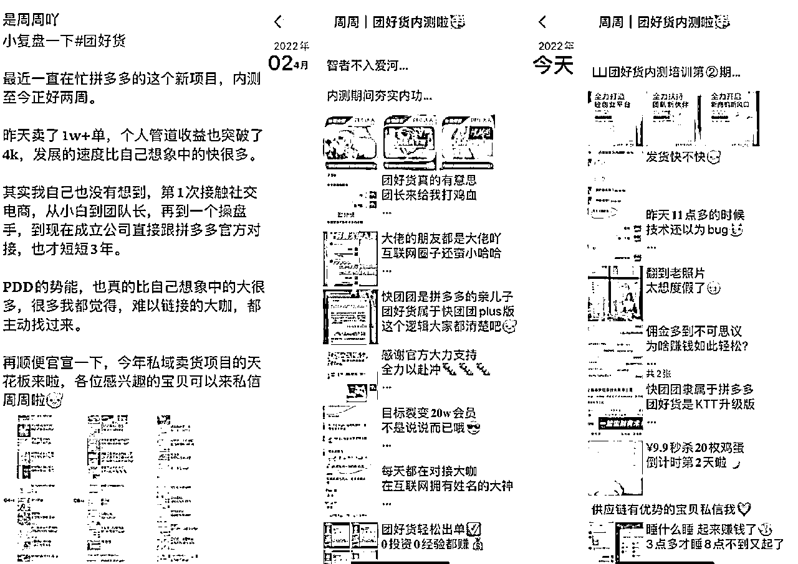

当时借pdd背书和产品补贴发展很快

我的电商导师&好朋友老胡说过一段话，我特别有感触：

玩kpi的根本拼不过玩命的，大公司搞社交电商是行不通的，各种法务财务考核很难让他们做好，这种只有创业公司做得好，敢拼敢干，all in勇于承担创业风险。

在今年4月份pdd关停群买买的时候，这段话再次得到了验证。

这次的收获：

亏了钱但是交了朋友，thh让我和生财圈友深度合作，比如潇洒哥，之前就是每一日淘日入几万的头部，真的是我的超级大腿，占了thh的90%以上业绩，还有生财一些公众号自媒体大佬，也帮thh宣发站台过，特别感谢。

第二次的亏损，其实没有打击我们团队的信心或者劝退，因为不是市场不行，而是大厂的决策，反而让我们更加肯定，私域电商还是有机会的，分销模式是工具，终端销售能力是核心。

而且在合作过程中学到了很多正规军的打法，也因为操盘了大厂的项目在私域圈子里有了一定的知名度，算是借着pdd的背书破圈了，很多以前觉得根本链接不上的资源和平台老板，都主动过来寻找合作，私域运营的核心班子也确定了下来，所以这150w学费还蛮值的。

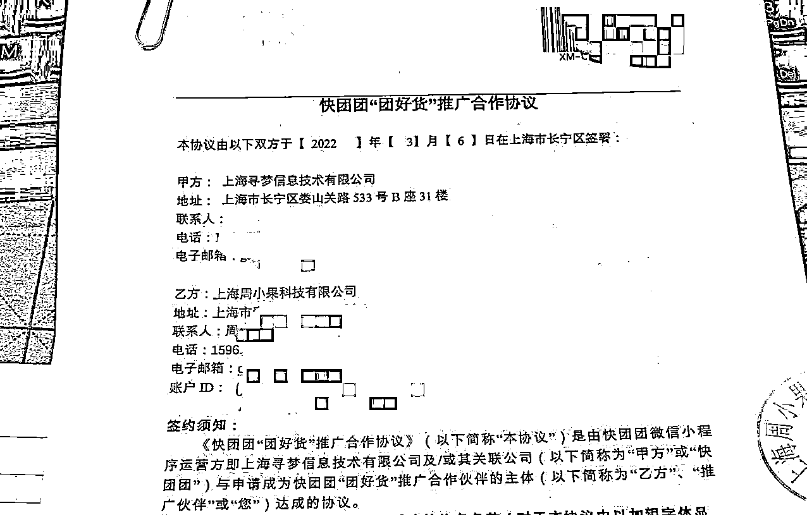

第一次和大厂签私域合作合同还挺激动

这两次试错，也让我从无知无畏的卖货个体到几十万人的团队长，从野蛮生长的项目方到正规军打法的操盘手，学会了从各种角色多维度更全面的看待问题。

这里有个小技巧，可以避免看生财过于焦虑：先找相关领域的精华帖，链接上同行业的伙伴，线下见见面，后面可能就有机会了，我就是这么认识潇洒哥和其他小伙伴们的哈哈哈，生财确实卧虎藏龙。

*   今年的突破转折点

在今年迎来了转折点，以下就是欢快的bgm，终于守得云开见雾散，改革的春风吹满地。

第三次，和私域社交电商的天花板公司合作，到现在正好也半年的时间，我作为项目主理人，从0到1陪伴了起盘和裂变，也作为商学院负责人，陪伴了n个关键性的时间节点。

最重要的是，这次的正反馈让我们确实更有信心，尤其是看到头部团队长第一个月就月入几十万，素人宝妈一天也能赚个几百块，证明了哪怕是2023年，很多人都对社群卖货失去了信心，私域依然珍贵。

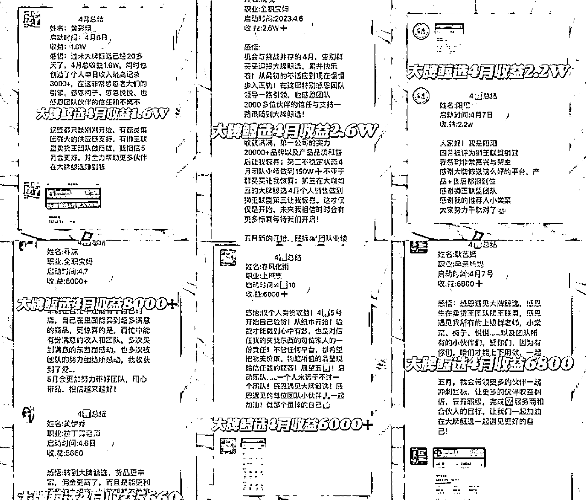

上线不到一个月做到的数据

当然这样的数据，肯定是离不开强有力的供应链支持，成熟的公司团队运营，以及优秀的市场领导人和终端销售店主，在第4部分我会重点讲一下我们的人货场运营策略。

再补充一下观点，前面的所有亏损都是因为想要创业做平台，私域电商依然是个体最简单的创业方式，比摆摊或者任何平台的电商成本都更低，变现效率也更高。

1.  私域电商的大背景

*   简单的说一下私域卖货的模式

12年开始就有个体在朋友圈卖货，比如以前在人人网和微博卖货的代购海淘，手工传单，银行卡微信收付款。

14年15年是微商的野蛮生长时期，基本是囤货制卖大健康或者美妆等高毛利产品，喜提和谐号就是那时候出来的，也确实有很多普通人抓住机会逆袭，fake it until make it被微商演绎的淋漓尽致，我相信很多人在朋友圈见证了很多微商大佬的崛起。

17年出现社交电商，有了系统完善的供应链和小程序，降低了创业门槛，398就能在微信开店卖货，而且无需囤货，给了很多全职宝妈轻创业的机会，云集上市，巨头入局，头部团队长在那个时期赚几百万也很正常。

20年的疫情让团购和落地配更普遍，快团团群接龙之类的免费的去中心化saas工具，让卖货购物更加普遍，超头月销几千万甚至上亿。

同时随着公域流量越来越贵，越来越多品牌和实体商家也开始聚焦私域，搭建团队深度运营用户，比如完美日记瑞幸咖啡等等。

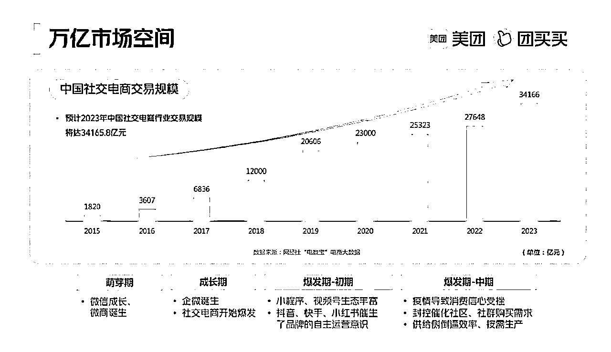

美团社交电商新项目团买买招商ppt数据

*   公域电商的痛点

传统电商不管是b2c还是抖快这种平台，有商家日发货单量几万单，却艰难持平甚至亏损养人工，利润都压在库存上，尤其是这几年，免费流量大幅减少，付费成本不断增加，同行之间也越来越卷。

而这几年过的相对滋润舒服的，就是把用户沉淀在私域精细化运营反复成交的，比如ktt或者微店，或者社群直营。

商家朋友吐槽公域就是个渣男，先给甜头让你上头，再诱导你不断投入付出，等你意识到想止损的时候已经很难自拔了。

而私域就是个暖男，不会制造惊喜，虽然不会爆发式增长，但是会源源不断给你产生收益，这个才是良人。

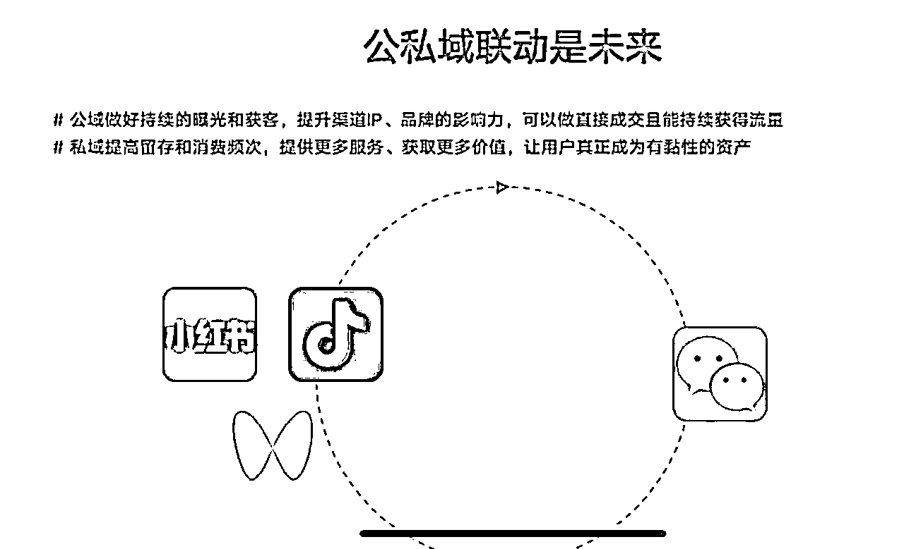

所以大家愈发意识到，和公域谈恋爱获取流量，和私域结婚产生利润。

私域自然分享裂变的属性，强信任的关系，让售后和卖货更加有温度，相比于公域割韭菜心态导致劣币驱逐良币，生意做着做着就没有了，私域会更加爱惜自己的羽毛，注重品质和服务，回归卖货本质，生意会越做越舒服。

*   私域电商真的很香

过去私域电商的发展，在我看来，每个时间节点都有赚钱的机会，尤其是现在，越来越多公域玩家意识到，私域可以突破平台规则，跨越流量的生命周期，实现用户运营自由，所以私域电商非常有机会。

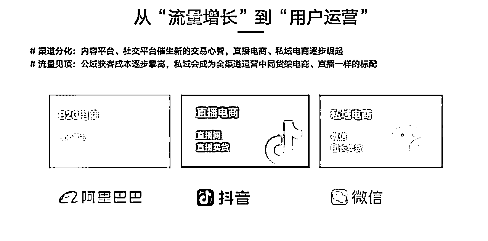

传统电商老板也越来越意识到用户运营的重要性

从个体角度来说，我陪着我客人从她大学的coach买到工作时的Gucci再买到现在的爱马仕，见证她读书毕业结婚生子，对我而言，她不是一个冷冰冰的流量，而是真真切切的微信好友，我们要做一辈子而不是一阵子的生意。

之前和一个微商姐妹聊天，她说一直以为互联网上说的年入几千万是指的利润，觉得自己一年赚几百万不算多，后来才知道说的是销售额，可能年销几亿的供应链，利润才几个点，去掉运营场地人工库存各种成本还不如她。

在个体微商看来，撇开利润聊gmv就是耍流氓，像个体私域赚钱就很舒服，都是现金流，而且时间很自由，也不需要应酬，不需要焦虑流量数据，也没有三角债和资金周转压力。

所以不管是个体，还是公司，真的都应该好好布局私域。

*   说一下我私域搞钱的经历

我是真的很感谢马化腾，因为我赚的每一笔钱真的都离不开微信。

包括去年做视频号的知识付费，新账号纯自然流单直播间卖课百万，弥补了之前做抖音的亏损，这个有时间再具体讲一下，视频号这两年真的也很香。

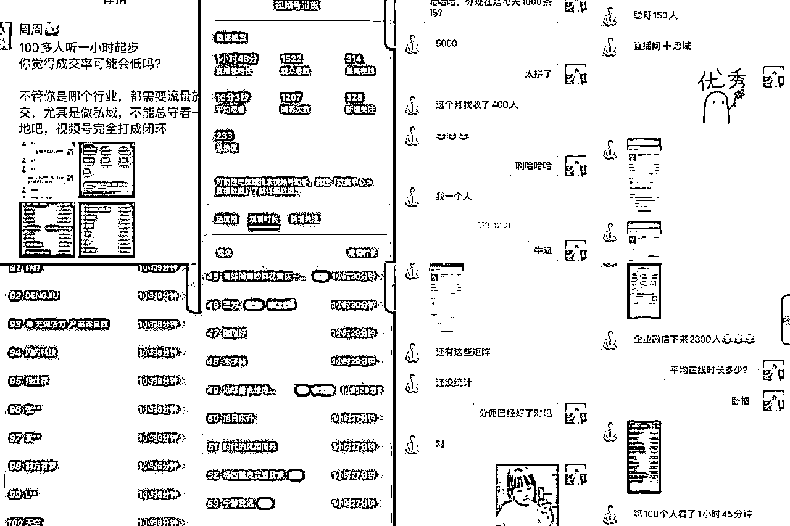

视频号真的有普通人弯道超车的机会

12年上大学触的微信，闺蜜在美国读书，身边有留学生做代购，她本身就是名校白富美，通过校内微博引流很快做了起来，13年我在国内负责收发货对接，毕业后继续做她的客服，收入其实也高于在xdf上班的。

14年在上海xdf负责公众号，做了几篇爆款，也通过经营朋友圈IP弯道超车，从一群名校海归的同事中出圈，15年获得一个机会去了加拿大一个国际高中教书。

16年回国创业在微信卖沙拉，在没有实体店的情况下，一个月卖了10w，累积了无锡本地高净值用户并开了加盟，在17年重操旧业做人肉代购，实现了旅游自由，19年底接触到社交淘客。

20年淘客下滑后做社群卖货，电商背景的合伙人负责投流，我来精细化运营，利用身边资源+投流付费的形式发展卖货社群。

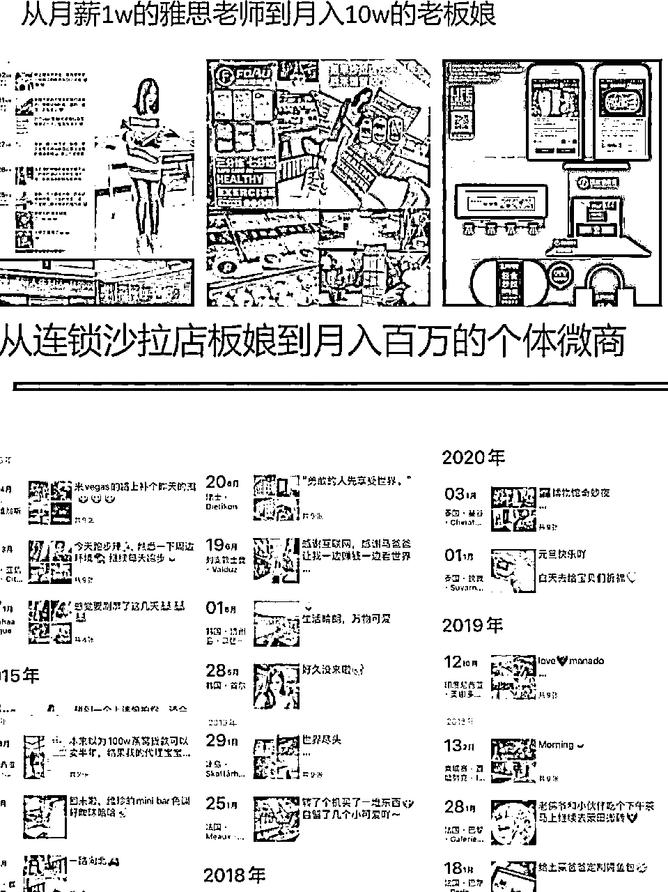

通过微信不断迭代至今

在这个过程中，累积了18个微信号和200多个社群，目前社群卖货和私域卖货也是我现在稳定的收益了，不会受到平台规则变化或者模式调整的影响，微信直营卖货真的很香。

但是为什么还是想做社交电商呢，因为能看到直营卖货的上限，如果想要从年销几千万突破到几个亿，就得做平台，要加模式的杠杆，也要借助资本和供应链，才能实现目标。

1.  新平台如何一个月卖5000w货？

*   我们抱对了大腿

对于团队长来说，相比于一年换三个项目，还是想三年全力以赴一个项目，所以选择有实力且政策稳定的公司就很重要。

从17年开始，社交电商平台迭代了几轮，要么收缩，要么换模式，要不直接关停或者转移战场，比如群买买贝店蜜芽等等。

很多微商会吐槽：赚钱的项目不长久，长久的项目不赚钱，这两年更替项目的频率真的越来越高。

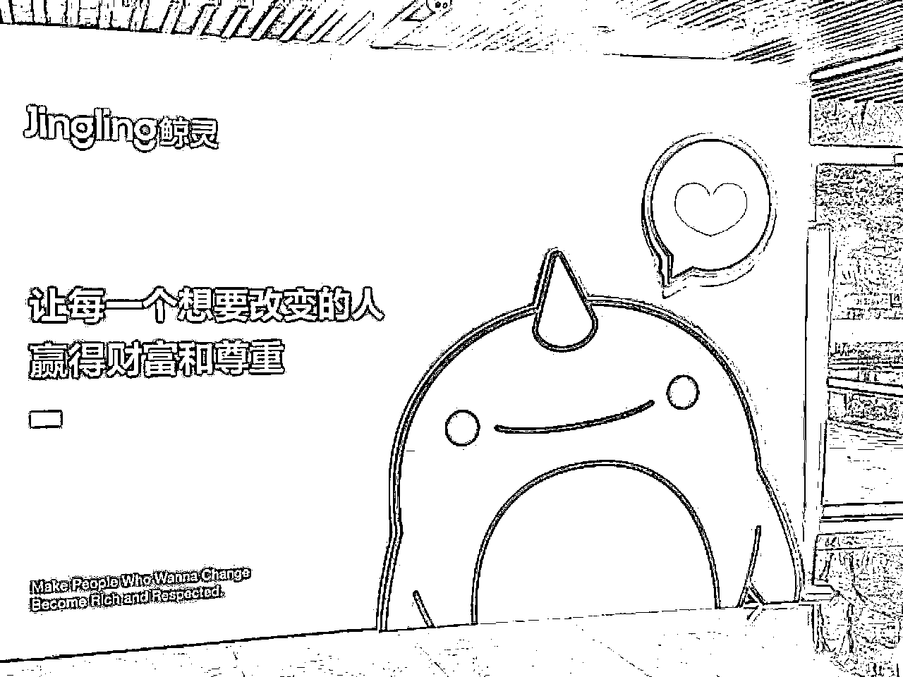

公司的slogan还是很戳到我的

我们团队讨论过人货场问题，我们虽然有一批销售和市场能力很强的团队长，但是我们的货盘和产技，肯定是没办法和融资20亿的大公司相比，与其在漫长的筹备期丧失先发优势，倒不如抱大腿合作共赢。

我们虽然在22年底又开发了一个小程序，但没有启动，总感觉缺点什么，和鲸灵聊完，发现对方的背书运营完美补足了我们公司的短板，最后all in大牌鲸选。

决定合作的三个原因：

1.  老板以前是聚划算的总经理，特卖供应链天花板，去年做了200个亿。

1.  社交电商是基本盘，和大厂不一样，不担心被砍，还拿到了腾讯投资。

1.  运营的同学是从各大社交电商平台出来的，有丰富一线实战运营经验。

*   回归人货场的问题

a.怎么搞到人？

新项目起盘最最最重要的就是人，主要是指的核心团队长，我们称为私域流量主。

作为项目方是没有办法去对接所有人的，要找到一些超头，让他们带着团队过来。

那么21年以后还能做到逆周期增长，通过社交电商赚钱的领导人，有团队也有卖货的能力，为什么要选择你的平台？你能给她的用户提供什么，给她下面的小b提供什么？

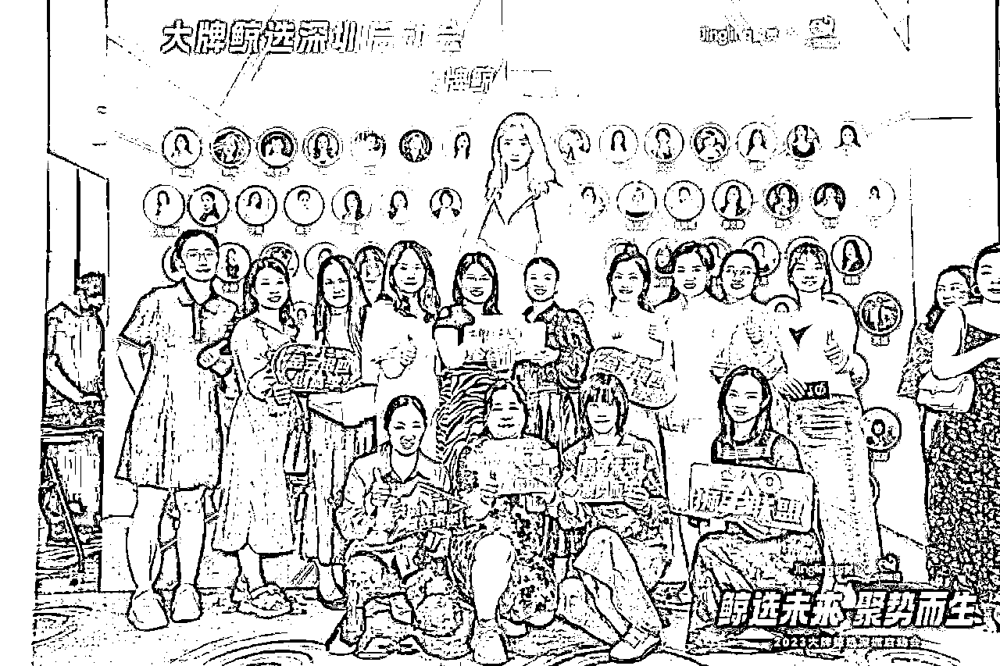

多问问自己能给代理提供什么服务

我们三月份内测，群买买四月份关停，所以我们团队当时开玩笑的说，去年给ktt送人头，今年qmm把人头加倍拿回来了，奇妙的缘分。

当然bd团队长也花了很多时间精力，因为争夺qmm头部资源的不止一家平台，除了平台的自身实力优势外，我们晓之以饼，动之以利，还切切实实做了定制服务。

1.  人货匹配，根据流量主的用户画像和诉求，打造适合他们用户画像的爆品，快速树立收益标杆和信心，帮助他们快速聚拢老团队带入新团队。

1.  技术定制化服务，比如有头部很有实力，希望给自己的代理定项补贴，或者非常有销售能力，想在平台售价基础上实现加价功能，技术团队会优先完成市场的开发需求。

1.  孵化IP标杆，线上拍摄塑造创业女性IP，线下会议紧密连接代理，溯源活动加强信任背书，团长只要安心卖货，其他公司搞定。

b.货有啥优势？

流量的尽头是私域，私域的尽头是电商，电商的尽头是供应链。

鲸灵从17年开始就一直在深耕供应链，而不是融资后一味的烧钱，这也是在很多社交电商走下坡路的时候，还能连续7年逆势增长的核心原因。

我们有很多单场销售百万甚至千万的品，是如何打造的呢？

举个例子，有个品牌叫圣牧，蒙牛收购的，前年销售额是一个亿，现在我们集团一年能卖一个亿，单场破千万。

私域打爆款的流程是什么？

溯源+种草+直播+特卖

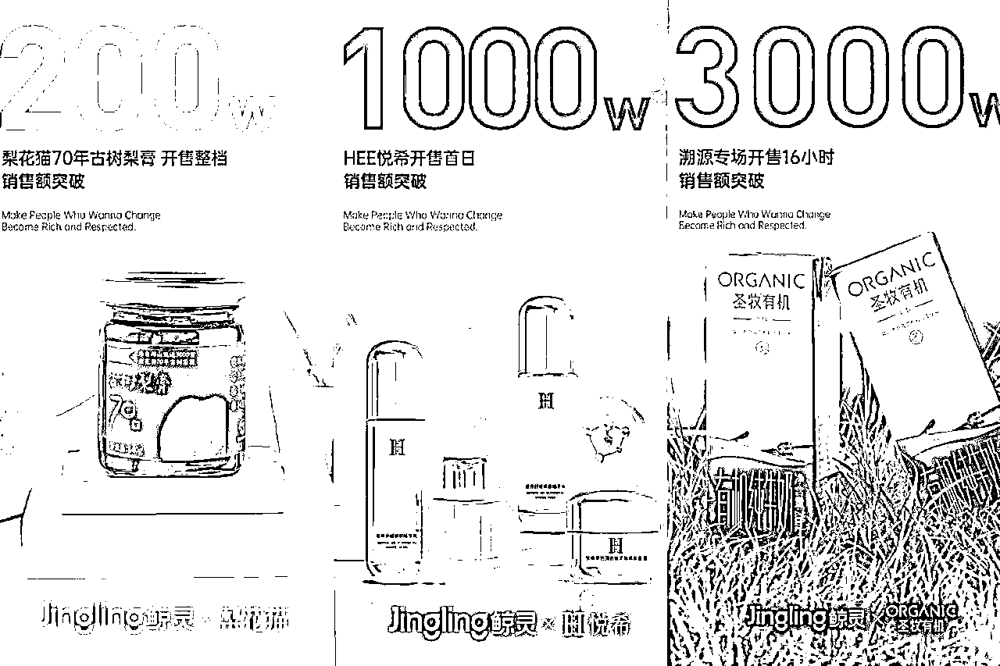

部分卖货的案例

首先，组织代理去溯源，因为私域营销的底层还是信任，好的品牌以及给力的价格，也是给代理反向做背书的，平台应该给店主和他的用户之间不断增加粘性和信任度。

其次，丰富的营销奖励活动，充分的宣发素材，在店主群里不断造势，抓住代理注意力，让他们愿意不断去刺激终端的销售，在社群和朋友圈预热。

最后，复盘表彰，引导优秀店主分享，让大家看到日入过千过万的收益标杆们，知道如何卖货赚钱，再开团的时候可以不断复制成功。

核心还是用给力的利益机制驱动店主去销售，毕竟卖货是为了赚钱。

c. 场的核心优势？

毋庸置疑，普通人创业或者做副业门槛最低的项目依然是社群卖货，0门槛只需要时间，试错成本极低，市面上很多平台的供应链体系都很成熟，挑个自己认可又有结果的上家跟着学就行。

如果运气好踩上了上升期的新平台，卡住好的位置，可能真的会实现财务自由，市面上能喊得出名字的项目头部都是赚了几百万甚至几千万的。

作为新平台，我们会有很多支持，有个运营指标就是帮助店主拓展用户，所以会提供很多刚需产品引流，9.9的20枚鸡蛋，或者公益图书等等。一场线下地推或者线上宣发可能就能加几个群作为种子用户，后续还有系统的培训，帮助代理更好的裂变和精细化运营，新人0成本创业可以充分利用起来。

有代理做项目之前微信小几百人，借着项目赚到钱还加满几个微信号，所以我经常和代理说，努力做市场卖货，不是为了平台打工，而是借助平台资源创业累积原始资本。上班也是同理，提升自我才是解决问题的核心。

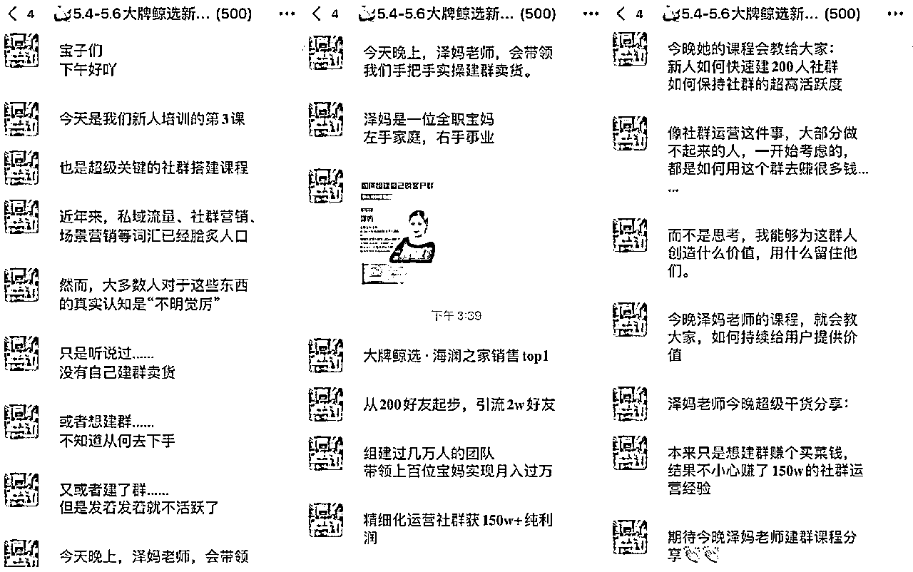

宝妈本来建群想赚个买菜钱，不小心赚了150w

像有些做小区生意的宝妈代理，维护一两个群，围绕老客户不断做复购，带娃同时一个月就赚个一两万，就很舒服。

和微商的单一品类不同，我们提供了全品类的选择和有竞争力的产品优势，让店主可以保持社群的新鲜感和活跃度，高粘度的复购其实都是在私域。

而且会借势的店主会不断提升自己的业务能力，不断破圈打造自己的IP，累积资本和经验，借助平台实现自我成长。

选择什么平台无所谓，关键是考虑自己的成长。

*   教育的重要性

这个其实是我们的长板，一方面，负责人是一线出身的团队长，深知市场痛点和需求，另一方面，我们从21年开始就同步在做知识付费的运营和孵化，有很成熟的交付经验。

我自己以前也是xdf的老师，蛮会打鸡血的。所以团队的商学院基因很强，市面上培训的优点吸收迭代的很快，而且实操性很强，以搞钱为目的，绝对不会浮于方法论表面。

因为公司的私域运营，其实是抓住店主的注意力。

而团长的私域运营，是抓住终端消费者的注意力。

为了抓住注意力，我们除了传统的课程体系搭建以外，我们商学院（负责人都是生财会员哈哈哈）借鉴了生财的小航海，事实证明效果真的是非常好，比起之前0门槛培训寥寥无几的反馈，打卡制让社群的活跃度瞬间提升，也带动了销售额的增长。

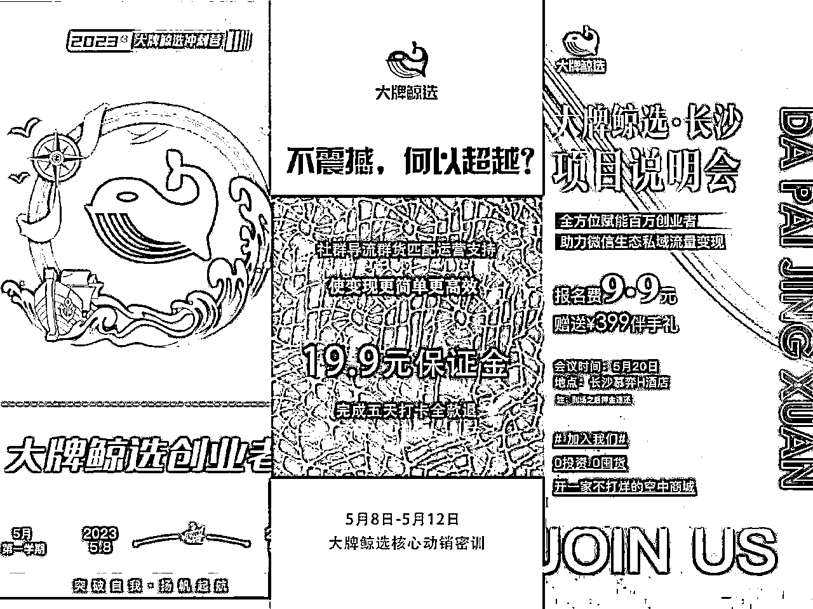

收费等于收注意力

创业就是延时满足，相比于个体在公域赚钱，私域卖货的正反馈其实快很多了，所以给团长清晰的晋级路径引导他们打怪升级，不管是新人小白还是资源户，都能找到匹配的课程继续提升，让收入稳步提升，愿意留在你的平台卖货，同时还愿意邀请更多的人进来一起卖货。

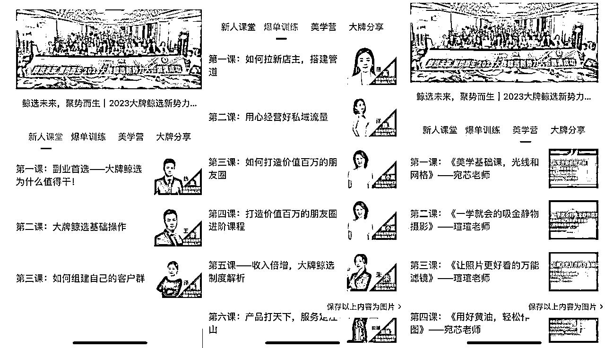

部分培训课程展示

线上聊千遍，不如线下见一面，所以我们也在各大城市组织线下会议，赋能团长传递政策的同时，也给他们提供舞台，更好的触达代理。

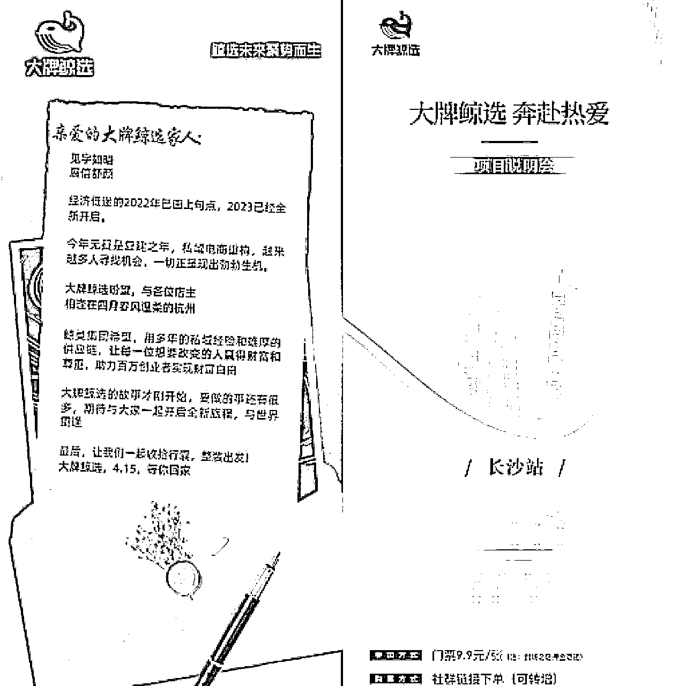

每个月组织线下会议（抄了生财很多作业，再次感谢！）

在我看来，成功是可以复制甚至跨行业复制的，在生财默默的链接了很多资源，也抄了很多作业，真的很感谢。借着这次输出，希望也能给圈友们带来一丢丢小启发，再次感谢生财。

1.  关于未来我个人的一些小看法

其实本来在3月份疫情放开，我有点不想折腾平台了，难而正确的路太辛苦了，也想换个easy模式，觉得一个人搬砖也很香，想继续三年前环游世界的计划，旅居100个国家。

过完年遇到了大牌，发现自己还是不甘心躺平，又燃起了小火苗，决定all in操盘，很开心实现了我的目标，算是给前两年的折腾竖了一个小里程碑，所以创业的宝子们要坚持呀，可能现在的黑暗是因为黎明很近啦。

五月底当大牌步入正轨稳定发展，我也就给自己放了一个小假期，连飞了首尔瑞士巴黎，在一个多月的旅途，我也在思考我个人的增长点。

时隔三年再做数字游民的快乐

回国后，和公司的负责人也深度的聊了几次规划，也很感谢小伙伴的理解，让我从台前转幕后，由我的合伙人继续担任大牌的CMO，负责1-100的发展。

我的性格也蛮爱折腾，喜欢不断测试新项目，所以继续试错，围绕微信生态，尝试用视频号做放大和裂变，我觉得私域一定有更大机会的。目前我们测试，不管是通过群直播转化代理，或者视频号卖货，效率都比以前更高。

回顾过去三年，有些个人小观点

第一，想做大不可能一个人干全链条，抱大腿很重要，比如我一个女生不会去卖房创业，一定会找资方合作，找大厂做背书，在路上找伙伴补短板。

第二，一个人的能力不仅仅是看高峰，也要看有没有空杯的能力和触底反弹的能力，不要被过去的成就束缚未来的自己。团队长尤其要警惕被管道收益温水煮青蛙，一定要培养自己不依附于任何平台和项目的能力，如果风口过去，考虑自己能留下什么。

第三，创业也只有一种英雄主义，就是认清每个项目都是不完美的，但是依然愿意撸起袖子拼命干，道阻且长，但机会总是有的。

第四，不要因为害怕失败而不去尝试，这两年确实因为试错浪费了很多钱和时间，但是创业就算迷茫也要前进，乐观一点，在过程中完善认知和资源，犹豫只会消耗自己和团队的信心。

第五，一边狩猎赚快钱带团队吃肉活下去，一边长期主义种地去搏更大的未来，用赚钱的生意养更值钱的梦想，活下去，只要不下牌桌就有机会。

第六，出走半生归来仍是私域，公域做流量，私域做利润，要有自己的盈利闭环，哪怕现在电商或者实体的业务很赚钱，依然要提前考虑布局私域，来应对未来的不确定性。

最后，与其一个人迷茫，不如线下多出来和圈友聊聊吖！

祝愿大家今年最后几个月，都能完成自己立的2023年flag。