# RPA+ChatGPT自动制作生财日/周报&个性化定制关键词推送发帖

> 来源：[https://fqlleg2dnfa.feishu.cn/docx/LmIFdYsDko7xOCx4HPqcUkSenMg](https://fqlleg2dnfa.feishu.cn/docx/LmIFdYsDko7xOCx4HPqcUkSenMg)

# 前言：生财所有与RPA相关帖子

RPA是什么，这里就无需多言了，因为生财已经有非常多的相关普及贴，鱼丸还贴心除了RPA合集。

而且很多圈友也是在看了许多RPA精华帖之后，开始上手影刀，然后把自己的业务批量自动化提高了好多倍！

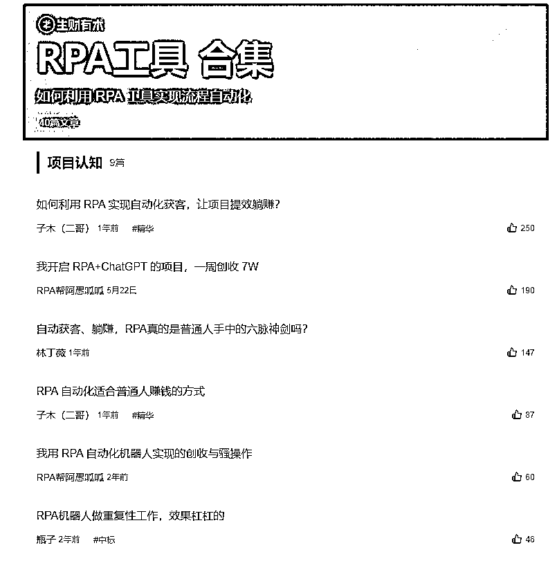

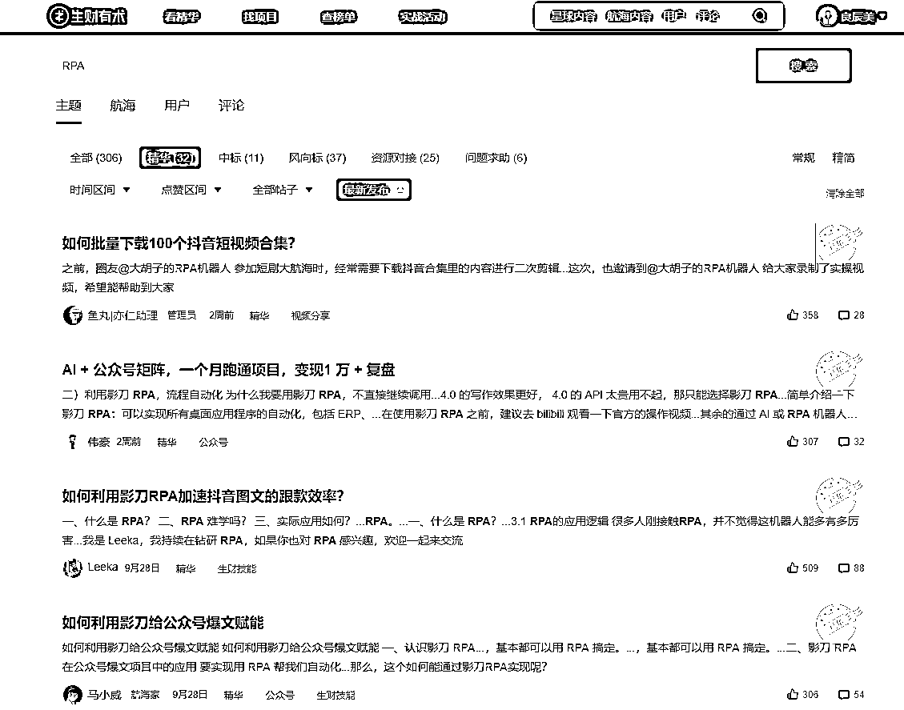

我这里稍微整理了所有可以提供RPA功能的工具，国外的居多尤其是小众产品，这个本质上就是低代码自动化，说白了就是把英文的代码，转换成可以拖拽的功能框和中文语句。

# 篇章壹：日报周报篇（生财有术搜索引擎）

我做这个前后花了快十天时间，当然前期的工具测试花费时间居多，现在基本已经完全跑通自动化了。

一切都来源于上周亦仁所发的周报，我当时想着简单评论一下RPA或许也可以实现。

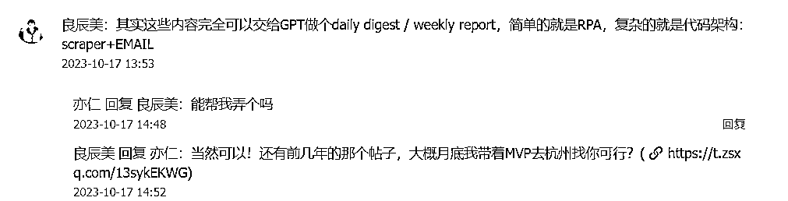

但事实上，当我真正开始着手的时候，我发现知识星球和生财有术的搜索引擎，全部都限制内容抓取。

所以我在第一步，批量获取帖子信息（标题和链接），就卡壳了三五天时间。

这其中我尝试了用Uibot（我最擅长却熟悉）和Automa（谷歌浏览器插件）

结果效果并不理想，用是能用，但是Uibot耗时长达一个小时，虽然可以做到完全自动化（甚至我把ChatGPT的prompt都调试了几十遍得出最终版）;然后那个谷歌插件Automa太薄弱了，我代码弄得过多，导致插件非常卡顿，当然速度也算是比较快，就是最后还得加入人工去发给ChatGPT（因为浏览器插件不如桌面软件那样可以完全控制本地文件）

仅仅是为了准确地获取每一个帖子的链接，我都花费了一整周的时间，因为知识星球和生财有术的网页版元素全部都做了反爬处理，我只能完全模拟人工去慢慢操作，于是RPA搞得又慢又卡（我总共弄了快两万行代码），而且还容易出错。（虽然最后文档版本的基本没问题了，但我感觉还是略有瑕疵。）

一直想着完蛋，这没办法交差了，难道是我技术不行？

本来我不想用影刀的，因为这个软件免费版本看不到代码，而且还没办法导出共享给其他电脑，所以我就一直觉得这是一个免费阉割版的RPA。

直到我发现了影刀的高级用法，爆款循环相似元素和模拟键盘点击（我以前一直以为影刀没这个功能），进而我还研究出如何查看影刀脚本的源代码，以及共享复制给其他账号其他电脑（出于可能侵犯影刀商业利益原因，这里就不公开阐述了），于是我发现影刀还是比较适合某些复杂多流程防反爬项目当中的。

这里非常感谢阿盛@邹培盛跟我关于影刀的用法交流。

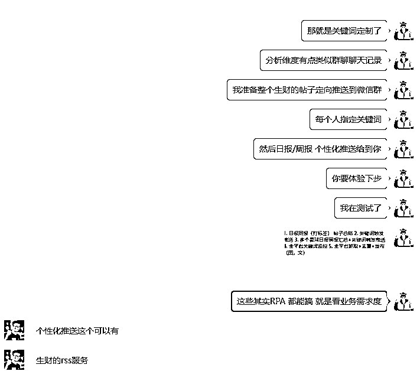

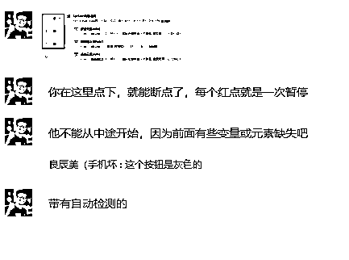

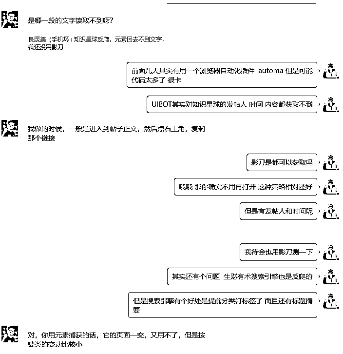

### O、极简使用教程 （UIBOT版本）

此处仅公开Uibot和Automa这两个的流程压缩包和插件安装包，因为两者都可以用于非商业用途公开分享。

(出于商业风险考虑，只展示影刀操作流程，暂不分享具体代码文件，关于影刀版本的成熟化解决方案，咱们可以私聊详细部署，看到的行内高手可能自己想就有方案了）

###### A, 必备条件（WINDOWS系统）

*   软件：Uibot（+插件），Excel/WPS，谷歌浏览器

https://www.uibot.com.cn/

*   账户：Uibot, ChatGPT PLUS，科学上网工具

https://chat.openai.com/

*   状态：已登录生财有术系统，已登录知识星球账户，已加入生财有术星球

https://search01.shengcaiyoushu.com/，https://wx.zsxq.com/dweb2/index/group/1824528822

###### B, 使用指南

*   注册账号，安装软件+插件，导入压缩包

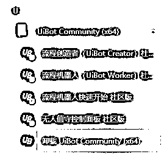

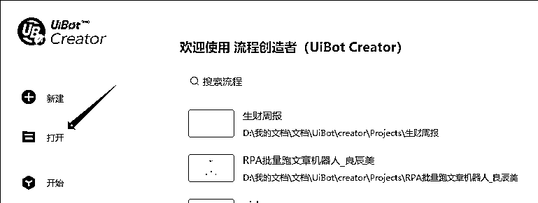

这里是Uibot社区版的机器人流程压缩包，请注意在安装后，一定要先根据自己的电脑做基础调试。（会RPA的就懂得都懂）

*   确认一下表格文件夹，点击运行即可（后面更新为文件地址，周报自动生成流程页需要新增个地址，这样就可以完全自动化，机器人自己把文件发给GPT再自动下载获取）

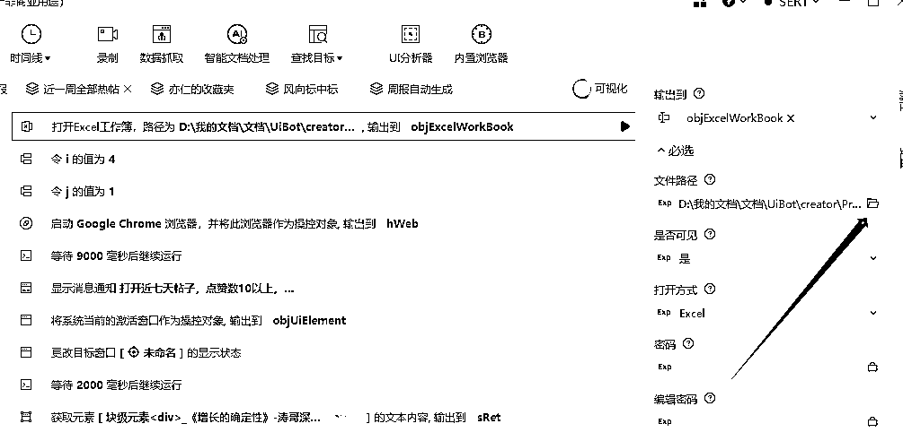

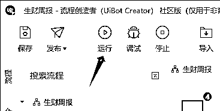

### 一，自动化步骤配置思路

最简化是两个步骤，这是站在岸上看别人游泳时觉着的简单：不就两条腿往后蹬吗？

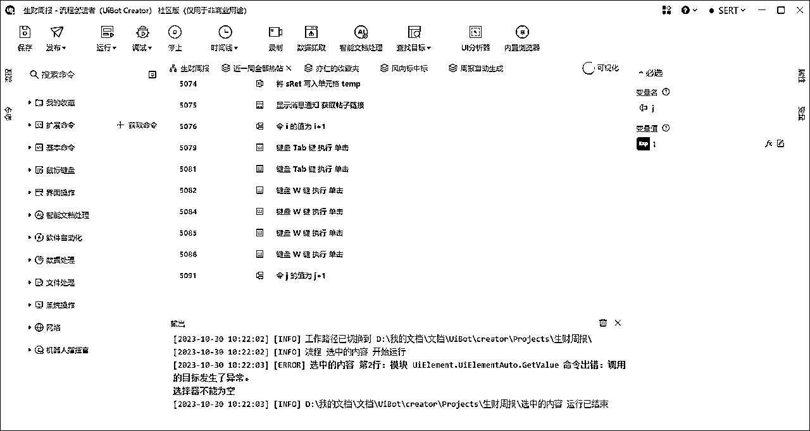

但真正执行起来,RPA快超过2W行代码，大概两千个步骤，因为要绕过帖子反爬，没办法运用循环简化。

这就是做起来，真感觉跟刚学游泳的时候一样，虽然我在岸上练习了标准动作很久（UIBOT我确实很熟，都可以闭眼写基本流程代码了），但是等下到水里面只感觉胸闷气短，两条腿有力气使不上劲，然后就老师呛水（真正项目市场，我反复测试了各种方法和方向，不算调试时间，方案就整了七八套去部署）

简单提一下，RPA的核心并不是代码，而是流程设计，速成你人工要怎么做的SOP，然后就需要交给机器人来完成，当然为了批量自动化的效率考量，这里面还有新的迭代升级，可能要借助一些插件什么的。

换句话说，两个都懂RPA的圈友，可能针对同一个项目，设计出来的是完全不同的流程（可能借用的工具也不同）

这个想法是我在看其他圈友设计公众号RPA批量自动化的思路冒出来的，跟我的确实大不相同。

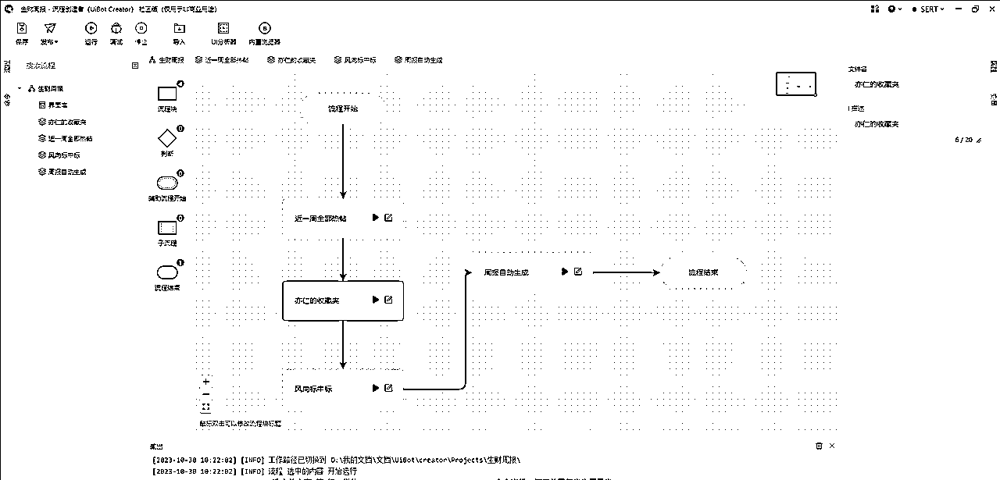

UIBOT因为缺乏影刀的相似元素循环获取，所以就导致代码比较多，影刀500行代码解决（内置二十次循环*8倍），Uibot是花了5091行代码解决（外置循环因为反爬用不了）。

当然也可能是我学艺不精，没徒手写自定义代码，或者说找到更高阶的用法，UIBOT我确实是花了三天部署，而影刀就只花了一天。（有效制作流程时间也就三个小时，剩下的就是调试，因为我写代码和流程总是考虑不周到，犯的很多错误就需要在测试中一点点纠正）。

### 二，具体实操遇到各种问题

本来以为操作非常简单，因为逻辑就两个步骤：获取帖子信息+发给ChatGPT

但是在第一步我卡了三天，因为生财有术搜索引擎和知识星球都没办法抓取帖子详细信息

RPA无法固定元素获取，我换了Automa浏览器自动化插件获取，但是元素太多非常容易卡顿

最后还是用Uibot完成，只能抓取三部分数据，比较多信息叠在一起

又导致ChatGPT没办法用正则表达式抽取详细信息

因此目前仅是一个粗略版本。

更新：所有问题已解决，只是代码比较多，最完美版本是VPS+RPA。我的方案是用腾讯云VPS，RPA机器人放在VPS里面，24H运行不用管，定制化发消息弄个单独微信即可。

#### 甲，Uibot完成帖子信息抓取和交给CHAGPT判断整理出周报（耗时长1h+ ，全部自动化）

*   机器人流程压缩包（完成了A必备条件的软件插件安装，就可以直接导入这个压缩包）

#### Automa浏览器插件获取帖子信息（发给CHATGPT还需要人工）

https://chrome.google.com/webstore/detail/automa/infppggnoaenmfagbfknfkancpbljcca

（回看后发现要重点标注一下：这里是依托于生财有术搜索引擎的元素获取模块，当然本身是获取不到链接和太多数据的，只是尽可能模拟人工获取帖子链接【附带知识星球个人标识链接，所以还是得有付费会员才能查看】，同时如果生财有术搜索引擎的网页元素发生变化，该RPA可能失灵，这是为什么那么多工具应用都需要人工维护的原因，由于网页更新不定时，该贴的代码可能无效，但思路还是一样的）

### 三，注意事项（出错和调试）

以上RPA代码在具体的不同电脑环境中，可能还需要额外调试，花费时间取决于环境参数。

<h7>3.1 机器人层面</h7>

流程压缩包导入后要确认表格文件夹

目前流程是机器人自动打开所有网页和表格

机器人第一次打开生财有术搜索引擎网页时，有30s左右等待时间，可以人工调整筛选条件

<h7>3.2 外界环境层面</h7>

因为RPA机器人的稳定性非常依赖运行所在电脑的环境，所以流程压缩包迁移电脑后，需要调试一下巩固稳定性

Uibot没有MAC版本，建议用WINDOWS系统或者腾讯云VPS

没有科学上网工具打不开CHATGPT，网络IP不稳定或者速度太慢会卡顿或者出错

3.3 影刀机器人注意事项

EXCEL文件要事先绑定

主题帖在sheet1，风向标在sheet2

开科学上网工具才能打开GPT

所有账号都要默认已登录

影刀切换页面用的是搜索引擎，关闭页面用的是zsxq，所以要关闭其他相似无关标签页

### 四，后续优化（待定）

###### 4.1 目前还存在的问题是：

CHATGPT并不能完全准确得把文章分类，可能还需要加人工辅助判断，

同时增加更多的分类下的关键词命中（放在prompt当中）

【欢迎各位圈友提出更多意见！】

（一直想早点做出来成熟版，所以就用了三种工具测试，目前效果最好的是影刀，但是也耗费了很多时间，后面具体优化再看时间安排）

###### 4.2 To Do List

# 篇章贰：知识星球原生网页（此方法理论上适配所有知识星球）

我想做这个，一开始是真觉得搞这个RPA流程应该挺简单的（我大意了！）

我为什么花这么多时间在这上面，因为我觉得不能表现出太差的RPA水平啊（居然连这都搞不定？）

我为什么还要做这些拓展思路延申的机器人，既然想到了，那就不如做到（其实在等有缘人交流哈哈）

目前据我所知，只有生财有术和淘金之路，这两个知识星球有在做自己的搜索引擎系统。

其他那么多知识星球，似乎都是人工统计做周报的。

诺，现在机器人来了，RPA+GPT：

完全可以部署自动定制化日报+定期周报，只需要星主最终删减即可

当然知识星球官方可能也会做这块，但是RPA的部署成本是非常低的

而且完全可以定制化，想怎么设计流程，都按想法来实现

如果有需求的可以找我，我对批量自动化还是蛮感兴趣的

### O、极简使用教程

###### A, 必备条件（WINDOWS系统）

*   软件：影刀（+插件），Excel/WPS，谷歌浏览器

https://www.yingdao.com/client-download/

*   账户：影刀, ChatGPT PLUS，科学上网工具

https://chat.openai.com/

*   状态：已登录生财有术系统，已登录知识星球账户，已加入生财有术星球

https://search01.shengcaiyoushu.com/，https://wx.zsxq.com/dweb2/index/group/1824528822

###### B, 使用指南

*   注册账号，安装软件+插件

*   按照我展示的流程来做

*   或者购买影刀付费企业版本（据说年费好几万）使用这个发布到市场的脚本

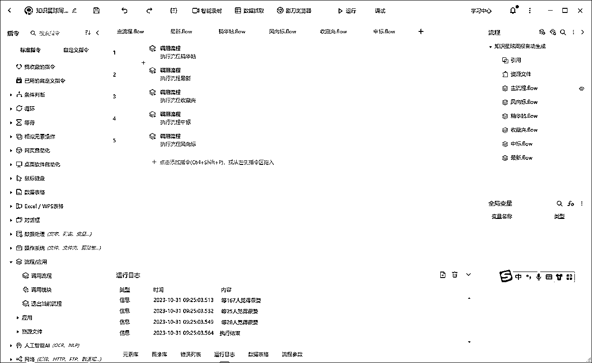

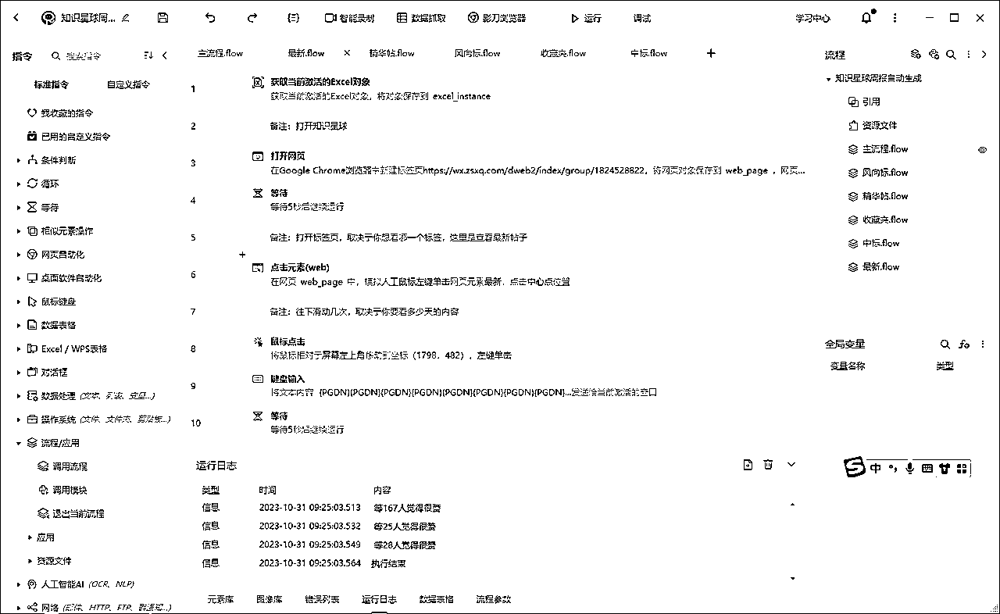

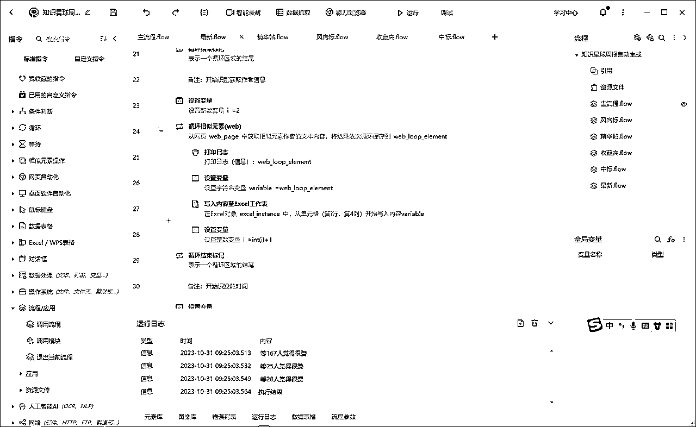

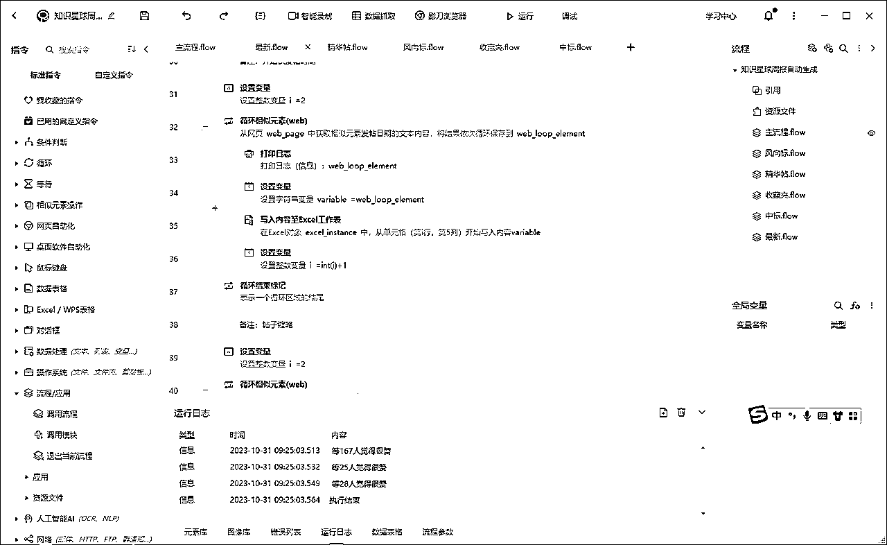

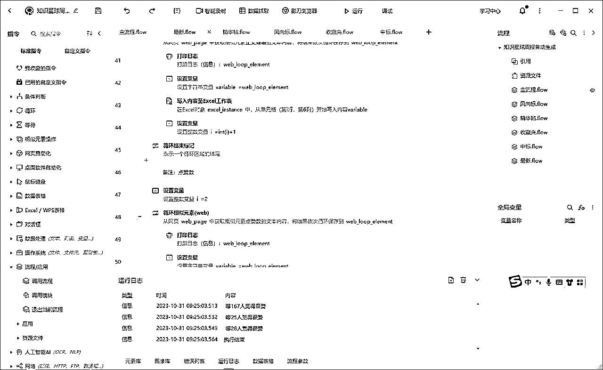

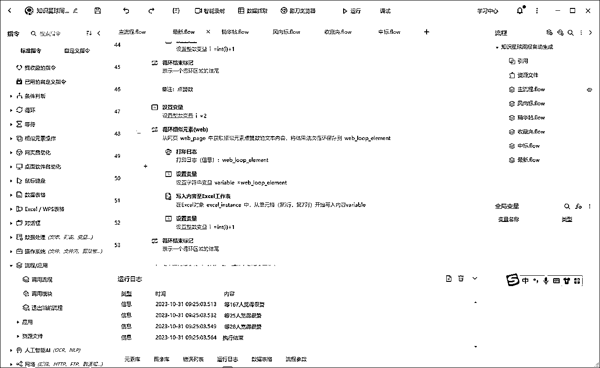

### 一，自动化步骤配置思路

逻辑看起来非常简单，逐一循环获取相似元素（作者，发帖时间，文章更改，关键词标签，链接）

当然大部分文章都是在飞书等文档上，我们并不需要全部获取，只要概览即可

然后把内容发给GPT，可以通过文件上传（GPT4），也可以复制粘贴（有TOKEN限制）

其实用CLAUDE或者国产KIMI CHAT也都行

### 二，具体实操遇到各种问题

事实上当帖子没有被打上标签的时候，该元素就不存在

如果用UIBOT，这里可以当中空白

但是用影刀的相似循环元素，就直接略过了，会导致左右两列数据没有对齐

### 三，注意事项（出错和调试）

该流程利用谷歌浏览器，所以你电脑要安装

起始是绑定已有打开表格，所以不能关闭，且需要有已创建的五个Sheets

### 四，后续优化（待定）

针对不同电脑可能要调整适配性

看圈友实操反馈

# 篇章叁：订阅关键词做个性化生财日报推送微信（包括历史精华帖和每日新增贴）

### O、极简使用教程

你干脆找我吧，省得配置一堆软件

我在想前期可以找一些圈友测试下

毕竟真实效果还不清楚

花钱卖服务，付费就是捡便宜

如果你也很感兴趣，也可以评论区交流

其实可实现的方式和可玩的路径非常多

甚至RPA只是最低级的配置，当然成本也最低

### 一，自动化步骤配置思路

*   这里面可以单独获取某一个【标签】或者【板块】下的帖子或者只获取最新的一条帖子

*   帖子信息（标题，链接，标签，正文大纲，作者）交给GPT判断筛选【给定PROMPT到你想要的输出结果】

*   通过企微/个微/QQ/飞书发送到个人/社群

以上思路针对全平台都通用

以上思路用代码脚本化，API对接速度更快

### 二，具体实操遇到各种问题

### 三，注意事项（出错和调试）

同一个电脑调试稳定后就还好，如果切换电脑，可以要列出来需要调整的清单（增加微信账户）

不能太过频繁刷新和循环

### 四，后续优化（待定）

如果人数过多，可能要分多个流程完成

# 篇章肆：生财合集制作

在鱼丸发帖的RPA工具合集下方有圈友评论想要年入百万和年入千万的合集：

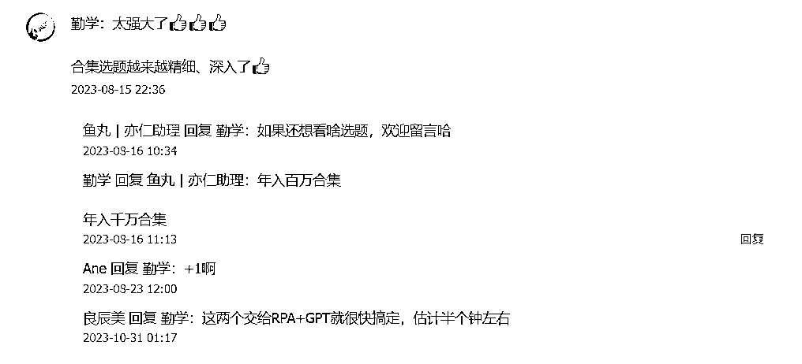

那么我们来简单测试一下，因为流程已经制作好了，接下来只是想要稍作调整即可：

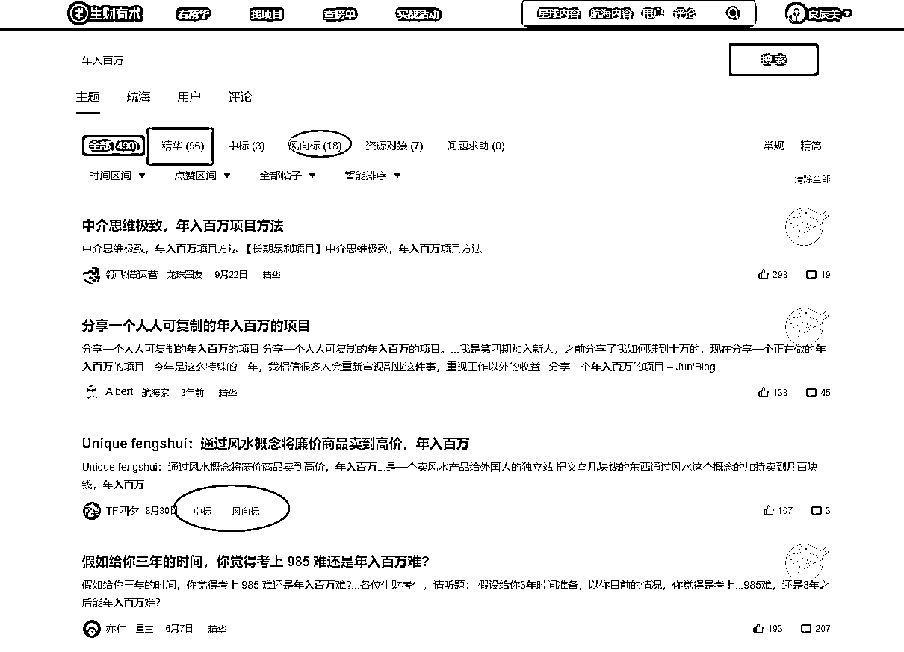

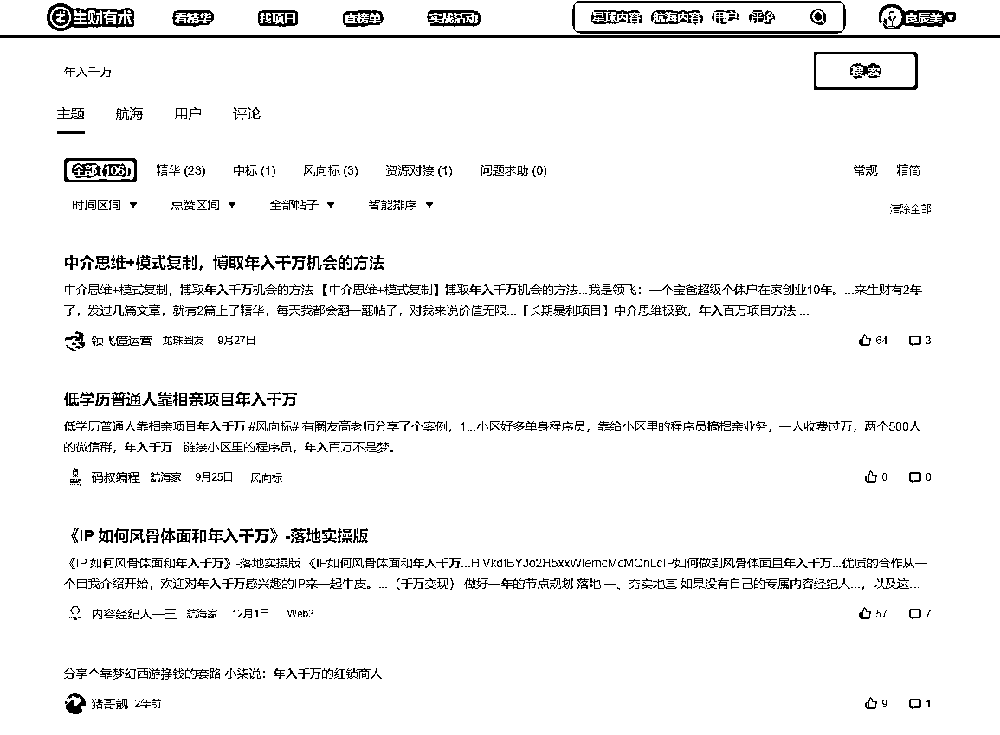

左边是年入百万的帖子，RPA全部抓下来，交给GPT分类即可，粗略来看精准度还挺高的（我们甚至可以精确分类风向标和主题帖）；右边是搜索年入千万的命中的帖子，但是相关性都不高，数量也少，交给GPT后可能还需要人工花点时间筛选。

当然你也可以更换关键词来获得更多命中帖子，比如赚一百万和赚一千万，读到这里有心的圈友可以自查一下，贴图到评论区，大家就可以看看区别。

### 🐎、实操结果：

（处理完发上来）

【同时可以交给GPT做新人QA百问百答】

后面我可能会陆续抓一些关键词下的生财精华帖，自动发给自己慢慢一天看几篇，只有标题+链接，所以还是要知识星球会员查看，别想歪了哈

# 篇章伍：亦仁几年前的一个小产品设想

亦仁

2017-05-09 12:46

#思路分享#

https://wx.zsxq.com/dweb2/index/topic_detail/15285125851282

如何找到一些好的操作思路？

主关键词：Amazon，blogging ,mobile affiliate，niche sites，Adsense，YouTube，Instagram，Whatsapp，淘宝客等

副关键词：Journey， follow along , income report，实战，记录等

搜索条件： 最近三个月，最近一年等

组合起来搜索就可以看到很多目前可以学习并且可操作的思路。

将搜索到的相关主题都看一遍，记录关键点，梳理一遍思路就可以开始操作了。

一遍操作一边遇到问题一边再重复上面的思路。

搜索挖掘能力可能是一个人需要拥有的最重要的能力之一。

### O、极简使用教程

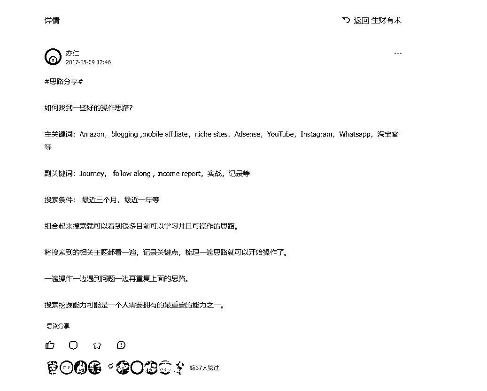

如果你感兴趣想做的话，那么看我的思路，你自己也可以直接搭建完成。

帖子上的信息和方法都是永久存在的，做完之后交流，可以再做思维碰撞。

### 一，自动化步骤配置思路

### 二，具体实操遇到各

### 种问题

### 三，注意事项（出错和调试）

由于这个机器人太过庞大，更换电脑肯定调试就很复杂，所以一直放在VPS就行

抓取的很多内容都是无效的，ChatGPT判断没那么精准，这个要更换其他GPT测试一下

### 四，后续优化（待定）

可以更换甚至全部使用五大搜索引擎（谷歌，必应，搜狗，百度，DOGE）

可以新增关键词做列表，可以加入GPT做自动化筛选和判断

可以做成一个网站的形式，做RSS订阅服务

# 篇章陆：RPA通吃全平台-我做公众号和抖音的思路

### 🦌、历史RPA机器人汇总

出于个人使用，我做了很多机器人，因为这个是完全可视化的汉字语言编程

而且就算出错了，也可以根据错误日志信息很快调试

完全不需要学习任何代码

### 🦌、公众号

具体代码可以看这篇精华帖

公众号爆文项目：批量公众号自动化发布文章和生成草稿 流程分享

https://wx.zsxq.com/mweb/views/topicdetail/topicdetail.html?topic_id=188525588245142

几个月前做美女号项目弄了份SOP

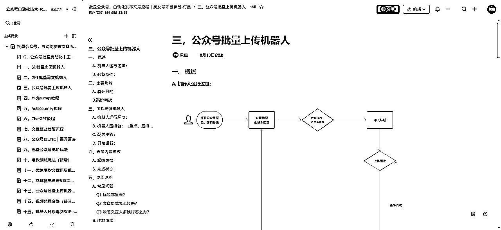

### 🦌、抖音图片批量

合作的项目，反正也是用RPA跑通的流程

生财也有很多这类帖子：

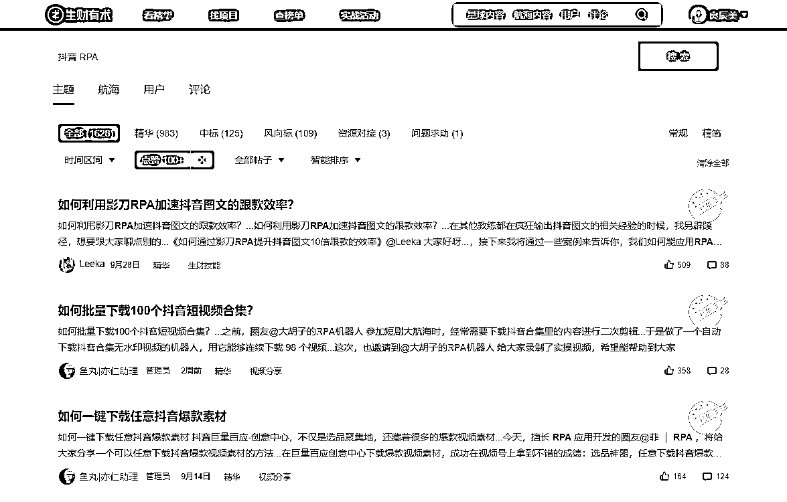

# 篇末：RPA的辅助&通用赚钱秘籍

简单总结一下本篇文章，介绍和实操RPA能做的事情：

1.  日报周报（打标签） 帖子总结

1.  关键词触发推送

1.  多个星球日报周报汇总+关键词触发推送

1.  全平台关键词监控

1.  全平台抓取+去重+发布（图，文）

这里面代码和工具都不是核心，最顶层的是业务需求和逻辑设计。

我差不多花了十天实操，从晚上十一点开写这篇文章，一直到现在中午十二点多。

终于快完成了，还有一个篇章伍的小MVP没弄完，后续更新。（如果有圈友感兴趣订阅的话，可以免费体验，因为我也在测试当中）

以上，祝阅有所获。

更新1，其实还有生财合集市场和影刀的应用发版链接，这个晚点，还在抓取和做最终优化。

更新2，写得断断续续，凌晨还打瞌睡，可能有些语句不通顺和错别字，后面过几天我再通读一遍会修改下。

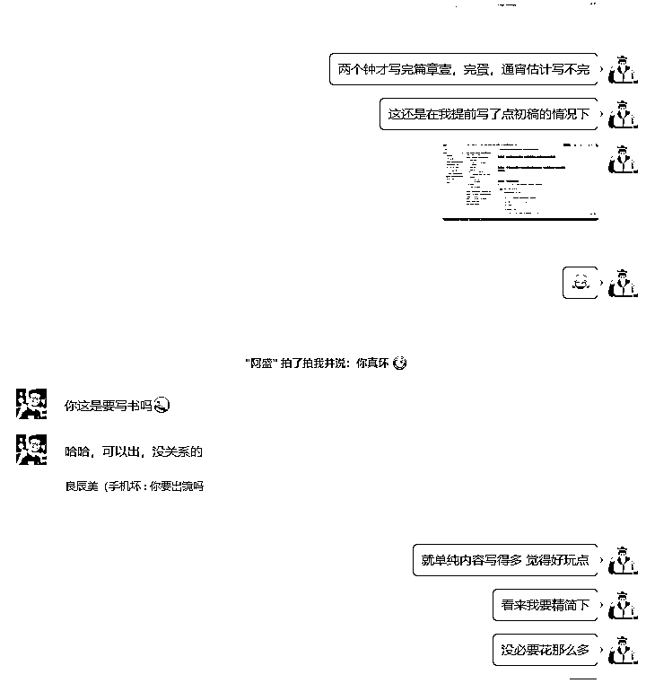