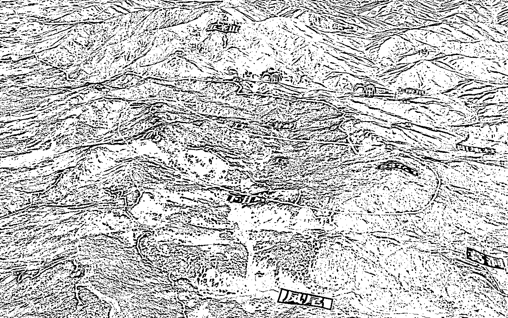
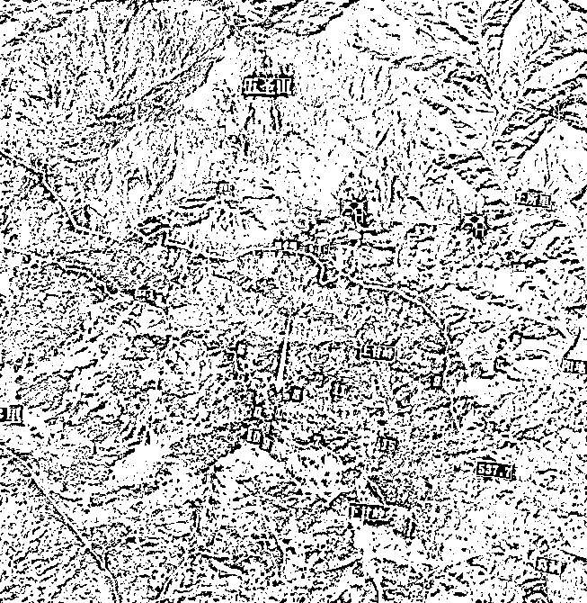
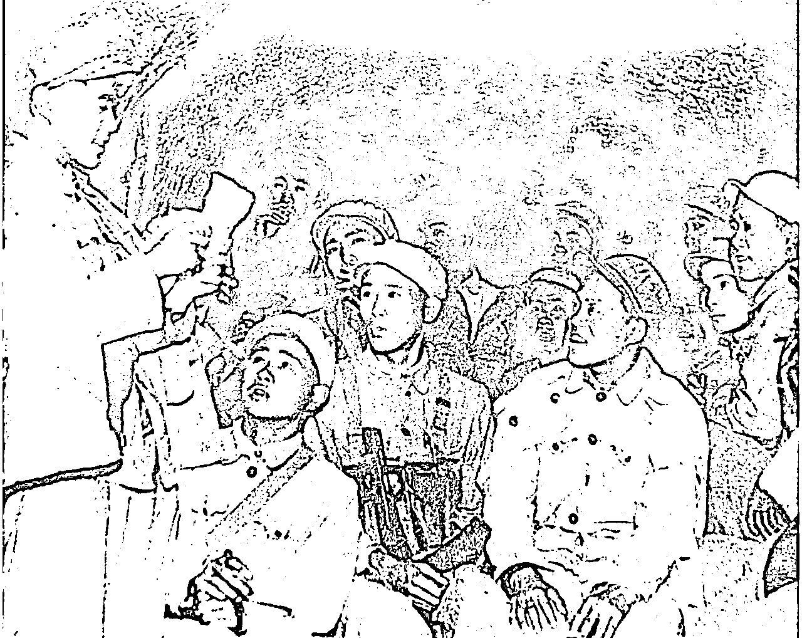

# 团队遇到极端困难怎么凝聚人心？战史上给出的4条硬核干货

> 来源：[https://xko95z0i3k.feishu.cn/docx/EncDdlmWToK2dtxqZOpcYDF8nve](https://xko95z0i3k.feishu.cn/docx/EncDdlmWToK2dtxqZOpcYDF8nve)

作为一个创业者，或者团队带头人，你是否也有不知道该怎么鼓励员工，让员工为自己冲锋陷阵的痛点？亦或者在公司面临困难时，员工出现畏难情绪，不知该怎么增强团队凝聚力的痛点？也许今天这篇文章能给你一定的启发

Hello，大家好，我是擅长讲红色故事的军事博主小光。前某官媒的记者和全能编辑，今天想从公司目标定位，团队组织架构等方向跟大家分享点不一样的内容。

最近，我越来越理解创业的艰难，创业在很大的过程中，不过也是在打一场场硬仗，只不过这个过程没有硝烟。都说太阳底下没有新鲜事物，正如道坤老师当年读毛选的时候，悟出来了“蓝海思维”一般。马云在事业低迷期，也曾跑到延安去寻找灵感，华为的老总任正非也是部队出身，作为学毛选的先进代表，华为公司身上也有着部队浓厚的影子。所以今天，想通过自己的老本行，跟大家讲讲红色经典战例，希望能给大家带来一些启发。今天主要想分享的内容是，如何在极端困难的环境下保持团队的核心凝聚力。战例来自于大家耳熟能详的上甘岭战役，并且，故事的主人公团队，就是妇孺皆知的“一个苹果”连队的原型。本文前面讲故事偏多，总结性启发在后。

内容开篇，我们先放一个等价对换表，以帮助各位圈友更好的从商业角度理解本文，汲取营养（这点很重要）

1.在现代商业场景中，溃兵感≈员工认为正在做的事毫无价值

2.本文提到鼓舞士气的“算账”办法≈用清晰的逻辑和详实的数据告诉下属，目前在干的事情什么是有价值的。

3.立功及时请功，在现代商业场景中≈做出业绩/完成阶段性里程碑，及时给予奖励，增加其社会认同感

4.战场官兵一视同仁，共苦同甘。在现代商业场景中≈业务冲刺中，重大任务攻坚，领导不缺位，带头冲锋，始终和员工一起在一线应对困难。

抗美援朝，可能别的你不太清楚，但你一定听过上甘岭这三个字—— 一个苹果的故事，一条大河的歌曲，以及著名战斗英雄黄继光的英勇事迹，均来自于此，不过绝大部分人可能仅仅只是听说过，对具体的细节是模糊不清的。这场战役以极端残酷而出名，今天我就把细节详细的讲讲，希望能对广大创业者在激发员工主动性方面能有所启发。所有文案内容来自于上甘岭特功八连连史记录和老兵回忆，确保权威。

今年恰逢签订朝鲜战争停战协定70周年，接下来我们就聚焦到上甘岭的597.9高地的一号坑道里，还原14昼夜的斗争过程，看看“上甘岭特功八连”是如何凝聚团队，让部队始终保持高昂斗争意志的。八连在上甘岭战役中，共参战138人，坚守坑道14昼夜，组织各类战斗100多次，以歼敌1765名的战绩，被志愿军第三兵团荣记集体特等功。战斗中，连队三次打光、三次重建，先后从16个单位补入355人，共伤亡254人，伤亡率已经达到惊人的183%！

读到这里，可能会有很多圈友好奇了，部队伤亡率怎么会超过100%？

在这里首先要做个知识补充，在古代尤其是募兵制时代，一支部队基本上伤亡超过10%士气军心就崩溃了，到了近代民族国家的军队在各种信念和纪律的加持下，军队能保证在30%的伤亡情况之内不溃散。日俄战争中的日本用武士道精神这种极端宗教狂热，让很多部队实现了伤亡过半之后还没有崩溃的情况，最终以非常巨大的牺牲战胜了俄国，50%的伤亡率已经基本是极限。

但是再来看看我们的志愿军，铁原阻击战189师全师9400多人参战，伤亡8000多人，伤亡率高达85%，所剩兵力不足一个团；松骨峰战斗中死守松骨峰的38军335团3连118人参战，牺牲111人，全连仅存7人，伤亡率高达94%，上甘岭战役，多个连队的伤亡率超过了100%，最高的甚至达到了600%！

600%的伤亡说明之前的建制早就打没了，补充上来的一批又一批战士也付出了重大的牺牲，但就是打成了这样，连队的编制还在，组织能力没有丢失，部队完全没有溃散！而且每个人还都在奋起反击，经常出现阵地上战至最后一人的故事，就冲这一点，我觉得部队上的很多制度也值得创业者来借鉴。可能很多人就好奇志愿军到底是怎么做到的了。下面，我们就还史事来进行讲解。

一、战争缘起

1952年10月，美国为在朝鲜停战谈判和国内大选中争取更多筹码，缓和国内外矛盾，向上甘岭地区发动了规模空前的所谓“金化攻势”，企图攻占我597.9和537.7高地，打开朝鲜中线大门。

10月14日晨4时30分，美军向上甘岭地区发动了疯狂的进攻，在总面积仅为3.7平方公里的地区，集中了两个师的兵力，后又不断补充，前后总共投入6万余人，动用105口径以上远程火炮300余门，坦克120余辆，飞机3000余架次，发起大小攻击900余次。43天中，敌向我方阵地发射炮弹170余万发，投炸弹万余枚，炸弹把主峰削低了2米，山上的岩石都被炸成粉末，火力密度有时高达每秒落弹6发。

（上甘岭战役就是围绕图中的两座山头双方在反复争夺）

战役初期，参战双方围绕阵地进行反复争夺。持续的拉锯战使得坚守上甘岭阵地的15军45师参战连队大部伤亡过半，有的连队只剩下几个人。在这种情况下，1952年10月17日，15军45师134团8连接到任务，进驻并坚守597.9高地上的1号坑道，随后依托坑道进行反击，夺回被敌人占领的山头阵地。

（1号阵地位置示意图，坑道在其下方）

坑道战是我军面对以美军为首的拥有强大火力的联合国军的有利措施，我们会把山体迎敌的一面和背敌的一面挖通，形成坑道主体，这样多个坑道亦可沿着山脊方向挖通从而相互联系，山体朝向敌人的一面叫做正斜面，背向敌人的一面叫做反斜面，志愿军就是从反斜面上修筑阵地建立补给线，当敌人进行火炮打击时，志愿军战士则离开阵地通过坑道来到反斜面一侧，这样整个山体都可以作为掩体挡住敌人火炮，敌人大举进攻时我军就可以从坑道出来爬上阵地阻击敌人。

我军实施坑道战之前，联合国军平均50发重炮炮弹就能杀死一名志愿军战士，实施坑道战术后平均660发才能杀伤志愿军一人，但是坑道作战也有弊端，如果坑道上方被敌人占领控制，敌人就可以居高临下打击各个坑道的入口，封锁后方阵地与坑道的联系，指引火炮封锁援军和后勤补给，还可以直接调集重火力摧毁坑道口，把坑道里的志愿军直接困死或者闷死。几轮战斗之后我军坑道口的位置就会被敌人摸清，我们无法移动，敌人就可以想各种针对坑道的打击办法。

597.9高地共有三条大坑道，八条小坑道和三十多个简易防炮洞。八连进入的一号坑道是主坑道，位于1号阵地下，是最大的坑道，呈“F"形，全长近80米，高1.5米，宽1.2米，左右还各有一个叉洞，顶部是厚达35米的石灰岩。

（坑道示意图）

八连接到进入坑道的命令时正在遭遇这种不利局面，表面阵地已经完全被敌人占领。反斜面的坑道几乎被摧毁，出口已经完全朝上成了一个天窗，出入非常不便，而由于坑道口距离阵地较近，敌人甚至可以直接从上向下将手榴弹扔进朝天的坑道口，好不容易爬出坑道的志愿军战士也很容易被敌人发现，援军与补给更是难以送进坑道。

10月18日凌晨，当八连趁着夜色和火力封锁的间隙进入坑道时，这里已有9个建制单位，里面的空气已经非常浑浊，难以呼吸，情况非常糟糕，所以八连进入时遇到最严重的问题是战士们的士气低落心情急躁，针对部队的思想情况，连里立刻做了动员，集合战士们做思想动员和士兵民主表决，战士们一致认为现在最有效的办法就是夺回坑道口之上的阵地才能改变不利局面振奋军心。

10月19日，15军协同后方炮火组织反击。八连接连收复了1号，3号，9号阵地。在攻取3号阵地时，被东侧一个地堡火力所阻，然而两次组织爆破均未成功，负责掩护的机枪手赖发均人枪俱伤，他拿起一颗手雷带伤匍匐到距地堡两米处，然后趴在地上稍事休息，积攒最后的体力，一跃而起，连人带手雷扑到地堡上，一声巨响与地堡同归于尽！

八连夺下3号阵地后继续推进，在攻击9号阵地时又被美军主地堡密集火力阻拦，这个主地堡是以一块巨石掏空建成的，由于角度制约，我军曾集中十多门火炮轰击也未能将其摧毁，八连苗族战士龙世昌带着爆破筒冲了上去，就快要接近地堡时，一发炮弹在他身边爆炸，将他的左腿齐膝炸断，但他顽强地爬到地堡前，将爆破筒从射击孔中塞了进去，地堡中的美军马上又将爆破筒推了出来，在双方僵持不下时，龙世昌用胸脯死死顶住爆破筒，让地堡与他一起粉碎在火光中，八连乘势收复了9号阵地。

但是敌人似乎有无尽的炮弹可以向高地倾泻。10月20日一早，美军出动30架次B-26轰炸机对上甘岭进行地毯式轰炸，300余门重炮同时实施轰击，40多辆坦克由于受地形限制无法实施集团突击，干脆抵近高地作为固定火力点，直接支援步兵进攻。美军投入战斗的步兵共三个营，采取后三角队形多路多波次集团冲锋，兵力由小到大，一波接一波，在宪兵队的督战下，轮番冲锋。激烈的炮火使得整个上甘岭都被硝烟所笼罩，相隔百米就无法看到信号枪的光亮，双方只好都使用迫击炮发射信号炮弹来进行联络。黄昏时分，八连经过连续一天一夜的激战，伤亡巨大，后援无济，无力再战，只得放弃表面阵地退入坑道，除597.9高地西北山梁上的四个阵地外，其余阵地均告失守。仅剩的15人转入坑道后，与四连仅剩的16人一起接替了全营阵地。

至此，上甘岭战役进入第二阶段——守坑道阶段。

二、艰难斗争

这时的坑道内，重伤员比能战斗的人还多，里面堆放的烈士遗体，加上硫磺、血腥、屎尿混杂在一起的恶臭味，使空气污浊到令人窒息。最受煎熬的要数那些无法转下阵地的伤员，坑道里连一滴酒精，一卷绷带都没有，伤员只好任凭伤口发炎糜烂，全靠坚强的意志和自身的体质支撑着。而且为了不影响战友的情绪，伤员都自觉强忍疼痛，一声不吭，很多伤员都用嘴紧咬着床单，有的至死嘴里的床单都没法拿下来！面对阵地攻上去了守不下来的情况，战士们觉得很丢脸，因为八连从没有打过败仗，甚至很多人开始怀疑起了这场战斗的意义，大家的士气跌落到了极点。

面对这种情况，八连迅速展开了战时政治工作，撤回坑道内第一件事就是重建组织。将坑道里所有剩下的曾经来自11个单位（后续又有单位增兵进来）能行动的70多名战士组织到一起，重新统称为八连，分别划分了班排并安排了班长排长，同时集合党员团员组成临时党支部、团支部，保证所有指令可以得到传达和执行，并重新划分了卫生救护组和军械组，并统一进行伙食管理。

如此一来战士们不会觉得自己是溃兵，我们依然有健全的指挥与管理以及后方保障，大家得以部分恢复信心。在组织健全之后，全新的连队开始组织大家总结之前的战斗成果，让大家明确，虽然之前我们没有守住阵地，并且在前两天的战斗中损失了123人，但却通过远程火炮指引和战士们的顽强阻击歼敌650人。同时依托坑道我们依然在阻击敌人，敌人的战线没有向前推进一步，所以当前我们没有失败而是保持胜利，重新明确利用高地阻挡杀伤敌人就是我们出发前接到的任务，这样蔓延全连算账运动让战士们再次找到了战斗的意义。

紧接着，八连党支部给战斗中表现英勇的同志比如深受重伤依然在指挥战斗的八班班长崔汉弼，以及与敌人同归于尽的赖发均、龙世昌等同志请功，同时让表现出色的战士火线入党，让大伙看到战斗中自我价值的实现。最后根据上级指示，支部下达了新的任务，就是坚守坑道，尤其是保证通道口的安全，只要坑道内的战士依然有战斗力，敌人就不敢越过高地，那么敌人再优势的兵力都会被我们拖住！迅速而及时的战时政治工作立刻扭转了战士们的心态，再次让战士们振奋起来投入到保卫坑道的斗争中。

后面的几天里坑道口多次被炸被堵，战士们一次又一次将坑道口挖开，同时也试图挖掘新的出口，为挖掘坑道口平均每天都要伤亡十几人。敌人经常用手榴弹、炸药炸，用汽油弹喷火器烧，用土石堵，用硫磺熏，甚至投放毒气弹破坏坑道、伤害人员。战士们在坑道附近建立战壕和简易堡垒，发现敌人就立刻进入阵地阻击敌人，并呼叫后方火炮进行掩护射击，这期间敌人还派来汉奸向我军喊话劝降，直接被我军根据声音的方向和大小呼叫的火炮打击，几次尝试都是没喊几声人就没了，随后敌人就不敢喊了。

后来，支部考虑到坑道周围的防御风险较大，一旦失守就会全军覆没，所以号召大家趁夜色悄悄出去放冷枪，击杀五个敌人就记一功。连队官兵分成好几个小分队，不断出击，即便是夜间也会有狙击小分队去敌人阵地附近狩猎。3排长杜天胜同志，第1天便以冷枪毙敌军32名，极大提高了部队士气。随后的3天中八连共毙敌115人，而我无一伤亡。而当敌人开始在周围修筑工事打算步步为营的时候，小分队又不断呼叫远程火炮不断矫正弹着点予以摧毁！

保卫坑道的战斗虽然艰难，但坑道口一刻也没有失守，战士们也打出了信心，但是另一个问题又在严重影响士气，就是粮食和水越来越少。开始大家每日还能吃到3-4片饼干，时间一长，这个数量也吃不到了。同时由于坑道内温度过高，仅有的食物还出现了长毛发霉的情况。仅有的压缩饼干，干燥至极的口腔和食道根本无法吞咽。在极端困难下，坑道部队只得用尿来解渴，但严重缺水的人体所产生的尿液骚臭难耐，战士逐渐摸索出一些方法减轻异味：像用毛巾包住掺上牙膏的泥土来过滤尿液等。可不久连尿液也越来越少了。战士们逐渐有了意见，认为后方不给送足粮食，军心产生了波动。当晚，后方派出20名战士往前线运送物资，但只有一人空手进了坑道，唯一背进来的挂面在入坑道口前还被炸掉了。

趁此机会，党支部立刻以此事实告诉战士们，不是后方送的少，而是敌人用密集的炮弹构筑了火力封锁线，每送来一点东西我们后方的战士都要付出巨大的伤亡，但是上级依然坚持给我们送补给，即使送来的少，那也是运东西的同志付出巨大牺牲送来的，而困难是敌人造成的。在支部随后这份困难就被转化为斗志，战士们不再抱怨开始奋勇杀敌，通常情况下补给线受到威胁是动摇军心的事情，但是八连的政工干部利用该时机告诉战士们真相，反而激发起了官兵斗志。

（八连指战员庄严宣誓，坚决守住坑道，疲惫消耗敌人，为大反击创造条件 图片为战后补拍）

事实也确是如此，在上甘岭战役的僵持阶段，我军主要伤亡都是后方支援部队和运送补给的部队承受的，美军对坑道部队与后方的交通线实行严密炮火封锁，使得坑道部队粮尽水绝。八连进驻后战斗减员严重，师里的警卫连80人被派来增援，但遭到敌人火力封锁到达坑道的仅21人。军长秦基伟不惜一切代价组织向坑道运送物资，整个战役期间，火线运输员的伤亡率高达90%，甚至超过了坑道部队的伤亡率，通往上甘岭两个高地的山路上，洒满了火线运输员的鲜血，大量的物资也因此损失在路上，送进坑道的微乎其微。由于饮水难以运输，只要容器中弹就极易流失，所以主要运送的是既能解渴又能充饥的萝卜。

10月28日夜，运输连指导员宋德兴和两个火线运输员终于冲过敌炮火封锁，将三袋萝卜和一些慰问品送进了一号坑道，那个夜晚简直就是八连最盛大的节日。但萝卜上火，多吃心里难受，所以坑道部队建议送苹果。于是15军连夜从后方紧急采购了三万多公斤苹果，派人送往坑道，以示对坑道部队的关心。但美军炮火封锁实在太猛，大筐苹果难以送上去，为此军政治部专门下令：凡送入坑道一筐苹果者记二等功！可仍没有一筐苹果能完整地送进坑道。运输员刘明生冒着炮火向其他坑道运送弹药时，在途中捡到一个苹果，舍不得吃，带回了坑道。一个苹果大家你让我，我让你，传了两遍才吃完。于是，“一个苹果”的动人故事就在坑道里产生了，并被写进了我们的小学课本，成为教育一代又一代中国人的真实教材。

大家都舍不得吃最后给了没有战斗能力的重伤员，为什么？因为每个战士都知道自己随时可能成为重伤员，如果重伤员没有得到有待那么谁还会冲锋陷阵？最后战士们是喝着洞里岩壁渗水以及自己的尿，还有稍加处理的发霉的馒头撑了下来继续战斗。

三、绝地反击

从10月14日到29日，经过16天的反复争夺和艰苦的坑道斗争，志愿军在战斗中大量消耗了敌人，挫掉了敌人的锐气，并从各方面做好了反攻的准备。

美军在僵持阶段占领597.9高地表面阵地后，随即调来了工兵营和韩军的劳工营，日夜不停抢修工事，共修筑了70多个永备火力点，部署了14门无后坐力炮和65挺重机枪，构成了完整的火力配系。韩第二师接防后，在一般情况下最多容纳两个连的高地上部署了整整四个连，还在高地南侧的反斜面部署了两个连，作为浅纵深的反击力量。

10月30日中午12时，15军以133门大口径火炮和30门120毫米重迫击炮，向597.9高地实施猛烈的炮火准备，炮击持续达四个多小时，日落时分才沉寂下来，韩军惟恐志愿军乘机发动攻势，立即爬出隐蔽部抢修被毁的工事。不料一个半小时之后，15军的炮火又突然开火，对高地进行了五分钟的炮火急袭，接着开始炮火延伸，韩军以为志愿军攻击迫在眉睫，急忙进入阵地准备迎战，谁知志愿军的炮弹猛然又回落在高地上，被打了个正着，这么几次真假延伸射击，高地守军的伤亡已经过半。22时，火箭炮团24门火箭炮进入阵地对敌纵深炮兵阵地和二梯队集结地区实施面积射击，几乎完全压制了敌纵深炮火。

在强大炮火掩护下，15军进行了有重点的决定性反击，大量歼灭了敌人。八连战士奋不顾身，勇猛冲击，首先恢复1号和3号阵地，歼敌200余名，最终将穿有381个弹孔的战旗插上了上甘岭主峰。11月1日，八连被上级换下修整。14天的坑道战中，45师先后向1号坑道补充的兵员有800余人，相当一部分战士都没能冲过敌炮火封锁线。进入坑道作战时，八连原有138人，但伤亡人数达到254人，但在14昼夜艰苦卓绝的战斗过程中，无一人投降，无一人溃逃。

（八连将穿有381个弹孔的战旗插上了上甘岭主峰 图片为战后摆拍）

四、经验总结

上述的故事讲完，也要回到我们的主线上来了，虽然创业情况大不一样，但是类比到各个各位圈友的团队，即便不面临生死，大家可以想象一下，在自己公司即将倒闭，发不出工资，饭都供不上的时候，你的团队成员能否愿意继续为你或公司拼搏奋斗？志愿军在战斗时采取的以下几点办法，或许可以供大家借鉴。

回望整个作战过程中，八连多次面临危险，三次建制被打乱重建。10月18日17时八连138人投入战斗，19日晚退守坑道后全连干部战士仅剩15人。当日，他们面临的情况是，坑道内有55名重伤员无力后转，痛苦不堪（24日重伤员数量达到了72人），粮弹严重不足，炮火震得坑道内点不着灯，硝烟、硫磺、血腥、屎尿、汗气味把空气污染到使人难以忍受的地步。外边零下20多度的气候，坑道内穿着单衣还热，坑道口升起的热气像工厂烟筒冒烟一样。不少战士们埋怨上级派来的人少，反攻上去守不住，认为从没打过这样的仗，完不成任务丢了脸等多种情绪，部队士气一度极其低落，对胜利的信心产生了动摇。

但就在这种情况下，八连坚持了下来，成功迎来了胜利的那一天。

战役总结中，1981年出版的军校教材将八连作战取得胜利的首要原因总结为政治工作的有力开展。

或许大家对于这个词有些陌生，但是政治工作的地位，在部队中是独一无二的，它被誉为我军的生命线，也是彻底区别开我军和其他部队的区别，也应当是我们创业者着重关注的内容。政治工作的核心不是在军事而更多的在于怎么凝聚人心，鼓舞人心。

原文如下：“党支部坚强有力的领导和及时有力的政治思想工作，是在残酷情况下长期坚守坑道并取得最后胜利的首要因素”。14昼夜的坑道的防御战斗，持续时间长，伤亡大，建制乱，战斗残酷紧张，生活条件异常艰苦。

针对以上问题，八连党支部主要开展了以下几个方面的政治工作：

第一，战前支部首先具体的领导了战斗准备工作，并进行了细致的检查，特别是对分队进行深入的政治动员，使全体同志明确了任务和坚守坑道的意义，树立了持久作战积极歼敌的指导思想。放到商业背景中，“意义”“价值”这类看似虚无缥缈的东西，对于团队成员来说非常重要，用得好它能够极大激发人的主观能动性，克服眼下的困难，在此过程中，一定要让人知道自己的意义与价值。

第二，战斗中，面对战斗不利带来的士气低落问题，支部不断地进行宣传鼓动，及时为战士请功。为了启发大家革命英雄主义和坚定必胜信心，曾及时传播友邻部队胜利消息和以算账的方法对比敌我伤亡，并发动全连回忆红八连的光荣历史。连队最困难的时候，连队党支部通过宣传祖国的慰问和上级的支援、关怀，充分肯定了大家的功劳，极大鼓舞了大家的斗志，战士们见到祖国的慰问信和慰问品，都感动的流泪，纷纷表决心，并在毛主席像前宣誓：“坚决战斗到底，为祖国人民争光”。在战斗最艰苦的时候，支部适时提出“战胜困难就是胜利的口号”，虽然当时每人每天吃不到半个馒头，喝不上半碗冷水，不少同志喝尿，吃牙膏，但毫无怨言，始终斗志昂扬，不怕流血牺牲。特别是在25日坑道口被敌人打踏，2排长亲率战士冒敌炮火跃出坑道进行挖抢，不顾伤亡，前仆后继以伤亡37人代价，保证了整个坑道安全。拉回到我们当代的商业背景中，能不能让每一名正在奋斗的员工的价值得到他人的肯定，得到社会的认同认可，对员工有着极大的激励作用。

（八连指导员王土根宣读军党委给坚守前沿坑道各支部的一封信 图片为战后摆拍）

第三，支部利用作战间隙，及时整顿党团组织。15军党委得知坑道人员编制混乱的情况后，派二营教导员李安德率领军警卫连的79人和七连的17人借着夜色的掩护潜入一号坑道，并传达了军师关于坚持坑道的作战决心，所有一号坑道里的部队都编入八连，并成立坑道临时党支部，由八连连长李宝成统一指挥，使得坑道部队形成了一个坚强的战斗团体，为战役的胜利奠定了坚实的基础。同时建立了党团小组，重新指定了班排干部。成立卫生救护组，将三个卫生员组织起来，负责卫生救护工作。以三个军械员为主，成立了军械组，负责掌握弹药，有计划分配使用。成立伙食管理组，由炊事班把食物和水统一控制起来，有计划分给大家。八连政治工作的开展，在极端环境下极大鼓舞了部队士气，健全了各级组织，加强了部队组织度，保证了部队的统一有序，为最终赢得战斗胜利提供了坚强的保证。放到现代商业场景中，能有一套高效的领导体系极其重要，确保每个人行动统一有序，最大效率发挥每个员工作用，确保不各自为战。

第四，部队有平等的官兵关系，领导带头冲锋。在极其艰难的战场上，没有因为有大小领导就有区别对待，最受优待的是伤员，唯一的一个苹果也留给的是伤员。现场最高领导同每一名战士都一样，吃不上饭，喝不上水，并且往往领导骨干在最危险的地方都是带头冲锋。在现代商业背景中，领导能否再业务冲刺中，重大任务攻坚时不缺位，不独自回家享受，能跟员工站在一起，并带头冲锋，这对团队的士气有着极大的影响。

以上就是有关上甘岭战役给出的启发，我军的政治工作是一项系统而庞大的工程，对于创业者来说具有极强的借鉴意义，如果大家感兴趣后面我会继续分享。欢迎大家一起讨论！