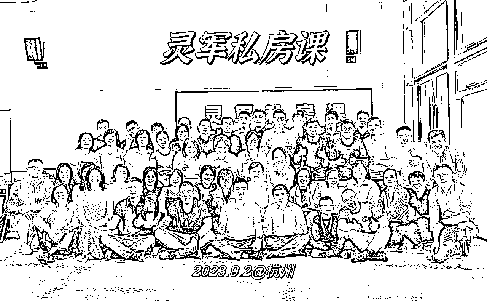
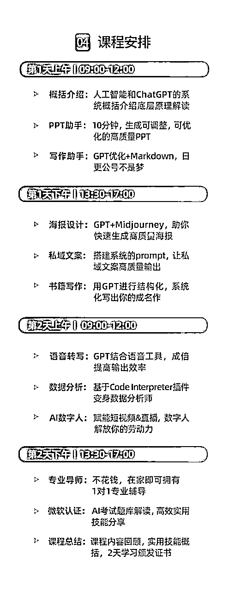

# 如何做好一场5-10万营收的GPT线下课

> 来源：[https://qp7gm5nhlh.feishu.cn/docx/FI8FdwOD6oC9LXxclcpcTqPVnde](https://qp7gm5nhlh.feishu.cn/docx/FI8FdwOD6oC9LXxclcpcTqPVnde)

大家好，我是灵军，最近扎根在ChatGPT的培训领域。

作为一名非技术类人员，我极度认可ChatGPT是个持续的风口，自己也特别喜欢研究GPT，比较擅长将内容整合再输出，成为一个有体系的课程，于是就顺势进入了培训行业。

简而言之：用培训先养活自己，不下牌桌，就有机会。

上一篇分享如何成为一个单日课酬1万+的GPT企业讲师：

这次也分享下：如何筹建一个ChatGPT线下课培训，刚好自己在9月份和11月份开了两期，也来个深度复盘，供大家参考，希望能对你有所启发。

说下自己线下课的情况：

第一期ChatGPT实战课，9月初，定价999，招生45人，营收近5万

第二期ChatGPT实战课，11月初，定价1699，招生48人，营收近8万

线下课，我初次理解：这是一个相对比较传统，缺乏爆发性的生意模式，但扎进去后，发现这也是一个大佬看不小，目前处于相对蓝海 ，且稳定可持续的生意模式。

今天我就详细分享一下：如何从0-1做一场ChatGPT线下课。

简单来说：做好线下GPT实战营很简单，做好三步就行：1、产品，2、营销，3、交付。

# 01 产品

## ①、确认用户的付费动机

首先，在产品端，设计价值点前，我们先分析一下用户画像是谁，以及他们为什么愿意付费。

针对线下课，我定位的用户画像：职场中高层，中小创业者，以及部分企业老板。这些人是我的核心用户。

（如果是大企业老总，则在企业培训，或EMBA商学院等课堂上讲认知为主。

面向这些人，我们如何进行产品价值的挖掘，以及定价呢？

首先，我们得分析他们为什么会付费。

纵观知识付费，逃不出如下4种，万变不离其宗：

第一、为认知付费。

比如他觉得AI是一个较好的商业机会，原来不知道，那这个他来说就是一个商业认知上的突破，新的启发点，对他做商业判断和决策是有价值的，那么他是愿意付费的。

因为比起花钱，他更担心自己错过机会，以及也担心被自己看不见的对手革命。

第二，为技能付费。

什么叫技能？

就原来我做一项事情，需要花3个小时，但现在花十分钟就能搞定，质量还不输原来的效果。

比如，AI制作PPT，原来需要花三个小时，但现在十分钟就搞定。

对一个天天要出报告，方案的人来说，他愿意付费么？

比如，用GPT语音功能记录灵感，再快速转化成不同语言风格的文稿，甚至还可以用10万+大V的语言风格，对一个做自媒体日更公众号的人，需要么？

这些都是效率革命。其实，单独每个点都可以单独拎出来收费。

每一点的突破都是帮你释放更多的精力。

第三，为认证付费。

这个很好理解。

如果你学习完之后有相关证书，如工信部认证，人社局认证等，以及这个证书能帮你涨薪，提高竞争力，那么人们对学习这件事就会再提高预算。

因为这个认证可以伴随他一生，简历中就可以增加这部分。而自己要做自媒体，假设要和AI+垂类行业结合，也是一个值得背书的方向。

第四，为变现付费。

说实话，很多培训都主打这一点。

因为人都是天然有赌性的，看到机会，看到别人能一个月赚10万，然后就代入角色，感觉自己也一个月能赚这么多，然后就掏了5000-10000学费。

实际，真正能达成宣传案例中的变现规模，也只是一小部分人才有的成果。

## ②、结合用户需求进行组合

上述4种模式中，如果单纯从赚钱角度来说，最后一种是最容易赚钱的。

虽然我的学员中也有人通过AI赚钱，变现，案例有一些，但客观评估：我现在还不能保证大部分人，参加完课程后都可以达到这个结果。

所以，当时的我选择克制，不去过度宣传“变现”这一点，因为我想做的是“持续”的生意。

最后，在第一期时，我把GPT实战营的价值，定位在前三层价值，核心还是技能的价值。当然，也有认证，由微软和领英共同颁发的全球通用的人工智能证书。这个证书实际上也代表了你在AI行业有一定的竞争力。如果你想去面试AI方面的工作岗位，这也算是一个小小的敲门砖。

我的课程大纲：

# 02 营销

## ①、营销的本质在于“重复”

讲完产品设计后，我们再来讲营销。

在营销里面，有句话非常经典：营销的本质在于重复。

可口可乐为什么营销这么成功，为什么他的名气不小，还要反复冠名，赞助，广告推陈出新，其实就是这个道理。

一个内容如果反复出现在你眼前多次，一开始你可能会感觉烦，但当你有需要时，在你脑子里就会蹦出他。

正如脑白金，洗脑式的广告，让我们在过年买礼时，关于保健品，自动就会想到他。这就是心智的占领。

当然，对于我们个人IP，营销的重复不是同一句话刷屏的出现。

因为电梯广告他可能没法关掉，但你的朋友圈，他是可以屏蔽的。

所以，营销不是反复用相近的语言推销同一件产品，而是可以从不同的维度来形容同一件事。

比如形容【ChatGPT实战营报名的火爆】：可以有以下各种的体现方式

*   晒报名截图：比如今天有个北京校友，特地报名来杭州学习

*   晒组团学习：比如今天某个学校老师组了个5人团来学习

*   晒口碑推荐：比如某个上期用户给你疯狂案例，推荐同学

*   晒提前报名：比如下期课程，现在有人开始就立刻报名了。

*   晒大佬报名：有个业内知名大佬，也特地来报名学习等

*   晒实时名额：比如实时播报还剩几个名额（的确非常抢手）

以上各个维度，都是在体现这个点，但用户不会感觉到被骚扰，而是真实的感受到你的课程火爆。

如果只有1个点来反复论证，对用户而言，他只会感觉到你是在骚扰他。

当然，朋友圈案例，要真实，不能作假。

所以，重复的过程中，并不是同样的内容多次发。而是需要不同的论证维度来证实这个产品的价值。

这是营销中，我认为最重要的营销秘籍。

番外：我是一个不喜欢发朋友圈的人，但是做线下课，其实朋友圈营销很关键

说说我的转变：

一、从用户心理来论证

1、多发广告，证明你的招生顺利，火爆

因为你一旦开始宣传，如果长期没发朋友圈，用户还以为你的产品怎么了，是不是无以为继，是不是就收割一波就跑路了。所以多发朋友圈，至少表明你的招生还是正常的。

2、证明你对自己的课程很自信

因为用户没有其他渠道了解你的课程情况，只能通过朋友圈来看，如果他今天看到你的朋友圈持续有你自己对课程的自信/新用户认可，就会再一次加强他选择你的认可度。

3、用户是买涨不买跌

大部分用户都在观望，如果你真的做起来，持续了2期，3期，他们才开始真心支持，类似买房子的时候，你只会买涨不买跌。

所以如果想要让用户买单，多发朋友圈是非常必要的

二、从算账逻辑来论证

我在第一期时候，集中在3天，发了大概15条朋友圈，最终成交36000左右，单条朋友圈的价值2400。

所以告诉你，发一条朋友圈，奖励2400，你会愿意么？

另一个逻辑，也可以自己观察每次发完朋友圈之后，是否有人咨询报名。

我目前是平均一条朋友圈，大概都有2-3个人咨询，然后1个人成交，这样的漏斗。

所以发1条朋友圈，能赚1000+，你愿意发不！

## ②、提前积累客户，课程经验

当然，做线下课，也不是我今天想好了，下周就能立刻开了。

坦白讲：需要有一定的缓冲期，我从开始做，到最后实际开课，经历了至少3个月左右的沉淀

这3个月，我在沉淀什么？

1、沉淀客户资源

我的第一波线下课付费用户80%来自得到高研院的同学

为什么他们会认可我，因为前期我在得到建立了一个ChatGPT精进社，持续在分享ChatGPT相关知识。

组织了两场线下分享，主动分享，以及主持，让自己得到一定的曝光。

以及也深度服务了几个KOC，等我要宣发课程时，请他们帮忙。

2、沉淀系统知识

ChatGPT很多人都只是听过，其实没那么了解，存在巨大信息差。

但如果只是侃侃而谈，是很容易的，但如果要教别人，其实还需要将课程进行沉淀和结构化。

不断向头部的人学习，及时将知识整合和完善，将知识体系归类，再结合市场反馈进行梳理，最后搭建成一个高质量的课程。

3、积累授课经验

除了内容之外，上台经验也需要积累，我的讲课经验就是去一些大企业练出来的。

不断讲，不断迭代，直到你磨练出最适合你的讲课风格。

如我最开始讲ChatGPT的课程，是从99元的线下工作坊开始的，小规模实验，获得反馈和效果之后，再去不断优化推广。

以上是我的参考经历，如果你希望尽快推进，其实也不需要一定要3个月沉淀，以下是一些快速的方法：

*   如果你在当地有一些企业资源，如人工智能协会，HR协会，人才发展集团等等，那就看是否可以先合作，然后直接办大课，他们来保证学员招生。

*   如果你一开始在当地没什么资源，可以先依托某个组织，成立一个类似的ChatGPT社团，组织活动。举个例子，我是一开始以得到高研院的GPT精进社名义，先组织2场线下分享，收费58元等，建立我的品牌和案例。

*   如果你也没有什么可依托的组织，可看是否可以谈下牛逼的AI企业，进行企业游学活动，这样也能吸引牛逼的学生来报名。（这个就需要你空手套白狼的能力啦）

## ③、搞定企业团报/学校团报

对于ChatGPT宣传过程中，我遇到了一个5人团，N个2-3人团，会有一些企业/学校进行团报。

对企业而言，他们也需要人才进行学习，对学校而言（尤其是部分职业大专，中专等学校），他们也需要有人前行进行对最前沿的ChatGPT的学习，团报是真实存在的需求。

这些人，你需要解决他们两个痛点

1、发票问题：需要我们有企业主体，方便开票 ，对方申请发票后报销。

2、申请材料：最好我们有相应的文件，略显官方，方便对方提交审核时，能被快速通过。

其他，个人团报，一般是希望享受价格优惠，我的策略是个人团报，价格给予第二位8折（第3位，第4位也是8折），相当于返还我们的推荐费用给你，促进他们的团体报名。

## ④、搞定大佬渠道资源

有个残酷的现实：

线下课我一开始也希望能有大佬帮忙推，但说实话，前1-2期大概率还是得要靠自己，除非自己真的有靠山。

等办完之后，有了第一期的案例样本，那么就可以拿着这些成绩，和一些大渠道去聊，他们可能也缺一些线下落地的课程。

如果我们能筹办，对他们也是一个互补，那么去谈好比例，分好钱，然后通过磨合一起持续推进。

# 03 交付

## ①、超预期交付保证口碑

在交付方面，秉持一个原则：“超预期交付”。

这也是在“生财有术”3年多时间内，学到的最重要的课题。

上次我组织“线下下课”时，我的私教老师也问了我一个问题：“你觉得你的“线下课”在市场上值多少钱？“”

我说：“至少2980元。”市面上同样价位或更贵课程，落地程度做得不如我。我的课程更容易落地，更有价值。

但他建议：前几期，你的定价要比2980元低一些，让用户感受到超预期的价值。

如果你能用2000元以内的价格，去提供2980，甚至3980元的体验，你的口碑就建立了。

于是我就按照这个策略，先从999进行招生，起步让他们感受到优惠，超值，慢慢积累口碑，也是一种策略。

下面是相关的线下课交付清单，供参考

## 小Tip：场地哪里找

办中大型活动，其实场地支出不少，提供几个方案，帮大家降低成本。

01 人工智能相关主题的创业园

目前看到很多创业园，空置率还是蛮高的，也有一些新开的人工智能主题的创业园（类似主题：AIGC，智慧城市等相关科创园），遇到疫情，的确创业的人越来越少，对创业园而言，他们也希望有人能来进行入驻或招商。

可以尝试通过关系找他们负责人聊聊，看是否可以让他们免费或低成本借给你。

02 政府主导的一些空间

比如杭州有类似的讲堂，政府主导的，可以在网上申请，也很便宜的。

03 共享办公空间

如果前期人数不多，可以采用共享办公空间，一般能容纳20-30人左右。

04 部分大企业的会议室

看看一些中大型企业，他们周末会议室是否可租用，一般有关系可借用，然后回报方式也可以考虑给他们几个学员名额。

05 包酒店的空间

酒店是退而求次的选择方案，因为酒店一般比较贵，和科技类主题一般契合度也没那么高，除非有很多外地的客户，这个时候，酒店会是一个好选择。

简而言之，场地可以通过朋友圈问问，能省则省，可以降低不少的成本开销。

## ②、建立信任感，培训升单

线下培训，还有一个更重要的价值，就是升单。

在线下，他能真实看到你，感受到你的水平，能力，所以也是快速建立信任感的过程。

在线下，除了交付实际2天的课程内容外，还可以展示更多企业在应用落地提效案例。

对创业者，企业一把手而言，他们是没法事必躬亲，对他们而言，如果有人能帮他提效，使他的ROI大于1，其实他就愿意和你深度合作。

这部分我也在跑，目前预计将会采用AI结合具体的场景方式来进行推广。

比如创始人IP套餐：通过AI帮忙监控对标账号，跟踪爆款视频，ChatGPT文本改写，生成高质量文案后，然后再进行场景搭建，批量化拍摄和剪辑/或用数字人来进行低成本代运营，让创始人一周只花2小时就可以实现日更。

（还没想得很清楚，圈友有建议欢迎提供）

# 04 总结

## ①、线下课的优劣势分析

优劣势都很明显：

一年赚1000万，不容易，不扩张基本不现实

一年赚50万，线下课的确有机会。

优势：

*   认知鸿沟存在，现在大众还是处于听过，但不会用的状态。

*   大众需求，确定性高，如果能有一个类目提效，愿意付费学习。

*   线下市场相对空白，大佬看不少，普通人做不了，可以在自己的城市建立壁垒

*   培训可细分：每个场景和工具，都可成为一个系列

*   职场人：【10分钟生成高质量PPT】，可以现场将PPT讲透，教用户用透，最后互相PK，生成高质量的PPT。

*   青少年：【AI绘画体验工坊】，提前搭建好几台设备，让孩子进行AI绘画相关的脑暴，然后生成的AI照片可以带回家，甚至装裱起来。举办相关比赛也可以。

*   家长：【教家长如何用GPT辅导作业】，哈哈一个朋友提供的建议，因为K12被管控很严格，那么教会家长如何用GPT辅导作业也是在侧面帮家长降本增效。

劣势：

*   需要在一二线城市，否则其他城市认知还没起来，需求用户不多

*   招生端很关键，最好前期做出案例后，能抱个大腿，否则第三期开始，招生就容易乏力，仅靠自己无法持续

*   培训还是一个苦力活，需要自己多操心，把控细节和口碑，目前非刚需，不像K12，技能补贴类证书一样，招不到生的时候，会很焦虑。

## ②、线下课的衍生方向

关于线下培训的衍生方向，看好两个：

1、人工智能相关认证课

初期的培训本质上还是卖自己，但不可能一直卖自己。前期跑通模式，需要抱紧大腿。因为线下课模式，我也有机会和环球网校，一起开发线上认证课程，以及和智谱AI的企业端共建培训体系（目前洽谈中）。

所以前期当大家都迷茫的时候，努力在一个方向做出成绩，自然就会吸引很多可合作的人。

像光合说的：“先活成一道激光“。感触很深，之前我总感觉培训不长久，是个苦力活，挺嫌弃的，后来经过挣扎后发现的确需要先将一个技能做透，才能有持续合作机会。

未来可以有团队，可以转型，但前期一个人就是一个团队，要拼命卖自己，等后续有案例后，可以培养团队，可以卖团队，卖合伙人等。

2、AI培训的规模化操盘

包括To B的AI企业培训，咨询陪跑，To C的线下培训，认证课培训，小规模来做，难成气候。

如果有相关协会背书，有人牵头干活，兑资源，做成这个领域的头部品牌，就大有可为了。

一方面牵头培训人才，做认证，以及整合行业相关人才，形成各种细分领域的培训课程。同时再将各类市场的大模型，工具进行深入调研，使用，形成解决方案的资源库。

一方面整合企业资源，大中小型各类企业，了解他们的真正需求，按需供给AI相关的培训，咨询，认证，工具软件，甚至是稀缺人才等。

两相匹配，就很有想象力啦！

* * *

# 05 附录

首期线下课部分的宣传素材，供参考

## ①、首期宣传资料

## ②、首期线下课视频