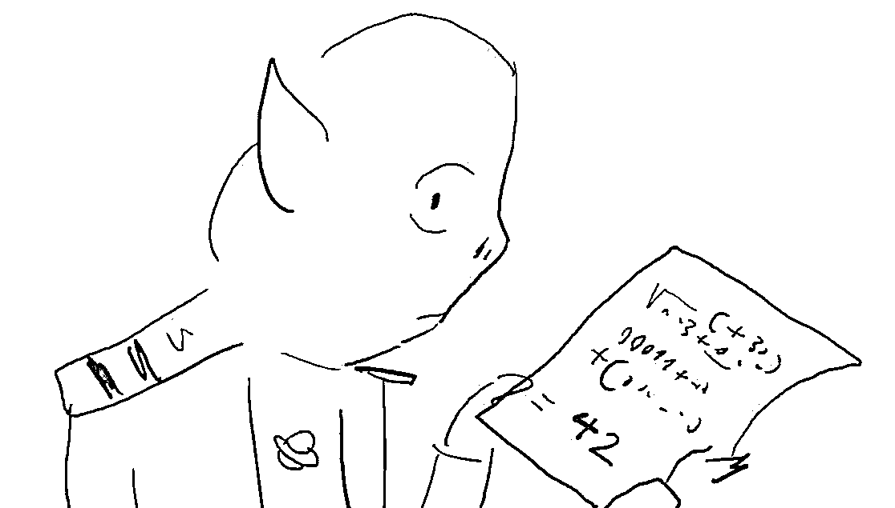

# 我发现了读1000本书却没有成长的核心关键！

> 来源：[https://xdvsj87g5w.feishu.cn/docx/FXPwd0Z5Eo50g9xcV7cc6E4dndc](https://xdvsj87g5w.feishu.cn/docx/FXPwd0Z5Eo50g9xcV7cc6E4dndc)

我自诩是个爱读书的人。

我的书架上一堆书，包括心理学、投资、商业、成长等等。

有时候一周读两本书，但发现对我的人生几乎没有影响到过有人每两天读一本书。

我也见过读书社群，有的人很牛，一天看一本书，每天分享阅读感受。

但几周之后发现他们分享的内容毫无进步。

我开始意识到问题，反思自己是不是没有进行“深度思考”？

直到今天看了刘澜的“反学习”，我才意识到一个根植二十几年的心智模式，而这个问题大概率90%的人都有，因为这是我们从学校中十几年的读书生涯中学到的...

* * *

# 01

标准答案式思维的缘起

首先问你个问题，为什么很多学霸，在职场中反而要经过很长时间的适应？反而当时很多调皮捣蛋的孩子却如鱼得水？

很多人应该都想过，

但没有都没有得到值得信服的答案。

可以想想，

为了考试，我们做的最多的事情是什么？

对！是做题。

而且因为要高考，所有的题目都是有标准答案的。

哪怕像是语文阅读理解本没有标准答案的问题，都会给出参考答案。

学生为了得分，必须学会用“套路”来覆盖要点。

在这个训练过程中，自然就会衍生出一种心智模式

——标准答案式思维。

* * *

# 02

带着标准答案式思维进入社会

这个模式在学校中太好用了，十几年的训练让它根深蒂固。

步入社会后，自然也会用这种思维模式思考所有的事情。

看看你有没有中枪：

*   认为做任何事情/项目，都有对的答案（正确答案）

*   正确答案掌握在权威（老师、领导）手中

*   最终会有权威告诉我们答案

*   很少对这个答案进行质疑

如果把世上的问题分类，大致可以分为以下三种：

1.  有标准答案的问题，有对错。例如，北京的首都是什么？

1.  感受类的问题，没有对错好坏。例如，我觉得这个牛肉不好吃。

1.  社会类问题，没有对错但有好坏。比如社交类问题、公司的战略、经济学模型。

实际上，很多问题不像数学和物理非黑即白，都是属于第三类，没有对错，只有好坏。

例如，你去朋友家做客，不喜欢朋友做的牛肉。

你可以说“不好吃”，也可以说“不太适合我的口味”。

这个问题问的虽然是感受（第二类问题），

但在这个场合下其实衍生为社交问题（第三类问题）。

虽没有对错，但明显后者更好。

对待这种问题，以“标准答案式思维”，等着权威给答案，明显就傻住了。

# 03

破除“标准答案思维”，修炼“参考答案思维”

那应该怎么做呢？

答案是，破除“标准答案思维”，修炼“参考答案思维”。

1.首先要意识到，几乎所有的事情都没有标准答案。

用标准答案思维做事，很容易产生自我怀疑，因为很难找到最终的答案。

实际上，做成与否，影响因素太多了，

甚至很多情况下，运气占很大一部分，只能去不断试错。

哪怕有成功者告诉你应该怎么做，这个答案也只能作为参考。

因为你不是他，不可能100%模仿，哪怕做到，还有运气呢？

2.带着怀疑学习。

从书中、从别人的课程学习时，不要只跟着作者的思路，怀着怀疑态度，所有的内容都不是标准答案。

明朝大思想家陈献章说：疑者,觉悟之机也。一番觉悟,一番长进。

每次的怀疑都是觉察的开始：

为什么这么说，这么说对吗，有什么依据？

自己尝试找到这些问题的答案。

当开始怀疑时，真正的学习就开始了。

3.学习动力模式，即本质。

很多学习，学的只是表面。

看别人怎么做项目，你就怎么做。

别人说坚持，你就傻傻地只盯着目标坚持，发现结果并不如意。

学习别人，要剖析其“动力模式”，到底是哪些因素驱使事情的推进：

*   这个项目最关键的是什么？

*   是项目节奏？是差异化？还是内容质量？为什么选这个？

*   应该怎么实现这个最关键的点？

*   为什么要做这个动作？

*   可能会形成什么样的影响？

*   预计会达成什么样的结果？

*   如果发现不是，哪个又是？

反复拷问自己，注意，要达到“拷问”的程度，通过这个过程抽象出背后的逻辑关系。

哪怕反复做错。

只有这样，才摆脱运气游戏。

4.形成自己的参考答案并实践。

学习没进步，这个是最大的问题。

要么看到别人的思考结果，觉得很有道理，然后就过去了。

从不根据自己的情况，形成适合自己的“参考答案”。

98%的人看书都是这样！

不信我问你两个问题：

第一个问题，你最喜欢的是哪本书或哪门课程？

第二个问题，它对你的生活有什么改善？

如果答案犹犹豫豫，或者发现改善不大，大概率你也栽坑了。

每次读到让自己茅塞顿开的话，停下来，反思自己的行为模式，记录下来针对自己的改善计划，然后按照计划去修炼。这个很关键！一定要列出改善计划，具体到第一步怎么做，第二步怎么做。

5.最后非常重要的一点：主动性。

填鸭式教育会养成一个很大的问题是，形成了被动学习的模式。很少有人会主动预习、主动思考，因为知道老师会带着大家学习。

延伸出来，毕业后读书、报各种课程，也是等待被灌输知识。想着报名就是成功一半，学完肯定有改善。然而绝大多数人在课程结束后，还是该如何如何。

将老师作为一个讨论者对待，而不是传授者。

正如前面几点所说，没有标准答案，只有参考答案，这意味着没人会帮你找到属于你自己的答案。

主动思考、积极讨论，找属于自己的参考答案，然后“修炼”心智模型、刻意练习技能。

# 04

写在最后

血栓会阻碍血液流动，

而标准答案式思维是一种底层的心智模式，会阻碍你的成长。

几乎所有的坏习惯都是它直接或间接引起的。

当我发现开始主动带着怀疑学习，

并及时将书中的内容转化为自己的参考答案的时候，书开始不再和我自己有割裂感，真正开始作为我的助力。

如果你也是个小白，希望这篇文章能帮助到你，

让你能找到属于你自己的读书方法参考答案。

* * *

我是毫末|日生一毫

曾做过小红书博主、小红书电商、抖音带货、抖音养生号、水果团购、公众号流量主，

爱阅读、会写作、懂剪辑、懂ChatGPT、懂网络、懂硬件、懂编程，

一个陪小白一起轻创业的践行者，

也是一个正在成长的创业新手。