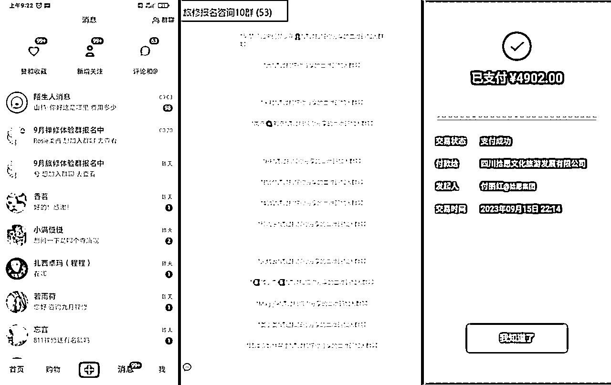
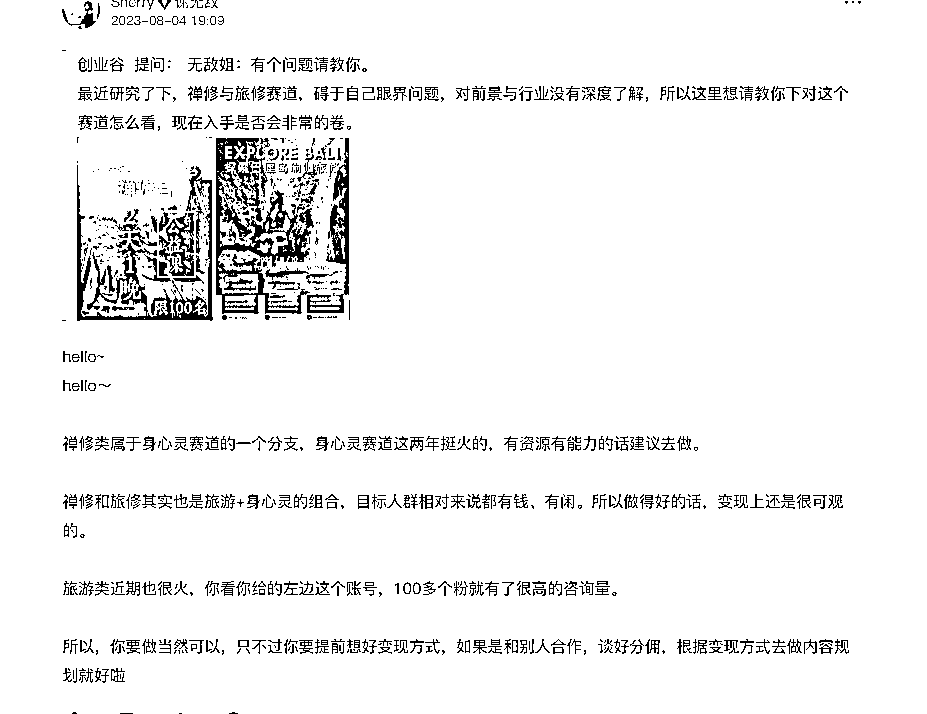
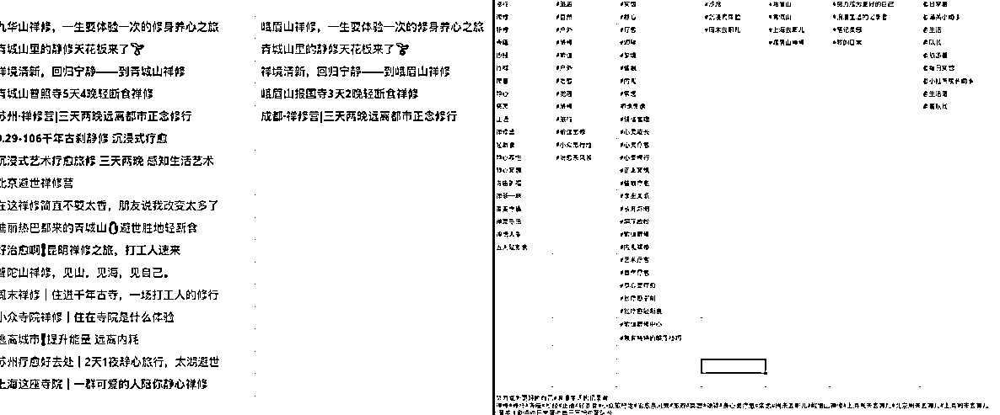
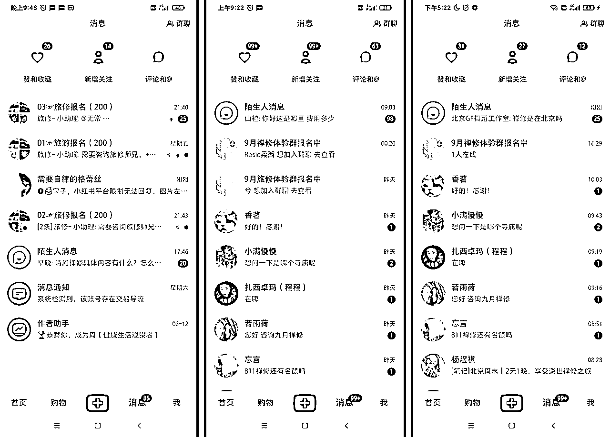
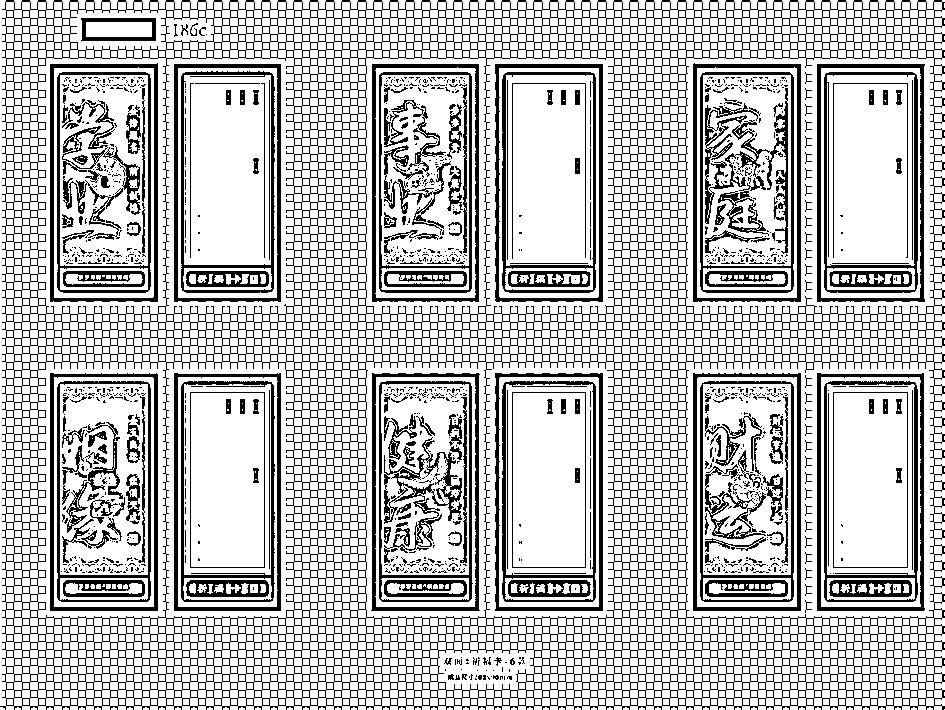
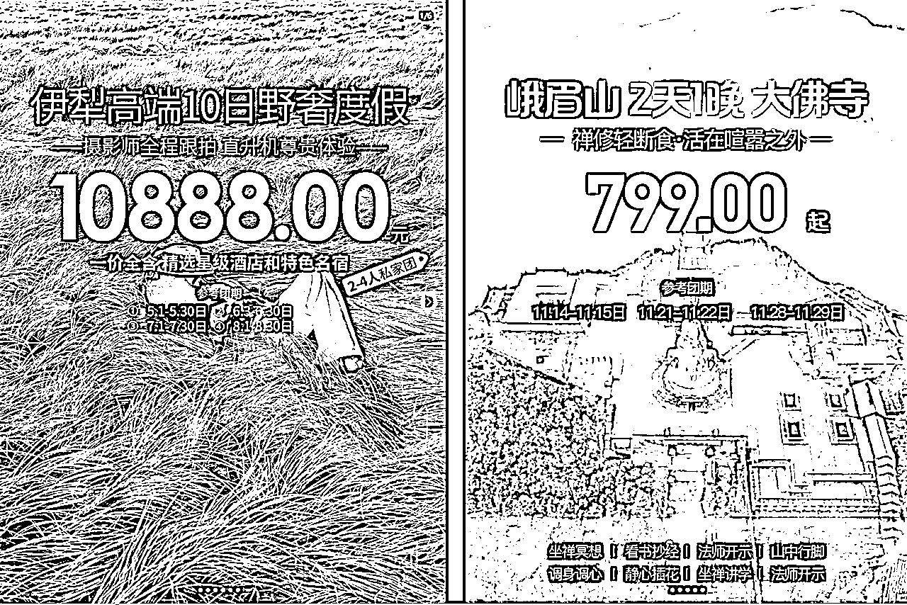
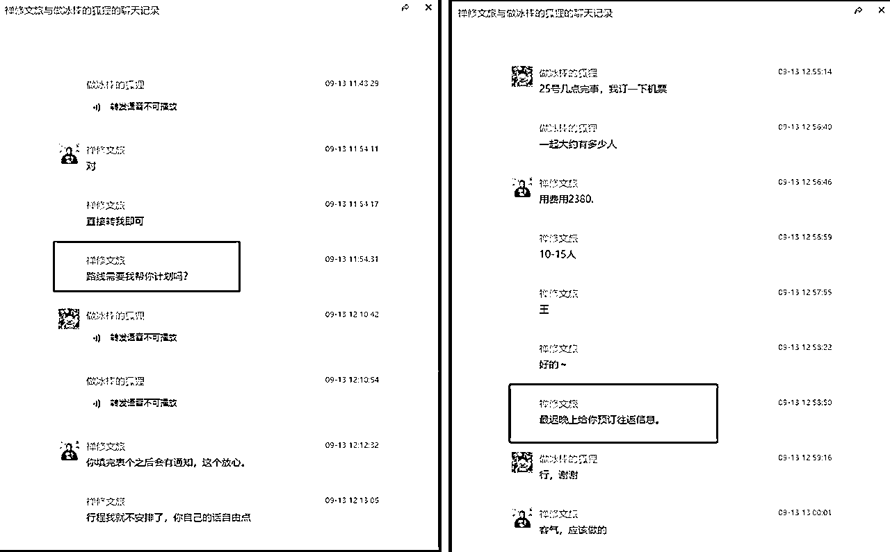
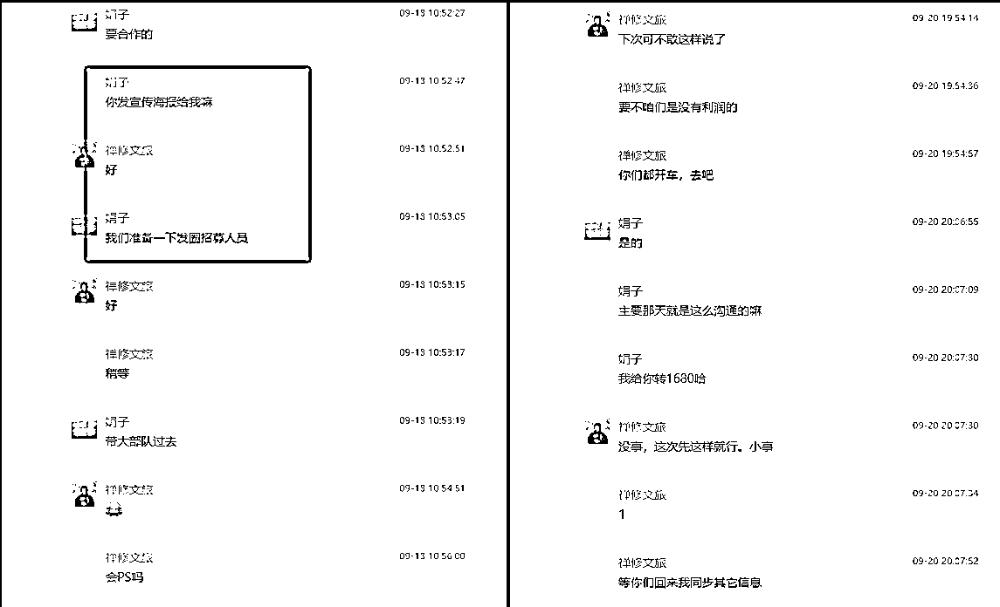

# 30天变现5万+，禅修文旅如何做爆小红书

> 来源：[https://b3k2jeijqy.feishu.cn/docx/G3HFd8l1xoK63SxEB7lcCwrInRD](https://b3k2jeijqy.feishu.cn/docx/G3HFd8l1xoK63SxEB7lcCwrInRD)

## 一、自我介绍

大家好，我是拾月，目前是某互联网公司的一名营销设计师。

今年5月初开始有做副业的想法，因为当时我什么都不懂，然后就在无敌星球里面把小红书、新手资料都全部看完，瞬间收获满满。

比如你是新人对平台的规则不懂、新手如何起号，发布笔记内容流程等等一系列资料，总之非常干货，最重要的是，不懂可以直接问无敌姐、这是我觉得最大的收获。

当时没有想做其它平台的打算，原因有两点：

之前我有过小红书的经验、并且实现了AI绘画全流程商业变现，再加上有无敌姐的人脉社群，基于这两点我选择小红书做输出平台。

平台定了，就要抓紧做项目调研与执行落地，经过20多天的努力，我通过旅修+禅修文旅成功变现5W+，下面给大家放当时交易截图。

* * *

## 二、项目分享

### 1.项目怎么来的！

7月初我做了很多小的项目、比如AI绘画、信息差资料引流、设计项目接单等，这些只能挣点小钱，无法放大或者商业化经营，最后我选择了放弃。

8月初开始寻找适合自己的项目，刷了N篇文章，咨询了很多前辈、始终还是没有一点思路与头绪。

后来在无敌社群里面，看见有人做旅游分销也挣到了不少钱，我觉得我也能做。

当天晚上就开始在小红书找对标账号，结果旅游赛道没有找到合适的，但是看见一篇“寺庙禅修”笔记，评论数据特别好，我觉得这可能就是一次机会。

第二天还专门请教了下无敌姐，她说这个赛道非常火并且也建议我去做，这更加坚定了我的信心，当天我就开始准备笔记内容的规划。

### 2.笔记如何来做！

当时我不知道旅修和禅修的笔记内容应该怎么做，只好边做边测试。

我从其它平台找了一些素材高清图，文案用GPT来做，这样就有笔记内容可以发了。当时我自己还做了一个选题库，给大家看一下：

刚开始做小红书的朋友们肯定会有痛点问题：封面美感怎么提升？这里跟大家说一下我使用的作图工具+排版方式。

在找封面框架时候，我会先把别人数据好的封面图拿来测试是否适合自己的产品。

作图工具我用的是PS，不会使用PS的小伙伴也可以使用基础的绘图工具进行创作，比如创客贴，可画，即时设计等等，这些都是可以在线设计编辑器，操作起来比较简单。

另外，给大家说一下排版的逻辑：我们做文字排版时候一定要表达清晰。

比如我的笔记是推广一个活动，那么活动的时间、地点、费用一定要写清楚。写上这些重点的信息，会为你筛选出来非常精准的用户，哪怕你只有几十个粉丝，也能够变现。

### 3.流量如何来做！

笔记内容有了，那么我们来具体说说流量的问题。内容与人群足够精准以后，我重点测试了项目是否可以跑通。

我发布了2篇禅修笔记进行测试，一天过去了但是阅读量还不过百、然后我继续做调整。首先把之前锁定是全国范围缩小为北京地区。

按这个思路重新做了3篇笔记后，晚上阅读量到了500多左右，有了这个热度以后，我继续把另外2篇都发布了，结果第二天就有人来咨询！下面给大家展示下当时咨询的截图！

* * *

我一共发布了5篇笔记，粉丝量也就100多，但当时涨粉不是我的重点，我的目标很明确：引流变现。

流量有了，但是交付没有，这该如何解决呢（当时北京我有个朋友正好做疗愈，周末我直接去找她，和她沟通说目前手里有一些高质量禅修用户，我们聊了很多、然后决定她做交付，我做转化）。

最终我们开设了一套价值1680的两天一夜旅修活动。给大家展示一下当时引流到微信的160人左右的视频~

### 4.转化怎么做的！

我建立了2个80人的群。为什么要建立2个群，其实这个要考虑当时是情形，我担心如果一个群活动做不好，那么另外一个也会废了，所以当时就留了一个备用群。

活动预售一开始有问题，80人才成交了2单、我后来反思了一下，由于客群都是一些中高端的用户，让他们在群内抢活动，会让他们觉得服务不够好。

然后我就改变策略了，在第二个群里只发一些海报与内容公告，咨询私信沟通即可。

这样基本解决上一个群里的问题，这次成交了8单、一共变现了16800元。

付款之后只需要重点考虑如何把用户丝滑导流到交付团队手里即可。

* * *

### 5.业务如何调整！

由于上次北京旅修的用户不是非常精准、这次我做了一些调整~

01.调整交付团队

02.调整输出内容

03.调整转化流程

当时笔记内容禅修内容，用户也是看着禅修来的，结果引导至旅修。交付与用户不匹配导致转化低，所以一定要进行调整。

交付团队：

我联系在四川的朋友，他们专注于做禅修文旅。与他们达成合作之后我有了非常精准交付。

如果大家在找交付商，一定切记用熟人介绍熟人的方式来找。另外，如果是单一的商务合作，那么最好是找大品牌的合作商，这样能够确保你和客户权益不会损失。

有了承接实力与对方信誉口碑之后，后续可开展的业务会很多。我们现在已经同步开发出了线上、线下的祈福产品。

内容输出：

在内容方面，我把之前寺庙图片调整为客户体验的图片，在观感上立马就提升了。

然后再把范围放大至全国，调整后笔记评论增加了不少。

转化流程：

吸引的用户群体精准了就能够直接转化。

通过以上3波优化之后，我继续发布几十篇笔记，引流了差不多30人左右，最终成交了12单金额在36000元。

## 三、转化方案

### 1.笔记封面没流量如何解决

开始的时候，我把禅修文旅同行的封面框架基本也都尝试遍了，但是流量都特别差。

我决定改变策略：不瞄准禅修文旅的细分赛道，把目光放大到旅游赛道上。

然后我就去搜索旅游封面图，结果搜索到了几篇新疆定制游，且内容数据与美观度非常好，

当天晚上我直接做了10篇笔记，结果第二天晚上就有很多客户咨询来咨询！

这里需要跟大家提一下，发布笔记后，系统给推荐流量的5-7天内是完成引流变现最佳时机。

这些是之前我第一次优化封面框架的时候修改的封面图，分享大家了~

### 2.引流到微信如何微信成交的技巧

1、真诚

其实我们在和用户沟通的时候非常多的技巧的，但是首先要“真诚”，因为你真诚为他设计活动时候他是可以感受的到的。

我有几个用户，刚开始都不是非常信任我们，我们在做沟通时候就可以超预期交付。这不是指要给用户打折。

比如你的用户报名的是禅修班，那么其他行程机票等肯定都不会管。我们就帮助用户制定全程的路线规划，这样用户就能增加用户的信任度，同时可以增加转化。

2、针对用户做营销

针对中高端用户，不要用传统方式：比如建群啦，私信不停打扰用户，这样非但不能成交反而会让用户把你拉黑，做好朋友圈营销即可。

### 3.交付完成之后如何再次复购

把用户当成你自己朋友，我基本就是这样来做的。

用户体验完禅旅之后我都会请他喝杯咖啡，这样自然就聊成朋友了， 然后顺便可以做一下用户调研，说不定他还会给你推荐身边的朋友。

## 四、新人建议

### 1.行业门槛

刚开始我觉得门槛非常低，说实话那都是表面现象、如果你深入的去了解，每一步都是需要门槛的。比如流量怎么做，产品线路怎么找，商务洽谈如何沟通。

如何可以找到3方共赢点，那就可以成为一次很好的开始，但是你只拿分销提成，其实这个是门槛很低的，如果你想深入的去做、就得不断试错与优化，并且快速调整出方案来。

### 2.我的建议

我们在选择赛道时候，不建议把赚钱放到第一位。举个例子如果刚开始几个月有盈利的情况下，你的心态是会很好。如果进入淡季，或者其他一些不可控因素导致一段时间无法获得收益，这个时候你就很容易放弃。

如果你真心喜欢这个赛道，就像现在的我，从内心的喜欢禅旅，所以我在和用户沟通的时候，都会站在用户的角度来思考问题，所以他们会经常介绍老顾客给我。

总之，建议大家选择自己真心喜爱的赛道去做，并且能真诚从用户的角度去考虑方案~