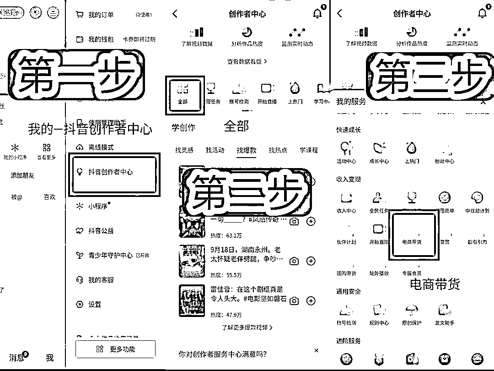
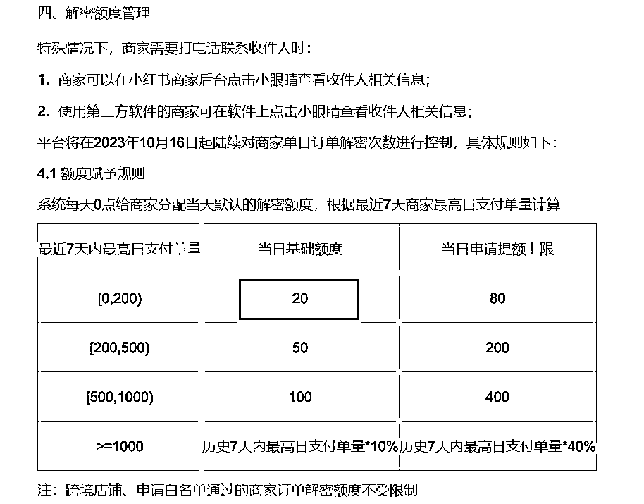
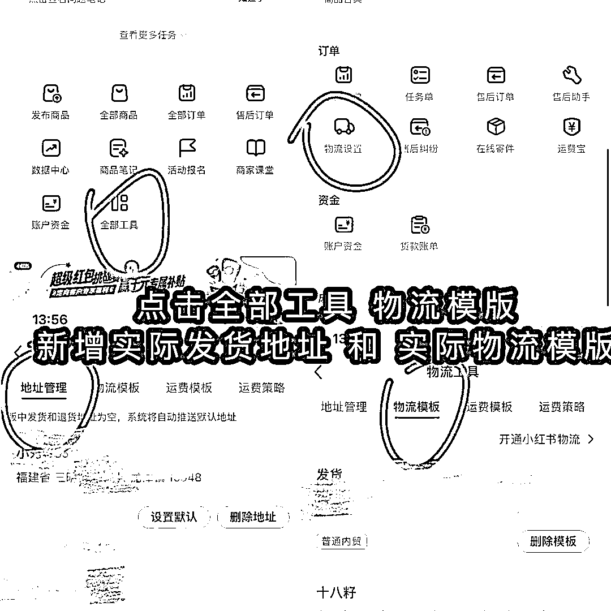

# 小红书开店无货源解决方案

> 来源：[https://hi428l7bh89.feishu.cn/docx/GWKldTokgoxAmtxxBcYcHpuMnZc](https://hi428l7bh89.feishu.cn/docx/GWKldTokgoxAmtxxBcYcHpuMnZc)

哈喽大家好，我是小刀~

抖音半无人直播项目，截止现在个人+合作主播已经gmv突破3000万

今年5月份开始接触小红书电商，现在店铺矩阵中，其中10月份新起的店铺中，有4家目前破了10万GMV

小红书电商今年是野蛮发展的一年，很多没有经验的小白也在这波红利中赚了一波。

但是小红书从8月份开始打击无货源，10月份出了信息加密政策。

很多人开始恐慌无货源是不是不会封店、小红书电商是不是已经不能做了、必须要囤货才行吗？？到底怎么才能找到优质供应商??

小小的脑袋充满了困惑。

今天跟大家聊聊很多新手非常关心的小红书无货源问题。

我们主张轻资产创业，所以囤货是不可能囤的~~必须要掌握一件代发的方法。

今天分5个模块跟大家把平台无货源规则、及供应商相关的内容讲解清楚。

第一部分：平台打击什么样的无货源

第二部分：无货源怎么做才不违规

第三部分：先卖还是先联系供应商？

第四部分：选择优质供应商的方法

第五部分：供应商沟通技巧

## 一、平台打击的是什么样的无货源

从3月份以前【搬运】就能火到现在需要【深度混剪起号+起号后结合实拍】；

从8月份以前的【拼多多一件下单】到【7.28无货源整治】到【10.16 信息加密】。

可以看出，小红书平台为了保证自身平台的调性和用户体验，开始不断提升对于内容和产品的要求。

但是，这并不意味着小红书电商就不能做了，只不过平台的条条框框多了，我们要做的是摸透这些条条框框不触碰就好了。

我们来看看平台判定无货源主要的点：

1、用了其他平台面单（pdd、淘宝、京东、抖音等等）

2、店铺设置的发货地址和实际发货地址不一致。

3、商品售后，商品评价，商品举报，媒体报道，消费者反馈等多方面判断商家店铺是否涉嫌无货源经营。

只要是申请售后的商品都会被平台去专门检测，客户申请售后理由是你在别的平台发货的会直接触发。

大家一定不能跟平台对抗，从8月份开始，去拼多多、抖音等平台下单的行为，必须严格禁止。

有方向就可以规避，我们要做的是有效的针对平台的进行【整改】而不是选择【囤货】或者【放弃】。

## 二、无货源怎么做才不违规

首先要跟大家说清楚，1688一件代发是被允许的，但是要跟1688商家确认他们是否带有其他平台面单（很多1688商家会去拼多多拍单，这就非常非常坑！！！！）

所以一定要提前确认是否是无痕发货，特别是成立时间不足2年的店铺，更要注意。

所以为了保证安全，我给到大家3套解决方案。

#### 方案一：直接绑定供应商的发货系统【墙裂建议】

第一步：跟供应商沟通是否能打小红书面单

因为每天单量大于20单，需要用小红书面单才能正常发货，否则信息加密无法看到用户信息。

所以必须寻找可以打小红书面单的供应商。

如果没有，可以跟供应商沟通让他开通一个，整体很简单~

第二步：按照供应商的要求进行绑定

不同的供应商可能用到的打单软件不同，一般来说很多人用的都是店管家，我们把我们的店铺通过店管家关联对方账户就可以了。

这个大家不用太多未雨绸缪，担心自己不会，到时候供应商会跟你沟通具体怎么用，最差的情况软件客服都会在线。

第三步：每天同步订单给供应商发货即可

绑定系统后，我们就不用管发货的事情， 每天供应商发货后单后都会自动回传，爽歪歪~

#### 方案二：单量少没办法绑定系统，怎么发货（每天低于20单可用）

第一步：找到供应商

建议优先去去1688、抖音精选联盟找。

第二步：添加供应商微信

直接跟供应商沟通添加微信，1688是可以跟客服沟通，抖音精选联盟可以直接获得商家的微信&电话。

1688客服沟通注意：不要上来说自己只有1单，要跟对方说我们是团队，加微沟通后面深度合作，不要胆怯~

抖音精选联盟怎么用：现在抖音可以0粉免费开橱窗，但是不能带货~开通橱窗后去选品广场就可以看商家信息

【开橱窗教程】

注意：如果拼多多你能要到微信也可以。

但是拼多多你去能勾搭到的大多数是客服，不愿意给老板联系方式，而且拼多多平台不允许发微信号~稍微困难一些。

第三步：把订单信息直接微信给供应商

【注意：如果供应商同意绑定系统，优先选择绑定系统】

这样我们就属于分销，完全不会有无货源的风险。即使因为各种情况被判无货源，我们让商家给我们签一个代发合同申诉即可.

注意：不用担心信息加密，每天会有20个可以申请解密的额度~

第四步：商家发货后把单号给我们，我们上传单号发货（一般48小时内）

注意，发货的时候要到商家的实际发货地址， 在后台把这个商品的发货地址修改为实际发货地址

【修改发货地址教程】

按下面4步新增产品的物流模版

然后编辑产品【物流模版】

选择实际发货地址的模版就可以了

#### 方案三：上面两个方案都用不了

如果有下面2种情况：

1、你最终也找不到合适的供应商给你发货，只能拼多多拍单

2、你卖了很多产品，每个发货地址都不一样（不建议这样，小红书是单品逻辑）

那解决方案是：可以用中转仓解决。

既你的所有订单统一全都先发到中转仓，然后由中转仓统一贴小红书面单发货。

逻辑就类似于先买到自己仓库，自己贴单发货，只不过中转仓相当于你自己的仓库了。劣势是买家收到货的时间变长了，而且中转仓会收几块钱。

## 三、先选品上架还是先联系供应商

接触过很多新人都在纠结到底要先对接供应商还是先上架售卖。

我把小红书开店理解为做生意，大家在“做生意”的时候一定要灵活。

我们在选品的时候，如果你的商品是【新品】【稀缺性产品】，你在1688上只能找到1-2家供应商，这种情况你需要先跟供应商沟通，因为可以选择的供应商太少，如果不提前联系会面临：出单了但是没有货的情况。

大多数情况下，你会发现的你的产品都是大众产品，每个平台都会有5家甚至更多供应商，这种情况下，建议新手先卖。

前期把更多的时间放到选品和笔记上，如果你每测一个品就要找一下供应商，那将耗费你的很多时间在大概率无用的沟通上。

但是要打开订单消息提醒，出单的第一时间去联系供应商。

别怕出单了联系不到供应商，最差的情况就是联系用户退款~~

## 四、选择优质供应商的方法

#### 如何在1688上怎么选到比较靠谱的商家。

打开1688之后，我们是可以根据你的款式去找工厂，直接把你想要上架的产品截图保存到相册，然后识图一下，就能搜到有这个商品的供应商。

那供应商这么多，我们怎么选择呢？

1、成立时间

每个店铺都会显示这个供应商成立了多久，一般建议选择成立时间更久的。

1688上也有很多供应商是做无货源的，货源来自于拼多多，所以说大家一定要注意不要贪图价格便宜，年限特别短的再便宜也不建议，近2年成立的都不作为第一选择。

2、商品数量

我们点进去店铺看一下店铺在售商品是否很全。

现在平台打击无货源，所以我们在找供应商的时候，是希望我们的产品尽量集中由1个供应商提供。

如果供应商比较给力，基本上你需要什么品直接跟他说就可以。这种情况下，同一个类目你只需要对接一两个供应商就能满足90%的产品的需求。

3、评价/履约率/回头率等系类数据

其实的维度，大家就带着“买家心态”去找供应商就可以了。不要带着太大的心理压力，他就跟我们去购买一个产品的逻辑是一样的。

我们去购买一个产品的时候，也是在看它的销量高不高、评价好不好、这做的久不久、是不是品牌旗舰店等。

所以说大家带着你在购买一个产品的思路去找供应商，基本上就错不了。

4、不要苛求各方面都合适

我们说选择时间越久的实力越大的供应商越好。

但是存在一个情况，这样的供应商客户也多，并不想给你一个一天出一两单的人代发。

所以有时候我们可以退而求其次。

在没有挑最优质供应商的资格的情况下，差不多的供应商对我们来说就够用了。

#### 如何在精选联盟上选到比较靠谱的商家

对于抖音商家来说，每一个店铺都是有评分的，分为：商品体验分，物流体验分和商家服务分。

我们主要关注的就是商品体验分和物流体验分，保证发货的一个时效度。

然其他的思路跟在1688找供应商的思路是一致的。

注意：我们在精选联盟点击联系商家的时候，可以看到他是不是绑定了联系方式。如果没有绑定联系方式的大概率不会给你代发，换一家。

## 五、跟供应商沟通注意事项

很多人去跟供应商沟通的时候小心翼翼的，担心被拒绝、担心自己单子太少。

一定要扭转一下自己的角色，你是消费者，你是去供应商那拿货的，你是占据主动地位的人~不能心态上就露怯了！！！

先跟大家讲一下在不同平台上我们应该怎么选择供应商以及怎么谈判。

在跟供应商在谈判过程中，大家应该有的注意到的几个点：

1、在初期沟通的时候是一定要学会画饼

如果你自己都觉得自己卖不出去，那供应商也就不爱接你的单子。

所以不管你实际卖能卖几单，都要拿出我马上就能卖1000单的架势去聊。

可以通过这几个点增加供应商对你的信任度：

我们团队是做矩阵的，最近正在测这个品，如果测出来就要批量上号

我们上一个品就是跟你们某某个款式很类似的，卖了十几万

但是小红书平台起号确实是需要时间的

所以咱们奔着长期合作去，前期你们多照顾一下，我们后续我们爆了多给你们出量

2、不要上来就压价格

很多人一单也没卖出去，先做的就是跟供应商砍价格~

大家要算一笔账，你卖1单，全是利润也没多少钱，你卖10000单，每单1块钱利润也能赚1万。

而且对于供应商来说，你有量，才好谈价格~

所以刚开始没有量的时候，不建议把重点放在谈价格上， 这时候你也谈不下来多少。什么时候出单情况比较好了，再跟供应商沟通压价格，这时候你的单量就是你的筹码。

3、要沟通好售后情况

售后包括：

产品是否包邮、什么地区不包邮？ （一般是默认非偏远地区包邮）

产品是否支持7天无理由退货/换货？

产品退货是直接寄给供应商还是要先寄给我们？

产品有问题是否支持补发？补发的费用谁出？

一般来说大多数供应商是支持退换货的，但没有运费险。

这里建议大家价格在19.9元以下的产品就不要设置运费险了，产品实在有问题可以仅退款/补发。价格低的产品往往售后问题比较多，开通运费险会导致退货率飙升。

小技巧分享：如果不开通运费险，我们可以把退货地址设置到【台湾】，随便写个台湾的地址就可以，这样用户一看退到台湾，就不退了~

4、沟通好货款支付方式

供应商一般是日结或者周结。

很多小伙伴的担忧把钱当天给供应商了，他跑了怎么办？

首先选择供应商的时候要选择有资质的，大概率不会出现这种情况，不可能你这点钱他生意就不做了。

如果你实在担心可以等到出了单号之后再给他结算，或者结算货款的80%，其余的等确认收货后再结算。

大家一定要清楚一个问题，供应商比你更害怕，他跑了你找他还有地方找。但如果他们给你发了货，你没结算就跑了，他们是很难找你的。

5 、定期跟供应商咨询新品

有实力的有新供应商是可以快速感知市场的需求，知道最近什么品要爆，大家一定要利用好。

大家不要把供应商问题想的太难，一般担忧供应商问题的都是还没有开始做的。

别把困难前置，先开始开店、选品、更新笔记，碰到问题再解决问题就好了。

很多小伙伴就是因为前期问题想的太多，结果导致店都没开，心态已经崩了。

新人做项目，肯定会有很多困惑

但是一定要记住：

我们要做的是解决问题，而不是被问题解决掉~

想全是问题，做才是答案~加油加油