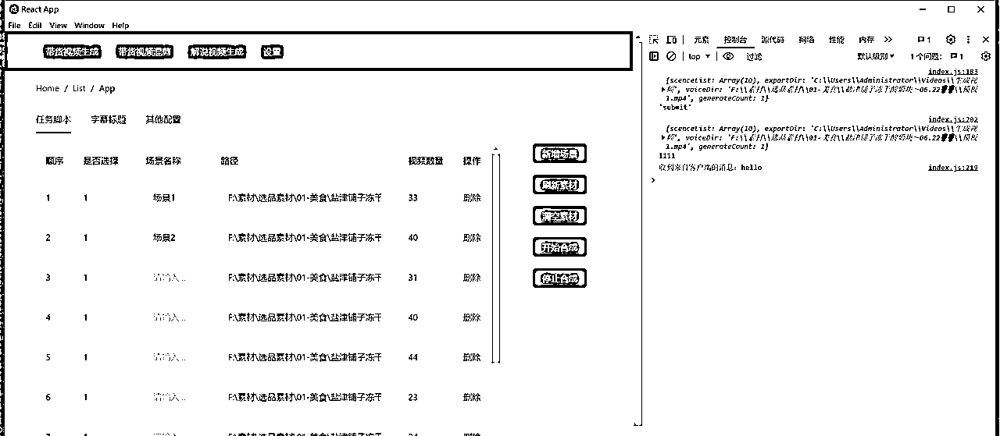

# 批量混剪工具，解放生产力

> 来源：[https://j0oqwdylc47.feishu.cn/docx/K9AXdu6vnojhqjxo0ULcehnZn9d](https://j0oqwdylc47.feishu.cn/docx/K9AXdu6vnojhqjxo0ULcehnZn9d)

大家在做短视频带货或者引流视频的时候，都会遇到需要批量剪辑的需求，虽然目前市面上有很多工具可以用，但是会有这样或者那样不如人意的地方，所以我觉得自己开发一个批量剪辑的工具，首先可以提升自己的剪辑效率，其次也可以开放出来，供圈友使用。

我把一个视频脚本拆分为多个场景，每个场景里包含多个镜头，生成的时候，程序会随机去根据脚本的顺序组合镜头，然后你也可以调整场景的顺序去组合成新的脚本， 让短视频创作效率更高，尤其是好物分享类的视频，对前后镜头的逻辑性要求不高。

在提高效率的同时，不用再担心去重的问题，因为我们这是混剪，是最高级的去重方式，目前工具的能力有限，只能混剪处理好的分镜素材，最好你有自己拍的分镜素材，或者你把对标账号的素材先分镜处理，再分类存放。

当前混剪工具还处于比较初级的阶段，只完成了核心功能，后续要结合ChatGPT的能力开发出内容生成等能力。

欢迎志同道合的伙伴一起来把这个工具完善，有开发能力或者有想法的都可以，或者有什么样的需求可以留言告诉我，想招募几个种子用户来帮我完善产品，想要试用的也可以留言。。

### 使用教程：