# 用影刀十倍提升小红书店铺带货跟款效率

> 来源：[https://tb9qrhlhl7.feishu.cn/docx/LDgXdlFkxoXgZqxCRtmc1m9LnPf](https://tb9qrhlhl7.feishu.cn/docx/LDgXdlFkxoXgZqxCRtmc1m9LnPf)

当前阶段一定要用影刀去批量做多店铺多账号，十倍提升效率。

研究小红书对标素材，封面、笔记、标题，笔记内容点赞量收藏量按照排名前10前5的策略去利用对手销量最好的笔记素材封面标题素材。

## 1、前言

已经有了哼哼猫等下载小红书笔记的工具，为什么还需要自己动手用RPA工具影刀去抓取小红书的笔记内容呢？哼哼猫目前对于小红书只支持单个笔记、批量笔记下载，不支持博主主页笔记内容下载，而且只是下载封面和视频，并不会去获取点赞数、收藏数等等这些数据，那么前期我们可以用影刀去抓取对标账号下的笔记内容，熟练使用影刀后，我们就可以去实现自动批量发布笔记，自动监控对标账号商品的销量等等

下面是用影刀实现后抓取后的一些内容

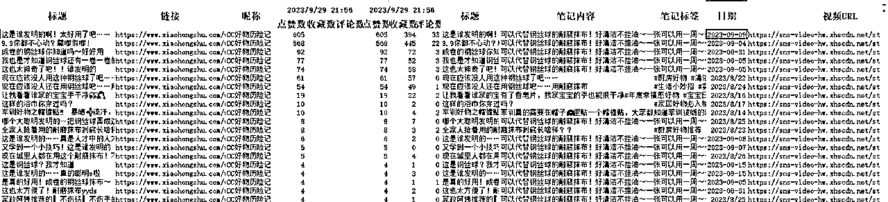

抓取的主页数据，自动按照点赞数从高到低排列，我们可以直接用点赞数高的标题和笔记内容

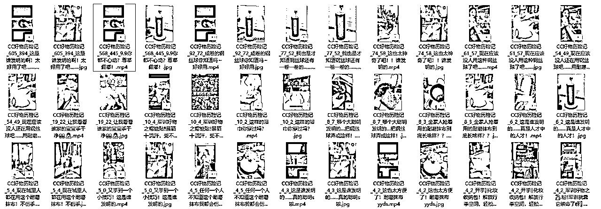

下载下来的视频和笔记封面，文件对应的文件名都包含了点赞数和收藏数，我们可以一目了然的知道哪个是最好的封面和视频

如果后续想自动去发布笔记，那么我们就可以直接用上面Excel中的内容结合现在的GPT适当的进行二次创作，就可以打造属于我们的爆款笔记

## 2、影刀的使用

### 2.1 影刀介绍

影刀的官网地址（https://www.yingdao.com/），我们只要注册个人版就足够使用了，

当然贴心的影刀也为我们提供了官方的学习文档（https://www.yingdao.com/yddoc/?），官方文档其实已经为我们详细进行各种介绍。当然也可以去B站进行学习（https://space.bilibili.com/393215006）。

影刀里面有两个方式，一种是使用python语言，一种是直接使用影刀已经封装好的模块，对于小白来说，直接用封装好的模块就好了，对于变量（程序员们都知道）来说，支持中英文，不需要为了定义个东东而绞尽脑子，直接用汉语就好了。

本文主要针对抓取小红书笔记要用到的内容进行介绍，大家学会后就能自己制作属于自己的自动化工具了

### 2.2 常用的影刀模块

对于本文的目的来说，用到的主要的模块就两个，浏览器组件和Excel组件，使用RPA工具其实就是相当于人在电脑上使用一样，你怎么在电脑上操作的就直接拖组件进行组装就可以了。

#### 2.2.1 浏览器组件

使用浏览器，我们直接使用“打开浏览器”即可，输入后出现下图，

浏览器类型我们选择Edge浏览器（Chrome浏览器下载下来的封面存在水印），

网址就是需要浏览的地址比如（https://www.xiaohongshu.com/user/profile/64c4b290000000000b00927e）

指令输出那边就使用默认就行，至于高级、错误处理那些暂时可以不管，熟悉后可以再来处理

更详细的使用文档参考

https://www.yingdao.com/yddoc/command-doc/067d5375f39eca58961f1e99941ca1e6.html

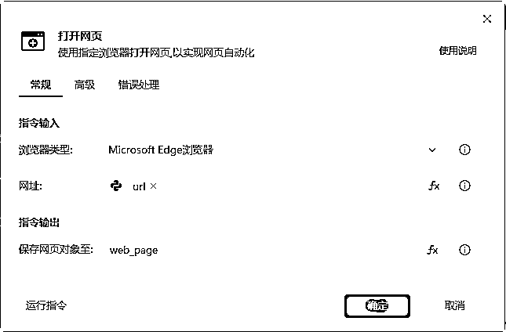

#### 2.2.2 Excel组件

Excel主要是为了读取和保存数据，启动方式那里可以是打开已有的或者新建，文件路径就是Excel的具体路径了，其他的默认就好，更详细的操作文档可以参考

https://www.yingdao.com/yddoc/command-doc/0fa73043c239b612dba6877cdb27c3ff.html

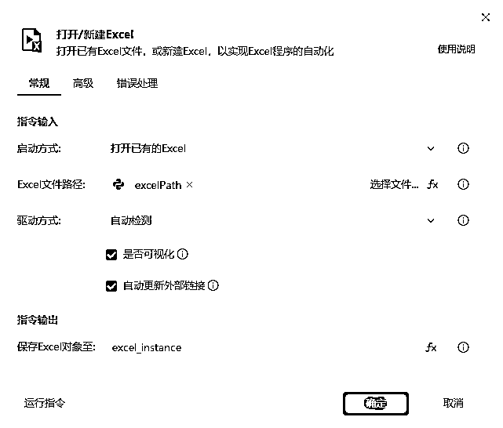

#### 2.2.3 元素库、流程参数

*   ⌈元素库 ⌋ 用于捕获、存放及展示网页元素，元素库中存放web元素 和win元素，可分别通过【网页自动化】和【软件自动化】指令集对对应的元素进行操作

*   流程参数存在于每个流程中，在流程被调用时，可以设置参数与其他流程进行交互

上述两个都在影刀软件的底部区域可以找到

#### 2.2.4 网页元素抓取

不管是获取相似元素列表还是获取元素信息，打开后都会有

点击后，我们再点击捕获新元素，然后到浏览器后，按住Ctrl键就可以选择我们要抓取的对象了

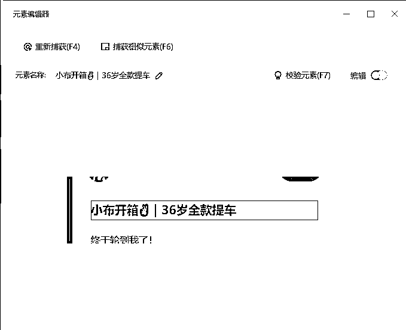

当然我们也可以打开编辑，指定如何选择，一般我们都是通过class类型来进行区分元素的，选中class那一项就可以了

下面是操作视频

#### 2.2.5 批量数据抓取

影刀是傻瓜式的RPA工具，对于批量数据抓取来说，专门提供了数据抓取这个功能(在影刀软键的中间最上面), 点击后进入批量抓取模式,同样也是按住Ctrl进行选择,只要点击主页的图片,就会自动抓取出下面的4个内容,基本上已经满足我们的要求了

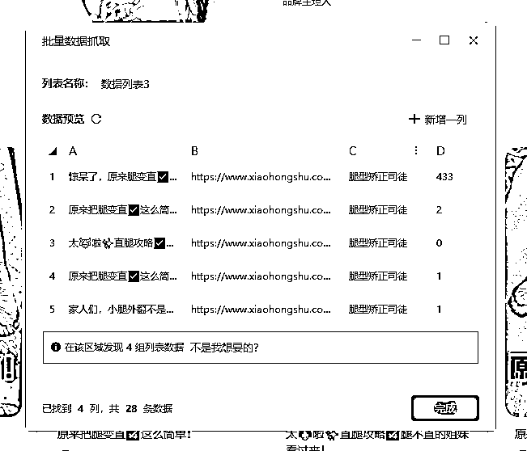

下面是操作视频

#### 2.2.6 获取相似元素列表

上面的批量数据抓取在使用的过程发现有缺数据的情况，可以采用影刀中的获取相似元素列表来抓取小红书博主的主页笔记数据

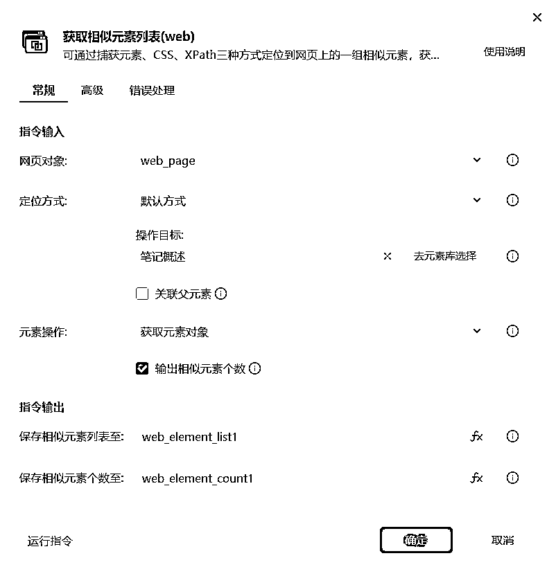

下面是操作视频

## 3 主页笔记的抓取

掌握了上面几个主要组件的使用后，我们就可以开始进行小红书笔记抓取的实际开发了

前置条件：

*   安装好影刀

*   Edge浏览器安装好影刀插件

*   在Edge里登陆好小红书账号

### 3.1 实现思路

我们抓取小红书主页笔记的主要步骤主要

1.  打开Excel

1.  打开浏览器

1.  输入链接地址

1.  主页数据抓取

1.  写入数据到Excel中

1.  网页是否到达底部或者抓取数量超过设置的数量，满足到第9步

1.  鼠标往下滚动

1.  继续4-7步

1.  开始抓取各个笔记的内容，包括点赞数、收藏数、评论数、视频、封面、标题和文案

1.  写入数据到Excel中

### 3.2 具体实现

#### 3.2.1 流程分块

为了更好的交互，我们采用分模块的思路来进行，划分为4个流程：

*   主流程，提供初始参数的输入及串起整个流程

*   抓取主页数据流程，抓取博主主页的笔记数据

*   抓取详情数据流程，抓取具体笔记的各项数据

*   下载流程，下载视频和图片

#### 3.2.2 主流程

打开自定义对话框，是为了可以让使用者指定的内容，比如当前设计的对话框为

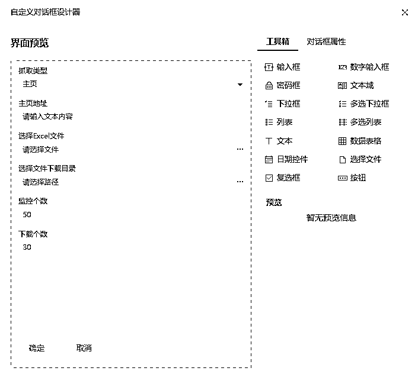

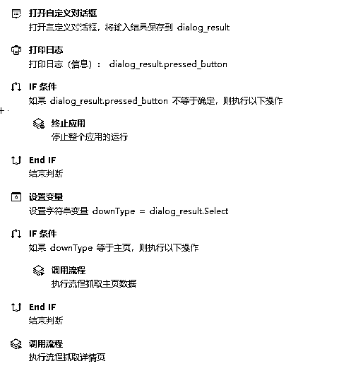

主流程主要就是调用后续的流程，用户输入内容，通过流程中的流程参数传输到各流程中

#### 3.2.3 抓取主页笔记

抓取主页笔记，主要流程其实很简单

*   打开浏览器，进入指定主页链接

*   打开Excel

*   获取粉丝数、总获赞数（当然也可以不需要）

*   循环开始

*   获取相似元素列表

*   循环列表中的标题、笔记链接、昵称、点赞数

*   将此链接赋值给一个变量Index，为了判断是否到达底部

*   将链接加入一个字典中（为了去重），如果此前存在则不需要

*   设置一行数据[标题, 链接, 昵称, 粉丝数, 总获赞数, 点赞数]

*   写入Excel中

*   判断Index是否与LastIndex相同，相同则到达底部，退出循环

*   滚动鼠标滚轮

具体的实现参考下面的图片

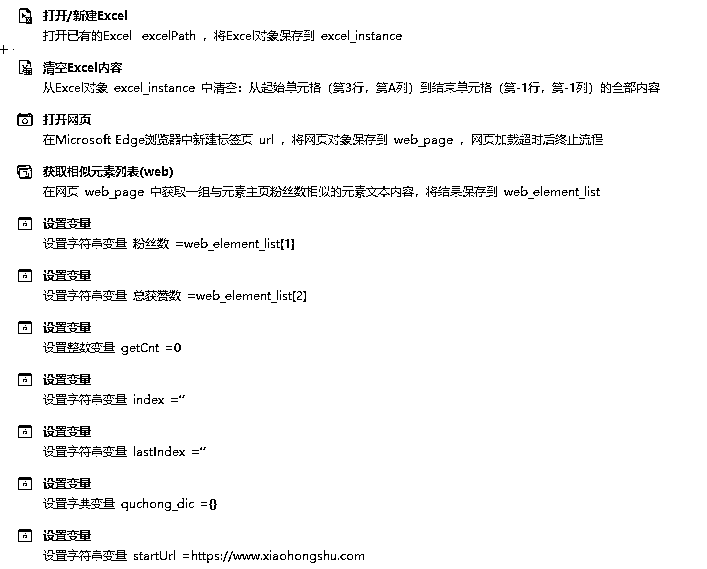

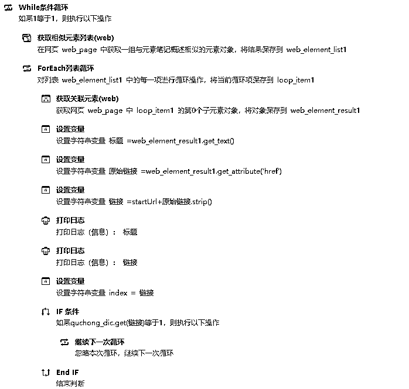

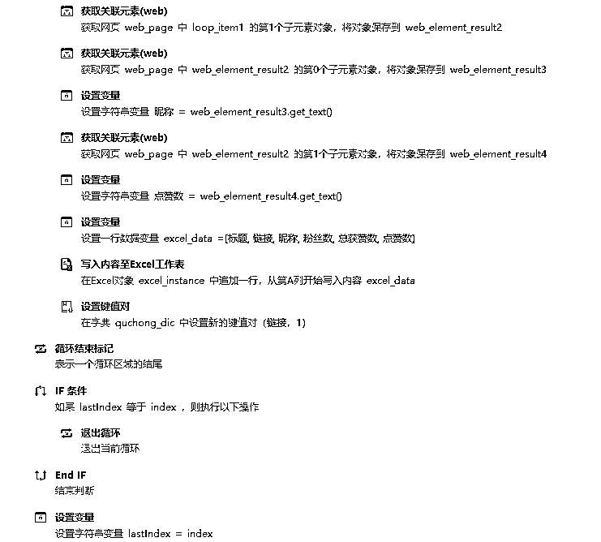

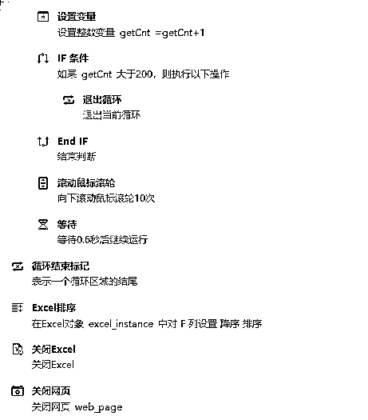

其中流程参数如下：

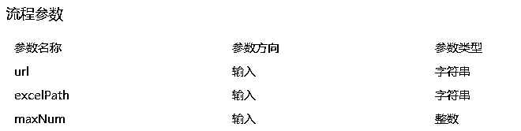

#### 3.2.4 抓取笔记详情数据

主要流程为

*   打开Excel

*   循环读取Excel，读取Excel的B列

*   打开B列中的网页

*   通过“获取元素信息”获取昵称、点赞数、收藏数、评论数、发布日期、标题、文案（图2-3）

*   获取视频链接及图片链接（图4）

*   调用下载流程分别下载图片和视频

*   下载个数超过设定的个数退出循环

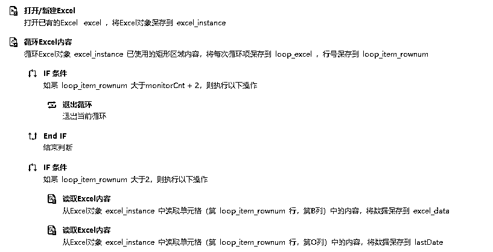

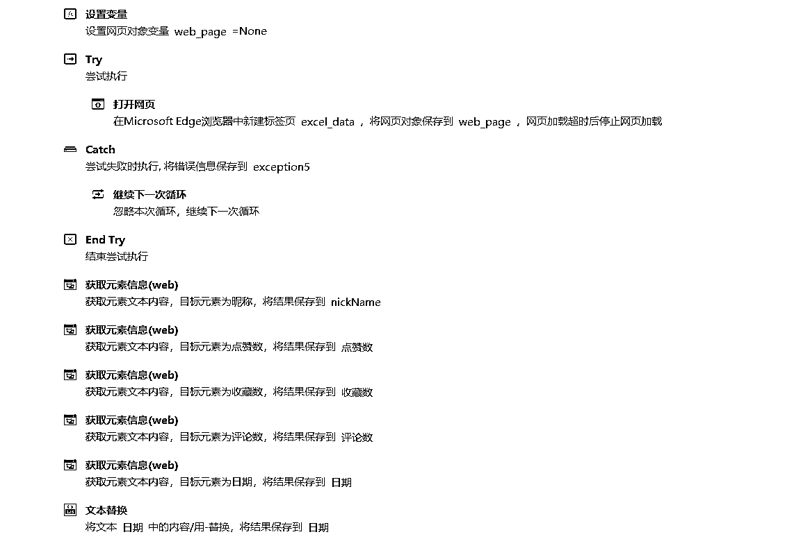

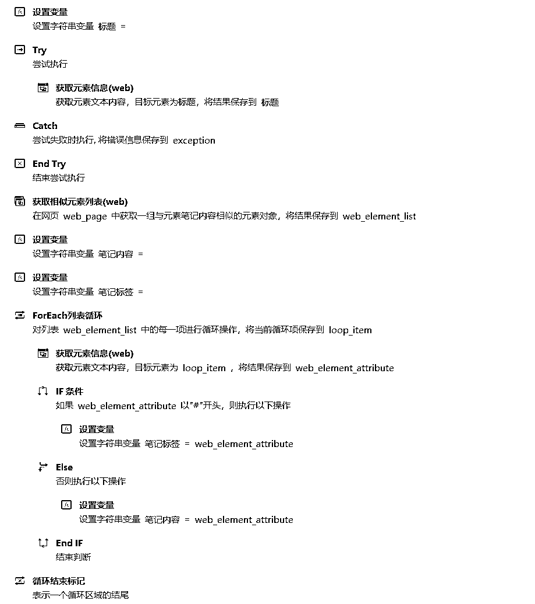

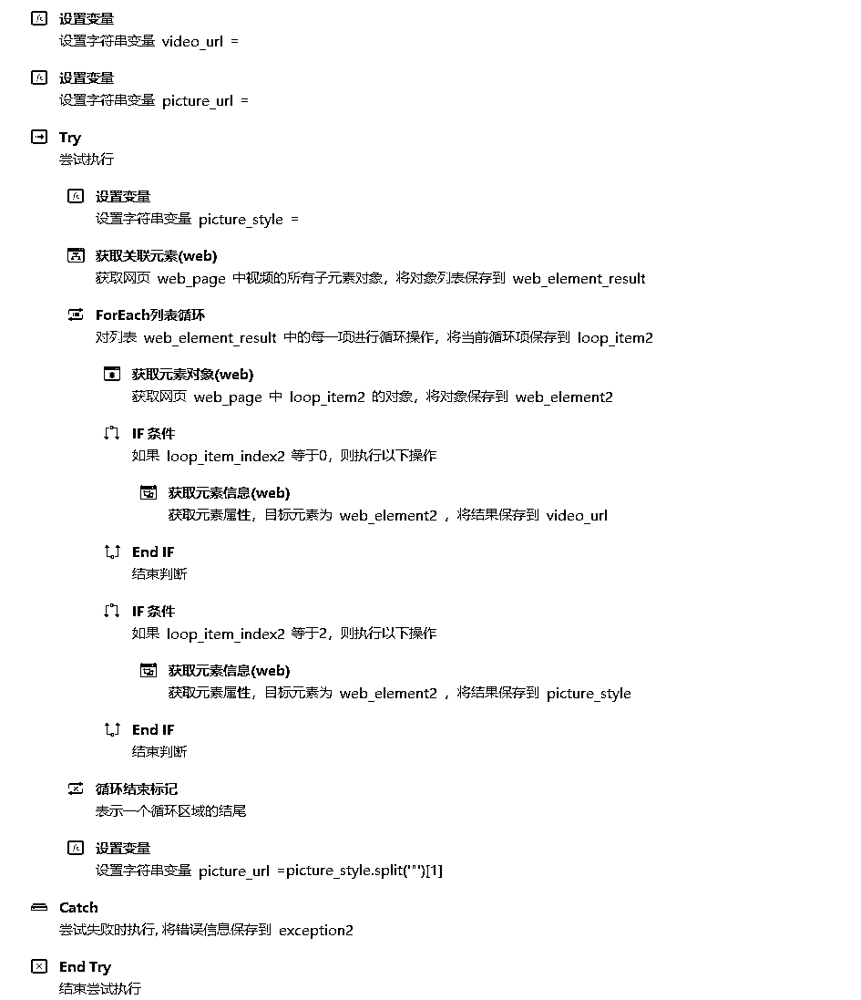

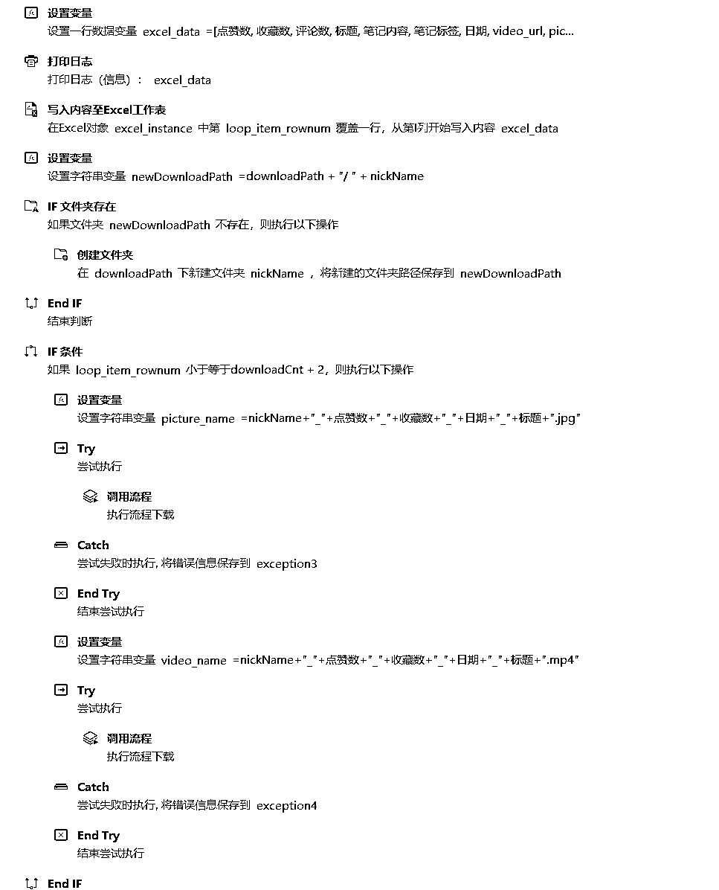

其中流程参数如下：

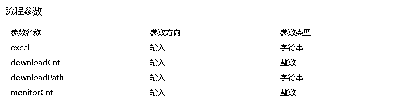

#### 3.2.5 下载流程

下载流程很简单，就是用url去下载，然后保存成文件就可以了

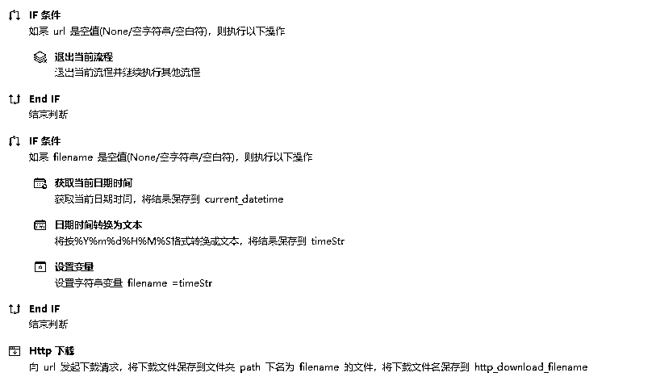

其中流程参数如下：

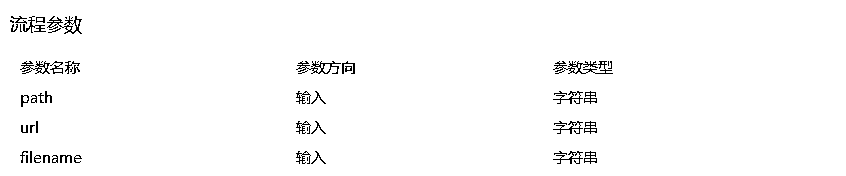

以上，如有教程使用不熟悉之处，可联系书豪微信 wsh137552775，有更优解的影刀抓取对标笔记的操作策略，欢迎提供建议。