# 《不需要直播，3小时洗100条爆款短视频文案，单视频变现10w+，AI+短视频卖课全流程揭秘》

> 来源：[https://b16xnqwk20.feishu.cn/docx/Lu2id1GyPo65QKx9pj7c2gbjnag](https://b16xnqwk20.feishu.cn/docx/Lu2id1GyPo65QKx9pj7c2gbjnag)

生财圈友们大家好，我是宋老师（账号：宋老师帮你做课）

目前是全网做课卖课赛道头部，仅短视频卖课8000单+，年变现800w+，5000多学员中200多位变现100w+。

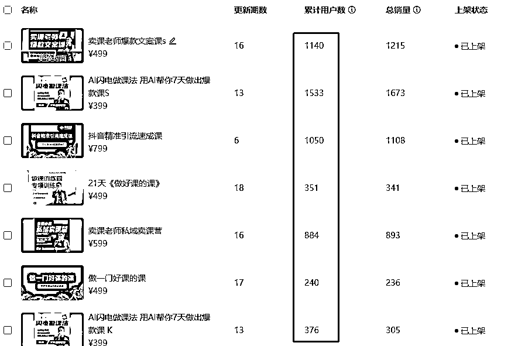

过去的一年，我用短视频文案精准引流3w用户到私域，仅仅引流课就变现近300w。

我把这套打法做了深度的复盘，再借助AI技术的加持，

打磨出一套利用短视频文案高效引爆私域变现的核心实操方法。

这套系统的打法，也是我今天分享的核心干货内容：

3小时洗100个爆款短视频文案，变现10w，我是怎么做到的。

很多生财圈友和我付费学员都向我抱怨过短视频太难做了，

我总结了一下发现，大家最常遇到的问题有这三个：

1.选题难

找选题是拍短视频的第一步，80%的老师迟迟无法行动，就是因为直接卡在了这一步上。

2.不会写

好不容易找到了对标和选题，但是却不知道该怎么下笔去写文案。

3.写不出爆款

憋了半天好不容易把文案搞出来，但拍完之后发现总也出不来爆款，于是只能从入门到放弃。

今天的分享，就帮各位解决这三大痛苦，轻松靠短视频变现。

在分享之前，先做个简单的自我介绍，便于大家快速知道我的价值：

我的五个标签:

1.目前自媒体头部的做课&卖课博主——流量能力

2.原来的新东方总监，最高记录同步管理80w学生社群——教学能力

3.仅靠短视频，单日获客线索稳定140条以上，仅引流课一年变现近300w——短视频变现能力

4.8000多位知识博主的老师——成绩

5.很多百万博主背后做课卖课的男人

今天的分享本来是我线下闭门会的付费内容，但作为曾经的新东方教育人，

分享干货，为更多人提供价值，始终是我的追求。

更何况在生财的圈子里，我结交了太多大佬，也学到不少干货，

今天是时候把自己最有价值的实操心得分享给大家，希望能帮助更多老师。

闲话少叙，直接上干货。

# 一、如何用神器工具，批量找爆款选题

## 找低粉高赞是王道

在找选题这件事上，大多数老师的想法都是自己找对标，看同行，或者去看创作灵感。

但真正的牛人都是不会在这件事情上花太多时间，他们会借助工具，高效地找到适合自己的爆款选题。

这里给大家分享一个批量找爆款选题的工具，它不仅能帮你抓到你赛道的博主以及爆款选题，

而且还能按照点赞数去进行排序，详细地罗列在一个表格里。

这个工具最大的魅力在于，它能帮你抓取出低粉高赞的账号选题。

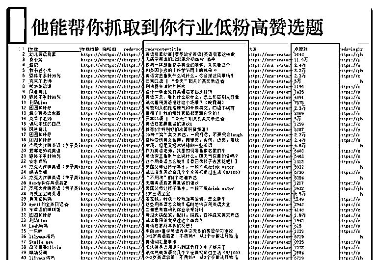

为什么要找低粉高赞的选题，拿我自己的实际案例给大家解释一下原因。

我最开始搞矩阵号的时候，我看到了一个短视频，讲的是5个AI神器。

这条短视频当时有1w收藏、8k点赞，而且这个老师当时的粉丝量只有1.2w，满足低粉爆款的逻辑。

当天晚上我就测了一下这个选题，这是我短视频发布之后第二天的数据，

跑了7k点赞，1.4w的收藏，这就是低粉爆款的魅力。

再给大家说一个数据，我用低粉爆款这个方法，

两条视频涨了1w粉丝，后台咨询的人数有三百多人，而且买课意愿非常高。

但是低粉爆款，经常可遇不可求。如果不借助黑科技，真的很难发现。

所以我常说一句话：平凡的人拼概率，牛人只拼黑科技。

在知识博主这个圈子里，没有人是不勤奋的，但是在做短视频这件事上，勤奋在工具面前不值一提。

你有工具，3分钟就能搞定，不用工具，你要干30个小时才能勉强搞完。

## 实操案例

逻辑打通之后，接下来带着大家真枪实干。

怎么能获取我在前面提到的表格？很简单，几个步骤就搞定。

### 第一步，话题采集

这里需要用到的工具叫【后裔采集器】。

拿小红书为例，随便找一个话题标签，比如#知识付费，点开这个标签之后出现的全都是带有这个话题标签的内容，但它的顺序是乱的，有的点赞高，有的点赞低，所以我们很难找到低粉高赞的短视频。

接下来就是借助工具来帮我们完成这个步骤了，点击右上角复制链接。

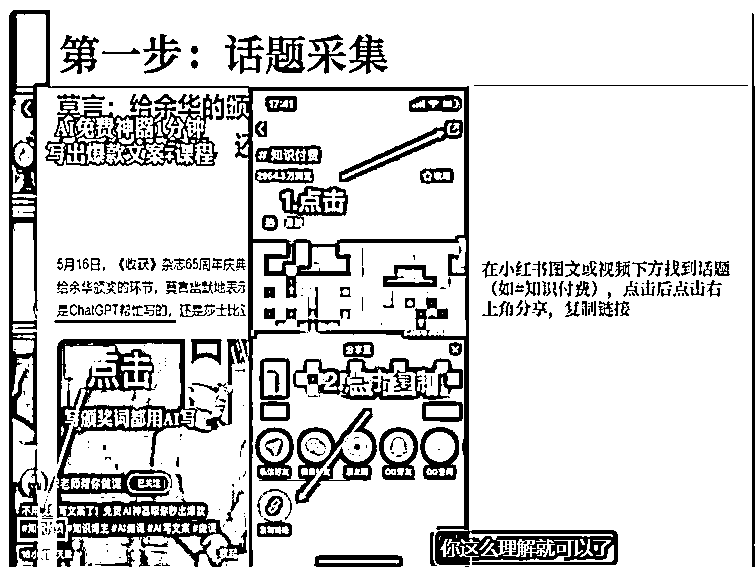

### 第二步，粘贴到后裔采集器中

把复制好的链接直接粘贴到后裔采集器中，进行数据采集即可。

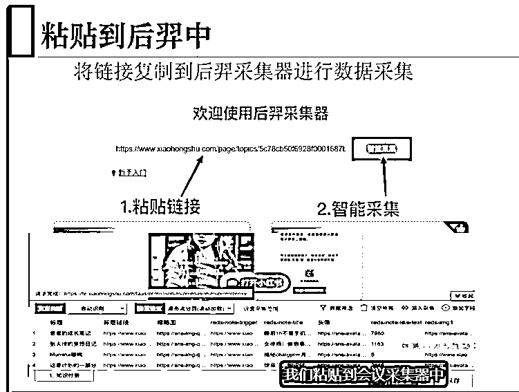

### 第三步，数据处理

把表格导出来，按照点赞顺序排序。

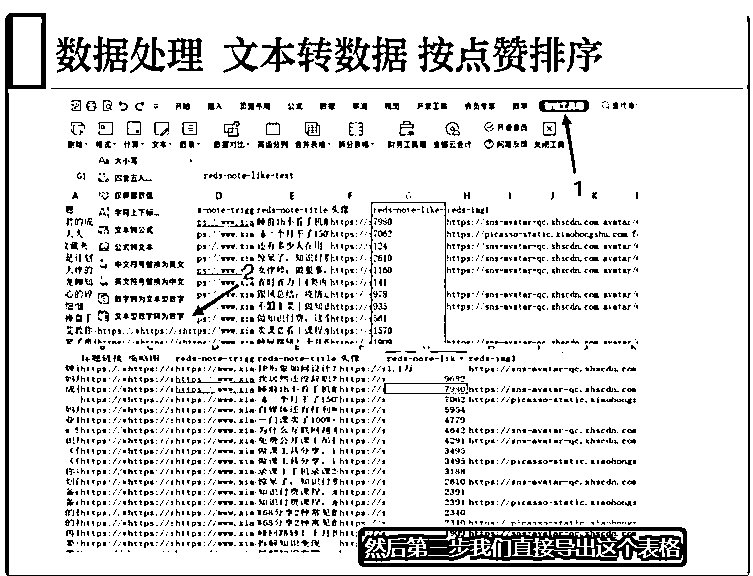

### 第四步，提取文案

按照低粉爆款原则，筛选出你想要的对标内容，用轻抖提取短视频文案。

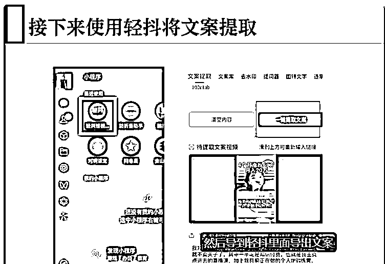

四个步骤，轻松搞定爆款选题，得效率者赢天下。

篇幅有限，更多功能欢迎大家在亲自尝试的过程中逐渐探索出来，私下也可以多交流探讨更多玩法。

详细教程可以参考这篇《1年800万，知识博主流量➡变现闭环系统》

# 二、chatGPT十分钟帮你改写爆款文案

## 利用chatGPT进行仿写

chatGPT的文案能力非常强大，只要投喂它指令，它就可以帮你写出对应的爆款文案，

但前提是你输入的指令要精准、清晰。

在这里就不过多赘述了，给大家分享个用chatGPT写文案的口令，

大家可以自己尝试一下

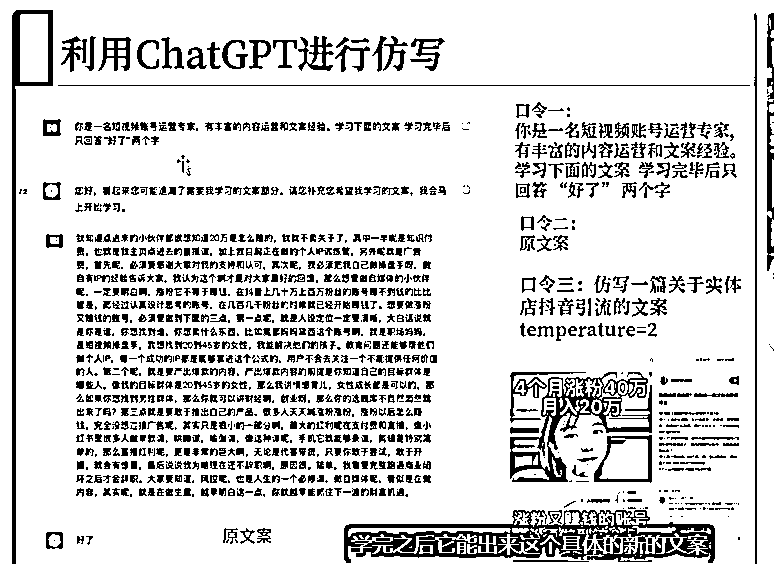

## 模仿自己的风格改写别人的文案

今天想给大家分享一个很好玩的写文案方法，我找了一段别人的文案，

让GPT用我的风格去改写别人的文案，如图：

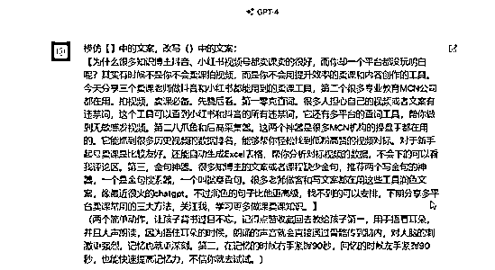

得到的结果特别给力，几乎完全模仿了我的短视频文案风格，不管是文案结构还是语言表达方式，都非常像。

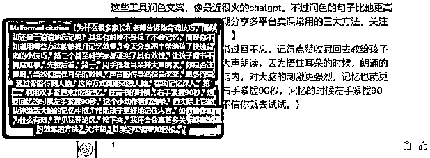

这就是借助AI工具的魅力，它的工作效率就是比人工高出一大截，

而且它不会像人一样有情绪，有拖延，或者其他复杂的因素。

# 三、矩阵打法引爆公域

有了工具的加持，3小时直接洗100个爆款短视频文案轻轻松松，

这时候就别一个号慢悠悠地搞了，直接矩阵搞起，引爆公域。

我和我的团队最近刚起了一波矩阵号，大家可以看一下，我在公域平台的账号可太多了，每天进量又会增加不少。

关于矩阵打法，也有很多需要注意的细节，篇幅有限就不展开讲了，感兴趣的老师可以私下交流。

# 四、几个避坑指南

在本次分享的最后，想给各位老师分享几个核心避坑指南，这些都是根据我的亲身经历总结得出的宝贵财富。

## 避坑1：无爆款结构，无稳定流量

长期持续引爆公域的核心，就是要找到一套能够批量起号的爆款文案结构。

爆过的选题和结构，一定会反复成为爆款，这一点一定要无比坚信。

为什么我们团队矩阵起的快，没有那么多复杂的逻辑，

原因很简单，我们的文案结构是固定的。

我们先让AI去学习爆款结构，让它帮我稳定输出爆款文案内容，批量发到矩阵号上。

这个方法的效率和产出比无疑是最高的，而且带来的流量也是稳定且精准的。

团队负责私域的小伙伴每天只要安心负责接量和转化就好了，完成业绩也毫无压力。

知识博主的爆款一定是重复的，只是你不知道爆款的结构而已。

不断地重复，稳定地产出爆款，你才会有更多的流量进来，稳定变现。

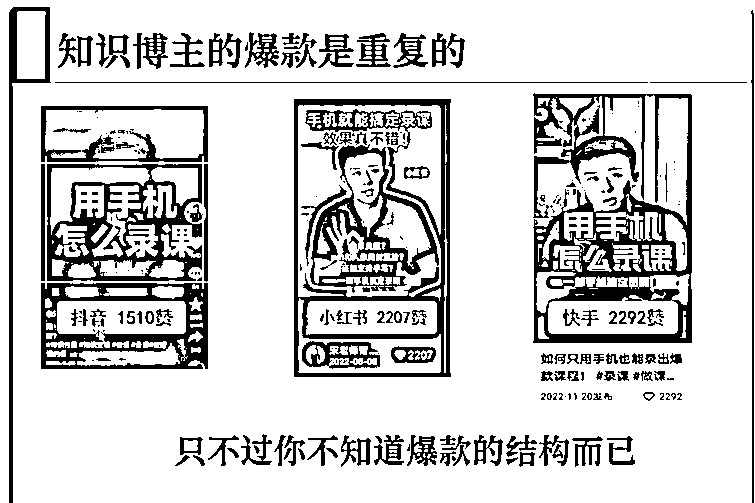

## 避坑2：不要追求流量的繁荣

很多知识付费老师最大的误区就是，我要流量，我要数据，我要蹭热点。

但由此带来的结果就是，数据很好看，流量很生猛，但没有精准用户，变现非常困难。

一个很重要的底层逻辑：

不要追求流量的繁荣，流量只是虚假的繁荣。

要多追求买课的咨询，这是决定你能不能变现的关键。

我现在单条300赞的视频，后台加微信咨询课程的人数大概有差不多100人，

核心就是我的短视频文案里面有钩子，用户根据我的钩子就来找到我，

这能让我非常高效且轻松地卖课变现，因为来的都是精准用户。

## 避坑3：写文案，能用公式，不用人工

新手上路总是盲目自信，总想着我一定要原创，要输出自己的观点，自己的内容。

这种盲目自信带来的后果就是——没有流量，非常打击自信。

时间久了你就会自我怀疑，自然也就拍不下去短视频了。

和大家说一个扎心的事实：90%的原创知识博主，最后都是死路一条，基本都是烂尾。

写文案都是套公式的，尤其是爆款文案，而且越套公式效果越好。

我常说的一句话是：直播卖课是瀑布，短视频卖课是小河，细水长流。

好的短视频文案是能帮你自动卖课的，我们团队经常靠短视频一天卖课过万，甚至过3万。

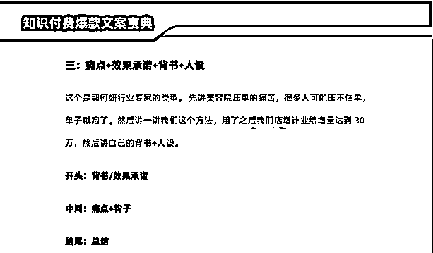

短视频的核心在于文案，你只要借助AI工具，找到爆款选题，

严格按照爆款文案的公式去用工具改写，不愁写不出来。

分享给大家几十个爆款短视频的文案公式，可以安排

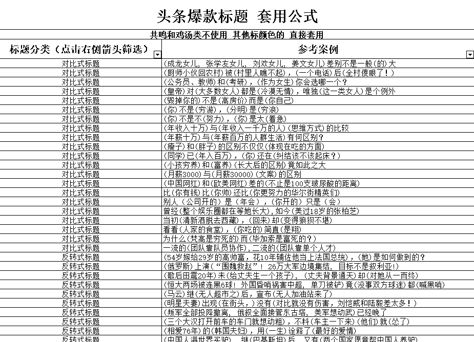

# 五、公式化写文案，效率更高

我们团队在写短视频文案的时候，主要有这四个公式化：

第一，选题公式化

第二，开头公式化

第三，结尾公式化

第四，钩子内容公式化

这是一套完整的方法论，也是我付费训练营中的核心内容，

在这里就不展开详细说了，感兴趣的老师私下多交流。

把短视频文案中的每句话都公式化，每次写文案的时候只需要填空即可，效率能不高吗？

这就是我通过短视频全网卖课8000单的核心秘籍，因为我的文案抠的足够精细，都是像素级拆解。

再加上工具的加持，效率直接指数级上涨，公域进量直接放大。

# 写在最后

今天要分享的内容就这么多，无论你是新手知识博主，还是已经在知识付费领域拿到过大结果，

在写短视频文案这件事上，能借助工具快速高效解决的事情，千万不要花太多时间和精力。

学会借势借力，科学使用工具，和时间抢跑，比勤奋努力更重要。

希望大家都能不用直播，仅靠短视频就能变现百万，大家有任何做课卖课相关问题，欢迎随时与我交流讨论。

往期精华帖：

《用【钩子打法】1年引流30000私域粉，卖课300w是什么体验！（附钩子制作全流程）》

《30天私域卖课60w是什么样的体验？》

《用Chatgpt 7天做了一套课，单月卖了1300单（变现52w）》

我是宋老师，23年帮助500位老师卖课50w，欢迎和我一起卖课生财！