# 副业：小红书日赚几十的无货源项目玩法

> 来源：[https://nivut760ftk.feishu.cn/docx/LygSdKp0Qo3DigxAABec6wXCnzd](https://nivut760ftk.feishu.cn/docx/LygSdKp0Qo3DigxAABec6wXCnzd)

哈喽大家好，我叫艾小飞，擅长小红书图文引流

看我这篇文章之前，你可以思考一个问题

现在距离2023年结束还剩最后一个多月的时间了，你有多久没找到一个可赚钱的项目了？

看着身边人的朋友圈做的项目一个比一个赚钱，是不是越看越焦虑

我相信这也是很多人都会遇到的感受

其实可怕的不是赚不到钱，而是没有方向，一直在迷茫的寻找方向

别焦虑，别迷茫，今天我给大家带来一个实操性强、容易复制、还能稳定每天都能出单的小红书无货源项目玩法

这个项目从我发现它需求开始，到实操日赚3k的过程，只花了8天的时间

为了验证我这个模式的可靠性，我复制给身边朋友去操作，他们能保持每天都有出单，那就说明这个项目玩法是可以复制出来给大家做的

这个项目它的操作流程和思路都有哪些？

好了，废话也不多说了，我们直接开始进入正题吧

这个项目的思路玩法非常的简单

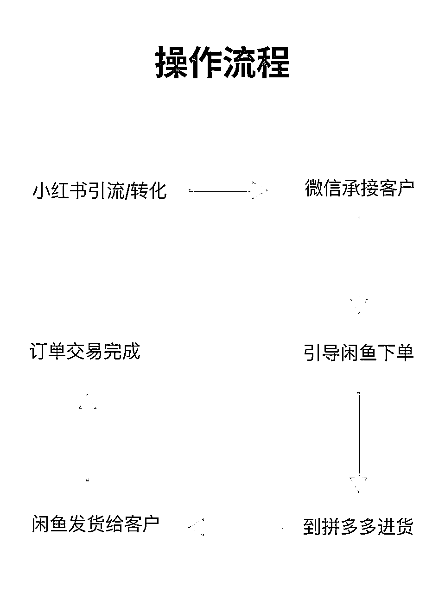

就是利用小红书上很多人想占便宜的心理，然后把他们引到微信上下单，有订单后，我再通过低买高卖的方式，到拼多多下单发货给客户，这两边中间的差价，就是我所赚到的利润

操作这个项目用到的产品就是大闸蟹中的细分领域：残蟹

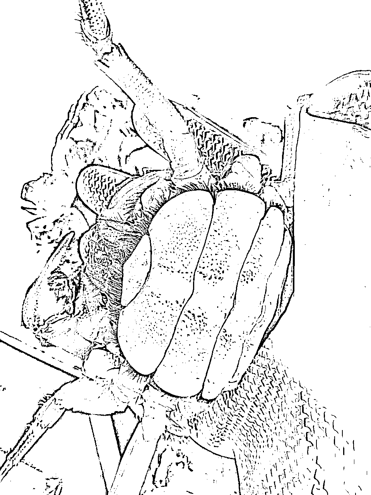

可能很多人都不懂什么是残蟹

残蟹就是断了腿，但还活着的大闸蟹，它的最大优势是保证跟好蟹一样品质和口感的情况下，价格还能比他们再低一半以上，性价比非常的高

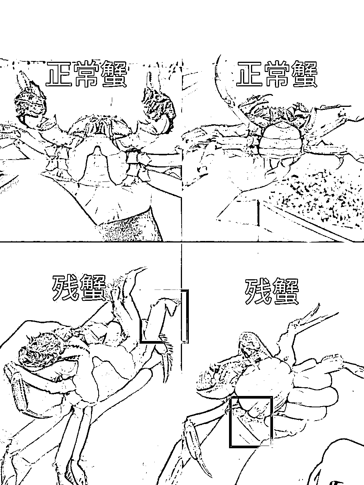

所以在小红书上很多的用户都有这方面的需求，但大闸蟹的商家却忽略了这点，并没有谁愿意去做这种小事

既然有需求又没人愿意去做，那我的想法是，不如去试试看，说不定跑通了后还能赚些零花钱，跑不通最多也是浪费一两天时间而已

说完了什么是残蟹和需求，那这个项目都有哪些操作流程？

做项目的第一步，我比较喜欢去看同行是怎么做的，我会去搜索“大闸蟹”或者“残蟹”这个关键词

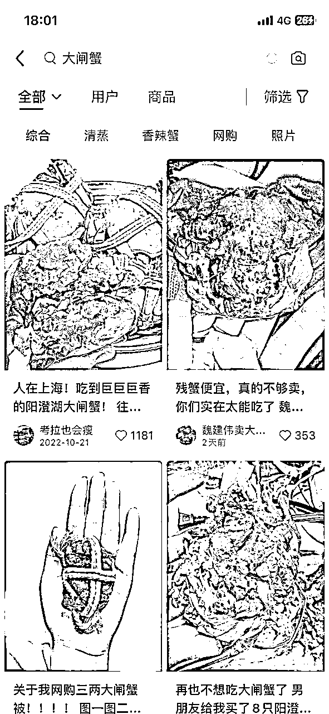

把排名前20的标题全部都复制下来，因为他们能有流量，标题肯定是经过测试的，我们直接照搬拿过来修改下就好了

然后再去搜索“大闸蟹吐槽”的话题笔记，到他们的评论区里搜集大量的素材作为我的封面

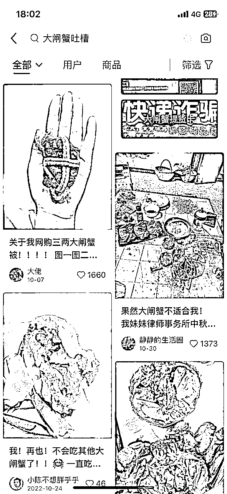

把素材批量简单的二创后，就可以开始发布第一篇笔记了

发布笔记的时候有个细节点，就是不能打开定位，不能打开wi-fi，不能保存相册

发布出去后，就静待等人来评论了

因为我们的笔记类型是商业引流类的，所以一定要去关注评论区是否有人留言，有人留言了，说明你这篇笔记是成功的

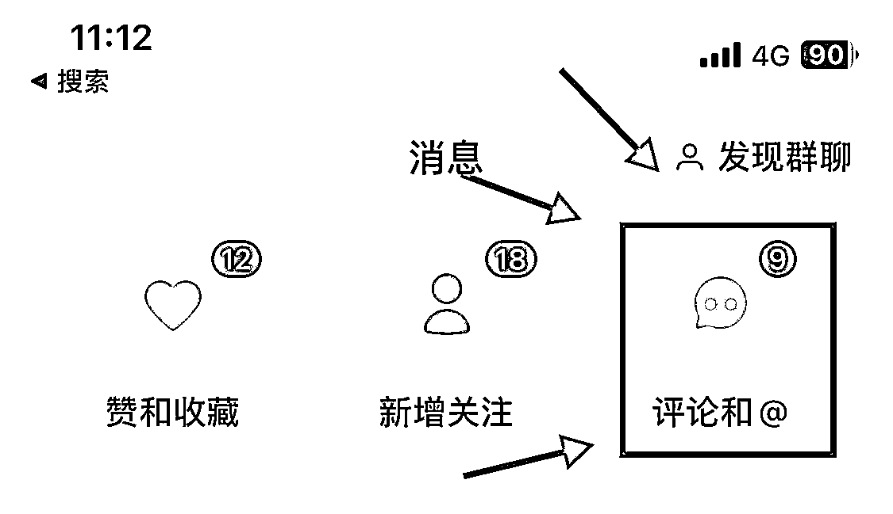

要是没留言，那说明你的笔记根本就吸引不到人，这样的价值是很低的

给你们看看我当时发布第一篇笔记时来的咨询量

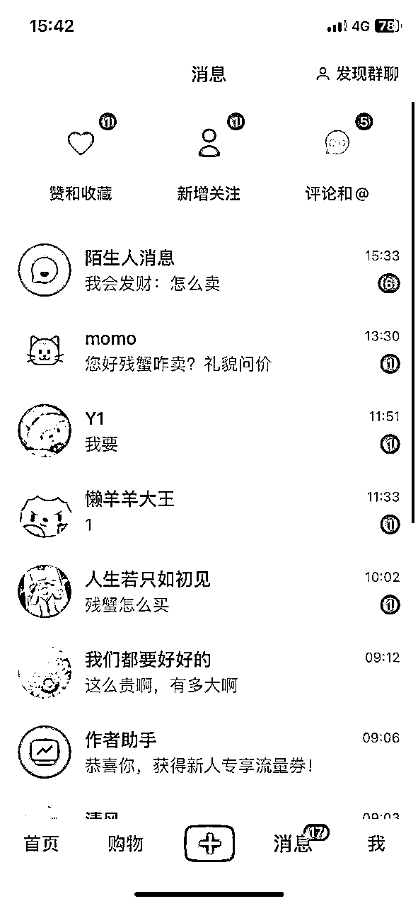

因为小红书的后台消息我没打开，我还以为没什么人来看，也没想到他们的需求会那么的旺盛

然后我就马上积极的继续发第二篇

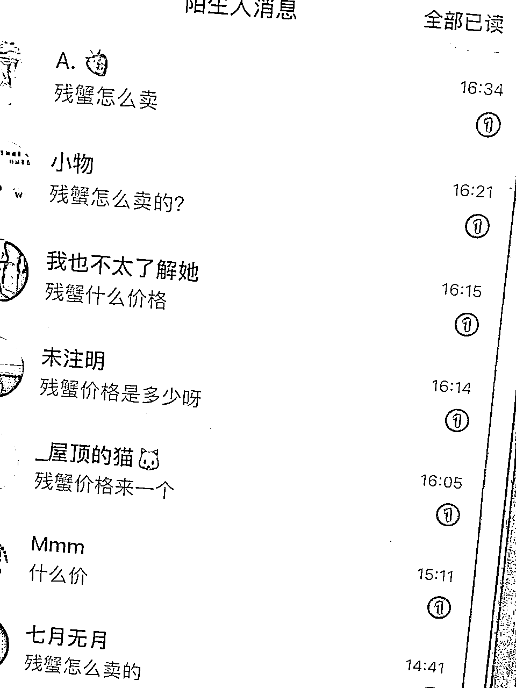

发完之后马上有人来评论，我就把他们都引到私信上主动找我私聊，看看能不能转化第一个下单的客户

当时我觉得引的人还不够多，想要再引多一点人来成交，于是就继续开始发下一篇引流笔记

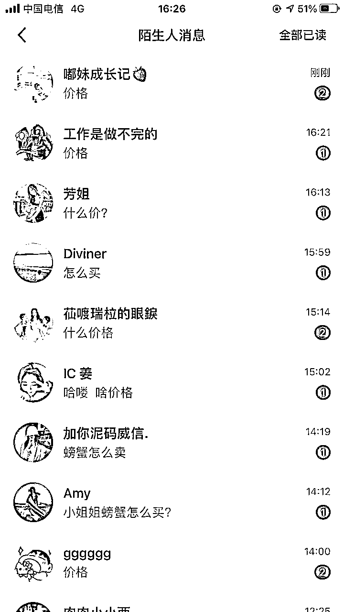

来咨询的人越来越多，我也开始意识到，很多人都很关心残蟹的价格，然后我就马上去制作了一套价格表，这样更能分得清，哪些是真实的客户，哪些是来看热闹的

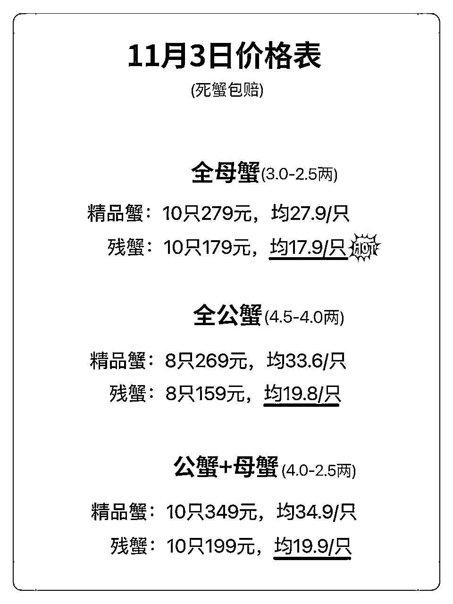

但发出价格表后，基本上他们都没有什么回应了，我觉得这样下去不行，继续再发了两篇，打算用量变来换取质变

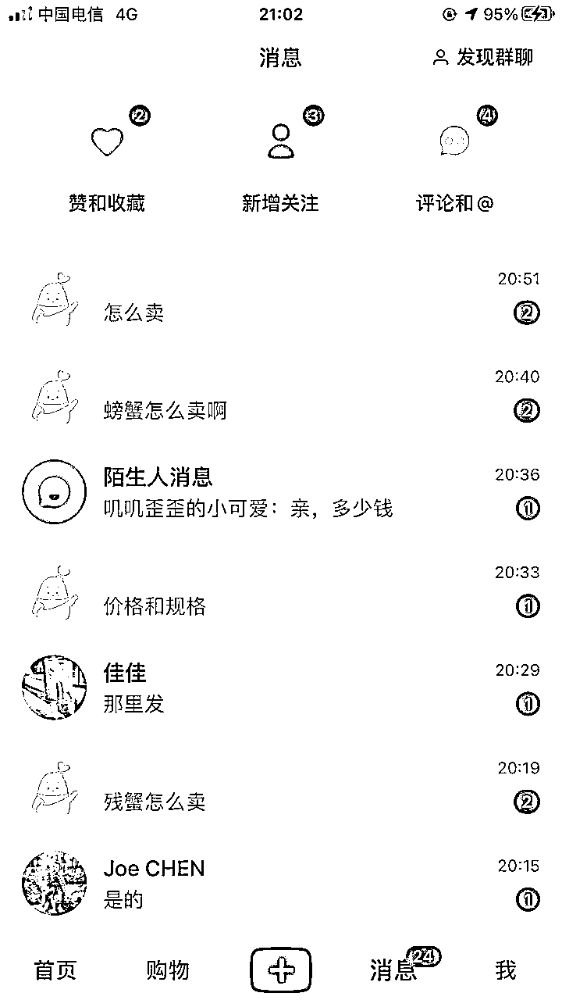

可能你会问，为什么不直接引到微信上成交呢？

我的想法是，当时我了解到的这个残蟹行业，同行之间的竞争是非常恶劣的，举报同行小红书号这种都是家常便饭的事，要是你不过一层筛选，就把他引到微信上，他随便就把你的朋友圈给举报封掉了

小红书号可以来回注册多次没问题，但微信号却经不起这么的折腾

我认为把所有人引流到微信上这个风险成本，相对来说是比较高的

所以我就保持着一个习惯是，不管是玩小红书的哪些副业项目，我都在当前的APP上完成转化后，我再引到微信上成交，虽然累，但安全！

下一步就是在聊天过程中，当我确认用户他是有意向想要来找我下单时，我就把他引到我的微信号上，然后进行下单成交

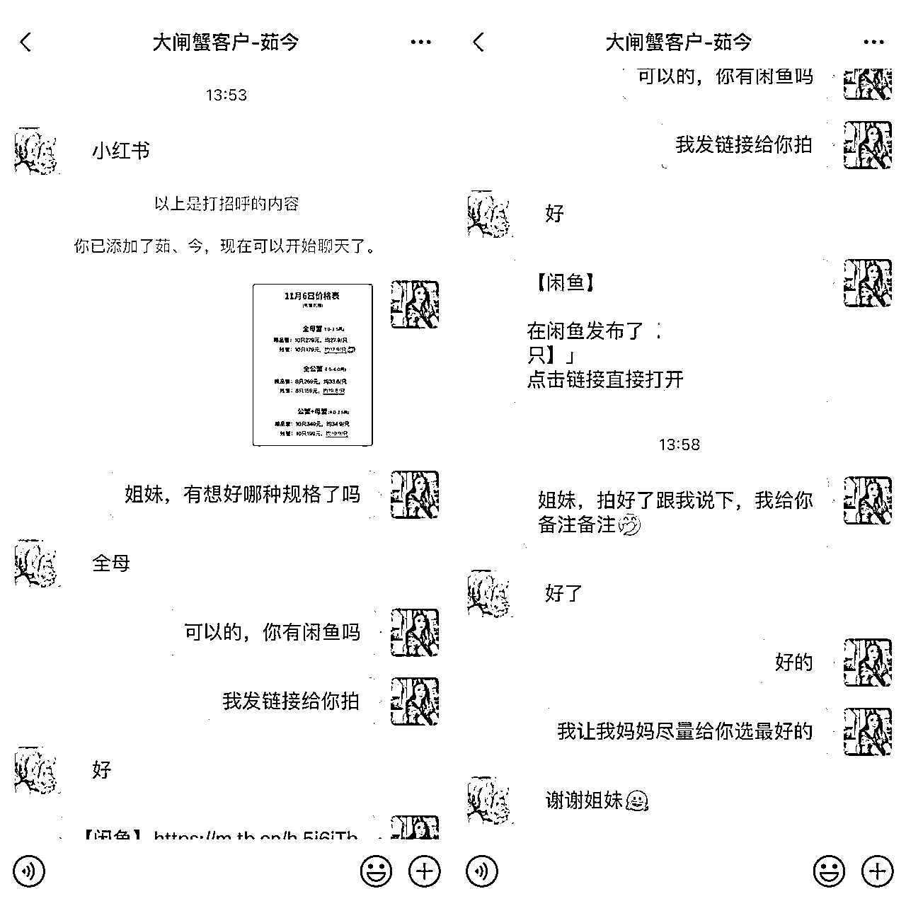

这里有个细节点，就是小红书用户从聊天到加我微信这时间，是非常短的，信任基础很差，有些客户会比较敏感警惕点，不敢直接给我去转钱

然后我就用闲鱼来作为我们之间的一个信任桥梁，在编辑好链接后，我就分享过去给他下单，这样就可以完美的避开这种信任低的问题了

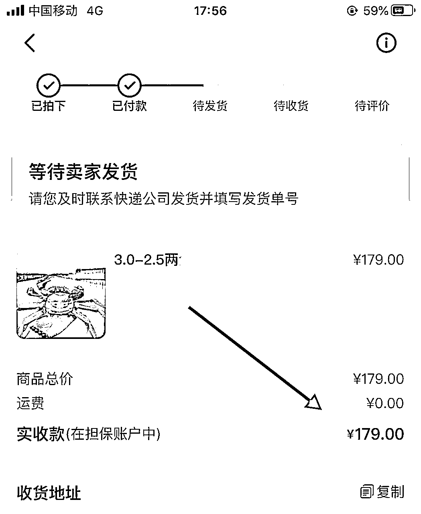

当他下了单后，我就马上去拼多多给他下单对应的规格，顺便也给你们看看，我的进货价和售价分别是多少钱

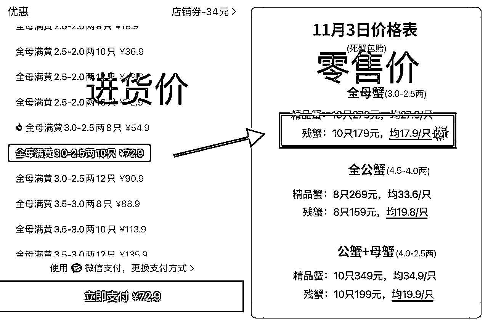

算得出我每单能赚到多少吗？

179-72.9＝106.1元(利润)

夸张吧，是不是有点不敢相信，我给你们看看客户跟我的下单记录

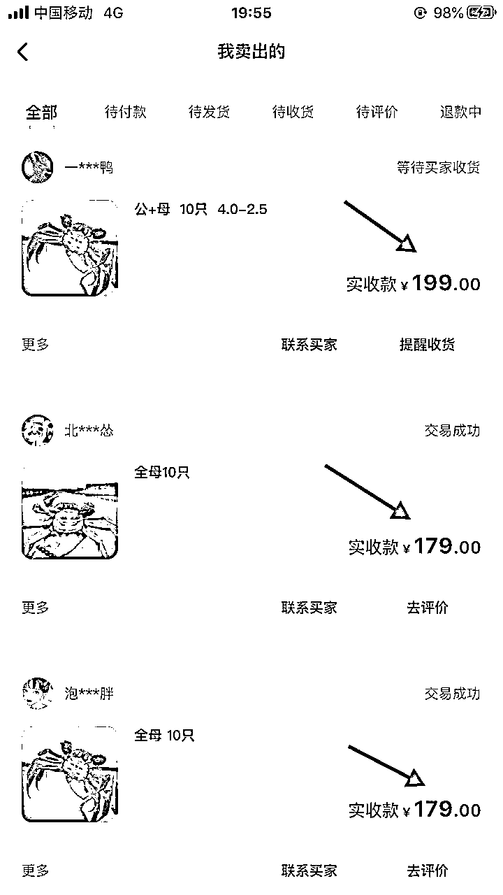

也就是说，只要一个小红书号，一天能给我带来一单的话，那么我的纯利润就会有100块钱

要是一篇笔记小爆了后，一天出个十来单，也不是什么很难的事

要是你家里有几台闲置的手机，然后问家人借个号码注册几个小红书号，几个号同时去引流赚钱，那这个利润还会更多，而且还很轻松

虽然利润比较可观，但有一点让我比较烦恼的是，我是非常痛恨拼多多的虚假宣传

比如我给客户下单的是3两母蟹，拼多多发过去连绳带称都不够3两，导致刚开始很多客户都来骂我说是个骗子

但毕竟这种客户来闹事的比较少，要是真有，就把锅丢给拼多多，客户让我们退全款，我们就让拼多多那边退全款，反正我们不能去吃这种亏哈哈

如果你身边有这方面的货源比拼多多要稳定点的，可以跟他们去谈谈合作，看看能不能支持一件代发的

要是价格是比拼多多还要再低的，那这就是你的优势

当三天后客户收到货了，要是没什么问题，会自己去闲鱼上点确认收货的，这时候你的货款就打到你的支付宝上了，这笔交易就完成了，你也能赚到这100块的利润了，这过程是很丝滑的

可能你会好奇，这个残蟹项目可以做多久？

因为残蟹它是属于季节性的产品，一般是到中秋过后就开始上市卖了，现在是11月份，离残蟹结束至少还有3个月的周期，时间还比较充足的

如果你对这个残蟹感兴趣，可以按照我的这个思路流程去操作一遍，哪怕赚的钱不是很多，但至少还能锻炼自己小红书引流的经验

好了，这就是我整个实操残蟹的一个项目思路过程，要是你有兴趣的话，可以后台聊聊，谢谢大家

原创：艾小飞

转载可私信

禁止搬运和抄袭

微信：aifei9977 （记得备注来意）