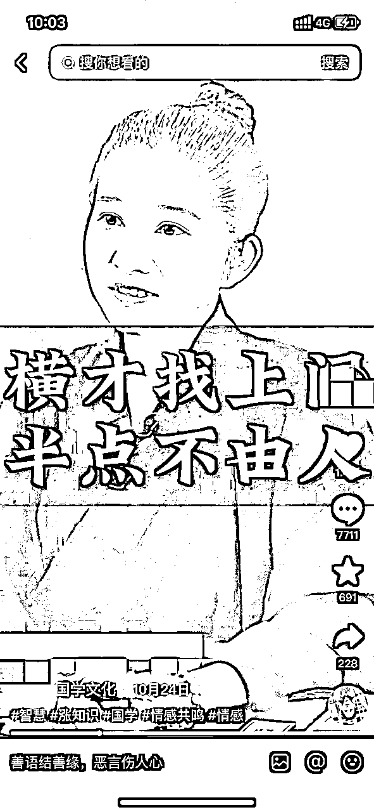
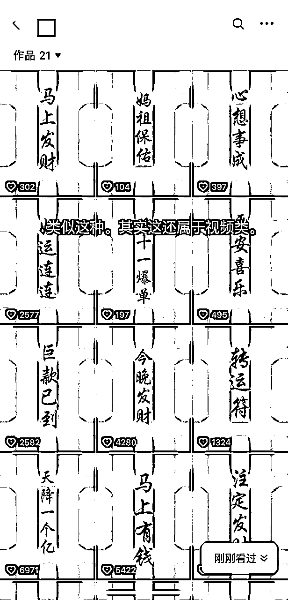
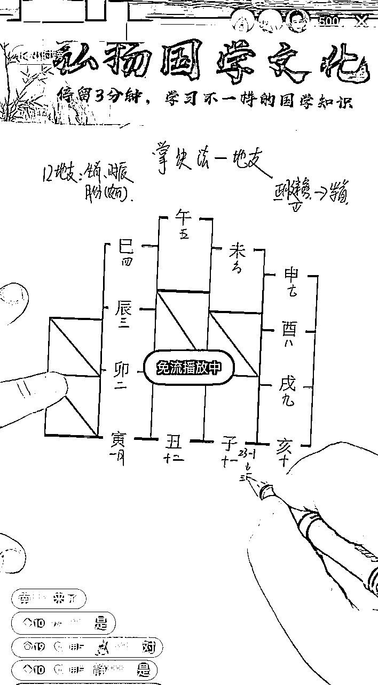
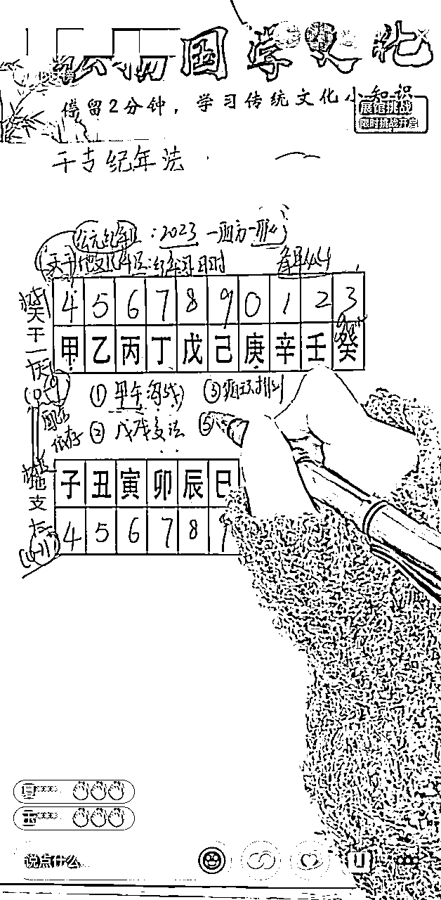
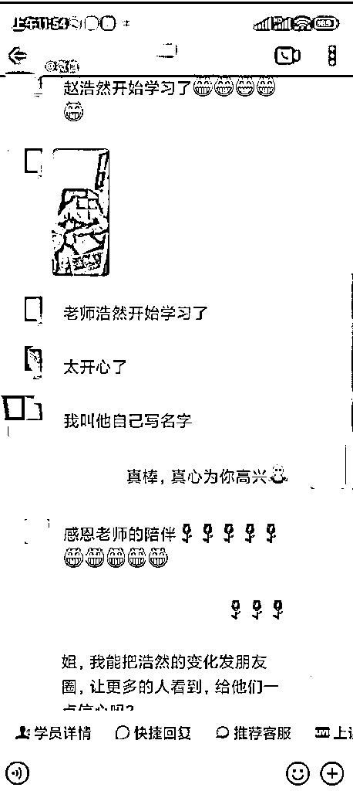
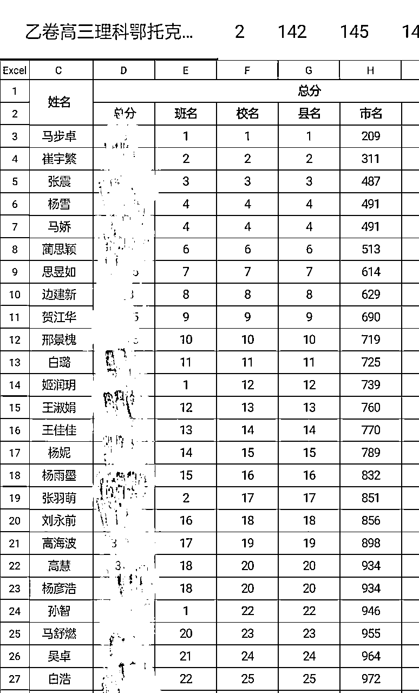
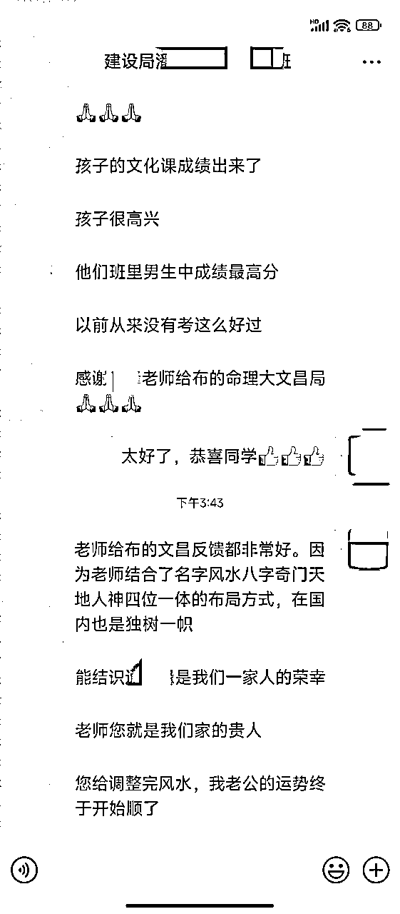
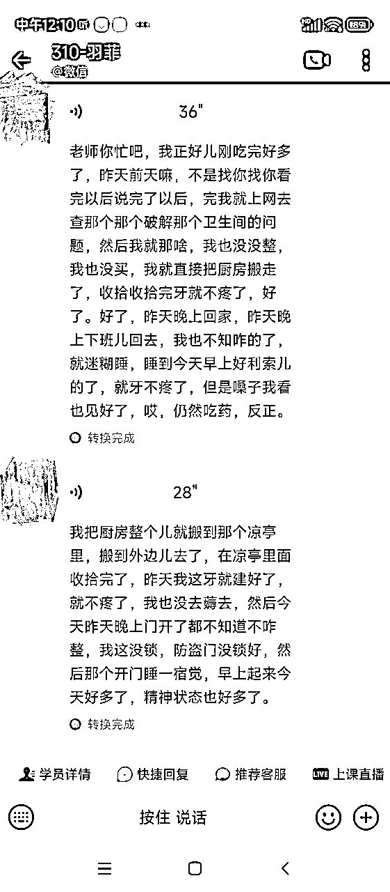
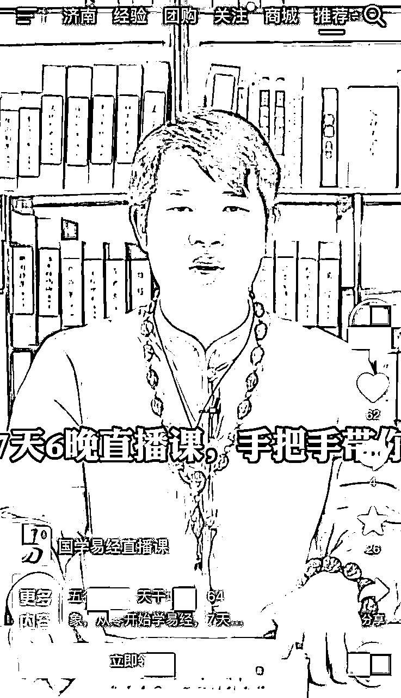
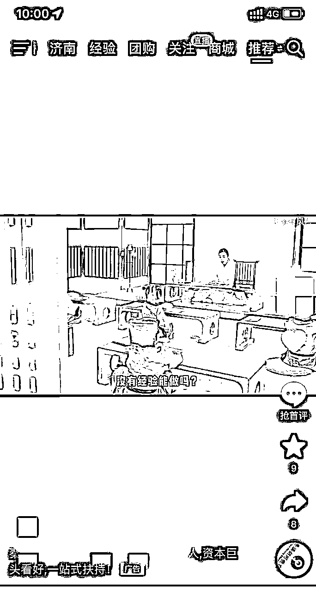

# 深度复盘：如何打造一个盈利的中老年知识付费公司（国学类）

> 来源：[https://yq7rvno1sgy.feishu.cn/docx/MBo9dklVMoaT1Ex0FNxcaADunDb](https://yq7rvno1sgy.feishu.cn/docx/MBo9dklVMoaT1Ex0FNxcaADunDb)

本篇帖子分为五个章节：

1、概述行业前景

2、国学引流方法

3、国学转化成交详解

4、国学交付环节

5、结语

宗旨是让新手看了少走弯路，老手看了恍然大悟。行业外的人拿去能用，行业内的人用了有效。创业者拿去拉投资，投资方拿去做模型。避坑和感悟在每个章节的最后和段落的文末。

我们目前销售团队有 21 人，利润还可以，至少资金方很满意。可以说这个项目是靠三个人做起来的，我们一个负责业务端，一个负责管理端，一个负责投钱，啥也不干。项目前期其实也是亏损状态的，但后面也是实现了近百万的盈利。

先来说说我为什么写这篇帖子。

第一，在生财有术风向标群里，亦仁老大最近更新了新玩法，组队拆解风向标项目，我要说这个“创意YYDS”，本期四大选题之一就有拆解中老年知识付费赛道。作为队长我必须拿出干货，掏出家底了，还好目前我公司所做的项目非常契合选题。

第二，我在生财有术星球里通过搜索国学，所有沉淀的 496 篇帖子里，我发现没有一篇写国学的精华贴。所以我觉得有必要把这块知识点补上。

第三，国学属于闷声发大财的赛道，行业大佬都忙着捡钱不愿意分享。我属于后来进场的新人，没有那么多顾虑，本着咱们生财有术利他的的思维，所以抛转引玉分享我公司在做这个项目中“踩过的坑”和“赚到的钱”。

# 第一章节：概述

国学赛道大有可为，知识付费大有可为。赚钱机会非常大。在将来的 20 年里会迎来蓬勃发展。原因是什么？为什么是 20 年？

大家一看就明白了。一个人的财富积累和福报，并不是完全取决于自己的努力，而是来源于命运给你的机会。换而言之，一个人的播种，不仅要看天赋和努力，也要看人生的“天气”。

2024 甲辰龙年，九运离卦正式接手，2024~2043 这二十年，属于九紫离火运。传统文化普遍认可的时间交接点是：2024 年 2 月 4 号的立春之日，从这个时间点开始，二十年离火大运势正式开启。

九运中利于哪些行业的发展呢？九运是离卦当令。火主炎上，代表发光、发热、虚拟、向上，具有代表性的行业有能源、电力、照明、文化、互联网、虚拟世界、餐饮等。国学和知识付费都属于文化也属于虚拟向上的行业。

九运中利于哪些区域的发展？离的代表方位是正南，南方地区将迎来机遇。在九运的助推之下，未来还会有更好的发展潜力，毕业生和年轻人找工作，多留意这些区域，潜力和空间都很大。（直播带货，短视频大多选择了杭州广州）

九运利于哪些人群的发展？离卦代表人物是中女，未来，女性的知识、能力、经济实力、事业发展等方面的表现越来越优异，在某些领域甚至优于男性。同时，女性的权益越来越受到尊重和保护，随着女性地位不断提升，越来越多的中年女性走上重要岗位。这一点大家看看周边的朋友应该都身有体会。

火也代表着光明、头脑、思想，九紫离火运，有利于那些有文化、学习能力强的人，所以我们要保持对新知识、新事物的渴望，增强智慧，与时俱进，跟上时代的步伐。

简明扼要介绍一下，国学分大国学和小国学，大国学以知识付费（卖课）为主不会有法律风险。小国学以算卜化解为主有法律风险会定性为诈马扁。我们做的是大国学。国学，是做有钱人的生意，是做高复购高利润的生意，只要客户信任你，你就能赚客户一辈子的钱。

那我们用什么方法，去什么地方寻找我们的客户呢？那就要靠下面的：

# 第二章节：国学引流方法

## 1、截流

我不建议，但又不得不承认这个方法很有效，属于小道。可以去抖音、快手小红书等平台，先找到同行去挖他们的客户

那么F水领域的同行怎么去找呢？就是通过关键词去搜。我拿抖音为例，给大家列举几个我自己常用的关键词：

F水、命理、玄学、起名、星座、7+1字、易经、占卜佛牌、符咒、五行、运势、开光、放生、生肖、祈福、四柱、命盘、周易、佛教、道数、面相、手相解梦、本命、求签、奇门遁甲等等

具体截留操作我就不讲了，从注册账号到留资料吸引客户还是相对简单的。

这里特别需要说明的两个点是：

1、适合新手操作，短时间能拿到正反馈

2、老手就不要去做了，老手更应该从内容引流或者付费推广出发

## 2、真人出镜

我强烈建议，一定要做，必须要做，囤积私域的利器，属于大道。

通过视频引流，在抖音、快手、头条、知乎、视频号、小红书、B 站攫取流量。

准备手机、手机支架、下载剪映等直接开干，拍视频就 4 个核心：不怕丢脸、不要对抗、不要原创、会抄作业

这里特别需要说明的优点是：个人 IP 容易搞定高客单成交

## 3、图文

优势很明显，制做简单。借助抖音对图文的流量扶持，能拿到不错的播放量。

## 4、短视频

以抖音为例，制做简单，音乐很重要。我截几张图，大家可以参考一下。

## 5、音频获客

喜马拉雅为主，其他为辅：蜻蜓、荔枝、千聊、懒人听书等

上次生财推出播客航海，也说明了以上传统的音频平台还是有留存的精准流量的

这里特别需要说明的优缺点是：

1、不需要真人出镜，照着稿子读就可以，重点在于坚持发

2、见效比较慢，至少需要三到六个月时间

## 6、问答吸粉

知乎为主，超级精准，都是带着需求来的。加上人成交起来很丝滑，做创业类知识付费的也很喜欢这个平台

头条、百度知道为辅。这里需要注意的是：关键词的布JUN，比如：

梦见去世的人、正缘、结婚挑日子、住宅F水、买房子F水、夫妻其实早就命中濠、命中注定的姻缘躲不掉、F水客厅财位怎么找、F水客户沙发摆放位置等

这里特别需要说明的是：

1、客户精准

2、必须要去做。

## 7、暴力加人

第一步，先准备 60 个微信号，完成养号（具体养号流程不说了，很简单，模拟真实用户）完成朋友圈打造

第二步，去淘宝买企查查、天眼查、爱企查的 7 天临时账号

第三步，通过以上正规查询数据软件去加各位老板的电话微信，这都是国家正规平台，大家放心大胆添加使用就行，不用任何担心

第四步，轻松完成成交。

这里特别说明两点：

1、你会惊喜的发现：你的同城流量你加都加不完，太多了

2、需要比较好的加人话术，能提高好友通过率（话术太多了，这里先不写了）

## 8、付费推广

就是花钱买流量。

第一，公众号广告（老板投公众号广告，员工客服对接，F水师交付。一个做小国学的同行就靠这招赚的盆满钵满）

第二，在各个平台投放，抖音快手阶段性可投放。

1、关于朋友圈广告

这里特别说明的是，可以通过个人微信投放，简单理解就是转发朋友圈；另一种是微信朋友圈官方投放，大家经常刷到的易经免费体验课就属于此类。

2、在平台投放

包括头条小说、起点中文、新浪读书、番茄小说等，但是需要找鬼故事，灵异类，穿越类，盗墓类，因为这类读者一般还是信F水的。

我是希望大家不要什么渠道都去做，只要把其中一个渠道做深做透，把其中一招练好，练习到极致，就能拿到很好的成果。

## 9、踩坑：

买粉，明知是坑不得不踩。

因为公司搭建起来，大批销售招聘已经到位，没流量就没产出。自产流量供给不足，就必须要买粉。

中老年粉，书商粉，高端车粉等等，数据被多次贩卖。千万不要相信数据就卖你一个人，绝不可能存在你是一手，搞流量的都懂。因为粉是被买来的，所以质量参差不齐，有时一批产出会很高，有时转化就会很低。

这就会产生两个后果，一个是有效流量成本不好控制，二是会对销售转化团队带来情绪和业绩影响。

比如我们初期，躺单的情况很多（下面会详细的讲躺单），只要粉丝加进来，基本不用做过多销售服务，客户听两节课就直接下单了，一个销售一晚上成交 3~5 单是常有的事，每单 3980，利润很可观。销售赚钱公司赚钱，销售飘飘然，觉得自己很行。

但是后期粉的注水量比较大，就会出现开单率低的情况。销售就会情绪低落，怀疑自我。做为大公司来讲可以配备心理辅导老师，但我们小公司就只能靠员工自我修复，说个残酷的现实，像我们小公司基本只做筛选不做培养，不是不想，而是没多余的时间和精力去培养，因为我们小公司在忙着算投入比。其实不管是买粉还是自产，方式没有最好的，只在最适合的，关键看转化。

# 第三章节：成交转化

引流不是目的，变现才是王道。所以我们第二个关键环节就是转化

这里我以实操的方式给大家，一比一还原我们公司是怎么做转化的，只要你按这套流程走，你也能完成转化成交。

我们是：

1、通过抖音直播间，讲天干地之，生肖等知识引流到抖音粉丝群

2、通过抖音粉丝群，用小号引导加企业微信

3、员工企业微信承接流量

4、开始转化

客户加上微信或加入微信群只能算潜在客户，关键是要和客户产生沟通和交流，为成交做铺垫，那第一步就是激活客户来听课，因为我们是通过直播讲课中从浅营销慢慢进入深度营销再配合销售人员的强营销来完成转化的。所以要：

## 1、激活客户

发激活素材---问问有没有学习过---聊天--简单介绍下课程以及老师--消息置顶--说课后福利，结尾。

#### 激活话术参考：

同学，中午好,昨天老师忙着通知本次的学员，我们也没有来得及细聊。发给您的课前学习资料有打开预习一下么？今天晚上 6:58，我们的【易经幸福人生】公益课程就正式开始了，晚上 6:58 同学能不能准时听课？

如果客户回复了消息，可以再继续发以下话术：

1、聊天询问：您之前有没有学习过，怎么学的，对什么内容感兴趣？

2、课程介绍：今晚课程内容主要是易经起源和生肖流年运势刑冲破害的运势，其中重点是五行的生克制化、如何通过生肖看运势，内容比较丰富，也是为后续课程打好基础。晚上可以准备好纸笔，重点的内容也可以做个笔记，接下来几天我是辅助你学习的班主任老师，课程中如果有不明白的地方课后都可以来问我，可以把我的微信置顶一下，避免错过重要信息。

（这里每一个步骤都是经过成功验证过的，所以听话照做就可以。不要删减省略每一句话。比如“把我的微信置顶一下”表面看是避免客户错过重要信息，实质是为我们今后的成交做准备，我们说的每一句都不让他错过。）

3、通知上课：晚上 6:58 正式开课，6 点半左右我会把听课链接发给你，手机上就可以观看了，晚上听课的人比较多，到时候提前测试一下，要是不能进的话及时跟我讲。

4、课后福利：今天老师会为认真听课的学员准备一份豪礼，你上完课记得来找老师领取。

如果客户未回复的，下午 2:00 再次发消息激活：

同学，本次【国学大讲堂】公益课程今天晚上七点就正式开始了，今晚课程主要内容：

1、易经起源，阴阳八卦

2、五行规律，健康关系

3、生肖流年运势 XX老师会为认真听课的学员准备一份豪礼，老师这边要统计准备多少份，晚上能准时听课的回复一下【13】

回复了就按上面流程正常聊，未回复的直接打微信语音电话：

(语音发）同学，老师发的消息你没有看到呀，因为今天是第一天上课，老师怕你忘记，不知道怎么上课，特地提醒下你。我们晚上的课程 6:58 开课，6 点半左右我会把听课链接发给你，手机上就可以观看了，晚上听课的人会比较多，到时候留意一下我的消息，提前测试一下，要是不能进的话及时跟老师讲，好吧

好的，今晚课程内容主要是易经起源和生肖流年运势，其中重点是五行的生克制化、如何通过生肖五行看运势，内容比较丰富，也是为后续课程打好基础。晚上可以准备好纸笔，重点的内容也可以做个笔记，接下来几天我是辅助你学习的班主任老师，课程中如果有不明白的地方课后都可以来问我，可以把我的微信置顶一下，避免错过重要信息

回复不能听课的，没有时间听课的，根据客户的情况简单聊一聊，关心一下客户。

如果是吃饭的，出去玩的：就说对哦，今天是周x，那还真挺不凑巧的，大概几点吃完呢 / 大概玩到几点呀？课程大概到晚上 9 点半左右，如果你结束的早的话也可以去听一听，今天的基础课对我们学习后面的内容也是有帮助，今天周末也挺难得的，明天晚上的课就不能错过了哦

要开始讲重点了，提前安排一下，别的事情哪天都可以，我们的公益课一共就四天，平时学这些课可要花不少钱呢，可别错过了，晚上到时候听课链接我还是正常发给你，有重要的内容我就截图发你微信，你把老师微信置顶一下，这样就不会错过重要信息了，那我就先通知其它学员了。

如果是加班的：就说今天周末还加班，那也挺辛苦的呀，加班到几点？嗯，课程大概到晚上 9 点半左右，如果你结束的早的话也可以去听一听，今天的基础课对我们学习后面的内容也是有帮助。

明天晚上的课就不能错过了哦，要开始讲重点了，提前安排一下，加班哪天都可以加，我们的公益课一共就四天，平时学这些课可要花不少钱呢，可别错过了，晚上到时候听课链接我还是正常发给你，有重要的内容我就截图发你微信，你把老师微信置顶一下，这样就不会错过重要信息了。

其它情况以此类推跟客户寒暄一下，再强调明天听课。只有来听课才会成交，才会出单。

## 2、躺单技巧

首先我们要明确，听课人数+服务+客户痛点和需求=躺单，那逐一分解做好这几步就可以了。

增加听课人数：

1、提升加微率的方法：

比如给你 80 条资源，在微信号允许的情况下，微信搜索客户手机号码，主动添加，没加上的，再分别打电话跟发短信，短信内容带上自己的微信号跟手机号码，主动+被动反推提升加微率，前期我们是等客户主动添加企微，后面进行了迭代改进。

2、提升进直播间听课数方法：

第一天开课前激活客户，下午四点发素材给本期的所有客户，素材没有回复的话四点半打电话，包装一下晚上的课程，包装一下老师，营造出能请来这个老师讲课，机会难得，要他进直播间听课

优化服务细节：

第三天确定要户型图数量，按照五个户型开一单的比例，跟客户主讲姓名，全方位解析姓名，适当下危机，给提供户型的讲一半留一半进直播间

（如果客户姓名不好的，户型图就稍微多讲点好的，如果客户姓名还好，就户型图多讲点不好的，三分好七分坏，根据客户情况，如果意向不错的客户，坏少讲一点，如果那种屌不啷当的客户，就多讲点坏）

主要引进老师直播间，如果没给户型的，讲完姓名要户型，包装晚上老师的课程，第四天重点讲户型图，根据客户情况可以讲7+1字，如果讲完户型图不痛不痒的客户，可以讲7+1字，7+1字可以讲重一点

如果是对F水很在意的客户，7+1字讲轻一点，让他知道7+1字上面有哪些不好的磁场，然后勾进直播间听课

（前面两天都以服务教学为主，F水营销的白天探寻客户信息，挖客户痛点，痛点只挖不要放大，否则就影响直播间听课数据，浅营销之后以探寻+适当的危机为主，发了户型图发了7+1字的客户，7+1字课开课之前可以适当跟客户讲讲7+1字）

引进直播间后，可以铺垫开放名额，比如客户问你怎么样调整，可以包装一下高阶班（这里是一转），话术参考：“昨天很多学员跟老师讲没有抢到名额，然后呢也跟老师反馈了一下，今天晚上呢老师可能也会在直播间开放一些名额，但是名额不一定有昨天多，有这个需要的话，你可以在直播间报名。”

7+1字课讲完之后纯靠逼单（具体方法这里就不写了），把客户的痛点放大，站在客户的角度让他感觉到你在帮他，就是站在客户的角度去逼单。

学员维护：

课前，课中，课后都需要做学员客户的维护。

课前预习资料的发送，直播链接的发送，课中催听课，退出直播间的及时拉回来，文字或电话要及时跟进，及时关注直播间客户听课数据变化。

可以按直播课件进度给客户发相应的文案，比如2023年到底有哪些行业适合发展？三元九运为您揭秘，XX老师正在讲解：直播链接。

课后，可以发：“同学晚上好，今晚的直播刚刚结束，你这边听下来怎么样？喜欢XX老师的讲课吗？”

等客户回复后，还可以再接着回复下面三种话术：

回复【1】“今天您学习辛苦了，等会回放整理好我发给您，您记得把名字和出生年月日时辰（可带两位家人）发给老师，老师明天到学院请教研部老师帮您排一下。”

回复【2】“今天您学习辛苦了，您把名字和出生年月日时辰（可带两位家人）发给老师，老师明天到学院请教研部老师帮您排一下。排好之后老师发您，您留意一下老师的信息哈。”

回复【3】“感谢您的认可和引荐，您把老师的二维码发给您想要学习易学的朋友，并且把您朋友的微信昵称和我说下，加上我微信了之后，我给您发放引荐福利哈或者老师为您单独建一个您专属的学习群，您将他们加到群里面，老师把推荐的福利单独发给你。同时记得把您名字和出生年月日时辰（可带两位家人）发给老师。”

沟通思路和要点：

1、问下客户听课情况，对直播讲课老师是否认同，鼓励客户继续听课

2、可以稍微探寻客户有没有学习过，学习易学想要了解哪方面，把姓名和出生年月日发你，明天重点请老师诊断

3、喜欢的客户，可以让客户推荐过来听课，现在我们搭建这个平台就是传承国学文化（这个要重视）

4、给过姓名的标注 A 或 X

5、重点关注做作业、做笔记的客户

6、详细信息可以放在标签

上面这个流程，在我们 5 到 7 天的课程中，基本都是需要重复去做的。

## 3、促单技巧：

未成交的客户：

第一，可以发涨价通知(我已删除），红色字体部分每次改日期就行，但是一定要告诉员工发之前必须多检查几遍。因为我们有两次没改日期直接发了。

第二，信息同时也要跟进：

同学，XX老师的【高阶易学班】即将开课，您还打算学习易学吗?

如果想学习易学，肯定是要来传道解惑的,不然光自己琢磨很容易误入歧途

XX老师的课程您也听过相信您也是认可的,

教学通俗易懂,而且人也负责有同理心,绝对是您最好的选择。

现在报名学习易学的同时还能学习【桃花JUN+文昌JUN+招财JUN+升职加薪正财JUN+家人健康平安JUN】布JUN方法

您目前主要是还在考虑哪块呢?

1、担心自己学不会

2、不明白都学习什么?

3、想要学习的内容，担心易学班没有

4、时间不充裕

5、想结缘，但是手头紧

6、只想解决问题，不想学习

7、担心上当受骗

可以把你的顾虑说出来，（直接回复数字就可以了，期待您的回复）

第三，间隔时间发：

错过就没了，最后的机缘

XX老师看到直播间还有很多想要学习但没有抢到名额了，所以也给到我这边1个学员的报名名额

跟XX老师不仅能学习正统易学，并且还能为自己和家人趋吉避凶，增运聚福，现在老师这名额还有1个，仅剩最后的机会了！回复【13】我帮您抢占最后的名额！

二次洗客户：

先给客户发：福往者福来，我看着很多同学的问题我是真的替很多人着急！因为我见过太多的人明知道自己的问题但是没有调整！最终造成了严重的后果！千万不要抱着侥幸的心理，如果不调整该发生的一定会发生！（完全站在客户角度为他考虑）

学习生命命理学：可以知未病，知未病！尤其是7+1字里面有八绝，六冲，双木克土，肿瘤数这种大凶数的！截止到目前我接触的那么多的同学没有调整过的同学该发生的问题都发生了！不管怎么样都要去调整！

学习家居F水学：一命二运三F水，千万不要不重视！一个好的居住F水可以让人的运势越来越旺，但是一个不好的F水可以影响人的健康，运势，财运，婚姻，孩子的学业等等！都可以很好的解决！

另外如果财运不好，想要改变财运的，YY老师（这里换直播老师了，跟上面的不一样了）亲自教你布藏风纳气招财JUN！很多上市公司都找XX老师布F水JUN，收费都要几万以上！

如果婚姻不好，或者孩子不愿意结婚，YY老师亲自教你布桃花JUN！

如果孩子学业，事业不好，XX老师的师兄YY老师（现在换的这个老师）亲自教你布文昌JUN！孩子的学业，事业很快就会有很好的提升和效果！

一人学易，三代受益！现在只需要报名3980就可以和XX老师的师兄YY老师学习最正宗的易学知识！为家庭谋福祉！我们希望更多陷入泥潭的同学能够勇敢的面对现状并且改变现状！您是什么原因没有报名呢？

回复【1】怕学不会 回复【2】没时间学 回复【13】我决定报名

今天没有回放，这是帮您特别申请的内部课回放: 录播课链接 回复有礼貌，积累自己的福报！不管报名不报名都没关系，一定回复我一下

注意事项：二次洗客户使用录播课程，换别的老师，这样客户有新鲜感，而且客户和老师是有眼缘的，其实两个老师用的课件一样，但就是有的客户会跟第二个老师成交，很玄学。

## 4、逼单技巧：

1：上来简单寒暄，拉近关系，不要让客户觉得你只是卖他课的(所有的售卖，都是建立在帮助他的角度上，让他认可你，所以说成交环节销售技巧高于专业技术）

2：了解对方，对老师的认可度怎么样？（是否是意向客户，如果不是需要继续铺垫，电话里，我们自己也要去包裝下老师，包装老师非常重要)

3：客户在意的是什么？或省为什么过来学习易学子女的学业/事业？健康？婚姻？财运？（挖痛点）

4：这个客户的7+1字/户型/姓名等信息里，有什么凶的信息？（需要比前面的专业度高点了。）

5：我们的课程能够帮助他去解决这类问题在这一定要举例讲（解决需求）

6：没有成交的，挖出客户真正拒绝的理由是什么?

7：他拒绝的理由，你要如何去解决？（解决抗拒点)

8：他为什么要现在给你交钱？（当下交钱）

上面这些问题都是逼单前需要分析考虑的。

## 5、案例：

一定要有案例，随上面的客户痛点安排上

比如客户痛点是孩子学业的，就发布完文昌JUN的效果：（这些都是真实案例）

比如客户痛点是家人健康的，就发布完道医健康JUN的效果：

其他几个JUN以此类推（我就不写了）

## 6、杀手锏

降价，是没有办法的事，客户不成交基本就废了，流量是花自己钱买的，三洗四洗的激活时间完全取决于是否有新员工来试岗拿他们练手。所以这时候就要降价，小单总比没单强，积小单成大单。你不成交总有同行替你降价成交。所以还是把机会留在自己手里。这时间我们还是要为客户“着想”

发给客户

XX老师 高阶易学班即将封班，XX老师真的完全做到了一个为师者该有的所有的态度，您可能是不知道，但是我是知道的。XX老师为了能让更多的人学习易经，昨天晚上跟公司高层开会，开到凌晨3点多，为的就是把文化弘扬出去 给同学们申请了2188的进班价格，为的就是让更多人学会传统易学，改善自己的生活。明天我们就要恢复18888学习一年的价格了。

## 7、踩坑：

1、客户资源一定要合理分配

比如 21 个销售（老师），新老不一，业务水平不一，这时候就不能统一按每人分发 80 个客资，而是按比例做适当的调减。

前期我们为了公平，客资数一样，但是因为某些老师服务能力问题，从而产生了极大的流量浪费，客资（粉）就是钱啊。

2、精细化运营

目前市场上已经从拼流量端延伸到拼服务拼对客户的掌控度。客户群体已经被教育的很好了，我这边最夸张的一个客户同时加了 8 家不同公司的微信。

前期，我们老师一听这种情况就放弃了，觉得这种客户成交概率很小，不再放更大的精力在客户身上，后来我们意识到，市场变了，客户被洗已经是常态，我们老师给他发信息，他在看别人的直播，这时候我们老师就直接电话打过去，让他来听我们的直播。从别人直播间抢人是常态。客户怎么选？这就考验老师的水平了，你选择什么样的语音语气语调跟客户沟通，取决于你对客户的了解，了解越多，了解越深，服务越精细，你能成交这个客户的概率就越大。

3、稀缺产品

这里说的稀缺产品是说定制品，无法按市场统一定价的。

我举个例子大家就明白了，比如我们某某茅山老道长画的平安符、发财符、道医健康符等，价格你随便说，你说18888，21800 都行，因为是能量加持的，谁也不能说不值对吧

而现在，只要报我们的课（3980），这些福利都送。前期我们没太关注稀缺产品的打造，后来发现很多客户还是很需要的，对成交转化还是很有帮助的。

4、专业度不重要

这里是真的不重要，前期很多老师会陷入一个误区，认为自己一定要专业精，才能给客户讲，其实这是很错误的。

以易经为例，全国有几个人敢说都懂了？只要咱们懂得比客户多就可以，60分能教40分的就可以，只要咱们在我们要讲的课程里比客户懂的多就可以。大家应该能理解这个逻辑。我们这里是转化成交环节，我们的目的是成交转化，不是给客户化解7+1字和F水，客户要学要懂那些化解知识，让他去听专业老师直播讲课就好。

在和客户沟通中可以测试出他对易经对F水的了解水平。举个例子：比如最简单的，你可以问他，五行是哪五行？如果他回答金木水火土。那你就可以放心大胆的发挥了。因为他是个外行，我们内行只会说：木火土金水。

特别说明一下啊，我们还是有真专业真懂的老师的，我们员工就有两个道长。关于普通员工需要掌握的 “专业知识”，比如姓名学、家居F水学、7+1字命理学、一秒神断等，我是基本 10 分钟就能教会你其中一项。

重点：我们为什么会选中老年知识付费领域国学这个？就是因为它的转化成交周期足够短，利润足够高，对销转人员要求足够低。

优势1、这个模式应该是目前国学里面最安全最快速的暴力盈利模式。这也是为什么现在大批从业者涌入这个行业的原因。以济南为例，在最近这短短的两个月以内，就至少开了 50 家，平均每天都有新公司开张。

优势2、这个模式可复制可放大，完全符合Z商J盟的条件，虽然我懂Z商，但我是没精力去做Z商的。为什么帖子开头我说你完全可以拿这去拉投资也是这个原因。当然你看到了我这篇帖子也就没有必须去J盟别人了，自己去做就可以了。给大家发几张Z商截图，你就理解了。

# 第四章节：交付环节

客户转化成交完成，进入交付环节。这个最简单，录播课程发给客户，服务群拉好，大号小号安排上，情绪价值提供上，让客户感到被重视。

我这边有的客户报了 7980 的课（以前我们课 7980，现在竞争太激烈，调到 3980 了），70多节，现在都半年了，才看了不到 5 节，助理老师问他，他就说忙。

我们也只能说，咱们的课程是终身有效，您忙完再听也可以，在听课过程中，有不明白的，不清楚的，您记下来，随时问老师就行。

交付还是需要下功夫好好做的，因为这才是完成了一转。利润的大头在二转三转，比如二转就直接提价到 1 万以上，三转就能到 5 万以上。

我们在做好客户新增的同时也要避免售后退费。但这个也是很正常的，不用过度担心，毕竟在成交转化环节会出现部分员工过度承诺的情况。小到企业微信真人头像的使用也要有严格要求，所以在我们公司业务发展中需要不断的去做合规化管理。

避坑：

1、交付过程中需要考虑平衡两个方面问题：

一个是从客户的角度出发，尽量做好客户的指导学习，“教客户解决”F水7+1字等问题。

另一方面需要从公司的角度出发，公司是要考虑盈利的，所以二转三转这样的续费问题就是我们不得不面对的。

2、红线不能碰

上面为什么说“教客户解决”而不是我们直接去给他解决，就是因为这里有一条红线，你做国学教育知识付费，弘扬民族文化没问题，但搞封建迷信性质就变了。大家懂得都懂，学会变通。一定要合规。

3、利润

20多人的销售团队，一年做几千万的有，每年赚几百万的有，干几个月倒闭的也有。关键是做好评估预算。

最简单的准备投入多少资金，准备亏几个月，亏多少钱，心理做个预期。再就是入场的时机很关键，你 1 年前跟现在就会有很大差别。1 年前你可能是躺着数钱，现在你就得弯腰捡钱，中老年知识付费国学赛道现在属于地上就是钱，但是需要你弯弯腰去捡起来。

4、长期价值

长期价值一定是基于短期利润的支撑才去思考的事情，没有利润支撑的长期价值都是扯淡的。

# 第五章节：结语

以上就是关于中老年知识付费国学类公司的基本运作流程了。（引流）获取流量--（转化）承接成交--（交付），每个环节都紧密契合。

量变带来质变，流量越大，可筛选的客户就越多，二转三转高客单机率就越大。

服务越精细化，越让客户认可，成交率越高。交付越到位，情绪价值越高，续费越积极。

那有圈友可能会问，一个人能不做呢？答案是肯定的。

比如你可以自己搞流量，自己筛选客户，自己打电话成交，自己做课程交付，就是一个自由职业者了。课程很多这都不是难点。即使只搞流量利润也是非常可观的。

这篇帖子在行业大佬来看，可能太浅了，但我可以保证：作为普通从业者来说，完全够用了。我先抛砖引玉，期待更多资深行业大佬，给圈友们带来更干的干货，让大家能看的懂，学的会，赚的到。

欢迎圈友们在生财有术星球多拍砖点赞，大家的支持是我复盘发帖的动力，下次有时间再和大家唠更细节的，欢迎互相交流学习，大家一起生财有术。（大家且看且珍惜，请高抬贵手，谢谢！）