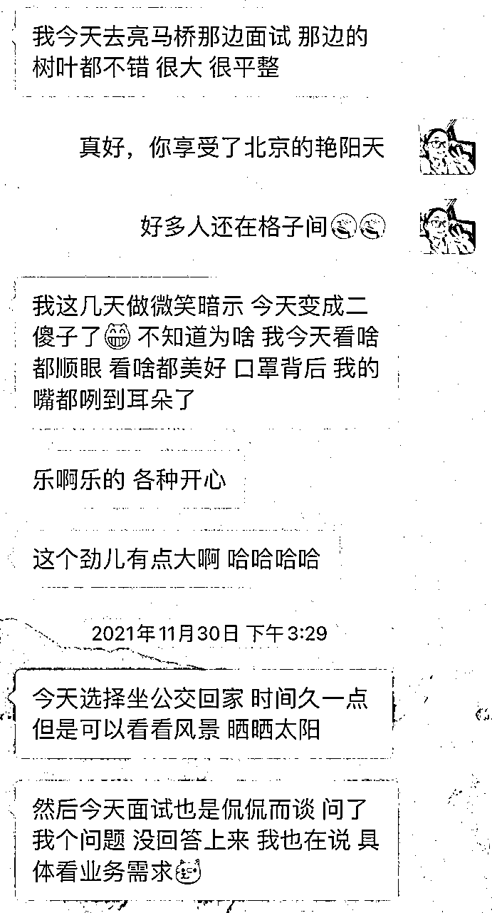
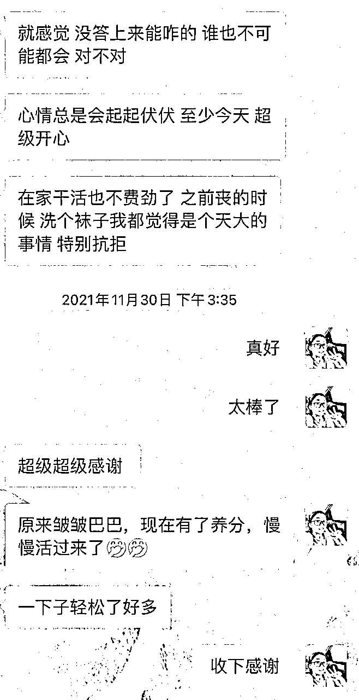
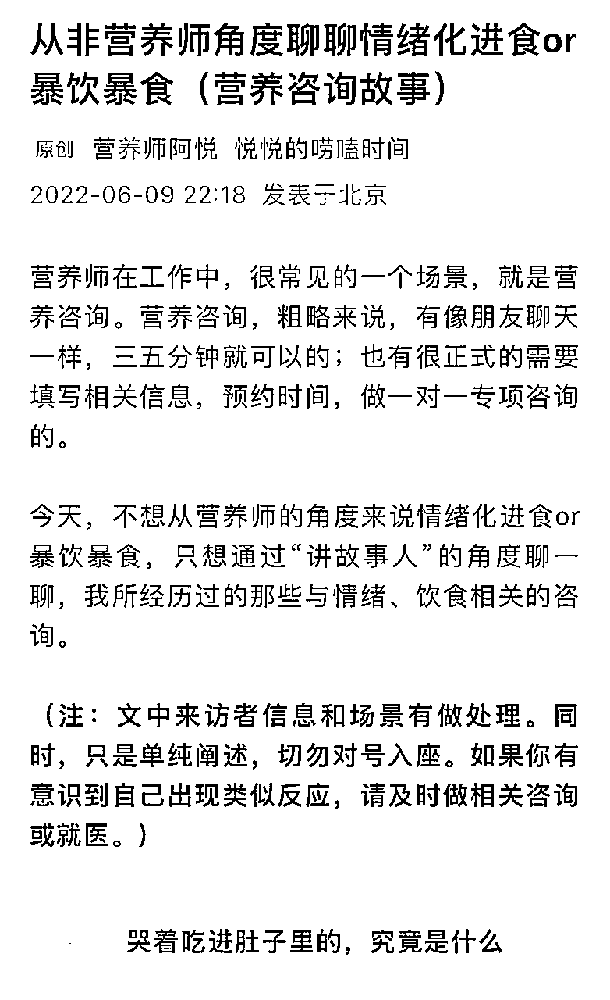

# 暴饮暴⻝胖30斤，发现我只是想要得到父亲的认可。接受心理疗愈法减肥后，3步逆转内核，开启轻装上阵的美好人生

> 来源：[https://n28vbku1px.feishu.cn/docx/MlQddVS8WoulxPxzhJtcMp3Gnwb](https://n28vbku1px.feishu.cn/docx/MlQddVS8WoulxPxzhJtcMp3Gnwb)

一口气瘦下来，你就只吃一次减肥的苦；每次都要重新开始的话，不仅要吃一辈子减肥的苦，还要吃一辈子胖的苦。

大家好，见贴发财健康。我是营养师阿悦，在芷蓝和靠谱的建议下，整理了一篇减肥加疗愈相关的文章，给大家分享，如何通过心理减肥法，找到减肥内核动力，开启人生新篇章，以及减肥加疗愈，我们应该怎么做。接下来，我将从以下3部分展开：

一、客户案例：内在情绪稳定，才能调整生活习惯

二、解决过程：阵痛是必然的，因为我们在重生

三、减肥加疗愈，这个行业如何玩出彩，要注意哪些风险隐患

一、客户案例：内在情绪稳定，才能调整生活习惯

减肥反反复复的人，大部分都与心理、情绪等内在因素有关，而无关自律、执行力。反复重复相似动作，是因为我们一直在原有场景里，并没有跳出来，通过更高视角看待问题本身。

即，减肥失败，从来不是我们的错，也不是方法的错，我们无需自责，换个思路就可以了。

你究竟因为什么原因减肥？还有其他原因吗？我们闭上眼睛，问一下自己：我究竟因为什么原因减肥？为什么你觉得是这个原因呢？真的是这个原因吗？要不要再笃定一下？好，我们可以睁开眼睛了，继续开始我们的营养咨询。

这是面对减肥反复失败，尝试多种减肥方法无果后，找到我的客户，在我们第一次做营养咨询时的部分沟通场景，如果因为“减肥”字眼打开这篇文章的朋友，不妨也尝试着问一下自己。

在我们的沟通交流中发现，原来，来访者的情绪开关在她父亲身上。父亲是一名教师，也是一名严父，所以，来访者从小就把父亲的赞赏、肯定当成前进的动力，因为父亲态度永远不偏不倚，不会唠叨和责骂，只会就事论事，也因此，如果父亲觉得这事不对，她就会思考自己是不是这样做真的不对。

在职场高压环境中，她开始暴饮暴食，发现压力还是无法释放，于是裸辞，继续暴饮暴食，直到胖到，父亲的视频电话来了，关心她最近是不是过劳肥，压力太大，怎么胖了怎么多，她绷不住了，哭了，然后通过朋友介绍，找到我想减肥。

后来，通过我们的沟通，她的心态逐渐改变、她减肥成功，也换到了心仪的工作。

（由改变心态到产生新行动、获得正反馈）

注：客户案例背景有做模糊处理，截图已获授权

这是很典型的暴饮暴食，或者情绪性进食，因为也许吃东西，是我们能够想到的最快的安抚自己情绪的方法，那我们如果想减肥，停止暴饮暴食这个动作就可以了。

以上，外部减肥成功，就完成了，可是内部问题依然存在，因为她的情绪，受太多外界环境因素影响，所以，总在反复减肥，反复成功，反复失败，形成了死循环，被困扰多时却不得其法。

那我们就只有从内在情绪出发，陪她建立内稳态，调整生活习惯。

二、解决过程：阵痛是必然的，因为我们在重生

现实生活中，我们的脑部跑得太快，心却想停下来歇一歇，因此，外部环境与内在需求，就已经造成了一部分矛盾；其次，我们是个性鲜活、感情充沛的人，天然处于人际关系中，避免不了情绪干扰，也造就了，我们有时候需要通过某些方式方法去发泄、舒缓情绪。

在实际的减肥过程中，正念饮食、冥想、瑜伽等，都是我们的情绪出口和载体，我们通过不同的疗愈方法，通过这些让我们自我放松的工具和媒介，去选择一种或多种，实现爱自己的途径。

这也很符合，营养咨询中，我们以人为中心，了解需求、制定个性化健康管理方案的初心。减肥，也是一个从关注人、从内在去支持她改变、产生行动、收获正反馈的过程。

因此，这个过程必然是伴有阵痛的，因为她需要经历知道自己、改变自己、新生自己这3步。

1.知道自己

你敢不敢直视内心，真诚坦然的说出减肥的原因，不带自我批判；你敢不敢说出来，让你的营养师知道，哦，原来你减肥的原因是这样。

我有一个来访者，在经过和男友分手后，胖了10斤左右，一段时间后，男朋友求复合，她找到了我，想要减肥，原因是想变得更好看，然后拒绝她男朋友，告诉他自己已经变好了，看不上他了。

我们的沟通过程中，磕磕绊绊、遮遮掩掩，后来我问她，如果你确定这是你减肥源动力，我们在咨询结束后就会根据这个咨询反馈，制定健康管理方案；如果你不太笃定，我们可以再继续沟通，通过找到核心的动力，制定方案，不仅治标，速度也快。

于是有了她上一段的原因阐述。咨询结束后，她问我，你会觉得我很渣很坏吗？这种原因，是不是不太好……

这有什么不好的呢？让我们自己变得更好，本来就是一切的源动力。外面的人不会批判我们，批判我们的永远是我们自己。

2.改变自己

改变，意味着我们要与一些固有习惯、自己的舒适区说再见，比如，开启减肥后，我们的生活习惯、饮水习惯、进餐先后顺序、心态调整、心理、情绪、睡眠、运动等一系列，也会发生改变。

先转动一个小小的点，然后通过这个点，带动其他点，实现我们从局部到整体，由心到身的转变。可能有的动作，你会下意识重复；可能运动时，你会发现真的好累；可能你真的要从凌晨1、2点睡，慢慢开始培养早睡。

甚至，你开启减肥后，来自爷爷奶奶、外公外婆的关心：宝，你不胖，咱别减；更甚至，家里面的伙食更好了，朋友叫你聚餐的频次也变高了。

还有还有，坚持一段时间，好难，坚持不下去了，怎么办；过了一段时间，我减肥动力变了，咋搞，这些，都是改变过程中自然产生、不可避免的问题。

因此，从心理角度，我们去动态剖析；从营养健康角度，我们优化、改变方案，进入到下一个周期就可以了。内心本自具足，这些变量就不再是挑战，而是机遇。

3.新生自己

婴儿期、儿童期，是很脆弱的阶段，就像我们担心孩子生病、感冒、发烧一样；可同时，这个时期也是最顽强、可能性更多、塑造性更强、接受度更高、恢复度更快的时期。

当我们迎来由内而外的改变，成为了崭新的自己时，已经闯关成功了。内心秩序重新建立，不以他人情绪为导向，不被外界诱惑所裹挟。

减肥那么难的事情，我通过3～6个月都做到了，而且不会反弹，那我还怕什么呢？我减掉不仅的是身上的脂肪，还有自卑的心理；可我收获的是健康的体重、健康的生活方式，更自信、更有底气的自己。

甚至，我因此受益，我想成为传播者、从业者，助人助己，增加副业收入，变成一项事业。

三、减肥加疗愈，这个行业如何玩出彩，要注意哪些风险隐患

身心灵、疗愈，这是近几年，很火的赛道，而通过心理疗愈、心理咨询加上减肥，也是一直就有的方向，只是知道的人可能并不多。

用心理疗愈我们，找到内心减肥失败的根源，可以是我们的卖点、特点，但一定不要把她作为关键点。

因为所有的健康管理方案，都建立在具体的场景之上，餐桌旁、公园跑道、11点就奔向床入睡的你……脱离实际场景，不去行动，只强调内心改变，是有失偏颇的。

所以，如果条件允许，我们可以找一个环境优美的公园、农场，带着来访者、客户，做运动、冥想，或者邀请大家户外正念饮食、瑜伽……

那作为从业者，或者想切入这个赛道的观望者，以下3点风险隐患，一定要注意。

1.减肥，本质上是做健康管理，心理干预只是其中的方法之一

健康管理的终极目标，是找到适合我们自己身心健康的生活方式，并以此为基本盘，开展健康体重、健康睡眠、健康运动、健康心理等多项活动。

心理咨询、心理干预、心理疗愈，都是一种探索自我、治愈自我的方式，可以使用，但并不是全部，可以用这种方式，但不要被这种方式所束缚，也不要刻意放大、鼓吹她的作用。

这是来访者和（营养、心理）咨询师的双向奔赴，是需要双方努力，坦诚、专业、沟通，共创的方案。

2.和来访者共情，但不要产生感情，杜绝来访者依恋情绪

一个拥有强大共情能力的咨询师，是可以与来访者感同身受的，因为只有这样，她才可以同时拥有来访者视角和专业视角，能代入其中，感受来访者的心理变化、情绪挣扎；也能立即抽身，回到专业角色，冷静、客观，提出专业分析。

这个过程中，我们只是来访者和咨询师的关系，没有其他。同时，如果感受到来访者对我们产生了过度依赖，甚至依恋情绪，应妥善保护好来访者的状态，及时与来访者沟通，并完成交接，抽离出去，邀请同样专业的同行介入。

3.心理咨询、心理疗愈，注定是分别的过程，是通过陪伴、鼓励，让来访者独立

授人以鱼，不如授人以渔。在和来访者开启正式的客户关系后，营养师就应该知道且清楚，我们的目标的是通过我们的专业，陪伴来访者拿到理想的健康结果，并让来访者拥有、掌握健康的生活方法的能力。

在综合评估后，不要给来访者过多续期的可能性。比如，以减肥为例的健康管理方案，如果客户是减肥困难户，或者大基数，那么，客户可以做2～3个季度的健康管理，在第4个季度开始，就要准备结束，而不是你转变成了来访者家中的健康大管家，或者她的情绪接收器。

有边界感、有职业底线，有服务范围区间，这些很重要。

所以，让来访者渐渐收到正反馈、且离开我们的专业服务和陪伴后，也能健康生活，也是我们在这段客户关系中，需要修的课题。

热爱可抵岁月漫长，健康、有活力也是，最后，祝我们都平静、欣喜的享受每一天。