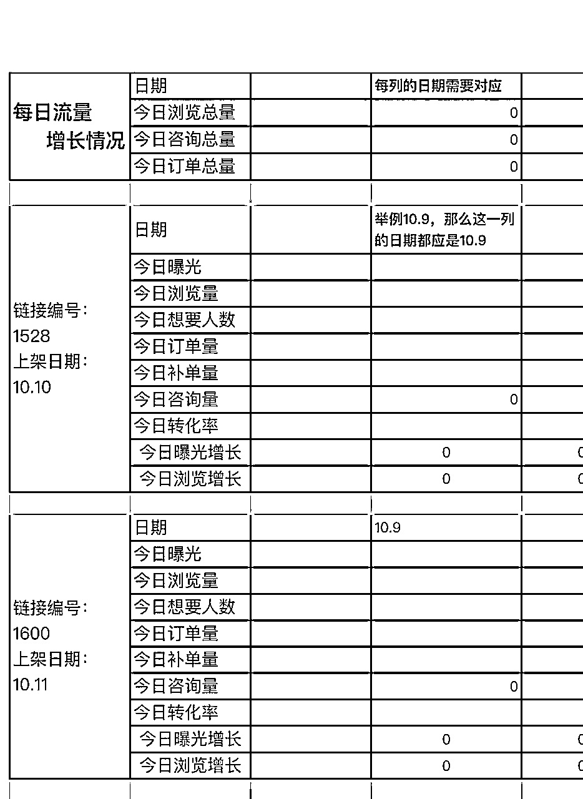

# 《闲鱼小赛道四个月变现利润70万技巧分享及技巧》

> 来源：[https://fziji6736b.feishu.cn/docx/Mn3mdhRVToEbIhx4bzkcvBoNnbf](https://fziji6736b.feishu.cn/docx/Mn3mdhRVToEbIhx4bzkcvBoNnbf)

# 自我介绍

嗨，我是瑜大，一个00后女孩在互联网创业也6年多了。18年17岁运营微商品牌起过万人团队自己也创立了微商品牌自己做品牌出货，2020年疫情放弃985学历大学辍学出来创立直播公司。21年-22年在广州运营了一家5000平方直播基地由于模式认知没有跟上失败结束庆幸的是没有负债剩下3k生活费。到今年失败重新起盘达到闲鱼收益稳定，今天会把重新站起来我做了什么仔细给圈友们分享一下

（前面发了一篇文章，细节太多没有一一分享，我会尽可能更新细致写 我的经历做法及心态望可以给正在看文章的圈友们一点点小启发）

# 7个月拿到的结果

七个月来，2月份多从一个小白一个人去摸索这个电商赛道当时直播公司关了没钱一边在阿道夫公司上班做运营（一边图温饱下班就马上搞电商摸索。）到现在这两天清算账户利润还有接近70万，11月初即将换最新的办公室再小扩一轮规模继续放量跑

怀疑迷茫过：越是低谷越要沉住气！我摸索了红薯无货源跟着航海过，视频号短视频，抖店商品卡都没有取得很好的结果不仅浪费了时间样品花了仅剩的生活费一半的钱。总结：真的好卷！三月份上半个月我陷入了低谷怀疑我自己 从18年到23年我受过这么多人追捧 没有算多大失败 什么事再难好像就像上天眷顾你一样还是巧妙解决了。 唯独这次它没有开后门 没有人可以帮我 跟过街老鼠一样 人人避闲。

说不难受肯定骗人的！车卖所有值钱的能贬都贬值出去 越是困镜越修炼了我的心态变更沉稳 越波澜不惊的新的自己（我自己回头望都特像过山车，我不知道未来还能发生什么，但我有一颗不死的心态随时迎接着）

# 第一个阶段：我是如何从0做到月利润1w+的

### 1:夜想千条路不如迈开第一步

我发现闲鱼这个平台比其他平台入门门槛更低，通过闲鱼朋友嘴巴传述我决定自己试一下。我开始翻阅这个平台，刚开始什么规则都不懂2-3月份看到平台给我推荐留意到了cdd相机在热搜榜单。按照这几年沉淀下来综合运用思维我的潜意识告诉我：这玩意可以干！

刚开始去阿里巴巴寻找没有太多量，发现卖价跟我的批发价只赚20-50块钱，拼多多我也去对比了很多商家怕你套路它不愿意给联系方式和一件代发聊了大约20多家店综合下来找到了一家代发！

### 2:要学会站在巨人的肩膀上去努力

我没有任何闲鱼经验，但我看了基础同行成绩筛选了几家卖的比较不错好评比较高的账号去对标。模仿同行的：头像，名字，背景包括个性签名。我都全部1：1修改类似差不多的。我相信她能成功100%虽然我是行外人当时的我成功60%这就是对我的电商事业很大进步了

### 3:思想会保护你在舒适区，想要增量必须突破自我

按照同行的所有对标，慢慢客户开始上门咨询包括下单。但最初我的货品相机最多一两百撑死了的利润，我发现闲鱼这个平台帖子流量非常大，但毕竟定位的是二手平台！每天很多大部分时间花在了与客户聊天身上 成交最多10几单撑死了！毕竟定位是个人平台 没办法跟抖音，快手投流放量 进度达不到我野心想要的！

虽然这样算下来一个月1w左右全职收益不是问题，突破了很大进步闲鱼小白打怪可以升级第2阶段了。我开始找新的对标案例找寻高利润货盘。居然高度做不了特别高，我就横向发展我不仅要批量扩号复制，我还要增加投入产出比 。不能在新的舒适阶段停止奔跑！

# 第2阶段：从月入1万如何增量到3.5万收入

我思考了一下只有两个方面提升：

1:找到更高利润货盘品，这样才能在一样的时间获得更大产出结果

2:增加账号批量做复制 走过这么多次风口了我心里很能知道这时不去增量复制，风口不是每天都可以盈利。早执行一天多赚一天的钱！我内心明白：大钱一定不是一个月一个月赚的，是一波一波赚到的（这也为后面开一家公司复制做了很大铺垫）

以上这是我第一个闲鱼小白电商第一个阶段起盘过程，接下去我按照一样的思路筛选了新的货盘（投影仪过后就是笔记本电脑），慢慢放量到现在

# 1:货盘的寻找别走寻常路

我发现在阿里巴巴包括拼多多的货盘价格都不算特别有优势，从更换了投影仪阶段后我换了一个思路打法

细节：我在阿里巴巴包括拼多多批量聊供货商但在网上价格还是达不到我内心想要的合适利润！

第一步：通过沟通先筛选综合评分比较可以的厂家，有很多要不是耍大牌要不就是不肯让利 找到态度最起码积极一点有些许实力的

第二步：产生链接合作前也要考察留意发货地址，要去网上找寻大数据，举例：比如苹果手机最强大优势大家一想就知道深圳其次广州 如果他的发货地址举例是苏州 这时就要留意会不会是过了几手的货源。他也有可能不是源头 那么价格优势肯定还有很大水分空间在里面 。毕竟我们的目的是与厂家链接最好 越多人插手环节越多一层一层还有什么利润？

第三步：要让人家看到你的诚意和结果1:肯定要一定的出单数量这是你的最低筹码2:学会趁火往上爬当有一定数量可以朋友身份约厂家拜访吃饭！这时就要拿出酒局文化社交了 该片面走过场还是一定要走！

一万次线上不如一次线下 （因为跟厂家结缘了他带入了我认识了更多数码厂家的圈子）后面的笔记本电脑还有超优势的苹果手机货盘都是这样慢慢沉淀来了

# 2:我可以获得后方变量关键货盘与老板社交技巧

社交上我真诚 大方 善良 大格局 懂感恩的品质被厂家和比我更高的大佬们赏识，过节该送礼我送礼，四月份我去了澳门一趟，三月份我去了惠州 我去到的每一个地方我都会买当地的特产拉回家再打包一个一个邮给帮给供货的厂家及生财里面几个一起交流过让我得到提升的大佬们 我自己都没有吃到特产一分赚的钱都是想拿来充足更多的子弹做更大一点的事～ 。虽然当时赚到的第一个并不多 但我愿意拿3/1出来链接及学习提升

从一开始我并没有入他们的眼，慢慢他们开始留意我的存在并且主动帮助我拉线后面利润更高的货盘厂家介绍给我。

总结：想要向上就得有胆魄，肯弯腰，懂感恩，沉住气，无时无刻要明白自己想要什么！

# 3:个人从1个号，到七八个号需要注意点：

1:账号问题：闲鱼需要支付宝提现到账所以一定要注意⚠️是你可以收到钱的支付宝。扩增过程中我也试过拿别人的账号做货款我垫了 ，在利益面前多少的分成想跑只是满足不满足他想要的金额而已！这个点我踩坑被卷跑了6000块钱货款！所以一定不能走我的老路 只有找亲戚还有认识可靠的解决。个人5-8个账号不是问题

2:设备问题：建议购买iPhone设备操作，不卡顿批量好操作 也不用买太好增加成本！iPhone 7plus是最好的选择目前成本价也是在530左右一台。卡的问题：一卡一机是基本

3:数据管理：居然要运营账号也绝不能马虎，任何的退步及进步当肉眼发现出来的时侯问题已经存在毕竟明显了。每日我都会统计做表观察账号波动情况（这套数据管理方法目前我线上100人线下20多个员工一样每天也在坚持记录 效果只要坚持非常明显）

# 第3阶段：个人变群体增量到一个月10万左右收益核心

因为之前我的广州公司5000平方跑通失败，我也进入了很长一段时间思考，我去大型公司上班包括各种求学看不同的案例。我慢慢发现，其实胆大敢越大步是一个很好的品质但是如果你的投入跟产出比不能跟上的话 还是得要乖乖一步一个脚印走。

我开始一个人测试5个账号一个月收益增到3.5万 ，我开始走复制没有办法登高峰一览众山小 我就复制n个我一样的半山腰出来干矩阵！我开始请人前期3个人一个月后收益除去工资四月份我个人收益占大头，因为他们都是刚上手没有特别多的经验。员工除去工资产出利润是1万3左右我一个人3万多。第一个月我的利润是4.3万左右我没有气馁我知道这是很好的崛起趋势。员工第2个月就开始产出增量了，我再请了3个新人老带新慢慢叠加上手一直滚到现在。

一个人可能走的更快，但一群人才能真正走的更远

请人的核心前提一定要是自己的收益方法技术稳定些了才能扩，前期带团上手很累但培养出三角形了就省事些了（关于团队及公司管理我结合了微商团队及直播基地公司管理综合模式 这些我就在这篇文章不细说了，看这篇分享反响度我会再抽空出来写一篇具体管理）

# 第4阶段：大收益的根本来源

### 归宗还是货盘利润非常重要！其次才是玩法细节再是复制管理群店模式

## 一定要注重选品及好货盘它是你起量翻盘的根本

### 大部分人会走错的弯路，一定要避坑：

1:选择无货源形式，去对接各种货盘以为越多越好。

无货源我也跑过不管多么好做你会发现跑的很多小盈利风口只是昙花一现，看似好像赚了一点钱也只是几k几w打底了。被我们运气好撞到风口还好，撞不到真的一天累死累活赚几百块钱生活费图温饱真的好难受而且还可能持续几个月半年这样半死不活很影响我们独立创业的信心。

我经历了那么多大风口起起落落慢慢不喜欢短暂的昙花我宁愿喜欢细水长流的深耕

1:不被大平台认可这是一条小路

2:利润没有深耕根本没有办法提高投入产出比

3:不稳定性太强对于一个人还好对于带一群人航海风浪太大太危险

2:多类目都去涉及，什么都去沾一腿

赚钱的心，每一个人都会非常急迫当然我也是。我测试过一个账号发布很多样不同类目商品，包括一个账号垂直做一个板块类目测试了一个月左右得到的结果截然不同

多类目的账号流量再大也起不了几十万大流量，一个精准做垂直的类目账号反而每一个星期都会有一条破几十万曝光咨询量上千都是常事。后面我每一个账号都是精准做垂直，平台也会更加细致给你推相对这个板块流量给你。我测试了10几个账号只要垂直精细做一个号一个月怎么样都会有一条几十万曝光给波肉吃！

要做高利润，一定要垂直做，精细做！

3:不注重自己的投入产出比，只会埋头日复一日

前期我也走了一条进度慢的路，我选择走了几十块钱的利润货品。感觉这才是大众喜爱应该会好卖！

我测试过了：蓝牙耳机，相机，冰箱，风扇，文具，虚拟商品，高仿手表，高仿衣服鞋子包包这些等我都测试过不是利润太低就是根本没有特别多的咨询量！

东西确实可以卖但是一个号最多爆了10几单但一个月大部分时间肯定是平平的综合下来一个月50单说利润50块钱一个月2500块钱，可能算一笔数再批量复制确实还能赚一点微薄利润过日子。但算我们的时间精力团队这么多人耗着还不如一个人自己做。团队和我们的时间都耗不起 电商是一个没有根基的行业，不要想法可以赚一辈子 一定要在尽可能的时间内创造最大收益

我开始静下心来筛选货盘去深耕，选了笔记本电脑包括iPhone 14 15手机这两个利润稍微可以的赛道。这两个都是厂家介绍的

### 笔记本电脑：（笔记本电脑对于大学生刚刚上大学以及大学生毕业工作实习都是特别大需求 ）这是常年一个稳定饭碗 每一年一定有学生毕业一定有新生入学 且利润一台我们保底算了一下都有500-1000块钱 2000块钱的客单价 投入产出比就起来了 持续深耕这条赛道目前也是这个类目top榜了，这个类目有小技巧回款周期大约就是3-4天。这样也可以快速让资金回笼！

### 全新苹果手机

### 这是我们的第三阶段一单利润目前大约1200-2000块钱左右，一天一个号可以出10台左右利润产出一个号一天稳定1w左右。这个货盘厂家给了绝对优势，爆量太猛了 我的公司账号都不敢放量账号操。运转资金回款模式最近也在完善跑闭环

不过准备前提是（一定要准备7-15天出货量的资金！客户确认收货周期包括预防大爆了）我测试了4个账号咨询量包括流量都是非常可观，因为价格优势客户超级爽快。

苹果这个品牌这么多年都控价非常严格，可算是数码界里面的黄金硬通货了！降价幅度也不会出现一下子崩盘现象目前是我完全接受可以承担风险范围内。

# 第五：对没有跑通的小伙伴们有几句话说

1:一步一个脚印要坚持深耕

万事都是要坚持，自从我上次发了分享文章 很多圈友们找我沟通。平日只埋头工作没有太多跟圈友们参加线下抛头露面。很多人第一次认识我跟我阐述了特别多他失败的案例。我都会仔细聆听发现在这些案例中大部分都是看到现在信息时代太多赚钱的钩子了导致很容易捡了芝麻丢了西瓜！居然选对了一条路，那就埋头深耕切记不能左顾右盼！

2:抛弃比玻璃还破碎的心

坚持了一个星期没有结果，就抱怨放弃并没有仔细思考原因在哪？遇到问题就推是自己执行的项目本身有问题，从来不从自身思考问题。这样的心态非常难取得一个很好的结果。

### 面对失败挫折我的座右铭一直伴随了我六年：‘凡事杀我不死的，必将使我更加强大’

面对失败不要逃避要积极面对问题。迎难干倒它，塑造成就更加强大的自我

3:选对正确的道路比埋头苦干1万倍都有用

我们每一个人都不是不努力，但一定要努力有方向努力有结果！

判断一个项目能不能做的标准:

从利益出发 该不该做

从风险出发 要不要博

从能力出发 能不能干

从结果出发 划不划算

4：永远要摆正自己的发心

面对困难还是事业规模持续上涨，很多东西都可以摇摆不定但一定要切记有一个良好的发心。

我不管在与客户，厂家，员工还是合作伙伴。永远想着我能给他带来什么有利于他。

一个人能走多远，靠的不是眼睛 我们的认知永远有限。最大的自私是无私，预成大事者，一切始于心，终于心，抱利他之心，行利他之事，所有好的事物自然会倾向于你

最后：真的非常感恩让我与大家相聚，在这个平台让我对新的事物有了新的认知也让我遇到很多有趣的小伙伴们都是我人生的贵人非常感恩

同时也欢迎同在做电商的小伙伴们一起交流 我们一起进步一起学习！一定知无不言 ！